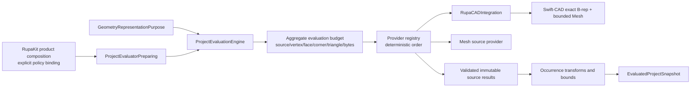
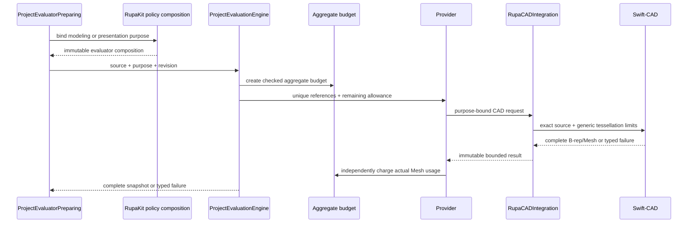

# RupaEvaluation

## Purpose and Scope

`RupaEvaluation` owns provider-neutral projection of one immutable
`ProjectSourceModel` into an `EvaluatedProjectSnapshot`. It is a child of the
[RupaKit package design](../../DESIGN.md) and has no child designs.

The current implementation already selects the representation for
`GeometryRepresentationPurpose`, de-duplicates source references, invokes each
registered provider, validates its result, and derives occurrence transforms
and bounds. Its evaluation request does not yet carry a provider-neutral
aggregate resource reservation, and the product factory currently builds the
CAD evaluator from document modeling tessellation settings for every purpose.
Those are target changes for the responsiveness correction; they must not
change exact B-rep/source authority.

## Responsibilities and Boundaries

`RupaEvaluation` owns:

- representation-purpose selection and deterministic source-provider order;
- provider-neutral aggregate presentation resource accounting;
- checked source, vertex, face, corner, triangle, and estimated-byte usage;
- validation that each provider returns exactly the requested references and
  that their actual Mesh usage remains within the aggregate limit;
- immutable occurrence projection, world-transform composition, and bounds;
- cancellation checkpoints and typed all-or-nothing evaluation failure.

It does not own CAD tessellation formulas or CAD fidelity values, Product LOD
policy, viewport/camera state, source mutation, project publication, package
I/O, rendering, or Agent transport. `RupaKit` product composition chooses the
presentation policy; `RupaCADIntegration` adapts that policy to Swift-CAD;
Swift-CAD owns geometry-aware tessellation admission and emission.

## Related Designs

| Design | Relationship | Contract Used | Summary | Cautions |
|---|---|---|---|---|
| [RupaKit package](../../DESIGN.md) | parent | evaluation dependency and authority direction | Places evaluation between project staging and immutable scene projection. | This module never publishes project state. |
| [RupaProject](../RupaProject/DESIGN.md) | used by | purpose-bound evaluator preparation and staged evaluation | Supplies one immutable source and revision. | A failed evaluation leaves the project transaction unpublished. |
| [RupaKit integration](../RupaKit/DESIGN.md) | used by | product-selected presentation policy | Selects modeling versus presentation fidelity at the existing preparation seam. | No new coordinator or evaluator authority is introduced. |
| [RupaCADIntegration](../RupaCADIntegration/DESIGN.md) | depends on | purpose-specific CAD configuration and cache separation | Adapts provider requests to exact Swift-CAD state. | Exact B-rep reuse is independent of Mesh fidelity. |
| [RupaViewportScene](../RupaViewportScene/DESIGN.md) | used by | immutable evaluated occurrence snapshot | Consumes the completed evaluation for scene construction. | Scene construction does not re-evaluate geometry. |
| [Swift-CAD package](../../../swift-CAD/DESIGN.md) | depends on through provider | exact B-rep and generic tessellation limits | Provides exact topology and bounded derived Mesh. | Kernel does not know Rupa purpose or viewport policy. |

## Architecture

The evaluator preparation seam binds purpose before provider construction. The
evaluation engine still receives the purpose so representation selection and
the prepared policy can be checked for agreement. A presentation policy is a
deterministic value; it is not an actor, coordinator, or second evaluator
factory.

## Contracts and Invariants

1. One evaluation uses one immutable project source, one purpose, and one
   source revision. Every occurrence resolves exactly one representation for
   that purpose; missing or mismatched representation is a typed failure.
2. Provider references are de-duplicated by exact `GeometrySourceReference`
   and submitted in deterministic provider/reference order. Occurrence aliases
   do not charge a source or duplicate Mesh materialization.
3. The provider-neutral aggregate limit contains checked ceilings for unique
   sources, vertices, faces, corners, triangles, and estimated bytes. It is
   cumulative across the entire evaluation, caller-lowerable, and never
   widened by a provider or a product policy.
4. Each provider request carries the checked remaining aggregate allowance.
   A provider must reject predicted growth before allocating a derived result;
   the engine independently charges the returned immutable Mesh before adding
   it to the result map. An overrun, overflow, or malformed result fails the
   whole evaluation with no partial snapshot.
5. The estimate includes all provider-owned Mesh buffers relevant to the
   result, including index/corner and optional attribute storage in the byte
   charge. Arithmetic is checked at every addition and multiplication.
6. `GeometryRepresentationPurpose.modeling` uses the document's modeling
   fidelity and modeling resource policy. `presentation` uses the explicit
   policy bound by `RupaKit` product composition. A presentation policy never
   changes exact B-rep topology, source parameters, modeling tolerance, or
   export policy and never reads a camera or viewport.
7. Exact B-rep/evaluation reuse and Mesh artifact reuse remain separate. The
   former is governed by exact source/evaluator/modeling compatibility; the
   latter additionally requires full Mesh artifact fidelity configuration and
   admitted measured usage.
8. Cancellation is checked before provider work, at each provider/reference
   boundary, and before returning the snapshot. Cancellation and provider
   failure discard the local budget/results and return typed failure; no empty,
   stale, or lower-fidelity fallback is successful.
9. The engine owns no project publication or cache lifecycle. `ProjectController`
   decides whether this complete result can be staged and published.

Hard ceilings and standard defaults are selected by the owning implementation
from measured multi-body fixtures and recorded with the policy version. They
are not guessed in this design. Any change to a ceiling or default requires
rerunning budget-boundary, cancellation, exact-B-rep, and presentation
responsiveness evidence.

## Runtime Flows

## State, Ownership, and Lifecycle

The engine owns invocation-local provider requests, aggregate counters,
transform cache, and result maps. Provider implementations own only
their immutable source/evaluator capability and any lower-level cache allowed
by their own design. `EvaluatedProjectSnapshot` owns immutable values after a
successful return and carries no live provider, project actor, or UI state.

No budget, result, or transform cache crosses an evaluation invocation. The
project layer retains the returned snapshot only as its published immutable
evaluation; a failed or cancelled invocation is discarded.

## Failure, Concurrency, and Constraints

Evaluation is a synchronous value operation invoked by the project actor's
detached work boundary. It must not hold a UI or project critical section while
provider geometry is being materialized. Providers are called in deterministic
sequence for one invocation; any future parallel provider execution must
preserve the same aggregate reservation and result ordering contract.

Typed failures include invalid purpose/representation, unknown provider,
malformed result, source mismatch, budget overflow/exhaustion, provider
failure, and cancellation. The engine never truncates a Mesh, substitutes a
coarser policy silently, returns an empty result, or converts failure into a
successful snapshot.

## Verification and Change Impact

| Invariant | Evidence |
|---|---|
| Purpose binding | Focused evaluator-factory tests prove modeling and presentation bind distinct explicit policies through `ProjectEvaluatorPreparing`; export remains on its existing policy. |
| Exact source/B-rep preservation | Modeling and presentation evaluations compare exact source/B-rep identity and topology while allowing only derived Mesh configuration to differ. |
| Aggregate budget | Provider fixtures reject source/vertex/face/corner/triangle/byte boundary-plus-one before Mesh materialization; checked overflow and no-partial-result behavior are asserted. |
| Cache separation | Incremental exact evaluation reuse succeeds without fidelity equality; Mesh reuse requires full artifact configuration and admitted usage. |
| Cancellation | Cancellation at provider, source, and result boundaries returns typed failure and leaves the source/B-rep and published snapshot unchanged. |
| Projection | Multi-occurrence, alias, transform, bounds, malformed-provider, and deterministic-order tests execute the real engine/provider path. |

Changes to the evaluator preparation seam or aggregate budget require
rechecking `RupaProject`, `RupaKit`, `RupaCADIntegration`, Swift-CAD, and the
system design. Viewport responsiveness is proven by the rendering/application
owners, not by this module's value tests alone.
