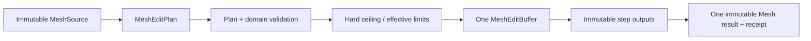
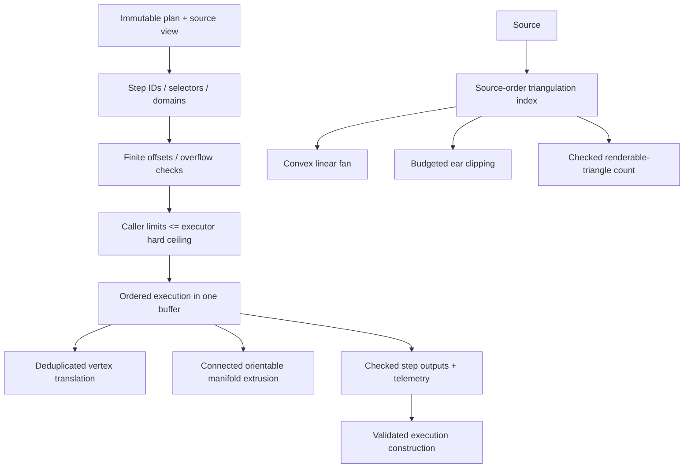

# RupaGeometry Mesh Editing Design

## Purpose and Scope

This module owns provider-independent immutable Mesh data, the bounded,
declarative edit-plan executor introduced by T09, and the source-order
triangulation primitive consumed by presentation rendering. It is a child of the
[RupaKit package design](../../DESIGN.md), with the
[system design](../../../DESIGN.md) as its root parent.

The module has no child component design for T09. Its direct dependency is
`RupaCoreTypes`; its users include `RupaCore`, `RupaEvaluation`,
`RupaProjectModel`, `RupaProjectPackage`, and the `RupaKit` integration target
through the package's native target graph.

## Responsibilities and Boundaries

`RupaGeometry` owns:

- immutable `MeshSource` data and geometry buffer/view ownership;
- the non-empty `MeshEditPlan` with ordered unique step IDs;
- primitive operations `setVertexPositions`, `addFace` using existing vertices,
  and `deleteFaces`, plus `translateElements` and `extrudeFaces`;
- explicit selectors and output roles for retained and staged elements;
- plan structure and numeric-domain validation;
- hard executor ceilings and caller-lowerable effective limits;
- one-buffer execution, staged element outputs, persistent ID allocation, and
  immutable commit receipts;
- constructing a validated execution from the same buffer operations and step
  outputs that produced the result;
- copy telemetry and zero-copy evidence for unchanged storage.
- source-order Mesh triangulation indexes, convex linear-fan triangulation, and
  budgeted non-convex triangulation;
- a checked renderable-triangle count that shares the same triangulation path
  without retaining the emitted triangle topology.

It does not own Product Objects, representation selection, Authored Mesh
provenance, CAD evaluation, project revisions, package paths, UI selection, or
Agent/CLI/MCP transport.

Presentation triangulation is a read-only operation. It borrows the immutable
`MeshSource` buffers, builds one bounded vertex-ID-to-source-index map per
source, and uses source-order face/corner indices for all subsequent reads. It
does not materialize a replacement `GeometryBuffer` or mutate source storage.

The operation/output vocabulary is local to this module:

| Operation/output | Contract |
|---|---|
| `primitive.setVertexPositions` | Updates existing vertex positions. |
| `primitive.addFace` | Adds one face whose loop contains existing vertices only. |
| `primitive.deleteFaces` | Deletes selected faces; deleted IDs are receipt-only. |
| `translateElements` | Accepts explicit or prior-output vertex/edge/face/corner selections, expands mixed domains to one deduplicated vertex set, and applies one finite global offset. |
| `extrudeFaces` | Accepts one face-only region and emits the defined cap, side, edge, vertex, and corner outputs. |
| Output roles | `affectedVertices`, `createdVertices`, `createdEdges`, `createdFaces`, `capFaces`, `sideFaces`, and `createdCorners`; `deletedIDs` is receipt-only. |

Each operation exposes only its applicable output roles: `setVertexPositions`
and `translateElements` produce `affectedVertices`; `addFace` produces
`createdFaces`, newly created `createdEdges`, and `createdCorners`;
`extrudeFaces` produces `createdVertices`, `createdEdges`, retained `capFaces`,
`sideFaces`, and `createdCorners`, with `createdFaces == sideFaces`;
`deleteFaces` produces deleted IDs in the receipt only. Requesting an
inapplicable role, or resolving any selector/output to an empty set, fails with
a typed error before buffer mutation. A non-empty zero-offset translation is
the explicit exception and is a legal no-op.



### Current baseline and target delta

The current source implementation already provides immutable `MeshSource` and
chunked copy-on-write behavior in
[MeshEditBuffer.swift](MeshEditBuffer.swift), with vertex overrides and face
add/delete operations. The current Core command remains one operation. T09-A
adds the plan/executor layer and semantic topology operations; it does not move
project or source authority into this module.

## Related Designs

| Design | Relationship | Contract Used | Summary | Cautions |
|---|---|---|---|---|
| [package design](../../DESIGN.md) | parent package | Package dependency direction and one-source flow | Places this module below Core and Project. | Do not depend upward on project state. |
| [system design](../../../DESIGN.md) | system parent | Cross-boundary one-plan/one-buffer/one-commit contract | Defines how the result is consumed. | System does not replace local topology validation. |
| [CAD/Mesh responsibility](../../../Rupa/CAD_MESH_RESPONSIBILITY_CONTRACT.md) | depends on | Owned-buffer/view and zero-copy baseline | Defines why unchanged Mesh storage should be shared. | Required boundary copies remain measured; “zero-copy” is not universal. |
| [RupaCore design](../RupaCore/DESIGN.md) | used by | Source replacement and identity validation | Consumes the immutable result and receipt. | Core owns asset identity and provenance. |
| [RupaProject design](../RupaProject/DESIGN.md) | used by | Staged transaction/publication | Receives the Core result through source staging. | Project never calls internal buffer helpers directly. |
| [RupaGeometry tests](../../Tests/RupaGeometryTests) | verification owner | Behavioral plan and buffer tests | Owns module-level proof. | Structural existence or parse success is insufficient. |

## Architecture



Primitive edits are the lower-level escape hatch for Core and tests. Semantic
operations are the preferred Agent-facing meaning, but this module itself does
not expose Agent transport. A plan is declarative: no loops, callbacks,
conditionals, arbitrary code, or forward output references.

### Presentation triangulation

`MeshSourceTriangulationIndex` is an immutable source-bound index. It stores
the source identity, vertex count, exact immutable vertex-ID buffer storage
identity, and one bounded dictionary from each `MeshVertexID` to its
source-order position index. The index is validated at the consumer boundary
so a stale index cannot read a different source layout while a value copy that
shares the same immutable storage remains valid.

`MeshSource.triangulate(faceIndex:using:)` reads the face range and corner
vertex IDs by direct source-order indices. A convex planar face, classified by
scale-aware turn signs rather than an absolute coordinate-area threshold, emits
`(v0, vi, vi+1)` in input order, preserving the source winding in linear work.
Non-convex or collinear faces use deterministic ear clipping and charge every
candidate and point-in-triangle inspection against a caller-lowerable hard
work budget. Budget exhaustion is a typed failure; it never returns a partial
triangle list. The existing face-ID API resolves the face once and delegates to
this path, so it cannot perform a global ID scan for every corner.

The triangulation API may report immutable counters for face visits, corner
visits, indexed vertex lookups, position reads, bounded scratch position values,
non-convex work, and global ID scans. The optimized presentation path must
report zero global ID scans after its one source-bound index is built and zero
GeometryBuffer position materialization or copy events. Temporary per-face
arrays used by ear clipping are bounded scratch state and are counted
separately; they are not replacement source buffers.

`MeshSource.triangulatedTriangleCount` builds the source-bound index once,
triangulates every face through `triangulate(faceIndex:using:)` with the same
tolerance and limits as presentation rendering, adds each transient face
result count with checked arithmetic, and then discards that face result. It
returns no topology and never estimates renderability from corner count alone.
The count checks cooperative cancellation before index construction and at
every face boundary so a cancelled caller does not finish an otherwise bounded
full-source traversal.

## Contracts and Invariants

### Plan structure

1. A plan is non-empty. Its steps have unique stable IDs and execute in array
   order.
2. A selector is either an explicit source-element set or an output role from a
   prior step. Missing and forward references fail before mutation.
3. The permitted output roles are `affectedVertices`, `createdVertices`,
   `createdEdges`, `createdFaces`, `capFaces`, `sideFaces`, and `createdCorners`.
   Deleted element IDs are receipt-only and cannot be selected by a later step.
   `setVertexPositions` and `translateElements` emit `affectedVertices`;
   `addFace` emits `createdFaces`, newly created `createdEdges`, and
   `createdCorners`; `extrudeFaces` emits `createdVertices`, `createdEdges`,
   retained `capFaces`, `sideFaces`, and `createdCorners`, with
   `createdFaces == sideFaces`; `deleteFaces` emits receipt-only deleted IDs.
   An inapplicable role or empty resolved set fails before mutation.
4. Primitive `addFace` accepts existing vertex IDs only. Primitive
   `setVertexPositions` addresses existing vertices, and `deleteFaces` emits
   deleted IDs only in the receipt.
5. `translateElements` accepts vertex, edge, face, and corner selections,
   including mixed domains. It expands them to one deduplicated vertex set and
   applies one finite global offset. A zero offset is legal and is a no-op.
6. Operation domains are explicit and invalid mixed-domain use outside the
   translation rule is a typed failure.
7. Every numeric input is finite, overflow-safe, and within the operation's
   declared bounds.

### Execution and topology

1. The executor creates exactly one mutable `MeshEditBuffer` for one plan and
   commits at most once.
2. `translateElements` expands to one deduplicated vertex set and preserves
   existing element IDs and attributes.
3. `extrudeFaces` accepts a non-empty, face-only, connected, orientable
   2-manifold-with-boundary region. Every boundary vertex has degree two. The
   region may contain multiple boundary loops and holes; a closed region with
   no boundary is rejected. Every edge touched by the region has global face
   incidence of at most two; a selected internal edge has incidence two with
   opposite face orientation, and a selected boundary edge has incidence one.
4. Extrusion uses a finite non-zero global offset. Collision and self-intersection
   detection are outside this contract and are not implied by validation.
5. Selected vertices are duplicated once. Selected face IDs are retained as cap
   faces. Selected corner IDs are retained and rewired, selected internal edge
   IDs are retained and rewired, and original boundary edges are retained as
   base edges.
6. Extrusion allocates one new cap edge per boundary edge, one longitudinal edge
   per boundary vertex, one side face per boundary edge, and new corners for all
   side faces. `createdFaces` equals `sideFaces`; `capFaces` contains retained
   selected face IDs.
7. Allocation is deterministic: selected vertices follow source order; cap
   edges follow canonical loop order; longitudinal edges follow boundary vertex
   ID order; side faces and side corners follow loop order. A canonical loop
   starts at its minimum vertex ID, uses the face traversal direction, and loops
   are sorted by their start ID.
8. Deleted IDs are never reused. Outputs are immutable and may be consumed only
   by later plan steps.
9. Topology edits on attributed Meshes fail with a typed error before any
   mutation or allocation. No UV, normal, or other attribute is silently lost.
10. No-op plans, including a zero-offset translation, preserve source identity
    and produce an explicit no-op receipt.

### Triangulation invariants

1. The source-bound index is built once per presentation item and has at most
   one entry per source vertex. It never owns or copies a GeometryBuffer.
2. Face ranges, corner IDs, corner vertex IDs, and positions are read in source
   order with checked index arithmetic. Missing, stale, or out-of-range
   references fail before a result is returned.
3. Triangles preserve the input loop winding. Convex planar faces use a linear
   fan; materially non-convex or collinear faces use deterministic ear clipping.
4. Ear clipping charges candidate and containment work before each charged
   operation. The effective limit cannot exceed the module hard ceiling.
5. A triangulation failure returns no partial triangle result. Existing missing
   face, non-planar, degenerate, and failed error semantics remain stable;
   budget exhaustion and stale index use are additional typed failures.
6. Triangulation never invokes `GeometryBuffer.firstIndex(of:)` on the
   presentation path after index construction. The plan retains the immutable
   source and its source-bound index for later render passes.
7. Renderable-triangle counting uses the same face triangulation contract and
   returns no count if any face is non-planar, degenerate, out of bounds, or over
   budget. Count conversion and accumulation are overflow checked, and source
   position materialization remains zero. Cancellation is observed between
   faces and never returns a partial count.

### Validated execution construction

`MeshEditPlanExecution` is the package-visible immutable, already-validated
result type. Its raw source/receipt initializer is internal to `RupaGeometry`;
only the module can construct it after successful executor commit. The value
owns its immutable `MeshSource` and receipt for their full lifetime and carries
no deferred validation state.

1. `MeshEditPlanExecuting`, `DefaultMeshEditPlanExecutor`, and
   `MeshEditPlanExecution` are package-scoped execution contracts for Core and
   package tests. T09 exposes plans and receipts through the Core command
   boundary, not external Geometry executor conformance or injection. A future
   external executor requires a separately designed candidate contract and one
   Geometry-owned validation boundary; it cannot use an unchecked public
   execution initializer.
2. The default executor establishes receipt semantics during its existing
   ordered traversal. Each step receipt is appended in plan order and checked
   against the operation's exact output-role set, including applicable empty
   arrays. Operation aliases are produced from the same ordered ID array, such
   as `createdFaces` and `sideFaces` for extrusion.
3. Output IDs come directly from the buffer operation that created or affected
   them. Deleted IDs come directly from the active selection accepted by the
   delete operation. The staging buffer remains the sole authority for active
   element lifetime, monotonic allocation, and non-reuse; the executor does not
   reconstruct a second topology ledger from source and result buffers.
4. A prior-step selector resolves against the staging buffer at the consuming
   step. Therefore a created element may be consumed or retired later in the
   same plan. A valid `addFace` followed by deletion of that step's
   `createdFaces` remains valid even though the created face and its corners are
   absent from the final source; its allocated IDs remain consumed by the
   buffer's allocation state.
5. Commit preserves the source identity, constructs one valid immutable result
   source, sets `didChange` from direct original/result inequality, and enforces
   the effective copy limit before constructing `MeshEditPlanExecution`.
6. There is no post-commit operation replay. Execution construction does not
   expand selections again, rederive extrusion topology, rebuild element
   lifecycle, or rescan and revalidate the original/result sources. The executor
   relies on the validated-by-construction input `MeshSource`; buffer commit
   constructs the result through its existing validating boundary once. Failure
   of a step, buffer commit, receipt invariant, or limit returns a typed error
   and constructs no execution value.

### Limits and zero-copy

The T09 standard defaults are also the current executor hard ceilings. Effective
limits are `requested ?? standard`; a requested value above its hard ceiling is
rejected, never clamped. A caller may lower a limit but may not raise it.

| Limit | Standard default | Hard ceiling |
|---|---:|---:|
| Steps | 256 | 256 |
| Scanned records | 1,048,576 | 1,048,576 |
| Selected IDs | 8,192 | 8,192 |
| Generated IDs | 8,192 | 8,192 |
| Receipt IDs | 8,192 | 8,192 |
| Copied bytes | 65,536 | 65,536 |

Preflight checks all statically predictable counts before scanning, selection
expansion, allocation, or output. Cumulative counters are checked at each of
those boundaries, not only at the end. After commit, copy telemetry is checked
again; more than 65,536 copied bytes is a typed failure.

Receipt checks use the IDs and buffer state already available at those charged
boundaries. They do not introduce an uncharged second source/topology scan.

The source remains shared for unchanged chunks/pages. Only modified chunks,
appended topology, and explicitly required remapping buffers are copied. Every
required copy is recorded with a reason. Changing the 65,536-byte ceiling
requires updating `GeometryBufferPerformanceContract` and its benchmark;
changing the other ceilings requires this design and the boundary tests.

Every zero-copy claim requires source/result buffer identity plus copy telemetry
or a named benchmark.

Triangulation uses a separate hard budget because a face can contain many
corners without changing the Mesh edit limits:

| Limit | Standard default | Hard ceiling |
|---|---:|---:|
| Face corners | 16,384 | 16,384 |
| Non-convex work units | 1,000,000 | 1,000,000 |

The standard and hard limits are explicit and callers may only lower them. The
standard limits accept the measured approximately 6,000-segment convex
cylinder through the scale-aware linear fan. A non-convex face that would
exceed the work budget fails with `MeshTriangulationError.Code.budgetExceeded`;
the budget is never relaxed based on elapsed time or a successful partial
result.

## Runtime Flows

```mermaid
sequenceDiagram
    participant C as Core
    participant E as Executor
    participant B as MeshEditBuffer
    C->>E: immutable source + validated plan
    E->>B: create one staging buffer
    loop ordered steps
        E->>B: resolve retained/prior-step selector
        B-->>E: staged IDs and output records
        E->>E: check exact roles and direct aliases
    end
    E->>B: commit once
    B-->>E: valid immutable Mesh result
    E->>E: check identity, didChange, telemetry; construct execution
    E-->>C: validated execution
```

On any step failure, the buffer is discarded and no partial result is returned.
The executor never mutates the caller's immutable source.

## State, Ownership, and Lifecycle

- `MeshSource` owns immutable geometry buffers and their lifetime.
- The executor borrows an immutable source for one invocation.
- `MeshEditBuffer` owns mutable overlays for the invocation and is discarded on
  failure or after commit.
- Step outputs are transient immutable values. They are not persisted plans or
  source authority.
- Persistent Authored Mesh asset identity and provenance are assigned by
  `RupaCore`, not by this module.

No `await`, I/O, or external callback occurs inside a mutable buffer borrow.
The value types and executor result are `Sendable`; project actor isolation is
owned by the caller above this module.

## Failure, Concurrency, and Constraints

Typed failures cover empty/duplicate/forward references, invalid element or
operation domains, stale or missing source elements, non-finite values,
integer/size overflow, budget exceedance, invalid face loops, disconnected or
non-manifold regions, inconsistent orientation, and unsupported attribute
remapping.

The module does not use target-conditional raw mutable state. Native, ordinary
WASM, and Embedded consumers receive the same immutable-source and single
mutable-buffer contract; platform synchronization belongs above this module.

## Verification and Change Impact

The module proof is T09-A:

| Invariant | Required evidence |
|---|---|
| Structure and selectors | Empty, duplicate, missing, forward, mixed-domain, and malformed plan tests. |
| Semantic behavior | Translate and extrusion output chaining, deterministic IDs, repeated-face-region cases, and no-op tests. |
| Topology validity | Disconnected, inconsistent, non-manifold, and invalid offset rejection tests. |
| Attribute contract | Attribute-preserving translation and typed topology-remap failure tests. |
| Atomicity | Mid-plan failure leaves no committed result. |
| Execution semantics | Exact step roles/order and aliases from direct buffer results, persistent allocation/non-reuse, valid create-then-delete plans, and absence of a second topology replay. |
| Performance | Unchanged chunk identity, one-buffer telemetry, hard-boundary limits, measured copy ceilings, source-order triangulation counters, convex linear-fan work, and typed non-convex budget failure. |
| Renderable triangle count | Exact multi-face count, non-planar and degenerate rejection, budget failure, checked overflow, zero global identifier scans after index construction, and zero source-position materialization. |

Changes to source buffer layout, ID allocation, attribute handling, or executor
limits require rechecking the package and system designs and the RupaCore
assumptions about receipts and asset replacement.
