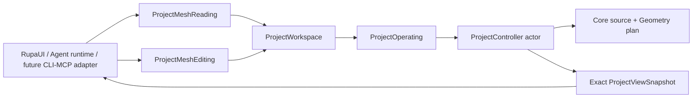
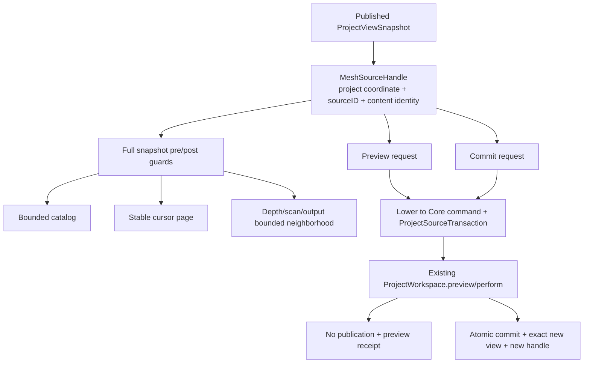
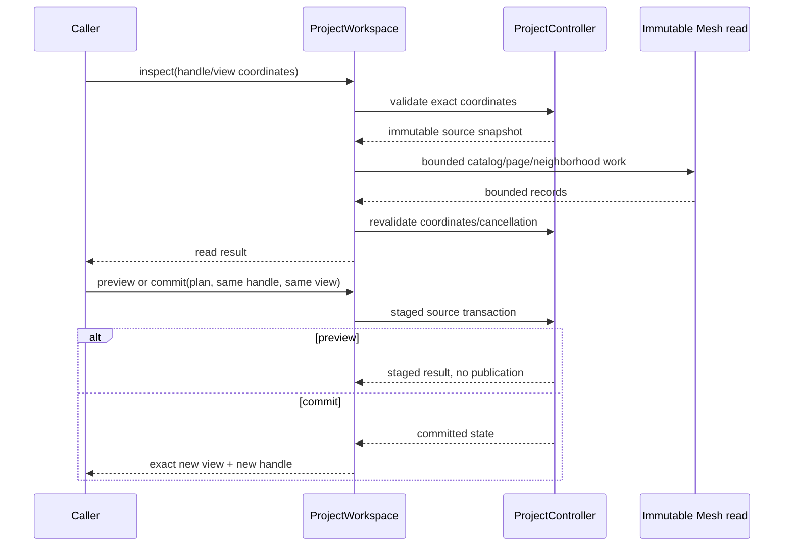

# RupaKit Mesh Use-Case Integration Design

## Purpose and Scope

This module is the application-facing, transport-neutral boundary for Agent-
ready Authored Mesh reads and edits. It is a child of the [RupaKit package
design](../../DESIGN.md) and the [system design](../../../DESIGN.md).

Its direct users are the existing `RupaUI`, Agent runtime/UI, and future CLI or
MCP adapters. T09 adds no protocol, CLI, or MCP type; those adapters will call
these use cases later.

The module depends on `RupaCore`, `RupaCoreTypes`, `RupaGeometry`,
`RupaProject`, `RupaProjectModel`, `RupaEvaluation`, `RupaAutomation`, and
existing integration targets as declared by `Package.swift`.

Parent: [RupaKit package design](../../DESIGN.md). Children: none for T09.

## Responsibilities and Boundaries

`RupaKit` owns:

- MainActor `ProjectWorkspace` use-case adaptation;
- the sole transport-neutral Mesh read authority;
- immutable Mesh source handles bound to the exact project authority coordinate,
  `GeometrySourceID`, and `ContentIdentity`;
- bounded catalog, paged element, and neighborhood reads with stable ordering;
- preview and commit request/result contracts over the existing
  `ProjectController`/`ProjectOperating` path;
- lowering a Mesh edit request to a Core source command carried by the existing
  `ProjectSourceTransaction`;
- full `ProjectViewSnapshot` validation before and after reads, plus
  revalidation, cancellation propagation, and exact-view return behavior.

It does not own Mesh topology algorithms, source asset replacement, project
actor state, package encoding, Agent protocol envelopes, CLI parsing, MCP
transport, project-level generic staging rules, or a shadow project/session
authority.

The read records are transport-neutral values owned by this module:

| Read value | Required contents/order |
|---|---|
| Catalog | Sources sorted by raw `sourceID`; each source reports provenance, counts, bounds, and references. References sort by raw `sceneNodeID`, then raw `representationID`, then purpose order `modeling`, `presentation`; empty source bounds are `nil`. |
| Element page | Source-buffer order. Cursor binds `sourceID`, content identity, element domain, and `nextIndex`. Vertex records contain ID and position; edge records contain ID and endpoints; face records contain ID and ordered corner IDs; corner records contain ID, face, vertex, edge, previous, and next IDs. |
| Neighborhood | Breadth-first graph over only edge-endpoint/vertex, face-corner, corner-vertex, and corner-edge relations. Results sort by distance, domain order `vertex`, `edge`, `face`, `corner`, then raw ID. |

Read limits use the same effective-limit rule as Mesh edits: `requested ??
standard`, lowerable by the caller and never clamped above a hard ceiling.

| Read limit | Standard default | Hard ceiling |
|---|---:|---:|
| Sources | 4,096 | 4,096 |
| Page records | 1,024 | 1,024 |
| Neighborhood depth | 8 | 8 |
| Scanned records | 1,048,576 | 1,048,576 |
| Output records | 4,096 | 4,096 |
| Reference units | 8,192 | 8,192 |

Reference units include records and nested IDs. A page or neighborhood response
never returns a partial record to satisfy a limit.

### Current baseline and T09 delta

[ProjectWorkspace.swift](ProjectWorkspace.swift) already exposes exact
snapshot-aware `preview`, `perform`, and Automation routes. T09-C adds
Mesh-specific read/preview/commit use cases on that route. Existing
`meshSummary`/presentation data remains evaluated output; it is not treated as
the Authored Mesh source catalog.

## Related Designs

| Design | Relationship | Contract Used | Summary | Cautions |
|---|---|---|---|---|
| [package design](../../DESIGN.md) | parent package | Package boundaries and no transport change | Places RupaKit above Project. | Do not move source authority into this module. |
| [system design](../../../DESIGN.md) | system parent | Inspect/preview/commit flow | Defines exact source and view behavior. | A returned view must be the exact operation result. |
| [RupaProject design](../RupaProject/DESIGN.md) | depends on | Project staging and publication | Provides the actor-backed authority port. | Use existing `ProjectOperating`; no second controller. |
| [RupaCore design](../RupaCore/DESIGN.md) | used through Project | Source ID/content identity and shared asset rules | Defines what a Mesh handle targets. | Scene/representation context is navigation only. |
| [RupaGeometry design](../RupaGeometry/DESIGN.md) | used through Core | Plan/executor/budget/receipt | Defines request semantics without transport knowledge. | Do not expose internal mutable buffers. |
| [State and project contract](../../../Rupa/STATE_AND_PROJECT_CONTRACT.md) | depends on | Workspace and project snapshot lifecycle | Defines stale/cancel/no-retry behavior. | No post-commit replay on view projection failure. |
| [RupaKit tests](../../Tests/RupaKitTests) | verification owner | Use-case and workspace tests | Owns handle, pagination, preview, and exact-view proof. | Must exercise the real workspace/project path. |

## Architecture

Heavy reads may execute outside the MainActor on immutable source snapshots,
but both pre-read and post-read coordinates are validated through the project
authority before returning data.

## Contracts and Invariants

1. A Mesh source handle binds `ProjectAuthorityCoordinate`,
   `GeometrySourceID`, and `ContentIdentity`. The exact `ProjectViewSnapshot`
   is a separate required input; a handle alone is not an authority coordinate.
2. Before and after every read, RupaKit validates project ID, document
   generation, transaction revision, publication sequence, and workspace
   revision from the supplied full snapshot. It rejects stale values rather
   than silently refreshing to current state.
3. Catalog output is the sole read authority for retained Mesh sources. Sources
   sort by raw source ID and report provenance, counts, bounds, and all retained
   references. References sort by raw `sceneNodeID`, then raw
   `representationID`, then purpose order `modeling`, `presentation`; they
   contain `sceneNodeID`, `representationID`, and purpose. Empty source bounds
   are `nil`.
4. Element pages follow source-buffer order. A cursor is bound to source ID,
   content identity, element domain, and next index. Vertex, edge, face, and
   corner records contain exactly the fields defined in the read-value table.
5. Neighborhood queries use breadth-first traversal over only edge-endpoint
   vertex, face-corner, corner-vertex, and corner-edge relations. Results sort
   by distance, domain order (`vertex`, `edge`, `face`, `corner`), then raw ID.
6. Read effective limits are `requested ?? standard`; callers may lower them but
   values above hard ceilings are rejected, never clamped. Record and nested-ID
   reference units are cumulative, and no partial record is returned.
7. RupaKit lowers a validated Mesh edit request to a Core source command and
   passes it through the existing `ProjectSourceTransaction`. `RupaProject`
   receives only generic project ID, transaction revision, and publication
   coordinates.
8. Preview requires the same exact handle and full snapshot coordinates, stages
   one plan, and returns no publication. Its result cannot be promoted as source
   authority.
9. Commit requires the same exact handle and full snapshot coordinates,
   revalidates at the ProjectController boundary, and returns the exact
   committed view plus a new source handle.
10. One commit is one project transaction, one revision advance at most, and one
    source-history entry. Shared Authored Mesh references observe the same asset.
11. Cancellation and stale pre/post-read or commit coordinates return typed
    failure/no-retry outcomes and never silently refresh to the current view.
12. No AgentProtocol, CLI, or MCP change is part of this module's T09 scope.

## Runtime Flows

If a source/project coordinate becomes stale while a heavy read is running, the
read result is rejected rather than silently relabeled as current.

## State, Ownership, and Lifecycle

- `ProjectViewSnapshot` is the caller's immutable observation anchor.
- A source handle and cursor are immutable values; they do not retain mutable
  workspace/session state beyond the documented source identity coordinate.
  The full snapshot remains a separate required value for every read and edit.
- `ProjectWorkspace` owns observable view replacement on MainActor.
- `ProjectController` owns source publication, history, package, evaluation,
  and revision state.
- Bounded read response records are materialized at the read boundary and do
  not expose Geometry buffer pointers or leases beyond their lifetime.

## Failure, Concurrency, and Constraints

The module reports typed failures for missing source, stale project/view/source
coordinate, invalid cursor, page/neighborhood limit exceedance, cancellation,
preview/commit result mismatch, and post-commit view projection failure. It does
not return empty or current-state fallback data for an unsupported or stale
request.

The MainActor adapter never holds a Geometry mutable buffer. Heavy scans use
immutable values outside the actor and revalidate the full snapshot before and
after returning. Transport processes and external callbacks are outside this
module's ownership.

## Verification and Change Impact

T09-C owns the following behavioral proof:

| Invariant | Required evidence |
|---|---|
| Handle authority | Catalog/reference accuracy, stale handle, source/content mismatch, and separate full-snapshot validation. |
| Bounded reads | Raw source-ID catalog order, source-buffer pagination, cursor mismatch, neighborhood graph/order, depth/scan/output/reference-unit limits, and bounded materialization. |
| Record integrity | Vertex/edge/face/corner field completeness, empty bounds as `nil`, and no partial record at a limit boundary. |
| Cancellation | Full project/generation/transaction/publication/workspace pre/post-read checks and cancellation rejection. |
| Preview | No source/package/evaluation/history/view publication. |
| Commit | Exact-view publication, one revision/undo, new handle, shared-source routing. |
| Post-commit behavior | View projection failure reports exact committed coordinates with no-retry semantics. |
| Scope | No AgentProtocol/CLI/MCP source changes. |

Changes to the use-case request shape, snapshot coordinate, read materialization,
or workspace publication require rechecking the Project and system designs.
