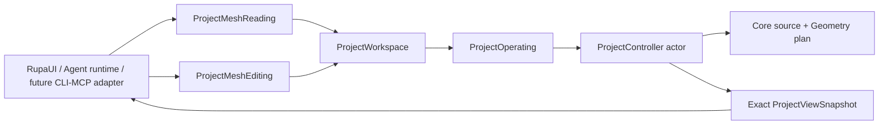
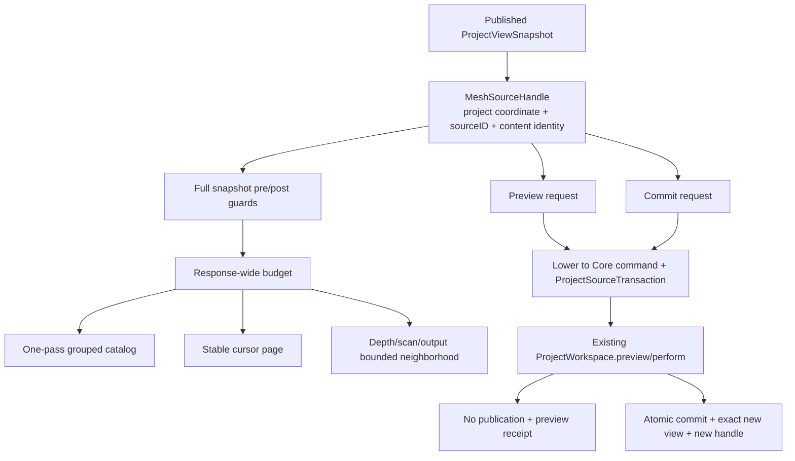
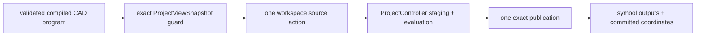
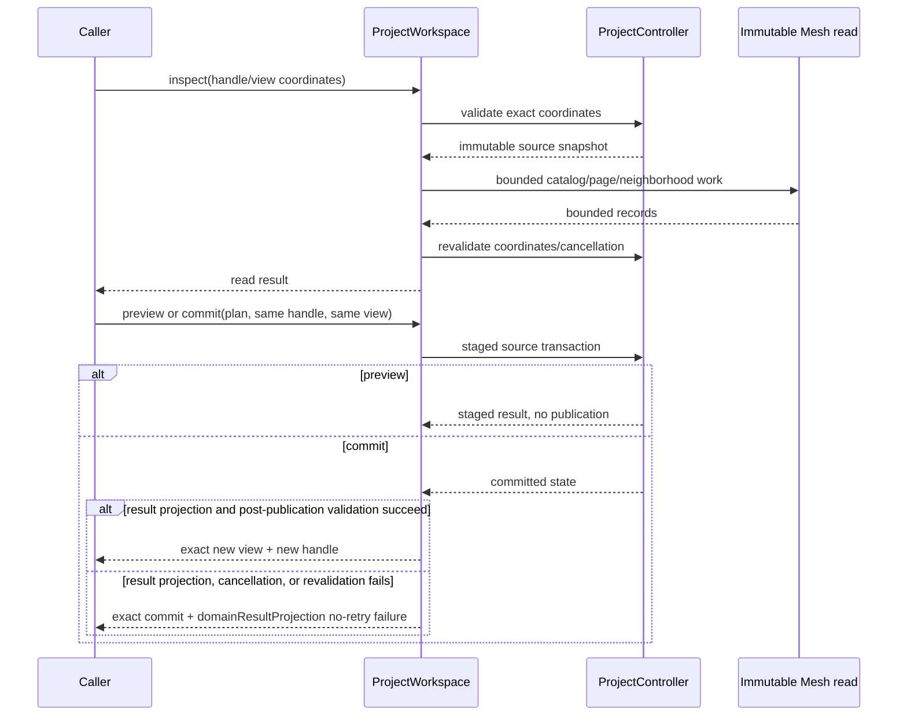

# RupaKit Application Use-Case Integration Design

## Purpose and Scope

This module is the application-facing, transport-neutral boundary for Agent-
ready Authored Mesh reads/edits, CAD Make Editable, and execution of a compiled
CADAPI-D source program against one exact project view. It is a child of the
[RupaKit package design](../../DESIGN.md) and the
[system design](../../../DESIGN.md).

Its direct users are the existing `RupaUI` and Agent runtime/UI. T10 connects
AgentProtocol/Runtime to these use cases. `RupaProjectAccess` and its adapters
may reach them only through a registered `ProjectWorkspace`; CLI and MCP never
gain direct source or package authority.

The module depends on `RupaCore`, `RupaCoreTypes`, `RupaGeometry`,
`RupaProject`, `RupaProjectModel`, `RupaEvaluation`, `RupaAutomation`, and
existing integration targets as declared by `Package.swift`.

Parent: [RupaKit package design](../../DESIGN.md). Children: none.

## Responsibilities and Boundaries

`RupaKit` owns:

- MainActor `ProjectWorkspace` use-case adaptation;
- the sole transport-neutral Mesh read authority;
- immutable Mesh source handles bound to the exact project authority coordinate,
  `GeometrySourceID`, and `ContentIdentity`;
- bounded catalog, paged element, and neighborhood reads with stable ordering;
- response-wide read budgets charged before output materialization;
- preview and commit request/result contracts over the existing
  `ProjectController`/`ProjectOperating` path;
- lowering a Mesh edit request to a Core source command carried by the existing
  `ProjectSourceTransaction`;
- full `ProjectViewSnapshot` validation before and after reads, plus
  revalidation, cancellation propagation, and exact-view return behavior.
- Project-view composition that keeps every retained/evaluated occurrence but
  emits viewport items only for effectively visible Product scene nodes.
- an exact-snapshot Make Editable use case that asks `ProjectOperating` to
  prepare the current CAD modeling evaluation, commits it through one existing
  source transaction, and returns the exact view plus new Mesh handle.
- adaptation of one fully validated semantic CAD invocation/program to one
  `ProjectSourceTransaction`, preserving exact planning coordinates and the
  `RupaAutomation` typed result bindings.

It does not own Mesh topology algorithms, source asset replacement, project
actor state, package encoding, Agent protocol envelopes, CLI parsing, MCP
transport, semantic CAD operation definitions, program graph compilation,
project-level generic staging rules, or a shadow project/session authority.

The read records are transport-neutral values owned by this module:

| Read value | Required contents/order |
|---|---|
| Catalog | Sources sorted by raw `sourceID`; each source reports provenance, counts, bounds, and one reference record for every matching retained representation. Each reference contains `sceneNodeID`, `representationID`, and `selectedPurposes`; purposes sort `modeling`, then `presentation`, and an unselected representation has an empty array. References sort by raw `sceneNodeID`, then raw `representationID`; empty source bounds are `nil`. |
| Element page | Source-buffer order. Cursor binds `sourceID`, content identity, element domain, and `nextIndex`. Vertex records contain ID and position; edge records contain ID and endpoints; face records contain ID and ordered corner IDs; corner records contain ID, face, vertex, edge, previous, and next IDs. |
| Neighborhood | Breadth-first graph over only edge-endpoint/vertex, face-corner, corner-vertex, and corner-edge relations. Results sort by distance, domain order `vertex`, `edge`, `face`, `corner`, then numeric `UInt64` raw ID. |

Read limits use the same effective-limit rule as Mesh edits: `requested ??
standard`, lowerable by the caller and never clamped above a hard ceiling.

| Read limit | Standard default | Hard ceiling |
|---|---:|---:|
| Sources | 4,096 | 4,096 |
| Page records | 1,024 | 1,024 |
| Neighborhood depth | 8 | 8 |
| Scanned records | 1,048,576 | 1,048,576 |
| Output records | 4,096 | 4,096 |
| Reference units | 8,192 | 8,192 |

One catalog reference consumes exactly three reference units: one record, one
`sceneNodeID`, and one `representationID`. Read budgets are cumulative across an
entire response and are consumed before the corresponding output is
materialized. A page or neighborhood response never returns a partial record to
satisfy a limit.

### Current baseline and T09 delta

[ProjectWorkspace.swift](ProjectWorkspace.swift) already exposes exact
snapshot-aware `preview`, `perform`, and Automation routes. T09-C adds
Mesh-specific read/preview/commit use cases on that route. Existing
`meshSummary`/presentation data remains evaluated output; it is not treated as
the Authored Mesh source catalog.

## Related Designs

| Design | Relationship | Contract Used | Summary | Cautions |
|---|---|---|---|---|
| [package design](../../DESIGN.md) | parent package | Package boundaries and no transport change | Places RupaKit above Project. | Do not move source authority into this module. |
| [system design](../../../DESIGN.md) | system parent | Inspect/preview/commit flow | Defines exact source and view behavior. | A returned view must be the exact operation result. |
| [RupaProject design](../RupaProject/DESIGN.md) | depends on | Project staging and publication | Provides the actor-backed authority port. | Use existing `ProjectOperating`; no second controller. |
| [RupaProjectAccess](../RupaProjectAccess/DESIGN.md) | used by | transport-neutral live target/session intent | Composes live access above the App-owned workspace. | Access adapters cannot call Core or edit package entries directly. |
| [RupaCore design](../RupaCore/DESIGN.md) | used through Project | Source ID/content identity and shared asset rules | Defines what a Mesh handle targets. | Scene/representation context is navigation only. |
| [RupaGeometry design](../RupaGeometry/DESIGN.md) | used through Core | Plan/executor/budget/receipt | Defines request semantics without transport knowledge. | Do not expose internal mutable buffers. |
| [RupaDomainFoundation](../RupaDomainFoundation/DESIGN.md) | depends on | validated semantic program and exact route/effect | Supplies the generic one-vocabulary compiler contract. | RupaKit must not re-resolve or reinterpret semantic nodes. |
| [RupaAutomation](../RupaAutomation/DESIGN.md) | depends on | binding-aware prepared source execution | Applies one resolved source plan to caller-owned staging. | Raw feature graphs never become an application-facing input. |
| [State and project contract](../../../Rupa/STATE_AND_PROJECT_CONTRACT.md) | depends on | Workspace and project snapshot lifecycle | Defines stale/cancel/no-retry behavior. | No post-commit replay after any publication-success projection or validation failure. |
| [RupaKit tests](../../Tests/RupaKitTests) | verification owner | Use-case and workspace tests | Owns handle, pagination, preview, and exact-view proof. | Must exercise the real workspace/project path. |

## Architecture

Heavy reads may execute outside the MainActor on immutable source snapshots,
but both pre-read and post-read coordinates are validated through the project
authority before returning data.

CADAPI-D composes beside the Mesh use cases without changing their authority:

## Contracts and Invariants

1. A Mesh source handle binds `ProjectAuthorityCoordinate`,
   `GeometrySourceID`, and `ContentIdentity`. The exact `ProjectViewSnapshot`
   is a separate required input; a handle alone is not an authority coordinate.
2. Before and after every read, RupaKit validates project ID, document
   generation, transaction revision, publication sequence, and workspace
   revision from the supplied full snapshot. It rejects stale values rather
   than silently refreshing to current state.
3. Catalog output is the sole read authority for retained Mesh sources. Sources
   sort by raw source ID and report provenance, counts, bounds, and all retained
   references. Every retained representation whose source is the catalog source
   produces exactly one reference record, whether selected or not. A record
   contains `sceneNodeID`, `representationID`, and `selectedPurposes`.
   `selectedPurposes` sorts `modeling`, then `presentation` and is empty when
   that representation is unselected. References sort by raw `sceneNodeID`,
   then raw `representationID`. Empty source bounds are `nil`.
4. Element pages follow source-buffer order. A cursor is bound to source ID,
   content identity, element domain, and next index. Vertex, edge, face, and
   corner records contain exactly the fields defined in the read-value table.
5. Neighborhood queries use breadth-first traversal over only edge-endpoint
   vertex, face-corner, corner-vertex, and corner-edge relations. Results sort
   by distance, domain order (`vertex`, `edge`, `face`, `corner`), then the
   numeric `UInt64` raw ID. String formatting is not an ordering authority.
6. Read effective limits are `requested ?? standard`; callers may lower them but
   values above hard ceilings are rejected, never clamped. One response-scoped
   budget accumulates every source, scene node, representation, source element,
   and relation record actually visited. Known traversal costs are preflighted
   before result materialization; dynamically discovered catalog references
   consume their record plus nested-ID units before append. One catalog
   reference always consumes three units. No hidden repeated linear scan is
   excluded from the scan count, and no partial record is returned.
7. Catalog construction traverses scene nodes and their representations once,
   groups matching representation references by source, and then accumulates
   source element/bounds scans in the same response budget. It does not rescan
   all scene nodes for each source. Corner paging uses a monotonic, logarithmic,
   or precomputed face lookup whose visited records remain within the declared
   budget. Neighborhood construction creates its ID indices and adjacency once;
   result lookup is O(1) and does not replay linear source searches.
8. RupaKit lowers a validated Mesh edit request to a Core source command and
   passes it through the existing `ProjectSourceTransaction`. `RupaProject`
   receives only generic project ID, transaction revision, and publication
   coordinates.
9. Preview requires the same exact handle and full snapshot coordinates, stages
   one plan, and returns no publication. Its result cannot be promoted as source
   authority.
10. Commit requires the same exact handle and full snapshot coordinates,
   revalidates at the ProjectController boundary, and returns the exact
   committed view plus a new source handle.
11. After Project publication succeeds, result extraction, result/view/asset/
    handle validation, cancellation, and post-publication coordinate
    revalidation failures are reported as `ProjectWorkspacePostCommitError` at
    `domainResultProjection`, carrying the exact committed coordinates and an
    explicit no-retry outcome. They are never downgraded to a pre-commit Mesh
    edit error and never replay the mutation.
12. One commit is one project transaction, one revision advance at most, and one
    source-history entry. Shared Authored Mesh references observe the same asset.
13. Cancellation and stale pre/post-read or commit coordinates return typed
    failure/no-retry outcomes and never silently refresh to the current view.
14. T10 AgentProtocol adapts these contracts but does not move authority into
    the wire layer; CLI and MCP changes remain out of scope.
15. Make Editable retains the CAD representation and modeling selection, adds
    one `derivedFromCAD` Authored Mesh asset/representation, optionally switches
    presentation, returns a handle bound to the exact committed view, and
    preserves the existing postcommit no-retry contract.
16. Product visibility affects only the published project viewport. The source
    projection and presentation evaluation retain hidden occurrences, while the
    `ProjectViewSnapshot` filters items using Core's hierarchy-aware effective
    visibility and preserves the complete occurrence-to-scene navigation index.
17. A CADAPI-D action accepts only a fully validated, source-only compiled plan
    from the shared semantic compiler. It never accepts a wire DTO, raw
    `FeatureGraphTransaction`, or caller-owned persistent identifiers.
18. The complete compiled plan is one workspace action and at most one
    `ProjectSourceTransaction`, exact evaluation, undo entry, workspace
    revision, and publication. Nodes are never individually published.
19. RupaKit revalidates the exact project/generation/transaction/publication/
    workspace coordinates before staging and before publication. It does not
    silently refresh or recompile against a newer view.
20. Successful result projection returns every requested typed symbol binding,
    exact committed coordinates, diagnostics, and expansion telemetry. Any
    failure after publication retains the exact commit and `mustNotRetry`.
21. CADAPI-D mutation and explicit save are separate application actions. This
    use case never saves implicitly or edits package bytes.

## Runtime Flows

If a source/project coordinate becomes stale while a heavy read is running, the
read result is rejected rather than silently relabeled as current.

For a compiled CAD program, RupaKit captures one exact view, validates the
prepared plan against it, submits one source transaction whose source closure
uses the binding-aware Automation executor, evaluates the completed staged
document once, and publishes only the final state. Failure before publication
discards all staged bindings and source changes.

## State, Ownership, and Lifecycle

- `ProjectViewSnapshot` is the caller's immutable observation anchor.
- A source handle and cursor are immutable values; they do not retain mutable
  workspace/session state beyond the documented source identity coordinate.
  The full snapshot remains a separate required value for every read and edit.
- `ProjectWorkspace` owns observable view replacement on MainActor.
- `ProjectController` owns source publication, history, package, evaluation,
  and revision state.
- Bounded read response records are materialized at the read boundary and do
  not expose Geometry buffer pointers or leases beyond their lifetime.
- Compiled programs, prepared bindings, and projected receipts are
  invocation-local immutable values. `ProjectWorkspace` and
  `ProjectController` remain the only retained mutable owners.

## Failure, Concurrency, and Constraints

The module reports typed failures for missing source, stale project/view/source
coordinate, invalid cursor, page/neighborhood limit exceedance, cancellation,
preview/commit result mismatch, and post-commit view or domain-result projection
failure. After publication, every result-validation, cancellation, and
revalidation failure retains the exact commit and communicates no-retry
semantics. The module does not return empty or current-state fallback data for
an unsupported or stale request.

The MainActor adapter never holds a Geometry mutable buffer. Heavy scans use
immutable values outside the actor and revalidate the full snapshot before and
after returning. Transport processes and external callbacks are outside this
module's ownership.
Semantic program byte/value/graph/expansion limits are validated before this
boundary. RupaKit additionally enforces that actual staged command and expanded
source work do not exceed the accepted plan. Stale, cancellation, Automation,
Core, evaluation, and projection failures are typed; no node-level retry,
raw-graph fallback, alternate access mode, or partial publication is allowed.

## Verification and Change Impact

T09-C owns the following behavioral proof:

| Invariant | Required evidence |
|---|---|
| Handle authority | Catalog/reference accuracy including selected and unselected retained representations, selected-purpose ordering, stale handle, source/content mismatch, and separate full-snapshot validation. |
| Project visibility | A ProjectController source transaction hides and restores one body through Product visibility; evaluation retains the occurrence while the project viewport and world bounds exclude it. |
| Bounded reads | Raw source-ID catalog order, numeric raw element-ID tie breaking including multi-digit IDs, source-buffer pagination, cursor mismatch, neighborhood graph/order, response-wide cumulative depth/scan/output/reference-unit limits, exact three-unit catalog references, and pre-materialization rejection. Multi-source catalog, late-corner page, and large neighborhood fixtures must exercise the declared scan ceiling. |
| Record integrity | Vertex/edge/face/corner field completeness, empty bounds as `nil`, and no partial record at a limit boundary. |
| Cancellation | Full project/generation/transaction/publication/workspace pre/post-read checks and cancellation rejection. Post-read stale proof must mutate a real authority coordinate between the two validations and demonstrate rejection by the Project authority, rather than synthesizing the stale error in a test hook. |
| Preview | No source/package/evaluation/history/view publication. |
| Commit | Exact-view publication, one revision/undo, new handle, shared-source routing. |
| Post-commit behavior | View projection and every post-publication result extraction, result/view/asset/handle validation, cancellation, and coordinate revalidation failure report the exact committed coordinates with no-retry semantics; no path can surface a retryable pre-commit error after publication. |
| CADAPI-D atomic action | Equivalent direct/one-node and multi-node compiled plans use one workspace action; a late command/evaluation failure publishes no source, history, or view. |
| CADAPI-D result | Typed Feature/Body/Scene/Component/Instance/Pattern bindings and exact committed coordinates survive result projection; postcommit projection failure is must-not-retry. |
| CADAPI-D bounds | Actual staged command and expansion telemetry cannot exceed the compiler-accepted policy. |
| Scope | Exactly two public CAD mutation forms; no third command vocabulary, CLI/MCP authority, or direct package/session route. |

Changes to the use-case request shape, compiled-plan adaptation, snapshot
coordinate, read materialization, or workspace publication require rechecking
DomainFoundation, Automation, Project, Agent Runtime, and the system design.
