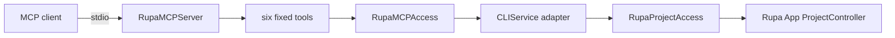
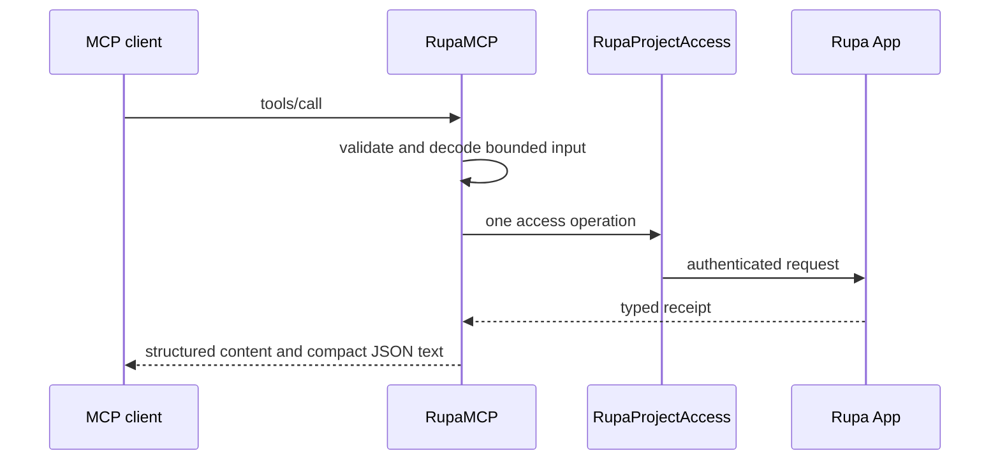

# RupaMCP

## Purpose and Scope

`RupaMCP` adapts Model Context Protocol tool calls to Rupa's existing external
project-access contract. It is a child of the [RupaKit package design](../../DESIGN.md).
Children: none.

## Responsibilities and Boundaries

The module owns a fixed six-tool MCP catalog, JSON-schema validation, bounded
result projection, and legacy plus MCP 2026-07-28 handler registration. It does
not own project state, credentials, HTTP, semantic CAD execution, persistence,
or application lifecycle. Its access protocol is implemented by the CLI layer.

## Related Designs

| Design | Relationship | Contract Used | Summary | Cautions |
|---|---|---|---|---|
| [RupaKit package](../../DESIGN.md) | parent | module dependency boundary | Places MCP above protocol values and below CLI composition. | No project authority is added. |
| [RupaProjectAccess](../RupaProjectAccess/DESIGN.md) | reached through adapter | live target/session/save contract | Every project operation reaches the App. | Save is never implied by mutation. |
| [RupaAgentProtocol](../RupaAgentProtocol/DESIGN.md) | depends on | semantic requests and typed receipts | Supplies the canonical CAD vocabulary. | MCP does not mint authority coordinates. |
| [RupaCLIKit](../RupaCLIKit/DESIGN.md) | used by | access adapter implementation | Supplies status, sessions, capability discovery, execution, and save. | Framing remains here. |

## Architecture

## Contracts and Invariants

1. The catalog contains only status, sessions, paged capabilities, one direct
   semantic invocation, one bounded semantic program, and explicit save.
2. A project target contains exactly one canonical project path or live session
   UUID. Authority coordinates come only from the opened access session.
3. Mutation never implies save, request splitting, fallback, or retry.
4. Inputs and outputs are bounded by `AgentProtocolEncodingLimits`; capability
   discovery is paged with a maximum of 50 descriptors.
5. Tool failures use MCP error results with structured details and never become
   empty success values.
6. Both legacy MCP and MCP 2026-07-28 calls use the same catalog and dispatcher.

## Runtime Flows

## State, Ownership, and Lifecycle

The stdio server is process-lived but stores no project, capability page, tool
result, or request history. Each call owns only its input, result, and one
short-lived access session; the App owns project lifetime.

## Failure, Concurrency, and Constraints

Invalid schemas, targets, cursors, limits, access failures, stale coordinates,
cancellation, and response loss are explicit tool errors. Calls may run
concurrently, while each access session preserves its own ordering and deadline.

## Verification and Change Impact

In-memory MCP tests prove legacy and modern negotiation, fixed catalog parity,
bounded paging, exact target forwarding, no implicit save, explicit save, and
structured failure. CLI tests prove `rupa mcp` selects this server while product
integration continues through the signed CLI and App-owned access route.
