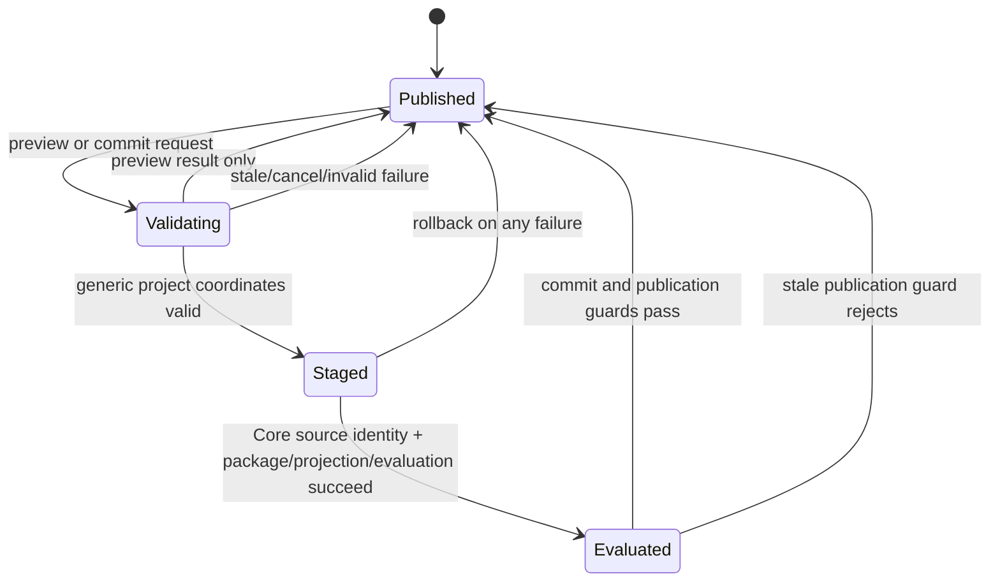
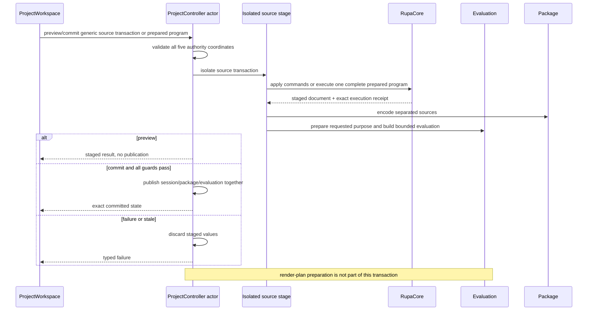
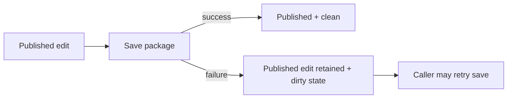

# RupaProject Source Transaction Design

## Purpose and Scope

This module owns project-level staging and publication for source commands,
prepared semantic programs, Authored Mesh plans, and Make Editable preparation.
It is a child of the [RupaKit package design](../../DESIGN.md) and
the [system design](../../../DESIGN.md).

The target depends on `RupaCore`, `RupaCoreTypes`, `RupaEvaluation`,
`RupaProjectModel`, `RupaProjectPackage`, `RupaAutomation`, and Swift-CAD as
defined by `Package.swift`. Its users include the `RupaKit` integration target,
UI composition, and existing Agent/runtime adapters through `ProjectOperating`.

Parent: [RupaKit package design](../../DESIGN.md). Children: none.

## Responsibilities and Boundaries

`RupaProject` owns:

- `ProjectController` actor isolation and the complete project authority
  coordinate;
- forwarding role-specific source commands through the existing
  `ProjectSourceTransaction` path;
- staging of Core source, separated package sources, immutable projection, and
  purpose-aware evaluation before publication;
- revision/publication/cancellation checks and atomic commit/load behavior;
- executing one complete validated `PreparedAutomationProgram` inside one
  isolated Core source-command group;
- returning exact `ProjectStateSnapshot` and prepared-program receipts for
  workspace projection;
- exposing `ProjectController` Make Editable preparation through
  `ProjectOperating` so RupaKit can use the same project authority without
  downcasting to the concrete actor.

It does not own Mesh plan semantics, topology algorithms, Authored Mesh asset
identity, Mesh handles, Mesh read pagination, semantic result projection,
Mesh request lowering, UI state, or Agent/CLI/MCP encoding. Mesh
specific validation belongs to `RupaKit` and `RupaCore`; this module only
validates generic project transaction coordinates.

```mermaid
flowchart LR
    Request["Generic source transaction or prepared program"] --> Coordinate["Project / generation / transaction / publication / workspace check"]
    Coordinate --> SourceTx["One ProjectSourceTransaction"]
    SourceTx --> Core["Staged RupaCore source mutation"]
    Core --> Sources["Product/CAD/Mesh source encoding"]
    Sources --> Projection["New immutable projection"]
    Projection --> Evaluation["Presentation evaluation"]
    Evaluation --> Publish["Atomic ProjectStateSnapshot publication"]
    Publish --> Derived["Postpublication render-plan read\nnot transaction authority"]
```

### Current baseline and T09 delta

[`ProjectSourceTransaction.swift`](ProjectSourceTransaction.swift) already
orders CAD and Geometry source commands and carries project/revision/publication
coordinates. [`ProjectController.swift`](ProjectController.swift) already
stages source, package, projection, and presentation evaluation before
publication. Its evaluator preparer does not yet receive the requested
`GeometryRepresentationPurpose`; the target change passes purpose through that
existing seam before provider composition. T09-B supplies a plan-bearing
Geometry command to this existing route; T09-C exposes exact-snapshot Mesh
preview/commit over it.

## Related Designs

| Design | Relationship | Contract Used | Summary | Cautions |
|---|---|---|---|---|
| [package design](../../DESIGN.md) | parent package | Package one-source flow | Places Project above Core and below RupaKit. | Do not put Mesh algorithms here. |
| [system design](../../../DESIGN.md) | system parent | Atomic inspect/preview/commit flow | Defines the external behavior. | Project remains the only publication owner. |
| [RupaCore design](../RupaCore/DESIGN.md) | depends on | Staged source authority result | Supplies changed DesignDocument and Mesh receipt. | Core result is not public until Project commit succeeds. |
| [RupaEvaluation design](../RupaEvaluation/DESIGN.md) | depends on | Purpose-bound bounded evaluation | Produces one complete admitted snapshot or typed failure. | Project selects purpose but not provider fidelity or limits. |
| [RupaRendering design](../RupaRendering/DESIGN.md) | used downstream | Postpublication derived plan | Consumes the published viewport scene asynchronously. | A render-plan result cannot commit or roll back Project state. |
| [State and project contract](../../../Rupa/STATE_AND_PROJECT_CONTRACT.md) | depends on | Revision, actor, history, cancellation, exact view | Defines project lifecycle and rollback. | A post-commit view projection failure follows the existing no-retry contract. |
| [CAD/Mesh responsibility](../../../Rupa/CAD_MESH_RESPONSIBILITY_CONTRACT.md) | depends on | Separated source owners and derived projection role | Defines package/evaluation authority. | Never persist `ProjectSourceModel` as source. |
| [RupaProject tests](../../Tests/RupaProjectTests) | verification owner | Controller transaction tests | Owns exact coordinate and rollback proof. | Focused tests must exercise the controller path, not only value construction. |

## Architecture

The project actor creates no second Mesh buffer. Geometry execution is part of
the isolated source staging path and returns an immutable result to Core/Project.

## Contracts and Invariants

1. `ProjectAuthorityCoordinate` contains project ID, document generation,
   transaction revision, publication sequence, and workspace revision. A
   prepared-program source transaction carries that value once and
   `ProjectController` validates all five fields before staging, after
   asynchronous prevalidation, and immediately before publication or preview
   return. Existing non-semantic transactions retain their owning guards.
2. Preview stages the full source/package/projection/evaluation path but never
   publishes source, package, evaluation, history, or view state. Every staged
   evaluation uses a transaction-local cache seeded only from the immutable
   published evaluation, so preview and abandoned candidates cannot affect a
   later transaction at the same proposed revision.
3. Commit revalidates the generic project coordinates and executes one source
   transaction containing the already-lowered source command. It does not
   promote a preview result by identity alone.
4. A successful source transaction advances transaction revision at most once
   and creates one source-history entry, regardless of internal command or plan
   step count.
5. Core, plan, package, reconstruction, projection, evaluation, cancellation,
   or stale-publication failure before publication discards staged values and
   preserves the last published state.
6. A save failure after an edit has already been published does not roll back
   that committed edit. It preserves the published source/evaluation/view and
   leaves the session dirty so the caller can retry saving.
7. A new `ProjectStateSnapshot` is published only after source, package,
   projection, evaluation, and publication guards agree. `ProjectWorkspace` may
   then build the exact `ProjectViewSnapshot` through its existing route.
8. Make Editable preparation is a project-authority operation: it accepts only
   target/identity intent, evaluates the current modeling representation, and
   returns the existing bound Core source command. RupaKit commits that command
   with the exact captured project/revision/publication coordinates; callers
   cannot supply evaluated Mesh bytes.
9. Project consumes staged source identities under the
   [package identity-phase contract](../../DESIGN.md#cad-identity-phases) and
   owns successful publication plus its exact immutable evaluation snapshot.
   It does not interpret requested semantic outputs or project a body receipt;
   that request-aware projection belongs to RupaKit. Preview, rollback,
   evaluation failure, cancellation, or stale publication returns no committed
   source or evaluation claim.
10. A prepared semantic program is already validated and lowered before this
    boundary. Project executes the entire program through the injected
    `PreparedAutomationProgramExecuting` inside the same single
    `withSourceCommandGroup` used by other source mutations, retains its exact
    immutable receipt, and never recompiles, splits, or publishes individual
    steps.
11. The requested `GeometryRepresentationPurpose` is supplied to the existing
    `ProjectEvaluatorPreparing` seam before provider construction. Project does
    not infer or overwrite the purpose-specific configuration returned by
    RupaKit composition.
12. Source, separated package sources, immutable projection, and the complete
    purpose-selected bounded evaluation are all staged before publication. An
    over-budget, malformed, cancelled, or failed evaluation publishes none of
    them and returns typed failure.
13. Render-plan construction starts only from the published immutable viewport
    scene. It is a postpublication derived read owned downstream; its failure or
    cancellation cannot mutate, roll back, republish, or dirty exact project
    source/package/evaluation state.

## Runtime Flows

## State, Ownership, and Lifecycle

- `ProjectController` actor owns the published session, package aggregate,
  projection, evaluation, history, and publication sequence.
- An isolated EditorSession/source stage owns the candidate document only for
  the transaction lifetime.
- The source stage owns its CAD evaluation cache for the same transaction
  lifetime. Only the immutable published evaluation may seed a new stage.
- `ProjectSourceTransaction` is an immutable generic request coordinate and
  ordered source mutation description. A prepared-program transaction carries
  one complete `ProjectAuthorityCoordinate` and one generic staged-result
  ceiling; it does not own a live session, compiler, result projector, or Mesh
  handle.
- `ProjectStateSnapshot` is an immutable result. `ProjectWorkspace` converts it
  to a package-free exact view and owns observable replacement.
- Preview candidates are discarded after response and are never source
  authority.
- Render-plan tasks and their derived buffers are never retained by
  `ProjectController`; the viewport cache owns them after publication.

## Failure, Concurrency, and Constraints

`ProjectController` remains the actor boundary for ordered operations. Mesh
handle resolution and request lowering happen before this module's generic
transaction boundary. Package encoding, projection, and evaluation use
immutable staged values and run outside critical actor sections where the
existing implementation allows it. Prepared-program staging rechecks project
ID, document generation, transaction revision, publication sequence, and
workspace revision after asynchronous prevalidation and immediately before
preview return or publication.

Typed failures include generic coordinate mismatch, package/integrity failure,
purpose/configuration mismatch, evaluation limit/overflow, malformed provider
result, evaluation failure, cancellation, and stale publication. Mesh-specific
source, plan, and handle failures are typed by RupaKit/Core before or during the
source command stage; no failure is converted to a successful current-state
fallback.

A package/source staging failure before publication rolls back the staged edit
and discards its evaluation cache.
A save failure after a source edit has already committed does not roll back that
edit: the committed publication and dirty state remain intact.

The transaction path must preserve the existing non-optional CAD runtime adapter
for Mesh-only projects; an empty runtime adapter is not a Mesh source authority.

This save-failure branch is distinct from package/source staging failure: a
staging failure happens before publication and rolls back the candidate edit;
an already-published edit is never undone merely because its later file save
failed.

## Verification and Change Impact

T09-C and T09-IV own the project proof:

| Invariant | Required evidence |
|---|---|
| Generic coordinates | Prepared programs reject project ID, document generation, transaction revision, publication sequence, and workspace revision mismatches at entry, after asynchronous prevalidation, and before preview return/publication; Mesh handle/view checks belong to RupaKit. |
| Prepared program | The complete program executes inside one source-command group, yields one exact immutable receipt, and a request-scoped diagnostic/telemetry ceiling failure publishes nothing. |
| Preview | Preview leaves source, package, evaluation, history, and visible view unchanged. |
| Atomic commit | Prepublication Core/package/projection/evaluation failures leave every published value unchanged. |
| Purpose and resource policy | Modeling/presentation requests reach evaluator preparation unchanged; aggregate boundary-plus-one, overflow, and cancellation publish nothing. |
| Derived render isolation | Render-plan failure/cancellation after publication leaves exact source, package, evaluation, coordinates, history, and dirty state unchanged. |
| Save failure | A post-commit save failure leaves the committed edit and publication intact and preserves dirty state. |
| History | One revision and one undo entry; undo/redo returns exact views. |
| Source independence | CAD/Product/selection/provenance invariance and shared-source visibility. |
| Real path | Mesh-only and CAD-plus-Mesh inspect-to-save/load through `ProjectController`. |

Changes to staging order, publication guards, transaction shape, or view
projection require rechecking the system, Core, and RupaKit integration designs.
