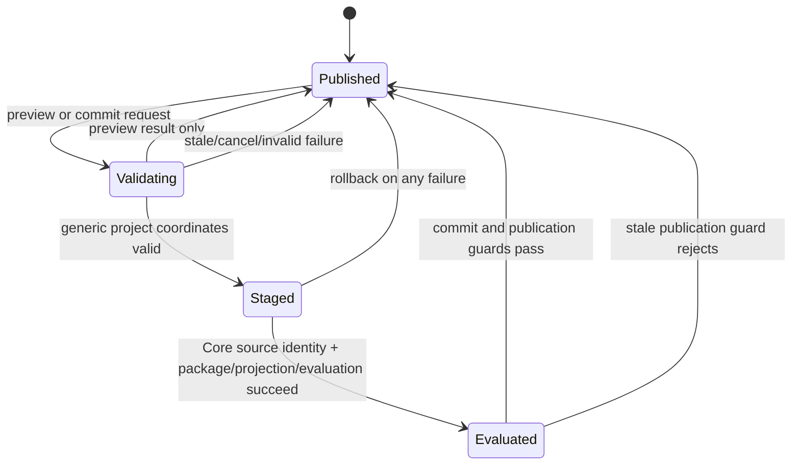
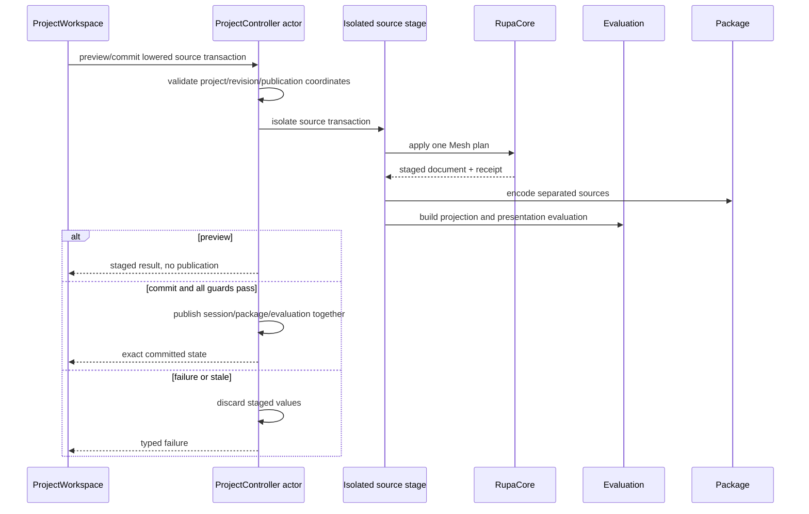
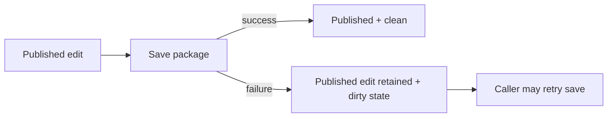

# RupaProject Mesh Transaction Design

## Purpose and Scope

This module owns project-level staging and publication for the T09 Authored Mesh
plan path and the T10 Make Editable preparation port. It is a child of the [RupaKit package design](../../DESIGN.md) and
the [system design](../../../DESIGN.md).

The target depends on `RupaCore`, `RupaCoreTypes`, `RupaEvaluation`,
`RupaProjectModel`, `RupaProjectPackage`, `RupaAutomation`, and Swift-CAD as
defined by `Package.swift`. Its users include the `RupaKit` integration target,
UI composition, and existing Agent/runtime adapters through `ProjectOperating`.

Parent: [RupaKit package design](../../DESIGN.md). Children: none.

## Responsibilities and Boundaries

`RupaProject` owns:

- `ProjectController` actor isolation and generic project authority
  coordinates;
- forwarding role-specific source commands through the existing
  `ProjectSourceTransaction` path;
- staging of Core source, separated package sources, immutable projection, and
  purpose-aware evaluation before publication;
- revision/publication/cancellation checks and atomic commit/load behavior;
- returning exact `ProjectStateSnapshot` results for workspace projection.
- exposing `ProjectController` Make Editable preparation through
  `ProjectOperating` so RupaKit can use the same project authority without
  downcasting to the concrete actor.

It does not own Mesh plan semantics, topology algorithms, Authored Mesh asset
identity, Mesh handles, Mesh read pagination, workspace/document-generation
coordinates, Mesh request lowering, UI state, or Agent/CLI/MCP encoding. Mesh
specific validation belongs to `RupaKit` and `RupaCore`; this module only
validates generic project transaction coordinates.

```mermaid
flowchart LR
    Request["Generic project source transaction"] --> Coordinate["Project ID / transaction revision / publication check"]
    Coordinate --> SourceTx["One ProjectSourceTransaction"]
    SourceTx --> Core["Staged RupaCore source mutation"]
    Core --> Sources["Product/CAD/Mesh source encoding"]
    Sources --> Projection["New immutable projection"]
    Projection --> Evaluation["Presentation evaluation"]
    Evaluation --> Publish["Atomic ProjectStateSnapshot publication"]
```

### Current baseline and T09 delta

[`ProjectSourceTransaction.swift`](ProjectSourceTransaction.swift) already
orders CAD and Geometry source commands and carries project/revision/publication
coordinates. [`ProjectController.swift`](ProjectController.swift) already
stages source, package, projection, and presentation evaluation before
publication. T09-B supplies a plan-bearing Geometry command to this existing
route; T09-C exposes exact-snapshot Mesh preview/commit over it.

## Related Designs

| Design | Relationship | Contract Used | Summary | Cautions |
|---|---|---|---|---|
| [package design](../../DESIGN.md) | parent package | Package one-source flow | Places Project above Core and below RupaKit. | Do not put Mesh algorithms here. |
| [system design](../../../DESIGN.md) | system parent | Atomic inspect/preview/commit flow | Defines the external behavior. | Project remains the only publication owner. |
| [RupaCore design](../RupaCore/DESIGN.md) | depends on | Staged source authority result | Supplies changed DesignDocument and Mesh receipt. | Core result is not public until Project commit succeeds. |
| [State and project contract](../../../Rupa/STATE_AND_PROJECT_CONTRACT.md) | depends on | Revision, actor, history, cancellation, exact view | Defines project lifecycle and rollback. | A post-commit view projection failure follows the existing no-retry contract. |
| [CAD/Mesh responsibility](../../../Rupa/CAD_MESH_RESPONSIBILITY_CONTRACT.md) | depends on | Separated source owners and derived projection role | Defines package/evaluation authority. | Never persist `ProjectSourceModel` as source. |
| [RupaProject tests](../../Tests/RupaProjectTests) | verification owner | Controller transaction tests | Owns exact coordinate and rollback proof. | Focused tests must exercise the controller path, not only value construction. |

## Architecture

The project actor creates no second Mesh buffer. Geometry execution is part of
the isolated source staging path and returns an immutable result to Core/Project.

## Contracts and Invariants

1. `ProjectSourceTransaction` carries generic `expectedProjectID`,
   `expectedTransactionRevision`, and `expectedPublicationSequence` guards.
   Mesh source IDs, content identities, handles, workspace revisions, and
   document-generation checks are validated by the owning RupaKit/Core paths,
   not by this module.
2. Preview stages the full source/package/projection/evaluation path but never
   publishes source, package, evaluation, history, or view state.
3. Commit revalidates the generic project coordinates and executes one source
   transaction containing the already-lowered source command. It does not
   promote a preview result by identity alone.
4. A successful source transaction advances transaction revision at most once
   and creates one source-history entry, regardless of internal command or plan
   step count.
5. Core, plan, package, reconstruction, projection, evaluation, cancellation,
   or stale-publication failure before publication discards staged values and
   preserves the last published state.
6. A save failure after an edit has already been published does not roll back
   that committed edit. It preserves the published source/evaluation/view and
   leaves the session dirty so the caller can retry saving.
7. A new `ProjectStateSnapshot` is published only after source, package,
   projection, evaluation, and publication guards agree. `ProjectWorkspace` may
   then build the exact `ProjectViewSnapshot` through its existing route.
8. Make Editable preparation is a project-authority operation: it accepts only
   target/identity intent, evaluates the current modeling representation, and
   returns the existing bound Core source command. RupaKit commits that command
   with the exact captured project/revision/publication coordinates; callers
   cannot supply evaluated Mesh bytes.

## Runtime Flows

## State, Ownership, and Lifecycle

- `ProjectController` actor owns the published session, package aggregate,
  projection, evaluation, history, and publication sequence.
- An isolated EditorSession/source stage owns the candidate document only for
  the transaction lifetime.
- `ProjectSourceTransaction` is an immutable generic request coordinate and
  ordered source mutation description; it does not own a live session or Mesh
  handle.
- `ProjectStateSnapshot` is an immutable result. `ProjectWorkspace` converts it
  to a package-free exact view and owns observable replacement.
- Preview candidates are discarded after response and are never source
  authority.

## Failure, Concurrency, and Constraints

`ProjectController` remains the actor boundary for ordered operations. Mesh
handle resolution and request lowering happen before this module's generic
transaction boundary. Package encoding, projection, and evaluation use
immutable staged values and run outside critical actor sections where the
existing implementation allows it. Publication rechecks revision and
publication sequence after asynchronous boundaries.

Typed failures include generic coordinate mismatch, package/integrity failure,
evaluation failure, cancellation, and stale publication. Mesh-specific source,
plan, and handle failures are typed by RupaKit/Core before or during the source
command stage; no failure is converted to a successful current-state fallback.

A package/source staging failure before publication rolls back the staged edit.
A save failure after a source edit has already committed does not roll back that
edit: the committed publication and dirty state remain intact.

The transaction path must preserve the existing non-optional CAD runtime adapter
for Mesh-only projects; an empty runtime adapter is not a Mesh source authority.

This save-failure branch is distinct from package/source staging failure: a
staging failure happens before publication and rolls back the candidate edit;
an already-published edit is never undone merely because its later file save
failed.

## Verification and Change Impact

T09-C and T09-IV own the project proof:

| Invariant | Required evidence |
|---|---|
| Generic coordinates | Project ID, transaction revision, and publication mismatch rejection; Mesh handle/view checks belong to RupaKit. |
| Preview | Preview leaves source, package, evaluation, history, and visible view unchanged. |
| Atomic commit | Prepublication Core/package/projection/evaluation failures leave every published value unchanged. |
| Save failure | A post-commit save failure leaves the committed edit and publication intact and preserves dirty state. |
| History | One revision and one undo entry; undo/redo returns exact views. |
| Source independence | CAD/Product/selection/provenance invariance and shared-source visibility. |
| Real path | Mesh-only and CAD-plus-Mesh inspect-to-save/load through `ProjectController`. |

Changes to staging order, publication guards, transaction shape, or view
projection require rechecking the system, Core, and RupaKit integration designs.
