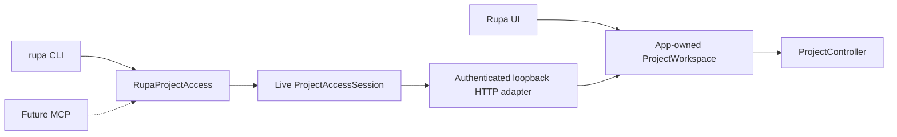
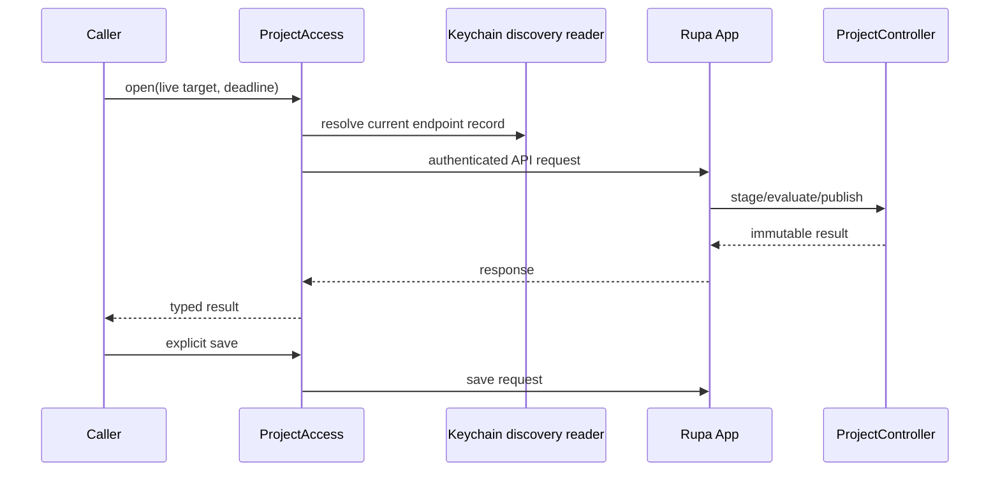

# RupaProjectAccess

## Purpose and Scope

`RupaProjectAccess` is the transport-neutral API for callers that observe or
change the one App-owned Rupa project. It is a child of the [RupaKit package
design](../../DESIGN.md) and has no child designs.

The contract intentionally exposes only live project targets. Concrete
composition is owned by the sibling access-composition module.

## Responsibilities and Boundaries

This module owns the immutable target, session, observation, explicit-save,
finish, and typed-error contracts. It transports semantic Agent intent
without interpreting or splitting it.

It does not own `ProjectWorkspace`, `ProjectController`, package bytes,
Keychain records, HTTP framing, application lifecycle, CLI syntax, or CAD/Mesh
semantics. Every implementation must route Product, CAD, Mesh, evaluation,
and persistence through the App-owned workspace/controller.

## Related Designs

| Design | Relationship | Contract Used | Summary | Cautions |
|---|---|---|---|---|
| [system design](../../../DESIGN.md) | parent | single ProjectController authority | Places UI and external clients above this API. | No second writer is allowed. |
| [RupaKit package](../../DESIGN.md) | parent package | target dependency direction | Keeps this target below concrete adapters. | Do not depend on Core or Project. |
| [RupaAgentProtocol](../RupaAgentProtocol/DESIGN.md) | depends on | typed Agent request/response | Carries semantic intent and receipts. | DTOs are not authority. |
| [RupaProjectAccessComposition](../RupaProjectAccessComposition/DESIGN.md) | implemented by | live opener/session | Resolves the App-owned workspace through the API. | It cannot create a local project. |
| [RupaAgentTransport](../RupaAgentTransport/DESIGN.md) | carried by | authenticated loopback HTTP | Supplies one bounded exchange. | Transport details stay outside this contract. |

## Architecture



## Contracts and Invariants

### Target

`ProjectAccessTarget` has exactly two cases:

- `liveProject(URL)`: launch or resolve the App-owned project identified by a
  canonical URL;
- `liveSession(UUID)`: attach only to an already registered App session.

No target represents a detached project, local package writer, or alternate
authority.

### Session

```swift
public protocol ProjectAccessSession: Sendable {
    var sessionID: UUID { get }

    func send(_ request: AgentRequest) async throws -> AgentResponse

    func save(
        expectedGeneration: DocumentGeneration?
    ) async throws -> SaveResult

    func finish() async
}
```

`send` rejects a request whose session coordinate differs from `sessionID`.
It may change only App-owned in-memory state; persistence requires a separate
successful `save`. `finish` releases API resources and never closes the App
document.

### Opening and observation

```swift
public protocol ProjectAccessOpening: Sendable {
    func open(
        _ target: ProjectAccessTarget,
        deadline: ContinuousClock.Instant
    ) async throws -> any ProjectAccessSession
}

@MainActor
public protocol ProjectAccessObserving: Sendable {
    func capabilities(deadline: ContinuousClock.Instant) async throws -> [AgentCapabilityDescriptor]
    func status(deadline: ContinuousClock.Instant) async throws -> AgentStatus
    func sessions(deadline: ContinuousClock.Instant) async throws -> [WorkspaceSessionSummary]
}
```

The caller owns one monotonic deadline for launch/readiness, discovery,
request, and save. Observation never starts a project or creates local state.

### Typed failures

Invalid targets, unavailable sessions, unauthorized or stale discovery,
deadline exhaustion, cancellation, semantic failure, save failure, and
response loss are typed. A complete request whose response is lost is
`outcomeUnknown` and is never replayed through another route.

## Runtime Flows



## State, Ownership, and Lifecycle

All contract values are immutable. A session owns only its API adapter and
session identity. The App owns project lifetime, workspace, controller, and
discovery generation.

## Failure, Concurrency, and Constraints

Implementations serialize operations per session, preserve coordinates across
every request, and do not reset deadlines between phases. Failures cannot
select an alternate authority or silently report success.

## Verification and Change Impact

Contract tests prove the two target cases, identity fences, explicit save,
finish semantics, one-deadline behavior, cancellation, outcome-unknown
classification, and no local-authority fallback. Composition and App tests
prove that every successful request reaches the same workspace/controller as
the UI.
