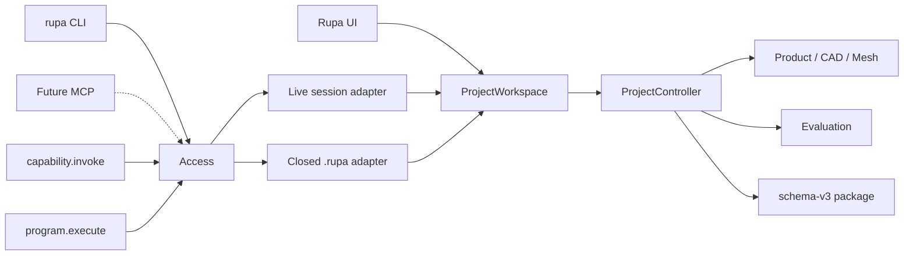
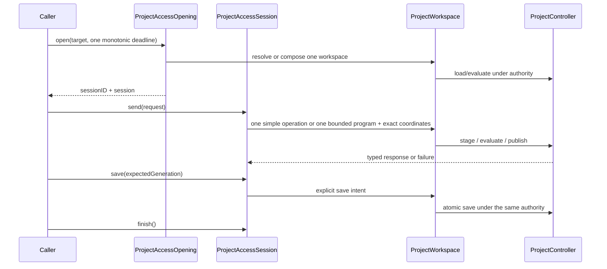

# RupaProjectAccess

## Purpose and Scope

`RupaProjectAccess` is the transport-neutral contract for callers that want to
observe or change a Rupa project. It is a child of the [RupaKit package
design](../../DESIGN.md) and is intentionally independent of `RupaCore`,
`RupaProject`, `RupaKit`, socket I/O, application UI, and CLI parsing.

The module fixes the access shape for live projects, existing live sessions,
and closed schema-v3 `.rupa` projects. It remains contract-only: concrete
closed-file workspace creation and authority leases are owned by the sibling
[`RupaProjectAccessComposition`](../RupaProjectAccessComposition/DESIGN.md)
module, while live composition and CLI cutover belong to their application
owners.

CADAPI-D adds no project authority here. An access session transports either of
the two semantic CAD mutation envelopes (`capability.invoke` or
`program.execute`) unchanged and keeps explicit save as a separate lifecycle
operation. The semantic compiler and the removal of legacy raw graph payloads
are target implementation work outside this module's current implementation.

Parent: [RupaKit package design](../../DESIGN.md). Children: none.

## Responsibilities and Boundaries

This module owns:

- the exact access target and immutable session identity;
- the asynchronous open, request, explicit-save, and finish contracts;
- transport of the protocol-owned simple-operation and bounded-program
  requests without interpreting, compiling, splitting, or replaying them;
- typed access outcomes and failures for coordinate, deadline, format, and
  uncertain-publication conditions;
- transport-neutral lifecycle and save ports;
- no ownership of a project, workspace, controller, package bytes, command
  vocabulary, program compiler, socket endpoint, or process lifecycle.

The only authority rule exposed here is that an implementation must delegate
Product, CAD, Mesh, evaluation, and persistence operations to one
`ProjectWorkspace`/`ProjectController` composition. The contract does not
permit direct package-entry editing or a shadow `EditorSession`.

## Related Designs

| Design | Relationship | Contract Used | Summary | Cautions |
|---|---|---|---|---|
| [system design](../../../DESIGN.md) | parent | single ProjectController authority | Places UI, CLI, and future adapters above this contract. | This module does not become project authority. |
| [package design](../../DESIGN.md) | parent package | target dependency direction and CoreTypes value floor | Keeps this target below application and concrete transport composition. | Do not add a dependency on RupaCore or RupaProject. |
| [RupaAgentProtocol](../RupaAgentProtocol/DESIGN.md) | depends on | typed Agent request/response values | Supplies the semantic request and response values carried by a session. | Protocol values are not workspace permission. |
| [RupaAgentRuntime](../RupaAgentRuntime/DESIGN.md) | used by concrete access composition | semantic request dispatch and typed result projection | Resolves both CADAPI-D forms through the same workspace path. | Access must not compile, split, or retry a semantic program. |
| [RupaProjectAccessComposition](../RupaProjectAccessComposition/DESIGN.md) | used by | concrete closed-session and file-authority composition | Implements this contract by loading through the public `ProjectWorkspace` API and delegating requests to `ProjectAgentCommandController`. | The composition target owns leases and resource lifetime; this contract does not import it. |
| [RupaDomainFoundation](../RupaDomainFoundation/DESIGN.md) | transitively used by runtime | bounded semantic program contract | Gives `program.execute` its source-only DAG semantics. | ProjectAccess transports the DTO and does not depend on compiler internals. |
| [RupaProject](../RupaProject/DESIGN.md) | used by later composition | controller and publication authority | Owns staging, evaluation, rollback, and package persistence. | ACCESS-A defines no adapter to its concrete implementation. |
| [Agent transport](../RupaAgentTransport/DESIGN.md) | coordinates later | injected endpoint and peer authorization | Carries protocol values for live access. | Endpoint placement is transport composition, not semantic status. |

## Architecture



The target dependency boundary is deliberately narrow:

```text
RupaProjectAccess
    -> RupaAgentProtocol
    -> RupaCoreTypes
```

No adapter implementation is allowed to reverse this dependency or make the
contract know how a socket, package archive, CAD kernel, or UI window works.

## Contracts and Invariants

### Target

`ProjectAccessTarget` has exactly three cases:

- `liveProject(URL)`: resolve or launch the App-owned project identified by the
  URL;
- `liveSession(UUID)`: attach only to an already registered live session;
- `closedProject(input: URL, output: URL?)`: use a temporary controller for a
  schema-v3 `.rupa` input and optionally write to the explicit output URL.

The target is `Sendable`, `Equatable`, and immutable. A closed target accepts
only the `.rupa` project format; `.swcad` and unknown formats are typed
`unsupportedProjectFormat` failures. `output == nil` means an explicit in-place
save policy, not an implicit live/file switch.

### Session

```swift
public protocol ProjectAccessSession: Sendable {
    var sessionID: UUID { get }

    func send(_ request: AgentRequest) async throws -> AgentResponse

    func save(
        expectedGeneration: DocumentGeneration?
    ) async throws -> SaveResult

    func finish() async
}
```

Implementations must reject a request whose session coordinate does not match
`sessionID` with `sessionMismatch`. `send` may mutate only the in-memory
workspace/controller state; persistence requires an explicit successful
`save`. `finish` releases access resources and never closes a live document.

For CAD source mutation, `send` accepts only protocol-owned semantic intent.
The simple and composite forms have the same session/generation fence and are
forwarded as one request each. Access never converts a program into multiple
requests, accepts caller-owned persistent source identifiers as creation
authority, or exposes raw `AutomationCommand`/`appendFeatureGraph` payloads.

### Opening

```swift
public protocol ProjectAccessOpening: Sendable {
    func open(
        _ target: ProjectAccessTarget,
        deadline: ContinuousClock.Instant
    ) async throws -> any ProjectAccessSession
}
```

The deadline is one monotonic deadline owned by the caller. Opening, launch or
readiness wait, request dispatch, and explicit save must not replace it with a
new relative timeout. A dispatch that may have published a mutation but whose
response is lost returns `outcomeUnknown`; it is never retried through another
target or file path.

### Lifecycle and save ports

The session protocol is the only mutation-facing port. A CADAPI-D request may
publish at most once through that port; a successful mutation does not imply a
save. Implementations may
compose it with an application lifecycle owner, but that owner must preserve
the same session identity, workspace, controller, and current URL. No lifecycle
port may expose package entries or accept a direct `EditorSession`.

### Typed failures

`ProjectAccessError` distinguishes target validation and authority failures:

| Failure | Meaning |
|---|---|
| `invalidTarget` | Required target URL/identity is absent or invalid. |
| `unsupportedProjectFormat` | Closed target is not a schema-v3 `.rupa`. |
| `sessionMismatch` | Request session identity does not equal the opened session. |
| `sessionUnavailable` | A live session cannot be resolved under the deadline. |
| `deadlineExceeded` | The single monotonic deadline elapsed before completion. |
| `saveUnavailable` | Explicit save is not valid for the target or current lifecycle state. |
| `outcomeUnknown` | Dispatch may have published, but its response was not observed. |
| `finished` | The session was used after `finish`. |
| `authorityUnavailable` | The required workspace/controller authority is absent. |
| `fileAuthorityConflict(URL)` | Another closed-file session already owns the canonical path. |
| `fileAuthorityLost(URL)` | The leased path's device/inode identity changed or the lease inode was replaced. |
| `committedMutation(AgentCommittedMutationOutcome)` | Persistence committed an exact authority state, but its view projection could not be recovered; the receipt is terminal and must not be retried. |

Errors are never converted to an empty response, a success result, or a file
fallback. Underlying project errors remain typed at the concrete adapter
boundary.

## Runtime Flows



An implementation must keep the input package unchanged until explicit save
succeeds. Cancellation, stale coordinates, invalid program, limit/lowering/
command/evaluation failure, save failure, and uncertain dispatch do not
authorize another route. A lost response after possible publication is
`outcomeUnknown`, is not automatically replayed, and never causes fallback from
live to closed-file access.

## State, Ownership, and Lifecycle

The contract owns no mutable state. A concrete session owns only its access
resource lifetime and holds a reference to its caller-selected workspace
composition. `sessionID` is an identity coordinate, not a project source
identifier. Live `finish` detaches the caller and leaves the App document
alive; closed `finish` releases temporary resources after the explicit save
decision.

## Failure, Concurrency, and Constraints

Implementations are asynchronous and `Sendable`. They must serialize
state-changing operations through the workspace/controller owner and must not
pass mutable project state outside that owner. The API does not define semantic
program ordering, lowerers, retries, parallel command execution, or socket I/O;
those policies belong to the owning semantic/runtime/transport designs.
Program semantic bounds remain compiler-owned, while resource, frame, and peer
limits remain transport-owned.

## Verification and Change Impact

The contract target tests prove value equality, target discrimination, closed
format validation, typed failure identity, and a fixture session's mismatch,
deadline, save, and finish behavior. Later adapter tests must prove that these
guards occur on the real workspace/controller path and that package bytes never
become an API-owned mutable buffer. CADAPI-D access tests must prove both forms
are forwarded once without payload reinterpretation, explicit save is a
separate call, prepublication failures do not save or fall back, and an
uncertain or committed outcome is never replayed.

Changes to target cases, session coordinates, save semantics, failure
discriminators, or dependency imports require rechecking this design, the
system master, and every concrete live/closed adapter design.
