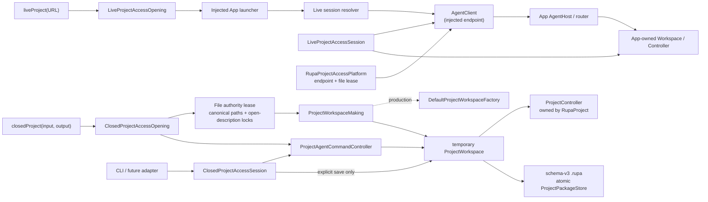
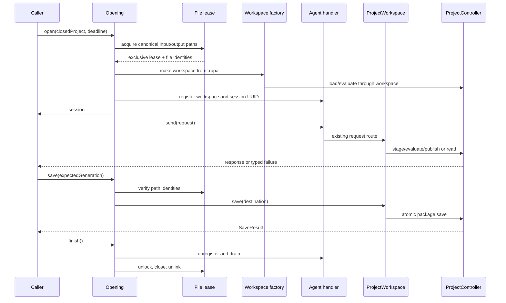
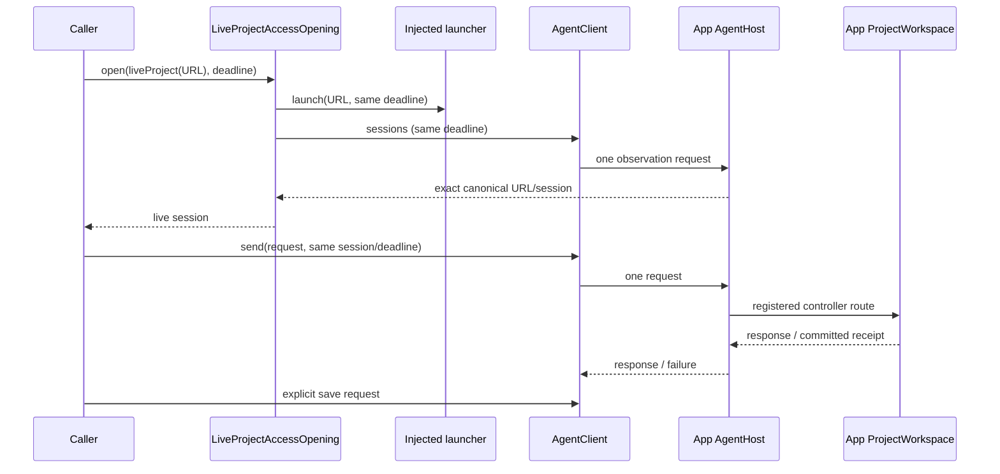

# RupaProjectAccessComposition

## Purpose and Scope

`RupaProjectAccessComposition` is the concrete closed-project and live-project adapter for the
transport-neutral [`RupaProjectAccess`](../RupaProjectAccess/DESIGN.md)
contract. It is a child of the [RupaKit package design](../../DESIGN.md) and a
sibling of `RupaProjectAccess`, `RupaAgentRuntime`, and `RupaKit`.

This module owns the bounded lifetime of one closed `.rupa` access session and
retains the platform-owned file authority lease that protects its input and explicit output paths. It
also owns the live access adapter that attaches to an App-owned session through
an injected endpoint, and launches the App only for a `liveProject` target. It
does not own an App workspace, App lifecycle, CLI parser, semantic compiler,
CAD operation vocabulary, package writer, or project authority. Loading and
saving are performed only through the public `ProjectWorkspace` API; the
workspace owns the `ProjectController` composition and delegates persistence to
the existing project/package layers.

Parent: [RupaKit package design](../../DESIGN.md). Children: none.

## Responsibilities and Boundaries

This module owns:

- validation of a closed `.rupa` target and its input/output path set;
- one temporary workspace/session composition for one closed target;
- the `ProjectWorkspaceMaking` injection seam and its production factory adapter;
- delegation of every request to one registered
  `ProjectAgentCommandController`;
- explicit save to the target's input or output URL through
  `ProjectWorkspace.save`;
- acquisition and retention of platform-owned file authority leases for the
  closed session lifetime;
- deadline and finished-state guards at every request/save boundary;
- release ordering: unregister the workspace, then release the file lease.
- live-project launch through an injected application launcher;
- the production LaunchServices launcher that resolves the exact
  `team.stamp.Rupa` application and opens a `.rupa` URL with that application,
  awaits the LaunchServices completion, and reports its exact typed failure
  without a default-application, shell, or UI automation fallback;
- canonical live-session resolution through the Agent `sessions` observation
  request;
- live request and explicit-save dispatch through one injected Agent endpoint,
  including terminal uncertain-outcome mapping.

It does not own:

- `ProjectController`, `EditorSession`, `ProjectPackageDocument`, or package
  archive entries;
- direct JSON/archive mutation or a second command switch;
- App process lifecycle, endpoint placement, peer authentication, or CLI
  argument parsing;
- retries after an uncertain or committed operation;
- source IDs, Mesh buffers, semantic CAD operations, or evaluation policy.

## Related Designs

| Design | Relationship | Contract Used | Summary | Cautions |
|---|---|---|---|---|
| [RupaKit package](../../DESIGN.md) | parent | dependency direction and one project authority | Indexes this composition as the concrete access adapter. | Do not move authority into this module. |
| [RupaProjectAccess](../RupaProjectAccess/DESIGN.md) | depends on | target/session/open/save/finish contract | Defines the caller-facing access protocol and typed target failures. | This module implements the protocol; it does not change its DTOs. |
| [RupaAgentRuntime](../RupaAgentRuntime/DESIGN.md) | depends on | registered-workspace request handling | Supplies `ProjectAgentCommandController` and its existing request route. | Do not duplicate its command switch or bypass its registry. |
| [RupaKit integration](../RupaKit/DESIGN.md) | depends on | public `DefaultProjectWorkspaceFactory` and `ProjectWorkspace` load/save | Composes a temporary workspace and delegates project lifecycle operations. | No direct `ProjectController` or package dependency is allowed here. |
| [RupaProjectAccessPlatform](../RupaProjectAccessPlatform/DESIGN.md) | depends on | product endpoint coordinates and file-authority lease | Supplies shared App/CLI Darwin coordination without pulling workspace composition into the App. | This module must not duplicate product constants or lock mechanics. |
| [RupaAgentTransport](../RupaAgentTransport/DESIGN.md) | depends on for live access | injected endpoint, deadline-aware `AgentClient`, and typed transport disposition | Carries one live request over the App's process-lifetime host. | This module never resolves an endpoint path or retries a dispatched request. |
| [Application composition](../../Rupa/Rupa/Rupa/DESIGN.md) | used by | `LaunchServicesProjectApplicationLauncher` | Supplies the platform launcher to the App/CLI while consuming the shared platform composition. | This module does not own App Group entitlements or process lifetime. |
| [RupaProject](../RupaProject/DESIGN.md) | transitively used | controller staging/publication/rollback | Owns source, evaluation, and package publication. | This module never calls it directly. |
| [RupaProjectPackage](../RupaProjectPackage/DESIGN.md) | transitively used | schema-v3 load/save and atomic replacement | Owns archive integrity and destination replacement. | This module never edits package entries. |

## Architecture



The dependency direction is:

```text
RupaProjectAccessComposition
    -> RupaProjectAccessPlatform
    -> RupaProjectAccess
    -> RupaAgentRuntime
    -> RupaKit
    -> RupaAgentTransport
```

The composition target has no direct dependency on `RupaProject` or
`RupaProjectPackage`. Project/package authority is reached only through
`RupaKit`'s public workspace factory and lifecycle methods. The live transport
dependency receives an already-composed endpoint and carries protocol values
to the App host; it cannot resolve endpoint placement, create a second
workspace, or mutate a package directly.

`RupaProjectAccessPlatform` contains the single product resolver for the App
Group endpoint and the shared file-lease implementation. This composition
receives resolved values; no adapter invents a temporary, override, or
per-command socket path.

## Contracts and Invariants

1. A closed target is accepted only when its input and optional output are
   file URLs with a `.rupa` extension. `.swcad` and other formats fail as
   `ProjectAccessError.unsupportedProjectFormat` before a workspace or lease
   is created.
2. Input must exist as a regular file and its parent must be accessible.
   Output may be absent, but its parent must exist and be a directory. The
   selected input/output URLs are canonicalized before lease acquisition.
3. Canonical input/output paths are deduplicated and acquired in lexical
   order. This prevents self-conflict and lock-order deadlocks.
4. A lease uses one persistent coordinator lock to serialize lock-file
   lifecycle and one non-blocking exclusive `flock`-style open-description
   lock per canonical path. Lock files are mode `0600`; the coordination
   directory is mode `0700`.
5. Release attempts to hold the coordinator lock while it unlocks, closes, and
   unlinks each path lock. If the non-blocking coordinator acquisition is not
   immediately available, descriptors are still released but lock files are
   retained; a later coordinator holder may reclaim them. No release path
   unlinks without coordinator ownership, so a contender cannot split onto a
   replacement inode.
6. The lease records the device/inode identity of every existing input/output
   path and rechecks the path with `stat` before every request and save. An
   externally replaced or externally newly-created path is a typed
   lost-authority failure. The session's own successful atomic publication is
   the one exception: `adoptPublished` verifies the new regular-file inode and
   rebinds the lease before recovery or the next operation. The source file
   descriptor remains open for the lease lifetime to preserve and verify the
   original open description.
7. Opening acquires the lease before loading and releases it on every failure.
   A successful open creates one workspace, evaluates it once, registers it
   once, and returns one session identity. There is no second workspace or
   shadow `EditorSession`.
8. `send` validates the session identity, finished state, deadline, and lease,
   then forwards the original `AgentRequest` once to the existing
   `ProjectAgentCommandController`. It does not decode, split, retry, or
   reinterpret a request.
9. `save` is the only persistence operation exposed by the session. It checks
   the expected generation and lease, calls `ProjectWorkspace.save` with the
   selected destination, and replaces the destination only through the
   existing package atomic-save path. The `.save` Agent request remains
   rejected by the runtime handler.
10. Failed load, request, evaluation, stale coordinate, cancellation, lease
    loss, or save preparation leaves the input destination unchanged. A
    post-publication save failure first attempts the existing committed-view
    recovery; a recovery failure returns the exact
    `AgentCommittedMutationOutcome` through
    `ProjectAccessError.committedMutation` with `mustNotRetry`. It never
    switches to another access route.
11. `finish` is idempotent and terminal. It first unregisters the temporary
    workspace and waits for accepted handler operations to drain, then
    releases the file lease. It never closes or mutates another project.
12. The live composition consumes one required endpoint resolved by
    `RupaProjectAccessPlatform`. It exposes no endpoint override and has no
    default or temporary-directory fallback.
13. `liveProject(URL)` is the only access target that invokes the injected
    application launcher, exactly once. Product composition resolves the exact
    Rupa application bundle and opens the canonical URL with that application.
    The launcher awaits the LaunchServices completion under the caller's
    existing absolute deadline. A completion error is
    `LiveProjectAccessError.applicationLaunchFailed`; absence of an application
    is `applicationUnavailable`; and an uncompleted launch reaches
    `ProjectAccessError.deadlineExceeded`. No launch failure is deferred to or
    inferred from the later session-readiness timeout.
    Reopening the App's current canonical URL is an App-owned no-op only after
    its retained file authority validates. Authority loss is terminal and
    revokes the registered session before the no-op can succeed. The resolver
    accepts only a session summary whose canonical path is an exact match. A
    dirty different project is a typed rejection; it is never replaced or
    handled through the closed-file adapter.
14. `liveSession(UUID)` resolves only an already registered session and never
    launches or restores the application. Status and sessions observation
    requests use the same injected endpoint without opening an application.
15. A live session forwards requests to the App's registered workspace and
    controller through the Agent router. It validates the session ID before
    dispatch, retains the caller's single monotonic deadline, and exposes
    persistence only through an explicit `AgentRequest.save` performed by
    `save(expectedGeneration:)`.
16. If a request was dispatched and its response is not observed, the live
    adapter maps the transport's `outcomeUnknown` disposition to
    `ProjectAccessError.outcomeUnknown`. It performs no retry and never falls
    back to a closed-file route.
17. `finish` is idempotent and terminal. It stops accepting new work, waits for
    already accepted access operations, and then detaches only the access
    adapter. It does not close, unload, or mutate the App-owned document or
    workspace.

## Runtime Flows



The opening deadline is monotonic and is retained by the session. A deadline
that has elapsed before a request or save is rejected without invoking the
workspace. The current input/output destination is never inferred from an
Agent request.

For live access, the same deadline covers optional application launch,
session-readiness observation, request dispatch, and explicit save. The
resolver performs no second launch attempt after a transport or readiness
failure.



## State, Ownership, and Lifecycle

`ClosedProjectAccessOpening` retains the injected platform lease store. The
lease store owns coordinator and path lock descriptors inside its actor isolation. A
`ClosedProjectAccessSession` owns one lease, one registered workspace, one
handler, one target, and one deadline for its lifetime. The temporary workspace
owns the `ProjectController`; the session never retains a controller or package
document directly.

The session is MainActor-isolated because `ProjectWorkspace` and
`ProjectAgentCommandController` are MainActor-isolated. The lock store remains
an actor so file-descriptor state and release order are serialized without
`@unchecked Sendable` or `nonisolated(unsafe)` state.

`LiveProjectAccessOpening` owns no App workspace. It owns the injected launcher
and endpoint composition, creates one `AgentClient` per attached session, and
retains only the resolved session identity and deadline. A
`LiveProjectAccessSession` releases its client on `finish`; the App registry and
document remain owned by the App process for its lifetime.

## Failure, Concurrency, and Constraints

Concurrent sessions sharing any canonical input/output path fail acquisition
with `ProjectAccessError.fileAuthorityConflict(URL)`. A path or lock inode
replacement after acquisition fails with
`ProjectAccessError.fileAuthorityLost(URL)`. Different path sets may proceed
concurrently. All path sets use lexical acquisition order.

The coordinator lock is a durable lock file in the private coordination
directory and is never unlinked. Per-path lock files are removed only while
the coordinator lock is held. A crashed owner releases the open-description
lock through the operating system; the next opener may reclaim the durable
lock file after verifying the target path identity.

The implementation uses bounded synchronous filesystem calls at the adapter
boundary. It does not perform blocking I/O while holding a Swift `Mutex`; the
lease actor serializes descriptor operations, and project/package I/O remains
inside the existing workspace/project contracts.

Live resolution is bounded by the caller's one monotonic deadline. The endpoint
is always injected by product composition, and peer authentication and socket
permissions remain transport-owned. A connection that has written a request
but loses its response is terminal for that request; no retry or alternate
target is permitted.

The LaunchServices callback bridge has one completion owner. Launch success,
LaunchServices failure, deadline expiry, and task cancellation race to resolve
that owner exactly once. It does not reset the deadline after application
lookup or launch dispatch, and a late callback cannot publish a second result.

## Verification and Change Impact

`RupaProjectAccessCompositionTests` must execute the real composition and
prove:

- CAD-only, CAD-plus-Authored-Mesh, and Mesh-only packages open, evaluate,
  mutate through the registered handler, explicitly save, and reload;
- `.swcad`, missing input, invalid output parent, and path identity changes
  fail before mutation;
- two sessions with overlapping canonical input/output sets cannot both
  acquire a lease, while disjoint sets can;
- lock-file mode, coordination-directory mode, lexical deduplication,
  open-description lifetime, and release/unlink behavior are observable;
- request/session mismatch, finished session, deadline, stale generation,
  command/evaluation failure, and save failure leave the input bytes intact;
- a successful request changes only in-memory state until `save`, and
  `finish` unregisters before lease release.
- a test-only registration boundary deterministically cancels an opening after
  handler registration and proves that the temporary session is unpublished
  before the lease can be reacquired.
- a `liveProject` opening invokes the exact-Rupa launcher once, resolves the
  exact registered session, treats the current dirty canonical URL as an App
  no-op, and rejects a dirty different project without replacement;
- the LaunchServices launcher awaits its completion, preserves the bundle ID,
  project URL, error domain, error code, and error message in a typed launch
  failure, and applies the same absolute deadline while the completion is
  pending;
- `liveSession` and live status/sessions observation never launch the App;
- live requests and explicit save use one endpoint, one monotonic deadline,
  and one registered App workspace; session mismatch and finished-session
  guards fail before dispatch;
- a post-dispatch `AgentTransportFailure.outcomeUnknown` becomes a terminal
  `ProjectAccessError.outcomeUnknown` with no retry or closed-file fallback;
- live `finish` waits for accepted access work, rejects later work, and leaves
  the App session registered and its document open.

Changes to target/session semantics require rechecking
[`RupaProjectAccess`](../RupaProjectAccess/DESIGN.md), the runtime handler,
`ProjectWorkspace` load/save contracts, the package design, and the system
live/file access workflow.
