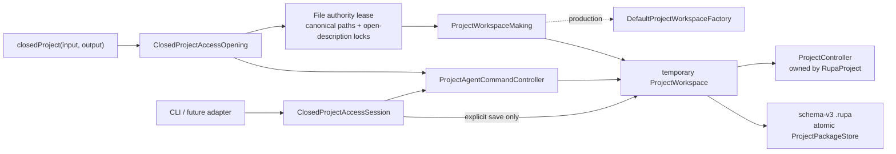
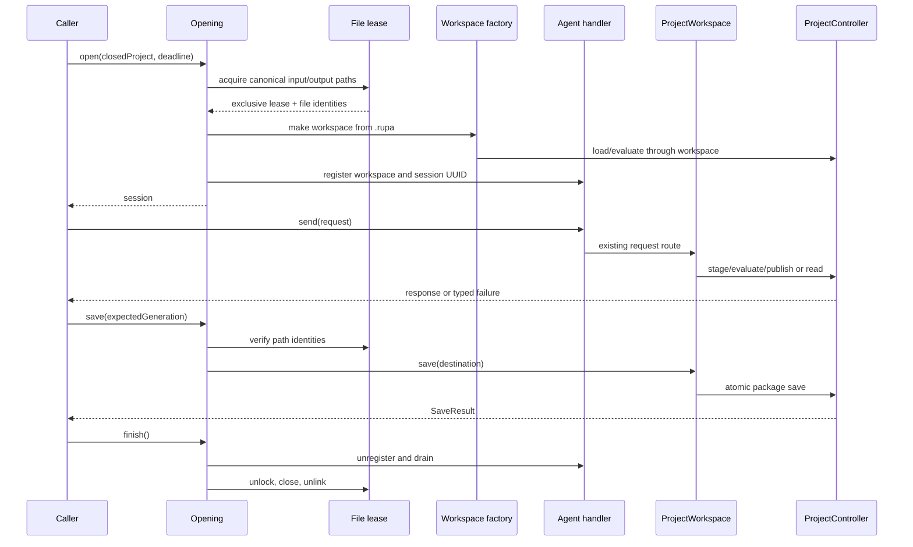

# RupaProjectAccessComposition

## Purpose and Scope

`RupaProjectAccessComposition` is the concrete closed-project adapter for the
transport-neutral [`RupaProjectAccess`](../RupaProjectAccess/DESIGN.md)
contract. It is a child of the [RupaKit package design](../../DESIGN.md) and a
sibling of `RupaProjectAccess`, `RupaAgentRuntime`, and `RupaKit`.

This module owns the bounded lifetime of one closed `.rupa` access session and
the file authority lease that protects its input and explicit output paths. It
does not add a live transport, CLI parser, semantic compiler, CAD operation
vocabulary, package writer, or project authority. Loading and saving are
performed only through the public `ProjectWorkspace` API; the workspace owns
the `ProjectController` composition and delegates persistence to the existing
project/package layers.

Parent: [RupaKit package design](../../DESIGN.md). Children: none.

## Responsibilities and Boundaries

This module owns:

- validation of a closed `.rupa` target and its input/output path set;
- one temporary workspace/session composition for one closed target;
- the `ProjectWorkspaceMaking` injection seam and its production factory adapter;
- delegation of every request to one registered
  `ProjectAgentCommandController`;
- explicit save to the target's input or output URL through
  `ProjectWorkspace.save`;
- process- and cross-process file authority leases using non-blocking
  open-description locks;
- deadline and finished-state guards at every request/save boundary;
- release ordering: unregister the workspace, then release the file lease.

It does not own:

- `ProjectController`, `EditorSession`, `ProjectPackageDocument`, or package
  archive entries;
- direct JSON/archive mutation or a second command switch;
- live App lifecycle, UDS endpoint selection, peer authentication, or CLI
  argument parsing;
- retries after an uncertain or committed operation;
- source IDs, Mesh buffers, semantic CAD operations, or evaluation policy.

## Related Designs

| Design | Relationship | Contract Used | Summary | Cautions |
|---|---|---|---|---|
| [RupaKit package](../../DESIGN.md) | parent | dependency direction and one project authority | Indexes this composition as the concrete access adapter. | Do not move authority into this module. |
| [RupaProjectAccess](../RupaProjectAccess/DESIGN.md) | depends on | target/session/open/save/finish contract | Defines the caller-facing access protocol and typed target failures. | This module implements the protocol; it does not change its DTOs. |
| [RupaAgentRuntime](../RupaAgentRuntime/DESIGN.md) | depends on | registered-workspace request handling | Supplies `ProjectAgentCommandController` and its existing request route. | Do not duplicate its command switch or bypass its registry. |
| [RupaKit integration](../RupaKit/DESIGN.md) | depends on | public `DefaultProjectWorkspaceFactory` and `ProjectWorkspace` load/save | Composes a temporary workspace and delegates project lifecycle operations. | No direct `ProjectController` or package dependency is allowed here. |
| [RupaAgentTransport](../RupaAgentTransport/DESIGN.md) | coordinates with in ACCESS-C | injected endpoint and peer-authorization boundary | The future live composition will connect this access contract to a transport adapter. | ACCESS-B does not import, create, or serve a socket. |
| [RupaProject](../RupaProject/DESIGN.md) | transitively used | controller staging/publication/rollback | Owns source, evaluation, and package publication. | This module never calls it directly. |
| [RupaProjectPackage](../RupaProjectPackage/DESIGN.md) | transitively used | schema-v3 load/save and atomic replacement | Owns archive integrity and destination replacement. | This module never edits package entries. |

## Architecture



The dependency direction is:

```text
RupaProjectAccessComposition
    -> RupaProjectAccess
    -> RupaAgentRuntime
    -> RupaKit

ACCESS-C live composition
    -> RupaAgentTransport
    -> RupaProjectAccessComposition
```

The composition target has no direct dependency on `RupaProject` or
`RupaProjectPackage` or `RupaAgentTransport`. Project/package authority is
reached only through `RupaKit`'s public workspace factory and lifecycle
methods; transport coordination is added by the later live composition.

## Contracts and Invariants

1. A closed target is accepted only when its input and optional output are
   file URLs with a `.rupa` extension. `.swcad` and other formats fail as
   `ProjectAccessError.unsupportedProjectFormat` before a workspace or lease
   is created.
2. Input must exist as a regular file and its parent must be accessible.
   Output may be absent, but its parent must exist and be a directory. The
   selected input/output URLs are canonicalized before lease acquisition.
3. Canonical input/output paths are deduplicated and acquired in lexical
   order. This prevents self-conflict and lock-order deadlocks.
4. A lease uses one persistent coordinator lock to serialize lock-file
   lifecycle and one non-blocking exclusive `flock`-style open-description
   lock per canonical path. Lock files are mode `0600`; the coordination
   directory is mode `0700`.
5. Release attempts to hold the coordinator lock while it unlocks, closes, and
   unlinks each path lock. If the non-blocking coordinator acquisition is not
   immediately available, descriptors are still released but lock files are
   retained; a later coordinator holder may reclaim them. No release path
   unlinks without coordinator ownership, so a contender cannot split onto a
   replacement inode.
6. The lease records the device/inode identity of every existing input/output
   path and rechecks the path with `stat` before every request and save. An
   externally replaced or externally newly-created path is a typed
   lost-authority failure. The session's own successful atomic publication is
   the one exception: `adoptPublished` verifies the new regular-file inode and
   rebinds the lease before recovery or the next operation. The source file
   descriptor remains open for the lease lifetime to preserve and verify the
   original open description.
7. Opening acquires the lease before loading and releases it on every failure.
   A successful open creates one workspace, evaluates it once, registers it
   once, and returns one session identity. There is no second workspace or
   shadow `EditorSession`.
8. `send` validates the session identity, finished state, deadline, and lease,
   then forwards the original `AgentRequest` once to the existing
   `ProjectAgentCommandController`. It does not decode, split, retry, or
   reinterpret a request.
9. `save` is the only persistence operation exposed by the session. It checks
   the expected generation and lease, calls `ProjectWorkspace.save` with the
   selected destination, and replaces the destination only through the
   existing package atomic-save path. The `.save` Agent request remains
   rejected by the runtime handler.
10. Failed load, request, evaluation, stale coordinate, cancellation, lease
    loss, or save preparation leaves the input destination unchanged. A
    post-publication save failure first attempts the existing committed-view
    recovery; a recovery failure returns the exact
    `AgentCommittedMutationOutcome` through
    `ProjectAccessError.committedMutation` with `mustNotRetry`. It never
    switches to another access route.
11. `finish` is idempotent and terminal. It first unregisters the temporary
    workspace and waits for accepted handler operations to drain, then
    releases the file lease. It never closes or mutates another project.

## Runtime Flows



The opening deadline is monotonic and is retained by the session. A deadline
that has elapsed before a request or save is rejected without invoking the
workspace. The current input/output destination is never inferred from an
Agent request.

## State, Ownership, and Lifecycle

`ClosedProjectAccessOpening` owns the injected lease store. The lease store
owns coordinator and path lock descriptors inside its actor isolation. A
`ClosedProjectAccessSession` owns one lease, one registered workspace, one
handler, one target, and one deadline for its lifetime. The temporary workspace
owns the `ProjectController`; the session never retains a controller or package
document directly.

The session is MainActor-isolated because `ProjectWorkspace` and
`ProjectAgentCommandController` are MainActor-isolated. The lock store remains
an actor so file-descriptor state and release order are serialized without
`@unchecked Sendable` or `nonisolated(unsafe)` state.

## Failure, Concurrency, and Constraints

Concurrent sessions sharing any canonical input/output path fail acquisition
with `ProjectAccessError.fileAuthorityConflict(URL)`. A path or lock inode
replacement after acquisition fails with
`ProjectAccessError.fileAuthorityLost(URL)`. Different path sets may proceed
concurrently. All path sets use lexical acquisition order.

The coordinator lock is a durable lock file in the private coordination
directory and is never unlinked. Per-path lock files are removed only while
the coordinator lock is held. A crashed owner releases the open-description
lock through the operating system; the next opener may reclaim the durable
lock file after verifying the target path identity.

The implementation uses bounded synchronous filesystem calls at the adapter
boundary. It does not perform blocking I/O while holding a Swift `Mutex`; the
lease actor serializes descriptor operations, and project/package I/O remains
inside the existing workspace/project contracts.

## Verification and Change Impact

`RupaProjectAccessCompositionTests` must execute the real composition and
prove:

- CAD-only, CAD-plus-Authored-Mesh, and Mesh-only packages open, evaluate,
  mutate through the registered handler, explicitly save, and reload;
- `.swcad`, missing input, invalid output parent, and path identity changes
  fail before mutation;
- two sessions with overlapping canonical input/output sets cannot both
  acquire a lease, while disjoint sets can;
- lock-file mode, coordination-directory mode, lexical deduplication,
  open-description lifetime, and release/unlink behavior are observable;
- request/session mismatch, finished session, deadline, stale generation,
  command/evaluation failure, and save failure leave the input bytes intact;
- a successful request changes only in-memory state until `save`, and
  `finish` unregisters before lease release.
- a test-only registration boundary deterministically cancels an opening after
  handler registration and proves that the temporary session is unpublished
  before the lease can be reacquired.

Changes to target/session semantics require rechecking
[`RupaProjectAccess`](../RupaProjectAccess/DESIGN.md), the runtime handler,
`ProjectWorkspace` load/save contracts, the package design, and the system
live/file access workflow.
