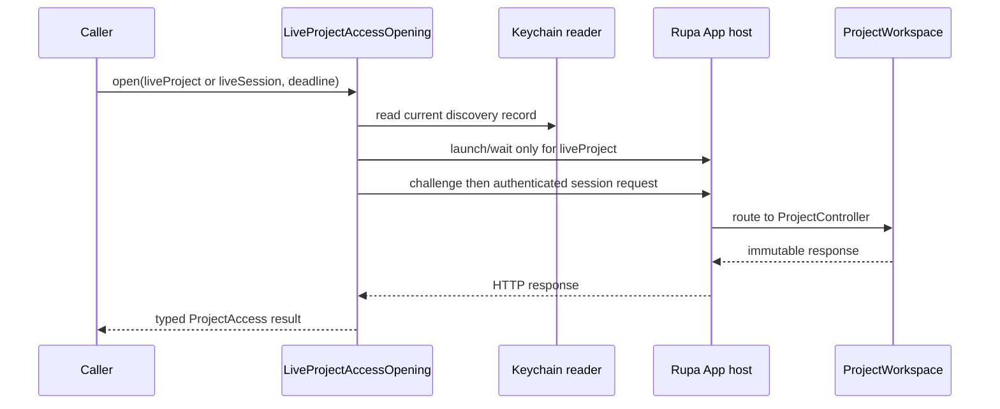

# RupaProjectAccessComposition

## Purpose and Scope

`RupaProjectAccessComposition` is the live-project adapter for the public
`RupaProjectAccess` API. It is a child of the [RupaKit package design](../../DESIGN.md)
and depends on the platform discovery and HTTP transport contracts. Children:
none.

The adapter resolves the App-owned session and forwards one semantic request
at a time to the App's `ProjectWorkspace` and `ProjectController`. It never
creates a second project authority.

## Responsibilities and Boundaries

This module owns:

- validation of live project/session targets;
- App launch and readiness waiting for a requested project URL;
- Keychain discovery resolution and authenticated HTTP client construction;
- one access session's serialization, deadline, finish, and explicit save
  forwarding.

It does not own Keychain writes, listener lifecycle, package codecs, project
files, temporary workspaces, CAD/Mesh state, or command semantics. All
mutation, evaluation, and persistence remain in the App-owned workspace path.

## Related Designs

| Design | Relationship | Contract Used | Summary | Cautions |
|---|---|---|---|---|
| [RupaKit package](../../DESIGN.md) | parent | one project authority | Defines the package-level access boundary. | Do not add another writer or controller. |
| [RupaProjectAccess](../RupaProjectAccess/DESIGN.md) | depends on | target, opening, observation, session, and save protocols | Defines the transport-neutral public API. | This module is an adapter, not the public semantic owner. |
| [RupaProjectAccessPlatform](../RupaProjectAccessPlatform/DESIGN.md) | depends on | Keychain discovery reader | Supplies the current port, HMAC key, and generation. | The adapter cannot publish discovery. |
| [RupaAgentTransport](../RupaAgentTransport/DESIGN.md) | depends on | authenticated loopback HTTP client | Carries one request and response under one deadline. | Transport does not expose project identity. |
| [RupaAgentRuntime](../RupaAgentRuntime/DESIGN.md) | used by | semantic request handling | Runs the request against the registered workspace. | Runtime remains App-owned. |
| [Rupa App](../../../Rupa/Rupa/Rupa/DESIGN.md) | coordinates with | process-lifetime host and workspace session | Owns the target project and discovery writer. | Access finish never closes the App document. |

## Architecture

```mermaid
flowchart LR
    Caller["CLI / future API client"] --> Access["ProjectAccess API"]
    Access --> Resolver["Live session resolver"]
    Resolver --> Keychain["Discovery reader"]
    Keychain --> Client["Authenticated HTTP client"]
    Client --> Host["Rupa App HTTP host"]
    Host --> Handler["ProjectAgentCommandController"]
    Handler --> Workspace["App-owned ProjectWorkspace"]
    Workspace --> Controller["ProjectController"]
```

## Contracts and Invariants

1. Only `.liveProject(URL)` and `.liveSession(UUID)` targets are accepted.
   Other target forms are not part of the public contract and fail typed.
2. A project URL request launches the App when necessary, waits for the
   matching registered session, and uses one monotonic deadline for launch,
   discovery, resolution, and the request. It never replaces a dirty project.
3. A session ID request resolves only an already registered App session; it
   never starts or replaces an application.
4. Each access session carries one exact session ID and forwards it unchanged
   in the Agent request. Session mismatch is a typed failure.
5. Access operations serialize through the session. `finish()` releases only
   client transport resources and does not close or save the App document.
6. `save` is explicit and reaches the App coordinator; successful mutations
   never write package bytes implicitly.
7. Discovery failures, stale generations, deadline exhaustion, cancellation,
   response loss, and semantic failures remain failures. No alternate route or
   retry is selected after dispatch.
8. The adapter does not expose port, HMAC key, or generation in semantic project
   responses; those values remain transport composition state.
9. `liveProject` may wait for discovery under the caller's unchanged deadline,
   but a generation that fails readiness is never connected or sent to again;
   only a newly published generation may receive the next readiness attempt.
   `liveSession` and observation calls do not launch, wait for another authority,
   or retry. Once opened, a session remains bound to the exact discovery
   generation that resolved it.

## Runtime Flows

## State, Ownership, and Lifecycle

`LiveProjectSessionResolver` owns no project state. `LiveProjectAccessSession`
owns one client and one session ID until `finish`; operation serialization
prevents overlapping requests on that client. The App owns workspace and
document lifetime independently of every external session.

## Failure, Concurrency, and Constraints

Invalid targets, missing sessions, dirty replacement, unauthorized discovery,
stale generation, invalid responses, deadlines, cancellation, and transport
loss are typed failures. A response-loss after a complete request is
outcome-unknown and cannot be replayed. The adapter never catches a failure
and substitutes an empty project or a local controller.

## Verification and Change Impact

Focused composition tests prove target validation, Keychain discovery,
session-ID routing, URL launch readiness, exact session forwarding,
serialization, explicit save, deadline/cancellation, stale-generation
rejection, response-loss classification, and no fallback. Application tests
must prove the same workspace/controller is observed by UI and API clients.
