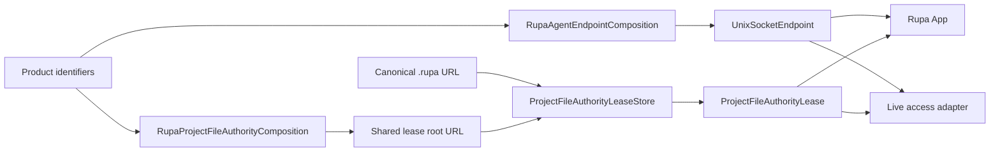

# RupaProjectAccessPlatform

## Purpose and Scope

`RupaProjectAccessPlatform` is the lightweight Darwin product-composition
module for project access. It owns the product App Group coordinates, the
injected Unix socket endpoint and project-authority directory values derived
from them, and the cross-process file-authority lease used by both the App and
closed-project access.

It is a child of the [RupaKit package design](../../DESIGN.md) and a sibling of
[`RupaProjectAccess`](../RupaProjectAccess/DESIGN.md),
[`RupaAgentTransport`](../RupaAgentTransport/DESIGN.md), and
[`RupaProjectAccessComposition`](../RupaProjectAccessComposition/DESIGN.md).
Children: none.

## Responsibilities and Boundaries

This module owns product-local Darwin coordination only:

- the exact App Group identifier, Rupa application bundle identifier, and
  relative Agent endpoint and project-authority placement;
- conversion of that placement into an injected `UnixSocketEndpoint`;
- resolution of the one shared project-file lease directory;
- canonical project-path leases, device/inode validation, and their
  cross-process lock lifetime.

It does not open an application, connect or serve a socket, create a workspace,
interpret an Agent request, mutate Product/CAD/Mesh state, or save a package.
The App and project-access adapters consume its values and leases but retain
their own lifecycle responsibilities.

## Related Designs

| Design | Relationship | Contract Used | Summary | Cautions |
|---|---|---|---|---|
| [RupaKit package](../../DESIGN.md) | parent | target dependency direction | Keeps product/platform composition below App and access adapters. | Do not add workspace or CAD dependencies. |
| [RupaProjectAccess](../RupaProjectAccess/DESIGN.md) | depends on | typed authority failures | Supplies transport-neutral file-authority errors. | This module must not change session semantics. |
| [RupaAgentTransport](../RupaAgentTransport/DESIGN.md) | depends on | `UnixSocketEndpoint` value | Receives the resolved endpoint without learning App Group policy. | Socket I/O and peer authentication remain transport-owned. |
| [RupaProjectAccessComposition](../RupaProjectAccessComposition/DESIGN.md) | used by | file lease and endpoint coordinates | Composes live and closed access without duplicating product constants. | It must not reimplement path placement or locking. |
| [Rupa App](../../../Rupa/Rupa/Rupa/DESIGN.md) | used by | App Group, endpoint, and file lease | Uses the same coordination values as the CLI adapter. | App process/workspace lifetime remains App-owned. |

## Architecture



The direct dependency direction is intentionally narrow:

```text
RupaProjectAccessPlatform
    +-> RupaProjectAccess
    +-> RupaAgentTransport
```

It has no direct dependency on `RupaKit`, `RupaProject`,
`RupaCADIntegration`, or the high-level access composition. Its two contract
dependencies inherit the package's existing protocol graph transitively; this
module does not claim to remove those transitive links. Keeping the direct
edge narrow allows the App to consume coordination values without linking a
second high-level project composition product.

## Contracts and Invariants

1. Product identifiers have one owner and are identical for App and CLI
   composition.
2. Endpoint and project-authority resolution return values under the exact
   App Group container or typed failures. There is no temporary-directory
   fallback and no App/CLI-specific placement.
3. Lease paths are canonicalized, deduplicated, and acquired in lexical order.
4. One persistent coordinator lock serializes lock-file lifecycle; each path
   has one non-blocking exclusive open-description lock.
5. Lock directories are mode `0700` and lock files are mode `0600`.
6. A lease validates the path and lock identities it acquired. Atomic package
   publication may rebind only through explicit `adoptPublished`.
7. Release is idempotent and closes every owned descriptor exactly once.
8. The module exposes coordination values and resource leases only; neither is
   project authority and neither can publish source or package state.

## State, Ownership, and Lifecycle

`ProjectFileAuthorityLeaseStore` is an actor and owns every mutable record and
file descriptor. A returned lease carries only its identity, store reference,
and canonical path set. The endpoint and authority-directory resolvers own no
mutable state.

The App retains its lease for the current document. A closed access session
retains its lease until `finish`. Consumers determine those lifetimes; this
module guarantees validation, adoption, and release behavior within them.

## Failure, Concurrency, and Constraints

Overlapping canonical path sets fail with a typed authority conflict. A changed
device/inode or replaced lock identity fails with typed authority loss. The
store serializes state transitions through actor isolation and performs no
external callback while mutating its records.

Endpoint resolution is bounded filesystem composition. Network framing,
connection limits, deadlines, and same-UID authorization remain in
`RupaAgentTransport`.

## Verification and Change Impact

Platform tests must prove endpoint and authority-root failure without an App
Group container, identical App/CLI authority placement, canonical path
deduplication, conflicting and disjoint lease behavior,
identity replacement detection, published-inode adoption, crash release, and
idempotent cleanup. App and project-access integration tests must additionally
prove that both consumers use this exact module rather than duplicate product
coordinates.

Changes require rechecking the transport endpoint contract, closed access
session lifecycle, App file lifecycle, and the Rupa Xcode product dependency
graph.
