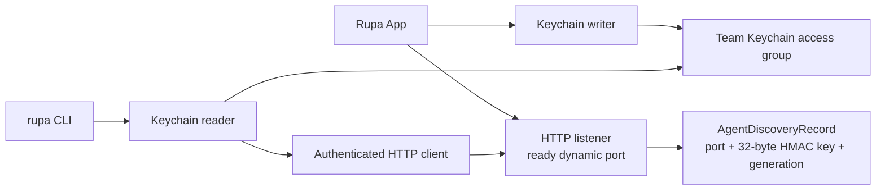
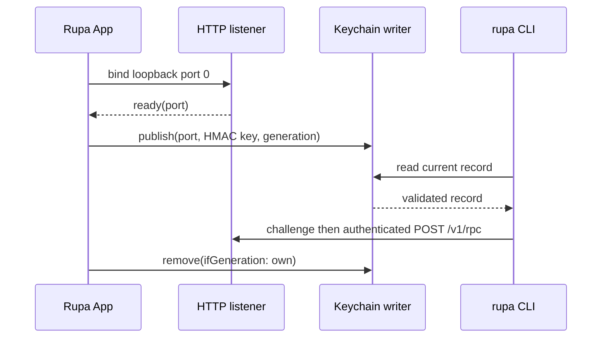

# RupaProjectAccessPlatform

## Purpose and Scope

`RupaProjectAccessPlatform` owns product-level discovery for the live Rupa
API. It is a child of the [RupaKit package design](../../DESIGN.md) and a
sibling of `RupaProjectAccess` and `RupaAgentTransport`. Children: none.

The module provides one Team-owned Keychain record containing the current
loopback port, per-launch 256-bit HMAC key, and generation. It does not own
project data or semantic operations.

## Responsibilities and Boundaries

This module owns:

- the single Rupa product access identity shared by the App and signed CLI;
- the injected Keychain service, account, and access-group configuration;
- the product request-time budget shared by the App listener and signed CLI;
- `AgentDiscoveryRecord` validation, encoding, and generation identity;
- Keychain read, publish, and conditional removal providers;
- the typed failures for unavailable or unauthorized discovery.

It does not bind a listener, open an application, create a workspace,
interpret an Agent request, mutate a package, or select a CLI command route.
Production composition is the only writer of a discovery record. Readers are
used by the external API client; tests may inject an in-memory provider.

## Related Designs

| Design | Relationship | Contract Used | Summary | Cautions |
|---|---|---|---|---|
| [RupaKit package](../../DESIGN.md) | parent | package dependency direction | Places platform composition below App and access layers. | No project authority is added here. |
| [RupaAgentTransport](../RupaAgentTransport/DESIGN.md) | coordinates with | dynamic loopback port and HMAC proof values | The listener returns a ready port before publication. | Transport never reads Keychain. |
| [RupaProjectAccess](../RupaProjectAccess/DESIGN.md) | used by | live access opening and typed failures | The access adapter resolves discovery before creating a session. | Discovery is not project state. |
| [RupaProjectAccessComposition](../RupaProjectAccessComposition/DESIGN.md) | used by | injected discovery reader | Composes a live client from a validated record. | It cannot publish or remove records. |
| [Rupa App](../../../Rupa/Rupa/Rupa/DESIGN.md) | used by | writer and generation lifecycle | The App publishes after listener readiness and removes its own generation. | Shutdown must not remove a newer record. |
| [Rupa CLI Product](../../../Rupa/Rupa/RupaCLI/DESIGN.md) | used by | Keychain reader | The CLI resolves the current App endpoint without filesystem discovery. | CLI never writes discovery. |

## Architecture

## Contracts and Invariants

1. `AgentDiscoveryRecord` contains a loopback port in `1...65535`, exactly 32
   HMAC-key bytes, and a nonzero generation. Invalid records are typed failures.
2. `RupaProductAccessConfiguration.current` is the single product-composition
   source for the App bundle identifier and Keychain service, account, and
   access group. `KeychainAgentDiscoveryStore` still requires those values as
   injected inputs and does not select a product identity itself. The record
   payload contains no project or package bytes.
3. `publish` replaces a stale record as one Keychain update operation. The App
   calls it only after the listener reports readiness and after application
   authority acquisition.
4. `remove(ifGeneration:)` removes only an exact generation. A shutdown from
   an older process cannot erase a newer live record.
5. Read, publish, and conditional removal surface Keychain status as typed
   errors. There is no environment, filesystem, or transport fallback.
6. The production App is the sole discovery-record writer. The CLI and future
   API clients are readers and use the returned key only for directional HMAC
   proofs; the key is never sent on the wire.
7. The Keychain access group is a credential-sharing boundary only. It does
   not grant project or package authority; `ProjectController` remains the
   sole mutation authority.
8. `RupaProductAccessConfiguration.current` owns one 120-second request budget
   used by both production endpoints. This is an upper bound for launch,
   semantic execution, package persistence, and response delivery, not a
   retry interval. Clients may fail earlier on cancellation or typed errors.

## Runtime Flows

## State, Ownership, and Lifecycle

The immutable product access configuration is shared by App and CLI
composition. The Keychain provider is a small value adapter around its
injected configuration and does not retain project state. The App owns one
HMAC key and generation for the listener lifetime. A new App instance
publishes a new generation only after its own listener is ready; shutdown
drains the listener before conditional removal.

## Failure, Concurrency, and Constraints

Keychain unavailable/denied, malformed records, generation mismatch, and
stale endpoint failures are terminal for that access attempt. Concurrent
writers are serialized by application authority and a conditional generation
check. Readers never retry a dispatched request after a response-loss result.
The shared 120-second product budget prevents a valid package save from being
reported as outcome-unknown solely because client and listener use different
or shorter production limits.

## Verification and Change Impact

Platform tests prove exact 32-byte credentials, record validation,
publish/read/conditional-remove behavior, stale-generation preservation,
Keychain authorization failure, and injected-store isolation. App and CLI
integration must prove the same record is resolved without exposing a
filesystem path and that project operations still reach the App-owned
workspace/controller.
