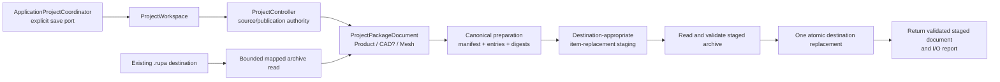
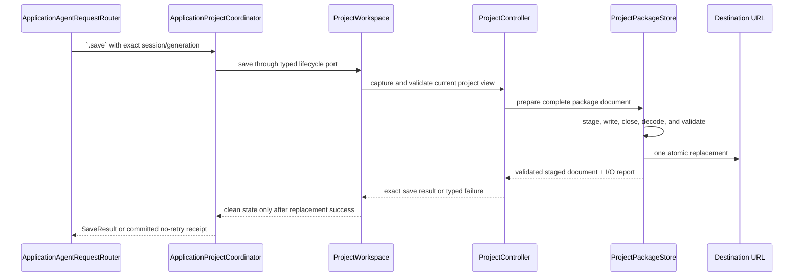

# RupaProjectPackage

## Purpose and Scope

`RupaProjectPackage` owns the portable schema-v3 `.rupa` archive boundary. It
encodes and decodes the manifest, opaque Product and optional CAD source bytes,
the Authored Mesh catalog and content-addressed blobs, and namespaced unknown
adjuncts. It is a child of the [RupaKit package design](../../DESIGN.md) and
the [system design](../../../DESIGN.md). It has no child designs.

This module supplies a synchronous value and I/O contract to `RupaProject` and
the application coordinator. It does not decide when a project is published,
which URL is current, or which Agent request is allowed to save. ACCESS-O.4
fixes the composition and failure contract below; ACCESS-O.5 implements the
destination-specific staging replacement without changing the portable archive
format.

## Responsibilities and Boundaries

The module owns:

- schema-v3 manifest and source-entry identity;
- bounded archive reading and canonical archive writing;
- Product source bytes, optional CAD source bytes, and Authored Mesh catalog/blob
  integrity at the package boundary;
- content-addressed blob reuse and explicit unreferenced-blob collection;
- namespaced adjunct validation and preservation;
- complete prepublication archive preparation and staged-archive validation;
- destination-appropriate item-replacement staging and one atomic destination
  replacement;
- typed I/O, schema, integrity, path, resource-limit, and atomic failures.

It does not own:

- Product, CAD, or Mesh semantic codecs or source authority;
- `ProjectController`, `ProjectWorkspace`, revision/history, or evaluation;
- application file activation, security-scoped URL lifetime, or process
  authority;
- Agent request routing, socket transport, UI state, or save policy;
- a persisted `ProjectSourceModel` projection.

The package boundary is intentionally opaque: source codecs create or consume
the role-specific source values, while this module preserves their bytes and
declared identities. `ProjectController` remains the only project publication
authority. A package destination replacement is durable file publication, not
a second in-memory project publication.

## Related Designs

| Design | Relationship | Contract Used | Summary | Cautions |
|---|---|---|---|---|
| [RupaKit package](../../DESIGN.md) | parent | target graph and source-authority direction | Places package I/O below project publication and above archive storage. | Package details remain here; the parent only indexes ownership. |
| [RupaProject](../RupaProject/DESIGN.md) | used by | staged project source, package, evaluation, and publication contract | Supplies the immutable package document and decides when a save participates in project lifecycle. | A package failure before destination replacement must not publish a project save result. |
| [RupaCore](../RupaCore/DESIGN.md) | used through Project | Product/CAD/Authored Mesh source identity | Owns semantic source validation and asset meaning. | Package bytes are not a substitute for Core source authority. |
| [RupaKit integration](../RupaKit/DESIGN.md) | used by | workspace save and exact view contract | Exposes application-facing operations over `ProjectWorkspace`. | It cannot edit archive entries directly. |
| [Rupa App](../../../Rupa/Rupa/Rupa/DESIGN.md) | coordinates with | current URL and application lifecycle | Supplies the destination and owns application save intent. | The package never selects the current URL or process authority. |
| [Agent host](../RupaAgentUI/DESIGN.md) | coordinates with | transport-independent request handler | Keeps Agent transport and registration separate from package persistence. | Agent requests reach save only through the typed application coordinator port. |
| [State and project contract](../../../Rupa/STATE_AND_PROJECT_CONTRACT.md) | depends on | atomic source publication and dirty-state semantics | Defines the distinction between project commit and later durable save. | A post-commit save failure retains the published edit and dirty state. |
| [Project package tests](../../Tests/RupaProjectPackageTests) | verification owner | archive, integrity, reuse, and replacement evidence | Exercises the real package store and injected failure boundaries. | Structural manifest checks alone are insufficient. |

## Architecture



The package store may map an existing archive for bounded validation and retain
unchanged blob ranges for later streaming reuse. The writer emits deterministic
entry order and bounded chunks. The destination replacement is the final
package step; no second codec or project projection is introduced after it.

## Contracts and Invariants

1. The archive is schema-v3 only. It contains `manifest.json`, required
   `source/product.json`, optional `source/cad.json`, optional
   `source/mesh-assets.json` with referenced content-addressed Mesh blobs, and
   `adjuncts/<namespace>/...` entries. `source/rupa.json` and schema-v2 input
   are rejected with typed errors; no silent migration or fallback is allowed.
2. Product, CAD, and Mesh sources remain disjoint. Product source is required;
   CAD source may be absent for Mesh-only projects; every Mesh catalog record
   has exactly one matching blob and provenance. A package never serializes a
   `ProjectSourceModel` projection as an additional source.
3. Manifest paths, media types, schema versions, byte counts, content
   fingerprints, CRCs, archive structure, feature declarations, and source
   identities are validated before a package is accepted. Product/CAD semantic
   compatibility is validated by the codecs and project layer that produced
   the opaque source values.
4. Every save first prepares all entries, obtains a staging location suitable
   for the destination volume and sandbox, writes the complete archive, closes
   the writer, and reads the staged archive through the normal bounded decoder.
   The staged document and content identity must reproduce the prepared
   Product/CAD/Mesh sources before replacement is attempted.
5. Staging failure, write failure, staged validation failure, cancellation,
   or atomic replacement failure removes the staging item when possible and
   leaves an existing destination byte-for-byte unchanged. If no destination
   existed, it remains absent. Cleanup failure before replacement is reported
   as a typed atomic failure and never converted to success.
6. The destination is replaced exactly once after all prepublication checks.
   The package returns the already validated document read from the staging
   archive after the replacement call; it does not perform a fallible reload of
   the destination after publication. This prevents a post-publication read
   error from being reported as an ambiguous save failure or from encouraging
   a retry against an already changed file. If removing the now-empty staging
   directory fails after replacement, the successful result carries a typed
   cleanup warning; the store must not throw after durable publication.
   `RupaProjectPackage` owns `ProjectPackageSaveWarning`, whose `Code` includes
   `stagingCleanupFailed`; `ProjectPackageSaveResult.warnings` carries zero or
   more of these values beside the validated document, content identity, and
   I/O report. The warning message contains the failed cleanup operation but no
   project or transport policy.
7. A project save failure after an in-memory edit has already committed is
   distinct from a package staging failure: the committed project view and
   dirty state remain authoritative, while the caller receives a typed save
   failure. Only a successful package replacement may mark the project clean.
8. Entry order, manifest encoding, source-entry encoding, and blob reference
   order are deterministic. Unchanged content-addressed blobs may be streamed
   from retained immutable backing without rematerializing them; unreferenced
   blobs are retained or collected only by the explicit document policy.
9. All archive and source limits are checked before allocation or emission.
   Chunked reads/writes remain within configured bounds, ZIP32 limits and
   path-traversal protections are enforced, and unknown entries are preserved
   only under a validated namespaced adjunct path.
10. Package APIs expose typed success or failure. They do not manufacture an
    empty document, adopt a different destination, reload a stale URL, or
    mutate project/session state on failure.

## Runtime Flows

### Explicit save



The router never calls `ProjectPackageStore` and never receives an archive
entry. On a prepublication failure, the destination and in-memory published
state remain unchanged. If the project publication itself has already occurred
and only result/view recovery fails, the existing
`AgentCommittedMutationOutcome` no-retry contract is used rather than a normal
retryable save error.

### Load

```text
ApplicationProjectCoordinator
  -> ProjectWorkspace.load
    -> ProjectPackageStore.load(destination)
      -> bounded archive map and manifest validation
      -> Product/CAD/Mesh source reconstruction
    -> ProjectController staging, projection, evaluation, and publication
  -> retain URL/security scope only after successful publication
```

Load never adopts a partially decoded source. A missing CAD source is a valid
Mesh-only package state, not an instruction to fabricate CAD authority.

## State, Ownership, and Lifecycle

`ProjectPackageDocument` owns immutable source values and, for a loaded package,
the mapped archive backing needed for adjunct and unchanged-blob reuse. The
package store owns staging resources only for one synchronous save invocation.
The staging item is closed and removed or atomically renamed before the store
returns. The now-empty staging directory is removed after replacement; a
failure at that postpublication cleanup boundary is retained as result
telemetry rather than converted into a retryable save failure. No staging URL,
mapped backing, or package writer is transferred to an Agent request, UI, or
long-lived project session.

`ProjectController` owns in-memory project publication and history;
`ApplicationProjectCoordinator` owns the current URL and security-scoped
lifetime; the Agent host owns only request transport. These
owners may pass the package's immutable result, but never exchange ownership of
their lifecycle state through package APIs.

## Failure, Concurrency, and Constraints

The package store is synchronous and `Sendable`; callers serialize project save
operations at their owning actor/sequencer. A staging operation must not run
concurrently against the same destination without the caller's file-authority
contract. The package itself never uses a process-global mutable cache or a
second project authority.

Typed failures cover unsupported schema/feature, malformed archive, invalid or
traversal path, duplicate/missing entry, invalid source, resource limit,
checksum/content mismatch, staging I/O, prepublication cleanup, and atomic
replacement. A typed result warning covers postpublication staging-directory
cleanup because the destination is already durable. The caller distinguishes
prepublication package failure from post-commit view projection failure and
preserves the corresponding no-retry semantics.

Resource ceilings bound archive size, entry count, metadata size, source/blob
size, preserved adjunct bytes, and read/write chunk size. Existing mapped
backing and borrowed spans are synchronous; no buffer pointer or staging handle
escapes its owner or crosses an actor boundary.

## Verification and Change Impact

`RupaProjectPackageTests` must exercise the real store and injected replacement
boundaries for:

- CAD-only, CAD-plus-Mesh, and Mesh-only schema-v3 round trips;
- rejection of `source/rupa.json`, schema-v2, malformed paths, duplicate or
  missing entries, checksum mismatch, missing blobs, and resource overflow;
- deterministic entry order, source identity, namespaced adjunct preservation,
  unchanged blob byte reuse, and explicit unreferenced-blob collection;
- existing-destination and absent-destination byte preservation for staging
  create/write/validation/replacement/prepublication-cleanup failure;
- a typed successful-result warning, without retryable failure, when only the
  empty staging-directory cleanup fails after replacement;
- successful staged decode followed by one atomic replacement, with no
  destination reload used as a post-publication success condition;
- bounded read/write and geometry-copy telemetry for large Mesh payloads.

Changes to schema, source entries, retained backing, resource limits, or
replacement sequencing require rechecking [RupaProject](../RupaProject/DESIGN.md),
the [Rupa App](../../../Rupa/Rupa/Rupa/DESIGN.md), the [Agent host](../RupaAgentUI/DESIGN.md),
and the package-level authority graph. O.4 establishes the contract; O.5 owns
the implementation and focused package evidence.
