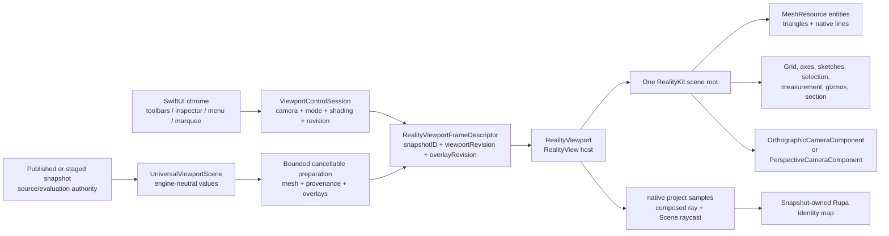

# RupaRendering

## Purpose and Scope

`RupaRendering` owns the bounded, postpublication presentation contract for one
immutable viewport snapshot. Production is currently a migration hybrid:
`RealityViewportView` supplies the RealityKit surface and native camera, while
SwiftUI `Canvas` still supplies the grid and world overlays and the legacy
identity renderer still supplies part of picking. RK-3 through RK-5 and RK-IV
remove those remaining routes. The target uses RealityKit on macOS 27 or later,
with `RealityView` as the live host and `RealityRenderer` limited to offscreen
GPU verification. A mounted native surface or capability probe alone does not
constitute the complete production backend cutover. The module's
CAD and Mesh inputs remain engine-neutral values from
[`RupaViewportScene`](../RupaViewportScene/DESIGN.md); RealityKit objects are
never source authority.

`RupaRendering` has one target child component,
[`ViewportMeasurement`](ViewportMeasurement/DESIGN.md), and the new
[`RealityViewport`](RealityViewport/DESIGN.md) component owns native scene
resources, entities, camera application, materials, and native input queries.
This target design replaces the remaining split native-surface,
spatial-Canvas, and legacy-identity composition after the migration gates.
Until then, spatial SwiftUI `Canvas` and identity GPU readback remain active
production routes beside the RealityKit surface, not a completed cutover.

## Responsibilities and Boundaries

The module owns:

- admission and cancellation of one bounded derived presentation request;
- the engine-neutral frame descriptor joining `snapshotID`, viewport revision,
  overlay revision, camera state, and spatial presentation descriptors;
- the document-lifetime `ViewportControlSession` camera, display-mode, shading,
  and revision authority;
- RealityKit resource/entity preparation and one coherent scene-root swap;
- native camera projection, mounted-camera ray composition, native collision,
  and triangle-hit resolution through the RealityViewport child contract;
- exact CAD/Mesh provenance mapping from native hits back to stable Rupa IDs.

It does not own CAD source, Mesh source, evaluation policy, project
publication, history, persistence, Agent/MCP routing, or source mutation.
`RupaUI` owns only SwiftUI composition and non-spatial chrome. It must not
build geometry, create a second camera, or retain a second presentation scene.

## Related Designs

| Design | Relationship | Contract Used | Summary | Cautions |
|---|---|---|---|---|
| [RupaKit package](../../DESIGN.md) | parent | Package dependency and authority direction | Places derived RealityKit presentation above source/evaluation. | RealityKit IDs never become Product/CAD IDs. |
| [RupaViewportScene](../RupaViewportScene/DESIGN.md) | depends on | `UniversalViewportScene`, `snapshotID`, world transforms, bounds, and provenance | Supplies immutable engine-neutral scene values. | Rendering cannot re-evaluate or retessellate source. |
| [RupaCore](../RupaCore/DESIGN.md) | depends on | Validated source/evaluation and stable identity contracts | Supplies source-derived material and navigation metadata. | Presentation material resolution never mutates the document. |
| [RealityViewport](RealityViewport/DESIGN.md) | child | Native scene/resource/camera/material/input adapter | Owns RealityKit objects and the matching scene-root lifecycle. | No custom render pipeline or spatial Canvas fallback. |
| [ViewportMeasurement](ViewportMeasurement/DESIGN.md) | child | Transient world endpoints, distance, ruler descriptors | Produces non-authoritative spatial measurement values. | It does not own RealityKit entity lifetime. |
| [RupaResponsivenessBaseline](../RupaResponsivenessBaseline/DESIGN.md) | coordinates with | Versioned fixture and pinned MainActor/memory acceptance policy | Owns the threshold and environment against which native preparation is measured. | A new native interval must be measured in the signed App; an offscreen duration does not satisfy this contract. |
| [RupaUI](../RupaUI/DESIGN.md) | used by | Matching frame state, tool intents, and visible errors | Composes `RealityView` and non-spatial SwiftUI chrome. | UI never becomes a geometry or camera authority. |
| [RupaAgentProtocol](../RupaAgentProtocol/DESIGN.md) | used by | Foundation-value viewport operation/state contract | Routes camera/display operations to the mounted session. | Applied state is not proof of a displayed frame. |
| [Rendering tests](../../Tests/RupaRenderingTests) | verification owner | CPU admission and target RealityKit GPU behavior | Verifies the target lifecycle, native camera/material/input, provenance, and frame coherence. | Capability tests do not prove current-production or CAD integration; CPU tests do not prove live RealityView behavior. |

## Architecture



The shared seam is an immutable `RealityViewportFrameDescriptor` value. It
contains the `UniversalViewportScene` and its `snapshotID`, the mounted
`ViewportControlSession` revision and camera snapshot, an explicit
`overlayRevision`, and bounded engine-neutral spatial descriptors. It contains
no `Entity`, `MeshResource`, `RealityViewCameraContent`, `MTLBuffer`, or
`MTLRenderCommandEncoder`; native objects are created and owned only inside
`RealityViewport`. A frame is publishable only when all identity fields still
match the request that produced its resources.

RealityKit owns the presentation operations it already provides:

| Viewport need | RealityKit owner |
|---|---|
| Solid surface | `MeshResource` + native lit material (`PhysicallyBasedMaterial` or equivalent built-in material) |
| Flat surface | `MeshResource` + `UnlitMaterial` |
| Ortho camera | `OrthographicCameraComponent` |
| Perspective camera | `PerspectiveCameraComponent` |
| Spatial lines and triangles | `LowLevelMesh`/`MeshResource` native topology and `ModelComponent` |
| Repeated geometry | shared `MeshResource` entities; `MeshInstancesComponent` only after provenance is verified |
| Point projection and view ray | `RealityViewport` mounted-camera query contract: `RealityViewCameraContent.project(_:)` samples plus camera-local composed ray |
| Object/face hit | collision group/filter and bounded `Scene.raycast`, resolving `triangleHit.faceIndex` |
| Text labels | native `MeshResource` text extrusion and `BillboardComponent` |
| Sketch/path extrusion | native `MeshResource(extruding:extrusionOptions:)` |
| Section-plane clipping | `ClippingComponent` on a dedicated scene-hierarchy root |

`CustomMaterial` is allowed only for a RealityKit presentation feature that
the built-in material contract cannot express, such as MatCap or signed normal
color. It remains a RealityKit material and is validated
as a bounded resource. A custom Metal render pipeline, direct command encoder,
drawable management, synchronous GPU readback, Canvas raster texture, or
independent tessellator is never an alternative implementation.

## Contracts and Invariants

### Source, frame, and provenance

1. `UniversalViewportScene.snapshotID` is the source/evaluation identity. A
   frame also carries one mounted viewport revision and one overlay revision.
   Scene resources, spatial overlays, camera, render state, and hit-test map
   are all derived from that exact tuple.
2. The displayed RealityKit scene and the hit-test scene are the same root and
   same frame. A preparing, failed, cancelled, stale, or mismatched request
   cannot replace the current frame and cannot acquire picking authority.
3. Entity names, hierarchy, UUIDs, `MeshResource` identity, and collision
   shape identity are implementation details. Stable occurrence, definition,
   representation, source, face, edge, vertex, sketch, and handle IDs remain
   in the snapshot-owned provenance map.
4. The frame descriptor contains no source mutation or project publication
   authority. A preview frame is discarded on cancel/stale replacement and
   never enters history, undo, persistence, or source selection.

### Native camera and input

5. `ViewportControlSession` is the only mutable camera/display/shading owner.
   UI gestures and Agent/MCP operations call the same throwing action boundary.
   Camera updates change RealityKit camera components/transforms and do not
   rebuild mesh resources or scene provenance.
6. Parallel and perspective use their native RealityKit camera components.
   Fit, pan, orbit, zoom, saved-view restore, and orientation preserve the
   session's finite focus/basis/lens contract. The
   [RealityViewport mounted-camera query contract](RealityViewport/DESIGN.md#contracts-and-invariants)
   is the live projection/ray authority; any bounded CPU tolerance calculation
   must agree with it and may not create a second live camera. Production uses
   only native `PerspectiveCameraComponent` or `OrthographicCameraComponent`.
   An off-center CAD fit/pan term is camera right/up-plane translation, never
   lens skew or an unsupported projective component; native render/project and
   composed-ray parity must be established before the adapter is accepted.
7. Live pointer, hover, measure endpoint, and canvas-plane resolution consume
   the child component's native-project-derived ray. Object/face collision uses
   bounded native `Scene.raycast(.all)` rather than raw mounted `ray`,
   `unproject`, or `hitTest`; the macOS 27 counterexamples and exact composition,
   sample, finite-bound, near/far, and refusal rules are owned only by the
   [RealityViewport design](RealityViewport/DESIGN.md#contracts-and-invariants).
   Results are sorted by ascending distance and filtered by the
   same visible/section/back-face rules as the scene. The host requests all
   native collision hits before filtering so a rejected
   clipped or culled hit cannot hide a later visible native hit. When native
   material back-face culling is active, that same mounted-camera query ray and the
   snapshot-owned source-triangle winding classify each native hit in one
   common scene coordinate space; this is visibility classification, not a CPU
   triangle-intersection fallback. When culling is inactive, winding does not
   reject a native hit. On the supported macOS 27 runtime,
   [`ShapeResource.generateStaticMesh(from:)`](https://developer.apple.com/documentation/realitykit/shaperesource/generatestaticmesh(from:))
   is observed by the Apple-GPU regression to produce one-sided collision even
   when the visual material's
   [`faceCulling`](https://developer.apple.com/documentation/realitykit/materialparametertypes/faceculling)
   is disabled; this is a target-runtime observation, not a cross-version API
   guarantee. Each occurrence therefore uses a collision-only native
   MeshResource whose triangle list is the original winding followed by the
   reversed winding. The visual MeshResource remains unchanged. A native
   collision face must be in `0..<(2 * sourceTriangleCount)` and resolves to
   `faceIndex % sourceTriangleCount`; the resolved source winding, never the
   duplicated native winding, owns culling classification and provenance. The
   observed face-order/range contract is reverified when the supported OS or
   RealityKit SDK changes.
   Missing collision or `triangleHit.faceIndex` mapping is an explicit miss or
   typed failure; legacy GPU identity rendering is not a fallback.
8. Edge/vertex tolerance, rectangle selection, and any operation for which
   RealityKit has no equivalent may use the same prepared geometry and native
   camera projection as a bounded CPU query. This exception preserves CAD
   semantics only; it cannot introduce a second renderer or source traversal.

### Native shading and spatial content

9. Display modes are presentation choices over one matching scene:
   `solid`, `solidWithEdges`, `wireframe`, and `normals`. Studio uses native
   lit materials, Flat uses `UnlitMaterial`, and MatCap/Normals use native
   `CustomMaterial` only when a built-in RealityKit feature is insufficient.
   Section clipping uses native `ClippingComponent` on a dedicated hierarchy
   root; custom material discard and pre-clipped replacement Mesh are not
   alternatives. The reason and failure mode for each remaining custom path are
   recorded by the component design and tests.
10. `Viewport` resolves one immutable `[SceneOccurrenceID: ColorRGBA]` in its
    initializer from the supplied document material library,
    `presentationSceneNodeIDByOccurrenceID`, and exactly the provided
    evaluation-owned visible
    `presentationScene.items`. The `RealityViewport` child consumes and
    validates this value; no opaque material callback, document lookup, or scene
    traversal runs from `RealityView` body/update or a camera-only revision. A
    material-map change is part of appearance identity even when shading,
    selection, and section state are unchanged. Missing entries use the existing
    default or deterministic stable-occurrence color policy; invalid entries
    fail visibly before partial native mutation. Wire color, background,
    culling, specular, and section state remain ephemeral session settings.
    They never edit source, evaluation, history, persistence, or provenance.
11. World geometry, grid/axes, curve/sketch paths, selection highlights,
    measurement/ruler lines and labels, section/analysis, snap/reference
    guides, pattern/drag previews, construction planes, and edit/feature
    handles are RealityKit entities under the same scene root and frame token.
    World-known line/triangle geometry uses native RealityKit topology. Labels
    use native text extrusion and billboarding. Screen-only marquee selection,
    toolbar, inspector, menu, status, and error presentation remain SwiftUI.
12. The prepared graph distinguishes static world resources from bounded
    view-dependent annotation placement. Camera changes update native camera
    transforms immediately and may update bounded label/annotation transforms;
    they never rebuild the world MeshResource graph, retessellate CAD, or rerun
    source traversal. A view-dependent `Path` is converted through native
    `MeshResource(extruding:extrusionOptions:)` and cached by stable geometry and
    style when possible. Native path/text generation is an overlay-revision
    operation, not a camera-frame operation; the measured Path64 case takes
    about 1.033 seconds, so it is never performed per frame. Cancellation is
    checked after the native await before publication; the contract does not
    claim that RealityKit interrupts the native generation itself. Canvas
    rasterization and custom path tessellation are never used.

### Lifecycle, cancellation, and bounds

13. Preparation owns at most one active worker and one newest pending request.
    Replacement and teardown cancel the actual worker, wait for its cooperative
    exit, and reject every stale completion by request identity and snapshot
    tuple. No empty, stale, alternate-backend, or coarser success is published.
14. Count admission precedes every mesh, collision, line, text, material, and
    Entity request. Byte admission covers every application-owned retained and
    scratch buffer before allocation or growth, including six owned UInt32
    collision indices per source triangle for the original/reversed pair.
    The engine-neutral plan retains its caller-validated byte limit for native
    preparation. Before exact-payload grouping allocates storage, the native
    boundary adds the plan's retained bytes to a conservative checked
    reservation derived from its actual private group/assignment/resource
    record strides and power-of-two dictionary buckets for twice the admitted
    item count; exceeding a lowered caller limit is `.resourceExhausted`.
    Grouping retains already-admitted payload arrays by copy-on-write and does
    not recharge their backing buffers. Full payload hash/equality remains
    off-main.
    RealityKit does not expose the allocator byte size of collision shapes,
    mesh resources, or material programs; those opaque native allocations are
    bounded by the admitted geometry/resource counts, one current plus one
    candidate lifetime, typed native failure, and measured peak memory rather
    than a fictitious exact byte charge. Sequential unique-group preparation owns
    at most one additional transient collision-only MeshResource while making
    the candidate's native ShapeResource. Native resources are released with
    their scene root; no unsafe pointer or borrowed source buffer crosses a task
    boundary.
15. Engine-neutral source traversal, transform/material resolution,
    provenance-map construction, and descriptor creation remain off-main when
    their APIs permit. Native RealityKit APIs follow their declared isolation.
    In the macOS 27 SDK, `LowLevelMesh` construction and its scoped mutable-byte
    borrows are MainActor operations; their input-proportional copy interval is
    therefore measured at the maximum admitted geometry and must satisfy the
    MainActor acceptance row owned by `RupaResponsivenessBaseline` (half of the
    frame at the pinned minimum refresh rate). Exceeding that budget lowers
    admission or requires a supported native restructuring; moving the API to
    an unsupported executor is not an option. Entity/root mutation and mounted
    content queries remain bounded MainActor operations; no detached task owns
    an Entity. Every post-await completion rechecks the frame tuple before
    publication, and the host never blocks MainActor on GPU completion,
    readback, or a semaphore.
16. Failure is typed and visible. A resource, camera, material, collision,
    projection, hit-test, or frame-swap failure preserves the previous complete
    frame only while it still matches the authoritative mounted tuple. A stale
    previous root is detached and non-pickable rather than exposed as current,
    and no failure path mutates project authority. Cancellation is not reported
    as empty geometry or successful display.

## Runtime Flows

```text
snapshot/evaluation change
  -> cancel old request
  -> off-main bounded scene/resource descriptor preparation
  -> invoke declared-isolation native resource generation where supported
  -> perform SDK-required scoped LowLevelMesh copies on MainActor within the
     measured publication budget
  -> MainActor RealityKit root assembly
  -> atomically publish one descriptor/resource/entity tuple
  -> RealityView displays and hit-tests that same tuple

camera or overlay change
  -> session/overlay revision increments
  -> update native camera or rebuild only the affected bounded spatial entities
  -> coalesce to newest frame identity
  -> never show new grid with old surface or pick old geometry with new camera
```

The acknowledgement from the UI/API/MCP camera route means that the
`ViewportControlSession` state was applied. A separate host state reports
resource readiness and displayed-frame identity; a state acknowledgement never
claims that RealityKit has completed a GPU frame.

## State, Ownership, and Lifecycle

`ViewportControlSession` owns camera, projection, display mode, shading,
mount identity, and its monotonic revision for one document/window lifetime.
The derived presentation cache owns the active task, newest pending request,
engine-neutral descriptors, and matching failure. `RealityViewport` owns the
native scene root, camera entity, materials, mesh/collision/text resources, and
their release. It does not retain the project snapshot beyond the immutable
frame values needed for current hit-test provenance.

`RupaUI` mounts exactly one host for the document lifetime and destroys it on
matching unmount. A replacement document creates a new frame identity and root;
late callbacks cannot clear or mutate a replacement host. `RealityRenderer`
offscreen fixtures own their own root and never share mutable native objects with
the live `RealityView`.

## Failure, Concurrency, and Constraints

Non-finite input, invalid camera projection, malformed provenance, resource
overflow, collision-generation failure, unsupported native feature, stale
revision, cancellation, and RealityKit frame failure are explicit typed
outcomes. They never fall back to parallel camera, empty geometry, old identity
rendering, Canvas world drawing, or a guessed source ID.

RealityKit APIs that are MainActor-isolated are called only in their bounded
native lifetime boundary. No `await` occurs while a mutex is held, no blocking
GPU wait occurs on MainActor, and no detached task owns a native Entity.
Application-owned triangle/line vertices and indices, provenance, descriptors,
and scratch buffers have checked byte ceilings. SDK-owned meshes, collision
shapes, text/path resources, and material programs have checked input/resource
counts plus measured peak memory and explicit native failure because their
allocator byte sizes are opaque. A policy change requires updated boundary
tests and native GPU measurements.

## Verification and Change Impact

| Invariant | Required evidence |
|---|---|
| Frame identity and atomic swap | CPU lifecycle tests reject stale/cancelled `(snapshotID, viewportRevision, overlayRevision)` combinations; native test proves surface, spatial overlays, camera, and hit-test map swap together. |
| Native camera | macOS 27-or-later mounted tests retain the raw native inverse-query counterexamples, then exercise documented native orthographic/symmetric-perspective lens forms, centered and off-center fit/pan framing, native render/project parity, child-owned composed-ray/project round trips, fit, orbit, pan, zoom, saved views, invalid/stale explicit-miss paths, and no geometry rebuild on camera changes. Lens skew or an unsupported projective component is rejected. |
| Native resources/materials | GPU tests cover `MeshResource`/`LowLevelMesh` triangles and lines, exact-payload resource sharing across translated occurrences with distinct hit provenance, non-sharing for non-equivalent transforms, built-in lit/unlit materials, culling, background, wire, material/random color, same-shading immutable material-map replacement, invalid-map atomic failure, camera-only no-resolution/no-rebuild behavior, checked grouping-metadata refusal under a lowered caller byte limit, and bounded resource failure. |
| Native clipping and custom RealityKit features | Section tests exercise `ClippingComponent` hierarchy, visible-side hit filtering, and plane updates without geometry replacement. MatCap, normals, and annotation paths prove why built-ins are insufficient, use only RealityKit material/resource APIs, and never call a custom render pipeline. |
| Native input/provenance | Mounted Ortho/Persp tests prove native-project-derived ray round trips, three-point affine/miss rules, finite prepared-bounds ray length, native near/far filtering, and stale-tuple miss without CPU CAD projection or triangle intersection. Apple-GPU front/back quad tests compare rendered visibility with distance-sorted native `.all` hits from the collision-only original/reversed mesh for culling on/off. Tests normalize both native face ranges to the exact occurrence/source face, reject indices outside `0..<2N`, and prove section/back-face filters preserve only visible hits. Hidden, clipped, stale, and missing-map cases are explicit miss/failure. |
| Spatial overlays | Native line/text/path entities cover grid, axes, curves, sketch, selection, measurement, rulers, preview, snap, construction plane, and gizmos under the same camera/frame identity. |
| Cancellation and bounds | Replacement/teardown tests prove cooperative cancellation, one active worker, bounded pending work, owned-buffer preallocation admission, native resource-count bounds, typed opaque-allocation failure, release, measured peak memory, and no stale native root. |
| Responsiveness | A focused maximum-admitted-geometry signpost measures the SDK-required MainActor `LowLevelMesh` construction/copy interval against the baseline-owned half-frame row; signed-App `RealityView` interaction verifies MainActor progress during preparation and live camera/input use. Offscreen `RealityRenderer` evidence is not promoted to live proof. |

Changes to `UniversalViewportScene`, frame identity, camera projection,
provenance, resource limits, or native RealityKit availability require checking
the parent package/system designs, `RealityViewport`, `ViewportMeasurement`,
and the application composition. Removal of old Metal/Canvas routes is owned by
the later migration sprint and is not implied by a CPU or offscreen test.
