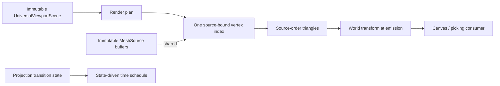
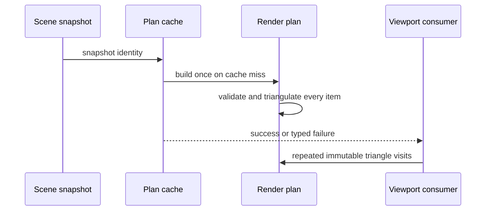

# RupaRendering

## Purpose and Scope

`RupaRendering` owns the provider-independent presentation traversal used by
the Rupa viewport. It is a child module of the [RupaKit package design](../../DESIGN.md)
and consumes immutable `RupaViewportScene` snapshots. Its changed components
are the `MeshSourcePresentationRenderPlan`, its renderer/cache, and the
viewport's time-invalidation policy.

The module is not a CAD or Mesh source authority. It does not edit a
`MeshSource`, choose Product representations, evaluate CAD, persist packages,
or own project/session state.

## Responsibilities and Boundaries

The module owns:

- validation of snapshot presentation items at the render-plan boundary;
- one immutable plan per scene snapshot and cache lifetime;
- source-order, zero-copy MeshSource triangulation through the
  `RupaGeometry` contract;
- world-transform application while emitting render triangles;
- typed failure mapping and immutable render telemetry;
- viewport time invalidation only while a real projection transition is active.

The module consumes `MeshSource`, `UniversalViewportScene`, and immutable
project/evaluation identities. It delegates geometry topology and its work
budget to `RupaGeometry`, and delegates project publication to
`RupaProject`/`RupaKit`. It never returns partial plans or silently falls back
to a legacy source or custom renderer.

## Related Designs

| Design | Relationship | Contract Used | Summary | Cautions |
|---|---|---|---|---|
| [package design](../../DESIGN.md) | parent | Package dependency direction | Places rendering above immutable Geometry and scene snapshots. | Do not create a second source authority. |
| [RupaGeometry design](../RupaGeometry/DESIGN.md) | depends on | Source-bound index, convex fan, non-convex budget, and zero-copy contract | Supplies all Mesh triangulation. | Do not reimplement ID lookup or polygon topology here. |
| [RupaViewportScene design](../RupaViewportScene/DESIGN.md) | depends on | Validated immutable scene items and snapshot identity | Supplies source references, MeshSource values, world transforms, and bounded surface overlays. | Overlay reference lookup is identity-only and must not request face-area or edge-length metrics. |
| `Viewport.swift` | component owner | State-driven invalidation and active transition lifecycle | Controls SwiftUI scheduling around this module. | Static scenes must not subscribe to a continuous animation clock. |
| [RupaGeometry tests](../../Tests/RupaGeometryTests) | verification owner | Geometry triangulation behavior | Proves the lower-level algorithm. | Rendering tests must still prove the actual presentation path. |
| [RupaRendering tests](../../Tests/RupaRenderingTests) | verification owner | Plan traversal, telemetry, and failure mapping | Proves render-plan behavior and cache use. | Type existence is not runtime evidence. |

## Architecture

`MeshSourcePresentationRenderPlan` validates and snapshots only immutable
values. Each item creates one `MeshSourceTriangulationIndex`; each face is
resolved by its source-order face index. Scale-aware convex faces use a linear
fan, while non-convex faces consume the Geometry-owned work budget. The plan
stores triangle IDs and the original `MeshSource`; it does not create a
replacement geometry buffer or a retained position mesh.

The viewport uses a time schedule that is paused when there is no active
projection transition. SwiftUI state changes (camera, scene, interaction, and
completed transition) remain the ordinary invalidation mechanism. A transition
temporarily enables the clock and disables it after the existing completion
task clears the transition state.

## Contracts and Invariants

1. Triangulation plan construction is all-or-nothing. A failed item,
   triangulation, limit, or overflow produces a typed error and no partial
   plan. World transforms are applied during traversal; a transform failure
   terminates that traversal with a typed error. The production cache may
   publish a successful render result only after its validation traversal
   completes.
2. Every scene item retains its occurrence, definition, representation, source
   reference, immutable MeshSource, transform, and triangle identity exactly.
3. The presentation path performs no per-corner global ID scan. Source IDs are
   resolved through one validated bounded index, and source buffer page/chunk
   identity remains unchanged.
4. Input winding is preserved. Convex n-gons use a source-order linear fan;
   non-convex work is bounded and budget exhaustion is explicit.
5. Render passes may repeatedly borrow the plan. They do not mutate the plan,
   source buffers, or scene snapshots and do not materialize a replacement
   position buffer.
6. Plan telemetry reports source-order visits, indexed lookups, bounded scratch
   position values, non-convex work, global ID scans, and geometry
   copy/materialization events. The optimized presentation path has zero global
   ID scans and zero geometry buffer copy/materialization events after index
   construction; scratch values are reported separately and are not source
   buffer rematerialization.
7. A static viewport has no periodic animation ticks. An active projection
   transition advances and completes at the existing duration, then stops the
   schedule. Camera and interaction updates remain responsive state changes.
8. Cache reuse is keyed by `EvaluationSnapshotID`; a failed cached result is
   not converted to success and a changed snapshot replaces the cached result.

## Runtime Flows

For a scene update, the cache first replaces its result for the new snapshot;
only a successful complete plan is exposed to the renderer. During a render
pass, source positions are read by source-order indices and transformed at the
consumer boundary. No asynchronous operation is started by the plan.

## State, Ownership, and Lifecycle

The render plan owns immutable value references for its full lifetime. The
underlying `MeshSource` owns its immutable buffers; the plan's index borrows
their identity and does not own a copy. The cache is `@MainActor` state owned by
the viewport and is invalidated by snapshot identity. Projection transition
state is also viewport-owned and is the only reason for a continuous time
schedule.

No renderer callback or external I/O occurs while a Geometry buffer borrow is
held. Consumers decide whether to retain emitted triangle values.

## Failure, Concurrency, and Constraints

Geometry and render-plan failures remain typed: invalid scene identity/source,
invalid ranges/references, non-planar or degenerate faces, transform failure,
overflow, and triangulation budget exhaustion are never converted to an empty
successful scene. The cache and viewport are MainActor-isolated; plan values
are immutable and `Sendable`. The Geometry hard limits are authoritative and
callers may only lower them.

The fixed responsiveness envelope for the affected workflow is defined by the
task acceptance evidence: approximately 6,000-segment convex cylinder plan
construction within two seconds, live publication acknowledgement within
fifteen seconds, post-publication UI read within five seconds, and a subsequent
session read within two seconds. These are evidence gates, not reasons to
relax the algorithmic budget.

## Verification and Change Impact

| Invariant | Evidence |
|---|---|
| Source-order and zero-copy traversal | Geometry/rendering tests compare source chunk/page identities, copy telemetry, indexed counters, and absence of global ID scans. |
| Convex and non-convex behavior | Triangle/quad/convex/concave parity tests, winding checks, and typed budget exhaustion. |
| Failure atomicity | Invalid references, overflow, non-planar/degenerate, and plan-construction failure tests prove no partial plan escapes. |
| Cache lifecycle | Snapshot reuse and changed-snapshot replacement tests. |
| Viewport scheduling | State-policy tests prove static pause, active transition advancement/completion, and post-transition pause; actual App idle CPU is required for behavioral proof. |
| Application workflow | Actual Rupa app/live CLI evidence is owned by the parent integration item and must not be substituted by a custom renderer. |

Changes to Geometry index/triangulation contracts require rechecking this
module and package designs. Changes to `Viewport` state, timeline scheduling,
or cache invalidation require the application design and actual App CPU/UI
evidence to be rechecked.
