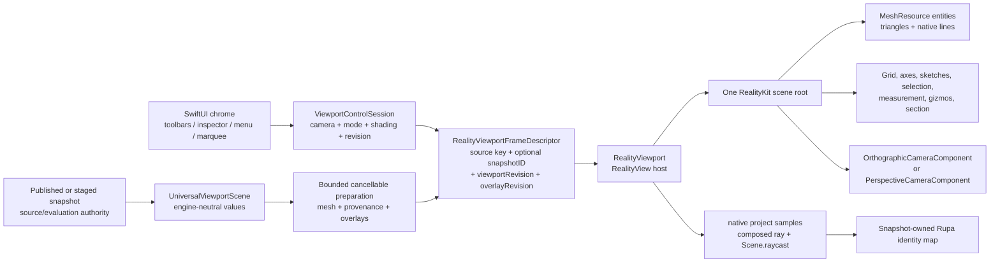

# RupaRendering

## Purpose and Scope

`RupaRendering` owns the bounded, postpublication presentation contract for one
immutable viewport snapshot. Production `RealityViewportView` supplies the
RealityKit surface, native camera, grid, and world overlays. SwiftUI `Canvas`
draws only two-dimensional screen chrome: the selection rectangle and the axis
triad. The legacy identity picking backend was removed by RK-5.1 and the
retired surface encoder by RK-5.2; RK-5 removes the remaining migration-only
code before RK-IV integration verifies the complete cutover. The target uses
RealityKit on macOS 27 or later,
with `RealityView` as the live host and `RealityRenderer` limited to offscreen
GPU verification. A mounted native surface or capability probe alone does not
constitute the complete production backend cutover. The module's
CAD and Mesh inputs remain engine-neutral values from
[`RupaViewportScene`](../RupaViewportScene/DESIGN.md); RealityKit objects are
never source authority.

`RupaRendering` has one target child component,
[`ViewportMeasurement`](ViewportMeasurement/DESIGN.md), and the new
[`RealityViewport`](RealityViewport/DESIGN.md) component owns native scene
resources, entities, camera application, materials, and native input queries.
RK-3 completed the native world-rendering cutover and RK-4 moved input
authority to the mounted frame. The legacy identity GPU readback backend was
removed by RK-5.1; RK-5 removes what remains of the migration-only code
before RK-IV integration.

RK-CLEAN-1 retires the now-unreferenced `MTKView` surface host, fixed Canvas
grid renderer, and private Canvas world-drawing roots that RK-3 replaced with
production `RealityViewportView`. The two-dimensional selection rectangle and
its live input/layout helpers remain. The legacy identity-input paths that
retirement did not claim to remove were removed by RK-5.1. RK-5.5 removed the
unreachable CPU screen-hit picking API; its one segment-versus-rectangle
predicate now belongs to [ViewportMeasurement](ViewportMeasurement/DESIGN.md).

## Responsibilities and Boundaries

The module owns:

- admission and cancellation of one bounded derived presentation request;
- the engine-neutral frame descriptor joining `snapshotID`, viewport revision,
  overlay revision, camera state, and spatial presentation descriptors;
- the document-lifetime `ViewportControlSession` camera, display-mode, shading,
  and revision authority;
- RealityKit resource/entity preparation and one coherent scene-root swap;
- native camera projection, mounted-camera ray composition, native collision,
  and triangle-hit resolution through the RealityViewport child contract;
- exact CAD/Mesh provenance mapping from native hits back to stable Rupa IDs.

It does not own CAD source, Mesh source, evaluation policy, project
publication, history, persistence, Agent/MCP routing, or source mutation.
`RupaUI` owns only SwiftUI composition and non-spatial chrome. It must not
build geometry, create a second camera, or retain a second presentation scene.

## Related Designs

| Design | Relationship | Contract Used | Summary | Cautions |
|---|---|---|---|---|
| [RupaKit package](../../DESIGN.md) | parent | Package dependency and authority direction | Places derived RealityKit presentation above source/evaluation. | RealityKit IDs never become Product/CAD IDs. |
| [RupaViewportScene](../RupaViewportScene/DESIGN.md) | depends on | `UniversalViewportScene`, `snapshotID`, world transforms, bounds, and provenance | Supplies immutable engine-neutral scene values. | Rendering cannot re-evaluate or retessellate source. |
| [RupaCore](../RupaCore/DESIGN.md) | depends on | Validated source/evaluation and stable identity contracts | Supplies source-derived material and navigation metadata. | Presentation material resolution never mutates the document. |
| [RealityViewport](RealityViewport/DESIGN.md) | child | Native scene/resource/camera/material/input adapter | Owns RealityKit objects and the matching scene-root lifecycle. | No custom render pipeline or spatial Canvas fallback. |
| [ViewportMeasurement](ViewportMeasurement/DESIGN.md) | child | Transient world endpoints, distance, ruler descriptors | Produces non-authoritative spatial measurement values. | It does not own RealityKit entity lifetime. |
| [RupaResponsivenessBaseline](../RupaResponsivenessBaseline/DESIGN.md) | coordinates with | Versioned fixture and pinned MainActor/memory acceptance policy | Owns the threshold and environment against which native preparation is measured. | A new native interval must be measured in the signed App; an offscreen duration does not satisfy this contract. |
| [RupaUI](../RupaUI/DESIGN.md) | used by | Matching frame state, tool intents, and visible errors | Composes `RealityView` and non-spatial SwiftUI chrome. | UI never becomes a geometry or camera authority. |
| [RupaAgentProtocol](../RupaAgentProtocol/DESIGN.md) | used by | Foundation-value viewport operation/state contract | Routes camera/display operations to the mounted session. | Applied state is not proof of a displayed frame. |
| [Rendering tests](../../Tests/RupaRenderingTests) | verification owner | CPU admission and target RealityKit GPU behavior | Verifies the target lifecycle, native camera/material/input, provenance, and frame coherence. | Capability tests do not prove current-production or CAD integration; CPU tests do not prove live RealityView behavior. |

## Architecture



The shared seam is an immutable `RealityViewportFrameDescriptor` value. The
public `Viewport` initializer requires one real `ViewportSourceIdentity`: a
document ID plus `DocumentGeneration`, or an existing presentation
`EvaluationSnapshotID`. `Viewport` combines it with an active drag-preview
revision and the existing scene-key inputs to form its internal
`ViewportSceneSnapshotKey`; the preparation identity also contains an explicit
producer-owned `overlayRevision`. It never synthesizes a project or evaluation
identity for an empty or sketch-only scene. The mounted frame also
contains the `ViewportControlSession` revision and camera snapshot plus bounded
engine-neutral spatial descriptors. It contains
no `Entity`, `MeshResource`, `RealityViewCameraContent`, `MTLBuffer`, or
`MTLRenderCommandEncoder`; native objects are created and owned only inside
`RealityViewport`. A frame is publishable only when all identity fields still
match the request that produced its resources.

The overlay revision advances whenever an input not already represented by
`ViewportSceneSnapshotKey` can change a world or camera-relative descriptor,
including selection, hover, active preview/affordance, snap, reference, and
measurement state. It does not advance for a camera-only change. The producer
passes only raw checked-`Sendable` immutable source and interaction captures to
the cache worker;
`ViewportScene` and its transitive value members acquire checked `Sendable`
conformance rather than crossing the boundary through unchecked isolation.
Main-actor capture does not call
`ViewportPatternArrayPreviewService.previews`, surface-analysis overlay build,
section-analysis overlay build, hatch conversion, or their output sorting and
array traversal. The existing producer worker invokes those pure builders once
for a changed source/overlay identity before it emits the complete batch; it
does not add another authority, cache, or worker lane.
The original pure builder algorithms are shared with a nonescaping `rethrows`
checkpoint `(items, positions, visits)`. Legacy nonthrowing wrappers supply an
explicit no-op checkpoint; the native worker supplies cooperative cancellation
and checked local admission. Output items/positions are charged only after the
existing selection predicate admits their source; raw traversal visits are
charged separately against the existing position/work ceiling. Checkpoints run
before owned allocation, append, and hierarchy/analysis/hatch visits. A stopped
worker propagates `CancellationError`, never partial or empty success. Native
section preparation admits the complete source and all derived hatches rather
than using the legacy UI's visible-prefix limits.
The revision does not repeat within one mounted viewport lifetime; exhaustion
is an explicit failure rather than wraparound to a possibly retained identity.

`ViewportSpatialOverlayChangeKey` is the internal `Equatable` invalidation seam
owned by the semantic producer. It is made synchronously from immutable values
already held by `Viewport`; constructing it never calls a scene builder,
analysis builder, pattern service, geometry sampler, projection helper, or
native API. It compares exact values rather than a collision-prone digest. The
key contains only inputs whose change can alter the producer output:

| Key group | Exact inputs |
|---|---|
| Interaction | `SelectionModel`, selection-drag preview targets, Mesh selection overlay, edited-body state, and resolved active/hovered/pending interaction and creation-drag values |
| Derived presentation | Pattern replacement request, surface analysis plus its display options, surface continuity, section analysis, snap result and exact snap options, placement highlight, and measurement state plus its active/automatic flags and explicit construction plane |
| Policy | Display unit, creation-drag axis constraint, descriptor-affecting affordance visibility and numeric parameters, and a bounded set of booleans recording whether each descriptor-producing interaction route is available; closures themselves are neither retained nor compared |

Document, evaluation, scene, workspace-overlay, section-clipping, object-definition,
and drag-preview-document topology remain represented by
`ViewportSceneSnapshotKey`; the change key does not duplicate or sample them.
Camera transform/projection, control basis, viewport size, grid frame, and chrome
exclusions are also absent because their bounded updates are owned by the native
camera frame. This exclusion is valid only when every non-grid plane preview
already carries an explicit `SketchPlane` and resolved world values. A creation
drag must therefore resolve its screen points and plane at input time before it
enters the semantic key/snapshot; a producer may not read the current control
basis later or add basis to the key as a substitute. The grid frame also supplies
the current visible-cell scale to the fixed-capacity native placement preview
when its explicit policy requests `.visibleCell`; this does not recapture the
source snapshot or advance the overlay revision. That preview is exactly one
optional `RealityViewportSpatialBatch.GridPlacement`: its resolved world center,
finite orthonormal plane axes, annotation presentation, and optional explicit
width and height, where a `nil` axis alone requests the current native grid
frame's `minorStepMeters`. Preparation admits and creates one native unit
rectangle with four vertices and eight line indices. After all grid-frame and
aggregate-admission checks succeed, the native owner atomically publishes the
grid and updates only that entity's translation, orientation, and per-axis
scale; it neither rewrites topology nor starts preparation work. Invalid or
over-budget input preserves the preceding complete grid-plus-placement frame.
Fully explicit rectangles, workspace-default rectangles, and non-rectangle
placement previews remain immutable producer-owned world meshes.

One `@MainActor`, non-`Observable` revision holder is retained by `Viewport`
through `@State`. It owns only the last exact change key and one monotonic
`UInt64`. `revision(for:)` returns the current value for an equal key and advances
once before cache lookup for a changed key; returning to an earlier key still
gets a new revision. Overflow is a typed failure, never wraparound. This
synchronous comparison makes the new preparation identity visible in the same
body evaluation. A pointer can only have addressed pixels that were drawn, so one
cache rule owns which frame answers, and the display and every CAD, handle,
projection, and section query resolve through it: the exact-ready frame when the
requested identity is prepared, otherwise the mounted frame whose scene key and
optional real snapshot ID are equal and whose overlay revision alone differs. An
overlay-only rebuild therefore never converts a press into a silent refusal. A
changed source or snapshot, an idle cache, or a typed failure recorded for the
requested identity withdraws display and authority together, so the two cannot
disagree about which frame answers. The exact-ready `surface(for:)` accessor
remains the preparation-lifecycle readiness predicate, not the input authority. Render origin is derived from those admitted
source/layout inputs rather than being a second cache-authority coordinate;
warm synchronous native reuse still requires the mounted and requested origins
to be equal. The `.task(id:)` that captures the immutable raw
producer input and starts its semantic build is attached inside the geometry
scope and runs only for a changed source or overlay identity. Pan, orbit, zoom,
projection transition,
resize, grid-step, and chrome-only body updates neither capture that snapshot
nor invoke its worker. No new protocol, observable owner, generic cache, or
second preparation lane is introduced.

The held `ViewportActiveInteractionDrags` value supplies exact active target and
semantic-value equality; it is not reconstructed by camera updates. Hover and
pending targets compare their spatial identities. Screen-only marquee points
are excluded; entering or leaving a drag can still hide the automatic ruler.
Capture failures call the existing preparation cache's `reject` entry point,
which cancels its worker and pending request and publishes the typed failure for
that identity. A same-scene/snapshot overlay failure may retain the previous
complete display without CAD authority; any source/snapshot mismatch withdraws
it. A late worker cannot overwrite either result.

The public initializer has no generation-less mutable-document mode. The main
workspace passes its document ID and `DocumentGeneration`; the modeling-preview
caller passes its payload's real presentation `EvaluationSnapshotID`. Direct
callers must likewise provide the identity owned by their source lifecycle, so
omitting that coordinate is unrepresentable at compile time. Equal identity is
a caller guarantee of equal source/path topology; repository production callers
meet it through the document store generation or immutable preview snapshot.
Preparation rejects a document-ID mismatch and a presentation identity that
does not equal the supplied scene's snapshot/project identity before selecting
a published native frame. Cancelled view tasks cannot capture, prepare, or reject
a replacement frame. The native grid's resolved readout supplies the HUD and
snap-step notification; SwiftUI does not build a second projected grid.
The complete viewport, including semantic overlays, is an explicit accessibility
container. Hiding native rendering internals does not hide the canvas or its
nonspatial controls from assistive technology.
The viewport root consumes the full rectangle allocated by its parent in both
axes before overlays are composed. Empty, preparing, ready, and failed states
therefore give native content, input, chrome, and accessibility the same nonzero
rectangle. `RenderInvalidation` remains part of the scene/preparation identity;
it does not recreate the SwiftUI native-host and control subtree through `.id`.
`ViewportWorkspaceRenderState.revision` remains workspace-view state and is not
reinterpreted as document source identity. This removes the snapshot cache's
legacy `nil`/uncached-rebuild path from native preparation without fabricating a
generation, evaluation ID, content hash, or request token.
The former optional `documentGeneration` initializer input and stored property
are removed. When the source case is `.document`, `ViewportControlContextKey`,
`ViewportSceneSnapshotKey`, and `ViewportSceneBuilder` all derive the same
generation from `ViewportSourceIdentity`; a second generation coordinate cannot
disagree with the preparation identity. The main `RupaUI` caller therefore
passes only `.document(id:generation:)`, while the preview caller passes only
`.presentation(_:)`.

RealityKit owns the presentation operations it already provides:

| Viewport need | RealityKit owner |
|---|---|
| Solid surface | `MeshResource` + native lit material (`PhysicallyBasedMaterial` or equivalent built-in material) |
| Flat surface | `MeshResource` + `UnlitMaterial` |
| Ortho camera | `OrthographicCameraComponent` |
| Perspective camera | `PerspectiveCameraComponent` |
| Spatial lines and triangles | `LowLevelMesh`/`MeshResource` native topology and `ModelComponent` |
| Repeated geometry | shared `MeshResource` entities; `MeshInstancesComponent` only after provenance is verified |
| Point projection and view ray | `RealityViewport` mounted-camera query contract: `RealityViewCameraContent.project(_:)` samples plus camera-local composed ray |
| Object/face hit | collision group/filter and bounded `Scene.raycast`, resolving `triangleHit.faceIndex` |
| Text labels | native `MeshResource` text extrusion and `BillboardComponent` |
| Sketch/path extrusion | native `MeshResource(extruding:extrusionOptions:)` |
| Section-plane clipping | `ClippingComponent` on a dedicated scene-hierarchy root |

`CustomMaterial` is allowed only for a RealityKit presentation feature that
the built-in material contract cannot express, such as MatCap or signed normal
color. It remains a RealityKit material and is validated
as a bounded resource. A custom Metal render pipeline, direct command encoder,
drawable management, synchronous GPU readback, Canvas raster texture, or
independent tessellator is never an alternative implementation.

## Contracts and Invariants

### Source, frame, and provenance

1. Required `ViewportSourceIdentity` plus any active drag-preview revision and
   the existing scene-key inputs form the source/path-topology identity;
   `UniversalViewportScene.snapshotID` additionally identifies a real optional
   presentation scene. A frame also carries one mounted viewport revision and
   one overlay revision. Scene resources, spatial overlays, camera, render
   state, and hit-test map are all derived from that exact tuple. A missing
   presentation scene means no surface resources, not a synthetic snapshot.
   Document-generation and real presentation-snapshot sources are accepted; no
   generation-less document, duplicate generation input, or workspace-revision
   fallback is accepted.
2. A mounted RealityKit scene and its hit-test scene are the same root and same
   frame, and that mounted frame is the single query authority. During
   same-source/snapshot overlay-only preparation the preceding complete root
   stays visible, camera-navigable, and resolves CAD hits, handles, drags,
   selection mutations, and provenance, because those are the pixels the pointer
   addressed and the ordered handle indexes it returns name its own prepared
   record table. A typed failure recorded for the requested identity keeps that
   root visible but withdraws its authority. A source/snapshot change, teardown,
   or mismatched request exposes neither the prior display nor its authority.
   The native child may reuse immutable resource content across source
   snapshots under its [bounded resource lifetime](RealityViewport/DESIGN.md).
   Such sharing does not reuse frame identity or any old query authority.
3. Entity names, hierarchy, UUIDs, `MeshResource` identity, and collision
   shape identity are implementation details. Stable occurrence, definition,
   representation, source, face, edge, vertex, sketch, and handle IDs remain
   in the snapshot-owned provenance map.
   Every interactive spatial descriptor produced in RK-3 carries a checked
   frame-local `UInt32` index into an immutable checked-`Sendable` table of the
   existing stable CAD handle identities. All native entities that form one
   handle retain that same index; a noninteractive descriptor has no handle
   index. The `RealityViewport` child validates the index, groups interactive
   world geometry no more coarsely than attachment plus index, and returns the
   index without interpreting the table entry. The host resolves it only while
   the complete frame tuple and its table still match. The index and native
   Entity are lookup coordinates, never CAD identity or authority. The
   parent value is a named `(spatialBatch, interactionRecords)` result. Each
   internal `ViewportSpatialInteractionRecord` stores one normalized identity
   and one case of the checked-`Sendable`, camera-independent
   `ViewportSpatialPreparedInteractionTarget` emitted by the same worker pass.
   The prepared semantic value is the drag baseline: it contains
   the source references, plane/model transform, semantic mode, initial value,
   and immutable world geometry required by the existing press/drag transition.
   A body-affordance record also retains the exact projection-free edit
   baseline resolved by that pass. Its internal payload is the affordance
   target, a COW array of internal `AffordanceBodyMember` values containing
   occurrence ID, feature ID, optional scene-node ID, model transform, and the existing
   `ViewportObjectEditState`, plus an optional group edit. A single-body handle
   has exactly one member and no group edit; a group handle has at least two
   members and an explicit group edit. Members are never collapsed into a
   feature-ID-keyed dictionary, because separate occurrences may reference the
   same feature. Retained member capacity and values are charged
   conservatively by the existing semantic-payload admission. Press-time
   materialization consumes this prepared baseline; it may
   not rebuild `baseEdits` or `baseGroupEdit` by traversing the current scene
   or selection. The existing `.affordance` input path initializes only body
   edits, so sketch transform is not a body-affordance record and never names a
   `ViewportAffordanceAction`: its handles form a separate closed identity
   family carrying the occurrence's feature ID, selection target, and one
   semantic role of translate axis, rotate axis, or bounds-corner scale. Naming
   a body action here is prohibited rather than merely unused, because the
   `.affordance` press path resolves a body edit baseline and commits through
   the body-move command, which expresses a translation as a profile-sketch
   edit and cannot express rotation or scale at all.
   The matching prepared case is the sketch mutation baseline. It owns the
   occurrence's scene-node address, the original local transform, the parent
   world transform resolved by the same producer pass, the world pivot, and the
   role's projection-free world geometry: an axis direction for translate, an
   ordered pair of plane vectors for rotate, and a corner direction with its
   base radius for scale. The baseline is fixed size and holds no collection,
   so it is charged a constant retained byte count.
   The producer resolves the parent world transform by walking the product
   metadata's scene-node tree once per pass, from a root down to the
   occurrence's node, and refuses a missing node, a cycle, a non-finite element,
   or a singular composition as a typed batch failure. It does not reuse
   `ViewportSceneTransformIndex`, whose lookup answers a missing node with the
   identity transform and whose compose returns the receiver unchanged when the
   product is not representable: either would seat a silent fallback at the
   origin of the baseline this whole route trusts. The duplication is therefore
   deliberate, and the index keeps its own non-throwing contract for the
   non-authoritative scene-tree consumers that already depend on it.
   Commit uses the existing scene-node transform command through the workspace
   callback, preserving its validation, save, and Undo authority as one
   transaction and therefore one Undo entry; it neither rewrites sketch
   entities nor routes a sketch occurrence through the body-move command.
   Verified projection-free existing semantic values are reused directly,
   including raw sketch/control/surface fields and the
   `ViewportPatternAffordanceSource` handle structs. Legacy handle targets or
   geometry values that contain `ViewportLayout`, projected points/vectors,
   points-per-meter, hit rectangles, or layout-derived minimum/base lengths are
   not record payloads; directed routes retain their raw world anchor,
   direction, and semantic value instead. It is not a
   `ViewportInteractionTarget` or `ViewportActiveInteractionDragState`; the
   MainActor input owner materializes a closed
   `ViewportSpatialMaterializedInteractionTarget` in RK-4.2.3 from the exact
   record and matching mounted RealityKit projection, then creates the existing
   target/drag state only where its payload is projection-owner-free.
   Materialization is one exhaustive route switch
   over the prepared cases it owns and may not invoke `ViewportLayout`, the
   legacy projected candidate selectors, or source traversal. A missing/degenerate
   native projection is typed frame unavailability, never placeholder geometry
   or legacy fallback. A legacy target/geometry that stores `ViewportLayout`
   is not reconstructed. Its materialized case instead stores only the finite
   projected points, vectors, and semantic scalars consumed by the input math,
   and the drag path consumes that case directly. Radial-angle and angular
   copy-count input store the native-projected center plus radial and tangent
   vectors with their base angle/count and policy minimum/step. Angular-density
   input stores the native-projected anchor and tangent direction, base count,
   and points-per-copy value derived from the existing policy. These cases do
   not store arc/guide visuals, a projection closure, or an approximation of
   `ViewportLayout`; native spatial resources already own their visuals. No
   closure, mutable coordinator, native Entity, Viewport, camera, or layout
   owner crosses this table boundary.
   The input owner resolves an ordered native handle result in two distinct
   steps: hover retains only the matching prepared-record identity, while a
   press materializes the first authoritative record and retains that closed
   value together with its record until click, drag finish, or cancellation.
   Failure to materialize the first native candidate is typed frame
   unavailability; it does not skip to a lower-priority candidate or invoke a
   legacy selector. A ready empty native result is a genuine handle miss and
   may continue only into the existing non-handle canvas/object input decision.
   A continued point/plane decision obtains its ray or world point from the
   same revision-checked `RealityViewport` camera-projection owner. A
   surface-free ready frame uses that owner's admitted camera projection sample
   depth; it does not fabricate geometry bounds, call `ViewportLayout`
   unprojection, or rely on the platform inverse-projection APIs that the
   mounted macOS 27 runtime contract excludes. Finite collision-cast length
   remains separately derived from admitted geometry bounds and is not a
   prerequisite for point/plane or world-axis camera queries.
   Drag updates consume the retained materialized value and occurrence/group
   baseline; they do not recapture the scene, resolve current hover, or rebuild
   members in a feature-ID-keyed dictionary. Existing input calculations may
   be extracted to accept materialized projected scalars, but pending state
   cannot retain a legacy geometry value that stores `ViewportLayout`.
   Baseline authority and camera readiness use different coordinates after
   press. The retained record remains authorized by its pressed base source
   identity, occurrence/member addresses, route availability, and operation
   role. A changed document ID/generation, presentation snapshot, selected
   operation target/member set, or callback availability cancels the pending or
   active interaction and clears its owned preview. A same-base-source overlay
   revision caused by hover, pending state, or that interaction's own active
   state does not cancel it. Nor does the existing drag-preview revision owned
   by that exact active interaction: its changed geometry may replace the
   displayed native frame while the immutable pre-drag baseline remains the
   commit/cancel reference. An occurrence/model-transform change not owned by
   that preview requires a changed source authority and cancellation; it cannot
   silently replace the baseline under the same press.
   Each subsequent geometric update separately requires a mounted frame for the
   current presentation identity and a matching camera revision. Temporary
   overlay/preview/camera preparation unavailability performs no drag mutation
   and grants no stale-frame fallback, but it does not by itself discard the
   retained baseline; once the matching camera is ready, the same interaction
   may resume. The owner never requires the press record's overlay revision to
   equal the replacement preview frame and never resolves a second hit to
   refresh that record.
   Releasing an accepted gesture while its own preview replacement is not yet
   mounted closes input but does not finish or discard the interaction. The
   owner retains one pending-finish value containing the release point, release
   camera revision, press record, and the same source/selection/route/base
   guards. Publication of that mounted frame retries the native axis query
   once and either emits exactly one commit or produces the route's typed
   refusal; it never uses the last preview scalar or bypasses revision checking.
   Absence of a mounted frame for the requested identity is the retryable state. Once the requested
   identity and revision are mounted, a nonfinite, degenerate, parallel, or
   behind-axis query is a terminal refusal rather than another readiness retry.
   A change to the document/source, non-self-owned presentation snapshot,
   selection/member set, route/base availability, or release camera revision
   before completion cancels the pending finish and emits no callback; Escape
   and teardown do the same. Clearing the pointer preview after mouse-up must
   not clear this closed pending-finish;
   completion or cancellation releases it exactly once before any external
   mutation callback.
   A two-point screen chord obtained by projecting a world-axis origin and a
   one-meter probe is not an affine world-distance metric in perspective and
   may cross the eye or reverse for a visible small handle. Production axis
   drag therefore retains the semantic world axis and resolves its world delta
   through the same mounted, revision-checked camera-query owner; the chord is
   only a bounded presentation/input sample and cannot authorize the CAD
   distance by itself.
   The incremental native cutover for `splineControlPointSlide`,
   `polySplineSurfaceVertexSlide`, `surfaceControlPointSlide`, `surfaceFrame`,
   `regionOffset`, `edgeOffset`, `slotWidth`, and `sketchVertexOffset` starts
   from the ordered native handle result and retains that exact prepared record,
   occurrence/source baseline, and press point through finish or cancellation.
   Each update queries the current exact-ready mounted revision for the signed
   delta along the record's world axis. The callbacks mutate sketch, surface,
   and CAD definition values expressed in source metres, whereas this native
   query returns world metres. For a single occurrence, the input owner derives
   the finite positive source-units-per-world-metre factor from the retained
   source direction and `record.modelTransform`'s invertible linear part. For a
   grouped surface handle, the producer derives every member's factor from its
   corresponding local direction and transform, publishes the verified common
   value as `Axis.sourceUnitsPerWorldMetre`, and refuses differing occurrence
   scales rather than averaging them or assuming identity. The input owner
   applies the applicable factor to the world delta before producing a commit
   value. Spline, surface, frame, and region slides consume the
   converted delta directly; edge and sketch-vertex offsets apply it to the
   retained source base value with the existing positive lower bound; slot
   width applies twice the converted delta to its retained source base width
   with the same lower bound. The input state retains the prepared record and
   axis and emits the existing public callback commit value; it does not retain
   an inert legacy interaction geometry or repackage one as an adapter. Once one
   of these routes is native-enabled, native miss or typed query/materialization
   failure cannot invoke its legacy selector. A source-baseline change cancels
   it. For edge offset, slot width, and sketch-vertex offset this includes a
   change to the retained base-value setting. The interaction's own overlay
   replacement retains the press record, and
   temporary native-frame unavailability performs no mutation until an
   exact-ready replacement resumes. The same lifecycle also owns
   `patternArrayLinearAxis`, `independentCopyExtrudeDistance`, and
   `independentCopyBodyDimension`; all three begin from their ordered prepared
   record and preserve source ID, output index, output scene-node ID, feature
   ID, and handle kind through preview, finish, or cancellation. Linear spacing
   adds the signed native world-axis delta to its retained world-metre base and
   applies `PatternArrayDistancePolicy.minimumLinearDistanceMeters`. The two
   independent-copy routes likewise retain their world-metre base, while their
   existing public callbacks convert the resulting world value by the retained
   finite positive output-axis length exactly once; the native input owner must
   neither omit nor duplicate that output-model scale conversion. Preview uses
   immutable callback values to feed the existing `PatternSource`, and a
   native-enabled route never invokes its corresponding legacy selector on
   miss, typed failure, or cancellation. Every other route remains explicitly
   incomplete until migrated under the same authority rather than silently
   sharing these route claims.
   The same lifecycle also owns the axis and local-axis drag modes of
   `polySplineSurfaceVertex` and `surfaceControlPoint`. An axis-mode record
   states its leg as a unit direction in the record's own model space, so the
   owner queries the world image of that direction through
   `record.modelTransform` and converts the returned world delta with the
   same source-units-per-world-metre factor stated above. The commit value is
   the model-space displacement those routes' existing public callbacks take,
   which is the converted magnitude times that same unit direction; a
   component the leg does not move stays exactly zero. This replaces a screen
   chord projected onto the handle's drawn leg, so under perspective the two
   disagree by design, for the reason this document already states for the
   other axis routes.
   Each closed native input value under this authority owns a disjoint
   prepared route set. `ViewportNativeAxisInput` owns every route
   whose drag is a signed delta along one retained world axis; it holds no
   projected sample and re-queries the mounted camera on each update.
   `ViewportNativePatternInput` owns the routes whose existing input math
   is defined on the pressed frame's screen basis; it retains one
   `ViewportSpatialMaterializedInteractionTarget`, the finite projected
   samples taken once against that frame. `ViewportNativeWorldPointInput`
   owns the routes whose drag resolves a world point; like the axis owner
   it retains only the prepared record and re-queries the mounted camera on
   each update. A prepared record is claimed by exactly one owner, so no
   boundary carries a record another owns and none may be consulted for a
   record it does not claim. A record belongs to the axis owner when its drag
   reduces to one world-axis delta, to the pattern owner when its drag needs
   that screen basis, and to the world-point owner when its drag resolves a
   world point under the contract below. Where a prepared case carries its
   own drag mode the mode selects the owner, because that case draws one
   handle per mode and the record the press resolved already names which one
   was grabbed. Press consults the axis owner first, so a record that owner
   claims never reaches a later claim test.
   The pattern affordance routes `patternArrayRadialAngle`,
   `patternArrayCopyCount`, `patternArrayCurveExtent`, and
   `patternArrayOutputMode` are native-enabled through the pattern
   owner. Press materializes the leading prepared record exactly once
   against the mounted, revision-checked camera projection and retains that
   closed value with the record, base source identity, presentation
   snapshot, selection set, and route availability. Each update evaluates
   the retained projection with the shared input math and produces the
   existing public callback value; it does not reproject, consult
   `ViewportLayout`, or re-resolve the handle. Those retained samples are
   only meaningful against the camera revision that produced them, so a
   revision change during the gesture ends it rather than continuing
   against a stale screen basis; the axis owner instead tolerates the
   change because it re-queries the mounted camera each update. An update
   whose pointer lands on the projected centre carries no direction, so it
   leaves the retained value unchanged rather than substituting one. A
   projected basis that is degenerate at press is a typed refusal at press,
   not a screen-polar substitute during the drag: the legacy radial
   geometry answered a collapsed radial/tangent basis with a raw screen
   angle about the projected centre, which reports a CAD angle the drawn
   arc never had, so that fallback is prohibited rather than merely unused.
   Output mode carries the projected label rect and commits on click with
   no drag state. Once these routes are native-enabled, a native miss, a
   typed query failure, or a leading record of another case ends the route
   with no pattern hit; their legacy selectors, layout-bearing affordance
   geometry, and candidate services are removed rather than left
   unreachable.
   The world-point routes `patternArrayCurvePathPoint`,
   `constructionPlane`, `bridgeCurveEndpoint`, `sketchCurveHandle`,
   `sketchDimension`, `sketchPointHandle`, `splineControlPoint`,
   `surfaceTrimEndpoint`, `surfaceTrimControlPoint`, and the planar drag mode
   of `polySplineSurfaceVertex` and `surfaceControlPoint` resolve their drag
   geometry from the same
   mounted, revision-checked camera owner's world-plane query at the plane
   the retained record names, and they retain the prepared record rather
   than a materialized screen sample. A press-time materialized value on
   such a route carries only what the handle's hit and preview need and is
   never the drag authority, because a screen sample taken at press cannot
   answer a world point after the camera moves. `ViewportLayout`
   unprojection is prohibited here for the reason the axis routes refuse
   the two-point chord: it is a second projection owner that can disagree
   with the frame that drew the handle.
   A record that names no plane of its own takes the plane its handle was
   drawn against, and the owner names that plane without reading a value
   the frame did not apply. `constructionPlane` moves on the view plane
   through the anchor its handle moves -- the record's origin for the
   origin handle, its normal end for the normal handle -- and the mounted
   camera states that plane from its own installed forward, because an
   animated projection transition changes the applied basis while leaving
   the session revision unchanged. `patternArrayCurvePathPoint` and
   `bridgeCurveEndpoint` move on the plane parallel to the displayed
   canvas plane the projection mode selects, placed through the handle's
   own world point rather than through the world origin: the canvas plane
   as such passes through the origin, and under perspective a drag solved
   there answers a point at the wrong depth, so the handle would not stay
   under the pointer that grabbed it. A transition interpolates directions
   and preserves the mode, so that selection is the one basis-derived
   value a caller may still name outside the frame. The drag value is the
   world displacement between the two plane points one revision answers
   for the pressed and the current screen position, never a rebuilt pair
   of plane axis coordinates: a route whose plane is not spanned by world
   X and Z moves along the plane it was drawn on rather than along a fixed
   axis pair. A query refusal ends the gesture and reports, and a frame
   that has judged nothing yet leaves the standing drag value in place, by
   the readiness split this document already states.
   The four surface handle routes move on the plane parallel to the displayed
   canvas plane through the handle's own world point, for the reason the two
   curve routes above state. Their callbacks take a model-space displacement,
   so the owner carries the queried world displacement back through
   `record.modelTransform` and refuses a placement it cannot invert rather
   than committing the unmapped world value. The two trim routes then solve
   that model-space displacement against the retained surface tangent pair
   for a parameter delta; the builder states those tangents in the same model
   space, so no second conversion applies. A tangent pair whose Gram
   determinant is nonfinite or at or below `1.0e-18` spans no surface patch,
   and that is a typed refusal at press rather than a silent no-op during the
   drag: the legacy geometry dropped every update on such a handle while the
   handle stayed drawn and grabbable. A solved parameter pair that does not
   move is the ordinary no-commit case and not a failure.
   The four sketch routes `sketchCurveHandle`, `sketchDimension`,
   `sketchPointHandle`, and `splineControlPoint` move on the plane parallel
   to the displayed canvas plane through the handle's own world point, for
   the reason the two curve routes above state. The record names that point
   in the sketch display space the producer drew it in, and
   `record.modelTransform` states the placement that mapped it, so the owner
   reads the drag as the displacement that transform inverts back into
   display `x` and `z`. A camera canvas axis pair is not that displacement:
   the two agree only where the placement maps the sketch frame onto the
   plane the mode selected, and the record already names the mapping for
   every placement.
   The radius and the angles `sketchCurveHandle` answers, and the value the
   `radius` dimension answers, are absolute, and the owner solves them from
   the handle's own display point offset by that displacement rather than
   from the pointer position the legacy selector read. A press away from the
   handle no longer restates the value as the distance to the pointer, and a
   gesture that has not moved answers the retained radius and angles
   exactly. The remaining routes take the displacement itself, and the
   commit maps it into sketch-local coordinates through the sketch plane's
   canvas mapper, because the document commands name a sketch-local delta
   while the drawn overlay names a display one. Angles stay sketch-local at
   every step, as the retained record and the preview override already
   state them.
   A value the record cannot answer is a typed refusal at press rather than
   a clamp during the drag: a length dimension without both endpoints or
   with a degenerate baseline segment, a radius dimension without a centre,
   an angular arc dimension without a radius or an end angle, a curve handle
   whose retained radius is not positive, and the `diameter` kind the
   producer never emits. A pointer that would solve a nonpositive radius or
   length, or an arc span at or beyond a full turn, is refused for the same
   reason -- the legacy geometry clamped both classes to `1.0e-9` and kept
   drawing a handle whose committed value no longer followed it.
   The profile affordance actions `profileCornerMove`, `profileFaceMove`,
   and `profileEdgeChamfer` gain prepared records from the same producer
   pass that already registers `profileEdgeFillet`, and the affordance
   route gate in the viewport is removed with them. A record drawn at the
   pressed point is the authority that admits the press: the producer
   emits a profile record only while the matching drag callback is bound,
   and that binding is part of the overlay change key, so a second gate
   beside the frame could only restate or contradict the frame that
   answered.
   Each of the three gains a drawn mark, because a prepared handle is
   reachable only through the collision geometry its drawing builds: the
   legacy corner, face and chamfer tests drew nothing and were reachable
   only because the legacy selector hit-tested a reconstructed projection
   instead of the frame.
   The four profile handles hold point lengths that do not follow the
   body's projected span, for the reason the body transform metrics state.
   `profileCornerMove` and `profileFaceMove` draw on their own anchor --
   the edit box corner, and the edit box face centre -- with no offset,
   because the only ray that could separate a handle from its anchor is
   the one toward the body centre, and that ray has no screen direction
   exactly when the face turns toward the camera. An offset that vanishes
   for the commonest face would take the handle with it: a placement whose
   projected direction is degenerate resolves to nothing, and the frame
   disables the entity rather than drawing it somewhere else.
   The two edge treatments instead share one anchor, the midpoint of the
   selected body topology edge, so an offset along that ray is the only
   thing that separates them: 18 pt for `profileEdgeFillet` and 38 pt for
   `profileEdgeChamfer`, each with a 10 pt reach. `38 - 18 >= 10 + 10`
   holds the two reaches apart and the drawn marks span `8 + 8 < 20`, so
   neither crosses the other, and changing one offset re-derives the other
   from that rule.
   A corner or face handle therefore lands on the same point as the
   transform `vertexMove` or `faceMove` handle when one body carries both
   an object selection and a subshape selection. The frame's hit order
   decides that press and the transform pass runs first, which is the
   order the viewport already answers with while the legacy selectors are
   still in place.
   The four legacy profile selectors and `Viewport.resolvedInteractionTarget`
   are removed here rather than left unused, because the legacy face and
   edge tests accept the whole projected face footprint and the whole
   projected edge segment, so their reach grows and shrinks with the
   camera distance that the fixed point lengths above exist to remove.
   `Viewport.updateAffordanceDrag` therefore materializes its baseline
   only from the press claim or from the drag already in flight, and an
   affordance target carrying neither is a typed refusal, because no owner
   outside the prepared record produces one after this change.
   A case no owner can reach is a defect of this migration, not a reserve
   path, so the `ViewportInteractionTarget` cases and the drag functions
   that no native owner produces are removed once the prepared record is
   the only producer. That point is reached here: the enum carries
   `.affordance` alone, every other prepared target travels as a
   `ViewportSpatialHandleIdentity` instead, and the candidate and handle
   target structs that only the deleted CPU selectors constructed are
   removed with them. Two handle identities go with those structs because
   the prepared enum spells their payload inline; the identities the
   prepared enum names stay, because the native overlay producer builds
   them. The legacy identity hit fallback is a separate removal under its
   own owner: the rectangle and point selection routes still read it, and
   the identity information those routes need outlives the backend that
   used to draw it.
   The body transform affordance is native-enabled under this same authority.
   `Viewport.beginViewportPress` and `Viewport.hover` read only the leading
   prepared interaction record at the point, and its `.affordance` case owns
   the press, the hover highlight, and the drag for `translate`,
   `oneSidedScale`, `centerScale`, `rotate`, `vertexMove`, and `faceMove`. The
   legacy CPU projection selector is removed from this route: a native miss, a
   typed query failure, or a leading record whose action is not one of those
   six ends the route with no body transform hit instead of consulting the
   legacy gizmo. That fallback is prohibited rather than merely unused,
   because the legacy gizmo sizes its handles from the body's projected span
   while the native handles hold the point lengths fixed below, so
   reintroducing it would restore the scale-dependent hit geometry those
   lengths replace.
   The press retains the record's own member list, per-member edit baseline,
   and group edit, and the drag materializes `baseEdits` and `baseGroupEdit`
   from exactly those retained values, as the record contract above requires.
   Nothing on this route is re-read from the current scene, the current
   selection, or the live per-feature edit table: the record is admitted only
   from a frame prepared for the current overlay revision, and the edit table
   is one of that revision's own inputs, so a live re-read could only restate
   the prepared value under a second owner. Re-deriving the grouping is
   additionally unsound, because the producer groups by the selected
   scene-node addresses: a feature selected through more than one scene node
   yields a group handle there, while a feature-keyed re-derivation resolves a
   single body, matches no scene item, and ends the drag as a silent no-op.
   A body scene item carrying no scene-node address matches no selected target
   in the producer and therefore draws no transform gizmo; with the legacy
   selector gone it also receives no transform input, so this route no longer
   hit-tests geometry it never draws.
   Only the two profile-plane components of `translate` reach a commit
   callback. `Viewport.committedBodyMoveDragTarget` is the route's whole
   commit contract: it answers a `ViewportBodyMoveDragTarget` when the
   finished drag's action is `translate`, the drag holds no group edit, and
   the ghost edit moved the body centre along edit-state x or z, which are
   the profile sketch's own two axes. Height translation, both scales, the
   rotation, the object vertex move, the object face move, and a group
   translate cannot be expressed as a profile edit and reach no callback at
   all, so the release drops their ghost edits and the gesture ends as a
   preview. The handle promise stated below therefore covers the claim, the
   preview, and the drag on this route; giving the remaining actions a
   persistent result needs commit owners this design does not name, which is
   a feature rather than a step of this migration.
   The sketch transform affordance is native-enabled under this same authority
   and under its own identity family. The producer registers one record per
   drawn handle only while the route is interactive, which is exactly a bound
   scene-node transform commit callback; that gate is part of the overlay
   change key and is re-checked at press, on every drag update, and at finish,
   so a route that loses its callback cancels instead of committing. The gate
   is the callback alone, and the object-affordance permission is deliberately
   not part of it: that permission answers whether every selected target has an
   exact CAD affordance context, which is resolved from the selected
   presentations, and a sketch feature has no mesh presentation to resolve. A
   selection naming a sketch therefore cannot satisfy that permission under any
   document or camera state, so adding it to this gate would make the route
   unreachable in production while fixtures that pass the permission directly
   still drew and drove it. The tool and selection-scope predicate that decides
   whether object-scope editing is offered at all stays with the callback's
   provider, which binds the callback only in that state, so the viewport reads
   one gate and the workspace owns one policy. `Viewport.beginViewportPress` and
   `Viewport.hover` read the leading prepared record exactly as the migrated
   axis routes do, and a native miss, a typed query failure, or a leading
   record of another case ends the route with no sketch transform hit. No
   legacy sketch transform selector exists, and none may be added.
   The drawn handle set is closed at two translate axes, one rotate axis, and
   the four bounds corners, because the viewport's own sketch representation is
   planar. `ViewportSceneBuilder` discards `SketchDisplaySnapshot.plane` and
   emits every sketch primitive as a world point at `y == 0`, and the sketch
   overlay producer reads those points back the same way, so the drawn curves,
   their pick geometry, and this gizmo all live in the world XZ plane whatever
   plane the feature was authored on. A translation along world Y, or a
   rotation about world X or Z, would therefore commit a scene-node frame the
   preview cannot show and the curves cannot follow: the overlay would redraw
   the same flattened rectangle while the committed geometry left the plane.
   Those legs are omitted rather than drawn and refused, because a drawn handle
   is a promise that the gesture it names can be completed. The two translate
   axes and the rotate axis are taken from the drawn bounds rectangle's own
   edge directions and their cross product rather than assumed to be the world
   basis, so a sketch whose scene item carries a non-identity model transform
   names the axes it is actually drawn along. The pivot is the mean of the four
   drawn corners; each retained leg is invariant to the pivot's height, which
   is what makes the flattened frame a sound origin for all seven handles.
   Uniform corner scale is the only scale offered, so the committed frame stays
   similar to the drawn one under the same flattening.
   The parent world transform each baseline retains is resolved by this
   producer, in one top-down walk of `rootSceneNodeIDs` and `childIDs` taken
   once per frame and only when the frame draws at least one sketch gizmo. The
   walk is the producer's own because the shared scene transform index answers
   a missing node and a non-representable product with an identity frame, which
   would commit a mutation against a frame nobody authored. A node reached
   twice makes the document's tree ill-formed at that node; the walk records
   the collision and the lookup for that node alone is a typed refusal, so one
   malformed subtree cannot silently drop handles elsewhere in the same frame.
   A sketch item with no scene-node address, one placed through a component
   instance, or one whose node is absent from the document draws its bounds
   outline and no handles at all: the commit addresses a scene node's local
   frame, and none of those three names one. Drawing nothing there is not a
   failure and is not reported as one.
   The gesture follows the native axis lifecycle. The press closes over the
   prepared baseline and the frame tuple; every update re-validates source
   identity, presentation snapshot, selected targets, selected references, the
   finish revision, and the route gate, and any mismatch cancels the gesture
   and discards the pending mutation. Each update asks the mounted frame for
   the one query its role owns — a world axis delta for translate and scale, an
   ordered pair of world plane intersections for rotate — and the input type
   converts that answer into a world mutation `M_w` about the pivot. Non-finite
   input, a rotation whose start or current point coincides with the pivot, and
   a scale factor at or below a positive floor owned by the input type are
   typed refusals, not clamped values. A refused update keeps the press
   baseline and authorizes nothing, matching the unmounted-frame rule above.
   Nothing mutates the document during the drag: the pending mutation commits
   once at finish, converted to the occurrence's local frame as
   `P⁻¹ · M_w · P · L` by a throwing 4x4 multiply and inverse that refuses a
   non-finite element or a determinant magnitude at or below `1.0e-12`. The
   shared viewport transform helpers are not used for this composition, because
   their compose returns the receiver unchanged when the product is not
   representable. The scene-node command accepts a non-rigid matrix, so scale
   commits through the same path as translate and rotate.
   The drag preview is overlay-level, exactly as the body transform route
   previews through its ghost edit. The emitted bounds outline, gizmo arrows,
   rotation arcs, corner handles, and center marker are drawn at the mutated
   world geometry, while the sketch curves themselves do not move until the
   commit lands; that is the observable this route promises, and its preview
   test asserts the emitted world points equal the mutated baseline corners.
   The drag never installs a preview document: that path re-validates and
   re-evaluates the whole document per pointer move, which the frame budget
   owns as a correctness limit, and no migrated drag route uses it. The pending
   mutation is part of the overlay change key, so each move re-prepares a frame
   whose handles sit where they are drawn.
   Commit hands the workspace the scene node's address, the baseline local
   transform the press closed over, and the new local transform. The workspace
   refuses the command as a typed editor error when the stored local transform
   no longer equals that baseline, so a document that changed under the drag is
   neither silently overwritten nor partially applied; on success the single
   scene-node transform command is one workspace transaction and therefore one
   Undo entry. A cancelled gesture, a refused query, and a refused commit all
   clear the pending mutation and leave the document untouched, and a refused
   finish reports its typed failure instead of discarding it. The viewport owns
   no workspace error channel, so both native gesture routes report a refused
   finish through this module's gesture logger and nowhere else; the released
   native axis route reports the same way rather than dropping an unanswered
   value at mouse-up, and neither route ever turns a refusal into a committed
   value.
   Every affordance drag measures on the mounted frame.
   `Viewport.updateAffordanceDrag`, the edge treatment drag preview, and the
   profile corner, profile face, edge chamfer, and edge fillet commit routes
   take their quantities from `MeshSourcePresentationPlanCache` queries made
   against the preparation identity the press validated, not from a
   `ViewportLayout` rebuilt inside this view. The measuring surface is a
   `@MainActor` protocol with three requirements, each one already solved by
   the frame that drew the handle: the signed metres between two screen
   points along a retained world axis, the world point where a screen point
   meets a retained world plane, and the world point where a screen point
   meets the plane through an anchor perpendicular to the direction the frame
   looks along. It exposes no point projection, and none may be added.
   A projection primitive is what the legacy measurement was built from: it
   offset a model point by one unit, projected the offset point and the
   centre, and read the screen vector between them. That probe is a
   metre-long ray inside a body whose own extent is centimetres, and the
   standard perspective camera stands a comparable centimetre distance from
   it, so the probe point falls behind the eye and every quantity derived
   from it resolves to nothing. Removing the primitive removes the class of
   defect rather than one instance of it.
   The probe is unnecessary as well as unsound. `ViewportObjectEditState`
   maps a model point to world as `centre + orientation.applied(p - centre)`,
   and `ViewportObjectOrientation.rotate` turns the basis rather than scaling
   it, so that map is an isometry: one model unit is one world metre and the
   three model axes stay orthonormal in world space. A query's world axis is
   therefore `orientation.applied(unit(axis))` and its world origin is the
   edit box point the handle is drawn on, both stated without asking the
   frame anything.
   Each action names the one query its role owns.

   | Action | Query | Retained geometry |
   |---|---|---|
   | `translate`, `oneSidedScale`, `centerScale` | world axis delta | box centre; the action's world axis |
   | `faceMove`, `profileFaceMove` | world axis delta | the face centre; the face's own world axis |
   | `vertexMove` | two view plane points | the world point of the box corner |
   | `profileCornerMove` | two world plane points | the world box corner; normal world `y` |
   | `profileEdgeChamfer`, `profileEdgeFillet` | two world plane points | the world edge midpoint; normal world `y` |
   | `rotate` | two world plane points | box centre; normal the rotation axis |

   The two-point routes take the displacement between the two answers and
   resolve it on the retained orthonormal world axes: `vertexMove` on all
   three, `profileCornerMove` and the two edge treatments on world `x` and
   `z`, which is the profile sketch plane those commits are expressed in.
   `rotate` is the exception that keeps both answers rather than their
   difference, because an angle is the difference of two absolute directions
   from the pivot and one displacement cannot state it.
   `profileFaceMove` asks along one axis because its mapping uses one.
   `ViewportProfileFaceDragMapping` reads exactly one of the three deltas per
   face, so the axis is chosen from the face first and only that axis is
   measured. The previous form asked for all three and refused unless all
   three resolved, which made a face solvable along its own axis unsolvable
   whenever a different axis was degenerate on screen, and every axis-front
   camera has one such axis. The mapping keeps the three-delta signature its
   own tests pin, and states the face-to-axis rule the caller now reads.
   A degenerate query is a typed refusal scoped to the axis or plane actually
   asked for. The frame refuses a world axis collinear with the view ray and
   a world plane the ray runs along, so the `z` axis of an axis-front `z`
   camera refuses while the two axes that camera draws still answer.
   `ViewportObjectEditState` no longer answers a screen-polar angle when a
   rotation basis projects collinearly: that fallback reported a rotation the
   drawn arc never had, which is the condition
   `ViewportSpatialInteractionInputMath` already refuses. A pointer at the
   pivot is not that condition -- it carries no direction, so the drag keeps
   its retained value and authorizes nothing.
   Absence and refusal are separate events here, split by the rule rectangle
   selection already uses: a `MeshSourcePresentationRenderError` whose code is
   `frameNotReady` is the transient case a caller should ask again about, and
   every other code is an answer the caller must act on. One owner states that
   classification and both readers -- the rectangle selection policy and these
   drag routes -- dispatch on it. A drag update that meets `frameNotReady`
   keeps the last answered ghost edit, reports nothing, and authorizes
   nothing. Any other failure, during an update or at commit, reports through
   this module's gesture logger and clears the pending interaction, because a
   drag that cannot measure must not leave a handle following the pointer
   against a baseline nothing answered.
   A commit that answers no mutation is not a refusal. An outward edge
   treatment drag, which the chamfer and fillet mappings answer with no
   distance, and a solved quantity below the commit floor both leave the
   document untouched and report nothing, exactly as they did before. Only a
   failed measurement reports.
   `vertexMove` changes observably here. It previously projected the screen
   displacement onto each model axis independently, which cross-bleeds
   wherever the projected axes are not orthogonal on screen -- the defect
   `profileCornerMove` was already repaired for -- so the dragged vertex
   drifted off the pointer in isometric views. Resolving one view-plane
   displacement on the orthonormal world axes instead keeps the vertex under
   the pointer, and its test states that rather than the old decomposition.
   Rectangle selection does not wait on a later seam: its CAD sub-shape rules
   are owned by invariant 8, and the legacy rectangle resolver is reached only
   for the residual geometry named there.
   The closed
   `ViewportSpatialHandleIdentity: Equatable, Sendable` enum contains only
   stable source/selection addresses and semantic handle roles; it contains no
   screen point, derived geometry, native object, name, or UUID. Record
   registration and fragment lookup additionally use the stable scene
   occurrence address from the same semantic pass. Scene-derived records with
   the same feature/handle identity but different `SceneNodeID` values receive
   different indexes and retain their occurrence-specific transform and drag
   baseline; selection matching must resolve the occurrence before matching the
   feature/component. A missing occurrence address is valid only for a source
   that the prepared scene proves is genuinely uninstanced, or for one
   explicitly represented selection-group handle whose payload contains the
   complete stable member-occurrence list and group edit. The latter is one
   aggregate handle, not permission to merge individual occurrences. The five
   surface handle cases that currently contain `SelectionReference` project it to the
   exhaustive reference-case discriminator, `SubshapeID`, and the applicable
   parameter, UV, index, or trim address. They never retain or traverse
   `StableSubshapeReference.geometrySignature`; the matching frame tuple, not a
   copied CAD geometry tree, owns the validity of that presentation address.
   For poly-spline-surface vertices and surface control points, the identity
   augments the existing target identity with one shared semantic role:
   `.planar`, `.axis(ViewportCoordinateAxis)`, or
   `.localAxis(ViewportPolySplineSurfaceVertexLocalAxis)`. The local direction
   vector remains derived geometry and is not part of identity; distinct roles
   never share one handle index.
   One canonical route source registers each record exactly once, then all of
   that handle's visual fragments look up and reuse its normalized-identity
   index. A second registration of the same identity is a typed producer
   failure; it is not resolved by comparing complete targets, because synthesized
   equality may traverse `SelectionReference.geometrySignature`. A fragment
   lookup for an unregistered identity likewise fails. The cache retains the immutable record table beside
   its private prepared frame,
   while the native batch receives only `handleCount`, the table's checked
   application-owned `retainedSemanticByteCount`, and optional indices. A synchronous cache lookup
   returns a table entry only when both the prepared frame identity and index
   match; the observable ready-state payload does not become a second owner.
   A synchronous lookup returns the prepared semantic baseline only for the exact ready
   frame and a valid index; stale, preparing, rejected, replaced, or torn-down
   frames expose neither identity nor target. Non-handle callers use the exact empty defaults: no table entries,
   `handleCount == 0`, `retainedSemanticByteCount == 0`, and
   `handleIndex == nil`.
   Admission charges record-array capacity, normalized-identity payloads, and
   producer-owned variable arrays/strings in prepared baselines with checked
   arithmetic before the cache retains them. An immutable CAD COW source
   reference is shallow-retained as part of the baseline: Rendering charges its
   value slot but neither traverses, clones, serializes, nor guesses the backing
   geometry size. Other producer-owned variable payloads are not exempt from
   the existing item/position/retained-byte ceilings. The batch receives only
   the validated record count and total `retainedSemanticByteCount`; the native
   child never imports or interprets either interaction-target type.
   A normalized identity may still be used transiently to calculate visual
   hover/pending/active state without becoming a record. Such a state-only
   identity gives its descriptors no `handleIndex`. Decorative fragments of an
   already registered interactive handle may share its index for provenance but
   remain non-pickable without an explicit footprint. Before RK-4.2.2 completes,
   every enabled interactive route must register one complete semantic baseline and map at
   least one accepted fragment footprint; an incomplete baseline is a typed
   producer failure rather than identity-only native authority.
   The current projected CPU handle providers remain a temporary
   pre-RK-4 input path, not future identity authority: RK-4 must consume this
   prepared mapping and must not rerun producer candidate traversal to infer a
   handle from a native hit. Bounded native-camera projection remains permitted
   only for the tolerance cases in invariant 8.
4. The frame descriptor contains no source mutation or project publication
   authority. A preview frame is discarded on cancel/stale replacement and
   never enters history, undo, persistence, or source selection.

### Native camera and input

5. `ViewportControlSession` is the only mutable camera/display/shading owner.
   UI gestures and Agent/MCP operations call the same throwing action boundary.
   Camera updates change RealityKit camera components/transforms and do not
   rebuild mesh resources or scene provenance.
6. Parallel and perspective use their native RealityKit camera components.
   Fit, pan, orbit, zoom, saved-view restore, and orientation preserve the
   session's finite focus/basis/lens contract. The
   [RealityViewport mounted-camera query contract](RealityViewport/DESIGN.md#contracts-and-invariants)
   is the live projection/ray authority; any bounded CPU tolerance calculation
   must agree with it and may not create a second live camera. Production uses
   only native `PerspectiveCameraComponent` or `OrthographicCameraComponent`.
   An off-center CAD fit/pan term is camera right/up-plane translation, never
   lens skew or an unsupported projective component; native render/project and
   composed-ray parity must be established before the adapter is accepted.
7. Live pointer, hover, measure endpoint, and canvas-plane resolution consume
   the child component's native-project-derived ray. Object/face collision uses
   bounded native `Scene.raycast(.all)` rather than raw mounted `ray`,
   `unproject`, or `hitTest`; the macOS 27 counterexamples and exact composition,
   sample, finite-bound, near/far, and refusal rules are owned only by the
   [RealityViewport design](RealityViewport/DESIGN.md#contracts-and-invariants).
   The production canvas-input mapper routes all nine point/plane callers
   through that exact-ready cache/native entry point, including an empty scene;
   stale or unmounted input performs no callback and may resume only after the
   matching mounted camera is ready. The view-ray anchor a creation drag or a
   pick carries is answered by that same authority: it is the point the
   mounted frame draws at that pixel on the displayed canvas plane, taken
   from the plan cache's world-plane intersection under the identity and
   revision the canvas input itself used, never from a stored
   `ViewportLayout` unprojection. A displayed canvas plane that names no
   normal and a frame that cannot answer the intersection both refuse the
   whole gesture. The anchor is never dropped to `nil` on failure, because
   the consumer then substitutes a different ray origin and the created
   geometry moves. The CAD-face `exactWorldPoint` handed to
   that mapper is native provenance: it is the mounted frame's own surface hit
   at that input event, admitted only when the drawn triangle is `.cad`-sourced,
   its occurrence maps to the primary selection target's scene node, that node
   is a CAD interaction node, and the prepared run list names the selected face
   for the triangle's emission index. Any other pixel has no exact point and
   resolves against the sketch plane instead, while an emission index no `Int`
   can hold is malformed provenance and refuses. A frame that cannot answer
   emits nothing, the refusal the press path already applies. Both drag
   endpoints are answered by the frame mounted when the drag ends; no value is
   carried over from the press. Replacing the previous CPU ray/polygon resolver
   changes four answers:

   | Pixel | CPU resolver | Native provenance |
   |---|---|---|
   | Selected face occluded by another surface | a point on the hidden face | none; the sketch plane answers |
   | Body with a non-identity `modelTransform` | an untransformed, wrong point | the point the frame drew |
   | Drag start covered by the drag preview at mouse-up | a point on the selected face | none; the sketch plane answers |
   | No mounted presentation | a CPU point | none; the frame is the authority |

   Results are sorted by ascending distance and filtered by the
   same visible/section/back-face rules as the scene. The host requests all
   native collision hits before filtering so a rejected
   clipped or culled hit cannot hide a later visible native hit. When native
   material back-face culling is active, that same mounted-camera query ray and the
   snapshot-owned source-triangle winding classify each native hit in one
   common scene coordinate space; this is visibility classification, not a CPU
   triangle-intersection fallback. When culling is inactive, winding does not
   reject a native hit. On the supported macOS 27 runtime,
   [`ShapeResource.generateStaticMesh(from:)`](https://developer.apple.com/documentation/realitykit/shaperesource/generatestaticmesh(from:))
   is observed by the Apple-GPU regression to produce one-sided collision even
   when the visual material's
   [`faceCulling`](https://developer.apple.com/documentation/realitykit/materialparametertypes/faceculling)
   is disabled; this is a target-runtime observation, not a cross-version API
   guarantee. Each occurrence therefore uses a collision-only native
   MeshResource whose triangle list is the original winding followed by the
   reversed winding. The visual MeshResource remains unchanged. A native
   collision face must be in `0..<(2 * sourceTriangleCount)` and resolves to
   `faceIndex % sourceTriangleCount`; the resolved source winding, never the
   duplicated native winding, owns culling classification and provenance. The
   observed face-order/range contract is reverified when the supported OS or
   RealityKit SDK changes.
   Missing collision or `triangleHit.faceIndex` mapping is an explicit miss or
   typed failure; legacy GPU identity rendering is not a fallback.
   The shared `ViewportInputSurface` preserves one primary-gesture lifecycle.
   For a click, the resolved press baseline remains alive through `onPick`; the
   owner clears its preview and pending state only after that callback returns.
   When Escape handles cancellation, it consumes the active primary mouse
   gesture as well as its preview, so the remaining mouse-up event cannot emit
   a pick or drag. The following mouse-down starts a normal fresh gesture.
   Escape with no handled viewport interaction is not consumed and remains in
   the existing responder chain.
   RK-4 connects this contract in three serial seams. First, surface pointer
   selection and measurement consume one throwing native query whose nearest
   optional result contains
   occurrence/source-triangle provenance and the child-owned CAD world point;
   both require a mounted frame for the requested presentation identity and a
   matching mounted camera revision. Only a mounted query with no retained hit is
   a miss; an absent or stale presentation is a typed failure and cannot fall
   through to another semantic target. Second, spatial and legacy affordances
   resolve native entities through the already prepared frame-local handle table.
   The cache maps the ordered native indexes to records only from that same
   mounted frame's prepared table;
   materialization then consumes only revision-checked projection calls on that
   same native owner, synchronously without suspension or intervening frame
   mutation. An index mismatch or failed projection is typed unavailability,
   never a partial candidate list or old selector fallback. Third, rectangle
   selection uses only the bounded exception in invariant 8. Completing the
   first seam does not by itself complete RK-4.
8. Edge/vertex tolerance, rectangle selection, and any operation for which
   RealityKit has no equivalent may use the same prepared geometry and native
   camera projection as a bounded CPU query. This exception preserves CAD
   semantics only; it cannot introduce a second renderer or source traversal.
   Mesh face selection consumes the native surface hit. Mesh edge/vertex
   selection tests the exact prepared face-loop edge and vertex provenance in
   the declared point-space neighborhood through the mounted native projection,
   including candidates just outside a triangle or silhouette; restricting the
   tolerance query to the triangle interior is not equivalent CAD behavior.
   The admitted render plan already owns the required occurrence/source
   reference, face ID, source vertex IDs and world positions, and original
   boundary-edge IDs for every triangle side; the resolver streams only that
   retained, plan-count-bounded data and never reopens CAD source geometry or
   allocates another full candidate table. It retains one current best result;
   only a strict projected-distance improvement advances it, so duplicate
   triangle references to the same source boundary cannot duplicate output and
   equal-distance ties preserve stable prepared order.
   A face result is the native hit at the pointer. For an edge or vertex, the
   resolver projects the retained boundary, finds candidates within the fixed
   8-point neighborhood (including a pointer outside the silhouette), and asks
   the native surface query at each candidate's nearest projected boundary
   point. A candidate is eligible only when that section/back-face-filtered
   nearest native hit has the same occurrence and incident source edge or
   vertex; an occluding occurrence therefore rejects it. Selection is minimum
   projected distance followed by stable prepared order. Missing authored-mesh
   provenance, projection, incidence, or native visibility is a miss or typed
   frame failure according to the mounted-frame query contract, never a CPU
   triangle hit or legacy selector fallback.
   CAD body face/edge/vertex selection uses the same bounded exception with the
   prepared B-Rep topology instead of the authored-mesh face loops.
   `ViewportNativeCADTopologyResolver` owns it. The prepared
   `SelectionComponentID` of the sub-shape is the only identity it emits; a
   native `MeshFaceID` is render provenance and is never reinterpreted as a CAD
   identity. The resolver projects the retained topology through the same
   mounted camera the surface query uses, tries vertex, then edge, then face,
   and keeps one current best that only a strict projected-distance improvement
   advances.
   Every CAD interaction body carrying prepared topology is a candidate, not
   only the body the pointer draws, because a pixel just outside the tessellated
   silhouette still has outline edges and silhouette vertices inside the point
   tolerance. `Viewport` compares candidates from different bodies through the
   same rank-then-metric order — vertex before edge before face, then projected
   distance — so the nearest sub-shape wins across the scene and equal
   candidates keep stable scene order.
   A face result is the CAD face that generated the triangle the native frame
   drew at the pointer. A face is offered only for the body the native frame
   actually draws at that pixel: an empty pixel and an occluding body both end
   the face query, because a face cannot exist where the frame draws none of
   this body. The resolver forms no containment test and no face depth of its
   own. The frame already decided which triangle it drew there, and evaluation
   already recorded which CAD face generated each triangle, so the branch reads
   that prepared answer. Its key is the hit triangle's `MeshFaceID` raw value,
   which the universal mesh source preserves as the triangle's emission index;
   the recorded runs are scanned in the order they are held rather than searched
   as sorted, because a malformed list answered by a binary search would name
   the wrong face instead of no face. A triangle no run names is a truthful
   miss: evaluation gave its face no stable sub-shape identity, so there is no
   CAD name to select, and no neighbouring face is substituted. A raw value no
   triangle index can hold is malformed provenance and is a typed failure, not
   a miss, because a miss answers the pointer with a deselection the frame
   never justified.
   Only a `.cad` source reference reaches this branch. An authored mesh numbers
   its own faces independently, so its `MeshFaceID` could land inside a CAD run
   by coincidence and name a face the frame never drew; `Viewport` withholds the
   surface from those bodies so the face query misses instead.
   The runs travel with the prepared topology as
   `ViewportBodyTopology.meshFaceRuns`, built once per scene build from the body
   display snapshot. No camera move and no click rebuilds them, and no side
   table keyed by mesh identity exists to fall out of step with the snapshot.
   An edge candidate interpolates no depth at all. The screen parameter of the
   nearest projected point is mapped back to the edge's own world parameter
   under that same frame projection, and the native camera then reports the
   depth of the resulting world point. Native camera depth is linear view-space
   z under both cameras, so which mapping applies is a property of the frame and
   never of the sign of the sampled depths: an orthographic frame makes depth
   linear on screen, and a perspective frame makes reciprocal depth linear. The
   resolver asks the frame which of the two it is through
   `usesPerspectiveProjection` and infers neither.
   A vertex or edge candidate is admitted only when the mounted frame still
   retains its world point through the active section, and is then rejected
   only when the frame draws a nearer surface at the candidate's own projected
   point, within the resolver-owned relative `depthSlack`. The section query
   runs first because an empty pixel is ambiguous on its own: a silhouette point
   and a point the section cut away both draw nothing, and only the frame that
   applied the section separates them. Once that question is answered, a pixel
   that draws nothing hides nothing, which keeps silhouette vertices and outline
   edges selectable where the exact B-Rep point and the tessellated collision
   surface disagree.
   The point query has one outcome: the `ViewportHit?` this path forms. Every
   family a scope admits is generated here and ordered here, so there is no
   second hit rule to route to and no third value to distinguish. `nil` is the
   mounted frame's answer that nothing this scope admits is drawn at the
   pointer. Which bodies carry topology is not decided here: the scene
   builder writes the evaluated snapshot's mesh and face runs onto every body
   feature the evaluation named, under the
   [scene item sub-shape identity contract](../RupaViewportScene/DESIGN.md#cad-sub-shape-identity-on-a-body-scene-item),
   whatever geometry that item displays. A body reaching this query with no
   prepared topology therefore contributes no CAD sub-shape candidate: it is
   one evaluation gave no stable sub-shape identity at all, not one whose
   display happens to be a projected box. An empty pixel is an answer and not
   the absence of one.
   A viewport with no mounted presentation scene is answered the same way. The
   mounted frame is the query authority, so a viewport that mounted none has
   nothing to ask, and `nil` is its complete answer rather than a fallback
   withheld from it. No production composition reaches that configuration —
   `MainView` supplies a presentation scene on both of its viewport
   constructions — and what such a viewport still draws through
   `drawsLegacyBodies` is a residual on the drawing side, owned by the legacy
   renderer's own deletion and not by any selection rule stated here.
   Two owners carry that. `ViewportNativeFrameProbe` is the single reader of
   the mounted frame. It projects a world point with and without its depth,
   reports whether the active section retains a point, reports the depth of the
   surface the frame draws at a projected point, reports which projection the
   frame was drawn with, reports the camera's depth interval and the section's
   affine bound over a world segment, and maps a projected position back to a
   world parameter on that segment. Nothing else on this path asks the frame
   anything. `ViewportNativeCADTopologyResolver` keeps the CAD sub-shape
   families, and `ViewportNativeOverlayHitResolver` answers the families the
   scene draws as overlays — curve segment, sketch entity, sketch control
   point, sketch region, the four surface handle displays, and the occurrence
   — with both reading the frame only through that probe. One frame therefore
   answers every family, and no two families can disagree about what is drawn
   where.
   Whether a family is occlusion-tested is a property of how the frame draws
   it and not of what a query would prefer.
   `RealityViewportSpatialBatch.Depth` owns that distinction: `.scene`
   emission reads and writes the depth buffer, `.annotation` emission does
   neither and is always drawn in front. A family emitted at `.scene` is
   admitted only where the frame draws nothing nearer at the candidate's own
   projected point, by the same section-then-occlusion rule stated above; a
   family emitted at `.annotation` is admitted on the section alone. This
   reads the family's emission rule and never the current frame's drawn state,
   because some overlays are drawn only for what is already selected and
   asking what is drawn now would make the answer depend on itself.

   | Family | Rank | Emission depth | Admission after projection |
   |---|---|---|---|
   | occurrence | object | frame surface | the frame draws it at the pointer |
   | CAD face | face | frame surface | the frame draws its triangle |
   | sketch region | region | `.annotation` | the clipped boundary contains it |
   | CAD edge | edge | `.scene` | section, then no nearer surface |
   | curve segment | edge | `.scene` | section, then no nearer surface |
   | sketch entity polyline | edge | `.scene` | section, then no nearer surface |
   | sketch entity point | edge | `.annotation` | section alone |
   | CAD vertex | vertex | `.scene` | section, then no nearer surface |
   | sketch control point | vertex | `.annotation` | section alone |
   | surface knot, span, trim knot, trim span | vertex | `.annotation` | section alone |

   Admitted candidates are ordered by rank, then by projected distance to the
   pointer, then by a stable emission order. `ViewportNativeHitCandidate` owns
   that vocabulary rather than either resolver, because both resolvers produce
   candidates that are compared against the other's, and the rank a family
   carries is a property of the family and not of the resolver that happened to
   answer for it. It carries that ordering and nothing else: a candidate is a
   rank and a metric, and the identity of what was hit stays with the resolver
   that owns it, because the families do not share one identity type -- a CAD
   sub-shape is a prepared `SelectionComponent`, a surface handle display is a
   `SelectionReference`, and a sketch control point is an entity identity and
   an index. Each resolver therefore returns the `ViewportHit` it formed
   alongside the candidate that orders it, and nothing widens the candidate to
   hold whichever identity a new family happens to carry.
   Its `Rank` orders five families — `vertex`, `edge`, `face`, `region`, then
   `object` as its weakest case — so a pointer that named a sub-shape never
   resolves to the occurrence carrying it. A region is a rank of its own
   rather than a second family at face rank because a CAD face's metric is a
   camera depth and a region's is a pixel distance: separating the ranks means
   the two are never compared by metric, and a CAD face drawn at the pointer
   wins the region beneath it. That is the order the interim routing already
   produced, where a native face answer returned before the legacy resolver
   could offer a region. An
   occurrence's metric is zero: it is admitted at the pointer's own pixel, so it
   has no distance to the pointer to be ordered by, and it is never ordered
   against a sub-shape of its own rank. The replaced GPU rule ordered by four
   priorities these five refine — it drew a sketch region and a CAD face at
   one priority — and then by drawn depth and emission order, and that depth
   tiebreak is deliberately not carried over: it was that renderer's only
   occlusion mechanism, since its curve, sketch and region draw items were
   emitted with no depth at all, whereas here section and occlusion are
   admission steps that run before any ordering. Ordering by distance to the
   pointer after admission is what the CAD families already did.
   Tolerance has one owner. The resolver's `tolerance`, eight points by
   default, is the neighbourhood every point and curve family is tested in. The
   replaced rules used three values for that one question — four points for a
   curve or sketch line and six for a point handle in the GPU plan, eight and a
   ten-point floor in the CPU tester — so this is an operational value chosen
   to have a single owner and not a correctness constant. It widens the curve
   and sketch-line neighbourhood from four points and the point-handle
   neighbourhood from six. The rectangle path is unaffected, because a
   rectangle admits a point by strict containment with no tolerance at all.
   The sketch families are exactly what production emits. A sketch entity is
   its own evaluated polyline at edge rank, and its control points are at
   vertex rank and only for a spline, which is the one primitive either
   replaced rule ever emitted control point geometry for. The endpoint handle
   a line, arc or circle would carry is in neither the GPU plan nor this path.
   The CPU tester does answer one, so what stops being answered there is what
   the resolver behind a failed GPU pick answered and not what a healthy
   production frame ever did. This path does not invent one either.
   Each sketch family takes its world points from the producer that drew it. A
   polyline is the overlay producer's own evaluation — two endpoints for a
   line, forty-nine samples around a circle, twenty-five along an arc, and a
   spline's evaluated points — so a pointer between two samples is measured
   against the segment the frame drew and not against an ideal curve the frame
   never drew. Spline control points are the affordance producer's, which maps
   them through the scene item's model transform. The two mappings differ only
   in that transform, which a sketch item carries as the identity, and each
   stays with the producer that owns what is on screen rather than being
   re-derived here.
   A sketch entity is occlusion-tested here and was not before. The frame
   draws the polyline at scene depth, so a body in front of it hides it,
   whereas the identity buffer recorded sketch geometry with no depth at all
   and answered it through anything drawn over it. An entity that is a single
   point is drawn as a marker instead, and control points are markers too, so
   both keep annotation depth and are admitted by projection, tolerance and
   the section alone, which is the surface handle rule above. Each family's
   admission is read from how the frame emits it and from nothing else, which
   is why one family splits across two rows of the table above rather than
   being averaged into one. Which sketch items can be asked at all is the
   frame's own suppression rule: an item whose source feature is selected, by
   feature or by scene node, or is being edited, is not drawn and is not
   queried, because the body replaced it on screen. Control point admission is
   the sketch control point hit policy, the same gate the pick index was built
   with, and never whether a control point is drawn at this moment: the frame
   draws them only for a selected or hovered entity, so reading that would
   make selecting one depend on having selected it.
   The region family clips before it projects. A sketch region's boundary is a
   planar polygon in world space, so the whole polygon is clipped against the
   section's affine half-space and then against the frame's depth interval,
   and only the surviving polygon is projected; the point query is then
   containment of the pointer in that projected polygon. Clipping a planar
   polygon by a half-space leaves it planar and projection preserves
   containment, so this is exact and not a tolerance. A surviving boundary
   vertex the frame cannot project is a typed refusal and never a skipped
   edge, because dropping one would silently shrink the region the answer is
   computed over.
   Both clips are `ViewportCameraDepthClip`, the owner every candidate edge of
   the rectangle is already narrowed by, so the point and the rectangle cannot
   disagree about where the camera stops drawing or where the cut removes
   geometry. That owner takes the interval the frame reports and names no
   plane of its own, so under the perspective camera's infinite far plane it
   contributes the near bound alone, which is why nothing here asks which
   projection drew the frame. A boundary scalar or bound the frame reports as
   non-finite is a refusal there and not an exclusion, because those are
   different answers.
   A region boundary is not assumed convex. One extracted profile's boundary
   can be concave, and clipping a concave polygon against a single half-space
   leaves collinear vertices along the bound rather than splitting the
   polygon, which the even-odd containment test over the result reads
   correctly. A boundary either clip leaves with fewer than three vertices
   bounds no area and contains no pointer, which is the answer the replaced
   rule gave a degenerate boundary too.
   A region's metric is the projected distance from the pointer to its clipped
   boundary's centroid. Two regions can both contain one pointer, because one
   profile's boundary can lie inside another's, and this is the tiebreak the
   replaced CPU rule resolved that with. It is a pixel distance where a CAD
   face's metric is a camera depth, and the two are never ordered against each
   other: the region family carries its own rank below face, so a CAD face
   drawn at the pointer wins before either metric is read.
   The occurrence family has no bounding box. An occurrence is a candidate
   where the mounted frame draws it at the pointer's own pixel, which is what
   the rectangle's occurrence harvest reads at every pixel it covers. The
   replaced rule projected a candidate's bounds and tested containment, so it
   admitted an occurrence wherever that box covered the pointer even where the
   frame drew nothing there.
   A body carrying no prepared face, edge or vertex target is a miss for those
   three scopes, and this path does not reconstruct the projected bounding-box
   sub-objects the replaced rules answered it with. Those sub-objects were not
   a projection of anything. `ViewportLayout.bodyProjection` projects one
   footprint and fabricates the opposite face by offsetting that same
   two-dimensional rectangle along the view basis, by a screen distance clamped
   between twelve and fifty-four points, so no world geometry corresponds to
   the faces, edges and vertices composed from its corners and no frame can
   reproduce them. Answering those scopes from the frame would therefore be a
   new geometric contract rather than the one being replaced, and the bodies
   needing it are exactly the ones evaluation gave no stable sub-shape identity
   to: a feature with no evaluated body at all, a B-spline surface displayed
   from its own control net whose sub-object identity its surface handle
   displays already own, and an evaluated body whose kernel registered no face,
   edge or vertex sub-shape.
   The `SelectionComponentID` values those hits carried are unaffected.
   `body.face.front` and its siblings name an editable body face that the
   document's direct editing resolver still resolves and that
   `WorkspaceSelectionTargetResolver` still maps a body face to. Only the
   fabricated pick geometry is gone, and two production behaviours go with it:
   the construction highlight and the construction sketch plane that a hover
   derives from `ViewportHit.bodyFace` no longer arise on such a body, where
   the shipped rule raised them only there. The accessibility markers that
   synthesize the same hits for every body from that same fabricated projection
   are a separate producer with a separate owner, so
   `ViewportLayout.bodyProjection` outlives this seam.
   The point path's failure contract is the drag's readiness split read at one
   pointer. A frame that has not mounted reports `frameNotReady`, which retains
   the existing selection and reports nothing, because a pointer that outran
   preparation is not an operator error. Every other typed failure is a refusal
   the operator must be able to see and is reported to `Logger` without
   changing a selection. A miss is neither: it is the frame's answer that
   nothing this scope admits is drawn at the pointer.
   Three answers change where the legacy overlay route used to stand. A curve
   segment is now asked of the section and of the surface the frame draws in
   front of it, so a curve behind a body no longer wins the pointer; that is
   the rule the frame already drew it under, because the overlay producer
   emits a curve at `.scene` depth. A curve segment is now ordered against a
   CAD edge by projected distance at one shared edge rank, where the replaced
   route preferred any legacy overlay answer over the native occurrence
   without comparing it to a CAD sub-shape at all. A sketch region under `all`
   is now clipped by the same section and camera interval as every other
   family here and is withheld for a sketch the frame suppressed, neither of
   which the legacy identity buffer applied. All three narrow what wins a
   pointer; none of them widens it.
   The surface handle displays were native on the point path before they were
   on the rectangle path, because the two gestures were narrowed by separate
   seams. That window is closed. The rectangle now answers a knot, span,
   trim-knot and trim-span display from the same frame and the same display
   list the pointer reads, so one frame answers a display in both gestures.

   Rectangle selection uses this same resolver and this same frame under the
   bounded exception above. It is a set query, not a nearest query: the
   rectangle entry point returns every CAD sub-shape of one body that meets
   the rectangle, so `ViewportNativeHitCandidate.rank` and its
   projected-distance metric have no role and no candidate precedes another.
   `Viewport` walks the CAD interaction bodies in scene order and each body's
   topology in recorded order. The two de-duplications sit at different
   scopes and use different identities. Within one body the resolver refuses
   a `SelectionComponentID` it already reported, because one CAD face can own
   more than one recorded run. Across the scene `Viewport` refuses a
   `SelectionTarget`, the `SceneNodeID` and `SelectionComponent` pair the
   selection already names an editable sub-shape by, because scene items that
   place one shared feature carry identical sub-shape component identities
   and de-duplicating by component alone would report only the first
   placement. The scopes this CAD sub-shape entry point covers are exactly
   face, edge, and vertex. Every other family a rectangle can select is
   answered from the same mounted frame by an entry point of its own, and the
   scope-to-family rule for all of them is stated with the rectangle families
   below.
   These three scopes are answered from the region visibility raster that
   contract 10 of
   [RealityViewport](RealityViewport/DESIGN.md#contracts-and-invariants)
   states, and no longer from points this resolver chooses. That raster
   reports the triangle the mounted frame draws at a device pixel, the
   distinct triangles it draws inside a rectangle, and the first triangle it
   draws along a projected segment, under the frame's own projection, depth
   interval, section half-space and back-face rule. The rectangle therefore
   states its answer as an equality over pixels rather than over samples: for
   each scope, the set it returns is the union, over the device pixels of the
   rectangle, of the identity that scope reads from the frame's answer at
   that pixel. A visible part is reported because the frame draws it and not
   because a sample landed on it, so tessellation, emission order and the
   width of the visible window no longer enter the answer at all.
   Nothing here projects, clips or depth-tests geometry of its own. The
   bounds test, the per-position projection, the per-triangle world-space
   depth clip and the per-cell sampling this path used to perform are the
   raster's work now, stated once by that contract, and this resolver reads
   only its answers.
   Face is a harvest. Every triangle the raster reports inside the rectangle
   whose source reference is `.cad` names a CAD body and a triangle emission
   index, and that index resolves through the same recorded run list the
   pointer path uses back to the run that emitted it and so to its
   `SelectionComponentID`. A triangle carrying an `.authoredMesh` reference
   names no CAD face and is skipped. A `.cad` triangle whose index no run of
   its body names is a truthful miss for that triangle and not a failure of
   the rectangle. The two halves the pointer path needed are both still
   load-bearing, and the raster supplies the first: it reports only triangles
   the frame draws, so occlusion, section and back face are already decided,
   while the index-to-run lookup is what stops another body's triangle from
   naming a run of this one.
   Occurrence is that same harvest read at the plan's own identity instead of
   at a CAD run, and it is described with the `all` and `object` rectangle
   below.
   Vertex is a probe of one pixel. A vertex is inside the rectangle when its
   projected point is, with no tolerance, which is the containment the
   replaced pixel scan required. It is admitted when the section retains the
   vertex itself and the frame draws nothing nearer than the vertex's own
   depth at the device pixel containing that projected point, within the
   resolver's relative `depthSlack`. That is exactly the
   section-then-occlusion rule a pointer vertex is admitted by, read at one
   pixel instead of at the pointer.
   Edge is a probe along a segment, and not a harvest of the edge identifiers
   the drawn triangles carry. Those identifiers name the mesh edges lying on
   a CAD edge, so harvesting them would admit an edge whenever an adjacent
   face triangle is drawn anywhere inside the rectangle, including where the
   edge itself is occluded or outside. The edge is instead clipped in its own
   world parameter against the mounted camera's depth interval and against
   the section half-space, so a parameter the frame cannot draw is never
   walked; `ViewportCameraDepthClip` owns both clips as parameter intervals
   over one scalar, and the section is the same affine half-space the raster
   evaluates per fragment. The surviving interval is projected, intersected
   with the rectangle, and walked one device pixel at a time along its major
   axis. The edge is admitted at the first pixel where the frame draws
   nothing nearer than the edge's own depth there, within `depthSlack`, and
   the walk stops at that pixel; a pixel that draws nothing admits it, by the
   same rule that makes an empty pixel hide nothing above. The frame reports
   only the first pixel of the walk that draws anything, and the walk resumes
   past a pixel whose drawn triangle occludes the edge, so the frame projects
   the segment once per resumption and never once per pixel. Walking pixels
   rather than sampling at a fixed pitch is what makes a short edge's
   admission independent of zoom, and walking the frame's own lattice is what
   makes it independent of tessellation.
   The camera's depth interval keeps one reader for every scope.
   `RealityViewport.cameraDepthInterval(revision:)` reports it,
   `projectedPointWithDepth(_:revision:)` reports a world point's depth
   whether or not the interval admits it, and
   `ViewportCameraDepthClip.canClip(against:)` owns which intervals name a
   camera at all. That interval's near bound is finite and positive and its
   far bound is either finite beyond it or unbounded, because the perspective
   camera the frame mounts draws with an infinite far plane; an unbounded far
   plane retains every finite depth and contributes no half-space. The
   rectangle refuses an interval with no near plane through
   `canClip(against:)` rather than restating a finiteness rule, so no caller
   can decide that a perspective frame has no interval and answer an empty
   selection.
   `ViewportCameraDepthClip` states that clip as a bound and an interval
   rather than as a plane. `AffineScalarBound` carries a scalar's value at a
   segment's two endpoints, the value the half-space is bounded at, and which
   side of that value the caller keeps. `ParameterInterval` starts as the
   whole segment and narrows in place by one bound at a time, so a probe clips
   against near, far and the cut without allocating per bound, which is what
   makes one interval per candidate edge affordable. Depth supplies its bounds
   from the frame's interval; the section supplies one from
   `RealityViewport.sectionParameterBound(from:to:revision:)`, which evaluates
   the scalar the frame's section half-space owns. This owner never learns
   which of the two it narrowed against. A bound it cannot represent is
   reported apart from an interval a bound emptied, because a segment whose
   scalar is not finite names no crossing and has to be refused rather than
   reported as excluded.
   Three invariants hold across that generalisation.
   `clippedParameterInterval(startDepth:endDepth:to:)` keeps its signature and
   its exact result for every input, so the depth clip is the clip it already
   was; its test holds a frozen copy of the previous implementation as the
   oracle it is compared against. The polygon clipper and its `Vertex` stay
   depth-only and singular, because the only polygon clip the rectangle
   performs is the perspective near clip the raster owns.
   `interpolated(_:_:_:)` stays the single world interpolation, so a parameter
   names the same point whichever scalar produced it.
   Answering a face from drawn triangles makes the recorded run list an input
   of this path alongside the raster. The scene builder writes the mesh face
   runs and the topology from one body display snapshot or writes neither, so
   prepared topology without those runs is malformed preparation and a typed
   failure, never a body whose faces the rectangle silently skips.
   The rectangle therefore holds the cost class of the frame rather than of
   the candidate count or of the triangle count, and that cost is charged
   before any answer is produced. The raster is admitted once per frame
   against `MeshSourcePresentationPlanLimits.maxRegionFragmentCount` and
   `maxRegionRetainedByteCount`, over the whole viewport and independently of
   the rectangle, so a frame admits every rectangle or none and a drag cannot
   flip between answering and refusing as the rectangle grows. Contract 10 of
   the component owns what those two quantities count.
   Once a frame is admitted, this resolver's own cost is one pass over the
   triangles the raster reports inside the rectangle for face and occurrence,
   one pixel read per vertex, and at most one pixel read per device pixel a
   projected edge spends inside the rectangle, with an early exit at the
   first accepted pixel. It spends no native query per candidate and performs
   no projection of its own, so the plan's item ceiling no longer multiplies
   a per-candidate query count.
   The query bound is therefore linear in the device pixels of the rectangle
   and in the triangles the frame draws inside it, and is not a function of
   how finely the source is tessellated beyond what the frame already draws.
   A rectangle drag re-runs the query on every pointer move, so this is a
   correctness contract and not an optimization: an input event whose cost
   grew with tessellation density is the defect the replaced rule was written
   to avoid, and the per-frame admission is what bounds that cost without
   taking part in the answer.
   The two ceilings live on `MeshSourcePresentationPlanLimits` because they
   bound a working set derived from one presentation plan, which is what that
   type's other ceilings bound; their owner, admissible range and revision
   rule are stated there. Neither is a tuning value. A frame the admission
   refuses answers no rectangle at all, which the failure contract below
   turns into a refusal the operator sees, so lowering either one moves
   frames from answering into refusing rather than into answering less
   completely. No open decision about how finely the rectangle asks the frame
   remains, because it no longer asks at points.
   The failure contract belongs to the drag, not to the resolver alone.
   `Viewport.selectionDragTarget` throws, and the drag separates the two ways an
   answer can be absent, because they are not the same event. A frame that has
   not mounted yet has judged nothing: no preparation has started, a build is
   still in flight, the display still shows another scene or snapshot, the
   entity graph is not in a RealityKit scene, or the camera has applied no
   revision at all. Those states report `frameNotReady`, and every native query
   the rectangle reaches judges that readiness before it compares the camera
   revision, so a frame that never mounted is never reported as a stale one. The
   rectangle then keeps what the last answering frame said: the preview is
   retained and the commit changes no selection, both without a report, because
   a pointer move that outran preparation is not an operator error. Every other
   typed failure is a refusal the operator must be able to see — a stale camera
   revision, an unrepresentable projection, a non-finite input, malformed
   provenance, a frame whose region raster the admission refused, or a
   failure recorded against this very identity — so the preview is cleared
   and the failure is reported to `Logger`. Clearing the preview is
   not a deselection: the preview target is a highlight the drag owns, and only
   `onSelectionDrag` changes a selection. A rectangle that could not be resolved
   therefore never commits an empty answer that would read as an intentional
   deselection.
   `ViewportSelectionDragFailurePolicy` owns that split as a pure function over
   the `Result` of one rectangle answer, so the preview publisher and the drag
   handler read one decision and neither forms its own. `Viewport` is a SwiftUI
   `View` whose drag state is private, so the policy is where this contract is
   proved and the two call sites are thin dispatch over it.
   The legacy rectangle resolver is removed, not narrowed. Every family a
   rectangle can select is answered from the mounted frame by the entry
   points this section names, so `Viewport.legacySelectionRectangleHits`, the
   residual it routed, the filter that trimmed it and the
   `FIXME(INCOMPLETE_IMPLEMENTATION)` that stated the incompleteness are gone,
   and the rectangle renders no identity buffer in any scope.
   The scopes divide the families the way the point path divides them.
   `face`, `edge` and `vertex` read the CAD sub-shape entry point above, and
   `vertex` also reads the surface knot, span, trim-knot and trim-span
   displays, which are addressed by `SelectionReference` and carry no prepared
   topology identity at all. `region` reads sketch regions. `sketchEntity`
   reads sketch entities and spline control points. `object` reads sketch
   entities and curve segments, `all` reads those, spline control points and
   sketch regions, and the occurrence query described below carries every
   whole occurrence for both.
   A rectangle whose scope admits object hits reports no body-derived hit at
   all — no CAD face, edge or vertex, and no surface handle display. That is
   the rule `MeshSourcePresentationLegacyHitFilter` applied to the legacy
   answer, moved to the point where the families are generated instead of
   applied to an answer afterwards, which is why that filter and its test are
   removed together with the route they trimmed. The occurrence query carries
   the result for those two scopes, so a rectangle there selects whole
   occurrences and never a sub-shape, exactly as it did before.
   A CAD interaction body whose prepared topology names no face, edge or
   vertex target contributes nothing to a face, edge or vertex rectangle. That
   is the miss the point path already states above, and it holds for the same
   reason: the projected bounding-box sub-objects the replaced rule answered
   such a body with correspond to no world geometry, so no frame can reproduce
   them, and answering those scopes from the frame would be a new geometric
   contract rather than the one being replaced.
   `ViewportLayout.bodyProjection` outlives this seam for the accessibility
   markers alone, which are a separate producer with a separate owner.
   Two shared rules answer every family that is not a triangle harvest, and
   `ViewportNativeCADTopologyResolver` owns both, so CAD topology, sketch
   geometry and curve outputs are admitted by one implementation rather than
   by three that agree today. `regionMarkerCandidate` reports where the frame
   draws a world point: it projects the point with its depth, keeps it only
   where the camera's depth interval admits that depth, only where the
   rectangle contains the projected point, and only where the section retains
   the world point. `regionSegmentAdmits` reports whether the rectangle admits
   the drawn segment between two world points: it narrows the segment's own
   parameter against the camera interval and against the section half-space,
   projects the surviving interval, intersects it with the rectangle, and
   walks the frame's own device pixels along it until the frame draws nothing
   nearer at one of them. The occlusion test divides the two rules the way
   the drawn depth divides the families. Every segment family is drawn at
   scene depth, so `regionSegmentAdmits` owns that compare and admits a
   segment only where the frame draws nothing nearer along it.
   `regionMarkerCandidate` reports the pixel and the depth the frame draws
   the marker at and leaves the compare to its caller, because a marker is
   drawn at scene depth in one family and at annotation depth in another.
   A marker is inside the rectangle when its projected point is, with no
   tolerance. That is a contract change. The replaced rule grew the rectangle
   by a screen distance before testing containment: eight points for a sketch
   entity, a six-point radius for a spline control point and for a topology
   vertex, four points for a body edge, two points for a body. The new rule is
   the one the CAD vertex rectangle already ships with, so the rectangle now
   has one admission rule rather than two, and it is the rule a rectangle
   states: the operator encloses what is drawn inside it, and a padding is a
   pointer tolerance read where there is no pointer.
   Occlusion divides the families by the depth the frame draws them at, and
   each family keeps the rule its own pointer answer already has. A CAD face,
   edge or vertex, a multi-point sketch entity's polyline and a curve segment
   are drawn at scene depth, so each is admitted only where the frame draws
   nothing nearer. A surface handle display, a spline control point and a
   single-point sketch entity are drawn at annotation depth in front of the
   scene, so each is admitted wherever the marker rule admits it and no depth
   compare is performed at all.
   A sketch region is admitted by intersection and not by containment. Its
   boundary is clipped against the section half-space and against the camera's
   depth interval before it is projected, which is the pointer's own pipeline,
   and the surviving polygon is admitted where any part of it meets the
   rectangle: where a boundary segment crosses the rectangle, where a boundary
   vertex lies inside it, or where the polygon contains the rectangle with no
   segment crossing it. A region larger than the rectangle and a region
   smaller than it are therefore both admitted; containment in either
   direction would refuse one of the two. No depth compare is performed,
   which is the rule the region's own pointer answer already has: the clip
   against the camera interval and against the section half-space is the
   whole visibility test either gesture performs over a sketch region.
   The two de-duplications stated above are unchanged for CAD sub-shapes, and
   the other families need no second one. A sketch item carries no
   `SceneNodeID`, so `SelectionTarget` cannot address one at all. Each sketch
   entity, control point, region and curve output is named once per scene item
   by its own `SelectionReference` or `SelectionComponent`, and each entry
   point reports at most one hit per such identity, so a second de-duplication
   would have nothing to remove.
   A `Viewport` built without a presentation scene answers nothing for a
   rectangle, which is the point path's contract read over a rectangle rather
   than at a pointer: that path publishes an empty pick there, and the
   rectangle publishes an empty answer. That is a complete answer over a
   viewport that draws no presentation, not a refusal, so nothing is reported
   and no preview is held. It is distinct from a presentation that has not
   mounted a frame yet, where the identity query fails as `frameNotReady` and
   the split stated above retains the preview and the selection. The mounted
   frame is the query authority in both gestures, so neither reaches a second
   backend while no frame has judged anything.

   The occurrence rectangle that answers `all` and `object` is its own native
   query, owned by `RealityViewport.occurrenceIDs(intersecting:revision:)` and
   forwarded by the plan cache under the same exact-ready identity and camera
   revision as the point path. It answers from the mounted frame's own retained
   plan, so the geometry it projects and the pixels it samples can never belong
   to two different plans. It stays a query of its own rather than a widening
   of the sub-shape rectangle: the two are different questions over one frame,
   and the occurrence question is asked exactly where
   `selectionHitPolicy.allowsObjectHits` holds. The predicate that used to
   decide whether a scope reached the native sub-shape rectangle at all,
   `usesNativeCADSubshapeRectangle`, is removed with the residual it gated,
   because every scope reaches the frame now.
   A candidate occurrence is not tested, projected or sampled by this path
   either. The occurrence rectangle reads the same region visibility raster
   and returns the distinct occurrence identities of the triangles the frame
   draws inside the rectangle. A plan triangle carries its occurrence
   identity already, so this is the face harvest read at the plan's own
   identity, over one raster both rectangles share. Two rectangles over one
   frame therefore cannot disagree about which pixels are covered or about
   what is drawn at them.
   The raster's answer is the section, occlusion and back-face test together:
   it reports only what the frame draws, so this path adds no depth compare,
   no section predicate and no culling filter of its own. An occurrence the
   frame draws at one pixel inside the rectangle is admitted; one it draws at
   no pixel inside the rectangle is not.
   That removes the limitation this path used to state. A candidate the frame
   draws only in a window narrower than any sampling cell is admitted,
   because the pixels of that window are pixels of the rectangle and the
   raster reports what is drawn at them. There is consequently no third
   outcome: an occurrence is confirmed when the frame draws it inside the
   rectangle, and is absent from the answer because the frame drew it nowhere
   inside the rectangle, never because nothing asked about it.
   The sampling rule's third outcome went with the rule. That rule reported
   a candidate whose coverage reached the grid and that no sample confirmed
   as neither selected nor proven absent, and `ViewportRectangleResolution`
   carried that list. Both are removed, so no caller reads a channel with
   nothing to carry.
   The result is returned in plan order, de-duplicated. Its one consumer
   depends on that determinism for stability and not for meaning:
   `MainView.mergedSelectionTargets` appends it after the hit-derived targets
   and drops duplicates.
   The failure contract changes with this seam. The replaced query answered an
   unready or absent presentation with an empty list, which the legacy filter
   read as "no occurrence is visible" and used to drop every legacy body hit.
   The native query reports readiness, camera revision, projection and
   admission failures as typed errors instead, so `selectionDragTarget`
   throws and the drag answers by the readiness split above: a not-ready
   frame retains the preview in silence, and a refused one clears the preview
   and reports. `all`, `object`, `region` and `sketch entity` therefore gain
   the throwing surface that face, edge and vertex already had through the
   CAD sub-shape rectangle. An empty answer now means only what it says: at
   no device pixel of the rectangle did the mounted frame draw an occurrence
   this rectangle admits. `Viewport` computes the answer at most once per
   rectangle update and asks it only where the scope admits object hits, which
   is exactly where its result can name a selection.
   A frame whose raster the admission refused answers no rectangle, in any
   scope, while it stays mounted. That is the case the operator is told
   about and the committed selection is kept: the drag reports the refusal
   and changes no selection. An answer is complete or it is absent. The
   rectangle never reports part of a frame as all of it, and never resolves
   an unadmitted frame by falling back to points.
   No incompleteness remains on this path. Every body, sketch, region and
   curve a rectangle can reach is judged by the mounted frame, and no window
   of any width is lost for any of them. With the point and the rectangle
   gesture both reading the frame, the legacy pick backend is gone.
   `ViewportIdentityBufferRenderer`, `ViewportIdentityPickRenderPlan`,
   `ViewportIdentityPickIndex` and `ViewportIdentityHitResolver` are deleted,
   as are the CPU testers they fell back to, `ViewportHitTester`,
   `ViewportBodyTopologyHitTester` and `ViewportSelectionRectangleHitTester`,
   and the readiness budget types that read them,
   `ViewportPickingReadinessService` and `ViewportPickingReadinessSummary`.
   `ViewportHit.pickingBackend` and `ViewportHit.bodyVertex` go with them:
   each existed only to carry that backend's output, and nothing writes
   either once it is removed.
   `Tests/RupaRenderingTests/ViewportNativeCADTopologyResolverTests.swift` owns
   the behavioral evidence for this resolver's point path: the rank-then-metric
   order across bodies, the run lookup that names the CAD face of the drawn
   triangle including its recorded-order scan, its truthful miss for a triangle
   no run names and its typed failure for an unrepresentable identity, the
   orthographic and perspective edge-parameter rules, rejection of vertices and
   edges the section removed, and silhouette retention over an empty pixel.
   `Tests/RupaRenderingTests/ViewportNativeOverlayHitResolverTests.swift` owns
   the occurrence family's rule against the resolver's own input: an occurrence
   admitted only where the frame drew a triangle, refused where the scope
   forbids object hits, where no navigation names a scene node, and where no
   scene item carries it, and ordered behind a sub-shape of every other rank at
   the same pointer. No input to it carries a bounding box, which is how the
   replaced rule's admission cannot be reconstructed here.
   It also owns the surface handle display families the same resolver answers:
   a knot, span, trim-knot or trim-span display admitted where the pointer is
   within the resolver's tolerance of its projected point, the nearest of them
   winning at a pointer several are near, each hit carrying the display's own
   `SelectionReference` and never a `SelectionComponent`, refusal where the
   scope forbids vertex hits, refusal where the section removed the display's
   point, and admission where a drawn surface stands in front of it, which is
   the rule these displays are drawn under and not an oversight.
   It also owns the two sketch families, against inputs a mounted frame cannot
   vary: an entity answered as the drawn polyline and not as an ideal curve,
   which a pointer inside a circle's chord proves by being admitted where the
   ideal arc is further away than the tolerance; the polyline refused behind a
   drawn surface and admitted in front of one, which is the depth rule the
   replaced identity buffer did not apply at all; the section asked about the
   point on the segment rather than about its endpoints; a single-point entity
   admitted through a drawn surface, which is the annotation-depth rule; a
   spline control point outranking the polyline under it, following the item's
   model transform, and read from the control point hit policy rather than
   from whether the frame draws it now; the endpoint handle of a line, arc or
   circle answered by neither family; the nearer of two entities winning; and
   both scope gates, with `object` admitting an entity but no control point
   and `sketchEntity` admitting both.
   It also owns the sketch region family, whose rule is clipping and not
   tolerance: a pointer inside a region's projected boundary admitted and one
   outside it refused; a concave boundary answering the pointers in its arms
   and refusing the pointer in its notch, which containment of a convex hull
   would have admitted; a region the section cuts answering the pointer on the
   surviving side and refusing the pointer on the removed side, and a region
   the section removes entirely answering nothing; a region the camera's depth
   interval removes answering nothing; a boundary vertex the frame cannot
   project raised as a typed failure rather than skipped, which a boundary the
   frame answers a non-finite depth for proves; the nearer centroid winning at
   a pointer two nested regions both contain; and the scope gate, with
   `region` and `all` admitting a region and the other scopes admitting none,
   which is the gate the point query now applies unchanged.
   It also owns the curve segment family: a pointer within the resolver's
   tolerance of a drawn polyline segment admitted at the edge rank the table
   above states and one beyond the tolerance refused, the nearest polyline
   segment of one curve carried as the metric, the nearer of two curve
   outputs answering with its own reference, the segment refused where the
   section removed the world point under the pointer and where the frame
   draws a nearer surface there, the frame's own failure at a point it
   cannot represent raised as a typed refusal instead of answered as a miss,
   admission where the surface the frame draws is behind the segment, the
   item's model transform applied to the drawn points, the hit carrying the
   segment's `SelectionReference` and no `SelectionComponent`, and the scope
   gate, with the scopes that admit object hits admitting a curve and the
   sub-shape scopes admitting none.
   It also owns the rectangle entry points for those same families, against
   those same inputs, because a rectangle rule that differed from the pointer
   rule would be visible nowhere else: a marker admitted by its projected
   centre and refused just outside the rectangle where each legacy padding
   would have admitted it, a polyline refused where the frame draws a nearer
   surface along all of it and admitted where the frame leaves part of that
   walk clear, a surface handle display, a control point and a single-point
   entity admitted through a drawn surface at annotation depth, a non-convex
   region admitted where the rectangle meets one of its arms and refused where
   the rectangle sits in its notch while still meeting its bounding box, a
   region admitted where it contains the whole rectangle, each identity named
   once however many spans or runs carry it, each family's own scope gate,
   and each family withheld entirely where the section removed what the frame
   would have drawn.
   `Tests/RupaRenderingTests/ViewportNativeObjectScopePointSelectionTests.swift`
   owns the same rule on the mounted frame and through the production click
   path: the occurrence the frame draws at the pointer is selected under the
   `object` scope, an authored-mesh occurrence that carries no prepared CAD
   topology is selected there too, an empty pixel selects nothing, and a pointer
   over a CAD face under the `all` scope still resolves to the face. Every hit
   is checked to carry the native picking backend. The empty-pixel case is the
   frame's own answer and not a routed one: the object scope reaches no second
   hit rule, so that pointer proves the frame answered and drew nothing there.
   `Tests/RupaRenderingTests/ViewportNativeVertexScopePointSelectionTests.swift`
   owns the surface handle displays on the mounted frame and through the
   production click path: a pointer over a knot selects it under the `vertex`
   scope, a knot the body would occlude is selected there too because the
   display is drawn in front of the body, a knot the section removed selects
   nothing, a pointer over a knot under the `all` scope selects the knot and
   not the face beneath it, and an empty pixel under the `vertex` scope selects
   nothing. That last case is the native miss and not a routed one, because the
   `vertex` scope no longer routes a miss to the legacy resolver.
   `Tests/RupaRenderingTests/ViewportNativeSketchEntityScopePointSelectionTests.swift`
   owns the sketch entity family on the mounted frame and through the
   production click path: the line the frame draws under the pointer is
   selected under the `sketchEntity` scope and under `all`, the same line is
   refused where a drawn body covers it, it is refused where the section
   removed it, and an empty pixel selects nothing, which is a native miss and
   not a routed one because the `sketchEntity` scope no longer routes one. It
   also owns the frame's suppression rule, which no resolver-level input can
   express because the rule is the viewport's: a scene built the general way,
   a rectangle sketch then an extrude that consumes it, leaves the profile a
   drawn item of its own, and a pointer on the one profile edge that stands
   clear of the body selects it until the body's scene node is selected, after
   which the same pointer answers nothing in the `sketchEntity`, `object` and
   `all` scopes alike. Every hit is checked to carry the native picking
   backend.
   `Tests/RupaRenderingTests/ViewportNativeRegionScopePointSelectionTests.swift`
   owns the sketch region family on the mounted frame and through the
   production click path: a pointer inside the region the frame drew is
   selected under the `region` scope, a pointer outside it selects nothing,
   and that empty answer is a native miss and not a routed one because the
   `region` scope no longer routes one. It also owns the frame's suppression
   rule for this family, which the producer applies to regions and entities
   alike: once the body's scene node is selected, the profile is no longer
   drawn and the same pointer answers nothing. That case needs a second
   region: under the `region` scope nothing but a region can prove the mounted
   frame answers, so the sketch the extrude consumed cannot be the only one
   the scene carries. The fixture asserts first that the scene it builds
   carries two sketches with one region each and one body naming the profile
   as its source, so a later change to profile extraction cannot turn these
   cases into vacuous ones. Every hit is checked to carry the native picking
   backend and to name the region's prepared `SelectionComponent`.
   The region path's evidence is recorded, and it is two different claims.
   That the raster is the frame is proved by the component's differential
   test, which compares the raster's answer with `surfaceHit` at every
   device pixel of a rectangle;
   [RealityViewport](RealityViewport/DESIGN.md#verification-and-change-impact)
   owns it and this design does not restate its cases. That each scope reads
   the right identity out of that answer is proved here by
   `Tests/RupaRenderingTests/ViewportNativeCADRectangleSelectionTests.swift`,
   on the mounted frame and through the production drag path: a face
   harvested from the triangles drawn inside the rectangle and resolved
   through its body's runs, an `.authoredMesh` triangle skipped by the
   sub-shape query while the occurrence query still reports its occurrence,
   a vertex admitted at its own pixel and rejected both behind a nearer
   surface and by the section, and an edge admitted at the first pixel of
   its projected interval the frame draws, admitted at a rectangle it only
   straddles, and rejected when the frame draws something nearer along all
   of it. Every hit is checked to carry the native picking backend, so a
   legacy residual answer fails that test rather than passing it.
   `Tests/RupaRenderingTests/ViewportNativeOverlayScopeRectangleSelectionTests.swift`
   owns the scopes this seam brought onto the frame, on that same mounted
   drag path. A `region` rectangle drawn around one region selects that
   region alone, a `region` rectangle drawn around the whole sketch selects
   both regions it meets and names no body, and a `region` rectangle on an
   empty pixel selects nothing. A `sketchEntity` rectangle selects the line
   the frame drew there, carrying no point handle, no control point index
   and no `SelectionComponent`; over a pixel where the same rectangle
   answers a body face under a `face` scope, it selects nothing. An `all`
   rectangle drawn over a body and a sketch together names the occurrence
   and both regions while naming no CAD face, edge or vertex. That last
   case is the body-withholding rule read on the frame rather than on a
   filter, and it is the one a regression would show as a marquee that
   suddenly selects every face inside it.
   Four rules of this path are keyed where a mounted frame cannot vary them,
   and each stays with the test that owns its input. A `.cad` triangle whose
   index no run names is missed truthfully, which
   `ViewportNativeCADTopologyResolverTests` proves; a mounted body names
   every index it draws. One component named by two runs is de-duplicated
   once and one shared feature placed twice is admitted at both placements,
   which `ViewportRectangleSubshapeIdentityTests` proves against the
   resolver's own input; a mounted feature carries one run per component and
   one scene node per feature. An edge crossing the near plane is admitted
   on the part the camera draws, which
   `RealityViewportRegionDifferentialTests` proves against the frame itself.
   The typed refusal of a camera interval with no near plane stays
   defensive: `RealityViewport.cameraDepthInterval` throws it, and a mounted
   RealityKit camera always carries an ordered near and far, so no test
   reaches that branch and none claims to.
   The replacement criteria this seam has to meet are proved on that same
   mounted path and not on synthetic frame closures: a visible part five
   pixels wide, a back face, a fully occluded body, a non-convex silhouette,
   an active section, several occurrences drawn in one frame, and one body
   at two tessellation densities, each answered identically under the
   orthographic and the perspective camera. The same run records the
   operation time of a rectangle drag there, and contract 10 now states that
   measurement beside the offscreen wall costs it was re-recorded against.
   The sampling rule this path replaces is removed.
   `ViewportRectangleSampleGrid`, the two sampling resolvers,
   `ViewportNativeCADTopologyResolver.resolve(in:...)`, the two plan limits
   that bounded the rule, `ViewportRectangleResolution` and the three test
   files that owned the rule are gone. They were removed while this path was
   already the only producer of a rectangle answer and no production caller
   reached any of them, which is what makes that removal a dead-code removal
   and not a behaviour change. The mounted evidence above was recorded after
   that removal, by this path alone, with no second rule to fall back to. No
   test asserts the sampling rule's window limitation as the region path's
   behaviour.
   The two mounted-frame answers the CAD sub-shape point path depends on are
   proved by
   `Tests/RupaRenderingTests/RealityViewportNativeFrameProjectionAndSectionTests.swift`:
   that `usesPerspectiveProjection(revision:)` reports the projection the
   frame was actually drawn with under both cameras, and that
   `retainsSectionedPoint(_:revision:)` separates a point the active section
   removed from a point that merely draws no pixel, together with the stale
   revision and unrepresentable point failures.
   A SwiftUI overlay whose only job is to mark where the frame drew a native
   handle reads the same authority as the handle itself, not a second
   projection of the document. The plan cache exposes the prepared
   interaction records of the mounted frame under the guard its single-record
   accessor already uses, so an enumeration and an index lookup cannot
   disagree about which frame answered. The accessibility markers for the
   construction-plane handles are the first consumer: each prepared
   `.constructionPlane` record contributes one marker, positioned by
   projecting the record's own origin or normal end through the frame the
   mount reports as applied, with the record's placement left unapplied
   because the drawn handle and the world-point drag route both read those
   points directly. Readiness is decided by the cache's camera predicate
   before any projection is attempted, so a frame that is merely not ready
   yet yields no marker and no failure, while any failure past that gate is
   reported through the surface seam the rest of the overlay stack uses. The
   markers carry the identifiers, labels, and values the chrome contract
   already names; only their position changes owner.

### Native shading and spatial content

9. Display modes are presentation choices over one matching scene:
   `solid`, `solidWithEdges`, `wireframe`, and `normals`. Studio uses native
   lit materials, Flat uses `UnlitMaterial`, and MatCap/Normals use native
   `CustomMaterial` only when a built-in RealityKit feature is insufficient.
   Section clipping uses native `ClippingComponent` on a dedicated hierarchy
   root; custom material discard and pre-clipped replacement Mesh are not
   alternatives. The reason and failure mode for each remaining custom path are
   recorded by the component design and tests.
10. `Viewport` resolves one immutable `[SceneOccurrenceID: ColorRGBA]` in its
    initializer from the supplied document material library,
    `presentationSceneNodeIDByOccurrenceID`, and exactly the provided
    evaluation-owned visible
    `presentationScene.items`. The `RealityViewport` child consumes and
    validates this value; no opaque material callback, document lookup, or scene
    traversal runs from `RealityView` body/update or a camera-only revision. A
    material-map change is part of appearance identity even when shading,
    selection, and section state are unchanged. Missing entries use the existing
    default or deterministic stable-occurrence color policy; invalid entries
    fail visibly before partial native mutation. Wire color, background,
    culling, specular, and section state remain ephemeral session settings.
    They never edit source, evaluation, history, persistence, or provenance.
11. World geometry, grid/axes, curve/sketch paths, selection highlights,
    measurement/ruler lines and labels, section/analysis, snap/reference
    guides, pattern/drag previews, construction planes, and edit/feature
    handles are RealityKit entities under the same scene root and frame token.
    World-known line/triangle geometry uses native RealityKit topology. Non-grid
    labels use native text extrusion and billboarding; camera-derived numeric
    grid labels use the bounded `TextComponent` exception in the child contract.
    Screen-only marquee selection, toolbar, inspector, menu, status, and error
    presentation remain SwiftUI.
    XYZ reference axes are not producer-sized world lines. The
    [`RealityViewport`](RealityViewport/DESIGN.md) camera owner retains their
    fixed native resources and clips all three mathematical CAD-origin axes to
    the currently applied native frustum on each camera frame, independently of
    source bounds and grid visibility.
    Coverage is proved per enabled route reachable from the production
    `drawModel`, not by the presence of a coarse `ViewportSpatialOverlayFamily`
    flag. In particular, `.transform`, `.pattern`, or `.sketch` is incomplete
    when it contains only an object outline, a generic topology marker, or a
    sampled curve but omits that route's dimension, guide, handle, hover/active
    state, or active world preview.
12. The prepared graph distinguishes static world resources from bounded
    view-dependent annotation placement. Camera changes update native camera
    transforms immediately and may update bounded label/annotation transforms;
    they never rebuild the world MeshResource graph, retessellate CAD, or rerun
    source formatting or traversal. The optional selected-bounds ruler group
    retains only immutable occurrence bounds and three preformatted axis labels;
    the existing
    measurement layout recomputes collision-free placement from the mounted
    native project closure and current chrome safe/exclusion rectangles, then
    synchronously updates at most three fixed-capacity line meshes and labels.
    An unplaceable axis is explicitly disabled. That disabled set is the
    mounted frame's published answer under contract 2, and its absence is the
    distinct state in which the frame has not placed the rulers yet: a camera
    whose projection is not ready withdraws the answer instead of reporting
    every axis as hidden, so a retry is never reported as a refusal. The
    automatic measurement readout consumes that published answer and never
    recomputes placement from a `ViewportLayout` projection, so the frame that
    draws the annotation is the only authority on whether an axis is drawn and
    the readout names an axis hidden only once that frame has answered. A
    placement that exceeds its admission disables every axis and reports a
    presentation failure; that is a frame failure, not a readout failure. Its
    resources and every camera point remain charged to the same aggregate
    item/position/byte admission. A
    view-dependent `Path` is converted through native
    `MeshResource(extruding:extrusionOptions:)` and cached by stable geometry and
    style when possible. Native path/text generation is an overlay-revision
    operation, not a camera-frame operation; the measured Path64 case takes
    about 1.033 seconds, so it is never performed per frame. Cancellation is
    checked after the native await before publication; the contract does not
    claim that RealityKit interrupts the native generation itself. Canvas
    rasterization and custom path tessellation are never used.
    Affordance source resolution is camera-independent. The semantic producer
    supplies the CAD-owned world base anchor, a finite world `toward` point for
    each source-owned direction, the actual parameter-value guide/preview in
    world coordinates, and preformatted labels. The native owner uses the
    existing directed `CameraPoint`, `CameraLine`, and `CameraPath` placement to
    keep arrows, markers, and labels usable at constant point size; navigation
    may move those presentation entities but cannot choose new CAD source or
    recapture the semantic snapshot. For a planar closed-region offset, the
    deterministic base anchor is the source vertex with greatest squared
    plane-local distance from the polygon centroid, with source order breaking
    an exact tie; the outward `toward` direction is centroid to that vertex.
    Degenerate source direction is an explicit disabled/typed-failure result,
    never a camera-derived fallback. Other edge, slot, spline, surface, pattern,
    and transform handles use the direction and anchor defined by their CAD
    target. Exact legacy screen-side choice and pixel stroke decoration are not
    source semantics.
    A body transform affordance is reachable at the same screen size whatever
    the body measures and whatever the camera distance is, so its extent is a
    point length owned here rather than a fraction of the body span. The
    semantic producer owns these lengths; the native owner resolves them.

    | Handle | Screen extent | Hit tolerance | Placement |
    |---|---|---|---|
    | Rotation ring radius | 72 pt | 8 pt | World-directed `CameraPoint` per sampled arc direction |
    | Uniform centre-scale marker | 95 pt | 10 pt | Direction-relative marker offset toward the axis tip |
    | One-sided scale marker (arrow tip) | 132 pt | 10 pt | Direction-relative marker offset toward the axis tip |
    | Translate arrow shaft | 0 pt to 132 pt | 7 pt | Direction-relative `CameraPoint` pair |

    The lengths are chosen so that footprints of adjacent handles on one axis
    cannot overlap: 95 - 72 = 23 >= 10 + 8, and 132 - 95 = 37 >= 10 + 10. The
    invariant is the ordering 72 < 95 < 132 together with that separation rule,
    not the three literals, so any later change re-derives them from the
    tolerances instead of adjusting one value alone. The translate shaft spans
    both markers by construction and cannot be separated geometrically; a
    pointer inside a marker footprint is resolved by the interaction route's
    priority, which prefers a marker over the shaft that carries it. Both axis
    markers share the shaft's own `toward` point so they resolve on the drawn
    arrow at every camera angle; advancing them in scene space instead would
    foreshorten them off it and shrink the separation the rule fixes. Vertex,
    face, and centre markers keep their real geometry anchors because they name
    a place on the body rather than a distance from it.

    A rotation ring is sampled as a camera line of world-directed points rather
    than a world polyline, so it stays a fixed 72-pt radius and keeps the
    camera's own foreshortening. Twelve segments per quarter turn bound the
    sagitta at 72 * (1 - cos 3.75 degrees) = 0.154 pt, below the ring's own line
    width, so the sampling is a consequence of the fixed radius rather than an
    independent constant. Against the 640-item plan ceiling this replaces three
    37-point world polylines (111 items and 111 positions) with three 13-point
    camera lines (78 items and 39 positions), and adds one item and one position
    for each of the six axis markers that gains a direction-relative offset: a
    net -27 items and -66 positions per body. Value-encoding affordances keep their existing
    `minimumLength` behaviour, because for an edge offset, a slot width, a
    pattern array axis, a surface frame axis, or a spline slide the drawn length
    is the edited quantity and a fixed length would misreport it.
    Grid presentation is the source-independent camera-frame exception defined
    by the [RealityViewport component](RealityViewport/DESIGN.md):
    `ViewportProjectedGrid` remains the sole owner of adaptive/fixed spacing,
    the 360-line budget, signed unit formatting, label separation, scale
    readout, and chrome exclusion. `Viewport` derives its bounded native grid
    frame only from the current ruler, native-parity layout, viewport size, and
    chrome rectangles; it does not capture that frame in the immutable
    world-source batch or traverse scene/CAD state when pan, orbit, zoom, or
    size changes. Updating the finite coordinate strings is grid presentation
    formatting, not source formatting, and occurs only when that grid frame
    changes. All other camera updates retain the no-formatting guarantee.
    A body item's overlay geometry is chosen by the interaction state, not by
    whether the item carries a prepared mesh. While an edit state exists for a
    feature, that state's world box corners are what the overlay draws, because
    a drag moves a face or a depth before the kernel has re-evaluated and the
    snapshot mesh is one evaluation behind the pointer. With no edit state the
    snapshot mesh is drawn when the item carries one. The item carries its mesh
    and face runs for the sake of selection identity under the
    [scene item sub-shape identity contract](../RupaViewportScene/DESIGN.md#cad-sub-shape-identity-on-a-body-scene-item);
    letting that carriage decide the preview would make an extrude's drag show
    its pre-drag solid instead of the box the drag is moving.

### Lifecycle, cancellation, and bounds

13. Preparation owns at most one active worker and one newest pending request.
    Replacement and teardown cancel the actual worker, wait for its cooperative
    exit, and reject every stale completion by the complete preparation
    identity. The same worker prepares the optional surface and required
    spatial resources; it does not start a second overlay allocation lane. No
    empty, stale, alternate-backend, or coarser success is published. A scene
    with no surface may still publish its required camera and nonempty native
    spatial presentation.
    An overlay-only replacement with the same scene key and optional real snapshot reuses
    the immutable surface plan, material programs, visual/line `MeshResource`,
    and `ShapeResource`; it creates only the matching frame Entity hierarchy and
    provenance attachment plus changed spatial resources. Reuse is owned inside
    this cache/native owner, not by a second surface cache or worker.
    Overlay-only preparation does not invalidate or disable that current root.
    An already-mounted root with unchanged camera layout/revision attempts its
    bounded spatial update synchronously and uses the existing engine-frame
    readiness subscription only when native projection is genuinely unavailable.
    Candidate publication must replace the retained display without an empty
    rendered frame; exact-ready identity and handle authority advance only with
    that complete replacement. Typed failure keeps display continuity but grants
    no authority to the old overlay.
14. Count admission precedes every mesh, collision, line, text, material, and
   Entity request. Byte admission covers every application-owned retained and
   scratch buffer before allocation or growth, including six owned UInt32
   collision indices per source triangle for the original/reversed pair.
   Before publication, the producer computes one overflow-checked conservative
   retained charge for the complete handle-identity table, including its enum
   and array element storage, nested selection/index arrays, normalized
   selection-address storage, and variable-length identifier UTF-8 bytes. This
   calculation consumes only the normalized presentation identities and never
   walks or estimates CAD geometry signatures. The native batch adds that
   `retainedSemanticByteCount` once to the same aggregate retained-byte
   admission as the surface and spatial descriptors; it neither inspects the
   semantic entries nor treats `handleCount` alone as their memory charge.
   The cache retains the table only with the matching admitted prepared frame.
    The engine-neutral plan retains its caller-validated byte limit for native
    preparation. Before exact-payload grouping allocates storage, the native
    boundary adds the plan's retained bytes to a conservative checked
    reservation derived from its actual private group/assignment/resource
    record strides and power-of-two dictionary buckets for twice the admitted
    item count; exceeding a lowered caller limit is `.resourceExhausted`.
    Grouping retains already-admitted payload arrays by copy-on-write and does
    not recharge their backing buffers. Full payload hash/equality remains
    off-main.
    RealityKit does not expose the allocator byte size of collision shapes,
    mesh resources, or material programs; those opaque native allocations are
    bounded by the admitted geometry/resource counts, one current plus one
    candidate lifetime, typed native failure, and measured peak memory rather
    than a fictitious exact byte charge. Sequential unique-group preparation owns
    at most one additional transient collision-only MeshResource while making
    the candidate's native ShapeResource. Native resources are released with
    their scene root; no unsafe pointer or borrowed source buffer crosses a task
    boundary.
15. Engine-neutral source traversal, transform/material resolution,
    provenance-map construction, and descriptor creation remain off-main when
    their APIs permit. Native RealityKit APIs follow their declared isolation.
    In the macOS 27 SDK, `LowLevelMesh` construction and its scoped mutable-byte
    borrows are MainActor operations; their input-proportional copy interval is
    therefore measured at the maximum admitted geometry and must satisfy the
    MainActor acceptance row owned by `RupaResponsivenessBaseline` (half of the
    frame at the pinned minimum refresh rate). Exceeding that budget lowers
    admission or requires a supported native restructuring; moving the API to
    an unsupported executor is not an option. Entity/root mutation and mounted
    content queries remain bounded MainActor operations; no detached task owns
    an Entity. Every post-await completion rechecks the frame tuple before
    publication, and the host never blocks MainActor on GPU completion,
    readback, or a semaphore.
16. Failure is typed and visible. A resource, camera, material, collision,
    projection, hit-test, or frame-swap failure preserves the previous complete
    frame only while it still matches the authoritative mounted tuple. A stale
    previous root is detached and non-pickable rather than exposed as current,
    and no failure path mutates project authority. Cancellation is not reported
    as empty geometry or successful display.

## Runtime Flows

```text
source/path-topology or overlay change
  -> cancel old request
  -> off-main bounded optional-surface and spatial descriptor preparation
  -> invoke declared-isolation native resource generation where supported
  -> perform SDK-required scoped LowLevelMesh copies on MainActor within the
     measured publication budget
  -> MainActor RealityKit root assembly
  -> atomically publish one descriptor/resource/entity tuple
  -> RealityView displays and hit-tests that same tuple

camera change
  -> session revision increments
  -> install native camera; withhold incomplete world presentation
  -> native frame applies bounded camera-relative placements, then enables presentation
  -> do not rebuild native resources or traverse source

overlay change
  -> overlay revision increments
  -> rebuild the one complete candidate through the existing worker
  -> coalesce to newest frame identity
  -> never show new grid with old surface or pick old geometry with new camera
```

The acknowledgement from the UI/API/MCP camera route means that the
`ViewportControlSession` state was applied. A separate host state reports
resource readiness and displayed-frame identity; a state acknowledgement never
claims that RealityKit has completed a GPU frame.

## State, Ownership, and Lifecycle

`ViewportControlSession` owns camera, projection, display mode, shading,
mount identity, and its monotonic revision for one document/window lifetime.
The derived presentation cache owns the active task, newest value-only pending
request, engine-neutral descriptors, and matching failure. It retains at most
one current native owner and one candidate being prepared. `RealityViewport`
owns the native scene root, permanent camera entity, optional surface record,
spatial resources, and their release. It does not retain the project snapshot
beyond the immutable frame values needed for current hit-test provenance.

`RupaUI` mounts exactly one host for the document lifetime and destroys it on
matching unmount. A replacement document creates a new frame identity and root;
late callbacks cannot clear or mutate a replacement host. `RealityRenderer`
offscreen fixtures own their own root and never share mutable native objects with
the live `RealityView`.

The child [mounted camera readiness contract](RealityViewport/DESIGN.md#mounted-camera-readiness)
owns the native-frame subscription and projection-readiness transition. A
SwiftUI state update alone does not establish a displayed spatial frame.

## Failure, Concurrency, and Constraints

Non-finite input, invalid camera projection, malformed provenance, resource
overflow, collision-generation failure, unsupported native feature, stale
revision, cancellation, and RealityKit frame failure are explicit typed
outcomes. They never fall back to parallel camera, empty geometry, old identity
rendering, Canvas world drawing, or a guessed source ID.

An unmounted or unprepared frame is a typed outcome distinct from all of those.
`frameNotReady` names the states in which no frame has judged the query yet: the
plan cache is idle, preparing, or holding another scene identity, and the native
surface has no live content, no RealityKit scene, or no applied camera revision.
Readiness is judged before the camera revision wherever both apply, so a frame
that never mounted is never reported as a stale camera. A caller that can ask
again treats `frameNotReady` as exactly that; a caller that cannot treats it as
any other failure.

RealityKit APIs that are MainActor-isolated are called only in their bounded
native lifetime boundary. No `await` occurs while a mutex is held, no blocking
GPU wait occurs on MainActor, and no detached task owns a native Entity.
Application-owned triangle/line vertices and indices, provenance, descriptors,
and scratch buffers have checked byte ceilings. SDK-owned meshes, collision
shapes, text/path resources, and material programs have checked input/resource
counts plus measured peak memory and explicit native failure because their
allocator byte sizes are opaque. A policy change requires updated boundary
tests and native GPU measurements.

## Verification and Change Impact

| Invariant | Required evidence |
|---|---|
| Frame identity and atomic swap | Affected-target compile coverage proves every production `Viewport` caller supplies document-generation or real presentation-snapshot identity and that no separate `documentGeneration` initializer input remains. Existing internal `ViewportSceneSnapshotKey.Source`/`ViewportSceneSnapshotCache` behavior tests prove a same-ID document with a changed generation rebuilds and a real presentation snapshot forms a distinct key; source review verifies the private control-context and scene-builder generation are both derived through `sceneDocumentGeneration` from that same source identity, without a testing-only façade. Change-key tests mutate each exact input group, route-availability bit, and display unit and prove one monotonic overlay-revision advance; `A -> B -> A` produces three distinct identities and overflow is refused. Body-path tests change selection, hover, measurement, and active preview and prove that same-source/snapshot overlay preparation keeps the mounted surface, camera, and grid continuously visible and continuously authoritative for CAD hit and handle lookup at the requested identity, and that a changed source or snapshot and a typed failure recorded for that identity each withdraw display and authority together. A press issued with no gap after a native axis commit, which lands inside the overlay-only rebuild that commit starts, is proved to reach the native route and commit again rather than being refused. Candidate publication replaces the retained display without an empty rendered frame and advances spatial presentation plus handle authority together; failure retains display-only continuity with a typed error, while a changed source/snapshot synchronously withdraws the prior root. Pan, orbit, zoom, projection transition, resize, grid-step, and chrome-only changes preserve the revision and perform zero semantic captures or worker calls. Explicit-plane fixtures prove creation/placement/measurement previews do not read control basis during capture, and `.visibleCell` placement changes through the native grid frame without scene traversal. CPU lifecycle tests reject stale/cancelled `(ViewportSceneSnapshotKey, optional snapshotID, viewportRevision, overlayRevision)` combinations and coalesce to one newest pending request. Source-path review proves the common full-frame modifier covers idle, preparing, ready, and explicit validation-failure branches. The real App compares the Canvas accessibility allocated-area marker with its parent before and after inspector width changes and through empty, ready-Box, and hover/preparing states; individual controls retain intrinsic frames inside that shared coordinate space, and no duplicate hosted-layout proof is required. |
| Native camera | macOS 27-or-later mounted tests retain the raw native inverse-query counterexamples, then exercise documented native orthographic/symmetric-perspective lens forms, centered and off-center fit/pan framing, native render/project parity, child-owned composed-ray/project round trips, fit, orbit, pan, zoom, saved views, invalid/stale explicit-miss paths, and no geometry rebuild on camera changes. Lens skew or an unsupported projective component is rejected. |
| Native resources/materials | GPU tests cover `MeshResource`/`LowLevelMesh` triangles and lines, exact-payload resource sharing across translated occurrences with distinct hit provenance, non-sharing for non-equivalent transforms, built-in lit/unlit materials, culling, background, wire, material/random color, same-shading immutable material-map replacement, invalid-map atomic failure, camera-only no-resolution/no-rebuild behavior, checked grouping-metadata refusal under a lowered caller byte limit, and bounded resource failure. |
| Native clipping and custom RealityKit features | Section tests exercise `ClippingComponent` hierarchy, visible-side hit filtering, and plane updates without geometry replacement. MatCap, normals, and annotation paths prove why built-ins are insufficient, use only RealityKit material/resource APIs, and never call a custom render pipeline. |
| Native input/provenance | Mounted Ortho/Persp tests prove native-project-derived ray round trips, three-point affine/miss rules, finite prepared-bounds ray length, native near/far filtering, and stale-tuple miss without CPU CAD projection or triangle intersection. Apple-GPU front/back quad tests compare rendered visibility with distance-sorted native `.all` hits from the collision-only original/reversed mesh for culling on/off. Tests normalize both native face ranges to the exact occurrence/source face, reject indices outside `0..<2N`, and prove section/back-face filters preserve only visible hits. Hidden, clipped, stale, and missing-map cases are explicit miss/failure. `ViewportSketchTransformLifecycleTests` owns the sketch transform route. Producer tests prove that an interactive route registers exactly one record per handle — two translate axes, one rotate, four scale corners — and never a body affordance record; that the arrow, ring, and marker extents are the point lengths `BodyTransformMetrics` owns rather than any sketch measurement; that a non-interactive route draws the outline and registers nothing; that a pending mutation moves every emitted handle; and that an active value of the wrong kind, or a second active value, is refused. Value tests prove the world mutation and the `P^-1 * M_w * P * L` conversion for translate, rotate, and scale, and the typed refusals for a non-finite query answer, another role's query, a rotation point at the pivot, a scale factor at or below the floor, and a singular parent transform. Mounted Ortho and Persp tests prove press, drag, and finish through the input surface and cancel through real event routing, prove the committed corner moves away from the pivot, and prove that neither the body-move route nor the canvas fallback sees the gesture; the Ortho case views the sketch face-on, so it is also the counterexample the orthographic depth-window floor answers. A mounted Ortho test proves the route gate retires the press when it loses its callback. The drag target carries the baseline local frame it was measured against so the workspace owner can refuse a stale commit; that refusal belongs to `RupaUI` and is outside this module's verification. The selected CAD face's `exactWorldPoint` is proved behaviorally on the press and drag routes: in a mounted CAD presentation a pixel where the selected face is occluded by the same body's nearer face yields no `modelWorldPoint`, and a pixel that face itself draws yields the surface point the frame drew. Hover consumes the same private admission helper as its only exact-point supplier, so source review covers hover rather than a separate mounted case. |
| Spatial overlays | Native line/text/path entities cover grid, axes, curves, sketch, selection, measurement, rulers, preview, snap, construction plane, and gizmos under the same camera/frame identity; empty/sketch-only fixtures mount the native camera and required overlays without a synthetic project/evaluation identity. Body transform affordance fixtures vary the body span across orders of magnitude and prove the emitted ring radius, centre-scale marker, one-sided scale marker, and arrow shaft each carry the same point length, that the ordering and separation rule over those lengths holds, that a ring still samples a foreshortened arc rather than a camera-plane circle, and that the value-encoding affordances keep their measured length. `ViewportSketchTransformLifecycleTests` proves the sketch transform gizmo registers one record per handle only while the route is interactive, and that a pending mutation moves the emitted outline, arrows, arcs, corner handles, and centre marker to the mutated world geometry while the `scene` and `document` inputs the route reads are unchanged. |
| Selection rectangle readiness | `Tests/RupaRenderingTests/ViewportSelectionDragFailurePolicyTests.swift` proves the policy publishes a resolved answer, retains the preview in silence for `frameNotReady`, and refuses every other typed failure — another `MeshSourcePresentationRenderError.Code`, and an error of an unrelated type — together with the code-and-message description the refusal reports. `Tests/RupaRenderingTests/ViewportSelectionDragFrameReadinessTests.swift` proves the producers those branches depend on: an idle plan cache answers `surfaceHit` and `occurrenceIDs` with `frameNotReady`, a cache holding a failure recorded for the queried identity rethrows that stored failure unchanged, an unmounted `RealityViewport` answers `surfaceHit`, `occurrenceIDs` and `cameraDepthInterval` with `frameNotReady` for a revision it never applied, and the same viewport mounted in a real window answers a revision other than the one it applied with a stale-revision refusal. The two `Viewport` call sites that dispatch on the policy are covered by source review, because the drag state they read is private SwiftUI `@State`; the mounted end-to-end drag belongs to the integration verification. |
| Affordance drag measurement | Value tests solve each action against a fake measuring surface that records the queries it was asked and answers them from a stated camera, proving the world axis and world origin each action names, the orthonormal decomposition of the two-point routes, the absolute-pair form of `rotate`, and the typed refusals for a degenerate axis, a degenerate plane -- which is the edge-on rotation plane the removed screen-polar fallback answered anyway -- and a non-finite answer, plus the retained-value answer for a pointer at the pivot and the rule that only an unjudged frame counts as transient. A mapping test pins `ViewportProfileFaceDragMapping`'s face-to-axis rule against its three-delta distance for every face, so the single-axis form stays equivalent to the form its own tests pin. `Tests/RupaRenderingTests/ViewportNativeProfileAffordancePressTests.swift` drives nine mounted handle-and-camera cases -- profile face, profile corner, edge fillet, and edge chamfer under a parallel isometric and under a standard perspective camera, plus profile face under an axis-front camera whose projection collapses one world axis -- through the real press, preview, and release route with the drag end taken as the projection of a stated world displacement, and requires every case to commit on its own callback for the pressed target with a non-zero quantity while no other profile route and no canvas drag answers that round; the perspective cases are the counterexample the removed one-metre axis probe answered with nothing, and the axis-front case is the counterexample the all-three-axes face form refused. Each case contrasts that against a gesture on empty space whose press and whose release are both searched on the construction plane the canvas drag itself resolves on -- the release outward until its screen travel clears the viewport's drag threshold -- so an empty gesture is a routing answer rather than a point the camera cannot solve. A tenth mounted test moves the camera between the claimed drag's baseline and its release and requires the commit, the other profile routes, and the canvas owner to stay silent while the next gesture routes again, which is the stale-revision refusal rather than a not-ready wait. Source review still covers the update failure branch, because the drag state it reads is private SwiftUI `@State`. |
| Body transform affordance press | `Tests/RupaRenderingTests/ViewportNativeObjectAffordancePressTests.swift` drives six mounted stations of the object gizmo -- the three translate arrows, the centre-scale and the one-sided-scale marker of one axis, and one rotation-ring sample -- through the real press, preview, and release route under a parallel isometric camera, where all three axes stay non-degenerate. The fixture derives every station from the production lengths in `BodyTransformMetrics` and the tolerances the emit site passes, resolving the arrow and the two axis markers as screen offsets and the ring as the projection of a scene-space step, because a `.worldDirected` offset is solved in scene space and the ring is therefore a foreshortened arc rather than a screen circle; it refuses to run unless exactly one drawn footprint claims the station, so a case cannot pass by pressing a handle it does not name. `translate(.x)` and `translate(.z)` are required to commit on `onBodyMoveDrag` for the selected target with a non-zero quantity on the axis they name. Every other station is required to reach neither the canvas owner nor the body-move owner, which is the preview contract above rather than a routing defect: the same round first commits the `translate(.x)` control station and afterwards answers an empty canvas drag, so the silence is not a frame that stopped answering, and a second mounted viewport with the object-affordance gate closed is required to reach the canvas owner from the same station, so the silence is attributable to the gizmo rather than to a point the canvas could not solve. Object `vertexMove` and `faceMove` are not pressed here: at the framing this fixture shares with the rest of its evidence the body's face-centre and corner markers project within a few points of one another, so no station exists that exactly one footprint claims. What a claimed station computed during its preview is owned by the affordance drag measurement row above, and a preview refused for a permanent reason reaches only `Logger.warning`, so it carries the same callback signature as a claim. |
| Construction-plane handle markers | `Tests/RupaRenderingTests/ViewportConstructionPlaneHandleMarkerResolverTests.swift` mounts a plan-cache frame under an orthographic and a perspective camera and proves the accessibility markers are that frame's own projection of the prepared `.constructionPlane` records: each handle's point equals the mounted probe's projection of the record's own origin or normal end, the two handles land on different points, and the reported world origin and normal stay the record's. The same fixture proves the readiness split -- before any camera is applied, for a revision the frame never applied, and after the frame is unmounted, the resolver yields no marker and no failure, while the projection queries themselves refuse that revision and a withdrawn cache answers no record at all. The applied revision is driven through the real `RealityViewportView` mount, so the overlay learns the frame position from the frame rather than from the body that ran before `applyCamera`. The `Viewport` call site that publishes the markers is covered by source review, because the state it writes is private SwiftUI `@State`, and the identifiers, labels, and values the markers carry are unchanged, so the application's existing canvas accessibility tests stay the evidence for them. |
| View-ray anchor on the creation and pick routes | `Tests/RupaRenderingTests/ViewportCanvasViewRayAnchorTests.swift` mounts a plan-cache frame under an orthographic and a perspective camera and proves the anchor a canvas drag and a pick carry is the frame's own answer for that pixel: the anchor lies on the displayed canvas plane the current projection basis names, the mounted probe projects it back to the pixel that produced it, and two different pixels yield two different anchors. The same fixture proves the refusals -- a canvas plane that names no normal, a revision the frame never applied, and an unmounted viewport each yield no anchor rather than an anchor derived from a different ray origin, so the gesture that would have carried it is refused whole. |
| Body preview geometry under an edit state | A spatial overlay fixture whose body item carries a snapshot mesh draws that mesh with no edit state and the edit state's world box corners while one exists, proving a prepared identity never decides what a drag previews. |
| Cancellation and bounds | Replacement/teardown tests prove cooperative cancellation, one active worker, bounded pending work, owned-buffer preallocation admission, native resource-count bounds, typed opaque-allocation failure, release, measured peak memory, and no stale native root. |
| Responsiveness | A focused maximum-admitted-geometry signpost measures the SDK-required MainActor `LowLevelMesh` construction/copy interval against the baseline-owned half-frame row; signed-App `RealityView` interaction verifies MainActor progress during preparation and live camera/input use. Offscreen `RealityRenderer` evidence is not promoted to live proof. |

Changes to `UniversalViewportScene`, frame identity, camera projection,
provenance, resource limits, or native RealityKit availability require checking
the parent package/system designs, `RealityViewport`, `ViewportMeasurement`,
and the application composition. RK-5 owns removal of the remaining
migration-only routes; no CPU or offscreen test implies that removal.
