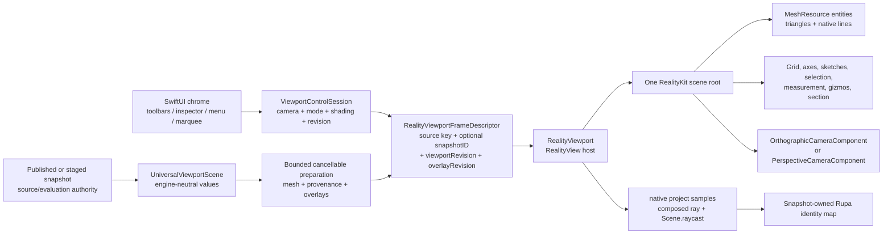

# RupaRendering

## Purpose and Scope

`RupaRendering` owns the bounded, postpublication presentation contract for one
immutable viewport snapshot. Production `RealityViewportView` supplies the
RealityKit surface, native camera, grid, and world overlays. SwiftUI `Canvas`
is limited to nonspatial selection chrome, while the legacy identity renderer
still supplies the picking routes owned by RK-4; RK-5 removes that backend and
the remaining migration-only code before RK-IV integration. The target uses
RealityKit on macOS 27 or later,
with `RealityView` as the live host and `RealityRenderer` limited to offscreen
GPU verification. A mounted native surface or capability probe alone does not
constitute the complete production backend cutover. The module's
CAD and Mesh inputs remain engine-neutral values from
[`RupaViewportScene`](../RupaViewportScene/DESIGN.md); RealityKit objects are
never source authority.

`RupaRendering` has one target child component,
[`ViewportMeasurement`](ViewportMeasurement/DESIGN.md), and the new
[`RealityViewport`](RealityViewport/DESIGN.md) component owns native scene
resources, entities, camera application, materials, and native input queries.
RK-3 completed the native world-rendering cutover. The remaining migration
boundary is input authority: legacy identity GPU readback remains active until
RK-4, and its backend is removed by RK-5 before RK-IV integration.

RK-CLEAN-1 retires the now-unreferenced `MTKView` surface host, fixed Canvas
grid renderer, and private Canvas world-drawing roots that RK-3 replaced with
production `RealityViewportView`. The nonspatial selection rectangle and its
live input/layout helpers remain, as do the legacy identity-input paths until
RK-4 and RK-5 replace them; this retirement therefore does not claim that every
legacy backend has already been removed.

## Responsibilities and Boundaries

The module owns:

- admission and cancellation of one bounded derived presentation request;
- the engine-neutral frame descriptor joining `snapshotID`, viewport revision,
  overlay revision, camera state, and spatial presentation descriptors;
- the document-lifetime `ViewportControlSession` camera, display-mode, shading,
  and revision authority;
- RealityKit resource/entity preparation and one coherent scene-root swap;
- native camera projection, mounted-camera ray composition, native collision,
  and triangle-hit resolution through the RealityViewport child contract;
- exact CAD/Mesh provenance mapping from native hits back to stable Rupa IDs.

It does not own CAD source, Mesh source, evaluation policy, project
publication, history, persistence, Agent/MCP routing, or source mutation.
`RupaUI` owns only SwiftUI composition and non-spatial chrome. It must not
build geometry, create a second camera, or retain a second presentation scene.

## Related Designs

| Design | Relationship | Contract Used | Summary | Cautions |
|---|---|---|---|---|
| [RupaKit package](../../DESIGN.md) | parent | Package dependency and authority direction | Places derived RealityKit presentation above source/evaluation. | RealityKit IDs never become Product/CAD IDs. |
| [RupaViewportScene](../RupaViewportScene/DESIGN.md) | depends on | `UniversalViewportScene`, `snapshotID`, world transforms, bounds, and provenance | Supplies immutable engine-neutral scene values. | Rendering cannot re-evaluate or retessellate source. |
| [RupaCore](../RupaCore/DESIGN.md) | depends on | Validated source/evaluation and stable identity contracts | Supplies source-derived material and navigation metadata. | Presentation material resolution never mutates the document. |
| [RealityViewport](RealityViewport/DESIGN.md) | child | Native scene/resource/camera/material/input adapter | Owns RealityKit objects and the matching scene-root lifecycle. | No custom render pipeline or spatial Canvas fallback. |
| [ViewportMeasurement](ViewportMeasurement/DESIGN.md) | child | Transient world endpoints, distance, ruler descriptors | Produces non-authoritative spatial measurement values. | It does not own RealityKit entity lifetime. |
| [RupaResponsivenessBaseline](../RupaResponsivenessBaseline/DESIGN.md) | coordinates with | Versioned fixture and pinned MainActor/memory acceptance policy | Owns the threshold and environment against which native preparation is measured. | A new native interval must be measured in the signed App; an offscreen duration does not satisfy this contract. |
| [RupaUI](../RupaUI/DESIGN.md) | used by | Matching frame state, tool intents, and visible errors | Composes `RealityView` and non-spatial SwiftUI chrome. | UI never becomes a geometry or camera authority. |
| [RupaAgentProtocol](../RupaAgentProtocol/DESIGN.md) | used by | Foundation-value viewport operation/state contract | Routes camera/display operations to the mounted session. | Applied state is not proof of a displayed frame. |
| [Rendering tests](../../Tests/RupaRenderingTests) | verification owner | CPU admission and target RealityKit GPU behavior | Verifies the target lifecycle, native camera/material/input, provenance, and frame coherence. | Capability tests do not prove current-production or CAD integration; CPU tests do not prove live RealityView behavior. |

## Architecture



The shared seam is an immutable `RealityViewportFrameDescriptor` value. The
public `Viewport` initializer requires one real `ViewportSourceIdentity`: a
document ID plus `DocumentGeneration`, or an existing presentation
`EvaluationSnapshotID`. `Viewport` combines it with an active drag-preview
revision and the existing scene-key inputs to form its internal
`ViewportSceneSnapshotKey`; the preparation identity also contains an explicit
producer-owned `overlayRevision`. It never synthesizes a project or evaluation
identity for an empty or sketch-only scene. The mounted frame also
contains the `ViewportControlSession` revision and camera snapshot plus bounded
engine-neutral spatial descriptors. It contains
no `Entity`, `MeshResource`, `RealityViewCameraContent`, `MTLBuffer`, or
`MTLRenderCommandEncoder`; native objects are created and owned only inside
`RealityViewport`. A frame is publishable only when all identity fields still
match the request that produced its resources.

The overlay revision advances whenever an input not already represented by
`ViewportSceneSnapshotKey` can change a world or camera-relative descriptor,
including selection, hover, active preview/affordance, snap, reference, and
measurement state. It does not advance for a camera-only change. The producer
passes only raw checked-`Sendable` immutable source and interaction captures to
the cache worker;
`ViewportScene` and its transitive value members acquire checked `Sendable`
conformance rather than crossing the boundary through unchecked isolation.
Main-actor capture does not call
`ViewportPatternArrayPreviewService.previews`, surface-analysis overlay build,
section-analysis overlay build, hatch conversion, or their output sorting and
array traversal. The existing producer worker invokes those pure builders once
for a changed source/overlay identity before it emits the complete batch; it
does not add another authority, cache, or worker lane.
The original pure builder algorithms are shared with a nonescaping `rethrows`
checkpoint `(items, positions, visits)`. Legacy nonthrowing wrappers supply an
explicit no-op checkpoint; the native worker supplies cooperative cancellation
and checked local admission. Output items/positions are charged only after the
existing selection predicate admits their source; raw traversal visits are
charged separately against the existing position/work ceiling. Checkpoints run
before owned allocation, append, and hierarchy/analysis/hatch visits. A stopped
worker propagates `CancellationError`, never partial or empty success. Native
section preparation admits the complete source and all derived hatches rather
than using the legacy UI's visible-prefix limits.
The revision does not repeat within one mounted viewport lifetime; exhaustion
is an explicit failure rather than wraparound to a possibly retained identity.

`ViewportSpatialOverlayChangeKey` is the internal `Equatable` invalidation seam
owned by the semantic producer. It is made synchronously from immutable values
already held by `Viewport`; constructing it never calls a scene builder,
analysis builder, pattern service, geometry sampler, projection helper, or
native API. It compares exact values rather than a collision-prone digest. The
key contains only inputs whose change can alter the producer output:

| Key group | Exact inputs |
|---|---|
| Interaction | `SelectionModel`, selection-drag preview targets, Mesh selection overlay, edited-body state, and resolved active/hovered/pending interaction and creation-drag values |
| Derived presentation | Pattern replacement request, surface analysis plus its display options, surface continuity, section analysis, snap result and exact snap options, placement highlight, and measurement state plus its active/automatic flags and explicit construction plane |
| Policy | Display unit, creation-drag axis constraint, descriptor-affecting affordance visibility and numeric parameters, and a bounded set of booleans recording whether each descriptor-producing interaction route is available; closures themselves are neither retained nor compared |

Document, evaluation, scene, workspace-overlay, section-clipping, object-definition,
and drag-preview-document topology remain represented by
`ViewportSceneSnapshotKey`; the change key does not duplicate or sample them.
Camera transform/projection, control basis, viewport size, grid frame, and chrome
exclusions are also absent because their bounded updates are owned by the native
camera frame. This exclusion is valid only when every non-grid plane preview
already carries an explicit `SketchPlane` and resolved world values. A creation
drag must therefore resolve its screen points and plane at input time before it
enters the semantic key/snapshot; a producer may not read the current control
basis later or add basis to the key as a substitute. The grid frame also supplies
the current visible-cell scale to the fixed-capacity native placement preview
when its explicit policy requests `.visibleCell`; this does not recapture the
source snapshot or advance the overlay revision. That preview is exactly one
optional `RealityViewportSpatialBatch.GridPlacement`: its resolved world center,
finite orthonormal plane axes, annotation presentation, and optional explicit
width and height, where a `nil` axis alone requests the current native grid
frame's `minorStepMeters`. Preparation admits and creates one native unit
rectangle with four vertices and eight line indices. After all grid-frame and
aggregate-admission checks succeed, the native owner atomically publishes the
grid and updates only that entity's translation, orientation, and per-axis
scale; it neither rewrites topology nor starts preparation work. Invalid or
over-budget input preserves the preceding complete grid-plus-placement frame.
Fully explicit rectangles, workspace-default rectangles, and non-rectangle
placement previews remain immutable producer-owned world meshes.

One `@MainActor`, non-`Observable` revision holder is retained by `Viewport`
through `@State`. It owns only the last exact change key and one monotonic
`UInt64`. `revision(for:)` returns the current value for an equal key and advances
once before cache lookup for a changed key; returning to an earlier key still
gets a new revision. Overflow is a typed failure, never wraparound. This
synchronous comparison makes the new preparation identity visible in the same
body evaluation. A pointer can only have addressed pixels that were drawn, so one
cache rule owns which frame answers, and the display and every CAD, handle,
projection, and section query resolve through it: the exact-ready frame when the
requested identity is prepared, otherwise the mounted frame whose scene key and
optional real snapshot ID are equal and whose overlay revision alone differs. An
overlay-only rebuild therefore never converts a press into a silent refusal. A
changed source or snapshot, an idle cache, or a typed failure recorded for the
requested identity withdraws display and authority together, so the two cannot
disagree about which frame answers. The exact-ready `surface(for:)` accessor
remains the preparation-lifecycle readiness predicate, not the input authority. Render origin is derived from those admitted
source/layout inputs rather than being a second cache-authority coordinate;
warm synchronous native reuse still requires the mounted and requested origins
to be equal. The `.task(id:)` that captures the immutable raw
producer input and starts its semantic build is attached inside the geometry
scope and runs only for a changed source or overlay identity. Pan, orbit, zoom,
projection transition,
resize, grid-step, and chrome-only body updates neither capture that snapshot
nor invoke its worker. No new protocol, observable owner, generic cache, or
second preparation lane is introduced.

The held `ViewportActiveInteractionDrags` value supplies exact active target and
semantic-value equality; it is not reconstructed by camera updates. Hover and
pending targets compare their spatial identities. Screen-only marquee points
are excluded; entering or leaving a drag can still hide the automatic ruler.
Capture failures call the existing preparation cache's `reject` entry point,
which cancels its worker and pending request and publishes the typed failure for
that identity. A same-scene/snapshot overlay failure may retain the previous
complete display without CAD authority; any source/snapshot mismatch withdraws
it. A late worker cannot overwrite either result.

The public initializer has no generation-less mutable-document mode. The main
workspace passes its document ID and `DocumentGeneration`; the modeling-preview
caller passes its payload's real presentation `EvaluationSnapshotID`. Direct
callers must likewise provide the identity owned by their source lifecycle, so
omitting that coordinate is unrepresentable at compile time. Equal identity is
a caller guarantee of equal source/path topology; repository production callers
meet it through the document store generation or immutable preview snapshot.
Preparation rejects a document-ID mismatch and a presentation identity that
does not equal the supplied scene's snapshot/project identity before selecting
a published native frame. Cancelled view tasks cannot capture, prepare, or reject
a replacement frame. The native grid's resolved readout supplies the HUD and
snap-step notification; SwiftUI does not build a second projected grid.
The complete viewport, including semantic overlays, is an explicit accessibility
container. Hiding native rendering internals does not hide the canvas or its
nonspatial controls from assistive technology.
The viewport root consumes the full rectangle allocated by its parent in both
axes before overlays are composed. Empty, preparing, ready, and failed states
therefore give native content, input, chrome, and accessibility the same nonzero
rectangle. `RenderInvalidation` remains part of the scene/preparation identity;
it does not recreate the SwiftUI native-host and control subtree through `.id`.
`ViewportWorkspaceRenderState.revision` remains workspace-view state and is not
reinterpreted as document source identity. This removes the snapshot cache's
legacy `nil`/uncached-rebuild path from native preparation without fabricating a
generation, evaluation ID, content hash, or request token.
The former optional `documentGeneration` initializer input and stored property
are removed. When the source case is `.document`, `ViewportControlContextKey`,
`ViewportSceneSnapshotKey`, and `ViewportSceneBuilder` all derive the same
generation from `ViewportSourceIdentity`; a second generation coordinate cannot
disagree with the preparation identity. The main `RupaUI` caller therefore
passes only `.document(id:generation:)`, while the preview caller passes only
`.presentation(_:)`.

RealityKit owns the presentation operations it already provides:

| Viewport need | RealityKit owner |
|---|---|
| Solid surface | `MeshResource` + native lit material (`PhysicallyBasedMaterial` or equivalent built-in material) |
| Flat surface | `MeshResource` + `UnlitMaterial` |
| Ortho camera | `OrthographicCameraComponent` |
| Perspective camera | `PerspectiveCameraComponent` |
| Spatial lines and triangles | `LowLevelMesh`/`MeshResource` native topology and `ModelComponent` |
| Repeated geometry | shared `MeshResource` entities; `MeshInstancesComponent` only after provenance is verified |
| Point projection and view ray | `RealityViewport` mounted-camera query contract: `RealityViewCameraContent.project(_:)` samples plus camera-local composed ray |
| Object/face hit | collision group/filter and bounded `Scene.raycast`, resolving `triangleHit.faceIndex` |
| Text labels | native `MeshResource` text extrusion and `BillboardComponent` |
| Sketch/path extrusion | native `MeshResource(extruding:extrusionOptions:)` |
| Section-plane clipping | `ClippingComponent` on a dedicated scene-hierarchy root |

`CustomMaterial` is allowed only for a RealityKit presentation feature that
the built-in material contract cannot express, such as MatCap or signed normal
color. It remains a RealityKit material and is validated
as a bounded resource. A custom Metal render pipeline, direct command encoder,
drawable management, synchronous GPU readback, Canvas raster texture, or
independent tessellator is never an alternative implementation.

## Contracts and Invariants

### Source, frame, and provenance

1. Required `ViewportSourceIdentity` plus any active drag-preview revision and
   the existing scene-key inputs form the source/path-topology identity;
   `UniversalViewportScene.snapshotID` additionally identifies a real optional
   presentation scene. A frame also carries one mounted viewport revision and
   one overlay revision. Scene resources, spatial overlays, camera, render
   state, and hit-test map are all derived from that exact tuple. A missing
   presentation scene means no surface resources, not a synthetic snapshot.
   Document-generation and real presentation-snapshot sources are accepted; no
   generation-less document, duplicate generation input, or workspace-revision
   fallback is accepted.
2. A mounted RealityKit scene and its hit-test scene are the same root and same
   frame, and that mounted frame is the single query authority. During
   same-source/snapshot overlay-only preparation the preceding complete root
   stays visible, camera-navigable, and resolves CAD hits, handles, drags,
   selection mutations, and provenance, because those are the pixels the pointer
   addressed and the ordered handle indexes it returns name its own prepared
   record table. A typed failure recorded for the requested identity keeps that
   root visible but withdraws its authority. A source/snapshot change, teardown,
   or mismatched request exposes neither the prior display nor its authority.
   The native child may reuse immutable resource content across source
   snapshots under its [bounded resource lifetime](RealityViewport/DESIGN.md).
   Such sharing does not reuse frame identity or any old query authority.
3. Entity names, hierarchy, UUIDs, `MeshResource` identity, and collision
   shape identity are implementation details. Stable occurrence, definition,
   representation, source, face, edge, vertex, sketch, and handle IDs remain
   in the snapshot-owned provenance map.
   Every interactive spatial descriptor produced in RK-3 carries a checked
   frame-local `UInt32` index into an immutable checked-`Sendable` table of the
   existing stable CAD handle identities. All native entities that form one
   handle retain that same index; a noninteractive descriptor has no handle
   index. The `RealityViewport` child validates the index, groups interactive
   world geometry no more coarsely than attachment plus index, and returns the
   index without interpreting the table entry. The host resolves it only while
   the complete frame tuple and its table still match. The index and native
   Entity are lookup coordinates, never CAD identity or authority. The
   parent value is a named `(spatialBatch, interactionRecords)` result. Each
   internal `ViewportSpatialInteractionRecord` stores one normalized identity
   and one case of the checked-`Sendable`, camera-independent
   `ViewportSpatialPreparedInteractionTarget` emitted by the same worker pass.
   The prepared semantic value is the drag baseline: it contains
   the source references, plane/model transform, semantic mode, initial value,
   and immutable world geometry required by the existing press/drag transition.
   A body-affordance record also retains the exact projection-free edit
   baseline resolved by that pass. Its internal payload is the affordance
   target, a COW array of internal `AffordanceBodyMember` values containing
   occurrence ID, feature ID, optional scene-node ID, model transform, and the existing
   `ViewportObjectEditState`, plus an optional group edit. A single-body handle
   has exactly one member and no group edit; a group handle has at least two
   members and an explicit group edit. Members are never collapsed into a
   feature-ID-keyed dictionary, because separate occurrences may reference the
   same feature. Retained member capacity and values are charged
   conservatively by the existing semantic-payload admission. Press-time
   materialization consumes this prepared baseline; it may
   not rebuild `baseEdits` or `baseGroupEdit` by traversing the current scene
   or selection. The existing `.affordance` input path initializes only body
   edits, so sketch transform is not a body-affordance record and never names a
   `ViewportAffordanceAction`: its handles form a separate closed identity
   family carrying the occurrence's feature ID, selection target, and one
   semantic role of translate axis, rotate axis, or bounds-corner scale. Naming
   a body action here is prohibited rather than merely unused, because the
   `.affordance` press path resolves a body edit baseline and commits through
   the body-move command, which expresses a translation as a profile-sketch
   edit and cannot express rotation or scale at all.
   The matching prepared case is the sketch mutation baseline. It owns the
   occurrence's scene-node address, the original local transform, the parent
   world transform resolved by the same producer pass, the world pivot, and the
   role's projection-free world geometry: an axis direction for translate, an
   ordered pair of plane vectors for rotate, and a corner direction with its
   base radius for scale. The baseline is fixed size and holds no collection,
   so it is charged a constant retained byte count.
   The producer resolves the parent world transform by walking the product
   metadata's scene-node tree once per pass, from a root down to the
   occurrence's node, and refuses a missing node, a cycle, a non-finite element,
   or a singular composition as a typed batch failure. It does not reuse
   `ViewportSceneTransformIndex`, whose lookup answers a missing node with the
   identity transform and whose compose returns the receiver unchanged when the
   product is not representable: either would seat a silent fallback at the
   origin of the baseline this whole route trusts. The duplication is therefore
   deliberate, and the index keeps its own non-throwing contract for the
   non-authoritative scene-tree consumers that already depend on it.
   Commit uses the existing scene-node transform command through the workspace
   callback, preserving its validation, save, and Undo authority as one
   transaction and therefore one Undo entry; it neither rewrites sketch
   entities nor routes a sketch occurrence through the body-move command.
   Verified projection-free existing semantic values are reused directly,
   including raw sketch/control/surface fields and the
   `ViewportPatternAffordanceSource` handle structs. Legacy handle targets or
   geometry values that contain `ViewportLayout`, projected points/vectors,
   points-per-meter, hit rectangles, or layout-derived minimum/base lengths are
   not record payloads; directed routes retain their raw world anchor,
   direction, and semantic value instead. It is not a
   `ViewportInteractionTarget` or `ViewportActiveInteractionDragState`; the
   MainActor input owner materializes a closed
   `ViewportSpatialMaterializedInteractionTarget` in RK-4.2.3 from the exact
   record and matching mounted RealityKit projection, then creates the existing
   target/drag state only where its payload is projection-owner-free.
   Materialization is one exhaustive route switch
   over the prepared value and may not invoke `ViewportLayout`, the legacy
   projected candidate selectors, or source traversal. A missing/degenerate
   native projection is typed frame unavailability, never placeholder geometry
   or legacy fallback. A legacy target/geometry that stores `ViewportLayout`
   is not reconstructed. Its materialized case instead stores only the finite
   projected points, vectors, and semantic scalars consumed by the input math,
   and the drag path consumes that case directly. Radial-angle and angular
   copy-count input store the native-projected center plus radial and tangent
   vectors with their base angle/count and policy minimum/step. Angular-density
   input stores the native-projected anchor and tangent direction, base count,
   and points-per-copy value derived from the existing policy. These cases do
   not store arc/guide visuals, a projection closure, or an approximation of
   `ViewportLayout`; native spatial resources already own their visuals. No
   closure, mutable coordinator, native Entity, Viewport, camera, or layout
   owner crosses this table boundary.
   The input owner resolves an ordered native handle result in two distinct
   steps: hover retains only the matching prepared-record identity, while a
   press materializes the first authoritative record and retains that closed
   value together with its record until click, drag finish, or cancellation.
   Failure to materialize the first native candidate is typed frame
   unavailability; it does not skip to a lower-priority candidate or invoke a
   legacy selector. A ready empty native result is a genuine handle miss and
   may continue only into the existing non-handle canvas/object input decision.
   A continued point/plane decision obtains its ray or world point from the
   same revision-checked `RealityViewport` camera-projection owner. A
   surface-free ready frame uses that owner's admitted camera projection sample
   depth; it does not fabricate geometry bounds, call `ViewportLayout`
   unprojection, or rely on the platform inverse-projection APIs that the
   mounted macOS 27 runtime contract excludes. Finite collision-cast length
   remains separately derived from admitted geometry bounds and is not a
   prerequisite for point/plane or world-axis camera queries.
   Drag updates consume the retained materialized value and occurrence/group
   baseline; they do not recapture the scene, resolve current hover, or rebuild
   members in a feature-ID-keyed dictionary. Existing input calculations may
   be extracted to accept materialized projected scalars, but pending state
   cannot retain a legacy geometry value that stores `ViewportLayout`.
   Baseline authority and camera readiness use different coordinates after
   press. The retained record remains authorized by its pressed base source
   identity, occurrence/member addresses, route availability, and operation
   role. A changed document ID/generation, presentation snapshot, selected
   operation target/member set, or callback availability cancels the pending or
   active interaction and clears its owned preview. A same-base-source overlay
   revision caused by hover, pending state, or that interaction's own active
   state does not cancel it. Nor does the existing drag-preview revision owned
   by that exact active interaction: its changed geometry may replace the
   displayed native frame while the immutable pre-drag baseline remains the
   commit/cancel reference. An occurrence/model-transform change not owned by
   that preview requires a changed source authority and cancellation; it cannot
   silently replace the baseline under the same press.
   Each subsequent geometric update separately requires a mounted frame for the
   current presentation identity and a matching camera revision. Temporary
   overlay/preview/camera preparation unavailability performs no drag mutation
   and grants no stale-frame fallback, but it does not by itself discard the
   retained baseline; once the matching camera is ready, the same interaction
   may resume. The owner never requires the press record's overlay revision to
   equal the replacement preview frame and never resolves a second hit to
   refresh that record.
   Releasing an accepted gesture while its own preview replacement is not yet
   mounted closes input but does not finish or discard the interaction. The
   owner retains one pending-finish value containing the release point, release
   camera revision, press record, and the same source/selection/route/base
   guards. Publication of that mounted frame retries the native axis query
   once and either emits exactly one commit or produces the route's typed
   refusal; it never uses the last preview scalar or bypasses revision checking.
   Absence of a mounted frame for the requested identity is the retryable state. Once the requested
   identity and revision are mounted, a nonfinite, degenerate, parallel, or
   behind-axis query is a terminal refusal rather than another readiness retry.
   A change to the document/source, non-self-owned presentation snapshot,
   selection/member set, route/base availability, or release camera revision
   before completion cancels the pending finish and emits no callback; Escape
   and teardown do the same. Clearing the pointer preview after mouse-up must
   not clear this closed pending-finish;
   completion or cancellation releases it exactly once before any external
   mutation callback.
   A two-point screen chord obtained by projecting a world-axis origin and a
   one-meter probe is not an affine world-distance metric in perspective and
   may cross the eye or reverse for a visible small handle. Production axis
   drag therefore retains the semantic world axis and resolves its world delta
   through the same mounted, revision-checked camera-query owner; the chord is
   only a bounded presentation/input sample and cannot authorize the CAD
   distance by itself.
   The incremental native cutover for `splineControlPointSlide`,
   `polySplineSurfaceVertexSlide`, `surfaceControlPointSlide`, `surfaceFrame`,
   `regionOffset`, `edgeOffset`, `slotWidth`, and `sketchVertexOffset` starts
   from the ordered native handle result and retains that exact prepared record,
   occurrence/source baseline, and press point through finish or cancellation.
   Each update queries the current exact-ready mounted revision for the signed
   delta along the record's world axis. The callbacks mutate sketch, surface,
   and CAD definition values expressed in source metres, whereas this native
   query returns world metres. For a single occurrence, the input owner derives
   the finite positive source-units-per-world-metre factor from the retained
   source direction and `record.modelTransform`'s invertible linear part. For a
   grouped surface handle, the producer derives every member's factor from its
   corresponding local direction and transform, publishes the verified common
   value as `Axis.sourceUnitsPerWorldMetre`, and refuses differing occurrence
   scales rather than averaging them or assuming identity. The input owner
   applies the applicable factor to the world delta before producing a commit
   value. Spline, surface, frame, and region slides consume the
   converted delta directly; edge and sketch-vertex offsets apply it to the
   retained source base value with the existing positive lower bound; slot
   width applies twice the converted delta to its retained source base width
   with the same lower bound. The input state retains the prepared record and
   axis and emits the existing public callback commit value; it does not retain
   an inert legacy interaction geometry or repackage one as an adapter. Once one
   of these routes is native-enabled, native miss or typed query/materialization
   failure cannot invoke its legacy selector. A source-baseline change cancels
   it. For edge offset, slot width, and sketch-vertex offset this includes a
   change to the retained base-value setting. The interaction's own overlay
   replacement retains the press record, and
   temporary native-frame unavailability performs no mutation until an
   exact-ready replacement resumes. The same lifecycle also owns
   `patternArrayLinearAxis`, `independentCopyExtrudeDistance`, and
   `independentCopyBodyDimension`; all three begin from their ordered prepared
   record and preserve source ID, output index, output scene-node ID, feature
   ID, and handle kind through preview, finish, or cancellation. Linear spacing
   adds the signed native world-axis delta to its retained world-metre base and
   applies `PatternArrayDistancePolicy.minimumLinearDistanceMeters`. The two
   independent-copy routes likewise retain their world-metre base, while their
   existing public callbacks convert the resulting world value by the retained
   finite positive output-axis length exactly once; the native input owner must
   neither omit nor duplicate that output-model scale conversion. Preview uses
   immutable callback values to feed the existing `PatternSource`, and a
   native-enabled route never invokes its corresponding legacy selector on
   miss, typed failure, or cancellation. Every other route remains explicitly
   incomplete until migrated under the same authority rather than silently
   sharing these route claims.
   The body transform affordance is native-enabled under this same authority.
   `Viewport.beginViewportPress` and `Viewport.hover` read only the leading
   prepared interaction record at the point, and its `.affordance` case owns
   the press, the hover highlight, and the drag for `translate`,
   `oneSidedScale`, `centerScale`, `rotate`, `vertexMove`, and `faceMove`. The
   legacy CPU projection selector is removed from this route: a native miss, a
   typed query failure, or a leading record whose action is not one of those
   six ends the route with no body transform hit instead of consulting the
   legacy gizmo. That fallback is prohibited rather than merely unused,
   because the legacy gizmo sizes its handles from the body's projected span
   while the native handles hold the point lengths fixed below, so
   reintroducing it would restore the scale-dependent hit geometry those
   lengths replace.
   The press retains the record's own member list, per-member edit baseline,
   and group edit, and the drag materializes `baseEdits` and `baseGroupEdit`
   from exactly those retained values, as the record contract above requires.
   Nothing on this route is re-read from the current scene, the current
   selection, or the live per-feature edit table: the record is admitted only
   from a frame prepared for the current overlay revision, and the edit table
   is one of that revision's own inputs, so a live re-read could only restate
   the prepared value under a second owner. Re-deriving the grouping is
   additionally unsound, because the producer groups by the selected
   scene-node addresses: a feature selected through more than one scene node
   yields a group handle there, while a feature-keyed re-derivation resolves a
   single body, matches no scene item, and ends the drag as a silent no-op.
   A body scene item carrying no scene-node address matches no selected target
   in the producer and therefore draws no transform gizmo; with the legacy
   selector gone it also receives no transform input, so this route no longer
   hit-tests geometry it never draws.
   The sketch transform affordance is native-enabled under this same authority
   and under its own identity family. The producer registers one record per
   drawn handle only while the route is interactive, which is exactly a bound
   scene-node transform commit callback; that gate is part of the overlay
   change key and is re-checked at press, on every drag update, and at finish,
   so a route that loses its callback cancels instead of committing. The gate
   is the callback alone, and the object-affordance permission is deliberately
   not part of it: that permission answers whether every selected target has an
   exact CAD affordance context, which is resolved from the selected
   presentations, and a sketch feature has no mesh presentation to resolve. A
   selection naming a sketch therefore cannot satisfy that permission under any
   document or camera state, so adding it to this gate would make the route
   unreachable in production while fixtures that pass the permission directly
   still drew and drove it. The tool and selection-scope predicate that decides
   whether object-scope editing is offered at all stays with the callback's
   provider, which binds the callback only in that state, so the viewport reads
   one gate and the workspace owns one policy. `Viewport.beginViewportPress` and
   `Viewport.hover` read the leading prepared record exactly as the migrated
   axis routes do, and a native miss, a typed query failure, or a leading
   record of another case ends the route with no sketch transform hit. No
   legacy sketch transform selector exists, and none may be added.
   The drawn handle set is closed at two translate axes, one rotate axis, and
   the four bounds corners, because the viewport's own sketch representation is
   planar. `ViewportSceneBuilder` discards `SketchDisplaySnapshot.plane` and
   emits every sketch primitive as a world point at `y == 0`, and the sketch
   overlay producer reads those points back the same way, so the drawn curves,
   their pick geometry, and this gizmo all live in the world XZ plane whatever
   plane the feature was authored on. A translation along world Y, or a
   rotation about world X or Z, would therefore commit a scene-node frame the
   preview cannot show and the curves cannot follow: the overlay would redraw
   the same flattened rectangle while the committed geometry left the plane.
   Those legs are omitted rather than drawn and refused, because a drawn handle
   is a promise that the gesture it names can be completed. The two translate
   axes and the rotate axis are taken from the drawn bounds rectangle's own
   edge directions and their cross product rather than assumed to be the world
   basis, so a sketch whose scene item carries a non-identity model transform
   names the axes it is actually drawn along. The pivot is the mean of the four
   drawn corners; each retained leg is invariant to the pivot's height, which
   is what makes the flattened frame a sound origin for all seven handles.
   Uniform corner scale is the only scale offered, so the committed frame stays
   similar to the drawn one under the same flattening.
   The parent world transform each baseline retains is resolved by this
   producer, in one top-down walk of `rootSceneNodeIDs` and `childIDs` taken
   once per frame and only when the frame draws at least one sketch gizmo. The
   walk is the producer's own because the shared scene transform index answers
   a missing node and a non-representable product with an identity frame, which
   would commit a mutation against a frame nobody authored. A node reached
   twice makes the document's tree ill-formed at that node; the walk records
   the collision and the lookup for that node alone is a typed refusal, so one
   malformed subtree cannot silently drop handles elsewhere in the same frame.
   A sketch item with no scene-node address, one placed through a component
   instance, or one whose node is absent from the document draws its bounds
   outline and no handles at all: the commit addresses a scene node's local
   frame, and none of those three names one. Drawing nothing there is not a
   failure and is not reported as one.
   The gesture follows the native axis lifecycle. The press closes over the
   prepared baseline and the frame tuple; every update re-validates source
   identity, presentation snapshot, selected targets, selected references, the
   finish revision, and the route gate, and any mismatch cancels the gesture
   and discards the pending mutation. Each update asks the mounted frame for
   the one query its role owns — a world axis delta for translate and scale, an
   ordered pair of world plane intersections for rotate — and the input type
   converts that answer into a world mutation `M_w` about the pivot. Non-finite
   input, a rotation whose start or current point coincides with the pivot, and
   a scale factor at or below a positive floor owned by the input type are
   typed refusals, not clamped values. A refused update keeps the press
   baseline and authorizes nothing, matching the unmounted-frame rule above.
   Nothing mutates the document during the drag: the pending mutation commits
   once at finish, converted to the occurrence's local frame as
   `P⁻¹ · M_w · P · L` by a throwing 4x4 multiply and inverse that refuses a
   non-finite element or a determinant magnitude at or below `1.0e-12`. The
   shared viewport transform helpers are not used for this composition, because
   their compose returns the receiver unchanged when the product is not
   representable. The scene-node command accepts a non-rigid matrix, so scale
   commits through the same path as translate and rotate.
   The drag preview is overlay-level, exactly as the body transform route
   previews through its ghost edit. The emitted bounds outline, gizmo arrows,
   rotation arcs, corner handles, and center marker are drawn at the mutated
   world geometry, while the sketch curves themselves do not move until the
   commit lands; that is the observable this route promises, and its preview
   test asserts the emitted world points equal the mutated baseline corners.
   The drag never installs a preview document: that path re-validates and
   re-evaluates the whole document per pointer move, which the frame budget
   owns as a correctness limit, and no migrated drag route uses it. The pending
   mutation is part of the overlay change key, so each move re-prepares a frame
   whose handles sit where they are drawn.
   Commit hands the workspace the scene node's address, the baseline local
   transform the press closed over, and the new local transform. The workspace
   refuses the command as a typed editor error when the stored local transform
   no longer equals that baseline, so a document that changed under the drag is
   neither silently overwritten nor partially applied; on success the single
   scene-node transform command is one workspace transaction and therefore one
   Undo entry. A cancelled gesture, a refused query, and a refused commit all
   clear the pending mutation and leave the document untouched, and a refused
   finish reports its typed failure instead of discarding it. The viewport owns
   no workspace error channel, so both native gesture routes report a refused
   finish through this module's gesture logger and nowhere else; the released
   native axis route reports the same way rather than dropping an unanswered
   value at mouse-up, and neither route ever turns a refusal into a committed
   value.
   The profile corner, profile face, edge chamfer, and edge fillet affordance
   actions are outside these claims and stay on their legacy selectors until
   RK-4.2.2/3 prepares records for them. Rectangle selection no longer waits on
   a later seam: its CAD sub-shape rules are owned by invariant 8, and the
   legacy rectangle resolver is reached only for the residual geometry named
   there.
   The closed
   `ViewportSpatialHandleIdentity: Equatable, Sendable` enum contains only
   stable source/selection addresses and semantic handle roles; it contains no
   screen point, derived geometry, native object, name, or UUID. Record
   registration and fragment lookup additionally use the stable scene
   occurrence address from the same semantic pass. Scene-derived records with
   the same feature/handle identity but different `SceneNodeID` values receive
   different indexes and retain their occurrence-specific transform and drag
   baseline; selection matching must resolve the occurrence before matching the
   feature/component. A missing occurrence address is valid only for a source
   that the prepared scene proves is genuinely uninstanced, or for one
   explicitly represented selection-group handle whose payload contains the
   complete stable member-occurrence list and group edit. The latter is one
   aggregate handle, not permission to merge individual occurrences. The five
   surface handle cases that currently contain `SelectionReference` project it to the
   exhaustive reference-case discriminator, `SubshapeID`, and the applicable
   parameter, UV, index, or trim address. They never retain or traverse
   `StableSubshapeReference.geometrySignature`; the matching frame tuple, not a
   copied CAD geometry tree, owns the validity of that presentation address.
   For poly-spline-surface vertices and surface control points, the identity
   augments the existing target identity with one shared semantic role:
   `.planar`, `.axis(ViewportCoordinateAxis)`, or
   `.localAxis(ViewportPolySplineSurfaceVertexLocalAxis)`. The local direction
   vector remains derived geometry and is not part of identity; distinct roles
   never share one handle index.
   One canonical route source registers each record exactly once, then all of
   that handle's visual fragments look up and reuse its normalized-identity
   index. A second registration of the same identity is a typed producer
   failure; it is not resolved by comparing complete targets, because synthesized
   equality may traverse `SelectionReference.geometrySignature`. A fragment
   lookup for an unregistered identity likewise fails. The cache retains the immutable record table beside
   its private prepared frame,
   while the native batch receives only `handleCount`, the table's checked
   application-owned `retainedSemanticByteCount`, and optional indices. A synchronous cache lookup
   returns a table entry only when both the prepared frame identity and index
   match; the observable ready-state payload does not become a second owner.
   A synchronous lookup returns the prepared semantic baseline only for the exact ready
   frame and a valid index; stale, preparing, rejected, replaced, or torn-down
   frames expose neither identity nor target. Non-handle callers use the exact empty defaults: no table entries,
   `handleCount == 0`, `retainedSemanticByteCount == 0`, and
   `handleIndex == nil`.
   Admission charges record-array capacity, normalized-identity payloads, and
   producer-owned variable arrays/strings in prepared baselines with checked
   arithmetic before the cache retains them. An immutable CAD COW source
   reference is shallow-retained as part of the baseline: Rendering charges its
   value slot but neither traverses, clones, serializes, nor guesses the backing
   geometry size. Other producer-owned variable payloads are not exempt from
   the existing item/position/retained-byte ceilings. The batch receives only
   the validated record count and total `retainedSemanticByteCount`; the native
   child never imports or interprets either interaction-target type.
   A normalized identity may still be used transiently to calculate visual
   hover/pending/active state without becoming a record. Such a state-only
   identity gives its descriptors no `handleIndex`. Decorative fragments of an
   already registered interactive handle may share its index for provenance but
   remain non-pickable without an explicit footprint. Before RK-4.2.2 completes,
   every enabled interactive route must register one complete semantic baseline and map at
   least one accepted fragment footprint; an incomplete baseline is a typed
   producer failure rather than identity-only native authority.
   The current projected CPU handle providers remain a temporary
   pre-RK-4 input path, not future identity authority: RK-4 must consume this
   prepared mapping and must not rerun producer candidate traversal to infer a
   handle from a native hit. Bounded native-camera projection remains permitted
   only for the tolerance cases in invariant 8.
4. The frame descriptor contains no source mutation or project publication
   authority. A preview frame is discarded on cancel/stale replacement and
   never enters history, undo, persistence, or source selection.

### Native camera and input

5. `ViewportControlSession` is the only mutable camera/display/shading owner.
   UI gestures and Agent/MCP operations call the same throwing action boundary.
   Camera updates change RealityKit camera components/transforms and do not
   rebuild mesh resources or scene provenance.
6. Parallel and perspective use their native RealityKit camera components.
   Fit, pan, orbit, zoom, saved-view restore, and orientation preserve the
   session's finite focus/basis/lens contract. The
   [RealityViewport mounted-camera query contract](RealityViewport/DESIGN.md#contracts-and-invariants)
   is the live projection/ray authority; any bounded CPU tolerance calculation
   must agree with it and may not create a second live camera. Production uses
   only native `PerspectiveCameraComponent` or `OrthographicCameraComponent`.
   An off-center CAD fit/pan term is camera right/up-plane translation, never
   lens skew or an unsupported projective component; native render/project and
   composed-ray parity must be established before the adapter is accepted.
7. Live pointer, hover, measure endpoint, and canvas-plane resolution consume
   the child component's native-project-derived ray. Object/face collision uses
   bounded native `Scene.raycast(.all)` rather than raw mounted `ray`,
   `unproject`, or `hitTest`; the macOS 27 counterexamples and exact composition,
   sample, finite-bound, near/far, and refusal rules are owned only by the
   [RealityViewport design](RealityViewport/DESIGN.md#contracts-and-invariants).
   The production canvas-input mapper routes all nine point/plane callers
   through that exact-ready cache/native entry point, including an empty scene;
   stale or unmounted input performs no callback and may resume only after the
   matching mounted camera is ready. The legacy CAD-face `exactWorldPoint`
   branch remains separately marked `FIXME(INCOMPLETE_IMPLEMENTATION)` until it
   uses the same native owner, and camera-plane evidence does not complete or
   authorize that branch.
   Results are sorted by ascending distance and filtered by the
   same visible/section/back-face rules as the scene. The host requests all
   native collision hits before filtering so a rejected
   clipped or culled hit cannot hide a later visible native hit. When native
   material back-face culling is active, that same mounted-camera query ray and the
   snapshot-owned source-triangle winding classify each native hit in one
   common scene coordinate space; this is visibility classification, not a CPU
   triangle-intersection fallback. When culling is inactive, winding does not
   reject a native hit. On the supported macOS 27 runtime,
   [`ShapeResource.generateStaticMesh(from:)`](https://developer.apple.com/documentation/realitykit/shaperesource/generatestaticmesh(from:))
   is observed by the Apple-GPU regression to produce one-sided collision even
   when the visual material's
   [`faceCulling`](https://developer.apple.com/documentation/realitykit/materialparametertypes/faceculling)
   is disabled; this is a target-runtime observation, not a cross-version API
   guarantee. Each occurrence therefore uses a collision-only native
   MeshResource whose triangle list is the original winding followed by the
   reversed winding. The visual MeshResource remains unchanged. A native
   collision face must be in `0..<(2 * sourceTriangleCount)` and resolves to
   `faceIndex % sourceTriangleCount`; the resolved source winding, never the
   duplicated native winding, owns culling classification and provenance. The
   observed face-order/range contract is reverified when the supported OS or
   RealityKit SDK changes.
   Missing collision or `triangleHit.faceIndex` mapping is an explicit miss or
   typed failure; legacy GPU identity rendering is not a fallback.
   The shared `ViewportInputSurface` preserves one primary-gesture lifecycle.
   For a click, the resolved press baseline remains alive through `onPick`; the
   owner clears its preview and pending state only after that callback returns.
   When Escape handles cancellation, it consumes the active primary mouse
   gesture as well as its preview, so the remaining mouse-up event cannot emit
   a pick or drag. The following mouse-down starts a normal fresh gesture.
   Escape with no handled viewport interaction is not consumed and remains in
   the existing responder chain.
   RK-4 connects this contract in three serial seams. First, surface pointer
   selection and measurement consume one throwing native query whose nearest
   optional result contains
   occurrence/source-triangle provenance and the child-owned CAD world point;
   both require a mounted frame for the requested presentation identity and a
   matching mounted camera revision. Only a mounted query with no retained hit is
   a miss; an absent or stale presentation is a typed failure and cannot fall
   through to another semantic target. Second, spatial and legacy affordances
   resolve native entities through the already prepared frame-local handle table.
   The cache maps the ordered native indexes to records only from that same
   mounted frame's prepared table;
   materialization then consumes only revision-checked projection calls on that
   same native owner, synchronously without suspension or intervening frame
   mutation. An index mismatch or failed projection is typed unavailability,
   never a partial candidate list or old selector fallback. Third, rectangle
   selection uses only the bounded exception in invariant 8. Completing the
   first seam does not by itself complete RK-4.
8. Edge/vertex tolerance, rectangle selection, and any operation for which
   RealityKit has no equivalent may use the same prepared geometry and native
   camera projection as a bounded CPU query. This exception preserves CAD
   semantics only; it cannot introduce a second renderer or source traversal.
   Mesh face selection consumes the native surface hit. Mesh edge/vertex
   selection tests the exact prepared face-loop edge and vertex provenance in
   the declared point-space neighborhood through the mounted native projection,
   including candidates just outside a triangle or silhouette; restricting the
   tolerance query to the triangle interior is not equivalent CAD behavior.
   The admitted render plan already owns the required occurrence/source
   reference, face ID, source vertex IDs and world positions, and original
   boundary-edge IDs for every triangle side; the resolver streams only that
   retained, plan-count-bounded data and never reopens CAD source geometry or
   allocates another full candidate table. It retains one current best result;
   only a strict projected-distance improvement advances it, so duplicate
   triangle references to the same source boundary cannot duplicate output and
   equal-distance ties preserve stable prepared order.
   A face result is the native hit at the pointer. For an edge or vertex, the
   resolver projects the retained boundary, finds candidates within the fixed
   8-point neighborhood (including a pointer outside the silhouette), and asks
   the native surface query at each candidate's nearest projected boundary
   point. A candidate is eligible only when that section/back-face-filtered
   nearest native hit has the same occurrence and incident source edge or
   vertex; an occluding occurrence therefore rejects it. Selection is minimum
   projected distance followed by stable prepared order. Missing authored-mesh
   provenance, projection, incidence, or native visibility is a miss or typed
   frame failure according to the mounted-frame query contract, never a CPU
   triangle hit or legacy selector fallback.
   CAD body face/edge/vertex selection uses the same bounded exception with the
   prepared B-Rep topology instead of the authored-mesh face loops.
   `ViewportNativeCADTopologyResolver` owns it. The prepared
   `SelectionComponentID` of the sub-shape is the only identity it emits; a
   native `MeshFaceID` is render provenance and is never reinterpreted as a CAD
   identity. The resolver projects the retained topology through the same
   mounted camera the surface query uses, tries vertex, then edge, then face,
   and keeps one current best that only a strict projected-distance improvement
   advances.
   Every CAD interaction body carrying prepared topology is a candidate, not
   only the body the pointer draws, because a pixel just outside the tessellated
   silhouette still has outline edges and silhouette vertices inside the point
   tolerance. `Viewport` compares candidates from different bodies through the
   same rank-then-metric order — vertex before edge before face, then projected
   distance — so the nearest sub-shape wins across the scene and equal
   candidates keep stable scene order.
   A face result is the CAD face that generated the triangle the native frame
   drew at the pointer. A face is offered only for the body the native frame
   actually draws at that pixel: an empty pixel and an occluding body both end
   the face query, because a face cannot exist where the frame draws none of
   this body. The resolver forms no containment test and no face depth of its
   own. The frame already decided which triangle it drew there, and evaluation
   already recorded which CAD face generated each triangle, so the branch reads
   that prepared answer. Its key is the hit triangle's `MeshFaceID` raw value,
   which the universal mesh source preserves as the triangle's emission index;
   the recorded runs are scanned in the order they are held rather than searched
   as sorted, because a malformed list answered by a binary search would name
   the wrong face instead of no face. A triangle no run names is a truthful
   miss: evaluation gave its face no stable sub-shape identity, so there is no
   CAD name to select, and no neighbouring face is substituted. A raw value no
   triangle index can hold is malformed provenance and is a typed failure, not
   a miss, because a miss would hand the query to the legacy resolver as if the
   frame had answered.
   Only a `.cad` source reference reaches this branch. An authored mesh numbers
   its own faces independently, so its `MeshFaceID` could land inside a CAD run
   by coincidence and name a face the frame never drew; `Viewport` withholds the
   surface from those bodies so the face query misses instead.
   The runs travel with the prepared topology as
   `ViewportBodyTopology.meshFaceRuns`, built once per scene build from the body
   display snapshot. No camera move and no click rebuilds them, and no side
   table keyed by mesh identity exists to fall out of step with the snapshot.
   An edge candidate interpolates no depth at all. The screen parameter of the
   nearest projected point is mapped back to the edge's own world parameter
   under that same frame projection, and the native camera then reports the
   depth of the resulting world point. Native camera depth is linear view-space
   z under both cameras, so which mapping applies is a property of the frame and
   never of the sign of the sampled depths: an orthographic frame makes depth
   linear on screen, and a perspective frame makes reciprocal depth linear. The
   resolver asks the frame which of the two it is through
   `usesPerspectiveProjection` and infers neither.
   A vertex or edge candidate is admitted only when the mounted frame still
   retains its world point through the active section, and is then rejected
   only when the frame draws a nearer surface at the candidate's own projected
   point, within the resolver-owned relative `depthSlack`. The section query
   runs first because an empty pixel is ambiguous on its own: a silhouette point
   and a point the section cut away both draw nothing, and only the frame that
   applied the section separates them. Once that question is answered, a pixel
   that draws nothing hides nothing, which keeps silhouette vertices and outline
   edges selectable where the exact B-Rep point and the tessellated collision
   surface disagree.
   The native outcome is three-valued. `resolved` and `miss` both mean the
   native frame answered the query; `unsupported` means it could not, because no
   presentation is mounted or no CAD interaction node in the scene carries
   prepared topology. An empty pixel is a `miss`, not `unsupported`: the frame
   answered, and nothing is drawn there. Face and edge scopes reach the legacy
   identity resolver only on `unsupported`, so neither a miss on a
   topology-backed scene nor a hover over empty space can be answered by a
   second, differently projected hit rule. The scopes that still have no native
   input path — object, vertex, region, sketch entity, and the unscoped query —
   remain routed to the legacy resolver on a miss until their own seams land.

   Rectangle selection uses this same resolver and this same frame under the
   bounded exception above. It is a set query, not a nearest query: the
   rectangle entry point returns every CAD sub-shape of one body that meets the
   rectangle, so `Candidate.rank` and its projected-distance metric have no role
   and no candidate precedes another. `Viewport` walks the CAD interaction
   bodies in scene order and each body's topology in recorded order. The two
   de-duplications sit at different scopes and use different identities. Within
   one body the resolver refuses a `SelectionComponentID` it already reported,
   because one CAD face can own more than one recorded run. Across the scene
   `Viewport` refuses a `SelectionTarget`, the `SceneNodeID` and
   `SelectionComponent` pair the selection already names an editable sub-shape
   by, because scene items that place one shared feature carry identical
   sub-shape component identities and de-duplicating by component alone would
   report only the first placement. The covered scopes are exactly face, edge,
   and vertex.
   The `all` and `object` scopes are deliberately not covered: the legacy
   rectangle filter already drops every body hit wherever object hits are
   allowed, so a rectangle there selects whole occurrences and never a
   sub-shape. Region and sketch entity keep their existing routes. The
   occurrence rectangle that answers `all` and `object` is a separate native
   query over the same mounted frame, described after the legacy residual below.
   A vertex is inside the rectangle when its projected point is, with no
   tolerance, which is the containment the replaced pixel scan required, and it
   is then admitted by exactly the section-then-occlusion rule a pointer vertex
   is.
   An edge is clipped rather than sampled at a fixed pitch, because a pitch
   would make a short edge's admission depend on zoom. It is first clipped in
   world space against the mounted camera's depth interval, so an edge crossing
   the near or far plane keeps the part the camera can draw instead of being
   dropped whole. The surviving segment's endpoints are projected, and the
   projected segment is clipped against each cell of the sampling grid described
   below in its own screen parameter. Every cell the segment crosses contributes
   the midpoint of its surviving interval, mapped back to the edge's world
   parameter under the frame's own projection rule, and the edge is admitted at
   the first of those samples the visibility rule accepts.
   A face is answered from the drawn triangles, not from a face loop, because
   the prepared loops omit a face whose outer loop has fewer than three points
   and a loop centroid can land in an annular face's hole. Each recorded run is
   first tested by projecting the eight corners of its world-space bounding box;
   the run is skipped only when all eight project inside the camera's depth
   interval and their screen bounds miss the rectangle, so a corner the camera
   cannot answer widens the search instead of losing the face. A run that
   survives projects each mesh position it references once and reuses that
   projection for every later run of the same body, because the mesh is shared
   across its runs and projecting per triangle would cost three native calls per
   triangle instead of one per position. A run the bounds test skips projects
   none of them.
   Each triangle of a surviving run is clipped in world space against the
   mounted camera's depth interval before it is projected. Depth is an affine
   function of world position under both projection modes, so interpolating the
   crossing in world space is exact rather than approximate, and a triangle
   straddling the near or far plane keeps the part the camera draws. Only the
   vertices the clip creates need a projection of their own; a triangle wholly
   inside the interval reuses the body's projected positions and costs none.
   Both clips read the mounted camera through two queries of its own.
   `RealityViewport.cameraDepthInterval(revision:)` reports the interval, and
   `projectedPointWithDepth(_:revision:)` reports a world point's depth whether
   or not the interval admits it, together with the projection where the camera
   can answer for it. `projectedPointWithinDepthRange(_:revision:)` is defined
   in terms of those two, so the near and far planes have one reader and the
   point path and the rectangle cannot disagree about the interval.
   The surviving projected polygon is then sampled on a grid rather than at one
   representative point. The rectangle is divided into
   `MeshSourcePresentationPlanLimits.rectangleSampleGridDivisions` cells per
   axis, and each cell keeps the largest fragment any triangle of the run
   contributes there, ordered by that fragment's area and then by its own sample
   point. That order is total, so a cell's sample is a maximum and not a first
   arrival, and it does not depend on the order the triangles are emitted in.
   The sample is the mean of the fragment's vertices, which lies inside the
   fragment, inside the cell and therefore inside the rectangle. A run's samples
   are queried from the middle of the rectangle outwards, and the scan stops at
   the first sample the frame confirms. The run is admitted only when one native
   surface query at one of its samples returns a triangle this body drew and
   whose emission index resolves through this same run list back to this run.
   Both halves of that check are load-bearing. The half that asks whether the
   frame drew the triangle here is the occlusion and section test, since the
   frame draws only what survived the section and only what nothing nearer
   covers, so this branch needs no depth compare and no world point of its own.
   The half that asks which run owns the returned index is not redundant with
   it: mesh face identities are numbered per body, so another body's triangle
   can carry an index that also names a run of this body, and without the first
   half the rectangle would admit a face standing behind another solid.
   Answering a face from drawn triangles makes the snapshot mesh positions an
   input of this path alongside the run list. The scene builder writes the mesh
   and the topology from one body display snapshot or writes neither, so
   prepared topology without that mesh is malformed preparation and a typed
   failure, never a body whose faces the rectangle silently skips.
   The rectangle therefore holds the cost class of the pointer query rather
   than of the triangle count. Per body it costs at most eight projections per
   recorded run, one projection per mesh position referenced by a run that
   survives its bounds test, at most two further projections for each triangle
   that straddles a clip plane, one projection per vertex, two per edge, and,
   for each candidate sub-shape that reaches the frame, at most one native
   surface query per grid cell. A body carries as many candidate sub-shapes as
   it has recorded runs, edges and vertices, so the ceiling this path states is
   the per-candidate one,
   `MeshSourcePresentationPlanLimits.maxRectangleSurfaceQueryCountPerCandidate`,
   and not a product of the plan's item ceiling. Clipping, the bounds test and
   the grid are CPU arithmetic over already projected points and call the frame
   not at all, and that CPU scan now covers a surviving run's whole triangle
   list rather than a prefix of it, which is what order independence costs.
   This bound is a correctness contract rather than an optimization: a
   rectangle drag re-runs the query on every pointer move, and a per-triangle
   native projection would make the cost of one input event a function of
   tessellation density.
   The grid's division count belongs to `MeshSourcePresentationPlanLimits`
   because it is what turns a rectangle update into a bounded number of native
   surface queries, which is a budget of the same plan that type's other
   ceilings bound. It is four per axis. That value follows from the guarantee
   the grid makes and from nothing measured here. A convex fragment clipped to
   a cell has its sample inside that cell, and an axis-aligned window whose
   side spans at least two cells always contains a whole cell, so a candidate
   showing such a window inside the rectangle always has a sample in it
   whatever its tessellation. Four per axis makes that window a quarter of the
   rectangle. Raising the count tightens the guarantee and raises the query
   ceiling in proportion; lowering it does the reverse.
   The failure contract belongs to the drag, not to the resolver alone.
   `Viewport.selectionDragTarget` throws, and both the preview publisher and the
   drag handler answer a typed failure by publishing nothing, as the pointer
   press ends a cancelled native gesture and the hover clears its canvas state.
   A rectangle that could not be resolved changes no selection and never
   publishes an empty answer that would read as an intentional deselection.
   The legacy rectangle resolver is narrowed, not removed. Face, edge, and
   vertex consult it when, and only when, the hit scene holds geometry the
   native path does not own: a CAD interaction body whose prepared topology
   carries no face, edge, or vertex target, which the legacy pick index answers
   with projected bounding-box sub-objects, and, for vertex alone, a body
   carrying surface knot, span, trim-knot, or trim-span displays, which are
   addressed by `SelectionReference` and have no prepared topology identity at
   all. With neither present the rectangle makes no legacy call and renders no
   identity buffer. With either present the legacy result has the hits the
   native path owns removed by ownership and not by outcome — every body hit
   carrying a generated face, edge, or vertex `SelectionComponent` whose scene
   node is a CAD interaction node — so a native miss cannot let the legacy
   answer back in for a body the native path answered for. `unsupported` is
   unchanged: with no presentation mounted, or with no CAD interaction body
   carrying prepared topology, the whole legacy rectangle path runs as before.
   The GPU identity buffer therefore survives this seam for that residual, and
   is removed only once those producers have seams of their own or are retired.
   The resulting rectangle semantic differs from the buffer it replaces, which
   admitted a sub-shape owning any front-most pixel inside the rectangle. The
   departure is that the decision is taken at the grid's samples and not at
   every pixel: a sub-shape occluded or sectioned away at every one of its
   samples is a miss even when a part of it is visible inside the rectangle.
   What the grid removes is the dependence of that miss on tessellation and on
   emission order, since the samples are a function of the projected geometry
   and the rectangle alone, and it bounds the miss by the guarantee above rather
   than leaving it at a single point.

   The occurrence rectangle that answers `all` and `object` is its own native
   query, owned by `RealityViewport.occurrenceIDs(intersecting:revision:)` and
   forwarded by the plan cache under the same exact-ready identity and camera
   revision as the point path. It answers from the mounted frame's own retained
   plan, so the geometry it projects and the pixels it samples can never belong
   to two different plans. `usesNativeCADSubshapeRectangle` is not widened for
   it: the sub-shape rectangle and the occurrence rectangle are different
   questions over one frame, gated separately by
   `selectionHitPolicy.allowsObjectHits` and by whether the legacy residual
   still runs.
   A candidate occurrence is first tested by projecting the eight corners of its
   world-space bounding box, under the same rule the CAD face runs use: it is
   skipped only when the camera answers for all eight inside its depth interval
   and their screen bounds miss the rectangle. A surviving candidate has each of
   its retained world positions projected once — the shape
   `MeshSourcePresentationOccurrenceView` exists for — and its triangles are
   then clipped in world space against the camera's depth interval, projected,
   and accumulated into the same sampling grid the CAD sub-shape rectangle uses,
   so the two rectangles cannot disagree about where a candidate is sampled. The
   candidate's samples are queried from the middle of the rectangle outwards and
   the scan stops as soon as the frame answers with the candidate itself.
   The surface query answers with the occurrence the frame draws at that pixel,
   which carries two consequences. The occurrence it names is admitted whether
   or not it is the candidate that asked, because the frame drawing it at a
   pixel inside the rectangle is the admission evidence itself; a candidate
   admitted that way is never asked again. And a candidate the frame answers
   with a different occurrence, or with nothing, is not admitted. That single
   answer is the section, occlusion and back-face test together: the frame draws
   only what survived the section, only what nothing nearer covers, and only the
   faces it retains, so this path adds no depth compare, no section predicate
   and no culling filter of its own.
   The stated limitation is the one the CAD face rectangle already carries, for
   the same reason: the decision is taken at the grid's samples and not at every
   pixel, so an occurrence occluded at all of them is not admitted even when
   another part of it is visible inside the rectangle. The samples are a
   function of the projected geometry and the rectangle alone, so the answer
   does not depend on triangle emission order and a body either selects or does
   not, consistently across a drag.
   The cost is bounded by contract rather than by measurement. Per candidate:
   eight bounding-box projections, one projection per retained source position,
   at most two further projections per triangle that straddles a clip plane, CPU
   clipping of every triangle into the grid, and at most one native surface
   query per grid cell. Across a plan those are bounded by
   `MeshSourcePresentationPlanLimits.standard` — 640 occurrences and 188,550
   positions — and the surface queries by that plan's item ceiling times
   `maxRectangleSurfaceQueryCountPerCandidate`, never one per triangle. This is
   a correctness contract for the same reason the sub-shape bound is: a
   rectangle drag re-runs the query on every pointer move, and a per-triangle
   native query would make one input event cost a function of tessellation
   density.
   The result is returned in plan order, de-duplicated. Both consumers depend on
   that determinism for stability and not for meaning:
   `MeshSourcePresentationLegacyHitFilter` converts it to a set, and
   `MainView.mergedSelectionTargets` appends it after the hit-derived targets and
   drops duplicates.
   The failure contract changes with this seam. The replaced query answered an
   unready or absent presentation with an empty list, which the legacy filter
   read as "no occurrence is visible" and used to drop every legacy body hit.
   The native query reports readiness, camera revision, and projection failures
   as typed errors instead, so `selectionDragTarget` throws and both publishers
   report nothing. `all`, `object`, `region` and `sketch entity` therefore gain
   the throwing surface that face, edge and vertex already had through the CAD
   sub-shape rectangle. An empty result now means only what it says: the mounted
   frame drew no occurrence inside the rectangle. `Viewport` computes the set at
   most once per rectangle update and passes it to the legacy filter as a
   parameter, so the two consumers cannot disagree, and the query does not run
   at all for a face, edge or vertex rectangle the native path resolved with no
   legacy residual.
   `Tests/RupaRenderingTests/ViewportNativeCADTopologyResolverTests.swift` owns
   the behavioral evidence for this resolver: the rank-then-metric order across
   bodies, the run lookup that names the CAD face of the drawn triangle
   including its recorded-order scan, its truthful miss for a triangle no run
   names and its typed failure for an unrepresentable identity, the orthographic
   and perspective edge-parameter rules, rejection of vertices and edges the
   section removed, silhouette retention over an empty pixel, and the `miss`
   versus `unsupported` split.
   `Tests/RupaRenderingTests/ViewportNativeCADRectangleResolverTests.swift` owns
   the rectangle rules: zero-tolerance vertex containment, the per-cell
   clipped-interval edge samples including an edge whose endpoints both lie
   outside and an edge occluded at one sample but visible at another, the run
   bounds test that skips no run a camera could not project, the grid samples
   and their independence from triangle emission order, admission of a run whose
   only visible part lies away from the rectangle's middle, admission of a
   triangle that straddles the camera's near plane, the confirming surface query
   that rejects a triangle another body drew and a triangle belonging to a
   different run, rejection of the sub-shapes the section removed, the
   de-duplication of one component named by two runs, the typed failure for an
   unrepresentable identity, and the absence of any rank order in the result.
   `Tests/RupaRenderingTests/ViewportNativeOccurrenceRectangleResolverTests.swift`
   owns the occurrence rectangle rules: a visible occurrence admitted, one fully
   behind another rejected, a candidate whose bounds miss the rectangle skipped
   with no surface query spent on it, no skip for a corner the camera cannot
   project, the reuse that admits the occurrence a query names without asking
   that occurrence again, admission of a candidate occluded at the rectangle's
   middle but visible in a corner cell, admission of a candidate whose triangles
   straddle the camera's near plane, results independent of triangle emission
   order, at most one surface query per grid cell for a candidate that reaches
   the frame, plan-order output independent of admission order, an occurrence
   the frame answers with nothing rejected, the typed failure for a degenerate
   rectangle, and the typed failure for an answer naming an occurrence the
   queried plan does not hold. Its candidates are real occurrence views taken
   from a built plan, so the retained shape the cost contract is stated against
   is the plan's own.
   `Tests/RupaRenderingTests/ViewportRectangleSampleGridTests.swift` owns the
   sampling kernel both rectangles share: that a cell's sample is a maximum
   under the total order and not a first arrival, so the same fragment set
   samples the same points whatever order the fragments arrive in; that equal
   areas are broken by the sample point and never by arrival; that a window
   wider and taller than two cells always receives a sample strictly inside it
   whatever tessellation produced it, and never one outside it; that a candidate
   covering the whole rectangle is sampled once per cell at each cell's middle,
   from the middle of the rectangle outwards; and that a projected segment is
   sampled once in the middle of the interval it spends in each cell it crosses,
   including one whose endpoints both lie outside, and nowhere when it misses.
   All three resolver suites drive their resolver through synthetic frame
   closures, so they prove its rules and not the mounted RealityKit frame. The
   occurrence rectangle stands in for `cameraDepthInterval`,
   `projectedPointWithDepth` and the drawn-occurrence surface query. The first
   two are this migration's own, so the point path does not own their
   mounted-frame behaviour: the depth the near-plane clip reads for a point the
   interval excludes is proven on a mounted frame only by the integration
   verification of this migration. The two further frame answers the CAD
   sub-shape closures stand in for are proven on a mounted frame by
   `Tests/RupaRenderingTests/RealityViewportNativeFrameProjectionAndSectionTests.swift`:
   that `usesPerspectiveProjection(revision:)` reports the projection the frame
   was actually drawn with under both cameras, and that
   `retainsSectionedPoint(_:revision:)` separates a point the active section
   removed from a point that merely draws no pixel, together with the stale
   revision and unrepresentable point failures. The remaining mounted-frame
   evidence for CAD sub-shape input is owned by that same integration
   verification.

### Native shading and spatial content

9. Display modes are presentation choices over one matching scene:
   `solid`, `solidWithEdges`, `wireframe`, and `normals`. Studio uses native
   lit materials, Flat uses `UnlitMaterial`, and MatCap/Normals use native
   `CustomMaterial` only when a built-in RealityKit feature is insufficient.
   Section clipping uses native `ClippingComponent` on a dedicated hierarchy
   root; custom material discard and pre-clipped replacement Mesh are not
   alternatives. The reason and failure mode for each remaining custom path are
   recorded by the component design and tests.
10. `Viewport` resolves one immutable `[SceneOccurrenceID: ColorRGBA]` in its
    initializer from the supplied document material library,
    `presentationSceneNodeIDByOccurrenceID`, and exactly the provided
    evaluation-owned visible
    `presentationScene.items`. The `RealityViewport` child consumes and
    validates this value; no opaque material callback, document lookup, or scene
    traversal runs from `RealityView` body/update or a camera-only revision. A
    material-map change is part of appearance identity even when shading,
    selection, and section state are unchanged. Missing entries use the existing
    default or deterministic stable-occurrence color policy; invalid entries
    fail visibly before partial native mutation. Wire color, background,
    culling, specular, and section state remain ephemeral session settings.
    They never edit source, evaluation, history, persistence, or provenance.
11. World geometry, grid/axes, curve/sketch paths, selection highlights,
    measurement/ruler lines and labels, section/analysis, snap/reference
    guides, pattern/drag previews, construction planes, and edit/feature
    handles are RealityKit entities under the same scene root and frame token.
    World-known line/triangle geometry uses native RealityKit topology. Non-grid
    labels use native text extrusion and billboarding; camera-derived numeric
    grid labels use the bounded `TextComponent` exception in the child contract.
    Screen-only marquee selection, toolbar, inspector, menu, status, and error
    presentation remain SwiftUI.
    XYZ reference axes are not producer-sized world lines. The
    [`RealityViewport`](RealityViewport/DESIGN.md) camera owner retains their
    fixed native resources and clips all three mathematical CAD-origin axes to
    the currently applied native frustum on each camera frame, independently of
    source bounds and grid visibility.
    Coverage is proved per enabled route reachable from the production
    `drawModel`, not by the presence of a coarse `ViewportSpatialOverlayFamily`
    flag. In particular, `.transform`, `.pattern`, or `.sketch` is incomplete
    when it contains only an object outline, a generic topology marker, or a
    sampled curve but omits that route's dimension, guide, handle, hover/active
    state, or active world preview.
12. The prepared graph distinguishes static world resources from bounded
    view-dependent annotation placement. Camera changes update native camera
    transforms immediately and may update bounded label/annotation transforms;
    they never rebuild the world MeshResource graph, retessellate CAD, or rerun
    source formatting or traversal. The optional selected-bounds ruler group
    retains only immutable occurrence bounds and three preformatted axis labels;
    the existing
    measurement layout recomputes collision-free placement from the mounted
    native project closure and current chrome safe/exclusion rectangles, then
    synchronously updates at most three fixed-capacity line meshes and labels.
    An unplaceable axis is explicitly disabled. Its resources and every camera
    point remain charged to the same aggregate item/position/byte admission. A
    view-dependent `Path` is converted through native
    `MeshResource(extruding:extrusionOptions:)` and cached by stable geometry and
    style when possible. Native path/text generation is an overlay-revision
    operation, not a camera-frame operation; the measured Path64 case takes
    about 1.033 seconds, so it is never performed per frame. Cancellation is
    checked after the native await before publication; the contract does not
    claim that RealityKit interrupts the native generation itself. Canvas
    rasterization and custom path tessellation are never used.
    Affordance source resolution is camera-independent. The semantic producer
    supplies the CAD-owned world base anchor, a finite world `toward` point for
    each source-owned direction, the actual parameter-value guide/preview in
    world coordinates, and preformatted labels. The native owner uses the
    existing directed `CameraPoint`, `CameraLine`, and `CameraPath` placement to
    keep arrows, markers, and labels usable at constant point size; navigation
    may move those presentation entities but cannot choose new CAD source or
    recapture the semantic snapshot. For a planar closed-region offset, the
    deterministic base anchor is the source vertex with greatest squared
    plane-local distance from the polygon centroid, with source order breaking
    an exact tie; the outward `toward` direction is centroid to that vertex.
    Degenerate source direction is an explicit disabled/typed-failure result,
    never a camera-derived fallback. Other edge, slot, spline, surface, pattern,
    and transform handles use the direction and anchor defined by their CAD
    target. Exact legacy screen-side choice and pixel stroke decoration are not
    source semantics.
    A body transform affordance is reachable at the same screen size whatever
    the body measures and whatever the camera distance is, so its extent is a
    point length owned here rather than a fraction of the body span. The
    semantic producer owns these lengths; the native owner resolves them.

    | Handle | Screen extent | Hit tolerance | Placement |
    |---|---|---|---|
    | Rotation ring radius | 72 pt | 8 pt | World-directed `CameraPoint` per sampled arc direction |
    | Uniform centre-scale marker | 95 pt | 10 pt | Direction-relative marker offset toward the axis tip |
    | One-sided scale marker (arrow tip) | 132 pt | 10 pt | Direction-relative marker offset toward the axis tip |
    | Translate arrow shaft | 0 pt to 132 pt | 7 pt | Direction-relative `CameraPoint` pair |

    The lengths are chosen so that footprints of adjacent handles on one axis
    cannot overlap: 95 - 72 = 23 >= 10 + 8, and 132 - 95 = 37 >= 10 + 10. The
    invariant is the ordering 72 < 95 < 132 together with that separation rule,
    not the three literals, so any later change re-derives them from the
    tolerances instead of adjusting one value alone. The translate shaft spans
    both markers by construction and cannot be separated geometrically; a
    pointer inside a marker footprint is resolved by the interaction route's
    priority, which prefers a marker over the shaft that carries it. Both axis
    markers share the shaft's own `toward` point so they resolve on the drawn
    arrow at every camera angle; advancing them in scene space instead would
    foreshorten them off it and shrink the separation the rule fixes. Vertex,
    face, and centre markers keep their real geometry anchors because they name
    a place on the body rather than a distance from it.

    A rotation ring is sampled as a camera line of world-directed points rather
    than a world polyline, so it stays a fixed 72-pt radius and keeps the
    camera's own foreshortening. Twelve segments per quarter turn bound the
    sagitta at 72 * (1 - cos 3.75 degrees) = 0.154 pt, below the ring's own line
    width, so the sampling is a consequence of the fixed radius rather than an
    independent constant. Against the 640-item plan ceiling this replaces three
    37-point world polylines (111 items and 111 positions) with three 13-point
    camera lines (78 items and 39 positions), and adds one item and one position
    for each of the six axis markers that gains a direction-relative offset: a
    net -27 items and -66 positions per body. Value-encoding affordances keep their existing
    `minimumLength` behaviour, because for an edge offset, a slot width, a
    pattern array axis, a surface frame axis, or a spline slide the drawn length
    is the edited quantity and a fixed length would misreport it.
    Grid presentation is the source-independent camera-frame exception defined
    by the [RealityViewport component](RealityViewport/DESIGN.md):
    `ViewportProjectedGrid` remains the sole owner of adaptive/fixed spacing,
    the 360-line budget, signed unit formatting, label separation, scale
    readout, and chrome exclusion. `Viewport` derives its bounded native grid
    frame only from the current ruler, native-parity layout, viewport size, and
    chrome rectangles; it does not capture that frame in the immutable
    world-source batch or traverse scene/CAD state when pan, orbit, zoom, or
    size changes. Updating the finite coordinate strings is grid presentation
    formatting, not source formatting, and occurs only when that grid frame
    changes. All other camera updates retain the no-formatting guarantee.

### Lifecycle, cancellation, and bounds

13. Preparation owns at most one active worker and one newest pending request.
    Replacement and teardown cancel the actual worker, wait for its cooperative
    exit, and reject every stale completion by the complete preparation
    identity. The same worker prepares the optional surface and required
    spatial resources; it does not start a second overlay allocation lane. No
    empty, stale, alternate-backend, or coarser success is published. A scene
    with no surface may still publish its required camera and nonempty native
    spatial presentation.
    An overlay-only replacement with the same scene key and optional real snapshot reuses
    the immutable surface plan, material programs, visual/line `MeshResource`,
    and `ShapeResource`; it creates only the matching frame Entity hierarchy and
    provenance attachment plus changed spatial resources. Reuse is owned inside
    this cache/native owner, not by a second surface cache or worker.
    Overlay-only preparation does not invalidate or disable that current root.
    An already-mounted root with unchanged camera layout/revision attempts its
    bounded spatial update synchronously and uses the existing engine-frame
    readiness subscription only when native projection is genuinely unavailable.
    Candidate publication must replace the retained display without an empty
    rendered frame; exact-ready identity and handle authority advance only with
    that complete replacement. Typed failure keeps display continuity but grants
    no authority to the old overlay.
14. Count admission precedes every mesh, collision, line, text, material, and
   Entity request. Byte admission covers every application-owned retained and
   scratch buffer before allocation or growth, including six owned UInt32
   collision indices per source triangle for the original/reversed pair.
   Before publication, the producer computes one overflow-checked conservative
   retained charge for the complete handle-identity table, including its enum
   and array element storage, nested selection/index arrays, normalized
   selection-address storage, and variable-length identifier UTF-8 bytes. This
   calculation consumes only the normalized presentation identities and never
   walks or estimates CAD geometry signatures. The native batch adds that
   `retainedSemanticByteCount` once to the same aggregate retained-byte
   admission as the surface and spatial descriptors; it neither inspects the
   semantic entries nor treats `handleCount` alone as their memory charge.
   The cache retains the table only with the matching admitted prepared frame.
    The engine-neutral plan retains its caller-validated byte limit for native
    preparation. Before exact-payload grouping allocates storage, the native
    boundary adds the plan's retained bytes to a conservative checked
    reservation derived from its actual private group/assignment/resource
    record strides and power-of-two dictionary buckets for twice the admitted
    item count; exceeding a lowered caller limit is `.resourceExhausted`.
    Grouping retains already-admitted payload arrays by copy-on-write and does
    not recharge their backing buffers. Full payload hash/equality remains
    off-main.
    RealityKit does not expose the allocator byte size of collision shapes,
    mesh resources, or material programs; those opaque native allocations are
    bounded by the admitted geometry/resource counts, one current plus one
    candidate lifetime, typed native failure, and measured peak memory rather
    than a fictitious exact byte charge. Sequential unique-group preparation owns
    at most one additional transient collision-only MeshResource while making
    the candidate's native ShapeResource. Native resources are released with
    their scene root; no unsafe pointer or borrowed source buffer crosses a task
    boundary.
15. Engine-neutral source traversal, transform/material resolution,
    provenance-map construction, and descriptor creation remain off-main when
    their APIs permit. Native RealityKit APIs follow their declared isolation.
    In the macOS 27 SDK, `LowLevelMesh` construction and its scoped mutable-byte
    borrows are MainActor operations; their input-proportional copy interval is
    therefore measured at the maximum admitted geometry and must satisfy the
    MainActor acceptance row owned by `RupaResponsivenessBaseline` (half of the
    frame at the pinned minimum refresh rate). Exceeding that budget lowers
    admission or requires a supported native restructuring; moving the API to
    an unsupported executor is not an option. Entity/root mutation and mounted
    content queries remain bounded MainActor operations; no detached task owns
    an Entity. Every post-await completion rechecks the frame tuple before
    publication, and the host never blocks MainActor on GPU completion,
    readback, or a semaphore.
16. Failure is typed and visible. A resource, camera, material, collision,
    projection, hit-test, or frame-swap failure preserves the previous complete
    frame only while it still matches the authoritative mounted tuple. A stale
    previous root is detached and non-pickable rather than exposed as current,
    and no failure path mutates project authority. Cancellation is not reported
    as empty geometry or successful display.

## Runtime Flows

```text
source/path-topology or overlay change
  -> cancel old request
  -> off-main bounded optional-surface and spatial descriptor preparation
  -> invoke declared-isolation native resource generation where supported
  -> perform SDK-required scoped LowLevelMesh copies on MainActor within the
     measured publication budget
  -> MainActor RealityKit root assembly
  -> atomically publish one descriptor/resource/entity tuple
  -> RealityView displays and hit-tests that same tuple

camera change
  -> session revision increments
  -> install native camera; withhold incomplete world presentation
  -> native frame applies bounded camera-relative placements, then enables presentation
  -> do not rebuild native resources or traverse source

overlay change
  -> overlay revision increments
  -> rebuild the one complete candidate through the existing worker
  -> coalesce to newest frame identity
  -> never show new grid with old surface or pick old geometry with new camera
```

The acknowledgement from the UI/API/MCP camera route means that the
`ViewportControlSession` state was applied. A separate host state reports
resource readiness and displayed-frame identity; a state acknowledgement never
claims that RealityKit has completed a GPU frame.

## State, Ownership, and Lifecycle

`ViewportControlSession` owns camera, projection, display mode, shading,
mount identity, and its monotonic revision for one document/window lifetime.
The derived presentation cache owns the active task, newest value-only pending
request, engine-neutral descriptors, and matching failure. It retains at most
one current native owner and one candidate being prepared. `RealityViewport`
owns the native scene root, permanent camera entity, optional surface record,
spatial resources, and their release. It does not retain the project snapshot
beyond the immutable frame values needed for current hit-test provenance.

`RupaUI` mounts exactly one host for the document lifetime and destroys it on
matching unmount. A replacement document creates a new frame identity and root;
late callbacks cannot clear or mutate a replacement host. `RealityRenderer`
offscreen fixtures own their own root and never share mutable native objects with
the live `RealityView`.

The child [mounted camera readiness contract](RealityViewport/DESIGN.md#mounted-camera-readiness)
owns the native-frame subscription and projection-readiness transition. A
SwiftUI state update alone does not establish a displayed spatial frame.

## Failure, Concurrency, and Constraints

Non-finite input, invalid camera projection, malformed provenance, resource
overflow, collision-generation failure, unsupported native feature, stale
revision, cancellation, and RealityKit frame failure are explicit typed
outcomes. They never fall back to parallel camera, empty geometry, old identity
rendering, Canvas world drawing, or a guessed source ID.

RealityKit APIs that are MainActor-isolated are called only in their bounded
native lifetime boundary. No `await` occurs while a mutex is held, no blocking
GPU wait occurs on MainActor, and no detached task owns a native Entity.
Application-owned triangle/line vertices and indices, provenance, descriptors,
and scratch buffers have checked byte ceilings. SDK-owned meshes, collision
shapes, text/path resources, and material programs have checked input/resource
counts plus measured peak memory and explicit native failure because their
allocator byte sizes are opaque. A policy change requires updated boundary
tests and native GPU measurements.

## Verification and Change Impact

| Invariant | Required evidence |
|---|---|
| Frame identity and atomic swap | Affected-target compile coverage proves every production `Viewport` caller supplies document-generation or real presentation-snapshot identity and that no separate `documentGeneration` initializer input remains. Existing internal `ViewportSceneSnapshotKey.Source`/`ViewportSceneSnapshotCache` behavior tests prove a same-ID document with a changed generation rebuilds and a real presentation snapshot forms a distinct key; source review verifies the private control-context and scene-builder generation are both derived through `sceneDocumentGeneration` from that same source identity, without a testing-only façade. Change-key tests mutate each exact input group, route-availability bit, and display unit and prove one monotonic overlay-revision advance; `A -> B -> A` produces three distinct identities and overflow is refused. Body-path tests change selection, hover, measurement, and active preview and prove that same-source/snapshot overlay preparation keeps the mounted surface, camera, and grid continuously visible and continuously authoritative for CAD hit and handle lookup at the requested identity, and that a changed source or snapshot and a typed failure recorded for that identity each withdraw display and authority together. A press issued with no gap after a native axis commit, which lands inside the overlay-only rebuild that commit starts, is proved to reach the native route and commit again rather than being refused. Candidate publication replaces the retained display without an empty rendered frame and advances spatial presentation plus handle authority together; failure retains display-only continuity with a typed error, while a changed source/snapshot synchronously withdraws the prior root. Pan, orbit, zoom, projection transition, resize, grid-step, and chrome-only changes preserve the revision and perform zero semantic captures or worker calls. Explicit-plane fixtures prove creation/placement/measurement previews do not read control basis during capture, and `.visibleCell` placement changes through the native grid frame without scene traversal. CPU lifecycle tests reject stale/cancelled `(ViewportSceneSnapshotKey, optional snapshotID, viewportRevision, overlayRevision)` combinations and coalesce to one newest pending request. Source-path review proves the common full-frame modifier covers idle, preparing, ready, and explicit validation-failure branches. The real App compares the Canvas accessibility allocated-area marker with its parent before and after inspector width changes and through empty, ready-Box, and hover/preparing states; individual controls retain intrinsic frames inside that shared coordinate space, and no duplicate hosted-layout proof is required. |
| Native camera | macOS 27-or-later mounted tests retain the raw native inverse-query counterexamples, then exercise documented native orthographic/symmetric-perspective lens forms, centered and off-center fit/pan framing, native render/project parity, child-owned composed-ray/project round trips, fit, orbit, pan, zoom, saved views, invalid/stale explicit-miss paths, and no geometry rebuild on camera changes. Lens skew or an unsupported projective component is rejected. |
| Native resources/materials | GPU tests cover `MeshResource`/`LowLevelMesh` triangles and lines, exact-payload resource sharing across translated occurrences with distinct hit provenance, non-sharing for non-equivalent transforms, built-in lit/unlit materials, culling, background, wire, material/random color, same-shading immutable material-map replacement, invalid-map atomic failure, camera-only no-resolution/no-rebuild behavior, checked grouping-metadata refusal under a lowered caller byte limit, and bounded resource failure. |
| Native clipping and custom RealityKit features | Section tests exercise `ClippingComponent` hierarchy, visible-side hit filtering, and plane updates without geometry replacement. MatCap, normals, and annotation paths prove why built-ins are insufficient, use only RealityKit material/resource APIs, and never call a custom render pipeline. |
| Native input/provenance | Mounted Ortho/Persp tests prove native-project-derived ray round trips, three-point affine/miss rules, finite prepared-bounds ray length, native near/far filtering, and stale-tuple miss without CPU CAD projection or triangle intersection. Apple-GPU front/back quad tests compare rendered visibility with distance-sorted native `.all` hits from the collision-only original/reversed mesh for culling on/off. Tests normalize both native face ranges to the exact occurrence/source face, reject indices outside `0..<2N`, and prove section/back-face filters preserve only visible hits. Hidden, clipped, stale, and missing-map cases are explicit miss/failure. `ViewportSketchTransformLifecycleTests` owns the sketch transform route. Producer tests prove that an interactive route registers exactly one record per handle — two translate axes, one rotate, four scale corners — and never a body affordance record; that the arrow, ring, and marker extents are the point lengths `BodyTransformMetrics` owns rather than any sketch measurement; that a non-interactive route draws the outline and registers nothing; that a pending mutation moves every emitted handle; and that an active value of the wrong kind, or a second active value, is refused. Value tests prove the world mutation and the `P^-1 * M_w * P * L` conversion for translate, rotate, and scale, and the typed refusals for a non-finite query answer, another role's query, a rotation point at the pivot, a scale factor at or below the floor, and a singular parent transform. Mounted Ortho and Persp tests prove press, drag, and finish through the input surface and cancel through real event routing, prove the committed corner moves away from the pivot, and prove that neither the body-move route nor the canvas fallback sees the gesture; the Ortho case views the sketch face-on, so it is also the counterexample the orthographic depth-window floor answers. A mounted Ortho test proves the route gate retires the press when it loses its callback. The drag target carries the baseline local frame it was measured against so the workspace owner can refuse a stale commit; that refusal belongs to `RupaUI` and is outside this module's verification. |
| Spatial overlays | Native line/text/path entities cover grid, axes, curves, sketch, selection, measurement, rulers, preview, snap, construction plane, and gizmos under the same camera/frame identity; empty/sketch-only fixtures mount the native camera and required overlays without a synthetic project/evaluation identity. Body transform affordance fixtures vary the body span across orders of magnitude and prove the emitted ring radius, centre-scale marker, one-sided scale marker, and arrow shaft each carry the same point length, that the ordering and separation rule over those lengths holds, that a ring still samples a foreshortened arc rather than a camera-plane circle, and that the value-encoding affordances keep their measured length. `ViewportSketchTransformLifecycleTests` proves the sketch transform gizmo registers one record per handle only while the route is interactive, and that a pending mutation moves the emitted outline, arrows, arcs, corner handles, and centre marker to the mutated world geometry while the `scene` and `document` inputs the route reads are unchanged. |
| Cancellation and bounds | Replacement/teardown tests prove cooperative cancellation, one active worker, bounded pending work, owned-buffer preallocation admission, native resource-count bounds, typed opaque-allocation failure, release, measured peak memory, and no stale native root. |
| Responsiveness | A focused maximum-admitted-geometry signpost measures the SDK-required MainActor `LowLevelMesh` construction/copy interval against the baseline-owned half-frame row; signed-App `RealityView` interaction verifies MainActor progress during preparation and live camera/input use. Offscreen `RealityRenderer` evidence is not promoted to live proof. |

Changes to `UniversalViewportScene`, frame identity, camera projection,
provenance, resource limits, or native RealityKit availability require checking
the parent package/system designs, `RealityViewport`, `ViewportMeasurement`,
and the application composition. Removal of old Metal/Canvas routes is owned by
the later migration sprint and is not implied by a CPU or offscreen test.
