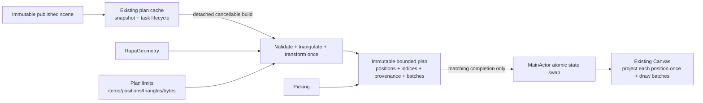
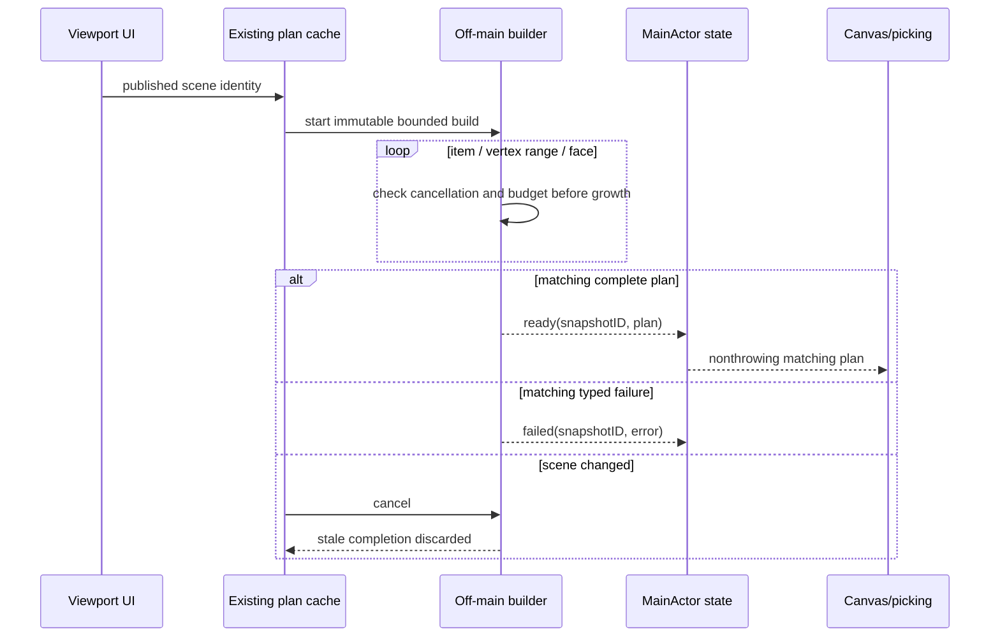

# RupaRendering

## Purpose and Scope

`RupaRendering` owns the bounded, immutable presentation data prepared from one
published `RupaViewportScene` snapshot and consumed by the existing Rupa
viewport. It is a child of the [RupaKit package design](../../DESIGN.md) and has
no child designs.

The current implementation builds and validates
`MeshSourcePresentationRenderPlan` synchronously from SwiftUI state, retains
source meshes, traverses all triangles again for validation, and lets the
Canvas construct and draw one `Path` per triangle. The target contract below
removes that duplicated work and MainActor-bound preparation without replacing
the existing Canvas renderer or creating another scene, source, or project
authority.

The viewport also owns transient documents that are never published to project
authority, such as the edge-treatment drag preview it builds from the current
selection. Because these documents have no published generation, no project
authority can supply their evaluation, and no other module owns their lifetime.
This module therefore owns the *lifetime* of one transient preview evaluation
per viewport and delegates the *evaluation itself* to the existing
`RupaCore` `EvaluationScheduler`, off `MainActor`. It does not introduce a
second evaluator, a second source authority, or an unpublished document into
project state.

## Responsibilities and Boundaries

The module owns:

- one asynchronous `MeshSourcePresentationPlanCache` lifecycle per viewport;
- cancellable, off-main construction from one immutable scene snapshot;
- checked item, transformed-position, triangle, index/provenance, batch, and
  retained-byte ceilings before allocation or growth;
- one transformed position per source vertex per occurrence, indexed triangles,
  exact picking provenance, and bounded visual-state batch metadata;
- construction-time validation, typed all-or-nothing failure, telemetry, and
  snapshot-identity matching;
- state-driven viewport invalidation only while a real transition is active;
- the cancellable lifetime of one transient, never-published preview evaluation
  per viewport, prepared off `MainActor` through the existing evaluator.

It does not select Product representations, tessellate CAD, mutate
`MeshSource`, publish project state, perform package I/O, handle Agent requests,
or own camera/UI interaction state. It reuses `RupaGeometry` triangulation and
the existing Canvas consumer; no Metal renderer, BVH, second cache, or renderer
protocol is introduced by this correction.

## Related Designs

| Design | Relationship | Contract Used | Summary | Cautions |
|---|---|---|---|---|
| [package design](../../DESIGN.md) | parent | Package dependency direction | Places rendering above immutable scene and Geometry values. | A derived plan is never source or project authority. |
| [RupaCore](../RupaCore/DESIGN.md) | depends on | `EvaluationScheduler`, `EvaluatedDocumentCache`, and typed evaluation status | Evaluates a transient preview document and returns either one reusable evaluation cache or one explicit failure status. | This module never publishes a transient document or its evaluation as project state. |
| [RupaGeometry](../RupaGeometry/DESIGN.md) | depends on | Source-bound index and bounded face triangulation | Supplies Mesh topology traversal. | Do not duplicate ID lookup or polygon algorithms. |
| [RupaViewportScene](../RupaViewportScene/DESIGN.md) | depends on | Immutable scene and snapshot identity | Supplies selected bounded presentation results and transforms. | Rendering cannot reevaluate or select LOD. |
| [RupaUI](../RupaUI/DESIGN.md) | used by | MainActor publication and Canvas consumption | Displays only a plan matching the current snapshot. | UI must not perform plan construction. |
| [Swift-CAD package](../../../swift-CAD/DESIGN.md) | depends on | Exact CAD document and evaluated value types | Supplies the CAD value types this module reads directly through its declared `SwiftCAD` dependency. | Rendering never tessellates CAD, evaluates a document, or selects kernel limits. |
| [RupaRendering tests](../../Tests/RupaRenderingTests) | verification owner | Plan, limit, cancellation, stale-result, and batching behavior | Proves the actual derived-data path. | Type/build checks are not behavior evidence. |

## Architecture

The transformed position buffer is an intentional derived presentation copy:
it removes repeated world transformation and corner-position materialization
from every Canvas pass. The immutable source buffers remain unchanged and are
not copied into another source mesh.

## Contracts and Invariants

1. A cache is `idle` before its first scene and after teardown. For an active
   scene it is exactly one of `preparing`, `ready`, or `failed` for one
   `EvaluationSnapshotID`. Only matching `ready` exposes a render/picking plan.
2. A scene change cancels the current build. Completion publishes one state
   atomically on `MainActor` only when its snapshot identity still matches;
   stale success and stale failure are discarded.
3. Plan construction happens outside `MainActor`, checks cancellation at item,
   vertex-range, and face boundaries, and returns either one complete immutable
   plan or one typed failure. No partial plan is visible.
4. Before reserving or growing storage, checked arithmetic charges cumulative
   item, transformed-position, triangle, index/provenance, batch, and retained
   byte counts. Callers may lower limits but cannot widen module hard ceilings.
5. Every source vertex used by one occurrence is world-transformed at most once
   into the plan. Triangles reference that buffer by checked indices and retain
   exact occurrence/definition/representation/source/face provenance required
   by picking.
6. Construction validates source ranges, triangulation, transforms, finite
   positions, indices, provenance, and batches once. A ready plan is consumed
   through nonthrowing bounded access; no second full validation/render
   traversal is permitted.
7. Canvas projects each retained position at most once per draw and appends
   triangles to a bounded number of paths grouped by interaction visual state.
   It does not allocate, fill, or stroke one `Path` per triangle.
8. Camera, hover, and selection never mutate the plan or source. They affect
   screen projection or bounded batch choice only; rendering and picking always
   use the same matching plan.
9. Static viewports have no periodic ticks. Projection transitions temporarily
   enable the existing schedule and stop it when transition state completes.
10. Hard ceilings and standard defaults are versioned values selected from
    measured multi-body fixtures. Changing them requires boundary, retained-byte,
    frame-work, and signed-App responsiveness evidence; values are not relaxed
    merely to admit one scene.
11. Viewport teardown cancels the owned build task, clears matching derived
    data, enters `idle`, and makes every later completion stale. No task or plan
    outlives its cache owner.
12. The transient preview evaluation is `idle` while no preview document exists.
    While one exists it is exactly one of `preparing`, `ready`, or `failed` for
    exactly one preview revision, and only a `ready` state whose revision equals
    the current preview revision may supply an evaluation to scene construction.
13. Preview evaluation runs outside `MainActor` through the existing
    `EvaluationScheduler`, reusing the published evaluation as its incremental
    base. The evaluator is synchronous and does not observe cancellation, so
    advancing the preview revision, clearing the preview, and viewport teardown
    abandon a running evaluation rather than stopping it: every completion whose
    revision no longer matches is discarded without reaching state. At most one
    preview evaluation is in flight per viewport, and a revision requested while
    one is running replaces any earlier waiting request and starts when the
    running one completes, so one drag cannot launch one kernel evaluation per
    input event.
14. Until preview evaluation is `ready`, the viewport projects the published
    document with its published evaluation. The preview document is never
    projected without its own evaluation, and a failed preview evaluation is an
    explicit `failed` state rather than an empty successful scene, a stale
    evaluation, or an on-demand evaluation on `MainActor`.

## Runtime Flows

## State, Ownership, and Lifecycle

The existing cache owns the current snapshot identity, one build task, and its
`idle`/`preparing`/`ready`/`failed` state. The build owns only invocation-local
triangulation/index scratch. A ready plan owns its bounded transformed positions,
triangle indices, provenance, and batch metadata; it need not retain duplicate
source meshes after construction. SwiftUI owns camera and interaction state.

No Geometry borrow, lock, or source pointer crosses a task boundary or is held
while calling Canvas, picking, an external callback, or I/O.

## Failure, Concurrency, and Constraints

Invalid scene identity/source, invalid range/reference, nonrenderable face,
nonfinite transform, integer overflow, budget exhaustion, and cancellation are
typed failures. They are never converted to an empty scene, a stale plan, a
coarser mesh, or a legacy rendering path.

A failed preview evaluation is recorded as an explicit `failed` state and is
kept out of rendering: the viewport keeps projecting the published document and
its published evaluation. No production consumer presents that message today, so
on screen a preview that cannot evaluate is currently indistinguishable from one
that is still preparing. Presenting it is a UI responsibility this module does
not own and has not been given; the state exists so that failure is never
converted into an empty successful scene.

Only cache-state publication and SwiftUI/Canvas calls are MainActor-isolated.
Plan construction and validation are not. Screen projection and Canvas context
work remain MainActor-bound but are capped by the admitted plan and operate per
retained vertex/batch rather than per triangle corner/draw call.

### Performance acceptance

`frameInterval` is derived from the lowest refresh rate supported by the App's
release device matrix. `minimumMemory` is the physical memory of its
lowest-memory supported device. The product records those inputs, OS/build,
app commit, fixture source digest, policy version, and measured values with the
acceptance evidence.

| Measure | Reject when |
|---|---|
| MainActor state publication | One uninterrupted publication occupies more than one half `frameInterval`. |
| Canvas consumption | One admitted static-scene draw exceeds one `frameInterval` in any of ten consecutive post-warm-up runs. |
| Plan readiness | One unchanged admitted scene takes more than two seconds to reach matching `ready` in any of ten consecutive post-warm-up runs. |
| Cancellation | Snapshot replacement or teardown takes more than six `frameInterval` values to stop observable build progress and make completion stale. |
| Plan retained bytes | Ready-plan retained bytes exceed 2.5% of `minimumMemory`. |
| Plan working bytes | Peak builder scratch plus in-flight plan bytes exceed 2.5% of `minimumMemory`. |

Both `MainActor` intervals in the table are emitted as signposts from the
production path so the signed application reports the same measures without a
behavioural change. `ViewportResponsivenessSignposts` owns the identities.

| Interval | Signpost | Covers |
|---|---|---|
| MainActor state publication | `RupaRendering` / `Responsiveness` / `PresentationPlanPublication` | The plan publication the view body performs before the Canvas is created. |
| Canvas consumption | `RupaRendering` / `Responsiveness` / `ViewportCanvasConsumption` | One full Canvas renderer invocation, of which the presentation draw is a part. |

The offline harness measures only the presentation portion of a Canvas pass, so
its Canvas figure is a lower bound of the signposted interval: a harness
rejection stays valid for the application, a harness acceptance does not.

The standard presentation fidelity is the finest deterministic profile that
passes every row for the fixed multi-body fixture suite. Count/byte defaults
are the smallest versioned ceilings that admit the measured successful maxima
plus 25% checked headroom while still satisfying the memory rows. A limit
change repeats the same selection; a scene that cannot fit fails explicitly
instead of weakening the policy.

## Verification and Change Impact

| Invariant | Required evidence |
|---|---|
| Bounded construction | Boundary-plus-one and checked-overflow tests reject before growth for every declared count and retained bytes. |
| Cancellation and identity | Item/vertex/face cancellation plus rapid snapshot replacement proves stale success/failure never reaches rendering or picking. |
| Teardown | Viewport/cache destruction cancels preparation, releases the plan, returns to `idle`, and rejects a late completion. |
| Single preparation pass | Instrumentation proves one triangulation/transform/validation pass, no duplicate full traversal, and one transformed value per retained occurrence vertex. |
| Batched consumption | Canvas instrumentation proves bounded path/fill/stroke calls by visual-state batch rather than triangle count. |
| MainActor progress | Signposts reject publication/Canvas intervals above the performance table while a progress probe advances during preparation. |
| Transient preview ownership | Preparing a preview evaluation performs zero evaluations on `MainActor`, and the scene builder receives a matching supplied evaluation for every preview revision it projects. |
| Preview staleness and coalescing | Advancing the revision or clearing the preview discards the earlier completion; a late completion never replaces current state, and repeated requests during one drag leave at most one evaluation in flight and start only the newest waiting revision. |
| Preview failure is explicit | A preview document that fails to evaluate reaches the `failed` state, and the viewport keeps projecting the published document instead of an empty successful scene. |
| Memory and application behavior | Telemetry reports retained plan bytes, and the actual signed App multi-body run remains interactive with visible geometry and bounded memory. |

Changes to Geometry triangulation, scene identity, Canvas interaction state, or
plan limits require rechecking the owning child design and the signed-App gate.
