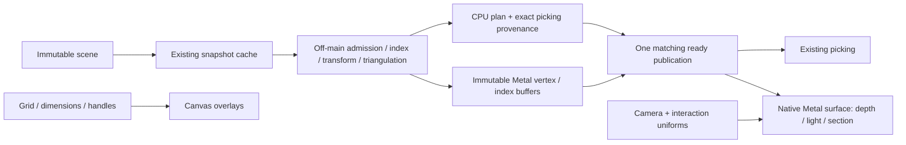

# RupaRendering

## Purpose and Scope

RupaRendering prepares bounded presentation data from an immutable viewport
snapshot and displays it without changing CAD, MeshSource, or project authority.
Parent: [RupaKit](../../DESIGN.md). Children: none. The Metal surface renderer
and native view are Apple-platform adapters within this existing module.

## Responsibilities and Boundaries

The existing snapshot cache owns off-main preparation, cancellation, and atomic
publication of the CPU picking plan with its immutable GPU resources. The plan
owns indexed, once-transformed geometry and exact picking provenance. The native
surface adapter owns depth-tested, lit surface drawing. Canvas owns grids,
curves, dimensions, and interaction overlays. SwiftUI owns camera and selection.

The viewport also owns the lifetime of transient preview evaluations, delegating
evaluation itself to RupaCore's existing EvaluationScheduler. Neither preview
nor presentation code publishes project state, chooses representations or
fidelity, tessellates CAD, handles Agent requests, or performs package I/O.

## Related Designs

| Design | Relationship | Contract Used | Summary | Cautions |
|---|---|---|---|---|
| [RupaKit](../../DESIGN.md) | parent | Dependency direction | Composes immutable presentation above source/evaluation. | No reverse dependency on UI. |
| [RupaGeometry](../RupaGeometry/DESIGN.md) | depends on | Source-bound index and bounded triangulation | Supplies validated geometry traversal. | Reuse its ID lookup and polygon algorithms. |
| [RupaViewportScene](../RupaViewportScene/DESIGN.md) | depends on | Immutable scene, snapshot identity, projection | Supplies representation/transform and camera conventions. | Larger projected depth is nearer. |
| [RupaCore](../RupaCore/DESIGN.md) | depends on | EvaluationScheduler and evaluated cache | Evaluates transient preview documents off MainActor. | A preview never becomes project authority. |
| [Swift-CAD](../../../swift-CAD/DESIGN.md) | depends on | Exact CAD value types and cancellation | Supplies existing legacy scene and preview types. | Rendering does not own kernel policy. |
| [RupaUI](../RupaUI/DESIGN.md) | used by | Matching ready state and visible failure | Composes the viewport. | No geometry preparation in body. |
| [Rupa App](../../../Rupa/Rupa/Rupa/DESIGN.md) | used by | Integrated responsiveness | Owns signed-App and device-matrix evidence. | Development hardware is not the minimum-device release gate. |
| [Responsiveness baseline](../RupaResponsivenessBaseline/DESIGN.md) | used by | Production plan and surface encoder | Measures the implementation used by the viewport. | Offscreen execution does not prove live Canvas or event-loop latency. |
| [Rendering tests](../../Tests/RupaRenderingTests) | verification owner | Admission, lifecycle, projection, GPU pixels | Rejects invalid preparation and rendering. | Metal behavior requires xcodebuild test on Apple hardware. |

## Architecture



Surface drawing replaces the merged triangle-path pass measured at 35.279 ms.
It does not reuse the identity-picking compute renderer: that adapter has
different geometry and synchronous readback semantics. The surface renderer is
one concrete native adapter shared by the viewport and offscreen verification,
not a new renderer protocol or scene graph.

## Contracts and Invariants

1. The cache is idle, preparing, ready, or failed for one snapshot. Only matching
   ready state exposes geometry to rendering and picking. Failure is explicit;
   no empty, stale, coarser, or alternate-renderer success is substituted.
2. Preparation runs off MainActor. Replacement and teardown cancel its actual
   task. Completion requires a matching request identity as well as snapshot
   identity, including clear/restart with the same snapshot.
3. Checked count and byte admission precedes reserve, allocation, and growth.
   It includes retained source-ID backing, positions, triangle indices/face
   provenance, triangulation-index scratch, and immutable GPU geometry.
   Caller limits can only narrow module ceilings. Cancellation is checked
   before work and at bounded item, vertex, face, and buffer-fill intervals.
4. Each occurrence vertex is world-transformed once. Triangles use checked
   indices and preserve occurrence, definition, representation, source, face,
   and vertex identities. Construction validates before publication; rendering
   does not repeat validation or triangulation.
5. GPU geometry is one explicit conversion relative to a Double-precision
   local origin. World-space CPU positions remain the picking authority.
   Conversion rejects nonfinite/unrepresentable values instead of distorting
   geometry. Camera changes only update bounded uniforms.
6. Surface rendering submits at most one indexed draw per admitted occurrence.
   Projection, two-sided directional lighting, and depth testing run on the GPU.
   Larger ViewportLayout.projectedDepth is nearer, matching CPU picking.
   Selection changes surface color, not visibility order. Internal tessellation
   edges are not painted as a wireframe; shape edges remain readable through
   lighting and silhouette contrast.
   Equal-depth fragments keep the first occurrence in source order, matching
   the CPU picker's strict nearer-than comparison.
7. Section clipping uses the same plane, retained side, and tolerance as CPU
   picking. Clipping does not change the plan or source geometry.
8. The native view submits at most one command buffer at a time. Further draws
   coalesce to the latest camera and interaction state. No synchronous GPU
   wait, readback, semaphore, or shutdown runs on MainActor.
9. GPU frame attachments have checked pixel/byte ceilings separate from the
   geometry budget and are included in App pipeline-memory measurements.
   Renderer allocation, shader, encoding, and completion failures remain visible.
   Preparation failures belong to the snapshot cache. Drawable-size, encoding,
   and completion failures belong to the viewport's renderer-matched frame state;
   they retain the immutable ready renderer and retry on a later view update.
   Matching successful GPU completion clears the frame error. Picking is disabled
   while that renderer's frame is unavailable, without changing project authority.
10. Plan preparation retains one worker and the latest pending request. A
    replacement cancels the worker and starts only after it exits; old and new
    builders cannot overlap allocations. Static viewports do not tick periodically. Only active transitions or actual
    invalidation request another frame.
    Transient Canvas body ghosts are restricted to the edge-treatment request's
    explicit scene-node target or entries in the viewport's edited-body state;
    an active preview never sends untouched published bodies back through the
    per-triangle Canvas path. Ghosts do not acquire published picking authority.
11. Preview evaluation runs off MainActor through EvaluationScheduler with the
    published evaluation as an incremental base. The cache owns and cancels
    the actual worker, retains at most the newest pending revision, and starts
    it after the previous worker exits a cooperative checkpoint. Teardown also
    cancels. Matching request identity rejects stale success and failure.
12. A ready preview supplies its own matching evaluation to scene construction.
    While preparing or failed, the published document remains visible. Matching
    failure is displayed explicitly; a preview is never published as project state.

## Runtime Flows

```text
snapshot change -> cancel old task -> prepare CPU plan and GPU buffers
  -> matching completion -> publish ready -> encode surface + Canvas overlays
  -> invalid input/resource/GPU failure -> visible failed state
camera/hover change -> small uniforms -> one coalesced GPU frame
preview revision -> cancel worker -> newest pending -> matching preview result
teardown -> cancel tasks, detach view, release ready state
```

## State, Ownership, and Lifecycle

The snapshot cache retains one current CPU/GPU result. A build owns temporary
index and face scratch. Metal owns buffer allocation and exactly-once release.
Initialization binds only the admitted byte range, fills every element, and
does not retain an unsafe pointer. Buffers are immutable after initialization;
the command buffer retains them until GPU access ends. No source borrow crosses
a task boundary.

The SDK's mutable MTLBuffer handles are confined to a private immutable owner
with `@unchecked Sendable` confined to that immutable native boundary. Only its initial
CPU fill writes memory; subsequent command encoders bind it read-only. No
handle or writable pointer is publicly exposed. Concurrent offscreen draws
verify that sharing the owner does not mutate geometry or couple frame state.

Immutable shader/pipeline state may be shared by the native adapter; it has no
project state. The native view serializes drawable/depth resources and pending
redraw state on MainActor. Completion returns to that owner without keeping a
detached viewport alive. Preview workers hold immutable requests, not the cache.

## Failure, Concurrency, and Constraints

Invalid identities/ranges/transforms, integer overflow, resource exhaustion,
cancellation, and GPU failure never publish a partial result. Cancellation is
not displayed as successful empty geometry or a preview failure. The existing
source and project publication survive presentation failure.

### Performance acceptance

The product pins the minimum supported refresh rate and memory, OS/build,
source commits, policy version, and fixture digest with each measurement.
The current 60-Hz / 8-GiB reference gives 16.667 ms per frame and 204.8 MiB
per 2.5%-memory budget.

| Measure | Reject when |
|---|---|
| MainActor publication | One uninterrupted publication exceeds half a frame. |
| Surface and Canvas consumption | Any of ten post-warm-up draws exceeds one frame. |
| Plan readiness | Any of ten unchanged-scene preparations exceeds two seconds. |
| Cancellation | Replacement/teardown takes over six frames to stop observable progress and reject stale completion. |
| Retained geometry | CPU plan plus immutable GPU geometry exceeds 2.5% of minimum memory. |
| Working geometry | Peak builder scratch plus in-flight CPU/GPU geometry exceeds the same budget. |

Count/byte defaults use measured successful fixture maxima plus 25% checked
headroom, still subject to the memory ceilings. They are not multiplied from a
failed fixture to admit arbitrarily larger scenes. A policy change requires
boundary tests, measured frame/memory behavior, and signed-App verification.

Calibration on Mac16,6 / macOS 27.0 (26A5388g), Swift 6.4 2026-08-14,
Release, ten post-warmup samples on 2026-09-05:

| Fixture | CPU encoding maximum | Encode-to-GPU-completion maximum | Charged working bytes |
|---|---:|---:|---:|
| 12 bodies / 6,284 segments | 0.092 ms | 5.698 ms | 17,978,528 |
| 512 bodies / 16 segments | 0.461 ms | 2.218 ms | 2,081,664 |

The resulting ceilings are 640 items, 188,550 positions, 377,040 triangles,
and 22,473,160 bytes. These measured scopes exclude live overlays and input;
they do not complete the signed-App acceptance gate.

The benchmark uses the production surface encoder and waits for actual GPU
completion off the UI path. It reports measurement scope explicitly: offscreen
success does not establish full live-Canvas, Observation, or input responsiveness.
Unmeasured rows remain notMeasured. Production signposts bracket publication,
Canvas overlays, and surface command encoding; GPU completion supplies execution
timing. An in-flight cancellation probe measures actual stop, not preparation
duration or a state reset.

## Verification and Change Impact

| Invariant | Behavioral evidence |
|---|---|
| Pre-growth admission | Count/byte boundary-plus-one, overflow, oversized repeated occurrences, and scratch/index cancellation tests. |
| Immutable indexed geometry | CPU triangle/provenance parity, local-origin projection, and zero geometry rebuild on camera changes. |
| Lifecycle | Replacement, same-snapshot restart, teardown, in-flight cancellation, and stale success/failure tests. |
| Depth and visibility | GPU pixels for overlapping front/rear surfaces, order reversal, and matching CPU pick. |
| Readable surfaces | GPU pixels distinguish adjacent face orientations and silhouette; selection preserves depth. |
| Section | GPU retained/discarded pixels agree with the existing CPU clipping rule. |
| Preview | Actual worker cancellation, bounded pending work, matching supplied evaluation, visible failure, and published-state preservation. |
| Responsiveness | Ten-run production encoder measurements, precise memory accounting, and signed-App input/visual checks. |

Changes to Geometry indexing, projection, section clipping, snapshot identity,
limits, GPU resource lifetime, or preview cancellation recheck their owning
contracts and the affected upper App path. Metal tests execute with xcodebuild;
pure geometry/lifecycle tests use focused SwiftPM tests where no GPU is involved.
