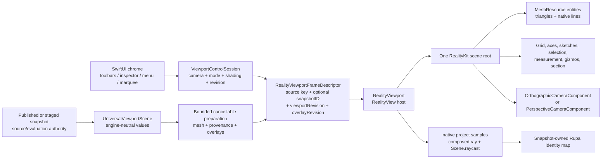

# RupaRendering

## Purpose and Scope

`RupaRendering` owns the bounded, postpublication presentation contract for one
immutable viewport snapshot. Production is currently a migration hybrid:
`RealityViewportView` supplies the RealityKit surface and native camera, while
SwiftUI `Canvas` still supplies the grid and world overlays and the legacy
identity renderer still supplies part of picking. RK-3 through RK-5 and RK-IV
remove those remaining routes. The target uses RealityKit on macOS 27 or later,
with `RealityView` as the live host and `RealityRenderer` limited to offscreen
GPU verification. A mounted native surface or capability probe alone does not
constitute the complete production backend cutover. The module's
CAD and Mesh inputs remain engine-neutral values from
[`RupaViewportScene`](../RupaViewportScene/DESIGN.md); RealityKit objects are
never source authority.

`RupaRendering` has one target child component,
[`ViewportMeasurement`](ViewportMeasurement/DESIGN.md), and the new
[`RealityViewport`](RealityViewport/DESIGN.md) component owns native scene
resources, entities, camera application, materials, and native input queries.
This target design replaces the remaining split native-surface,
spatial-Canvas, and legacy-identity composition after the migration gates.
Until then, spatial SwiftUI `Canvas` and identity GPU readback remain active
production routes beside the RealityKit surface, not a completed cutover.

## Responsibilities and Boundaries

The module owns:

- admission and cancellation of one bounded derived presentation request;
- the engine-neutral frame descriptor joining `snapshotID`, viewport revision,
  overlay revision, camera state, and spatial presentation descriptors;
- the document-lifetime `ViewportControlSession` camera, display-mode, shading,
  and revision authority;
- RealityKit resource/entity preparation and one coherent scene-root swap;
- native camera projection, mounted-camera ray composition, native collision,
  and triangle-hit resolution through the RealityViewport child contract;
- exact CAD/Mesh provenance mapping from native hits back to stable Rupa IDs.

It does not own CAD source, Mesh source, evaluation policy, project
publication, history, persistence, Agent/MCP routing, or source mutation.
`RupaUI` owns only SwiftUI composition and non-spatial chrome. It must not
build geometry, create a second camera, or retain a second presentation scene.

## Related Designs

| Design | Relationship | Contract Used | Summary | Cautions |
|---|---|---|---|---|
| [RupaKit package](../../DESIGN.md) | parent | Package dependency and authority direction | Places derived RealityKit presentation above source/evaluation. | RealityKit IDs never become Product/CAD IDs. |
| [RupaViewportScene](../RupaViewportScene/DESIGN.md) | depends on | `UniversalViewportScene`, `snapshotID`, world transforms, bounds, and provenance | Supplies immutable engine-neutral scene values. | Rendering cannot re-evaluate or retessellate source. |
| [RupaCore](../RupaCore/DESIGN.md) | depends on | Validated source/evaluation and stable identity contracts | Supplies source-derived material and navigation metadata. | Presentation material resolution never mutates the document. |
| [RealityViewport](RealityViewport/DESIGN.md) | child | Native scene/resource/camera/material/input adapter | Owns RealityKit objects and the matching scene-root lifecycle. | No custom render pipeline or spatial Canvas fallback. |
| [ViewportMeasurement](ViewportMeasurement/DESIGN.md) | child | Transient world endpoints, distance, ruler descriptors | Produces non-authoritative spatial measurement values. | It does not own RealityKit entity lifetime. |
| [RupaResponsivenessBaseline](../RupaResponsivenessBaseline/DESIGN.md) | coordinates with | Versioned fixture and pinned MainActor/memory acceptance policy | Owns the threshold and environment against which native preparation is measured. | A new native interval must be measured in the signed App; an offscreen duration does not satisfy this contract. |
| [RupaUI](../RupaUI/DESIGN.md) | used by | Matching frame state, tool intents, and visible errors | Composes `RealityView` and non-spatial SwiftUI chrome. | UI never becomes a geometry or camera authority. |
| [RupaAgentProtocol](../RupaAgentProtocol/DESIGN.md) | used by | Foundation-value viewport operation/state contract | Routes camera/display operations to the mounted session. | Applied state is not proof of a displayed frame. |
| [Rendering tests](../../Tests/RupaRenderingTests) | verification owner | CPU admission and target RealityKit GPU behavior | Verifies the target lifecycle, native camera/material/input, provenance, and frame coherence. | Capability tests do not prove current-production or CAD integration; CPU tests do not prove live RealityView behavior. |

## Architecture



The shared seam is an immutable `RealityViewportFrameDescriptor` value. The
public `Viewport` initializer requires one real `ViewportSourceIdentity`: a
document ID plus `DocumentGeneration`, or an existing presentation
`EvaluationSnapshotID`. `Viewport` combines it with an active drag-preview
revision and the existing scene-key inputs to form its internal
`ViewportSceneSnapshotKey`; the preparation identity also contains an explicit
producer-owned `overlayRevision`. It never synthesizes a project or evaluation
identity for an empty or sketch-only scene. The mounted frame also
contains the `ViewportControlSession` revision and camera snapshot plus bounded
engine-neutral spatial descriptors. It contains
no `Entity`, `MeshResource`, `RealityViewCameraContent`, `MTLBuffer`, or
`MTLRenderCommandEncoder`; native objects are created and owned only inside
`RealityViewport`. A frame is publishable only when all identity fields still
match the request that produced its resources.

The overlay revision advances whenever an input not already represented by
`ViewportSceneSnapshotKey` can change a world or camera-relative descriptor,
including selection, hover, active preview/affordance, snap, reference, and
measurement state. It does not advance for a camera-only change. The producer
passes only raw checked-`Sendable` immutable source and interaction captures to
the cache worker;
`ViewportScene` and its transitive value members acquire checked `Sendable`
conformance rather than crossing the boundary through unchecked isolation.
Main-actor capture does not call
`ViewportPatternArrayPreviewService.previews`, surface-analysis overlay build,
section-analysis overlay build, hatch conversion, or their output sorting and
array traversal. The existing producer worker invokes those pure builders once
for a changed source/overlay identity before it emits the complete batch; it
does not add another authority, cache, or worker lane.
The original pure builder algorithms are shared with a nonescaping `rethrows`
checkpoint `(items, positions, visits)`. Legacy nonthrowing wrappers supply an
explicit no-op checkpoint; the native worker supplies cooperative cancellation
and checked local admission. Output items/positions are charged only after the
existing selection predicate admits their source; raw traversal visits are
charged separately against the existing position/work ceiling. Checkpoints run
before owned allocation, append, and hierarchy/analysis/hatch visits. A stopped
worker propagates `CancellationError`, never partial or empty success. Native
section preparation admits the complete source and all derived hatches rather
than using the legacy UI's visible-prefix limits.
The revision does not repeat within one mounted viewport lifetime; exhaustion
is an explicit failure rather than wraparound to a possibly retained identity.

`ViewportSpatialOverlayChangeKey` is the internal `Equatable` invalidation seam
owned by the semantic producer. It is made synchronously from immutable values
already held by `Viewport`; constructing it never calls a scene builder,
analysis builder, pattern service, geometry sampler, projection helper, or
native API. It compares exact values rather than a collision-prone digest. The
key contains only inputs whose change can alter the producer output:

| Key group | Exact inputs |
|---|---|
| Interaction | `SelectionModel`, selection-drag preview targets, Mesh selection overlay, edited-body state, and resolved active/hovered/pending interaction and creation-drag values |
| Derived presentation | Pattern replacement request, surface analysis plus its display options, surface continuity, section analysis, snap result and exact snap options, placement highlight, and measurement state plus its active/automatic flags and explicit construction plane |
| Policy | Display unit, creation-drag axis constraint, descriptor-affecting affordance visibility and numeric parameters, and a bounded set of booleans recording whether each descriptor-producing interaction route is available; closures themselves are neither retained nor compared |

Document, evaluation, scene, workspace-overlay, section-clipping, object-definition,
and drag-preview-document topology remain represented by
`ViewportSceneSnapshotKey`; the change key does not duplicate or sample them.
Camera transform/projection, control basis, viewport size, grid frame, and chrome
exclusions are also absent because their bounded updates are owned by the native
camera frame. This exclusion is valid only when every non-grid plane preview
already carries an explicit `SketchPlane` and resolved world values. A creation
drag must therefore resolve its screen points and plane at input time before it
enters the semantic key/snapshot; a producer may not read the current control
basis later or add basis to the key as a substitute. The grid frame also supplies
the current visible-cell scale to the fixed-capacity native placement preview
when its explicit policy requests `.visibleCell`; this does not recapture the
source snapshot or advance the overlay revision. That preview is exactly one
optional `RealityViewportSpatialBatch.GridPlacement`: its resolved world center,
finite orthonormal plane axes, annotation presentation, and optional explicit
width and height, where a `nil` axis alone requests the current native grid
frame's `minorStepMeters`. Preparation admits and creates one native unit
rectangle with four vertices and eight line indices. After all grid-frame and
aggregate-admission checks succeed, the native owner atomically publishes the
grid and updates only that entity's translation, orientation, and per-axis
scale; it neither rewrites topology nor starts preparation work. Invalid or
over-budget input preserves the preceding complete grid-plus-placement frame.
Fully explicit rectangles, workspace-default rectangles, and non-rectangle
placement previews remain immutable producer-owned world meshes.

One `@MainActor`, non-`Observable` revision holder is retained by `Viewport`
through `@State`. It owns only the last exact change key and one monotonic
`UInt64`. `revision(for:)` returns the current value for an equal key and advances
once before cache lookup for a changed key; returning to an earlier key still
gets a new revision. Overflow is a typed failure, never wraparound. This
synchronous comparison makes the new preparation identity visible in the same
body evaluation. The exact-ready `surface(for:)` and handle-table queries cannot
grant the previous overlay identity CAD authority while the new task is waiting.
A separate display-only cache query may retain the preceding complete surface
only when the scene key and optional real snapshot ID are unchanged and only
the overlay revision differs. Render origin is derived from those admitted
source/layout inputs rather than being a second cache-authority coordinate;
warm synchronous native reuse still requires the mounted and requested origins
to be equal. The `.task(id:)` that captures the immutable raw
producer input and starts its semantic build is attached inside the geometry
scope and runs only for a changed source or overlay identity. Pan, orbit, zoom,
projection transition,
resize, grid-step, and chrome-only body updates neither capture that snapshot
nor invoke its worker. No new protocol, observable owner, generic cache, or
second preparation lane is introduced.

The held `ViewportActiveInteractionDrags` value supplies exact active target and
semantic-value equality; it is not reconstructed by camera updates. Hover and
pending targets compare their spatial identities. Screen-only marquee points
are excluded; entering or leaving a drag can still hide the automatic ruler.
Capture failures call the existing preparation cache's `reject` entry point,
which cancels its worker and pending request and publishes the typed failure for
that identity. A same-scene/snapshot overlay failure may retain the previous
complete display without CAD authority; any source/snapshot mismatch withdraws
it. A late worker cannot overwrite either result.

The public initializer has no generation-less mutable-document mode. The main
workspace passes its document ID and `DocumentGeneration`; the modeling-preview
caller passes its payload's real presentation `EvaluationSnapshotID`. Direct
callers must likewise provide the identity owned by their source lifecycle, so
omitting that coordinate is unrepresentable at compile time. Equal identity is
a caller guarantee of equal source/path topology; repository production callers
meet it through the document store generation or immutable preview snapshot.
Preparation rejects a document-ID mismatch and a presentation identity that
does not equal the supplied scene's snapshot/project identity before selecting
a published native frame. Cancelled view tasks cannot capture, prepare, or reject
a replacement frame. The native grid's resolved readout supplies the HUD and
snap-step notification; SwiftUI does not build a second projected grid.
The complete viewport, including semantic overlays, is an explicit accessibility
container. Hiding native rendering internals does not hide the canvas or its
nonspatial controls from assistive technology.
The viewport root consumes the full rectangle allocated by its parent in both
axes before overlays are composed. Empty, preparing, ready, and failed states
therefore give native content, input, chrome, and accessibility the same nonzero
rectangle. `RenderInvalidation` remains part of the scene/preparation identity;
it does not recreate the SwiftUI native-host and control subtree through `.id`.
`ViewportWorkspaceRenderState.revision` remains workspace-view state and is not
reinterpreted as document source identity. This removes the snapshot cache's
legacy `nil`/uncached-rebuild path from native preparation without fabricating a
generation, evaluation ID, content hash, or request token.
The former optional `documentGeneration` initializer input and stored property
are removed. When the source case is `.document`, `ViewportControlContextKey`,
`ViewportSceneSnapshotKey`, and `ViewportSceneBuilder` all derive the same
generation from `ViewportSourceIdentity`; a second generation coordinate cannot
disagree with the preparation identity. The main `RupaUI` caller therefore
passes only `.document(id:generation:)`, while the preview caller passes only
`.presentation(_:)`.

RealityKit owns the presentation operations it already provides:

| Viewport need | RealityKit owner |
|---|---|
| Solid surface | `MeshResource` + native lit material (`PhysicallyBasedMaterial` or equivalent built-in material) |
| Flat surface | `MeshResource` + `UnlitMaterial` |
| Ortho camera | `OrthographicCameraComponent` |
| Perspective camera | `PerspectiveCameraComponent` |
| Spatial lines and triangles | `LowLevelMesh`/`MeshResource` native topology and `ModelComponent` |
| Repeated geometry | shared `MeshResource` entities; `MeshInstancesComponent` only after provenance is verified |
| Point projection and view ray | `RealityViewport` mounted-camera query contract: `RealityViewCameraContent.project(_:)` samples plus camera-local composed ray |
| Object/face hit | collision group/filter and bounded `Scene.raycast`, resolving `triangleHit.faceIndex` |
| Text labels | native `MeshResource` text extrusion and `BillboardComponent` |
| Sketch/path extrusion | native `MeshResource(extruding:extrusionOptions:)` |
| Section-plane clipping | `ClippingComponent` on a dedicated scene-hierarchy root |

`CustomMaterial` is allowed only for a RealityKit presentation feature that
the built-in material contract cannot express, such as MatCap or signed normal
color. It remains a RealityKit material and is validated
as a bounded resource. A custom Metal render pipeline, direct command encoder,
drawable management, synchronous GPU readback, Canvas raster texture, or
independent tessellator is never an alternative implementation.

## Contracts and Invariants

### Source, frame, and provenance

1. Required `ViewportSourceIdentity` plus any active drag-preview revision and
   the existing scene-key inputs form the source/path-topology identity;
   `UniversalViewportScene.snapshotID` additionally identifies a real optional
   presentation scene. A frame also carries one mounted viewport revision and
   one overlay revision. Scene resources, spatial overlays, camera, render
   state, and hit-test map are all derived from that exact tuple. A missing
   presentation scene means no surface resources, not a synthetic snapshot.
   Document-generation and real presentation-snapshot sources are accepted; no
   generation-less document, duplicate generation input, or workspace-revision
   fallback is accepted.
2. An exact-ready RealityKit scene and its hit-test scene are the same root and
   same frame. During same-source/snapshot overlay-only preparation or failure,
   the preceding complete root may remain visible and camera-navigable, but it
   cannot resolve CAD hits, handles, drags, selection mutations, or provenance
   for the requested identity. A source/snapshot change, teardown, or
   mismatched request exposes neither the prior display nor its authority.
3. Entity names, hierarchy, UUIDs, `MeshResource` identity, and collision
   shape identity are implementation details. Stable occurrence, definition,
   representation, source, face, edge, vertex, sketch, and handle IDs remain
   in the snapshot-owned provenance map.
   Every interactive spatial descriptor produced in RK-3 carries a checked
   frame-local `UInt32` index into an immutable checked-`Sendable` table of the
   existing stable CAD handle identities. All native entities that form one
   handle retain that same index; a noninteractive descriptor has no handle
   index. The `RealityViewport` child validates the index, groups interactive
   world geometry no more coarsely than attachment plus index, and returns the
   index without interpreting the table entry. The host resolves it only while
   the complete frame tuple and its table still match. The index and native
   Entity are lookup coordinates, never CAD identity or authority. The
   parent value is a named `(spatialBatch, interactionRecords)` result. Each
   internal `ViewportSpatialInteractionRecord` stores one normalized identity
   and one case of the checked-`Sendable`, camera-independent
   `ViewportSpatialPreparedInteractionTarget` emitted by the same worker pass.
   The prepared semantic value is the drag baseline: it contains
   the source references, plane/model transform, semantic mode, initial value,
   and immutable world geometry required by the existing press/drag transition.
   A body-affordance record also retains the exact projection-free edit
   baseline resolved by that pass. Its internal payload is the affordance
   target, a COW array of internal `AffordanceBodyMember` values containing
   occurrence ID, feature ID, optional scene-node ID, model transform, and the existing
   `ViewportObjectEditState`, plus an optional group edit. A single-body handle
   has exactly one member and no group edit; a group handle has at least two
   members and an explicit group edit. Members are never collapsed into a
   feature-ID-keyed dictionary, because separate occurrences may reference the
   same feature. Retained member capacity and values are charged
   conservatively by the existing semantic-payload admission. Press-time
   materialization consumes this prepared baseline; it may
   not rebuild `baseEdits` or `baseGroupEdit` by traversing the current scene
   or selection. The existing `.affordance` input path initializes only body
   edits, so sketch-transform presentation is not a body-affordance record:
   its fragments remain nonauthoritative unless RK-4.2.3 supplies a dedicated
   sketch mutation baseline and lifecycle instead of a placeholder body edit.
   That baseline owns the selected occurrence's scene-node address, original
   local transform, and the projection-free parent/world conversion needed to
   apply the gizmo delta. Commit uses the existing scene-node transform command
   through the workspace callback, preserving its validation, save, and Undo
   authority; it neither rewrites sketch entities nor routes a sketch
   occurrence through the body-move command.
   Until that implementation lands, the callable branch carries
   `FIXME(INCOMPLETE_IMPLEMENTATION)` and cannot be treated as a completed
   interactive route.
   Verified projection-free existing semantic values are reused directly,
   including raw sketch/control/surface fields and the
   `ViewportPatternAffordanceSource` handle structs. Legacy handle targets or
   geometry values that contain `ViewportLayout`, projected points/vectors,
   points-per-meter, hit rectangles, or layout-derived minimum/base lengths are
   not record payloads; directed routes retain their raw world anchor,
   direction, and semantic value instead. It is not a
   `ViewportInteractionTarget` or `ViewportActiveInteractionDragState`; the
   MainActor input owner materializes a closed
   `ViewportSpatialMaterializedInteractionTarget` in RK-4.2.3 from the exact
   record and matching mounted RealityKit projection, then creates the existing
   target/drag state only where its payload is projection-owner-free.
   Materialization is one exhaustive route switch
   over the prepared value and may not invoke `ViewportLayout`, the legacy
   projected candidate selectors, or source traversal. A missing/degenerate
   native projection is typed frame unavailability, never placeholder geometry
   or legacy fallback. A legacy target/geometry that stores `ViewportLayout`
   is not reconstructed. Its materialized case instead stores only the finite
   projected points, vectors, and semantic scalars consumed by the input math,
   and the drag path consumes that case directly. Radial-angle and angular
   copy-count input store the native-projected center plus radial and tangent
   vectors with their base angle/count and policy minimum/step. Angular-density
   input stores the native-projected anchor and tangent direction, base count,
   and points-per-copy value derived from the existing policy. These cases do
   not store arc/guide visuals, a projection closure, or an approximation of
   `ViewportLayout`; native spatial resources already own their visuals. No
   closure, mutable coordinator, native Entity, Viewport, camera, or layout
   owner crosses this table boundary.
   The input owner resolves an ordered native handle result in two distinct
   steps: hover retains only the matching prepared-record identity, while a
   press materializes the first authoritative record and retains that closed
   value together with its record until click, drag finish, or cancellation.
   Failure to materialize the first native candidate is typed frame
   unavailability; it does not skip to a lower-priority candidate or invoke a
   legacy selector. A ready empty native result is a genuine handle miss and
   may continue only into the existing non-handle canvas/object input decision.
   A continued point/plane decision obtains its ray or world point from the
   same revision-checked `RealityViewport` camera-projection owner. A
   surface-free ready frame uses that owner's admitted camera projection sample
   depth; it does not fabricate geometry bounds, call `ViewportLayout`
   unprojection, or rely on the platform inverse-projection APIs that the
   mounted macOS 27 runtime contract excludes.
   Drag updates consume the retained materialized value and occurrence/group
   baseline; they do not recapture the scene, resolve current hover, or rebuild
   members in a feature-ID-keyed dictionary. Existing input calculations may
   be extracted to accept materialized projected scalars, but pending state
   cannot retain a legacy geometry value that stores `ViewportLayout`.
   A two-point screen chord obtained by projecting a world-axis origin and a
   one-meter probe is not an affine world-distance metric in perspective and
   may cross the eye or reverse for a visible small handle. Production axis
   drag therefore retains the semantic world axis and resolves its world delta
   through the same mounted, revision-checked camera-query owner; the chord is
   only a bounded presentation/input sample and cannot authorize the CAD
   distance by itself.
   The closed
   `ViewportSpatialHandleIdentity: Equatable, Sendable` enum contains only
   stable source/selection addresses and semantic handle roles; it contains no
   screen point, derived geometry, native object, name, or UUID. Record
   registration and fragment lookup additionally use the stable scene
   occurrence address from the same semantic pass. Scene-derived records with
   the same feature/handle identity but different `SceneNodeID` values receive
   different indexes and retain their occurrence-specific transform and drag
   baseline; selection matching must resolve the occurrence before matching the
   feature/component. A missing occurrence address is valid only for a source
   that the prepared scene proves is genuinely uninstanced, or for one
   explicitly represented selection-group handle whose payload contains the
   complete stable member-occurrence list and group edit. The latter is one
   aggregate handle, not permission to merge individual occurrences. The five
   surface handle cases that currently contain `SelectionReference` project it to the
   exhaustive reference-case discriminator, `SubshapeID`, and the applicable
   parameter, UV, index, or trim address. They never retain or traverse
   `StableSubshapeReference.geometrySignature`; the matching frame tuple, not a
   copied CAD geometry tree, owns the validity of that presentation address.
   For poly-spline-surface vertices and surface control points, the identity
   augments the existing target identity with one shared semantic role:
   `.planar`, `.axis(ViewportCoordinateAxis)`, or
   `.localAxis(ViewportPolySplineSurfaceVertexLocalAxis)`. The local direction
   vector remains derived geometry and is not part of identity; distinct roles
   never share one handle index.
   One canonical route source registers each record exactly once, then all of
   that handle's visual fragments look up and reuse its normalized-identity
   index. A second registration of the same identity is a typed producer
   failure; it is not resolved by comparing complete targets, because synthesized
   equality may traverse `SelectionReference.geometrySignature`. A fragment
   lookup for an unregistered identity likewise fails. The cache retains the immutable record table beside
   its private prepared frame,
   while the native batch receives only `handleCount`, the table's checked
   application-owned `retainedSemanticByteCount`, and optional indices. A synchronous cache lookup
   returns a table entry only when both the prepared frame identity and index
   match; the observable ready-state payload does not become a second owner.
   A synchronous lookup returns the prepared semantic baseline only for the exact ready
   frame and a valid index; stale, preparing, rejected, replaced, or torn-down
   frames expose neither identity nor target. Non-handle callers use the exact empty defaults: no table entries,
   `handleCount == 0`, `retainedSemanticByteCount == 0`, and
   `handleIndex == nil`.
   Admission charges record-array capacity, normalized-identity payloads, and
   producer-owned variable arrays/strings in prepared baselines with checked
   arithmetic before the cache retains them. An immutable CAD COW source
   reference is shallow-retained as part of the baseline: Rendering charges its
   value slot but neither traverses, clones, serializes, nor guesses the backing
   geometry size. Other producer-owned variable payloads are not exempt from
   the existing item/position/retained-byte ceilings. The batch receives only
   the validated record count and total `retainedSemanticByteCount`; the native
   child never imports or interprets either interaction-target type.
   A normalized identity may still be used transiently to calculate visual
   hover/pending/active state without becoming a record. Such a state-only
   identity gives its descriptors no `handleIndex`. Decorative fragments of an
   already registered interactive handle may share its index for provenance but
   remain non-pickable without an explicit footprint. Before RK-4.2.2 completes,
   every enabled interactive route must register one complete semantic baseline and map at
   least one accepted fragment footprint; an incomplete baseline is a typed
   producer failure rather than identity-only native authority.
   The current projected CPU handle providers remain a temporary
   pre-RK-4 input path, not future identity authority: RK-4 must consume this
   prepared mapping and must not rerun producer candidate traversal to infer a
   handle from a native hit. Bounded native-camera projection remains permitted
   only for the tolerance cases in invariant 8.
4. The frame descriptor contains no source mutation or project publication
   authority. A preview frame is discarded on cancel/stale replacement and
   never enters history, undo, persistence, or source selection.

### Native camera and input

5. `ViewportControlSession` is the only mutable camera/display/shading owner.
   UI gestures and Agent/MCP operations call the same throwing action boundary.
   Camera updates change RealityKit camera components/transforms and do not
   rebuild mesh resources or scene provenance.
6. Parallel and perspective use their native RealityKit camera components.
   Fit, pan, orbit, zoom, saved-view restore, and orientation preserve the
   session's finite focus/basis/lens contract. The
   [RealityViewport mounted-camera query contract](RealityViewport/DESIGN.md#contracts-and-invariants)
   is the live projection/ray authority; any bounded CPU tolerance calculation
   must agree with it and may not create a second live camera. Production uses
   only native `PerspectiveCameraComponent` or `OrthographicCameraComponent`.
   An off-center CAD fit/pan term is camera right/up-plane translation, never
   lens skew or an unsupported projective component; native render/project and
   composed-ray parity must be established before the adapter is accepted.
7. Live pointer, hover, measure endpoint, and canvas-plane resolution consume
   the child component's native-project-derived ray. Object/face collision uses
   bounded native `Scene.raycast(.all)` rather than raw mounted `ray`,
   `unproject`, or `hitTest`; the macOS 27 counterexamples and exact composition,
   sample, finite-bound, near/far, and refusal rules are owned only by the
   [RealityViewport design](RealityViewport/DESIGN.md#contracts-and-invariants).
   Results are sorted by ascending distance and filtered by the
   same visible/section/back-face rules as the scene. The host requests all
   native collision hits before filtering so a rejected
   clipped or culled hit cannot hide a later visible native hit. When native
   material back-face culling is active, that same mounted-camera query ray and the
   snapshot-owned source-triangle winding classify each native hit in one
   common scene coordinate space; this is visibility classification, not a CPU
   triangle-intersection fallback. When culling is inactive, winding does not
   reject a native hit. On the supported macOS 27 runtime,
   [`ShapeResource.generateStaticMesh(from:)`](https://developer.apple.com/documentation/realitykit/shaperesource/generatestaticmesh(from:))
   is observed by the Apple-GPU regression to produce one-sided collision even
   when the visual material's
   [`faceCulling`](https://developer.apple.com/documentation/realitykit/materialparametertypes/faceculling)
   is disabled; this is a target-runtime observation, not a cross-version API
   guarantee. Each occurrence therefore uses a collision-only native
   MeshResource whose triangle list is the original winding followed by the
   reversed winding. The visual MeshResource remains unchanged. A native
   collision face must be in `0..<(2 * sourceTriangleCount)` and resolves to
   `faceIndex % sourceTriangleCount`; the resolved source winding, never the
   duplicated native winding, owns culling classification and provenance. The
   observed face-order/range contract is reverified when the supported OS or
   RealityKit SDK changes.
   Missing collision or `triangleHit.faceIndex` mapping is an explicit miss or
   typed failure; legacy GPU identity rendering is not a fallback.
   RK-4 connects this contract in three serial seams. First, surface pointer
   selection and measurement consume one throwing native query whose nearest
   optional result contains
   occurrence/source-triangle provenance and the child-owned CAD world point;
   both require the exact-ready preparation identity and matching mounted camera
   revision. Only a ready query with no retained hit is a miss; unavailable or
   stale presentation is a typed failure and cannot fall through to another
   semantic target. Second, spatial and legacy affordances resolve native entities
   through the already prepared frame-local handle table. The cache maps the
   ordered native indexes to records only from the same exact-ready identity;
   materialization then consumes only revision-checked projection calls on that
   same native owner, synchronously without suspension or intervening frame
   mutation. An index mismatch or failed projection is typed unavailability,
   never a partial candidate list or old selector fallback. Third, rectangle
   selection uses only the bounded exception in invariant 8. Completing the
   first seam does not make a retained display surface authoritative and does
   not complete RK-4.
8. Edge/vertex tolerance, rectangle selection, and any operation for which
   RealityKit has no equivalent may use the same prepared geometry and native
   camera projection as a bounded CPU query. This exception preserves CAD
   semantics only; it cannot introduce a second renderer or source traversal.
   Mesh face selection consumes the native surface hit. Mesh edge/vertex
   selection tests the exact prepared face-loop edge and vertex provenance in
   the declared point-space neighborhood through the mounted native projection,
   including candidates just outside a triangle or silhouette; restricting the
   tolerance query to the triangle interior is not equivalent CAD behavior.
   The admitted render plan already owns the required occurrence/source
   reference, face ID, source vertex IDs and world positions, and original
   boundary-edge IDs for every triangle side; the resolver streams only that
   retained, plan-count-bounded data and never reopens CAD source geometry or
   allocates another full candidate table. It retains one current best result;
   only a strict projected-distance improvement advances it, so duplicate
   triangle references to the same source boundary cannot duplicate output and
   equal-distance ties preserve stable prepared order.
   A face result is the native hit at the pointer. For an edge or vertex, the
   resolver projects the retained boundary, finds candidates within the fixed
   8-point neighborhood (including a pointer outside the silhouette), and asks
   the native surface query at each candidate's nearest projected boundary
   point. A candidate is eligible only when that section/back-face-filtered
   nearest native hit has the same occurrence and incident source edge or
   vertex; an occluding occurrence therefore rejects it. Selection is minimum
   projected distance followed by stable prepared order. Missing authored-mesh
   provenance, projection, incidence, or native visibility is a miss or typed
   frame failure according to the exact-ready query contract, never a CPU
   triangle hit or legacy selector fallback.

### Native shading and spatial content

9. Display modes are presentation choices over one matching scene:
   `solid`, `solidWithEdges`, `wireframe`, and `normals`. Studio uses native
   lit materials, Flat uses `UnlitMaterial`, and MatCap/Normals use native
   `CustomMaterial` only when a built-in RealityKit feature is insufficient.
   Section clipping uses native `ClippingComponent` on a dedicated hierarchy
   root; custom material discard and pre-clipped replacement Mesh are not
   alternatives. The reason and failure mode for each remaining custom path are
   recorded by the component design and tests.
10. `Viewport` resolves one immutable `[SceneOccurrenceID: ColorRGBA]` in its
    initializer from the supplied document material library,
    `presentationSceneNodeIDByOccurrenceID`, and exactly the provided
    evaluation-owned visible
    `presentationScene.items`. The `RealityViewport` child consumes and
    validates this value; no opaque material callback, document lookup, or scene
    traversal runs from `RealityView` body/update or a camera-only revision. A
    material-map change is part of appearance identity even when shading,
    selection, and section state are unchanged. Missing entries use the existing
    default or deterministic stable-occurrence color policy; invalid entries
    fail visibly before partial native mutation. Wire color, background,
    culling, specular, and section state remain ephemeral session settings.
    They never edit source, evaluation, history, persistence, or provenance.
11. World geometry, grid/axes, curve/sketch paths, selection highlights,
    measurement/ruler lines and labels, section/analysis, snap/reference
    guides, pattern/drag previews, construction planes, and edit/feature
    handles are RealityKit entities under the same scene root and frame token.
    World-known line/triangle geometry uses native RealityKit topology. Non-grid
    labels use native text extrusion and billboarding; camera-derived numeric
    grid labels use the bounded `TextComponent` exception in the child contract.
    Screen-only marquee selection, toolbar, inspector, menu, status, and error
    presentation remain SwiftUI.
    XYZ reference axes are not producer-sized world lines. The
    [`RealityViewport`](RealityViewport/DESIGN.md) camera owner retains their
    fixed native resources and clips all three mathematical CAD-origin axes to
    the currently applied native frustum on each camera frame, independently of
    source bounds and grid visibility.
    Coverage is proved per enabled route reachable from the production
    `drawModel`, not by the presence of a coarse `ViewportSpatialOverlayFamily`
    flag. In particular, `.transform`, `.pattern`, or `.sketch` is incomplete
    when it contains only an object outline, a generic topology marker, or a
    sampled curve but omits that route's dimension, guide, handle, hover/active
    state, or active world preview.
12. The prepared graph distinguishes static world resources from bounded
    view-dependent annotation placement. Camera changes update native camera
    transforms immediately and may update bounded label/annotation transforms;
    they never rebuild the world MeshResource graph, retessellate CAD, or rerun
    source formatting or traversal. The optional selected-bounds ruler group
    retains only immutable occurrence bounds and three preformatted axis labels;
    the existing
    measurement layout recomputes collision-free placement from the mounted
    native project closure and current chrome safe/exclusion rectangles, then
    synchronously updates at most three fixed-capacity line meshes and labels.
    An unplaceable axis is explicitly disabled. Its resources and every camera
    point remain charged to the same aggregate item/position/byte admission. A
    view-dependent `Path` is converted through native
    `MeshResource(extruding:extrusionOptions:)` and cached by stable geometry and
    style when possible. Native path/text generation is an overlay-revision
    operation, not a camera-frame operation; the measured Path64 case takes
    about 1.033 seconds, so it is never performed per frame. Cancellation is
    checked after the native await before publication; the contract does not
    claim that RealityKit interrupts the native generation itself. Canvas
    rasterization and custom path tessellation are never used.
    Affordance source resolution is camera-independent. The semantic producer
    supplies the CAD-owned world base anchor, a finite world `toward` point for
    each source-owned direction, the actual parameter-value guide/preview in
    world coordinates, and preformatted labels. The native owner uses the
    existing directed `CameraPoint`, `CameraLine`, and `CameraPath` placement to
    keep arrows, markers, and labels usable at constant point size; navigation
    may move those presentation entities but cannot choose new CAD source or
    recapture the semantic snapshot. For a planar closed-region offset, the
    deterministic base anchor is the source vertex with greatest squared
    plane-local distance from the polygon centroid, with source order breaking
    an exact tie; the outward `toward` direction is centroid to that vertex.
    Degenerate source direction is an explicit disabled/typed-failure result,
    never a camera-derived fallback. Other edge, slot, spline, surface, pattern,
    and transform handles use the direction and anchor defined by their CAD
    target. Exact legacy screen-side choice and pixel stroke decoration are not
    source semantics.
    Grid presentation is the source-independent camera-frame exception defined
    by the [RealityViewport component](RealityViewport/DESIGN.md):
    `ViewportProjectedGrid` remains the sole owner of adaptive/fixed spacing,
    the 360-line budget, signed unit formatting, label separation, scale
    readout, and chrome exclusion. `Viewport` derives its bounded native grid
    frame only from the current ruler, native-parity layout, viewport size, and
    chrome rectangles; it does not capture that frame in the immutable
    world-source batch or traverse scene/CAD state when pan, orbit, zoom, or
    size changes. Updating the finite coordinate strings is grid presentation
    formatting, not source formatting, and occurs only when that grid frame
    changes. All other camera updates retain the no-formatting guarantee.

### Lifecycle, cancellation, and bounds

13. Preparation owns at most one active worker and one newest pending request.
    Replacement and teardown cancel the actual worker, wait for its cooperative
    exit, and reject every stale completion by the complete preparation
    identity. The same worker prepares the optional surface and required
    spatial resources; it does not start a second overlay allocation lane. No
    empty, stale, alternate-backend, or coarser success is published. A scene
    with no surface may still publish its required camera and nonempty native
    spatial presentation.
    An overlay-only replacement with the same scene key and optional real snapshot reuses
    the immutable surface plan, material programs, visual/line `MeshResource`,
    and `ShapeResource`; it creates only the matching frame Entity hierarchy and
    provenance attachment plus changed spatial resources. Reuse is owned inside
    this cache/native owner, not by a second surface cache or worker.
    Overlay-only preparation does not invalidate or disable that current root.
    An already-mounted root with unchanged camera layout/revision attempts its
    bounded spatial update synchronously and uses the existing engine-frame
    readiness subscription only when native projection is genuinely unavailable.
    Candidate publication must replace the retained display without an empty
    rendered frame; exact-ready identity and handle authority advance only with
    that complete replacement. Typed failure keeps display continuity but grants
    no authority to the old overlay.
14. Count admission precedes every mesh, collision, line, text, material, and
   Entity request. Byte admission covers every application-owned retained and
   scratch buffer before allocation or growth, including six owned UInt32
   collision indices per source triangle for the original/reversed pair.
   Before publication, the producer computes one overflow-checked conservative
   retained charge for the complete handle-identity table, including its enum
   and array element storage, nested selection/index arrays, normalized
   selection-address storage, and variable-length identifier UTF-8 bytes. This
   calculation consumes only the normalized presentation identities and never
   walks or estimates CAD geometry signatures. The native batch adds that
   `retainedSemanticByteCount` once to the same aggregate retained-byte
   admission as the surface and spatial descriptors; it neither inspects the
   semantic entries nor treats `handleCount` alone as their memory charge.
   The cache retains the table only with the matching admitted prepared frame.
    The engine-neutral plan retains its caller-validated byte limit for native
    preparation. Before exact-payload grouping allocates storage, the native
    boundary adds the plan's retained bytes to a conservative checked
    reservation derived from its actual private group/assignment/resource
    record strides and power-of-two dictionary buckets for twice the admitted
    item count; exceeding a lowered caller limit is `.resourceExhausted`.
    Grouping retains already-admitted payload arrays by copy-on-write and does
    not recharge their backing buffers. Full payload hash/equality remains
    off-main.
    RealityKit does not expose the allocator byte size of collision shapes,
    mesh resources, or material programs; those opaque native allocations are
    bounded by the admitted geometry/resource counts, one current plus one
    candidate lifetime, typed native failure, and measured peak memory rather
    than a fictitious exact byte charge. Sequential unique-group preparation owns
    at most one additional transient collision-only MeshResource while making
    the candidate's native ShapeResource. Native resources are released with
    their scene root; no unsafe pointer or borrowed source buffer crosses a task
    boundary.
15. Engine-neutral source traversal, transform/material resolution,
    provenance-map construction, and descriptor creation remain off-main when
    their APIs permit. Native RealityKit APIs follow their declared isolation.
    In the macOS 27 SDK, `LowLevelMesh` construction and its scoped mutable-byte
    borrows are MainActor operations; their input-proportional copy interval is
    therefore measured at the maximum admitted geometry and must satisfy the
    MainActor acceptance row owned by `RupaResponsivenessBaseline` (half of the
    frame at the pinned minimum refresh rate). Exceeding that budget lowers
    admission or requires a supported native restructuring; moving the API to
    an unsupported executor is not an option. Entity/root mutation and mounted
    content queries remain bounded MainActor operations; no detached task owns
    an Entity. Every post-await completion rechecks the frame tuple before
    publication, and the host never blocks MainActor on GPU completion,
    readback, or a semaphore.
16. Failure is typed and visible. A resource, camera, material, collision,
    projection, hit-test, or frame-swap failure preserves the previous complete
    frame only while it still matches the authoritative mounted tuple. A stale
    previous root is detached and non-pickable rather than exposed as current,
    and no failure path mutates project authority. Cancellation is not reported
    as empty geometry or successful display.

## Runtime Flows

```text
source/path-topology or overlay change
  -> cancel old request
  -> off-main bounded optional-surface and spatial descriptor preparation
  -> invoke declared-isolation native resource generation where supported
  -> perform SDK-required scoped LowLevelMesh copies on MainActor within the
     measured publication budget
  -> MainActor RealityKit root assembly
  -> atomically publish one descriptor/resource/entity tuple
  -> RealityView displays and hit-tests that same tuple

camera change
  -> session revision increments
  -> install native camera; withhold incomplete world presentation
  -> native frame applies bounded camera-relative placements, then enables presentation
  -> do not rebuild native resources or traverse source

overlay change
  -> overlay revision increments
  -> rebuild the one complete candidate through the existing worker
  -> coalesce to newest frame identity
  -> never show new grid with old surface or pick old geometry with new camera
```

The acknowledgement from the UI/API/MCP camera route means that the
`ViewportControlSession` state was applied. A separate host state reports
resource readiness and displayed-frame identity; a state acknowledgement never
claims that RealityKit has completed a GPU frame.

## State, Ownership, and Lifecycle

`ViewportControlSession` owns camera, projection, display mode, shading,
mount identity, and its monotonic revision for one document/window lifetime.
The derived presentation cache owns the active task, newest value-only pending
request, engine-neutral descriptors, and matching failure. It retains at most
one current native owner and one candidate being prepared. `RealityViewport`
owns the native scene root, permanent camera entity, optional surface record,
spatial resources, and their release. It does not retain the project snapshot
beyond the immutable frame values needed for current hit-test provenance.

`RupaUI` mounts exactly one host for the document lifetime and destroys it on
matching unmount. A replacement document creates a new frame identity and root;
late callbacks cannot clear or mutate a replacement host. `RealityRenderer`
offscreen fixtures own their own root and never share mutable native objects with
the live `RealityView`.

The child [mounted camera readiness contract](RealityViewport/DESIGN.md#mounted-camera-readiness)
owns the native-frame subscription and projection-readiness transition. A
SwiftUI state update alone does not establish a displayed spatial frame.

## Failure, Concurrency, and Constraints

Non-finite input, invalid camera projection, malformed provenance, resource
overflow, collision-generation failure, unsupported native feature, stale
revision, cancellation, and RealityKit frame failure are explicit typed
outcomes. They never fall back to parallel camera, empty geometry, old identity
rendering, Canvas world drawing, or a guessed source ID.

RealityKit APIs that are MainActor-isolated are called only in their bounded
native lifetime boundary. No `await` occurs while a mutex is held, no blocking
GPU wait occurs on MainActor, and no detached task owns a native Entity.
Application-owned triangle/line vertices and indices, provenance, descriptors,
and scratch buffers have checked byte ceilings. SDK-owned meshes, collision
shapes, text/path resources, and material programs have checked input/resource
counts plus measured peak memory and explicit native failure because their
allocator byte sizes are opaque. A policy change requires updated boundary
tests and native GPU measurements.

## Verification and Change Impact

| Invariant | Required evidence |
|---|---|
| Frame identity and atomic swap | Affected-target compile coverage proves every production `Viewport` caller supplies document-generation or real presentation-snapshot identity and that no separate `documentGeneration` initializer input remains. Existing internal `ViewportSceneSnapshotKey.Source`/`ViewportSceneSnapshotCache` behavior tests prove a same-ID document with a changed generation rebuilds and a real presentation snapshot forms a distinct key; source review verifies the private control-context and scene-builder generation are both derived through `sceneDocumentGeneration` from that same source identity, without a testing-only façade. Change-key tests mutate each exact input group, route-availability bit, and display unit and prove one monotonic overlay-revision advance; `A -> B -> A` produces three distinct identities and overflow is refused. Body-path tests change selection, hover, measurement, and active preview and prove that same-source/snapshot overlay preparation keeps the mounted surface, camera, and grid continuously visible while exact-ready CAD hit and handle lookup remain unavailable for the requested identity. Candidate publication replaces the retained display without an empty rendered frame and advances spatial presentation plus handle authority together; failure retains display-only continuity with a typed error, while a changed source/snapshot synchronously withdraws the prior root. Pan, orbit, zoom, projection transition, resize, grid-step, and chrome-only changes preserve the revision and perform zero semantic captures or worker calls. Explicit-plane fixtures prove creation/placement/measurement previews do not read control basis during capture, and `.visibleCell` placement changes through the native grid frame without scene traversal. CPU lifecycle tests reject stale/cancelled `(ViewportSceneSnapshotKey, optional snapshotID, viewportRevision, overlayRevision)` combinations and coalesce to one newest pending request. Source-path review proves the common full-frame modifier covers idle, preparing, ready, and explicit validation-failure branches. The real App compares the Canvas accessibility allocated-area marker with its parent before and after inspector width changes and through empty, ready-Box, and hover/preparing states; individual controls retain intrinsic frames inside that shared coordinate space, and no duplicate hosted-layout proof is required. |
| Native camera | macOS 27-or-later mounted tests retain the raw native inverse-query counterexamples, then exercise documented native orthographic/symmetric-perspective lens forms, centered and off-center fit/pan framing, native render/project parity, child-owned composed-ray/project round trips, fit, orbit, pan, zoom, saved views, invalid/stale explicit-miss paths, and no geometry rebuild on camera changes. Lens skew or an unsupported projective component is rejected. |
| Native resources/materials | GPU tests cover `MeshResource`/`LowLevelMesh` triangles and lines, exact-payload resource sharing across translated occurrences with distinct hit provenance, non-sharing for non-equivalent transforms, built-in lit/unlit materials, culling, background, wire, material/random color, same-shading immutable material-map replacement, invalid-map atomic failure, camera-only no-resolution/no-rebuild behavior, checked grouping-metadata refusal under a lowered caller byte limit, and bounded resource failure. |
| Native clipping and custom RealityKit features | Section tests exercise `ClippingComponent` hierarchy, visible-side hit filtering, and plane updates without geometry replacement. MatCap, normals, and annotation paths prove why built-ins are insufficient, use only RealityKit material/resource APIs, and never call a custom render pipeline. |
| Native input/provenance | Mounted Ortho/Persp tests prove native-project-derived ray round trips, three-point affine/miss rules, finite prepared-bounds ray length, native near/far filtering, and stale-tuple miss without CPU CAD projection or triangle intersection. Apple-GPU front/back quad tests compare rendered visibility with distance-sorted native `.all` hits from the collision-only original/reversed mesh for culling on/off. Tests normalize both native face ranges to the exact occurrence/source face, reject indices outside `0..<2N`, and prove section/back-face filters preserve only visible hits. Hidden, clipped, stale, and missing-map cases are explicit miss/failure. |
| Spatial overlays | Native line/text/path entities cover grid, axes, curves, sketch, selection, measurement, rulers, preview, snap, construction plane, and gizmos under the same camera/frame identity; empty/sketch-only fixtures mount the native camera and required overlays without a synthetic project/evaluation identity. |
| Cancellation and bounds | Replacement/teardown tests prove cooperative cancellation, one active worker, bounded pending work, owned-buffer preallocation admission, native resource-count bounds, typed opaque-allocation failure, release, measured peak memory, and no stale native root. |
| Responsiveness | A focused maximum-admitted-geometry signpost measures the SDK-required MainActor `LowLevelMesh` construction/copy interval against the baseline-owned half-frame row; signed-App `RealityView` interaction verifies MainActor progress during preparation and live camera/input use. Offscreen `RealityRenderer` evidence is not promoted to live proof. |

Changes to `UniversalViewportScene`, frame identity, camera projection,
provenance, resource limits, or native RealityKit availability require checking
the parent package/system designs, `RealityViewport`, `ViewportMeasurement`,
and the application composition. Removal of old Metal/Canvas routes is owned by
the later migration sprint and is not implied by a CPU or offscreen test.
