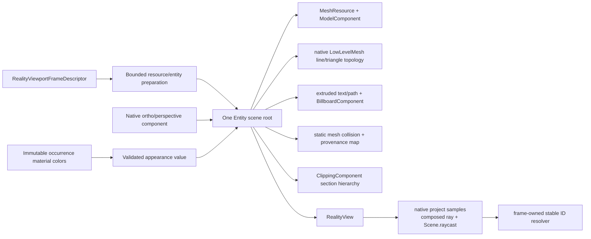

# RealityViewport

## Purpose and Scope

`RealityViewport` is the `RupaRendering` child that owns the native RealityKit
surface, camera, materials, collision resources, and stable-ID lookup metadata
for one mounted viewport. Production currently mounts this scene through
`RealityViewportView`, but SwiftUI `Canvas` still supplies the grid and world
overlays and the legacy identity renderer remains an active picking route.
The RUPA-RK target extends the same scene root to all spatial overlays and
removes those remaining routes in RK-3 through RK-5 and RK-IV.
`RealityRenderer` remains offscreen GPU evidence and does not by itself prove
the complete production cutover.

Parent: [RupaRendering](../DESIGN.md). It has no child components.

## Responsibilities and Boundaries

The component owns:

- bounded native `MeshResource`/`LowLevelMesh` and collision resource creation;
- native `Entity` hierarchy, camera components, material assignment, and root
  replacement;
- consumption, validation, and atomic application of one immutable
  occurrence-material-color map supplied by the Rendering owner;
- RealityKit `project` sampling, camera-local ray composition, and native scene
  raycasts from the mounted camera content;
- lookup from native entity/triangle results to the immutable frame's stable
  occurrence/source face/edge/vertex/sketch/handle provenance;
- native text/path extrusion and billboarding for spatial annotations.

It does not resolve document materials, execute an opaque color callback, or
traverse source/presentation metadata during a camera update. It does not own
CAD source, project state, evaluation, source IDs, camera actions, UI chrome,
Agent/MCP dispatch, persistence, or a second renderer. Entity
names and RealityKit UUIDs are never CAD authority. It does not use
`RealityKitScripting`/Script Graphs: the linked Reality Composer Pro sample is
gameplay authoring, while Rupa's CAD semantics remain in Rupa source/evaluation
owners.

## Related Designs

| Design | Relationship | Contract Used | Summary | Cautions |
|---|---|---|---|---|
| [RupaRendering](../DESIGN.md) | parent | Frame identity, lifecycle, camera session, resource bounds | Supplies immutable frame values and owns cancellation. | This component cannot publish project state. |
| [RupaViewportScene](../../RupaViewportScene/DESIGN.md) | depends on | `UniversalViewportScene` and stable source provenance | Supplies engine-neutral world geometry and IDs. | Native IDs are only derived lookup keys. |
| [ViewportMeasurement](../ViewportMeasurement/DESIGN.md) | coordinates with | World endpoints, ruler descriptors, and status | Supplies spatial measurement values. | Measurement state does not own entity lifetime. |
| [RupaUI](../../RupaUI/DESIGN.md) | used by | `RealityView` composition and non-spatial chrome | Mounts the host and forwards actions. | SwiftUI does not draw world geometry. |
| [RealityViewport tests](../../../Tests/RupaRenderingTests) | verification owner | Native resource, camera, hit-test, and root lifecycle | Proves target RealityKit capabilities on Apple GPU. | Capability probes do not prove current-production or CAD integration; offscreen probes do not prove live mount behavior. |

## Architecture



The public module seam is value-based: engine-neutral frame descriptors cross
into this component and resource/entity construction returns a typed
readiness/failure result. Native RealityKit APIs follow their declared
isolation. Asynchronous native resource generation may suspend. The macOS 27
SDK requires `LowLevelMesh` construction and its scoped buffer mutations on
MainActor, so that bounded copy interval is measured against the viewport
MainActor acceptance row owned by the parent Rendering contract; entities and
root mutation remain MainActor operations, and no detached task owns an Entity.
A post-await frame-identity check is
required before any candidate is published. Native objects do not cross into
detached preparation tasks.

The parent Rendering owner supplies one immutable
`[SceneOccurrenceID: ColorRGBA]` value containing material values resolved from
exactly the provided visible `presentationScene.items`. The
native host receives this value directly; no escaping closure crosses the
SwiftUI/native boundary. It retains the value using Swift copy-on-write and
includes it in appearance identity, so changing a material color with unchanged
shading, selection, and section state cannot hit the old appearance cache.

`RealityViewportFrameDescriptor` is design notation for the matching values,
not a required new public API, protocol, or factory. The minimal target seam is
`RealityViewport.prepare(plan:) async throws -> @MainActor RealityViewport`,
mounted by `RealityViewportView`; the existing presentation cache retains
request and snapshot publication identity, while `ViewportControlSession`
retains the viewport revision.

## Contracts and Invariants

1. Exactly one frame identity tuple `(snapshotID, viewportRevision,
   overlayRevision)` owns the root, camera, spatial overlay resources,
   collision shapes, and hit-test lookup. A partial tuple cannot be displayed
   or queried.
2. A newer matching camera revision updates the native camera transform or
   component immediately. It may synchronously update only bounded,
   fixed-capacity camera-relative buffer or primitive transforms. It must not
   rebuild world scene geometry or the provenance map, generate resources, or
   mutate cached label/path `MeshResource` values. Cached text/path resources
   are immutable and reused. A newer overlay revision rebuilds only its bounded
   spatial entities while retaining the matching source scene.
3. `MeshResource` is shared only when occurrence provenance remains recoverable.
   Otherwise each occurrence receives its own Entity while reusing immutable
   resource data. `MeshInstancesComponent` is allowed only after a focused
   probe proves per-instance hit/provenance mapping. The current plan may
   world-bake general projective or shear transforms, so IDs alone never prove
   native SRT equivalence or safe instancing.
   Native preparation may share resources only after grouping exact-equal
   immutable native payloads off MainActor. A candidate per-entity translation
   is the first render-origin-relative Float position and is removed only when
   every finite position satisfies exact component-wise `(p - t) + t == p`;
   otherwise `t` is zero and the existing world-baked payload remains the key.
   Equality includes positions, face normals, visual/boundary/collision
   indices, and normalized bounds; hashing only accelerates this equality.
   Each equal group creates native visual, collision, and line resources once,
   while every occurrence retains a distinct translated Entity and provenance
   lookup. A non-equivalent shear or payload must not share. Camera and material
   updates reuse these resources. Full payload hashing/equality and grouping
   run off MainActor; only sequential native resource creation crosses to it.
4. `ShapeResource.generateStaticMesh(from:)` or another native collision path
   is requested only for admitted geometry/resource counts. RealityKit does not
   expose its collision allocator byte size or promise that generation is
   interruptible; cancellation is checked after its await and stale output is
   discarded. Missing shape or `triangleHit.faceIndex` mapping is an explicit
   miss/failure, never a legacy identity-renderer fallback.
5. Native built-in materials are selected first. `CustomMaterial` is used only
   for a documented MatCap or signed-normal requirement that native built-ins
   cannot express. Section-plane clipping is owned by native
   `ClippingComponent` on a dedicated geometry-hierarchy root; custom material
   discard and pre-clipped replacement Mesh are prohibited. The clipper uses
   only one admitted native rotation and its child uses the exact inverse of
   that native rotation; both translations are zero and both scales are one.
   The section-plane offset is represented only by the clipping volume bounds,
   never by translating the clip hierarchy or independently decomposing an
   ideal Double inverse matrix. This compensation must not move admitted child
   geometry across a native camera clip boundary. Hit filtering uses the same
   effective clipping plane. Because native collision queries are not
   material culling, the host requests all native hits and sorts them from
   nearest to farthest,
   and—only while material back-face culling is active—uses the same mounted
   camera query ray plus snapshot-owned source-triangle winding in a common scene
   coordinate space to reject back-facing native hits. It does not recompute a
   ray/triangle intersection on the CPU. The supported macOS 27 runtime is
   observed by the Apple-GPU regression to make native static-mesh collision
   one-sided even for a non-culling visual material; this observation is not a
   cross-version RealityKit guarantee. Collision generation therefore uses a
   separate native MeshResource with the original triangle indices followed by
   reversed-winding indices. The visual MeshResource is not duplicated or
   changed for this purpose. Native collision face indices must lie in
   `0..<(2 * sourceTriangleCount)` and normalize with modulo to the one
   snapshot-owned source triangle used for provenance and culling. The GPU
   face-order/range regression is rerun when the supported OS or RealityKit SDK
   changes. No direct Metal pipeline, drawable, encoder, or readback is
   permitted.
   Before an appearance cache hit can return, the immutable material-color value
   participates in appearance equality. A changed value is validated in full
   before any Entity material, line material, lighting, or section state is
   mutated; a non-finite or out-of-range supplied color is a visible typed
   failure and preserves the previous complete appearance even when selection
   or another shading choice would override that occurrence's displayed color.
   Valid missing entries use the existing native material policy's default.
   Camera-only updates reuse the retained copy-on-write input and do not resolve
   CAD metadata, traverse the render plan or scene items, or rebuild native
   geometry.
6. Lines and annotation geometry use native RealityKit topology and mesh
   generation. `MeshResource(extruding:extrusionOptions:)` is the production
   path for bounded text/path extrusion; Canvas raster textures and custom path
   tessellation are prohibited. Native Path64 generation is an overlay-revision
   operation (the measured case is about 1.033 seconds), never a camera-frame
   operation. Cancellation is checked after the native await before publication;
   the host does not claim that the native generation itself is interruptible.
7. Camera projection and ray semantics are derived from the one native camera
   applied to the mounted content. `RealityViewCameraContent.project(_:)` is
   the screen-projection authority. On the supported macOS 27 runtime, mounted
   tests observed that `ray(through:)`, `unproject`, and `hitTest` do not invert
   that projection: orthographic rays converge from the camera instead of
   remaining parallel, and a perspective sample persistently misses its
   projected world point. This is a target-runtime observation, not a
   cross-version API guarantee. Production input therefore does not call those
   raw inverse-query APIs. It projects three finite, non-collinear points on one
   camera-local plane after converting them through the mounted camera entity,
   validates and inverts their two-dimensional affine map, and maps the input
   point back to that camera-local plane. Orthographic rays start at
   `(planeX, planeY, 0)` with local direction `-Z`. Perspective rays start at
   the local camera origin and point through
   `(planeX, planeY, -sampleDepth)`. The orthographic sample depth is the
   midpoint of native near/far and its basis step is the native scale; the
   perspective sample depth is the native-eye distance to the prepared bounds
   center, clamped to at least twice the native near distance, and its basis
   step equals that depth. All sample values, projected points, the affine
   determinant, inverse result, origin, and normalized direction must be finite
   and nondegenerate or the existing query returns an explicit miss.

   Native collision uses `Scene.raycast` with that composed scene-space ray,
   `.all`, and the existing collision mask. Its required finite positive length
   is the representable Float value of
   `distance(rayOrigin, preparedBoundsCenter) + preparedBoundsFullDiagonal`,
   advanced to include the bounded endpoint. This conservative segment covers
   every admitted source surface without per-triangle traversal; empty,
   non-finite, non-positive, or unrepresentable bounds return an explicit miss.
   Each
   returned hits are sorted by ascending distance, converted into camera-local
   space, and retained only when
   `-localZ` is within the active native component's near/far visibility
   interval before the existing section, back-face, and provenance filters run.
   No CPU CAD projection, CPU triangle intersection, raw native-ray fallback,
   or unbounded ray length is allowed. Results are valid only for the currently
   displayed frame tuple and the prepared bounds/provenance of that tuple.

   Production camera presentation uses
   RealityKit's built-in `PerspectiveCameraComponent` or
   `OrthographicCameraComponent`; it does not install a
   `ProjectiveTransformCameraComponent`. The adapter consumes only the valid
   rigid frame owned by the
   [ViewportScene camera contract](../../RupaViewportScene/DESIGN.md#world-space-navigation-focus);
   it refuses an invalid frame instead of normalizing it locally. The camera
   entity carries orientation, focus distance, and the finite right/up-plane
   translation that makes the focus project to the fitting center. Lens skew,
   an off-center projection term, world-root translation, and factoring the old
   CAD projection rows into the lens are prohibited. Target-plane placement,
   pixel scale, and fitting are preserved; perspective geometry at other depths
   follows the native symmetric pinhole camera rather than the removed
   all-depth lens-shift behavior. Perspective uses the requested finite vertical
   field of view converted to the built-in component's full-viewport vertical
   span, the shared minimum near distance, and an infinite far plane.
   Orthographic uses full viewport height divided by twice the target-plane
   pixels per meter as its native vertical half-extent; if `E` is the admitted
   scene depth extent, its eye is two `E` in front of the viewport-center point
   on the focus plane and its near/far distances are `E` and `3E`. These values
   preserve the existing admitted near/depth interval without a custom
   projection matrix. Camera
   revision updates do not regenerate geometry resources. Native render/project
   parity and composed-ray/project round trips must cover centered and
   off-center orthographic and perspective cases, true axis-front endpoints,
   and quaternion-transition frames.
8. Failed construction preserves the previous complete root and readiness
   error only while that root still matches the authoritative mounted frame
   tuple. If the snapshot or any mounted revision no longer matches, the old
   root is detached and marked non-current and non-pickable before failure is
   exposed; stale geometry is never displayed or queried as current. Cancellation
   releases candidate resources and publishes no empty root. Teardown releases
   the root and rejects all late callbacks.

## Runtime Flows

```text
matching frame descriptor
  -> validate bounds/provenance
  -> prepare native mesh/material/collision/text resources
  -> construct candidate root and camera
  -> install one content/root tuple
  -> native project samples on that tuple
  -> bounded composed ray and Scene.raycast on that tuple

replacement or unmount
  -> cancel candidate
  -> wait for cooperative exit
  -> keep old root only while it matches the authoritative mounted tuple
  -> otherwise detach it as non-current/non-pickable, then release it
     on matching teardown
```

## State, Ownership, and Lifecycle

The host owns the candidate and current root for one mount. The frame descriptor
owns immutable provenance values; the host owns native resources. The camera
session remains owned by `ViewportControlSession`, not by RealityKit entities.
The current root is display- and pick-eligible only while it matches the
authoritative mounted frame tuple; a retained mismatched root is detached,
non-current, and non-pickable before any failure is surfaced.
Offscreen `RealityRenderer` verification creates an isolated root and does not
share mutable native objects with a live host.

## Failure, Concurrency, and Constraints

Invalid counts, byte overflow, non-finite transforms, unsupported materials,
missing collision triangles, native resource errors, stale revisions, and
camera/content mismatches are typed failures. Native MainActor APIs are called
only in the bounded host boundary. No blocking GPU wait, semaphore, or
synchronous readback is performed on MainActor. Application-owned mesh/line
input and scratch buffers have checked count/byte admission before allocation.
The collision-only descriptor admits six owned UInt32 indices per source
triangle before allocating its original/reversed array. Sequential occurrence
preparation retains at most one additional transient collision-only
MeshResource while producing the candidate's ShapeResource.
SDK-owned mesh, text/path, collision, and material allocations have admitted
input/resource counts, one current plus one candidate lifetime, typed native
failure, and measured peak memory; opaque native allocator bytes are not
reported as an exact hard ceiling. The required MainActor `LowLevelMesh`
construction/copy interval is measured at the maximum admitted geometry and
must satisfy the parent Rendering contract's baseline-owned half-frame row.
The immutable plan retains its caller-validated native-preparation byte limit.
Before grouping allocates storage, the native boundary uses checked arithmetic
to add `retainedByteCount` to a conservative metadata reservation derived from
the actual private payload-group, occurrence-assignment, and resource-reference
record strides plus power-of-two buckets for twice the admitted item count.
The worst case is one unique group per item. Exceeding the caller's lowered
limit is `.resourceExhausted` before allocation. Payload backing buffers are
not charged twice: all occurrence Float positions, normals, boundary indices,
and collision indices are already admitted, and grouping retains them through
copy-on-write references. The grouping dictionary is discarded before native
resource creation; SDK resource allocations remain count-bounded and opaque.

The maximum single native line-upload fixture is derived from the current
hard plan limits rather than selected from a representative model. For one
occurrence, let `P` be the admitted position count, `T` the triangulated
triangle count, and `R(P)` be
`MeshSourceTriangulationIndex.storageReservation(vertexCount: P)`. A source
containing only triangular faces reaches the charged and actual boundary
maximum of six UInt32 indices per triangle and uses the minimum face scratch.
Its current checked working charge is
`1,536 + 48P + 96T + R(P)` bytes, and its `LowLevelMesh` scoped copy is
`16P + 24T` bytes. The verification owner enumerates every `P` from 3 through
the module position ceiling, caps `T` by both byte and triangle ceilings, and
selects the largest copy payload. Under the current hard limits this is one
occurrence with 4 positions and 234,073 triangular faces: 22,473,120 working
bytes and 5,617,816 copied bytes. The source may use the same three
non-collinear vertices and edges for every distinct face; unused admitted
positions remain valid and are still copied by the native line descriptor. A
face with four or more corners cannot improve this objective: the plan still
charges the six-index-per-triangle boundary upper bound, its maximum-face
scratch cannot be smaller, and its actual source-boundary payload is smaller.
One more triangle for the selected position count must be refused because its
22,473,216-byte working charge exceeds the 22,473,160-byte hard ceiling.
Adding occurrences cannot increase one upload interval because it adds
occurrence charges and splits native line resources.

That fixture measures the actual `RealityViewport.prepare(plan:)` path and the
maximum `NativeLineUpload` interval against 8.333 ms on the tested Apple GPU.
`ResponsivenessFootprintProbe` and
`ResponsivenessFootprintPeakSampler` also record the current test process's
baseline, sampled peak, retained value, and signed peak delta across the
same preparation. These samples describe that process and run only; they do
not establish a signed-App peak, an exact RealityKit allocator byte count, or
latency for every allocator arrangement.

## Verification and Change Impact

| Invariant | Evidence |
|---|---|
| Native resource path | Apple GPU probe/test covers triangles, line topology, text/path extrusion, material assignment, and macOS-27-or-later `ClippingComponent` hierarchy. Purely translated exact-equal payloads use the same visual/collision/line resource identities through distinct entities and retain distinct occurrence/face hit provenance; a changed shear or other non-equal native payload does not share. A same-shading material-map replacement changes the actual native output; invalid replacement reports failure without partial mutation; a camera-only revision leaves appearance resources unchanged and performs no material-resolution callback or scene traversal. |
| Native camera/input | Mounted macOS 27 tests retain the raw inverse-query counterexamples, then cover documented orthographic/symmetric-perspective lens forms; centered/off-center fit/pan render/project parity; three-point affine explicit miss; composed-ray/project round trips; near/far filtering; bounded `Scene.raycast`; true axis-front endpoints; rigid quaternion-transition frames; and invalid-frame or stale-tuple miss. Apple-GPU front/back quad tests prove the one-sided visual-mesh collision counterexample, then compare rendered visibility with ordered native `.all` results from the collision-only original/reversed mesh for material culling on/off, both normalized face ranges, out-of-range refusal, and exact source provenance. |
| Frame identity | Replacement, cancellation, overlay-only update, camera-only update, and unmount tests reject mixed roots and stale lookup. A default-cache lifecycle test uses actual native preparation, then scene replacement and teardown with no external mount owner; weak `RealityViewport` and root references prove that application owners withdraw and release each completed native owner. Native SDK deallocation may be deferred, so this is not GPU allocator-reclamation evidence. |
| Provenance | Face/edge/vertex/occurrence mappings survive entity/resource reuse; missing mapping is an explicit miss. |
| Failure and bounds | Owned-buffer count/byte admission, native resource-count bounds, opaque native resource/collision failure, measured peak memory, cancellation, and root-preservation tests pass without empty success. A lowered caller byte limit that admits the CPU plan but not checked grouping metadata fails with `.resourceExhausted` before grouping allocation. A finite `1e-100` world scale must pass the Double CPU plan, fail only when native Float preparation collapses its surface with `.invalidTransform`, publish no surface, and allow the next valid snapshot to recover to ready. The maximum single-upload fixture and its boundary refusal are recomputed after grouping admission is added rather than preserving old hard-coded counts. Current-process footprint evidence reports baseline/peak/retained/signed delta and sample count without being promoted to signed-App or exact opaque-allocation proof. |
| MainActor copy budget | The derived 5,617,816-byte maximum single line payload is passed through actual `RealityViewport.prepare(plan:)`; its SDK-required `LowLevelMesh` construction and scoped buffer copy signpost is at most 8.333 ms on the tested Apple GPU. |
| Backend cutover | Production target has no custom Metal pipeline, identity renderer, spatial Canvas, or second scene/camera route. |

The current development toolchain requires
`OTHER_SWIFT_FLAGS='$(inherited) -Xfrontend -enable-cross-import-overlays'`
for the SwiftUI/RealityKit cross-import used by the native test target. This
flag is a test/build-environment requirement only; it is not a package
`unsafeFlags` dependency. Release toolchains must be checked for their native
default before this command is removed.

Changes to the frame descriptor, stable ID map, camera component, material
policy, collision generation, or native API availability require rechecking
the parent `RupaRendering` and package/system designs.
