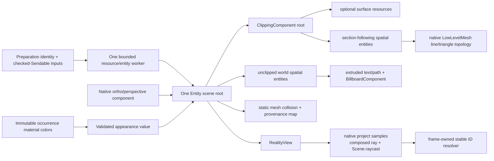

# RealityViewport

## Purpose and Scope

`RealityViewport` is the `RupaRendering` child that owns the native RealityKit
surface, camera, materials, collision resources, and stable-ID lookup metadata
for one mounted viewport. Production mounts surfaces, grid, and world overlays
through `RealityViewportView`. The legacy identity renderer remains an active
picking route until RK-4; RK-5 removes the obsolete backend and RK-IV verifies
the complete cutover.
`RealityRenderer` remains offscreen GPU evidence and does not by itself prove
the complete production cutover.

Parent: [RupaRendering](../DESIGN.md). It has no child components.

## Responsibilities and Boundaries

The component owns:

- bounded native `MeshResource`/`LowLevelMesh` and collision resource creation;
- native `Entity` hierarchy, camera components, material assignment, and root
  replacement;
- consumption, validation, and atomic application of one immutable
  occurrence-material-color map supplied by the Rendering owner;
- RealityKit `project` sampling, camera-local ray composition, and native scene
  raycasts from the mounted camera content;
- lookup from native entity/triangle results to the immutable frame's stable
  occurrence/source face/edge/vertex/sketch/handle provenance;
- native text/path extrusion and billboarding for spatial annotations.

It does not resolve document materials, execute an opaque color callback, or
traverse source/presentation metadata during a camera update. It does not own
CAD source, project state, evaluation, source IDs, camera actions, UI chrome,
Agent/MCP dispatch, persistence, or a second renderer. Entity
names and RealityKit UUIDs are never CAD authority. It does not use
`RealityKitScripting`/Script Graphs: the linked Reality Composer Pro sample is
gameplay authoring, while Rupa's CAD semantics remain in Rupa source/evaluation
owners.

## Related Designs

| Design | Relationship | Contract Used | Summary | Cautions |
|---|---|---|---|---|
| [RupaRendering](../DESIGN.md) | parent | Frame identity, lifecycle, camera session, resource bounds | Supplies immutable frame values and owns cancellation. | This component cannot publish project state. |
| [RupaViewportScene](../../RupaViewportScene/DESIGN.md) | depends on | `UniversalViewportScene` and stable source provenance | Supplies engine-neutral world geometry and IDs. | Native IDs are only derived lookup keys. |
| [ViewportMeasurement](../ViewportMeasurement/DESIGN.md) | coordinates with | World endpoints, ruler descriptors, and status | Supplies spatial measurement values. | Measurement state does not own entity lifetime. |
| [RupaUI](../../RupaUI/DESIGN.md) | used by | `RealityView` composition and non-spatial chrome | Mounts the host and forwards actions. | SwiftUI does not draw world geometry. |
| [RealityViewport tests](../../../Tests/RupaRenderingTests) | verification owner | Native resource, camera, hit-test, and root lifecycle | Proves target RealityKit capabilities on Apple GPU. | Capability probes do not prove current-production or CAD integration; offscreen probes do not prove live mount behavior. |

## Architecture



The public module seam is value-based: engine-neutral frame descriptors cross
into this component and resource/entity construction returns a typed
readiness/failure result. Native RealityKit APIs follow their declared
isolation. Asynchronous native resource generation may suspend. The macOS 27
SDK requires `LowLevelMesh` construction and its scoped buffer mutations on
MainActor, so that bounded copy interval is measured against the viewport
MainActor acceptance row owned by the parent Rendering contract; entities and
root mutation remain MainActor operations, and no detached task owns an Entity.
A post-await frame-identity check is
required before any candidate is published. Native objects do not cross into
detached preparation tasks.

### Mounted camera readiness

`RealityView`'s make/state-update closure installs the camera and appearance;
it does not guarantee that native screen projection is already available.
The existing `RealityViewportView.Mount` retains one `SceneEvents.Update`
subscription and one newest spatial-update closure. That engine callback runs
the admitted spatial placement after native scene initialization, at most once
per frame while pending, and clears the work after success or a terminal error.
Idle frames perform only the pending-work check. This is not another render
loop, timer, worker, or source-state owner.

```text
SwiftUI state -> camera/appearance installation -> newest pending placement
RealityKit frame -> native projection available -> publish spatial frame
                 -> projection unavailable -> hide world, keep camera active
unmount/replacement -> cancel subscription and pending work -> withdraw root
```

While projection is unavailable, the clipper and unclipped spatial root are
disabled together, including picking, but their common root and camera remain
enabled so native initialization can finish. The typed internal projection
unavailability is reported through the existing visible failure/status seam;
it is never an empty successful frame. Other invalid input/resource failures
retain their terminal failure contract. MainActor owns the subscription,
pending closure, entity mutations, and coalesced status callback. Detach cancels
the subscription before removing content and drops the pending closure.

The internal `isCameraReady(revision:)` predicate and camera-query validation
share the same mounted, enabled, calibrated, exact-revision conditions. The
parent cache admits that predicate only for its exact preparation identity;
the input owner may defer a retained release until publication, not query a
display-only surface or infer readiness from the presence of an Entity.

This cold-mount rule does not hide an already-mounted complete presentation on
an unchanged camera. A warm update first uses the existing native content
synchronously; it defers and withholds presentation only if that attempt
reports projection unavailable. The applied-camera identity deciding this is
what `applyCamera` installs: the layout, the display scale, the camera
revision, and the render origin its projection rows were computed against. A
changed display scale is therefore a different camera at an unchanged layout
and revision, and withholds rather than reusing the installed one. This is not
the region raster frame key below, which is wider because its answer also
reads appearance-derived predicates this identity does not. Replacing a
same-source overlay must be verified to publish without an intervening empty
native frame.
Each Mount identifies its binding by its own object identity. Rebinding the
same native viewport transfers that identity with the content; an old Mount
cannot unbind, place, or report status for the replacement binding. This is
required because SwiftUI may create the replacement before the old view's
`onDisappear` runs. Direct native capability fixtures use an unowned binding;
they do not stand in for production Mount lifetime tests.
Production-host tests must mount `RealityViewportView` itself without manually
calling `applyCamera` or `updateSpatialCamera`; delayed test-only camera setup
is not evidence for this lifecycle.

The parent Rendering owner supplies one immutable
`[SceneOccurrenceID: ColorRGBA]` value containing material values resolved from
exactly the provided visible `presentationScene.items`. The
native host receives this value directly; no escaping closure crosses the
SwiftUI/native boundary. It retains the value using Swift copy-on-write and
includes it in appearance identity, so changing a material color with unchanged
shading, selection, and section state cannot hit the old appearance cache.

`RealityViewportFrameDescriptor` is design notation, not a required public API,
protocol, or factory. Atomic production preparation uses two internal values:

- `RealityViewportPreparationIdentity: Equatable, Sendable` contains the
  internal `ViewportSceneSnapshotKey` derived from the parent Rendering
  contract's required `ViewportSourceIdentity` and any active drag-preview
  revision, an optional real presentation
  `EvaluationSnapshotID`, and the producer-owned overlay revision. It contains
  no camera revision and never fabricates a project or evaluation identity.
- `RealityViewportPreparationRequest: Sendable` contains that identity, the
  optional `UniversalViewportScene`, a finite fallback render origin, and an
  `@Sendable` spatial-batch builder. The builder captures only checked-`Sendable`
  immutable producer values and accepts the one selected render origin plus the
  exact retained surface-byte charge; it does not capture `Viewport`, project
  authority, mutable UI state, or native objects.

The component accepts only the parent-validated required source identity. The
corresponding production cache call and every cache fixture pass it explicitly;
the cache neither substitutes workspace revision nor manufactures a generation,
content hash, or per-body request token. It also receives no independent
`documentGeneration`; every document-generation consumer derives that value
from the parent source identity before the preparation request is constructed.

The existing presentation cache remains the sole asynchronous owner. Its one
worker constructs an optional surface plan, selects one render origin (the
first admitted surface position or the request fallback), invokes the batch
builder with the surface charge, prepares both native resource families, and
publishes one complete `RealityViewport` only after request-identity recheck.
A same-identity restart remains distinguishable by the cache's private request
UUID. The cache may retain one current native owner and one preparing candidate;
only the newest additional pending request is retained, as engine-neutral
values, until the active worker exits.

`RealityViewport` stores the surface plan, material programs, immutable
visual/line `MeshResource` and `ShapeResource` values, and the admitted
full-`Geometry` grouping dictionary together in one optional private
`SurfaceResources` record. Frame Entities, mutable appearance, bounds, and
provenance attachment remain owned by each `RealityViewport`. `nil` means
no surface exists; camera, spatial resources, and the scene root still exist.
An empty non-optional surface plan also produces no `SurfaceResources`, while
its real snapshot identity remains in the preparation identity. Appearance and
hit-test operations treat a missing surface as an explicit empty-surface
result, not a failed camera or fallback. A ready `RealityViewportView` mounts
without requiring a surface or presentation scene.

For an overlay-only request with the same scene key and optional real snapshot,
the cache
borrows the current immutable `SurfaceResources` under the native owner and the
candidate shares those resource identities while constructing distinct frame
Entities and provenance attachment. It does not rerun surface-plan traversal,
custom-material program generation, mesh upload, or collision generation. The
shared record remains retained by the current/candidate ownership pair and is
released when neither owns it. Across a source-snapshot change the old frame is
synchronously withdrawn from display and query authority, but the same cache
worker may privately borrow its immutable material programs and group resources
while preparing the replacement. Off-main grouping uses the retained dictionary
and full `Geometry` equality; a hash alone is never resource identity. The new
plan, provenance, bounds, frame Entities, appearance, and spatial resources
always belong to the replacement generation. This is reuse inside the existing
cache lifecycle, not an additional cache, history, allocation lane, or worker;
native objects never become producer input or leave their declared isolation.
During an overlay-only replacement, the current complete root remains enabled
as display-only continuity. Its old spatial entities may remain visible, but
their native handle indices have no CAD meaning without the cache's exact-ready
identity table, and no CAD input path may query them. A typed overlay failure
keeps that display-only root and reports the failure. Source/snapshot
replacement and teardown still withdraw the old frame immediately. A terminal
source-replacement failure, rejection, or teardown releases the privately
retained old owner. Superseding cancellation may retain that one old owner for
the newest pending request, but releases the cancelled candidate. Successful
publication retains only the replacement owner, whose
shared resources confer no old provenance or input authority.

The spatial-overlay seam remains internal to this component. An immutable
`RealityViewportSpatialBatch` carries finite world polylines, indexed triangles,
planar native paths with world transforms, world-anchored text, and bounded
camera-relative markers. `RealityViewportSpatialResources.prepare(batch:)`
receives polygon fills as planar paths, including concave boundaries; RealityKit
owns tessellation. Open section contours remain unfilled and unclosed, matching
the section owner's segment representation. No triangle-fan fill may substitute
for an arbitrary source polygon. Preparation validates the complete batch before native allocation, then asynchronously
creates an off-scene Entity root and immutable lookup metadata. Positions and
triangles use the existing plan ceilings; every native part, path, text item,
and marker consumes the existing item ceiling; and application-owned overlay
storage plus the retained surface charge must fit the aggregate retained-byte
ceiling. Exceeding any count or checked byte sum throws the existing typed
resource-exhaustion failure. Prefix truncation, omitted geometry, and empty
success are not admission strategies. Native SDK allocations remain opaque and
are bounded only by admitted resource counts plus measured platform evidence.
Every camera-relative anchor placement also consumes the item ceiling; packing
multiple points into one camera-line or marker array cannot bypass the per-frame
work bound.
Interactive top-level descriptors carry an optional frame-local `UInt32`
`handleIndex`. The parent producer owns an immutable frame table whose record
contains the normalized typed CAD identity and the exact prepared
camera-independent semantic drag baseline produced by that same pass. Legacy
`ViewportInteractionTarget` values that embed layout or projected geometry are
materialized only by the parent from the exact record and matching mounted
RealityKit projection; the record never retains the mutable drag coordinator.
The normalized identity remains
the stable deduplication address and excludes CAD `geometrySignature` payloads.
The prepared baseline may retain an existing immutable COW source reference but
must not deep-copy, traverse, or estimate source geometry in Rendering. Its
shallow table storage and separately owned variable payloads consume the
existing admission, and replacement invalidates the complete record with its
source frame. This component accepts only the record count, validates every
index before allocation, and never interprets either table value or materializes
an interaction target. World meshes are grouped by attachment and
handle index, so distinct handles cannot lose their provenance through batching.
All native fragments of a handle resolve to the same index through a frame-owned
Entity lookup. Noninteractive fragments have no index. The host may use a returned
index only with the matching prepared frame and identity table. Lookup storage
and grouping scratch storage consume the existing aggregate byte admission.
RK-4.2 makes only descriptors with a validated `handleIndex` and an explicit
finite interaction footprint pickable. Mesh, planar-path, marker, camera-line,
and camera-path fragments use a nonnegative `hitTolerancePoints` scalar. Label
descriptors have no scalar tolerance field; an interactive label instead carries
a finite positive label-local `hitRectPoints`, already expanded to the exact
route rectangle. These values are
independent of visible marker diameter, line width, glyph outline, and engine-
derived text bounds and are stored per fragment, because one semantic handle may
use different line, tip, and label footprints. RK-4.2.1 owns these optional
descriptor fields
and native query behavior; RK-4.2.2 maps each existing route's current
8/10/12/13/14-point or rectangular interaction footprint into only the
fragments that its legacy route accepts before native input becomes
authoritative. A handle index without a footprint remains prepared metadata but
creates no collision candidate, so decorative fragments do not become input
authority. At RK-4.2 completion every native-authoritative interactive fragment
has an explicit footprint; absent or invalid footprint is a typed preparation
failure, not a visual-size default.

World mesh, planar path, label, marker, camera-line, and camera-path fragments
with that complete metadata receive bounded native collision candidates during
overlay preparation; fragments without an index, grid entities, and
selected-object rulers receive none. Triangle Mesh collision accepts the exact
indexed triangle fill; a hole or omitted region with no triangle remains a miss,
and any positive screen tolerance applies only around its visible boundary.
PlanarPath collision uses the existing closed native even-odd fill, preserving
holes; its positive tolerance is likewise a boundary expansion rather than
bounding-box fill. Current identity-bearing triangle meshes are active preview
decoration and current PlanarPath fills have no interaction identity, so
RK-4.2.2 leaves both without a footprint unless it maps a real legacy fill
route. A conservative native boundary candidate may be used for expansion, but
the mounted projection narrowphase must enforce the exact fill, holes, and
point-space boundary distance.

The native PlanarPath cache is keyed by the admitted raw `CGPath` and checks
that cache before doing normalization work. On a cache miss, its existing
off-Main preparation worker canonicalizes the path with native
`CGPath.normalized(using: .evenOdd)` before native zero-depth extrusion and
static collision generation. The normalized temporary is one candidate-lifetime
value; it neither replaces nor becomes CAD source geometry. An empty or
non-finite normalized result, or normalized control-point growth beyond the
remaining peak application-owned position/byte admission for one sequential
cache miss, is a typed preparation failure with no raw-path fallback or partial
publication. Each awaited miss releases that normalized local after extrusion;
only the raw key and opaque native MeshResource remain cached, so separate
misses do not accumulate this transient scratch charge. Tessellation and its
opaque allocation remain RealityKit-owned; this component adds no custom
tessellator and does not claim the SDK allocation's exact byte size.

An enabled triangle Mesh receives an exact native static-fill collider from a
collision-only MeshResource with the admitted source indices in both windings;
this matches its two-sided visual material without changing the visual resource.
An enabled PlanarPath receives its exact static-fill collider from the
even-odd-normalized native extrusion already used by its visual Entity. For a
positive boundary tolerance, preparation adds existing `LineCollision` proxies
for the Mesh triangle edges or for the native PlanarPath tessellation edges;
their mounted projection narrowphase remains the acceptance authority. Reading
`MeshResource.contents` to count native path positions and triangle indices
precedes any application-owned array, edge table, or proxy allocation. Checked
worst-case edge count, copied buffer bytes, proxy items, metadata, and retained
records are cumulatively debited across the whole candidate before creation;
overflow or a limit breach rejects the candidate. Native tessellation output is
consumed as-is and is not retessellated by Rupa.

The exact-fill Entity and every boundary proxy retain the same handle index,
depth, attachment, and visibility as their source fragment. Sectioned geometry
remains below the existing clipped root and also passes the query-time section
half-space; scene-depth fill/proxies retain surface occlusion, while annotation
depth retains affordance priority. A zero tolerance enables exact fill without
boundary expansion, and an absent footprint creates neither collider nor proxy.
Camera-only updates mutate no fill resource; a matching-frame query may return
the handle only from an enabled exact fill or a boundary proxy that passes its
point-space narrowphase.

Current CameraPath fragments are centered handle-tip glyphs. Their scalar is
the legacy total center/tip radius, not extra padding around the visible glyph;
the native owner scales a shared unit collider to that radius and updates its
transform to the final camera-relative glyph center in the same frame. It does
not retain the static world anchor or derive collision from the glyph path. The
glyph's fill rule and holes do not become input semantics. CameraLine owns
the companion shaft tolerance independently. An interactive Label is a
rectangle: the native owner transforms a shared unit quad to `hitRectPoints` at
the same camera-relative placement and does not generate collision from text
glyphs. The collision geometry is a camera-facing, zero-thickness native quad
with both windings, not a volumetric box whose near face changes the projected
rectangle in perspective. This preserves sketch-dimension rectangles and their
split length/angle halves with four-point expansion, and the Pattern output-mode 156-by-26-point
rectangle with six-point expansion. Other numeric/guide labels remain
decorative even when they share a handle identity.

The macOS 27 probe established that direct
200-micrometer sphere/box generation is inflated, while a shared unit native
sphere/box scaled by its Entity to a 200-micrometer diameter preserves the
requested extent: a 50-micrometer offset hits and 150-micrometer-and-larger
offsets miss. Primitive marker/box collision therefore uses the scaled shared
unit collider as its native geometry; mounted Ortho/Persp tests still verify
conversion from the explicit point tolerance to that world scale. A collider
that is necessarily conservative, including a line/path broad phase that cannot
represent the exact screen-space footprint, is only candidate acquisition; the
same mounted camera
then projects the existing descriptor geometry and applies the route's fixed
point-space tolerance before the frame-local index is resolved. This narrow
projection filter is used only for those proven broad proxies and is the
existing tolerance exception, not CPU ray/triangle intersection or source
traversal.

Collision resources are prepared once per source/overlay topology and charged
to the existing item, position, and retained-byte ceilings. Triangle/path
resources may supply their native collision mesh, labels use the shared
double-wound unit quad, and line topology uses admitted
fixed-capacity native proxy segments, and camera-relative fragments update only
existing Entity/proxy transforms with their visual placement. No pointer event
creates a ShapeResource, mesh, Entity, or descriptor. Primitive collision uses
that scaled shared unit sphere or box rather than requesting a sub-2-mm
primitive: RealityKit documents that direct `generateSphere` extents below 2 mm
are clamped. Marker/box queries do not add a duplicate projection narrowphase
after mounted tests establish the requested point-radius conversion;
conservative line/path proxies retain the projection narrowphase defined above.

Surface and spatial hits use the same composed mounted-camera ray but retain
separate provenance classification. A surface Entity must resolve through the
prepared occurrence/source-triangle map; a spatial Entity must resolve through
the prepared handle index. Neither may be rejected as though it were a corrupt
member of the other class. Within an interaction route, eligible annotation-
depth handles preserve the existing affordance-before-object priority and are
ordered by projected tolerance distance then native ray distance; scene-depth
handles must also pass occlusion by the nearest retained surface. Sectioned
handles obey the same native clip half-space, world-attached handles retain the
existing unsectioned policy, and disabled/hidden fragments are never returned.
An exact-ready frame with interactive spatial bounds may compose a finite ray
without surface entries; a frame with no eligible interactive or surface
collision is a valid miss. The parent resolves the returned index only against
the matching frame record and returns its already prepared interaction target;
it never reruns projected distance/layout candidate selectors or reconstructs
a drag baseline from the normalized identity. Missing index/provenance, stale identity,
unapplied camera, nonfinite transform, or admission/resource failure is typed
failure and never falls back to projected legacy handles or identity rendering.
The internal camera-relative offset is a fixed point-space translation, a
direction-relative value containing one immutable world `toward` point plus
finite parallel and perpendicular point distances, or a world-directed value
containing one immutable source-owned world direction plus a finite screen
length in points. `CameraPoint`, label, camera-path, and marker descriptors use
this one value contract. A direction-relative placement resolves the normalized
screen direction from the projected anchor to the projected `toward` point, then
applies its parallel distance on that axis and its perpendicular distance on the
counterclockwise normal. `BillboardComponent`
continues to own camera facing, but Entity orientation is not a substitute for
this calculation: under perspective, a world or camera-local direction alone
does not contain the depth division that determines the projected direction.
Arrow wings use direction-relative `CameraPoint` values in an admitted
fixed-capacity camera line; this contract adds no renderer, tessellator, or
per-frame geometry resource.

A world-directed placement resolves in native scene space instead of in the
camera plane at the anchor's depth. The mounted camera reports the
meters-per-point scale at the anchor's own depth; the placement advances from
the native anchor along the normalized world direction by that many meters for
each requested point, and the resolved scene point keeps its own depth and its
own meters-per-point scale. The projected extent of a source-owned direction is
therefore bounded by the requested point length and stays independent of model
size and zoom, while the camera keeps its own foreshortening: a direction
perpendicular to the view projects at the full requested length and a direction
with a view-axis component projects shorter. That is the whole reason this case
exists, because a direction-relative offset applies its parallel distance after
screen normalization and would flatten every foreshortened source arc into the
same camera-plane circle. The value carries a direction, not a second world
point, so it charges no additional item or position, and its non-degenerate
length is a source property rather than a camera property: a non-finite or
zero-length direction and a non-finite or negative point length are typed
admission failures. A behind-camera anchor, a resolved point behind the camera,
or a non-finite resolved scale disables that placement for the update. A
resolved point behind the camera is not a second line-extension exception; only
a `.fixed` `CameraLine` vertex crosses the camera plane.

One finite frame-local camera-plane projection map is derived per mounted camera
update from three bounded `RealityViewCameraContent.project` samples at a
validated sample depth. Orthographic placement uses that affine map directly;
symmetric-perspective placement applies the exact `sampleDepth / -localZ` scale
for each finite camera-local anchor or `toward` point before evaluating the same
map. This is the only supported native lens pair, and it preserves native
projection authority without repeating three project calls per annotation. The
map is shared by every admitted fixed and direction-relative placement in that
update and is not stored across camera frames. Per-placement work is limited to
camera-local conversion and bounded affine arithmetic; it performs no native
resource creation, source traversal, or await. A behind-camera, non-finite,
unprojectable, or screen-degenerate anchor/toward pair disables a marker,
label, camera path, or direction-relative placement for that update and never
reuses a stale transform or falls back to a fixed direction. The sole
camera-plane-crossing exception is a `CameraLine` vertex with a `.fixed`
point-space offset. Its private line-placement path admits finite camera-local Z
on either side and applies the signed perspective depth scale continuously. The
line caller consumes position only; the signed value is never used as an Entity size.
Every finite vertex is written, so RealityKit clips visual segments to the
native near/far interval and the already prepared line-collision owner clips
the same source segments before query. A behind-camera endpoint therefore does
not disable the visible prefix or suffix of the complete polyline. An anchor on
the camera plane may collapse to the eye and is removed by native near clipping.
Directed/projected offsets retain the existing front-facing direction
requirement because a behind-camera pair cannot authorize its screen direction.
Each direction-relative `toward` point consumes one additional item and
position; a world-directed offset consumes neither because it carries no second
world point. The concrete descriptor storage of both is included in the checked
retained-byte sum.

The XYZ reference axes are camera-owned native presentation, not finite
world-source geometry. They are the three mathematical lines through the CAD
world origin in the same coordinate frame as the mounted scene. For every
applied camera frame, the existing native camera projection owner expresses
each axis as a camera-local homogeneous line, clips it against the four screen
half-spaces and the native near/far interval, and publishes only its finite
projected visible segment. A finite bound is projected normally; an unbounded
Perspective far direction uses its homogeneous direction limit as the vanishing
endpoint rather than inventing a large world coordinate. Source/model bounds,
grid coverage, and a guessed large extent never determine axis length. The result contains X,
Y, and Z independently; an axis whose projection is degenerate or whose line
does not intersect the frustum is explicitly disabled with its label rather
than retaining stale endpoints. Otherwise both visible directions reach the
actual screen or finite near/far boundary, or the true infinite-far projective
limit, and no artificial endpoint appears inside the visible viewport. The
positive visible endpoint owns the existing camera-relative axis label.

`RealityViewportSpatialResources` prepares three fixed-capacity native line
resources plus the bounded X/Y/Z label resources when the batch's independent
`includesAxes` flag is set; the flag defaults to false and never follows
`includesGrid`. The lines retain the existing `.annotation` policy through
materials that neither read nor write depth, receive no collision component,
and use the existing camera projection to place clipped endpoints at its finite
in-frustum `sampleDepth`. This depth is solely the numerically stable inverse-
projection plane and does not change line visibility. Native `TextComponent`
labels remain at the existing near annotation depth and therefore keep their
separate placement/occlusion behavior. A camera update uses the already-applied
`ViewportLayout`/native camera mapping to update at most six positions, three
enabled states, and label transforms. The pure clipping
operation is bounded by three lines and the six frustum
half-spaces; it creates no Entity, mesh, material, text, task, or buffer, performs
no source traversal, and does not change preparation identity. Axis resources
remain available for an empty scene and whether the grid is visible or has a
valid plane intersection. Frustum clipping validates finite arithmetic and
rounds its Float endpoints outward so conversion cannot shorten a valid segment;
an invalid frame returns the existing typed camera/spatial failure without
partially publishing new axes. After conversion to native Float positions, the
owner reprojects both endpoints and verifies that every mathematically
nondegenerate segment is still finite, noncollapsed, and covers the clipped
screen interval without an inward endpoint. Outward Float correction may only
recover that exact interval; it cannot extend an axis beyond the mathematical
clip. A genuinely projected-degenerate axis remains explicitly disabled.

Grid geometry is camera-owned bounded presentation rather than immutable
world-source topology. The static producer does not materialize grid lines or
scale-label strings into the retained spatial batch. On each changed grid
frame, the native resource owner supplies its mounted camera projection and
the ruler, basis, size, and chrome exclusions to `ViewportProjectedGrid`.
The resolved frame contains the grid plane, finite world coverage bounds,
minor and major steps, and the complete chrome-visible label list.
The frame contains no scene item, CAD source,
project authority, or native object. It is validated in full before the current
grid is mutated; an invalid or over-budget frame preserves the previous complete
grid and returns the existing typed failure rather than retaining frozen
coverage, dropping labels, or publishing a partial update.
Grid-only failure is a recoverable component status, returned separately from
camera/section failures. `RealityViewportView` keeps the native frame enabled and
reports it through the dedicated grid-status receiver; the receiver is required
when grid rendering is enabled. It must not enter `Viewport.surfaceFailure`,
which controls surface readiness and picking. The existing mount owns one
coalesced notification task for both statuses and the successfully resolved
scale readout, and cancels it on detach. Readout changes participate in equality
so zoom and pan update HUD and snap-step consumers without rebuilding a second
grid in SwiftUI. Recoverable grid failure retains the readout with the previous
complete grid and reports the failure separately; hiding the grid clears it. A valid
view with no forward grid-plane intersection explicitly disables only the grid;
a partially visible plane retains the bounded partial-coverage rule.
The resource owner reuses the frame-local native `CameraProjection` to project
and place that grid. It does not call the surface-bounds-dependent
`RealityViewport.cameraRay`, fabricate geometry or bounds for an empty scene,
or introduce a second camera or projection model.

`RealityViewportSpatialResources` owns one native line `LowLevelMesh` with fixed
capacity for the existing maximum 360 segments: 720 positions and 720 UInt32
indices. Minor, major, and origin segments are reordered into three stable
material parts; a grid-frame update changes only admitted vertex data, part
ranges, and bounds, preserving the `LowLevelMesh`, `MeshResource`, materials,
Entity, scene attachment, and frame identity. Segment count, positions, fixed
buffer bytes, and per-frame work consume the existing aggregate ceilings even
though one native mesh groups them. No procedural `CustomMaterial` exception is
introduced because native line topology already expresses the bounded grid.

Scale labels use a camera-owned native annotation subroot and RealityKit
`TextComponent`, whose supported contract dynamically manages its plane,
material, mesh component, and backing resolution for changed attributed text.
The component owner keeps a bounded high-water pool of label Entities, reuses
slots, clears and disables unused text, and grows the pool only after checked
item/application-byte admission. A frame either updates every visible label or
fails as a whole; pool exhaustion is never hidden by truncation. The existing
formatter and Core Text sizing produce the complete attributed string and canvas
size, while `TextComponent` alone renders it; there is no glyph atlas, custom
text renderer, `MeshResource` text extrusion, or asynchronous preparation lane.
The labels remain in the same RealityKit frame and are placed on its finite
camera-relative annotation plane, preserving constant point size and
annotation-over-content semantics without depending on material depth controls
that `TextComponent` does not expose. SDK-managed text backing bytes remain
opaque: Rupa charges its retained strings, slot records, and Entity references,
bounds native item count, and measures the target runtime instead of claiming an
exact engine allocation. Text reassignment and bounded pool growth are the only
grid-specific exception to camera-update resource immutability; no other label,
path, surface, or source resource may use it.
The batch may additionally hold one optional selected-bounds ruler group: one
immutable occurrence `GeometryBounds3D` plus up to three preformatted axis
labels. Preparation creates at most three cached text resources and three
fixed-capacity line meshes, one per eligible axis; each line mesh has six
positions for its two extension segments and one dimension segment. The group
wrapper is not an admission shortcut: every label and line resource consumes an
item, every one of the six camera-relative line positions also consumes the
item and position ceilings, and the group record, labels/UTF-8 storage, camera
points, native input buffers, and resource metadata consume the existing
checked aggregate retained-byte ceiling. A disabled axis retains its admitted
fixed-capacity resource for later camera updates and does not refund admission.
Line and triangle `LowLevelMesh` resources group material-indexed parts during
preparation; native path/text extrusion and the shared marker primitive are
also created only there. A camera update may synchronously change finite
fixed-capacity buffers or transforms owned by the prepared result. Apart from
the explicit bounded grid `TextComponent` update above, it never creates a
resource or starts asynchronous preparation.
The matching `RealityViewportView` update supplies the current safe rectangle
and `ViewportCanvasChromeLayout` exclusion rectangles. Their count consumes the
same per-frame item-work ceiling before layout; overflow disables the ruler
group explicitly rather than truncating exclusions. The native project closure
is evaluated only by the existing `ViewportMeasurementBoundsRulerLayout` over
one bounds box and its fixed edge candidates. The update changes the three
fixed-capacity line buffers, label transforms, and per-axis enabled state only;
it performs no text/mesh generation, formatting, await, or source traversal.

Every spatial descriptor also declares an attachment independent of its depth
policy. `.sectionedGeometry` attaches model-derived geometry, highlights, and
their annotations below the same clipping root as the optional surface;
`.world` attaches grid, axes, construction/reference/placement guides, the
section-plane visualization, and other intentionally uncut world annotations
as a sibling. The producer chooses attachment from feature meaning; depth,
color, draw order, or descriptor kind never implies it. Native preparation
returns both roots as one `RealityViewportSpatialResources` owner, and the
viewport attaches them once before publication. Camera-relative placement may
update entities in either root but cannot reparent them during a camera update.
For a sectioned camera-relative descriptor, the containment bounds are not
frozen at preparation scale. After bounded camera placement, `RealityViewport`
queries `sectionedRoot.visualBounds(relativeTo: root, excludeInactive: false)`,
unions it with the immutable surface and fixed sectioned-overlay bounds, and
synchronously reapplies the same section. Only the five non-cut containment
faces expand; the authored cut plane and retained half-space remain unchanged.
The query runs only when such descriptors exist, covers at most the admitted
640 placements, and performs no source traversal or resource generation.

A world-anchored camera-facing two-dimensional path, including a rounded
rectangle, ring, arrow, or equivalent annotation shape, is converted once per
path-topology revision through native `Path.strokedPath` and RealityKit
extrusion, then reused with `BillboardComponent` and fixed transforms for
constant-pixel presentation. A minimum-length CAD handle uses the same
native-projected anchor-to-target displacement for its shaft, tip glyph, and
label, clamped to its declared minimum pixel length. The bounded camera update
resolves this placement; source generation never reads camera scale.
Label alignment is a local child transform derived
from the generated glyph bounds; its background and border use the same
camera-facing path descriptor rather than a separate screen renderer. Every
spatial descriptor declares its native depth read/write policy as either scene
depth or annotation-over-content, so ordering is not inferred from draw order.
Native path tessellation remains engine-owned opaque allocation: admitted
descriptor/resource counts and platform measurements bound it, but Rupa does
not claim an exact tessellation byte size.

World polylines use native RealityKit line topology and its native width. CAD
state is distinguished by semantic color and depth plus existing fill, marker,
or label cues; Canvas pixel widths, halos, caps, and joins are not recreated and
their absence never makes the CAD operation unsupported. A planar
section/construction/reference dash is supplied as an already dashed and
stroked native path at topology preparation time, without a general-purpose
stroke-style renderer. A genuinely three-dimensional guide remains native
world-line geometry and uses its semantic marker, color, fill, or label instead
of screen-baked dashes.

## Contracts and Invariants

1. Exactly one frame identity tuple `(required source identity and derived
   ViewportSceneSnapshotKey, optional real snapshotID, viewportRevision,
   overlayRevision)` owns the root, camera,
   spatial overlay resources, optional collision shapes, and optional hit-test
   lookup. A partial tuple cannot be displayed or queried. Absence of surface
   resources never prevents a matching native camera/spatial root from mounting.
2. A newer matching camera revision updates the native camera transform or
   component immediately. It may synchronously update only bounded,
   fixed-capacity camera-relative buffer or primitive transforms and, when a
   sectioned camera-relative descriptor exists, recompute the native sectioned
   visual-bounds union and its five containment faces. It may also apply the
   bounded dynamic-grid contract above. Outside that explicit `TextComponent`
   exception, it must not rebuild world scene geometry or the provenance map,
   generate resources, or mutate cached label/path `MeshResource` values.
   Cached non-grid text/path resources are immutable and reused. A newer overlay
   revision rebuilds only its bounded spatial entities while retaining the
   matching source scene.
3. `MeshResource` is shared only when occurrence provenance remains recoverable.
   Otherwise each occurrence receives its own Entity while reusing immutable
   resource data. `MeshInstancesComponent` is allowed only after a focused
   probe proves per-instance hit/provenance mapping. The current plan may
   world-bake general projective or shear transforms, so IDs alone never prove
   native SRT equivalence or safe instancing.
   Native preparation may share resources only after grouping exact-equal
   immutable native payloads off MainActor. A candidate per-entity translation
   is the first render-origin-relative Float position and is removed only when
   every finite position satisfies exact component-wise `(p - t) + t == p`;
   otherwise `t` is zero and the existing world-baked payload remains the key.
   Equality includes positions, face normals, visual/boundary/collision
   indices, and normalized bounds; hashing only accelerates this equality.
   Each equal group creates native visual, collision, and line resources once,
   while every occurrence retains a distinct translated Entity and provenance
   lookup. A non-equivalent shear or payload must not share. Camera and material
   updates reuse these resources. Full payload hashing/equality and grouping
   run off MainActor; only sequential native resource creation crosses to it.
4. `ShapeResource.generateStaticMesh(from:)` or another native collision path
   is requested only for admitted geometry/resource counts. RealityKit does not
   expose its collision allocator byte size or promise that generation is
   interruptible; cancellation is checked after its await and stale output is
   discarded. `attachSurfaces` is the sole owner that creates surface entities,
   assigns their collision components, and records occurrence provenance. Before
   publication it validates that every planned occurrence has exactly one
   attached surface entry, a nonempty native collision component, and a matching
   provenance entry; any loss is a typed preparation failure and no ready frame
   is published. The exposed root is a mount/unmount capability only:
   production hosts may add or remove that root from `RealityView` content but
   may not mutate its descendants or components. Surface entries and collision
   components are immutable after publication, so pointer queries rely on this
   established guarantee instead of scanning all occurrences on every event.
   A raycast with no hit in a validated ready frame remains a valid miss;
   missing `triangleHit.faceIndex` or provenance on a returned hit is a typed
   query failure, never a legacy identity-renderer fallback. Any future owner
   that mutates native descendants must first add owner-mediated invalidation
   and revalidation rather than weakening loss to a miss.
5. Native built-in materials are selected first. `CustomMaterial` is used only
   for a documented MatCap or signed-normal requirement that native built-ins
   cannot express. Section-plane clipping is owned by native
   `ClippingComponent` on a dedicated geometry-hierarchy root; custom material
   discard and pre-clipped replacement Mesh are prohibited. The clipper uses
   only one admitted native rotation and its child uses the exact inverse of
   that native rotation; both translations are zero and both scales are one.
   The section-plane offset is represented only by the clipping volume bounds,
   never by translating the clip hierarchy or independently decomposing an
   ideal Double inverse matrix. This compensation must not move admitted child
   geometry across a native camera clip boundary. Hit filtering uses the same
   effective clipping plane. Because native collision queries are not
   material culling, the host requests all native hits and sorts them from
   nearest to farthest,
   and—only while material back-face culling is active—uses the same mounted
   camera query ray plus snapshot-owned source-triangle winding in a common scene
   coordinate space to reject back-facing native hits. It does not recompute a
   ray/triangle intersection on the CPU. The supported macOS 27 runtime is
   observed by the Apple-GPU regression to make native static-mesh collision
   one-sided even for a non-culling visual material; this observation is not a
   cross-version RealityKit guarantee. Collision generation therefore uses a
   separate native MeshResource with the original triangle indices followed by
   reversed-winding indices. The visual MeshResource is not duplicated or
   changed for this purpose. Native collision face indices must lie in
   `0..<(2 * sourceTriangleCount)` and normalize with modulo to the one
   snapshot-owned source triangle used for provenance and culling. The GPU
   face-order/range regression is rerun when the supported OS or RealityKit SDK
   changes. No direct Metal pipeline, drawable, encoder, or readback is
   permitted.
   Before an appearance cache hit can return, the immutable material-color value
   participates in appearance equality. A changed value is validated in full
   before any Entity material, line material, lighting, or section state is
   mutated; a non-finite or out-of-range supplied color is a visible typed
   failure and preserves the previous complete appearance even when selection
   or another shading choice would override that occurrence's displayed color.
   Valid missing entries use the existing native material policy's default.
   Camera-only updates reuse the retained copy-on-write input and do not resolve
   CAD metadata, traverse the render plan or scene items, or rebuild native
   geometry.
6. Lines and annotation geometry use native RealityKit topology and mesh
   generation. `MeshResource(extruding:extrusionOptions:)` is the production
   path for bounded text/path extrusion; Canvas raster textures and custom path
   tessellation are prohibited. Native Path64 generation is an overlay-revision
   operation (the measured case is about 1.033 seconds), never a camera-frame
   operation. Cancellation is checked after the native await before publication;
   the host does not claim that the native generation itself is interruptible.
7. Camera projection and ray semantics are derived from the one native camera
   applied to the mounted content. `RealityViewCameraContent.project(_:)` is
   the screen-projection authority. On the supported macOS 27 runtime, mounted
   tests observed that `ray(through:)`, `unproject`, and `hitTest` do not invert
   that projection: orthographic rays converge from the camera instead of
   remaining parallel, and a perspective sample persistently misses its
   projected world point. This is a target-runtime observation, not a
   cross-version API guarantee. Production input therefore does not call those
   raw inverse-query APIs. It projects three finite, non-collinear points on one
   camera-local plane after converting them through the mounted camera entity,
   validates and inverts their two-dimensional affine map, and maps the input
   point back to that camera-local plane. Orthographic rays start at
   `(planeX, planeY, 0)` with local direction `-Z`. Perspective rays start at
   the local camera origin and point through
   `(planeX, planeY, -sampleDepth)`. The orthographic sample depth is the
   midpoint of native near/far and its basis step is the native scale. Every
   applied perspective camera admits one finite positive in-frustum calibration
   depth in mounted projection state even when the prepared scene has no
   geometry; when finite prepared bounds exist, their native-eye center distance
   may select that depth, clamped to at least twice the native near distance.
   The perspective basis step equals the admitted depth. Camera-plane
   calibration, point/plane mapping, and world-axis drag therefore remain
   available for an exact-ready empty scene and do not require query bounds or
   a collision-segment length. All sample values, projected points, the affine
   determinant, inverse result, origin, and normalized direction must be finite
   and nondegenerate or the native throwing query returns the existing typed
   presentation failure. A legacy optional adapter may translate that failure
   to no result only at its explicitly nonauthoritative compatibility boundary;
   it does not weaken the native query contract.

   Baseline `project(_:revision:)` remains an unrestricted finite native
   projection and may return a finite screen point for a world point behind the
   eye. `projectWithinDepthRange(_:revision:)` is the point-admission query: it
   converts through the same mounted camera, requires `-localZ` within the
   active orthographic or perspective component's native near/far interval, and
   only then delegates to the baseline projection. It does not claim viewport
   XY containment, section visibility, occlusion, or collision visibility.
   Measurement snap validation uses this depth-admitted query; ruler and
   projection baselines retain the unrestricted query.

   `cameraDepthInterval(revision:)` reports that same near/far interval as a
   range, for a caller that clips geometry against it rather than asking about
   one point at a time. Its near bound is finite and positive; its far bound is
   finite beyond the near bound under the orthographic camera, and `.infinity`
   under the perspective camera, whose infinite far plane this owner
   configures. The query accepts the interval the calibration and ray queries
   already accept, so a mounted perspective frame reports an interval instead
   of a failure, and an unbounded far bound means the camera never stops
   drawing rather than a malformed camera.

   `usesPerspectiveProjection(revision:)` reports which projection the mounted
   camera drew the frame with. Native camera depth is linear view-space z under
   both cameras, so a caller that interpolates along a projected segment cannot
   infer the rule from the sampled depths; it asks the frame. The query reads
   the mounted calibration under the same readiness and revision validation as
   the projection queries and reconstructs no projection of its own.

   `retainsSectionedPoint(_:revision:)` reports whether the mounted frame keeps
   a world point on the kept side of the active section, applying the same
   native-scene-space predicate that admits native surface hits.
   `RealityViewportSectionHalfSpace` is that predicate's one owner. It holds
   the kept side's unit normal, its offset from the native scene origin, and
   its tolerance, and it states both the scalar `s(P) = dot(P, n) - offset`
   over `renderOrigin`-relative positions and the rule that the frame keeps `P`
   when `s(P) >= -tolerance`. Every reader of the cut evaluates that one scalar
   and that one comparison -- this query, the native collision admission, the
   prepared line clip, and the region raster and probes below -- so none of
   them restates where the tolerance belongs. Section clipping is observable
   through neither the depth interval nor an empty pixel, because a removed
   point draws nothing exactly as a silhouette point just outside the
   tessellated outline does. This query is the authority that separates the
   two, so no caller re-derives the cut from a section plane it did not apply.
   A frame whose geometry root is disabled retains no point, a frame with no
   active section retains every representable point, and a world point that
   cannot be represented in native scene space is a typed presentation failure.

   `sectionParameterBound(from:to:revision:)` reports that scalar at a world
   segment's two endpoints as one `ViewportCameraDepthClip.AffineScalarBound`,
   or nil when the frame has no active section, so a probe narrows the
   segment's own parameter against the cut once instead of evaluating the
   predicate at every sample it would otherwise walk. It vends the evaluated
   scalar and never the plane: a caller holding the normal and offset could
   re-derive a cut the frame did not apply, and the `renderOrigin` subtraction
   belongs to the frame that owns the precision of it. The bound states the
   applied section whether or not the geometry root is enabled. A scene lying
   entirely behind its cut disables the root and still has a section, so the
   root is a frame-level answer, reported by
   `retainsSectionedPoint(_:revision:)` and enforced by the region raster's
   frame key and per-frame admission, rather than a term in one segment's
   parameter; that state is the only one in which the two answers differ. The
   production reader of this query is the region edge probe, and until that
   path exists its own test is the only reader.

   Native collision uses `Scene.raycast` with that composed scene-space ray,
   `.all`, and the existing collision mask. Its required finite positive length
   is the representable Float value of
   `distance(rayOrigin, preparedBoundsCenter) + preparedBoundsFullDiagonal`,
   advanced to include the bounded endpoint. This conservative segment covers
   every admitted source surface without per-triangle traversal. A ready frame
   with no collision geometry returns a valid collision miss without
   invalidating the mounted camera-plane calibration; non-finite, non-positive,
   or unrepresentable supplied bounds are a typed presentation failure.
   Each
   returned hits are sorted by ascending distance, converted into camera-local
   space, and retained only when
   `-localZ` is within the active native component's near/far visibility
   interval before the existing section, back-face, and provenance filters run.
   This prohibition scopes the point query: no CPU CAD projection, CPU
   triangle intersection, raw native-ray fallback, or unbounded ray length may
   answer where a ray hits. Results are valid only for the currently displayed
   frame tuple and the prepared bounds/provenance of that tuple. The region
   query in contract 10 is not an exception and not a second authority. It
   answers an area, which `Scene.raycast` cannot be asked for at all, and it
   answers it from the calibration this frame derived through
   `RealityViewCameraContent.project(_:)`, the near/far interval native hits
   are already admitted against, and the same section and back-face predicates
   `retainedHits(_:rayDirection:)` applies, under a per-pixel equality with
   this point query that a differential test proves.

   RK-4 first exposes the surface subset as one throwing internal query whose
   successful value is the nearest optional ordered result:
   the occurrence and source-triangle provenance already owned by the prepared
   surface, plus the native collision position translated by this owner's
   `renderOrigin` into the CAD world point. The caller supplies the matching
   mounted camera revision, and the cache supplies only the exact-ready frame;
   a display-only retained surface has no query authority. A ready native query
   with no retained collision is the only valid `nil` miss. Preparing, stale or
   missing readiness, an unapplied camera revision, collision/provenance loss,
   or a nonfinite world conversion throws the existing typed render failure, so
   Measure cannot reinterpret unavailable presentation as a construction-plane
   or snap hit. Neither outcome invokes the CPU screen-hit tester or legacy
   identity renderer. The spatial-handle seam uses the same exact mounted
   revision: its throwing query returns bounded, priority-ordered frame-local
   indexes, and every projection used to materialize one of those candidates
   explicitly supplies that same revision. Projection with a stale/unapplied
   revision, disabled root, missing content, or nonfinite result is typed frame
   unavailability rather than an optional legacy fallback. This component does
   not map indexes to CAD records. Rectangle selection is answered by the
   region query in contract 10, which shares this surface contract's frame
   tuple, readiness validation and visibility predicates rather than weakening
   them.

   Production camera presentation uses
   RealityKit's built-in `PerspectiveCameraComponent` or
   `OrthographicCameraComponent`; it does not install a
   `ProjectiveTransformCameraComponent`. The adapter consumes only the valid
   rigid frame owned by the
   [ViewportScene camera contract](../../RupaViewportScene/DESIGN.md#world-space-navigation-focus);
   it refuses an invalid frame instead of normalizing it locally. The camera
   entity carries orientation, focus distance, and the finite right/up-plane
   translation that makes the focus project to the fitting center. Lens skew,
   an off-center projection term, world-root translation, and factoring the old
   CAD projection rows into the lens are prohibited. Target-plane placement,
   pixel scale, and fitting are preserved; perspective geometry at other depths
   follows the native symmetric pinhole camera rather than the removed
   all-depth lens-shift behavior. Perspective uses the requested finite vertical
   field of view converted to the built-in component's full-viewport vertical
   span, the shared minimum near distance, and an infinite far plane.
   Orthographic uses full viewport height divided by twice the target-plane
   pixels per meter as its native vertical half-extent; if `E` is the admitted
   scene depth extent raised to at least that vertical half-extent, its eye is
   two `E` in front of the viewport-center point on the focus plane and its
   near/far distances are `E` and `3E`. These values preserve the existing
   admitted near/depth interval without a custom projection matrix. The floor
   on `E` is a correctness bound, not a margin: a scene whose drawn points all
   share one plane perpendicular to the view direction reports a degenerate
   source extent, and the near/far interval derived from it admits no
   screen-sized handle standing on that plane, so native handle queries answer
   an unconditional miss. Raising `E` keeps the focus plane at the interval's
   center, so no admitted scene depth is lost. When the spatial batch contains an admitted native grid,
   the orthographic clip extent additionally includes every finite intersection
   between that grid plane and the four viewport-corner rays resolved by the
   existing canonical `ViewportLayout.unproject` before native camera setup.
   The resulting depth interval is the outward Float-precision rounding of the
   union of those intersections and the admitted source extent. Only the native
   camera depth translation and near/far planes may expand: the center ray,
   plane normal, native camera entity, screen projection, lens scale,
   orientation, and source authority remain unchanged. Spatial resources expose
   the bounded grid-admission predicate as an internal computed value; they do
   not introduce another camera, frustum, timer, resource-preparation lane, or
   source traversal. A batch without a grid retains the existing source extent,
   while edge-on or nonintersecting grid planes use the existing explicit grid
   visibility result. This preparation performs exactly four projection queries
   and creates no camera-frame resources. Camera
   revision updates do not regenerate geometry resources. Native render/project
   parity and composed-ray/project round trips must cover centered and
   off-center orthographic and perspective cases, true axis-front endpoints,
   and quaternion-transition frames.
8. Failed construction preserves the previous complete root and readiness
   error only while that root still matches the authoritative mounted frame
   tuple. If the snapshot or any mounted revision no longer matches, the old
   root is detached and marked non-current and non-pickable before failure is
   exposed; stale geometry is never displayed or queried as current. Cancellation
   releases candidate resources and publishes no empty root. Teardown releases
   the root and rejects all late callbacks.
9. Surface and spatial preparation share one cancellation lineage and one
   aggregate admission. A failure in the optional surface plan, spatial batch
   builder, either native resource path, attachment, or final assembly publishes
   none of the candidate. No independent overlay cache, worker, root
   publication, or asynchronous allocation lane is permitted.
10. The mounted frame answers a region, not only a point. `Scene.raycast`
    answers one ray per call, so an area assembled from point samples reports
    only the identities its samples happened to land on, and a visible part
    narrower than the sample spacing is reported as absent however the source
    is tessellated. This owner therefore vends a region visibility raster of
    the same retained plan through the same mounted camera. The point query of
    contract 7 and this region query are two readings of one frame, not two
    authorities, and the equality that fixes that is per pixel:

    ```text
    regionSurface(p) == surfaceHit(p)?.triangle
    ```

    for every device pixel centre `p` that does not project exactly onto a
    shared triangle boundary, where a boundary centre is answered by whichever
    of the coincident triangles the native ray happened to return first.
    `Verification and Change Impact` owns the differential test that proves
    this equality. A change on either side that breaks it is a defect in this
    contract, not a tolerance to widen.

    Reconstructed projection. The raster reprojects the plan's retained world
    positions through the calibration this frame already derived from
    `RealityViewCameraContent.project(_:)`. It samples no new projection and
    installs no projection of its own. For a world point `P`, its camera-local
    position is `L = camera.convert(P - renderOrigin, from: nil)` and its
    native camera depth is `d = -L.z`, the same quantity native hits are
    admitted on. Its camera-plane coordinate is `L.xy / step` under the
    orthographic camera, whose projection does not depend on `d`, and
    `L.xy * sampleDepth / (step * d)` under the perspective camera. The
    perspective calibration sets `step` equal to `sampleDepth`, so that second
    form reduces to `L.xy / d` today and stays exact if the basis step ever
    stops being the sample depth. The screen point in points is that
    coordinate under `calibration.inverseMapping.inverted()`, the forward
    direction of the affine the calibration sampled. One view matrix taken
    once per frame from the camera entity replaces the per-position
    `camera.convert` call, because a hard-maximum plan holds 188,550
    positions.

    Screen coordinates, edge functions and every interpolated channel are
    Double. Float32 cannot carry them: a perspective vertex clipped to the
    shared minimum near distance projects past 1e9 pixels, where an edge
    function's two products reach 1e18 and Float32's relative error leaves the
    sign undetermined for a pixel one unit from the edge, while Double leaves
    that error near 1e2 against an edge value near 1e9. Discarding such a
    triangle instead of carrying it is prohibited, because that is the
    vertex-admission rule this contract replaces. The view transform itself
    stays the frame's own Float camera transform; only the projected
    quantities are widened.

    Pixel convention. Rectangles arrive in the same points space
    `RealityViewCameraContent.project(_:)` returns and `surfaceHit` accepts.
    The raster's sample lattice is device pixels: device pixel `(i, j)` has
    its centre at `((i + 0.5) / displayScale, (j + 0.5) / displayScale)` in
    points; a pixel belongs to a rectangle when that centre lies inside it
    under the half-open rule `minX <= x < maxX` and `minY <= y < maxY`, so
    abutting rectangles partition the lattice; and the raster samples the
    triangle at that same centre. A segment probe walks one sample per unit
    step along its major axis on the same lattice. The mount therefore
    supplies the scale with the layout through
    `applyCamera(layout:displayScale:revision:)`. No caller may default it,
    and it is a member of the frame key below.

    Visibility predicates. The raster applies exactly the predicates
    `retainedHits(_:rayDirection:)` applies to a native hit, and nothing else.
    The section half-space is per fragment: the `s` that
    `RealityViewportSectionHalfSpace` states above is affine in native scene
    space, so it interpolates by the same rule as `d` does, and the fragment
    is retained when the interpolated `s` satisfies the kept-side comparison
    that same type states. This evaluates the predicate
    `retainsSectionedPoint(_:revision:)` reports, at the exact point sampled,
    so no polygon is clipped against the section plane. Back-face
    classification is per triangle and exact, because `dot(n, Q - eye)` is
    equal for every `Q` in the triangle's plane: with `n = cross(ab, ac)` from
    the same three positions `retains` uses, a triangle is culled under the
    orthographic camera when `dot(n, forward) >= 0` and under the perspective
    camera when `dot(n, P0 - eye) >= 0`, both in native scene space. Near and
    far are the interval `cameraDepthInterval(revision:)` reports, tested
    inclusively at the pixel centre to match the `depth >= near && depth <=
    far` admission native hits already pass. The depth interpolation rule the
    two readings share is owned by the module rectangle contract in
    [RupaRendering](../DESIGN.md#contracts-and-invariants).

    Near clipping. Only the perspective camera needs one, and it is the only
    polygon clip the raster performs, because a vertex at or behind the near
    plane has no finite camera-plane coordinate. A triangle straddling near is
    clipped against that single plane in camera-local space into at most a
    quadrilateral, so the projected triangle count is bounded by twice the
    plan's triangle count regardless of how the clip falls. The orthographic
    projection is affine in `d`, so nothing is clipped there and both depth
    bounds are enforced per fragment.

    Frame key and invalidation. The raster is derived state cached on the
    frame, and its key is exactly the state its answer reads:

    | Key member | Source |
    |---|---|
    | applied camera revision | `appliedViewportRevision` |
    | applied layout | `appliedLayout` |
    | display scale | `appliedDisplayScale` |
    | calibration generation | bumped whenever `cameraCalibration` is derived |
    | section half-space | `section`, or its absence |
    | back-face culling | `shading.isBackfaceCullingActive(in: mode)` |
    | geometry root enabled | `geometryRoot.isEnabled` |

    The `Appearance` value itself is not a key member, and neither are its
    selection, preview, hover or material-colour fields. A selection drag
    republishes a new preview set on every pointer move, and none of those
    fields change a pixel this raster reads, because `retains` reads only the
    shading and display mode out of `Appearance`. `clipper.isEnabled` is not a
    key member for the opposite reason: `validateMountedFrame` refuses a
    disabled presentation as not-ready, so no answer that could be cached
    exists while it is false. The retained plan and `renderOrigin` are fixed
    for the frame's lifetime. A key member that changes discards the raster;
    nothing else does, and the raster is never rebuilt inside a drag that
    changed none of them.

    Per-frame admission. The raster is admitted once per frame, before any
    tile is rasterized, and the decision does not depend on the rectangle. One
    binning pass over the projected triangles yields both charged quantities:

    ```text
    fragments = sum over projected triangles of
                area(bbox(triangle) intersect viewport)
    bytes     = projected triangle count * projected stride
              + bin entry count * 4
              + viewport device pixel count * 4
    ```

    charged against `MeshSourcePresentationPlanLimits.maxRegionFragmentCount`
    and `maxRegionRetainedByteCount`, which that type owns. Charging the whole
    viewport rather than the rectangle is what stops a drag from flipping
    between answering and refusing as the rectangle grows: a frame admits
    every rectangle or none. A camera change during a drag produces a new
    frame, which is admitted again on its own terms. Rasterization stays lazy
    per 256-by-256-pixel tile, so the admitted cost is paid only for the tiles
    a rectangle actually touches; that is a latency property of the admitted
    frame and not a second budget.

    Wall cost is stated, not budgeted. This component owns no per-event time
    budget, and the operation-time judgement belongs to the replacement
    verification below. Measured on the stage-1 kernel, single threaded, a
    synthetic plan at the hard maximum of 377,040 triangles over a 3200-by-2000
    device-pixel viewport projects in about 9 ms and rasterizes the whole
    viewport in 157 ms at one viewport of coverage, 219 ms at two, and 360 ms
    at the densest admitted case; a 20,000-triangle plan projects in 0.7 ms
    and rasterizes in 23 ms. An 8-by-400 sliver of the hard-maximum frame
    rasterizes in 8 ms, because only the tiles it touches are built. These are
    offscreen kernel numbers on synthetic geometry, and they are re-recorded
    on the real mounted path before the sampling path is removed.

    Queries. This owner vends three region queries and learns no CAD topology
    from them: the distinct triangles the frame draws inside a rectangle, the
    triangle the frame draws at one device pixel, and the first drawn triangle
    along a projected segment. Mapping a triangle to a CAD face, edge, vertex
    or occurrence, and composing those into a selection scope, belongs to the
    module rectangle contract in
    [RupaRendering](../DESIGN.md#contracts-and-invariants).

    Failure. The region queries validate the mounted frame and the applied
    revision exactly as the point query does, so an unmounted frame, a
    disabled presentation, a missing scene and an unapplied revision are
    not-ready, and a stale revision is a refusal. A mounted frame holding no
    geometry, or whose geometry root is disabled, answers empty rather than
    throwing, matching `surfaceHit`. A frame the admission refuses throws
    `.resourceExhausted` for every region query while it remains the mounted
    frame, so the consumer keeps its committed selection and reports the
    refusal. No region query reports a partial answer as a complete one.

## Runtime Flows

```text
matching preparation request
  -> validate bounds/provenance
  -> prepare optional surface plan and select one render origin
  -> build the admitted spatial batch with exact retained surface charge
  -> prepare native surface/spatial resources in the same worker
  -> attach sectioned and world roots and construct the permanent camera
  -> install one content/root tuple
  -> native project samples on that tuple
  -> bounded composed ray and Scene.raycast on that tuple

matching camera update with sectioned camera-relative descriptors
  -> update admitted placement transforms
  -> query native sectioned visual bounds
  -> union immutable surface and fixed sectioned-overlay bounds
  -> reapply unchanged cut plane with expanded containment faces

changed native grid frame
  -> validate complete line, label, item, position, and retained-byte admission
  -> update one fixed-capacity world-line buffer and three stable material parts
  -> reuse or grow the bounded TextComponent label pool as one atomic frame
  -> keep preparation identity, native root, surface, and non-grid resources unchanged

replacement or unmount
  -> cancel candidate
  -> wait for cooperative exit
  -> keep old root only while it matches the authoritative mounted tuple
  -> otherwise detach it as non-current/non-pickable, then release it
     on matching teardown
```

## State, Ownership, and Lifecycle

The host owns the candidate and current root for one mount. The preparation
request owns immutable source/overlay values until completion; the host owns
native resources. The camera
session remains owned by `ViewportControlSession`, not by RealityKit entities.
The current root is display- and pick-eligible only while it matches the
authoritative mounted frame tuple; a retained mismatched root is detached,
non-current, and non-pickable before any failure is surfaced.
Offscreen `RealityRenderer` verification creates an isolated root and does not
share mutable native objects with a live host.

## Failure, Concurrency, and Constraints

Invalid counts, byte overflow, non-finite transforms, unsupported materials,
missing collision triangles, native resource errors, stale revisions, and
camera/content mismatches are typed failures. Native MainActor APIs are called
only in the bounded host boundary. No blocking GPU wait, semaphore, or
synchronous readback is performed on MainActor. Application-owned mesh/line
input and scratch buffers have checked count/byte admission before allocation.
The collision-only descriptor admits six owned UInt32 indices per source
triangle before allocating its original/reversed array. Sequential occurrence
preparation retains at most one additional transient collision-only
MeshResource while producing the candidate's ShapeResource.
SDK-owned mesh, text/path, collision, and material allocations have admitted
input/resource counts, one current plus one candidate lifetime, typed native
failure, and measured peak memory; opaque native allocator bytes are not
reported as an exact hard ceiling. The required MainActor `LowLevelMesh`
construction/copy interval is measured at the maximum admitted geometry and
must satisfy the parent Rendering contract's baseline-owned half-frame row.
The immutable plan retains its caller-validated native-preparation byte limit.
Before grouping allocates storage, the native boundary uses checked arithmetic
to add `retainedByteCount` to a conservative metadata reservation derived from
the actual private payload-group, occurrence-assignment, and resource-reference
record strides plus power-of-two buckets for twice the admitted item count.
The worst case is one unique group per item. Exceeding the caller's lowered
limit is `.resourceExhausted` before allocation. Payload backing buffers are
not charged twice: all occurrence Float positions, normals, boundary indices,
and collision indices are already admitted, and grouping retains them through
copy-on-write references. The grouping dictionary is retained by the surface
owner for the next single candidate. Its key/value buckets and record strides
are already covered by the grouping reservation, while its `Geometry` payloads
share the already-admitted buffers through copy-on-write. SDK resource
allocations remain count-bounded and opaque.

The optional surface record and spatial batch consume one shared count/byte
admission. An empty or absent surface contributes no invented resource charge,
while all actual plan-retained bytes are passed into spatial admission before
its first allocation. At most one current native owner and one candidate may be
retained; the newest pending request contains no native resource. When current
and candidate share one `SurfaceResources` record, its immutable application
buffers and native resource identities are charged once rather than presented
as two independent allocations. Different snapshots may share only matching
native resource references; each still owns its admitted dictionary, plan,
instances, and frame state, and the pending value retains no native resource.

The maximum single native line-upload fixture is derived from the current
hard plan limits rather than selected from a representative model. For one
occurrence, let `P` be the admitted position count, `T` the triangulated
triangle count, and `R(P)` be
`MeshSourceTriangulationIndex.storageReservation(vertexCount: P)`. A source
containing only triangular faces reaches the charged and actual boundary
maximum of six UInt32 indices per triangle and uses the minimum face scratch.
Its current checked working charge is
`1,536 + 48P + 96T + R(P)` bytes, and its `LowLevelMesh` scoped copy is
`16P + 24T` bytes. The verification owner enumerates every `P` from 3 through
the module position ceiling, caps `T` by both byte and triangle ceilings, and
selects the largest copy payload. Under the current hard limits this is one
occurrence with 4 positions and 234,073 triangular faces: 22,473,120 working
bytes and 5,617,816 copied bytes. The source may use the same three
non-collinear vertices and edges for every distinct face; unused admitted
positions remain valid and are still copied by the native line descriptor. A
face with four or more corners cannot improve this objective: the plan still
charges the six-index-per-triangle boundary upper bound, its maximum-face
scratch cannot be smaller, and its actual source-boundary payload is smaller.
One more triangle for the selected position count must be refused because its
22,473,216-byte working charge exceeds the 22,473,160-byte hard ceiling.
Adding occurrences cannot increase one upload interval because it adds
occurrence charges and splits native line resources.

That fixture measures the actual `RealityViewport.prepare` surface path and the
maximum `NativeLineUpload` interval against 8.333 ms on the tested Apple GPU.
`ResponsivenessFootprintProbe` and
`ResponsivenessFootprintPeakSampler` also record the current test process's
baseline, sampled peak, retained value, and signed peak delta across the
same preparation. These samples describe that process and run only; they do
not establish a signed-App peak, an exact RealityKit allocator byte count, or
latency for every allocator arrangement.

## Verification and Change Impact

| Invariant | Evidence |
|---|---|
| Native resource path | Apple GPU probe/test covers triangles, line topology, text/path extrusion, material assignment, and macOS-27-or-later `ClippingComponent` hierarchy. Purely translated exact-equal payloads use the same visual/collision/line resource identities through distinct entities and retain distinct occurrence/face hit provenance; a changed shear or other non-equal native payload does not share. A same-shading material-map replacement changes the actual native output; invalid replacement reports failure without partial mutation; a camera-only revision leaves appearance resources unchanged and performs no material-resolution callback or scene traversal. |
| Native camera/input | [`RealityViewportNativeCameraQueryTests`](../../../Tests/RupaRenderingTests/RealityViewportNativeCameraQueryTests.swift) mounts the real owner and proves empty-scene Ortho/Persp camera-plane queries, plane intersection, a 1 mm depth-axis drag, perspective eye-probe reversal handling, behind-camera refusal, render-origin conversion, and cache stale/unmounted refusal. Existing mounted macOS 27 tests retain the raw inverse-query counterexamples, then cover documented orthographic/symmetric-perspective lens forms; centered/off-center fit/pan render/project parity; three-point affine explicit miss; composed-ray/project round trips; near/far filtering; bounded `Scene.raycast`; true axis-front endpoints; rigid quaternion-transition frames; and invalid-frame or stale-tuple miss. Apple-GPU front/back quad tests prove the one-sided visual-mesh collision counterexample, then compare rendered visibility with ordered native `.all` results from the collision-only original/reversed mesh for material culling on/off, both normalized face ranges, out-of-range refusal, and exact source provenance. |
| Spatial footprint admission | Focused RK-4.2.1 tests admit and query each enabled Mesh, PlanarPath, Label, and CameraPath footprint and reject invalid tolerance, rectangle, handle index, generated-tessellation count, cumulative proxy count/byte, or retained-byte input before application-owned copies or partial publication. The raw nested-path counterexample demonstrates that zero-depth native extrusion followed directly by static collision fills a same-winding hole; the native even-odd-normalized fixture proves GPU-visible fill, front/back hole misses, transformed reuse, and peak normalized-growth refusal. Two-sided Mesh and normalized PlanarPath fixtures distinguish exact filled regions, holes, zero tolerance, and point-space boundary expansion in world/sectioned and scene/annotation routes; Label fixtures compare the exact supplied rectangle after alignment, orbit, and zoom; CameraPath fixtures compare the legacy center radius at its final camera-relative position. Nil footprints create no collider, and camera-only updates retain native resource identity. |
| Frame identity | Compile coverage proves every public and production `Viewport` caller supplies document-generation or real presentation-snapshot identity. Replacement, cancellation, overlay-only update, camera-only update, and unmount tests reject mixed roots and stale lookup. Same-snapshot/different-overlay replacement is distinct and retains identical surface plan/material/visual/line/collision resource identities; camera-only revision reuses all resource identities; rapid replacement retains one worker plus the newest pending value. A default-cache lifecycle test uses actual native preparation, then scene replacement and teardown with no external mount owner; weak `RealityViewport`, shared surface record, and root references prove that application owners withdraw and release each completed native owner. Native SDK deallocation may be deferred, so this is not GPU allocator-reclamation evidence. |
| Overlay display continuity | A delayed same-scene/snapshot overlay fixture proves the mounted root, camera, source surface, and native grid remain enabled through preparation and typed failure while exact-ready surface, CAD hit, and handle-table lookup for the requested identity remain unavailable. Warm-host Ortho/Persp tests prove successful publication has no empty rendered frame; source/snapshot replacement still withdraws the old root. |
| Empty and optional surface | Nil-surface and real empty-snapshot fixtures mount one native root and camera in Ortho and Persp, display grid/axis/measurement spatial entities, return an explicit surface miss, and contain no fabricated project/evaluation identity. |
| Spatial attachment | Apple-GPU section fixtures prove `.sectionedGeometry` follows the surface clip while `.world` grid/section-plane/reference entities remain uncut; both retain their declared depth policy and update through the same mounted camera. Ortho/Persp zoom fixtures move a sectioned camera-relative label/marker beyond the prepared surface bounds, prove the native visual-bounds union expands only the five containment faces, preserves the cut half-space, and reuses every geometry/text/path resource identity. |
| Camera-relative placement | Mounted Ortho and symmetric-Persp fixtures compare fixed, direction-relative, and world-directed `CameraPoint`, label, camera-path, and marker placement after orbit/zoom with direct native projection of their anchor/toward pairs; parallel/perpendicular point distances remain constant, a world-directed offset keeps its projected extent bounded by its point length under zoom and under a changed source scale while a direction along the view axis still projects shorter than one perpendicular to it, a marker's scaled collider stays centered on its resolved placement, a degenerate direction or negative point length is a typed admission failure, degenerate or behind-camera single-point/direction pairs and behind-camera resolved world-directed points become explicitly disabled without stale positions, and a fixed-offset `CameraLine` crossing the camera plane retains its native-clipped visible segments and collision provenance instead of disabling the polyline. Camera-only updates preserve every resource identity, and the maximum 640-item update remains within the existing 8.333 ms bound without relaxing admission. |
| Native dynamic grid | Fixed/adaptive Ortho and Persp fixtures pan, orbit, zoom, and resize across step/label boundaries and compare the complete native line classes, signed formatted labels, separation, and chrome exclusion with `ViewportProjectedGrid`. The same line `LowLevelMesh`, three material parts, surface resources, and non-grid spatial resources retain identity while world coverage and `TextComponent` values change. Invalid and combined line/label/item/position/byte boundaries preserve the previous grid and report typed failure without label truncation. Apple-GPU evidence confirms TextComponent visibility, constant point size, and annotation ordering; a maximum admitted grid plus camera-relative update remains within 8.333 ms and performs no scene/CAD traversal or application-owned asynchronous resource generation. |
| Provenance | Face/edge/vertex/occurrence mappings survive entity/resource reuse; missing mapping is an explicit miss. |
| Region visibility raster | Required and not yet recorded. A differential test must compare, for every device pixel of a rectangle, the triangle the region raster reports with the one `surfaceHit` reports through the same mounted frame, on a fixture with no coplanar overlap so that no pixel centre lands on a shared boundary, in Ortho and Persp, with and without a section, with and without back-face culling, and across two tessellations of the same body. A five-pixel-wide visible window, a fully occluded body, a non-convex silhouette, and a body straddling the perspective near plane must each be covered, and the reconstructed screen point and depth must match `projectedPointWithDepth(_:revision:)` at depths away from `sampleDepth`. A refused frame must throw `.resourceExhausted` from every region query while it stays mounted. The sampling path is not removed until these pass on the real mounted path with the wall costs of contract 10 re-recorded there. |
| Failure and bounds | Owned-buffer count/byte admission, native resource-count bounds, opaque native resource/collision failure, measured peak memory, cancellation, and root-preservation tests pass without empty success. A lowered caller byte limit that admits the CPU plan but not checked grouping metadata fails with `.resourceExhausted` before grouping allocation. A finite `1e-100` world scale must pass the Double CPU plan, fail only when native Float preparation collapses its surface with `.invalidTransform`, publish no surface, and allow the next valid snapshot to recover to ready. The maximum single-upload fixture and its boundary refusal are recomputed after grouping admission is added rather than preserving old hard-coded counts. Current-process footprint evidence reports baseline/peak/retained/signed delta and sample count without being promoted to signed-App or exact opaque-allocation proof. |
| MainActor copy budget | The derived 5,617,816-byte maximum single line payload is passed through the actual `RealityViewport.prepare` surface path; its SDK-required `LowLevelMesh` construction and scoped buffer copy signpost is at most 8.333 ms on the tested Apple GPU. |
| Backend cutover | Production target has no custom Metal pipeline, identity renderer, spatial Canvas, or second scene/camera route. |

The current development toolchain requires
`OTHER_SWIFT_FLAGS='$(inherited) -Xfrontend -enable-cross-import-overlays'`
for the SwiftUI/RealityKit cross-import used by the native test target. This
flag is a test/build-environment requirement only; it is not a package
`unsafeFlags` dependency. Release toolchains must be checked for their native
default before this command is removed.

Changes to the frame descriptor, stable ID map, camera component, material
policy, collision generation, or native API availability require rechecking
the parent `RupaRendering` and package/system designs.
