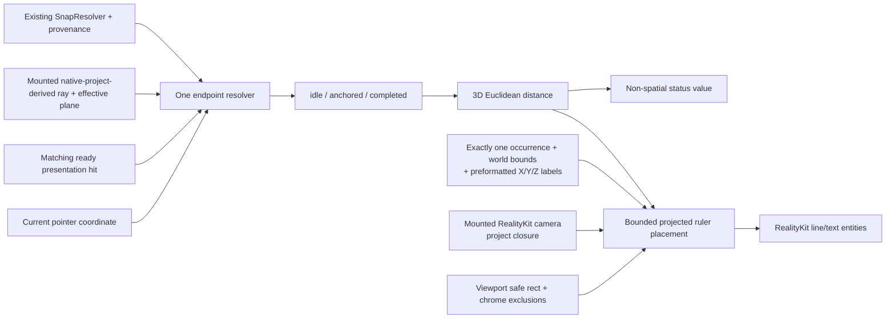

# ViewportMeasurement

## Purpose and Scope

`ViewportMeasurement` is the `RupaRendering` component that owns transient
two-point measurement and projected rulers for one selected viewport occurrence.
Parent: [RupaRendering](../DESIGN.md). Children: none. It produces immutable
world-space and bounded spatial descriptors consumed by the native
`RealityViewport`; it does not define another renderer or input system.

Production uses the RK-3 native RealityKit rulers and spatial line/text
entities in the same matching frame as surfaces, grid, and camera. CPU layout
values remain bounded inputs to native entity placement; SwiftUI does not draw
these world-space measurements through `Canvas`. RK-IV owns final integrated
acceptance rather than activation of a second renderer.

## Responsibilities and Boundaries

The component owns measurement endpoint resolution, endpoint snap provenance,
the idle/anchored/completed interaction state, Euclidean world-space distance,
and bounded screen-space ruler placement descriptors. Endpoint resolution
receives the mounted native camera's synchronous exact-ready surface, plane,
and depth-admitted point-projection queries. Ruler placement separately receives
the synchronous unrestricted native project closure and projects one selected
occurrence's immutable evaluated world bounds into at most three World X/Y/Z
native RealityKit rulers. Formatting occurs before camera updates; the layout
receives the three already formatted axis labels.

It does not own source selection, CAD measurement semantics, persistent
`MeasurementAnnotation`, document mutation, Undo, camera state, snap policy,
geometry preparation, native Entity/resource lifetime, Agent/MCP operations, or
application lifecycle. `Viewport` supplies the mounted RealityKit camera
query, ready presentation data, effective construction plane, snap options,
ruler, selection, and chrome exclusions. `RupaUI` supplies only whether Measure
is active and, as two separate gates, whether the selected-object rulers and
their readout should be shown; it also presents the component's non-spatial
status.

## Related Designs

| Design | Relationship | Contract Used | Summary | Cautions |
|---|---|---|---|---|
| [RupaRendering](../DESIGN.md) | parent | RealityKit frame, native camera queries, ready-scene and cancellation lifecycle | Composes the component into the current viewport. | Measurement must run before ordinary affordance and object-pick interception. |
| [RupaUI](../../RupaUI/DESIGN.md) | used by | Active mode, the two selected-object bounds gates, and visible transient status | Selects the tool and decides which bounds presentations appear, without acquiring geometry authority. | Tool exit and authority change cancel transient measurement, and the readout gate stays a superset of the ruler gate. |
| [RupaViewportScene](../../RupaViewportScene/DESIGN.md) | depends on | Immutable scene and snap inputs | Supplies source values without owning the live measurement ray or projection; those queries remain with [RealityViewport](../RealityViewport/DESIGN.md). | A camera projection changes only screen placement, never the measured value. |
| [RupaCore](../../RupaCore/DESIGN.md) | depends on | Existing `SnapResolver`, `SnapResolutionResult`, ruler and immutable selection | Reuses current snap policy and source provenance. | A snap failure is visible and is not replaced by guessed depth. |
| [Rendering tests](../../../Tests/RupaRenderingTests) | verification owner | Interaction, resolution, geometry and native spatial behavior | Rejects stale, ambiguous, occluding, or screen-distance implementations. | CPU/build success alone does not prove the signed-App input workflow. |

## Architecture



## Contracts and Invariants

### Two-point measurement

Measure is an explicit two-point viewport operation:

```text
idle --click valid start--> anchored --hover valid point--> preview
anchored --click valid end--> completed --click valid start--> anchored
any phase --tool exit / Escape / snapshot replacement--> idle
```

1. Hover and click call the same endpoint resolver with their own current screen
   coordinate. A click recomputes its endpoint and never commits the last hover.
2. Measure input is routed before pending object-affordance handling. It works
   in a ready empty frame when the matching mounted camera can resolve an
   effective plane; absence of surface geometry is not frame unavailability.
3. Resolution order is explicit: a selected snap candidate with a world point;
   a planar snap candidate reconstructed on the same effective plane; the nearest
   visible point on matching ready presentation geometry; then intersection of
   the actual camera ray with the explicit effective construction plane. Fixed
   depth, a world-origin plane not selected by the user, stale hover, and a
   parallel-camera approximation are not fallbacks.
4. Every accepted endpoint retains whether it came from snap, presentation
   geometry, or the effective plane. Snap endpoints retain the selected
   candidate's kind, label, and source identity rather than only its coordinates.
5. The displayed value is the finite Euclidean distance between the two accepted
   `Point3D` values in model metres, formatted through the current ruler display
   unit. Screen length and projected-plane distance never replace it.
6. Endpoint resolution requires the exact-ready presentation identity and its
   matching applied mounted-camera revision. Within that ready frame, a valid
   native surface miss removes only the geometry-hit option and may continue to
   an explicitly selected effective plane. An unavailable, preparing, stale, or
   nonmatching frame publishes `.presentationUnavailable` and cannot authorize
   a snap, geometry, or plane endpoint. An unresolved/parallel plane ray,
   nonfinite endpoint, snap failure without another explicit source, or a
   degenerate completed segment leaves the phase unchanged and publishes a
   visible refusal.
7. The segment and preview are transient presentation state. They do not select,
   mutate, dirty, persist, enter Undo, invoke `MeasurementService`, or create a
   `MeasurementAnnotation`.

### Selected-object world-bounds rulers

Automatic object dimensions are presentation of evaluated bounds, not another
Measure operation. They take two forms behind separate gates. The spatial
rulers reach the object with leaders and labels, so they are drawn only while
the Measure tool owns the viewport, where nothing else competes for the space
around the selection. The text readout in the transient status accompanies
both the Measure tool and ordinary object selection, so every tool that can
draw a ruler also reports its value. The readout gate is therefore a superset
of the ruler gate.

Both forms require an unambiguous single selected viewport occurrence and a
viewport that no modeling, Mesh-element, drag, command, preview, or
construction-plane interaction owns. A clicked occurrence may be retained only
while it still matches the published selection and presentation snapshot. If a
scene-node selection expands to multiple occurrences and no current clicked
occurrence disambiguates it, neither form is shown.

`WorkspaceMeasurementPresentationGate` owns both predicates, and `Viewport`
receives them as the separate `showsAutomaticMeasurement` and
`showsBoundsReadout` inputs.

The component labels the values `World bounds` and uses the occurrence's existing
evaluated `worldBounds`. The producer formats at most one label for each finite
nonzero World X, Y and Z extent before native preparation. On each matching
camera update, `ViewportMeasurementBoundsRulerLayout` consumes those immutable
bounds and labels plus a synchronous closure backed by
`RealityViewCameraContent.project`; it no longer consumes a prepare-time
`ViewportLayout`. Camera projection determines only ruler positions. It does not
turn the axis-aligned bounds into exact edge length, area, volume, local size, or
screen-space size.

For each axis, placement examines a fixed ordered set of projected bounding-box
edges and outside label slots. It selects the first candidate whose label and
dimension line remain within the viewport safe rectangle and do not intersect
the projected object rectangle, viewport chrome exclusions, or an already accepted
label. `ViewportMeasurementRulerCollision` owns the segment-versus-rectangle
predicate those rejections use; it is a purely two-dimensional overlap test
that carries no picking, depth, or occlusion meaning. Extension leaders may
touch only their own projected endpoints. If no candidate is valid, that axis
is returned as explicitly disabled rather than silently omitted or allowed to
obscure a control or the model; its world-bounds value remains available in
the transient status. The candidate count is constant and independent of
scene size. The safe rectangle and exclusion rectangles are the current
values owned by `ViewportCanvasChromeLayout`, passed to the camera update
rather than retained as source or native resource state.

All measurement entities are noninteractive and excluded from hit testing. They
cannot consume selection, camera, tool, or context-panel input. Camera changes
reproject existing world values through the native RealityKit camera and update
bounded entity transforms; they do not reset the interaction or alter a value.
The measurement component never creates a second camera or spatial scene root.

## Runtime Flows

```text
Measure hover/click -> current native camera resolution -> existing snap policy
  -> accept explicit world endpoint -> preview/complete -> build spatial descriptors
object selection -> exact occurrence validation -> evaluated world bounds
  -> format three axis labels once -> readout gate publishes the status text
  -> ruler gate additionally prepares one optional native ruler group
matching camera/chrome update -> native project closure + safe/excluded rects
  -> existing bounded collision placement -> enable accepted axes
  -> disable unplaceable axes -> update fixed-capacity native ruler entities
snapshot/tool/selection replacement -> invalidate incompatible transient state
```

## State, Ownership, and Lifecycle

The mounted `Viewport` retains one small value state containing at most two
endpoints, one current hover endpoint, and an optional last clicked occurrence.
Each value is bound to the current presentation snapshot/document generation.
Matching camera changes retain it; source/presentation replacement, tool exit,
Escape, loss of eligible selection, or viewport teardown clears it synchronously.
No task, cache, retained geometry buffer, or external owner is introduced.

## Failure, Concurrency, and Constraints

Resolution uses the mounted
[RealityViewport camera query](../RealityViewport/DESIGN.md#contracts-and-invariants)
once for the current pointer event; it does not add a second presentation scan, traverse
or validate source geometry, build a resource graph, evaluate CAD, format text,
or perform I/O. A bounded CPU fallback is allowed only when RealityKit has no
equivalent query and consumes the same prepared provenance/camera semantics.
Placement is constant work over one selected occurrence, three axes, a fixed
candidate set, and a chrome-exclusion count admitted by the parent per-frame
work ceiling. Existing asynchronous frame publication remains its sole owner.

Failure is a typed/value result consumed by `Viewport`; it is never reported as a
zero distance or empty success. Stale frame identity, missing occurrence,
nonfinite bounds/points, invalid native projection, clipped endpoints, and
absence of a collision-free slot cannot create stale or partial RealityKit
entities.

## Verification and Change Impact

Focused component tests must prove both lenses use the current mounted
native-project-derived ray,
matching ready geometry wins only when actually hit, empty-space plane input
succeeds in an exact-ready empty frame, unavailable/preparing/
stale/nonmatching frames publish `.presentationUnavailable` without accepting a
snap or plane endpoint, unresolved depth refuses, snap kind/label/source survive,
click recomputation rejects stale hover, Euclidean world distance is projection
independent, and cancellation/snapshot replacement clear state. Geometry tests
must prove three labeled world-bounds axes, ambiguous occurrence refusal, bounded
collision avoidance with explicit disabled axes, native line/text descriptors,
and noninteractive spatial entities. Ortho and Persp tests orbit after resource
preparation, change safe/excluded rectangles, and prove placement is recomputed
from native projection without changing labels or native resource identities.

RupaUI tests own Measure activation/status/tool-exit wiring, both bounds
presentation gates including the superset relation between them, and the
absence of source/selection/Undo mutations. A signed App test owns two clicks and live hover
preview in empty-space and snapped object cases, selected-object ruler placement,
camera reprojection, control hit targets, Escape, clean document state, and
unchanged project bytes. Changes to layout projection, selection occurrence
mapping, snap result provenance, input ordering, RealityKit frame identity,
chrome exclusions, or ruler units
require this component's tests to be rerun.
