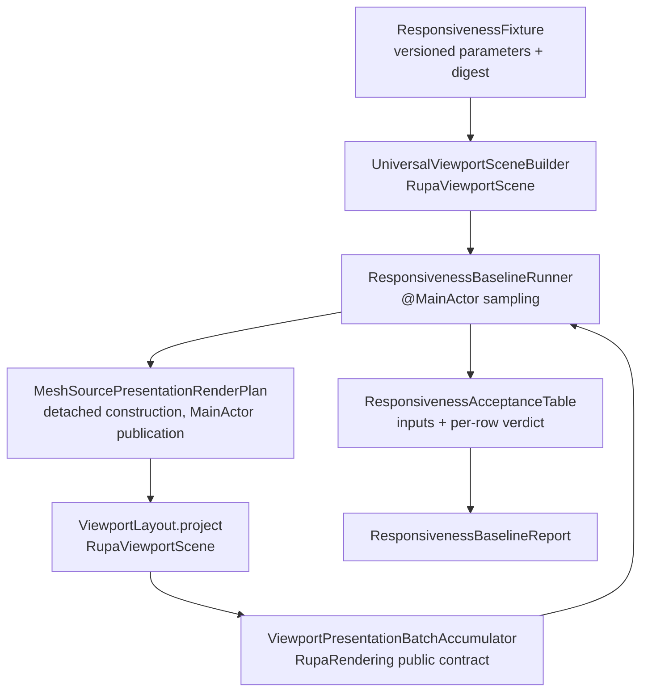

# RupaResponsivenessBaseline

## Purpose and Scope

This module owns the fixed multi-body responsiveness fixture and the measurement
that records what the current presentation path costs on `MainActor` for that
fixture. It exists so every later responsiveness claim has a comparison point
that was produced by the same fixture, the same public contracts, and the same
recorded acceptance-table inputs.

It is a measurement module. It records values and per-row verdicts against the
[RupaRendering performance acceptance table](../RupaRendering/DESIGN.md#failure-concurrency-and-constraints).
It does not change presentation behavior and it is not a production dependency.

- Design hierarchy: module.
- Parent: [RupaKit package design](../../DESIGN.md).
- Children: none.

## Responsibilities and Boundaries

| Owned | Not owned |
|---|---|
| The versioned fixed multi-body fixture and its content digest. | Any production geometry, evaluation, or rendering behavior. |
| Measuring plan construction, plan publication, readiness, batched draw work, and footprint for that fixture through public contracts. | The meaning of the acceptance rows, which [RupaRendering](../RupaRendering/DESIGN.md) owns. |
| Deriving the acceptance-table environment inputs from a stated selection rule and recording them with the measurement. | Choosing product fidelity, tessellation policy, or plan limits. |
| Reporting one verdict per acceptance row, including a verdict that rejects. | Relaxing a threshold so a measurement passes. |

The module has no authority to declare an implementation correct. A rejecting
row is reported, never adjusted.

## Related Designs

| Design | Relationship | Contract Used | Summary | Cautions |
|---|---|---|---|---|
| [RupaKit package design](../../DESIGN.md) | parent | Package composition and target index | Registers this module as an upper-level measurement target. | Production authority modules must not depend on it. |
| [RupaRendering design](../RupaRendering/DESIGN.md) | depends on | `MeshSourcePresentationRenderPlan.forEachOccurrence`, `MeshSourcePresentationOccurrenceView`, `ViewportPresentationBatchAccumulator`, `MeshSourcePresentationVisualState`, performance acceptance table | Supplies the plan contract being measured, the batching contract the draw pass performs, and the rows the verdict is taken against. | The table is the oracle; this module copies its inputs, never its thresholds' meaning. The batching contract must be driven, never reimplemented: a private copy would stop bounding the production interval the moment the two diverged. |
| [RupaViewportScene design](../RupaViewportScene/DESIGN.md) | depends on | `UniversalViewportScene`, `UniversalViewportSceneBuilder`, `ViewportLayout` | Supplies the scene the plan is built from and the projection the draw work performs. | The fixture must reach the renderer through the same builder the product uses. |
| [RupaGeometry design](../RupaGeometry/DESIGN.md) | depends on | `MeshSource`, `MeshSourceBuilder` | Materializes the fixture geometry with the production buffer contract. | Fixture faces are triangles, matching what B-rep tessellation emits. |
| [RupaResponsivenessBaselineCLI design](../RupaResponsivenessBaselineCLI/DESIGN.md) | used by | `ResponsivenessBaselineRunner`, `ResponsivenessBaselineReport` | Exposes this module as one dedicated process that records a report. | The CLI owns no measurement or threshold meaning. |

## Architecture

The runner reaches production behavior only through published public contracts.
It never reimplements plan construction, traversal, projection, or batching.

## Contracts and Invariants

1. The fixture is a pure function of its versioned parameters and of the
   optimization level it was compiled at. Building it twice in one process or
   across processes at the same optimization level yields the same digest, and
   the digest covers the materialized vertex positions and face corner
   references, not the parameters alone. Because it covers materialized
   positions it also covers the floating-point results of the lateral `cos` and
   `sin` evaluations, and this toolchain evaluates them differently under
   `-Onone` and `-O`: an isolated reproduction of the lateral loop at the
   standard segment count showed ten of 6284 sampled values differing by one
   unit in the last place. A digest recorded from a Release build is therefore
   reproduced only by a Release build, and a digest is comparable only between
   runs of the same build configuration.
2. Every fixture body is admitted by the module hard ceilings it is measured
   under. A fixture that cannot be built or cannot be planned is a typed
   failure, never a smaller fixture that happens to succeed.
3. Plan preparation is measured in the shape the production cache performs it:
   construction runs inside a detached task off `MainActor`, and the completed
   plan is published by one `MainActor` state assignment. The three intervals
   are recorded separately. Construction is timed inside the detached closure,
   so task scheduling is not charged to it; publication is timed around the
   state assignment alone; readiness spans the request through the publication,
   so the scheduling between them is charged somewhere rather than nowhere.
   `mainActorBlockedSeconds` is therefore publication plus draw and never
   includes construction, which is the property the report is read for.
   Construction validates every range, transform, and index while it transforms
   each source vertex once, so publication contains no second traversal to
   attribute. Each sample also records the plan's retained position count and
   charged byte count, so a regression that reintroduces a per-corner transform
   is visible in the report rather than only in a timing.
4. Draw work is measured by driving the production draw pass: the plan is
   walked one occurrence at a time, each retained position is projected through
   `ViewportLayout` exactly once, and every triangle is appended to
   `ViewportPresentationBatchAccumulator`, which merges it into one `Path` per
   visual state. One fill and one stroke are charged per non-empty batch, so
   the charged counts are a constant of the module rather than a function of the
   triangle count, and the projected point count equals the plan's retained
   position count rather than three times its triangle count. Fill and stroke
   are counted, not submitted, because a `GraphicsContext` exists only inside a
   live `Canvas`. The report states this exclusion.
5. Footprint values are sampled `phys_footprint` deltas taken around plan
   construction while the plan is retained. They are labelled as sampled
   proxies. A failed sample is a typed failure, never a zero. The delta is taken
   after a warm-up that already built and released an identical plan, so the
   allocator can satisfy the measured allocation from pages it already holds:
   the delta is a lower bound on the plan's bytes, and a byte row therefore
   rejects on the lower bound but never accepts from it.
6. Acceptance-table environment inputs are either supplied by the caller or
   derived by the stated selection rule recorded with the report. A derived
   value is always reported together with its rule.
7. Every acceptance row receives exactly one verdict of `accepts`, `rejects`, or
   `notMeasured`, with the compared value and threshold. A measure the current
   implementation cannot expose is `notMeasured` with the reason, never an
   invented number and never an implicit pass.
8. The report records the fixture digest, fixture version, iteration counts,
   build configuration, and both repository revisions supplied by the caller, so
   two reports are only comparable when those match.

## Runtime Flows

The timed loop and the footprint pass are separate, because sampling a footprint
inside a timed iteration would charge the sampling cost to the interval the
acceptance table compares against a frame.

```mermaid
sequenceDiagram
    participant CLI
    participant Runner
    participant Detached
    participant Plan
    participant Layout
    participant Accumulator
    participant Sampler

    CLI->>Runner: run(fixture, environment, iterations)
    Runner->>Runner: build fixture, digest, scene
    loop warm-up
        Runner->>Detached: construct plan, publish, draw
    end
    loop measured iterations (timing only)
        Runner->>Detached: construct plan (single validating pass)
        Detached-->>Runner: plan + construction interval
        Runner->>Runner: publish plan (MainActor state assignment)
        Runner->>Plan: forEachOccurrence
        Plan-->>Runner: occurrence view
        Runner->>Layout: project each retained position once
        Runner->>Accumulator: append every triangle
        Runner->>Runner: charge one fill + stroke per non-empty batch
    end
    Runner->>Runner: sample baseline footprint
    Runner->>Sampler: start peak sampling off the main actor
    Runner->>Detached: construct plan
    Runner->>Sampler: stop, read peak or typed failure
    Runner->>Runner: sample footprint with the plan retained
    Runner-->>CLI: report with per-row verdicts
```

## State, Ownership, and Lifecycle

The runner owns no state between calls. One `run` owns the fixture, the scene,
the plan of the current iteration, and the accumulated samples, and releases the
plan before the next iteration so a footprint delta measures one plan. The
report is an immutable value owned by the caller.

## Failure, Concurrency, and Constraints

The runner is `MainActor`-isolated because two of the three preparation
intervals it separates are defined by that actor: what the product pays there is
the publication and the draw pass, and the runner must be on the actor to time
them as the product does. Construction is deliberately not paid there, so the
runner starts it in a detached task and awaits it, exactly as the production
cache does. All failures are `ResponsivenessBaselineError`
values carrying the failing stage; no stage returns a placeholder value on
failure. Iteration count and warm-up count are caller-supplied and must be
positive; the acceptance rows that require ten consecutive post-warm-up runs
report `notMeasured` when fewer were requested.

## Verification and Change Impact

`RupaResponsivenessBaselineTests` owns the evidence below. It measures a small
fixture so a test run stays short; the construction, preparation, and draw paths
it exercises are the ones the standard fixture uses. Measured durations are host
dependent and are never asserted.

| Invariant | Required evidence |
|---|---|
| Deterministic fixture | Building the small fixture twice, and the standard fixture twice, yields identical digests, vertex counts, and face counts. |
| Fixture admission | The fixture builds and plans without a typed failure, and the plan's triangle count matches the value the fixture parameters predict. |
| Construction is off MainActor | Every sample's blocked interval equals its publication plus its draw work exactly, so a run that charged construction to `MainActor` cannot satisfy it, and every sample's readiness is at least its construction interval. |
| Single publishing pass | Every sample carries a non-zero construction duration and a retained position count below three times the triangle count, together with a non-zero charged byte count. |
| Honest exclusion | The Canvas row's reason names the excluded fill and stroke submissions; the counted fills and strokes equal the number of non-empty batches, which for a fixture with no selection is one and is below the triangle count; and the projected point count equals the plan's retained position count. |
| No invented values | Every acceptance row carries a verdict, a measured value, a threshold, and a non-empty reason; the two rows the table defines over ten runs cannot accept from a shorter series; and the cancellation row is `notMeasured` with a reason stating that no cancellation was requested, because reporting the preparation interval in its place would let a run that cancels nothing accept. |
| Lower-bound rows never accept | The publication row, the Canvas row, and both byte rows report `rejects` or `notMeasured`, never `accepts`, because each is measured as a lower bound: the publication excludes the observation invalidation a live SwiftUI scope adds, the Canvas figure excludes the fill and stroke submissions, and the byte deltas are taken after a warm-up. Plan readiness is the one row this module can establish, because it is a whole measured span rather than a lower bound of one. |
| Typed failures | An invalid environment input and an invalid measurement request each throw `ResponsivenessBaselineError` instead of producing a report. |
| Unmodified report | The report round-trips through JSON to an equal value. |

Changing the fixture parameters, the acceptance-table inputs, or the measured
stages requires rechecking the [RupaRendering design](../RupaRendering/DESIGN.md)
acceptance table and re-recording every report that is still cited as evidence.
