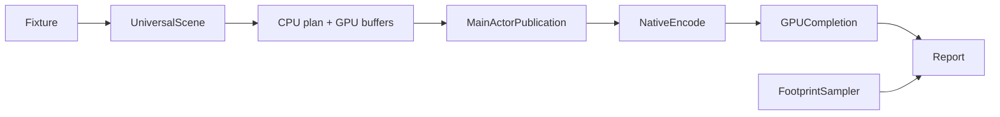

# RupaResponsivenessBaseline

## Purpose and Scope

This measurement module owns the deterministic multi-body fixture and its
source-backed performance report. Its parent is [RupaKit](../../DESIGN.md);
it has no child components and is not a production dependency.

## Responsibilities and Boundaries

The runner measures production CPU-plan/GPU-resource preparation and native
surface encoding/completion. Allocation reservations and sampled physical
footprint are separate evidence. It does not choose fidelity, relax limits,
or declare live application acceptance from an offscreen run.

## Related Designs

| Design | Relationship | Contract used | Summary | Cautions |
|---|---|---|---|---|
| [RupaKit](../../DESIGN.md) | parent | Target graph | Composes this target | No production dependency on measurements |
| [RupaRendering](../RupaRendering/DESIGN.md) | depends on | Plan, surface renderer, acceptance table | Owns measured implementation | Use production encoding, not a duplicate rasterizer |
| [RupaViewportScene](../RupaViewportScene/DESIGN.md) | depends on | Universal scene builder and layout | Same scene representation as app | Preserve occurrence identity |
| [RupaGeometry](../RupaGeometry/DESIGN.md) | depends on | MeshSourceBuilder | Owns fixture storage | Digest materialized geometry |
| [CLI](../RupaResponsivenessBaselineCLI/DESIGN.md) | used by | Runner and report | Serializes measurements | Missing evidence is not a pass |

## Architecture

## Contracts and Invariants

- Fixture identity covers version, materialized positions and corner references.
  Compare digests only within one optimization level: this toolchain can round
  trigonometry differently under `-Onone` and `-O`.
- Preparation constructs the CPU plan and immutable GPU resources off MainActor.
  Readiness spans dispatch through publication. Publication excludes live SwiftUI
  invalidation and cannot establish application acceptance.
- Drawing calls `ViewportSurfaceRenderer.encode`, submits a command buffer, and
  awaits real completion without blocking MainActor. CPU encoding and
  encode-to-completion wall time are distinct. Attachment setup is outside frame
  timing, matching the app's attachment reuse between resizes.
- Canvas grid/interaction overlays and window presentation are not measured.
  The Canvas row remains notMeasured unless its lower bound already rejects.
  Native GPU completion is separately recorded.
- Checked retained/working reservations and sampled footprint are distinct.
  Post-warmup footprint deltas are lower bounds because pages may be reused.
- Every acceptance row includes its threshold and reason. No cancellation
  experiment means cancellation is notMeasured, not estimated from readiness.
- Reports include revisions/dirty state, fixture digest, environment, build
  configuration and all ten post-warmup samples used for calibration.

## Runtime Flows

Build the fixture, discard warmups, record sequential preparation/draw samples,
then perform a separate sampled-footprint preparation. Submit one command buffer
at a time. Resource, shader, encoding and completion failures throw explicitly.

## State, Ownership, and Lifecycle

Each iteration retains CPU and GPU resources through command completion.
The footprint pass retains both through its final sample. No mutable measurement
state survives the run; the returned report is immutable.

## Failure, Concurrency, and Constraints

Check the native attachment byte ceiling before allocation. Encode on MainActor;
construct off it and suspend while awaiting GPU completion. Actual Metal tests
use bounded native `xcodebuild test` runs.

## Verification and Change Impact

[ResponsivenessBaselineTests](../../Tests/RupaResponsivenessBaselineTests/ResponsivenessBaselineTests.swift)
checks deterministic fixtures, complete admission, CPU/GPU timing separation,
native draw counts, honest unmeasured rows, failures and JSON roundtrip.
Host-dependent durations are recorded, not asserted by unit tests.
The standard fixture's ten-run native measurement calibrates renderer limits.
Signed-app frame, observation, cancellation and footprint remain separate gates.
Changed fixture, renderer or accounting paths require new measurements.
