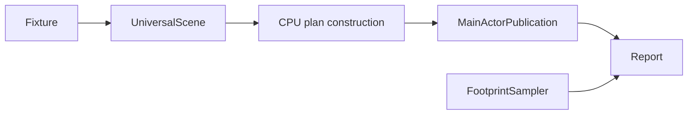

# RupaResponsivenessBaseline

## Purpose and Scope

This measurement module owns the deterministic multi-body fixture and its
source-backed performance report. Its parent is [RupaKit](../../DESIGN.md);
it has no child components and is not a production dependency.

## Responsibilities and Boundaries

The runner measures production CPU-plan preparation and the MainActor
publication that follows it. Allocation reservations and sampled physical
footprint are separate evidence. It measures no drawing: the shipped viewport
draws through a mounted RealityKit frame this process cannot bring up, so the
drawing row carries no duration from here. It does not choose fidelity, relax
limits, or declare live application acceptance from an offscreen run.

## Related Designs

| Design | Relationship | Contract used | Summary | Cautions |
|---|---|---|---|---|
| [RupaKit](../../DESIGN.md) | parent | Target graph | Composes this target | No production dependency on measurements |
| [RupaRendering](../RupaRendering/DESIGN.md) | depends on | Plan construction, plan limits, acceptance table | Owns measured implementation | Measure the plan path only; the mounted frame is not reachable offscreen |
| [RupaViewportScene](../RupaViewportScene/DESIGN.md) | depends on | Universal scene builder and layout | Same scene representation as app | Preserve occurrence identity |
| [RupaGeometry](../RupaGeometry/DESIGN.md) | depends on | MeshSourceBuilder | Owns fixture storage | Digest materialized geometry |
| [CLI](../RupaResponsivenessBaselineCLI/DESIGN.md) | used by | Runner and report | Serializes measurements | Missing evidence is not a pass |

## Architecture

## Contracts and Invariants

- Fixture identity covers version, materialized positions and corner
  references.
  Compare digests only within one optimization level: this toolchain can round
  trigonometry differently under `-Onone` and `-O`.
- Preparation constructs the CPU plan off MainActor. Readiness spans dispatch
  through publication. Publication excludes live SwiftUI invalidation and the
  MainActor `LowLevelMesh` construction the mounted frame performs, so it is a
  lower bound and cannot establish application acceptance.
- No drawing is measured, so the drawing row is permanently notMeasured and
  reports no duration. The shipped viewport draws through a mounted RealityKit
  frame; any encoder this module could build offscreen would describe a
  renderer the application does not use, which is worse evidence than none.
- Checked retained/working reservations and sampled footprint are distinct.
  Post-warmup footprint deltas are lower bounds because pages may be reused.
- Every acceptance row includes its threshold and reason. No cancellation
  experiment means cancellation is notMeasured, not estimated from readiness.
- Reports include revisions/dirty state, fixture digest, environment, build
  configuration and all ten post-warmup samples used for calibration.

## Runtime Flows

Build the fixture, discard warmups, record sequential preparation samples,
then perform a separate sampled-footprint preparation. Fixture construction,
plan construction and footprint probe failures throw explicitly.

## State, Ownership, and Lifecycle

Each iteration retains one CPU plan through its sample. The footprint pass
retains one through its final sample. No mutable measurement state survives
the run; the returned report is immutable.

## Failure, Concurrency, and Constraints

Construct off MainActor and time the publication assignment on it. The module
allocates no GPU resource and holds no Metal device, so a run needs neither a
graphical session nor an awake display.

## Verification and Change Impact

[ResponsivenessBaselineTests](../../Tests/RupaResponsivenessBaselineTests/ResponsivenessBaselineTests.swift)
checks deterministic fixtures, complete admission, construction charged to
readiness rather than MainActor, honest unmeasured rows, failures and JSON
roundtrip. Host-dependent durations are recorded, not asserted by unit tests.
The standard fixture's ten-run measurement calibrates plan limits.
Signed-app frame, drawing, observation, cancellation and footprint acceptance
remain separate gates owned by the signed-application run.
Changed fixture, plan construction or accounting paths require new
measurements.
