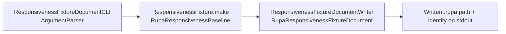

# RupaResponsivenessFixtureDocumentCLI

## Purpose and Scope

This module exposes the fixture document export as one dedicated process,
`rupa-responsiveness-fixture-document`, so the document a signed application is
measured against can be produced from a command line without a graphical
session.

- Design hierarchy: module.
- Parent: [RupaKit package design](../../DESIGN.md).
- Children: none.

## Responsibilities and Boundaries

| Owned | Not owned |
|---|---|
| Argument parsing, the destination path, and the process exit code. | The fixture, the document projection, and the verification. |
| Reporting the written document's identity so a later measurement can be attributed to it. | Deciding whether the reported identity matches a recorded baseline. |

## Related Designs

| Design | Relationship | Contract Used | Summary | Cautions |
|---|---|---|---|---|
| [RupaKit package design](../../DESIGN.md) | parent | Package composition and target index | Registers this executable as an upper-level measurement support target. | Production authority modules must not depend on it. |
| [RupaResponsivenessFixtureDocument design](../RupaResponsivenessFixtureDocument/DESIGN.md) | depends on | `ResponsivenessFixtureDocumentWriter.write` | Performs the projection, the write, and the verification. | The CLI must not report success the writer did not report. |
| [RupaResponsivenessBaseline design](../RupaResponsivenessBaseline/DESIGN.md) | depends on | `ResponsivenessFixture.Parameters`, `ResponsivenessFixture.make` | Builds the fixture the document is written from. | Fixture parameters must match the parameters the measured baseline used, or the document is not the measured content. |

## Architecture

## Contracts and Invariants

1. The process exits zero only when the writer reported a verified write. A
   failure at any stage propagates as the writer's typed error and a non-zero
   exit, so a script cannot mistake an unwritten or unverified document for a
   written one.
2. The printed content digest, body count, vertex count, and face count are the
   values the writer returned. The CLI does not recompute or reformat a measured
   count into a different number.
3. Fixture parameters not supplied on the command line are the fixture module's
   standard parameters, so an invocation without options writes the same fixture
   the standard baseline measures.
4. The written document identifies the same content as a recorded baseline only
   when this executable was built at the same optimization level as the binary
   that recorded it. The fixture digest is optimization-level dependent, a rule
   owned by
   [RupaResponsivenessBaseline](../RupaResponsivenessBaseline/DESIGN.md), so a
   document exported to stand for a Release-recorded baseline is exported from a
   Release build.

## Failure, Concurrency, and Constraints

The command is synchronous and single-threaded; the write, the reload, and the
verification all complete before the process reports its result. No failure
produces a partially reported success.

## Verification and Change Impact

The executable cannot be imported by a test target, so its invariants are
evidenced by the recorded export run rather than by a unit test, while the
projection and verification it delegates to are unit-tested in
[RupaResponsivenessFixtureDocument](../RupaResponsivenessFixtureDocument/DESIGN.md).

| Invariant | Required evidence |
|---|---|
| Exit code | The recorded run exits zero and produces the file, and a run against an unwritable destination exits non-zero without reporting a written document. |
| Reported identity | The recorded Release run's printed digest and counts equal the fixture values the recorded baseline report carries. A Debug run of the same sources reports the same counts and a different digest. |
| Default parameters | A run without options reports the standard fixture's body, vertex, and face counts. |

Changing the fixture parameters or the projection requires re-exporting every
document that is still cited as the content of an application-side measurement.
