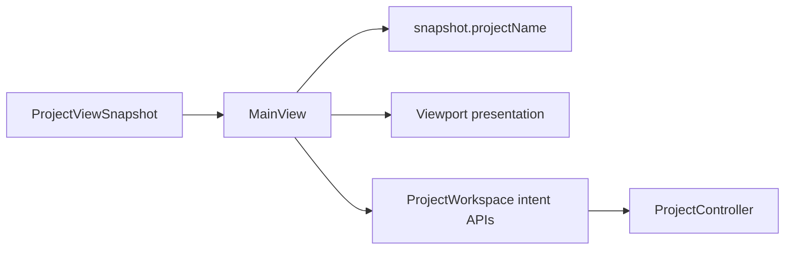

# RupaUI

## Purpose and Scope

`RupaUI` presents immutable `ProjectViewSnapshot` state and submits user intent
to the App-owned `ProjectWorkspace`. It is a child of the
[RupaKit package design](../../DESIGN.md) and has no child designs.

## Responsibilities and Boundaries

The module owns workspace presentation, viewport/UI interaction, and visible
project-title projection. It does not own project source, package persistence,
file URLs, application process authority, Agent transport, or a second mutable
document model.

## Related Designs

| Design | Relationship | Contract Used | Summary | Cautions |
|---|---|---|---|---|
| [RupaKit package](../../DESIGN.md) | parent | module dependency and authority direction | Places UI above the workspace snapshot. | UI must not bypass the workspace. |
| [Rupa App](../../../Rupa/Rupa/Rupa/DESIGN.md) | used by | application file lifecycle and composition | Supplies the App-owned workspace and file activation. | File names are not project-title authority. |
| [RupaKit integration](../RupaKit/DESIGN.md) | depends on | `ProjectWorkspace` and `ProjectViewSnapshot` | Publishes the exact view consumed by `MainView`. | Snapshot coordinates remain immutable evidence. |

## Architecture

## Contracts and Invariants

1. `ProjectViewSnapshot.projectName` is the sole navigation/window title input.
2. Empty project names display the bounded fallback `Untitled`; CAD metadata,
   file names, socket state, and Agent responses never replace a nonempty
   snapshot name.
3. `MainView` sends intent to its injected workspace and retains no source or
   package authority.
4. A failed application file activation leaves the prior snapshot and all
   visible UI derived from it unchanged.

## Runtime Flows

The application coordinator publishes a new workspace view only after
`ProjectController` accepts a load or transaction. `MainView` derives title and
viewport from that view in the same publication lifetime. Title projection
uses the published project name and has no dependency on CAD metadata.

## State, Ownership, and Lifecycle

SwiftUI owns transient presentation state. The injected workspace owns the
observable view; `ProjectController` owns source state and publication. The UI
does not retain security-scoped URLs or transport resources.

## Failure, Concurrency, and Constraints

UI state is MainActor-isolated. Project failures remain typed at their owning
boundary and are not converted into empty successful views. Title projection
performs no CAD, file, or transport reads.

## Verification and Change Impact

ACCESS-O.3 focused tests must verify title projection from a snapshot name and
the empty-name fallback, alongside successful `.rupa` load and failed
dirty/invalid activation preserving the same visible snapshot. ACCESS-O.4's
actual signed-App proof verifies the resulting window and viewport. No O.1
change adds or changes save-as behavior.
