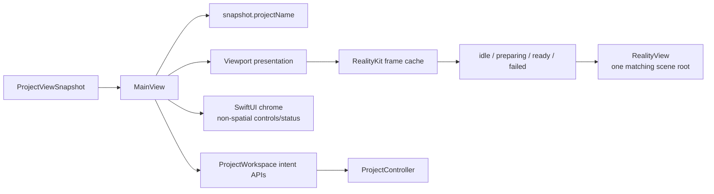
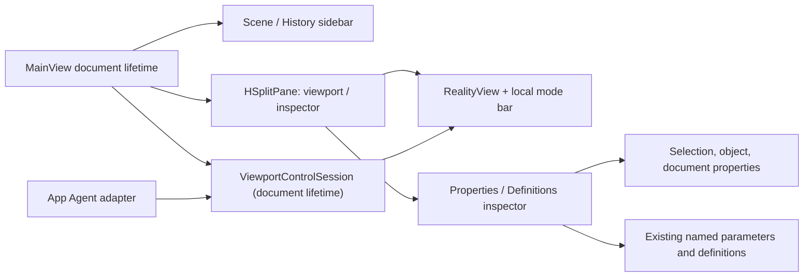
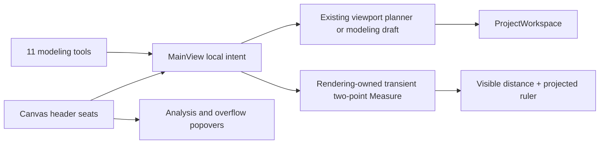

# RupaUI

Object placement callbacks await the existing workspace operation sequencer and
source publication, then return the published `ViewportSourceIdentity` to the
[Rendering handoff owner](../RupaRendering/DESIGN.md#continuous-source-updates).
They throw failures to that owner rather than returning before publication;
source storage, batch validation and Undo remain owned by ProjectWorkspace.

## Purpose and Scope

`RupaUI` presents immutable `ProjectViewSnapshot` state and submits user intent
to the App-owned `ProjectWorkspace`. It is a child of the
[RupaKit package design](../../DESIGN.md). Its CAD operation draft component is
[Modeling](Modeling/DESIGN.md), and its scene hierarchy component is
[Outliner](Outliner/DESIGN.md). Its presentation-only shading controls are
[ViewportShadingPanel](ViewportShadingPanel/DESIGN.md).

Production prepares snapshot-bound RealityKit frame values asynchronously and
mounts surfaces and world-space overlays in one native `RealityView`. SwiftUI
owns only nonspatial chrome and the screen-space selection marquee. Legacy
identity picking remains until RK-4, and RK-5/RK-IV own its removal and final
integrated acceptance. Source tests and builds remain distinct from signed-App
live acceptance; the latter must be recorded for the integrated application.

## Responsibilities and Boundaries

Workspace deletion is a native responder-chain command on the editor root;
the native Canvas also forwards both Delete key variants through its explicit
input callback. Both enter the same UI policy. Text editors consume their own Delete
keys. The command uses the existing keyboard policy and `deleteSceneNodes`
transaction; selection scope, locked/root refusal, source dependencies and Undo
remain owned by the existing UI/Core path. Native key-event tests and signed-App
Canvas/sidebar deletion followed by Undo verify delivery, not just router enums.

Inspector size fields map principal sketch-plane dimensions to model X/Y/Z in
both reading and writing. Core's source dimensions remain U/depth/V. Arbitrary
planes display U/Depth/V explicitly, not misleading Cartesian axis labels.
Placement transforms remain separate from source dimensions. Axis-permutation
tests must check evaluated geometry, not only property round trips.

Box face/corner resize intents follow the
[Rendering resize contract](../RupaRendering/DESIGN.md#responsibilities-and-boundaries).
The UI submits source dimensions and the compensating occurrence translation
in one Workspace transaction after validating the retained CAD revisions and
placement baseline. Publication acknowledgement and failure use the existing
viewport handoff; no separate mutable geometry or history is introduced.

Numeric Inspector interaction is owned by [InspectorInput](InspectorInput/DESIGN.md).
MainView captures the existing sequencer completion after synchronous numeric
submission. It coalesces only consecutive unstarted absolute edits from the same
control, retaining document-lifetime guards, error reporting and ordering barriers.

Body transform commits consume the occurrence-scoped batch defined by
[RupaRendering](../RupaRendering/DESIGN.md). Before producing any command, the
UI validates every retained node, local frame and parent world frame against
the current workspace snapshot. It submits all placements in one existing
source transaction, preserving atomic failure and a single Undo entry.
Object placement callbacks are available for CAD and authored Mesh selection;
exact CAD capability remains a requirement only for topology operations.
Rendering owns complete selection admission against the presented occurrences.
Translation, rotation and axis scaling use the same boundary. Cancellation
submits nothing. Verification includes stale ancestors and shared-feature
placements, not only callback receipt.

The module owns workspace presentation, viewport/UI interaction, visible
project-title projection, and observation of the RealityKit frame cache.
It does not own project source, package persistence, file URLs, application
process authority, Agent transport, geometry preparation, or a second mutable
document model.

## Related Designs

| Design | Relationship | Contract Used | Summary | Cautions |
|---|---|---|---|---|
| [RupaKit package](../../DESIGN.md) | parent | module dependency and authority direction | Places UI above the workspace snapshot. | UI must not bypass the workspace. |
| [Rupa App](../../../Rupa/Rupa/Rupa/DESIGN.md) | used by | application file lifecycle and composition | Supplies the App-owned workspace and file activation. | File names are not project-title authority. |
| [RupaKit integration](../RupaKit/DESIGN.md) | depends on | `ProjectWorkspace` and `ProjectViewSnapshot` | Publishes the exact view consumed by `MainView`. | Snapshot coordinates remain immutable evidence. |
| [RupaRendering](../RupaRendering/DESIGN.md) | depends on | Snapshot-matched RealityKit frame state, the native gesture refusal callback, and the published grid scale readout | Supplies a bounded ready frame or typed preparation failure, reports each native gesture refusal it judges reportable, and publishes the grid's resolved minor step and camera frame for the header to read. | UI never builds geometry, creates native resources, repairs a failed frame, re-derives which refusals are reportable, or restates the ruler's unit where the grid published its own. |
| [Modeling](Modeling/DESIGN.md) | child | Local CAD operation drafts and native parameter controls | Converts explicit selection and input into existing commands. | A draft is neither a source document nor an evaluated preview. |
| [Outliner](Outliner/DESIGN.md) | child | Snapshot-derived scene hierarchy and explicit user intents | Presents dense tree navigation, local disclosure/filter state, rename and selection actions. | It never owns or mutates Product source. |
| [ViewportShadingPanel](ViewportShadingPanel/DESIGN.md) | child | Native controls bound to `ViewportShading` | Updates the mounted rendering session through MainView. | No document or material mutation. |

## Architecture



The native workspace chrome is organized as two independent presentation
paths:



The viewport-side controls reuse the existing intent and mutation owners:



## Contracts and Invariants

Box Corner Inspector values are projected from the exact source through
[Core's Corner contract](../RupaCore/DESIGN.md), not stale stored property defaults.
Its slider is bounded by the maximum Core publishes for that body, because the
bound depends on which prism the kernel rounds and only the source knows that.
The Inspector never derives one from the dimensions it displays. A cylinder's
Hollow and Angle are read the same way, through
[Core's cylinder profile family contract](../RupaCore/DESIGN.md): each value
comes from the profile the body extrudes — the hole in it, and the turn its wall
sweeps — rather than from the stored property, and Hollow's maximum from the wall
that hole has to stay inside. Corner excludes both, and Core says so by
publishing a maximum of zero for whichever control the body cannot currently
take, so the Inspector collapses that control rather than offering a drag that
can only fail. Angle publishes no bound of its own: its range is the schema's
`[0°, 360°]`, and the sweeps Core refuses are the two endpoints of that range,
not a span of it.
Corner Sides remains a product display property consumed by Core's shared
evaluation-quality resolver; it does not change the CAD radius.

### Viewport-side tool routing

The left palette has twelve explicit routes. Activation may be a nonmutating
mode change; completeness means that the next required input, the resulting
state or command, and the applicable refusal and cancellation path are visible.
The palette does not own source state, perform rendering preparation, or bypass
`ProjectWorkspace`.

| Tool | Input and settings | Observable result | Failure and cancellation |
|---|---|---|---|
| Select | Selection scope and a viewport hit, or a drag on an object-scope transform gizmo | A hit changes the existing interaction selection and does not mutate the source; an object-scope body or sketch transform drag commits one scene-node transform command through Workspace | Unresolved or stale hits report a reason; a refused transform commit is a typed editor error that leaves the document untouched; choosing another tool or leaving object scope withdraws the gizmo route |
| Sketch | Click or drag, effective plane, snap, width and height | Rectangle sketch through the existing viewport planner and Workspace | Nonfinite or degenerate input is nonmutating; Select cancels before submission |
| Polygon | Click or drag plus side, sizing, inclination and optional face-cut settings | Polygon sketch, or the existing face split when a valid face is targeted | Invalid side/face/input reports a reason without mutation; Select cancels before submission |
| Circle | Click for a center, taking the active length or the scale default as radius, or drag from center to edge for a measured radius on the effective plane | Circle sketch through the existing planner and Workspace | Nonfinite coordinates, or a drag radius that is not positive, are typed refusals that mutate nothing; Select cancels before submission |
| Arc | Click or drag plus radius/span and plane settings | Arc sketch through the existing planner | Invalid or degenerate input is nonmutating; Select cancels before submission |
| Spline | Click or drag plus plane, snap and existing curve input | Spline sketch through the existing planner | Invalid or degenerate input is nonmutating; Select cancels before submission |
| Solid | Empty-space click/drag for a box, or a valid sketch target for extrusion | Existing box or profile-extrusion command through Workspace | Unsupported target/input reports a reason; Select cancels before submission |
| Sweep | Current ordered section/guide selection and the clicked path | Existing sweep command through Workspace | Missing or incompatible operands remain a typed visible refusal; Select cancels before submission |
| Surface | Current ordered profiles open the Modeling-owned Loft draft with sheet output enabled | Preview then Apply creates the existing sheet loft; the Circle Sketch route is not presented as Surface | Invalid operands stay in the editable form with a visible error; its native Cancel discards draft and preview |
| Mesh | Authored Mesh element selection, domain and existing Mesh operation fields | Existing Mesh preview/apply transaction and element overlay | Non-Mesh/CAD input explains Make Editable or required input; Cancel discards draft/preview and returns to Select; no Mesh-summary Logs detour substitutes for editing |
| Measure | Two explicit viewport points resolved from current snap, visible geometry, or the effective plane | Rendering-owned hover preview, native spatial dimension line/text and 3D world distance remain visible; source does not mutate | Unresolved depth/nonfinite or degenerate input shows the reason; Escape or another tool clears the transient result |
| Section | Clicked world position and effective construction-plane orientation | Existing construction-plane command preserves the clicked origin and plane normal, selects the created plane, and exposes existing section analysis/clipping | Unresolvable/nonfinite placement is nonmutating; Select cancels before submission |

The prior viewport behavior that treated Measure as a clicked-object
`MeasurementService` summary is superseded. Measure is two-point transient input
owned by [ViewportMeasurement](../RupaRendering/ViewportMeasurement/DESIGN.md).
MainView only selects the mode, forwards its active/status presentation, and
clears it on tool exit or authority replacement. It does not resolve depth,
calculate distance, retain endpoints, or invoke source measurement.

Ordinary object selection separately enables noninteractive projected rulers
for one unambiguous selected occurrence. Those rulers are explicitly labeled
World bounds, avoid the object and existing viewport chrome when a bounded
valid placement exists, and yield input to every tool. Ambiguous multiple
occurrences or an active modeling/Measure/Mesh interaction suppress them
rather than guessing a target or covering current work. This presentation
never implies exact edge length, area, volume, or local dimensions.

`WorkspaceCanvasOverlayHost` is retained only for screen-space SwiftUI chrome
and exclusions. RealityKit owns spatial world geometry. Every published
`ViewportCanvasOverlayExclusion.rect` is finite in the viewport content space
and remains invariant under ancestor or window offsets before `RupaRendering`
consumes it.

Chrome rectangles are layout output, and the host owns both how it reads
them and when they become workspace state. It reads each rectangle from a
layout-completion geometry callback on the chrome that owns it, never from a
preference bound into the host's own body. A bound preference would make the
host both the producer and the reader of one value inside a single update,
leaving the measurement with no owner outside the view that produced it. The
context panel's reserved height is derived
from that panel's measured rectangle rather than measured a second time,
because a second measurement of the same view carries the same number while
adding a second workspace value that changes in the same frame.

The canvas carries chrome on two edges and on no others. The tool palette
rides the leading edge and the context panel the bottom one. They share no
budget, because chrome on opposite edges never lands in one band, so each is
laid out as an independent overlay and neither can take height from the
other. The trailing side carries nothing at all: what used to float there is
now the canvas header, a real bar outside the canvas, which costs the canvas
no area, punches no input-exclusion hole in it, and cannot change its height
by appearing.

The host holds the rectangles it has been handed in a reference its own body
never reads, and publishes them to the workspace as one value on the
MainActor tick after the layout that measured them, replacing a publication
still pending when a newer value arrives. Held rectangles are layout output
rather than view state: they describe a layout that has already run, and no
view renders from them until they have been published. Keeping them out of
the view graph is an ownership rule, and this design does not claim it
removes any particular SwiftUI runtime issue. That
one value carries every chrome rectangle and the derived height together, so
the workspace state the viewport reads changes once per settled layout
rather than once per chrome. The deferral follows from where the value goes:
MainView stores what the host publishes and passes it straight back into the
`Viewport` occupying the host's content slot, whose fitting insets and
control-context identity derive from it, so the publication is an input to
the same subtree that produced the measurement. Publishing on the next tick
keeps the measuring pass and the write that depends on it in separate
passes. Chrome
that leaves the overlay withdraws its rectangle, because rectangles the host
holds outlive the view that produced them. Neither the rectangles nor the
derived height carries operation meaning and neither is a source input, so a
publication superseded before it runs is dropped rather than recorded as a
failure.

Tool title, help, selected value, input prompt and result status describe these
routes exactly. A one-shot or dialog route need not remain selected after it has
handed off to its existing draft, but it may not imply a canvas mode that cannot
produce its named result. Successful source changes retain the existing single
Workspace transaction and Undo behavior. Cancellation before publication does
not mutate source; an already published command is reversed only through Undo.

### The canvas header

One home per concern. The selection scope, the snaps, the working plane, the
viewport's own fit, display mode and shading, and the surface-analysis panel
stand once in a header bar above the canvas, always visible and always one
click. The selection readout, the active plane's name, the canvas scale
readout, the scale-fit prompt and the overflow button close the row. What is touched rarely -- saved-view
management, construction-plane rows, domain commands and scene counts --
waits behind the overflow button. Nothing is duplicated: a concern that has a
seat in the header has no second copy anywhere else in the workspace.

| Seat | Control | Identifier | Group |
|---|---|---|---|
| Scope | `WorkspaceSelectionScopeControl` | `WorkspaceSelectionScope.<scope>` | fixed |
| Snap | `WorkspaceSnapControl` | `WorkspaceSnap.grid`, `WorkspaceSnap.object`, `WorkspaceGrid.fixed`, `WorkspacePlane.twoDSnap` | fixed |
| Plane | `WorkspacePlaneModeControl` | `WorkspacePlane.<mode>` | fixed |
| View | fit, display mode and shading | `WorkspaceViewport.fit`, `.fitVisible`, `.fitSelected`, `.displayMode`, `.shading` | fixed |
| Analysis | the surface-analysis panel's button | `WorkspaceCanvasHeader.analysis` | fixed |
| Plane name | the active construction plane | `WorkspacePlane.activeName` | yielding |
| Selection | scope name and selection count | `WorkspaceTopBar.SelectionScope` | yielding |
| Scale | the grid's step and the camera's zoom | `WorkspaceScale.readout` | yielding |
| Scale fit | the fit prompt, while one is offered | `WorkspaceScaleFitPrompt` | yielding |
| Overflow | the canvas scale, views, planes, domain commands, scene counts | `WorkspaceCanvasHeader.more` | fixed |

The bar's height is declared and never measured from its content. The
selection readout, the plane name and the scale-fit prompt come and go with
the selection, the plane and the camera, and a bar whose height followed them
would move the canvas under the pointer every time one of them arrived. Width
is the dimension that can run out instead, and the header divides its seats
into two groups to say what happens when it does. Fixed seats are laid out at
the widths they declare and never shrink; `WorkspaceCanvasHeaderLayout` sums
those declared widths, and that sum has to fit inside the canvas column's own
declared minimum, which is the narrowest the canvas is ever laid out at.
Yielding seats are offered what is left and leave the row when it is not
enough, rather than push a fixed seat out: a chip compressed to an ellipsis
still carries its icon, its padding and its background, so a readout that only
truncated would keep a floor under the row. What leaves stays reachable: the
plane name, the scene counts and the canvas scale each have a row in the
overflow panel, so a reading that yields the row is still a reading the
narrowest window can get to.
Header controls are therefore icon-first:
a control that would have to carry a word to be recognised carries an icon
and says its name on hover instead.

The hovered header description appears below the header in a width-constrained,
multiline overlay. It consumes no control width, never truncates, and does not
move the control under the pointer. The existing hover owner supplies the text.

The window toolbar's status line is not the hint seat. It carries the newest
transient diagnostic, which is the instruction the user is being asked to act
on, and a pointer crossing the header would erase it. The header owns its hint
overlay independently of the tool palette's anchor preference. The readouts
and the scale-fit prompt report no hint of their
own -- they already carry their word, and the prompt is the one readout that
is an action, so a hint that replaced it would take away what the pointer was
reaching for.

Hover events between neighbouring seats arrive in no promised order -- the
next seat's entry can precede the last one's exit -- so `WorkspaceHoverHint`
is a guarded value: an exit clears only the hint the same control wrote, and a
stale exit cannot erase a newer neighbour's. The guard keys on the
accessibility identifier the control already publishes rather than on the
words it shows, so two controls that happened to describe themselves the same
way cannot clear each other and no second naming scheme is introduced. The
words are the string the control's own tooltip carries, keys included where
the control has one, so a seat cannot be named one way on hover and another
way in its tooltip.

The canvas scale readout says what the canvas is drawn at and only that: the
grid's resolved minor step, in the unit the grid resolved it in, followed by
the camera's zoom. What a document is set to is a different concern with its
own home -- the Document inspector's Units and Ruler sections own the preset
list, the fit-to-model action and the three tick lengths -- so a preset menu
behind this readout would be the second copy the header does not keep. The
badge that used to float over the canvas did keep one; that is why its menu
did not come to the header with its text, and why the smaller and larger
preset steps did not come either, being a walk along a ladder the inspector
lists whole. The snap step stays out for the same reason: it is the ruler's
minor tick, which the Ruler section already shows and edits.

The unit is the grid's, not the ruler's. `ViewportProjectedGrid` resolves
which unit a step reads best in, so a header that paired the ruler's symbol
with the grid's number could name one unit while showing another. Nothing is
reported until a step and a camera frame have both arrived, and no placeholder
stands in for either: a zero step or a flat 100% would be a reading, and there
is nothing yet to read. Once a step has arrived the last one stands, including
while a surface remounts and publishes none -- a readout that blanked on every
remount would report the remount rather than the scale, and the click that
places geometry already depends on that same step surviving one.

Both panels are popovers anchored to their own header button, not `Menu`s. A
SwiftUI `Menu` on macOS is an `NSMenu`: it keeps leaf buttons as menu items
and drops the stacks, frames and backgrounds around them, which is every
container the surface-analysis control, the saved-view rows, the
construction-plane rows and the domain command rows are built from. The
viewport's fit, display-mode and shading controls stay `Menu`s, because they
are buttons and nothing else. One optional `WorkspaceCanvasHeaderPanel` in
MainView says which panel is open, so opening one closes the other and
neither can be open twice. Opening, reading and closing a panel never changes
source, selection, camera, analysis settings or Undo history.

A popover's content is presented in its own window, so a test that mounts the
header reaches the header's seats and not a panel's contents. Each panel's
controls are therefore owned where they are declared -- as the control types
the panel presents -- and the header owns only that it offers the button that
presents them.

### Workspace keyboard and menu reach

`ModelingTool` owns what a tool is called, what it does, what it asks for
once it is picked, and which key selects it from a menu. The workspace holds
no second copy of those descriptions: the palette's hover name, its
accessibility hint, the Tools menu item and the line reported on activation
all read `title`, `summary`, `activationPrompt` and `menuKeyEquivalent` from
the Core value, so the same tool cannot be described one way on the canvas
and another way in the menu bar. `menuKeyEquivalent` is the ordinal of the
tool within `allCases` for the first ten tools and absent for the rest,
because ten digits are the whole budget a growing list can be given; a tool
without a key shows no key in either surface rather than an invented one.

`activationPrompt` states the input the tool still needs, and
`activateTool` reports it at `.info` when the tool becomes active. A tool
that returns to Select on its own after one use sets the tool without
reporting, because the report that matters at that moment is the result the
use just produced. Reporting is presentation only: no prompt changes source,
selection, or camera state.

The canvas keyboard is routed by `WorkspaceKeyboardRouter` alone. The router
is a pure function from one key and one context to at most one
`WorkspaceKeyboardAction`; MainView owns every state change the action
names, and the router reads no view state. A key the router does not claim
is reported unhandled so that it reaches whatever is presented above the
workspace, which is how the modeling sheet keeps its own Cancel.

Escape is the key every mode answers, and it backs out of one layer at a
time. A running command is the most likely thing the user means, so
dimension, slot profile, edge offset, region offset, slide, the pattern
array path pick and a pending view-aligned plane request are left first and
the selection they were working on survives. A modeling, Mesh or history
preview draft is next, because a draft opened by a tool that already
returned to Select is otherwise reachable only through the panel that opened
it. With nothing running the tool itself is the mode the user is stuck
inside, and only then does Escape mean the selection. Nothing left to leave
is unhandled, not handled-and-ignored, so the key still travels outward.
Escape while a dimension command is taking typed input stays that command's
own cancellation, which is decided before the general path is reached.

Digits 1 through 6 choose what a click selects. The scope is a mode that was
otherwise reachable only through six 25 pt icons, and picking a face and
then an edge of the same body is an ordinary sequence, so the trip to the
header costs more than the pick it precedes. `WorkspaceSelectionScope` owns
both directions of the mapping, so the router and the header cannot disagree
about which digit means which scope; the digits follow the order the header
already shows, which is `allCases`, and the seat's tooltip carries the digit
so the key is discoverable from the control it duplicates. The scope keys are offered only while Select is the active
tool and no command is taking typed input, because a numeric field would
otherwise lose the digits typed into it. Changing the scope changes no
source, and the header names the scope beside the selection count so that a
scope changed by key is visible where the scope icons stand.

Space asks for a construction plane from the current selection, and the
router always delivers the request. Whether a plane can be built is a
question about the selection that only the workspace can answer, and a
router that answered it first turned an unsupported selection into a key
that did nothing. `createConstructionPlaneFromSelectedTargets` now refuses in
the open, naming the selections it does accept -- one face, region or plane;
a face with an edge; several faces, regions and planes; or two or more
points -- so the refusal teaches the operand instead of hiding the key.
`WorkspaceKeyboardContext` consequently carries no construction plane
targets; the selection reaches the decision through the same
`WorkspaceConstructionPlaneTargetSelectionBuilder` the command itself uses,
once, inside the submission.

The Tools menu is presented by the App and the active tool lives in MainView,
so the two are joined by one focused scene value rather than by moving tool
state out of the view. `WorkspaceToolCommands` publishes the selected tool
and one `activate` closure through `FocusedValues`; MainView sets it on the
focused scene and the App's `ApplicationToolCommands` reads it to build the
menu. The menu owns no tool state, holds no default when no workspace is
focused, and reaches activation through exactly the closure the palette
button calls, so a tool cannot behave differently depending on which surface
started it. The menu is disabled rather than absent while no workspace is
focused, because the command list is part of the window's chrome whether or
not a document is open.

`WorkspaceKeyboardRouterTests` owns the routing decisions: the Escape action
and the conditions that suppress it, the digits that name each scope and the
commands that withhold them, and the plane request now surviving a selection
that cannot build one. `ModelingToolTests` owns that every case carries a
title, a summary and a prompt, and that exactly the first ten carry a key in
the tool palette's order. `WorkspaceTopBarPresentationTests` owns the scope name
beside the selection count. The order in which MainView unwinds Escape is a
view-local sequence over `@State`, and no package test reaches it; it is
recorded here and in the UI test review rather than claimed as verified.

### What the workspace says, and where the canvas stops

The workspace answers the user on three channels, and they stay three because
each has a different owner and a different lifetime. `CADDocumentStore` holds
the evaluator's `EditorDiagnostic` values in the document snapshot, which is
replaced whenever the document is evaluated or restored. `WorkspaceFailureLog`
holds every refusal and failure, ordered and never cleared by a view.
MainView's `transientDiagnostics` holds what the workspace itself just said —
the prompt a tool activation asks for, and the sentence that names why a key
refused. `reportToolStatus` is the only writer of that third channel, and it
records the non-`.info` ones to the failure log on the way, so a refusal
survives the sentence that displayed it.

Because the three are separate arrays, no writer overwrites another and
`EditorDiagnostic` needs no code to say which channel an entry came from. The
type keeps the meaning `Failure surfacing` gives it, and the newest thing the
workspace said is `transientDiagnostics.last` rather than a filtered search
through a merged list.

The transcript is bounded. It is appended to on every tool activation, and it
is now read on every layout pass, so its length is a contract and not an
accident: `reportToolStatus` keeps the newest
`MainView.transientDiagnosticLimit` entries and drops the rest. The failure
log, not this array, is the authority for what failed; dropping the oldest
sentence loses a view, never a record.

Those sentences reach the screen through two window-toolbar items in the
`.status` placement. `workspaceStatusMessageItem` carries the newest
transcript line, and `workspaceEvaluationFailureItem` carries
`EvaluationStatus.failed` for as long as the document will not build. They are
in the window toolbar rather than the canvas chrome because both describe the
document and the session rather than the view, and because a sentence is wider
than a badge: over the canvas it would cover the model it is talking about.
The message item is the one automatic route into the Logs pane — pressing it
expands the pane, and nothing else opens it on the user's behalf.

`WorkspaceChrome` owns how a severity looks, beside `workspaceStatusChip`,
which already owns the chip's shape:
`workspaceStatusSystemImage(for:)` and `workspaceStatusTint(for:)` are the
single mapping from `EditorDiagnostic.Severity` to icon and tint, so a prompt,
a refusal and a failure cannot read alike. `WorkspaceChromeControlMetrics`
owns the width a sentence is allowed, `statusMessageMaximumWidth`. Build state
is state and not a message, so the failure item reads its icon and tint from
`evaluationStatusSystemImage` and `evaluationStatusTint`, which describe the
document's status rather than a severity.

The canvas chrome and the canvas header carry what is about the model and can
be acted on where it stands. Three kinds of content therefore do not belong on
them. The project's own development notes are the first: an implementation
rating and the gate an area has not yet met describe this repository's
progress, not the user's document, and the user can neither act on them nor
dismiss them. Values a control beside them already carries are the second: the
ruler the canvas scale badge holds together with the menu that changes it, the
selection count the header carries beside the scope that explains it, the
visible and locked tallies the eye and the lock beside them already show, the
overlay the analysis toggles above it are already set to, and the node count
the outliner lists in full. Where such a control genuinely withholds the value
— the density buttons read "Low", "Std" and "High" and never the sample grid
those cost — the value belongs in that control's tooltip and not in a row of
its own. Values another surface both shows and edits are the third: a single
selected node's position belongs to the object transform inspector.

The eye and the lock in the selection strip act on the whole selection, so
neither may read its state off one member of it.
`WorkspaceSelectionDisplayAction` decides one state for the selection and
names it in the icon and the help; the buttons then give that state to every
node. A selection that mixes hidden and visible nodes hides, a selection that
mixes locked and unlocked nodes locks, and a second press undoes the first.

`WorkspaceSelectionDisplayActionTests` owns the single, mixed and reversing
selections. `WorkspaceChromeControlMetricsTests` owns the declared status
width. The toolbar items themselves are view-local composition over `@State`
and the document snapshot; no package test mounts them, so they are recorded
here and in the UI test review rather than claimed as verified.

### Sidebar symbols

`WorkspaceSidebarSymbol` is a stateless native SwiftUI platform adapter in this
module, shared by scene rows, history rows/actions, and definition/asset labels.
It renders SF Symbols at 13 pt regular weight, medium image scale, monochrome,
with an 11 pt glyph override for the Outliner's secondary state controls,
centered in a 20 x 20 pt slot. The caller owns semantic primary/secondary or
selected foreground styling and accessibility meaning. No asset lookup,
custom-drawn substitute, image stretching, scene mutation, or symbol cache is
introduced. Symbol identity belongs to each row's existing presentation owner;
the adapter knows only the supplied SF Symbol name.

The 13 pt glyph and 20 pt slot retain compact native macOS density. Disclosure
chevrons and generated-state badges intentionally remain smaller auxiliary
symbols. Existing row heights, indentation, drag zones, text truncation, and
command availability stay unchanged. This follows the existing Workspace naming
and native-platform adapter layout, not a separate design-system component tree.
`WorkspaceSidebarSymbolTests` verifies native symbol resolution, fixed rendered
dimensions, and nonempty unclipped glyphs in light/dark and selected appearances.
Live App checks own row alignment, disclosure, selection, and action hit targets.

### Workspace behavior

Viewport tool names appear immediately while hovering a tool palette button. `WorkspaceToolNameHint` is a SwiftUI presentation
adapter: each button owns its local hover flag and publishes its existing
title and bounds anchor; `WorkspaceCanvasOverlayHost` draws one noninteractive
screen-space name label outside the scroll containers, toward the RealityView.
Leaving or removing a button removes its hint. Hover never activates a tool,
changes source state, resizes the palette, or expands its hit region. Button
accessibility labels retain the tool name and accessibility hints retain the
longer operation description; a second delayed system tooltip is not layered
over the visible label. The label reuses compact chrome spacing, caption
typography, primary text and regular material in both appearances. App UI
hover tests own enter/leave, title, placement and stable button bounds; the
existing native palette test owns scroll and hit-region size.

`HSplitPane` owns the viewport/inspector division and user resizing inside
NavigationSplitView's detail column; the native inspector modifier is not
used. The split is mounted for the document's lifetime and the inspector is
added and removed as its trailing child, so the detail column presents one
split rather than alternating between a split and a bare viewport. The split
also owns how it divides its bounds between those columns. It applies the
opening width its caller declares once, when the arranged column count
changes, and on every later layout pass it only clamps the division it has
redistributed into the declared minimum and maximum. A column that is laid out
at a different size than the one its opening width was applied at is therefore
rescaled with the split, and a declared minimum and maximum that differ are
the allowance that rescaling drifts inside. A column whose width must not
follow the window declares one width for all three, so that every layout pass
re-pins it. The width is declared on the pane and never on the pane's content:
a fixed width inside the column only centres the content in whatever column it
was handed, so inspector content still fills its column and names no width of
its own. Every native split must keep its arranged columns within its own
bounds and the host window.

The inspector column's width is declared in one place, `editorDetailPane`, as
a single 320 pt for the opening width, the minimum and the maximum. 320 pt is
the widest the sidebar column is allowed to be, so the inspector reads as a
second column of the window's chrome rather than as a second half of it.
Declaring one width rather than a range is what holds it there: the column
keeps that width while the window is resized, and withdrawing the inspector
and adding it back reopens it at the same width. The divider consequently does
not resize the inspector; it only marks the boundary the canvas reaches. The
declared width measures from the split's trailing edge to the leading edge of
the divider, which is where the split puts the number it is given, so the
column itself measures the declared width less the divider's thickness. This
width and the canvas column's declared minimum may change only together, and
only while their sum still fits inside the window's own minimum width.

Visible labels and displayed values never use ellipsis truncation. Inspector
labels reserve 112 pt and wrap vertically; values wrap within the remaining
column. Lists and panel rows grow with their text rather than imposing a fixed
height. Compact controls retain their intrinsic text width or wrap, while
editable fields keep native scrolling/editing behavior. Tooltips and accessibility
strings supplement visible text and are not substitutes for it. Native layout
tests cover long Latin and Japanese labels at the minimum column width, and
the signed App verifies the shared Document/Scene/Evaluation rows visually.

The detail column's size is owned by the proposal NavigationSplitView hands
down. No view between that column and the canvas host may measure the size it
has been given and feed that measurement back into its own subtree as a
frame. A measured size is one pass behind the proposal that produced it, so a
frame derived from it can hold a child at a size its parent has already left,
and one subtree is then laid out at two different sizes inside a single pass.
The split therefore takes the proposal directly, the viewport accepts the
remaining width without imposing a competing minimum width, and inspector
content consumes its pane's width with only its existing horizontal padding,
without measuring, storing, or independently fixing the list width. The split fills the detail column regardless of the active
inspector's intrinsic height or the Logs expansion state; individual forms do
not own this guarantee. Logs visibility is user-owned transient presentation
state. Its initial value is collapsed unless an explicit
construction/restoration input selects otherwise; after construction, only the
existing Logs header and toolbar controls may open or close it. Source
commits, diagnostics, tool activation, status reporting, preview results, and
errors append or replace their existing diagnostic values without changing
visibility. Collapsing Logs never clears those values, changes operation
behavior, or suppresses status, and opening it later presents the same stored
diagnostics. This uses the existing binding and controls rather than a second
visibility owner or automatic-reveal policy. NavigationSplitView may overlay
its sidebar; containment checks use each column's frame, not the sum of
potentially overlapping column widths. Content fills the column the split
hands it at the width declared above, and imposes no separate maximum of its
own inside that column. Properties and Definitions
share an 8 pt horizontal inset; existing section and control padding remains
unchanged. The inset follows the compact native spacing tier, while column
widths follow the existing control fit requirements rather than the decorative
spacing scale. Active modeling, history preview, and Mesh tools keep the
inspector presented using the existing presentation condition; the toolbar
changes only the user's visibility preference, never operation state. Native
MainView layout tests cover initial width and vertical window resize without
document mutation. They require the detail split to reach the host's bottom
edge and its panes to occupy the full split height. Signed-App checks
separately own Surface/Mesh tool transitions, Logs expansion, divider and tab
use.

The object inspector follows the [Core scene placement convention](../RupaCore/DESIGN.md#scene-placement-matrix-convention).
Each inspector visibility, lock or material choice submits all selected nodes
in one source command array through MainView's existing transaction boundary.
The choice either commits in full with one Undo entry or leaves source and
history unchanged. The view emits intent once, not once per selected node;
busy controls cannot submit another property mutation. Picker Binding tests
verify the emitted batch and Workspace publication, rollback and Undo/Redo.
Native control activation has no test owner while the App UI runner stays
retired; it is a manual check in the UI test review.
XYZ rotation, translation and scale preserve the remaining components,
including the shear owned by Core's affine placement convention. The inspector
shows retained XY/XZ/YZ shear values rather than hiding all numeric controls.
Unsupported matrices show an explicit error rather than editable fake values.
No old column-major compatibility controls or layout-detection path remain.

Inspector property edits are live: each valid value change submits its intent
to the existing serialized Workspace source boundary without a Preview/Apply
step. Object transform controls retain no private transform draft. MainView
captures target identities, then resolves the edited component against the
latest snapshot inside that boundary so queued edits cannot restore stale
values of other components. One accepted edit affects all targets atomically
and is undoable. Locked or missing targets and invalid transforms fail without
partial publication; failed edits keep the last published values. Modeling
operations that create geometry retain their separate Preview/Apply contract.

Verification must exercise control intents through actual Workspace publication
and presentation transforms, not just affine arithmetic or control existence.

### Object editing authority

```text
Canvas placement / Inspector local TRS / Inspector world Center
    -> WorkspaceTransformMatrix command admission -> Workspace -> localTransform
Canvas dimension / Inspector source Size
    -> setObjectDimension -> Core source resolver -> CAD source
published source -> occurrence presentation -> center measurement (not source size)
```

`WorkspaceTransformMatrix` is the common UI placement command boundary. Canvas
baselines are validated before admission; numeric components are resolved from
the latest serialized document. Both refuse locked/missing nodes and preserve
unmodified affine components. A drag preview remains a non-authoritative
projection of its baseline; cancellation never writes source.

Shape Center is the world-space bounding center of the addressed occurrence,
not the first occurrence of its feature. Editing it translates that occurrence
by the measured world delta using the same parent-frame algebra as the gizmo.
No translation is added a second time. Transform controls explicitly name
their parent-local coordinate system. Shape Size is a source dimension resolved
by Core, independent of placement, scale, rotation, shear and render bounds.
Its edit uses the same `setObjectDimension` command as Canvas dimension input;
it preserves source profile origin/plane, not a UI-only center-pinning rule.
Shared source edits affect every occurrence; placement edits affect only the
addressed node. Unsupported source dimensions are not inferred from pixels.
Missing evaluated occurrences are explicitly unavailable for Center editing;
source properties remain usable. Invalid dimensions surface errors, not values
that could overwrite source. Center reads the published universal viewport's
world bounds and occurrence-to-node mapping; it never rebuilds or evaluates a
legacy scene inside an Inspector update.

Schema-declared object properties reach the canvas through the effect the Core
schema declares for each one. The Inspector offers a control for a property
whose effect is `source`, `tessellation`, or `appearance`, and shows a value row
for a `derived` property. It infers nothing about reachability from the property
identifier, so a schema change is the only thing that changes which controls
exist.

A numeric bound Core publishes is the control's range, not a refusal the person
discovers by dragging. The all-edge corner maximum comes from Core's own
resolution of which prism the body is, and a cylinder's hollow maximum from the
same place, so a control stops where the document stops. Where two properties
exclude each other, each publishes a maximum of zero while the other is
positive: a hollow or swept cylinder's corner control and a filleted cylinder's
hollow control both collapse to zero rather than refusing every drag, and the
person clears one before authoring the other. This surfaces the Core contract
`The cylinder profile family` states; the Inspector derives no bound of its own.

Continuous edits stay live without racing the document. A slider drag enqueues
through the workspace operation sequencer, which replaces a pending, not yet
started absolute-value edit for the same control and never cancels work already
running. A text field commit and a material edit enqueue as ordinary operations.
The control is released to the next value when the workspace acknowledges the
revision it submitted, so the canvas follows the pointer without the field
fighting the published document.

An appearance edit on a node that names no material creates one and assigns it
in the same submission, so the color well is operable on any body and the edit
is a single undo step.

`WorkspaceObjectEditingSSOTTests` owns real Workspace publication/Undo and
cross-adapter tests for parent frames, shear, shared features, invalid inputs and
source-size invariance. It also proves that a cylinder publishes the corner
radius bound Core resolves from its own prism rather than one the Inspector
derives from the dimensions it displays: the bound is positive and below half
the shortest displayed dimension, applying it changes the viewport without
changing the dimensions, and half the shortest dimension is still refused.
Existing Rendering gesture tests own preview/cancel and world-axis measurement.
No new authority, cache or preview lifetime is added.

Consecutive object-transform intents with the same document lifetime, ordered
target IDs and component replace only the last unstarted intent in the existing
operation sequencer. There is no debounce timer and no cancellation of an
executing source transaction. A different key or any ordinary operation seals
that slot, preserving component order, selection, save and Undo boundaries.
Each executed value remains an atomic, undoable Workspace transaction; replaced
values never become source authority or history entries. The pending slot is
MainActor-owned and retains one closure regardless of the input burst length.
Tests suspend an executing operation, submit a burst, and verify final-value
delivery, barriers, latest-snapshot rebasing, failures and Undo. This bounds
obsolete queued work; it does not establish a GPU frame-latency guarantee.

1. `ProjectViewSnapshot.projectName` is the sole navigation/window title input.
2. Empty project names display the bounded fallback `Untitled`; CAD metadata,
   file names, transport state, and Agent responses never replace a nonempty
   snapshot name.
3. `MainView` sends intent to its injected workspace and retains no source or
   package authority.
4. A failed application file activation leaves the prior snapshot and all
   visible UI derived from it unchanged.
5. A new viewport snapshot starts preparation through the RealityKit frame
   cache and renders only a matching `ready` scene root. `preparing` and typed
   `failed` states remain explicit; neither displays stale geometry as current.
6. UI code performs no tessellation, Mesh validation, world transformation, or
   native resource construction. RealityKit projects and draws the prepared
   spatial graph; SwiftUI draws only bounded non-spatial chrome and screen-only
   selection marquee content.
7. Viewport teardown releases the cache, cancels its build task, and discards
   every late completion; no render task or plan is retained by stale UI.
8. The sidebar exposes Outliner and Feature History as explicit navigation
   segments. Both segments read the same immutable snapshot; selecting a row
   routes through existing selection callbacks and does not mutate source state
   directly. The Outliner owns only transient disclosure, search/filter, and
   inline-edit draft state; accepted changes cross the existing Workspace
   transaction boundary.
9. The inspector is visible by default and always provides Properties and
   Definitions tabs, including when there is no selection. Properties reuses
   the existing selection/document inspectors; Definitions reuses the existing
   named-parameter editor. A tab change never changes selection, WorkspaceState,
   source commands, persistence, or undo history.
10. `MainView` creates one document-lifetime `ViewportControlSession`. The
    session owns camera, projection, display mode, mount identity, and a
    monotonic revision. The identical session is passed to whichever published
    or preview `Viewport` is active; presentation state is not stored in a
    project snapshot. `onViewportMount(documentLifetimeID, session)` registers
    that session with the App, while `onViewportUnmount(viewportInstanceID)`
    invalidates the active viewport token.
11. The canvas header is always present and displays fit actions
    (`Fit Visible Objects`, `Fit Selected Objects`) and a four-case display
    menu (`Solid`, `Solid + Mesh Edges`, `Wireframe`, `Normals`). It stands
    above the canvas rather than over it, so it covers no part of the viewport
    and reserves no exclusion in it. It may also display existing selection and
    scale status, but it does not become a source or evaluation command
    surface.
    Wireframe and normals describe the source face presentation rather than
    exact B-rep geometry; normals use RGB direction encoding.
12. The viewport measures the size actually allocated by the native split pane.
    Divider drag limits belong to the split container; its child must not impose
    a wider minimum frame that makes camera fitting target an obscured region.
    The viewport root fills that complete allocated rectangle in every
    preparation state, and native content, input, and chrome share its coordinate
    space; padding belongs inside that rectangle rather than reducing its width
    or height.
13. Outliner moves carry captured document generation into `submitSource`.
    MainView rejects a generation mismatch before planning the single Core move
    command; Workspace independently checks transaction/publication coordinates.
    A replacement document recreates the Outliner and its private drag lifetime.
14. The canvas header opens native shading controls beside display mode.
    MainView forwards edits to `.setShading` on the same session used by the
    renderer. It never submits a source transaction for presentation settings.
15. The Rendering-owned central camera strip (`ViewportAxisTriad`) remains at
    the bottom of the RealityView. Its orientation menu (`Isometric`, `X Front`,
    `Y Front`, `Z Front`), two-case lens picker (`Ortho`, `Persp`), and `Reset
    Pan and Zoom` are real controls bound through MainView to the same
    `ViewportControlSession`; no static label may imply an unavailable action.
16. Orientation and lens are independent. Selecting an orientation preserves
    lens; selecting Ortho/Persp preserves orientation, pan, zoom, display mode,
    and shading. Ortho-to-Persp selects the Rendering-owned standard perspective
    field of view, while an already restored perspective lens keeps its exact
    field of view. Reset changes only pan and zoom.
17. Saved views use the existing Core schema without a compatibility model.
    Parallel capture stores orthographic target-plane height. Perspective
    capture stores the exact field of view and camera distance; restore converts
    distance and field of view back to target-plane height and restores the same
    lens. Camera framing must carry projection when reconstructing a camera and
    may not silently fall back to parallel. MainView stores the optional current
    camera frame emitted by Viewport and disables Save Current View and saved-view
    update while it is absent. A failed perspective capture never reuses an old
    frame or persists a parallel default. A typed restore failure remains visible
    and leaves the current session unchanged.
    MainView sends one camera-frame request and treats
    `onCameraFrameRequestResult` as the applied-state receipt; it does not send a
    second lens request or report success before the Rendering session applies
    camera, basis, and lens. The existing ruler update is a separate earlier
    Workspace operation and is not part of camera-session rollback atomicity.
18. A workspace source route carries only source-mutating commands, so
    `submitSource` is not the route for a command that mutates nothing.
    `EditorCommand.validateDocument` is the only such command, and in Core it
    evaluates the current document and republishes its diagnostics; the toolbar
    Validate button therefore asks `ProjectWorkspace` to evaluate the published
    snapshot again rather than staging a transaction that a source transaction
    must reject. The button reports the counts the new publication carries as
    progress even when the document it evaluated has errors, because the errors
    belong to the document and reach the Issues readout through the republished
    snapshot, while the [failure record](#failure-surfacing) means the operation
    itself failed. The retired `AppOperationCoverageUITests` owned that
    contract from the shipped control; no test owns it from the control
    now, and the scenario is recorded as history in
    [the UI test review](../../Tests/UI_TEST_REVIEW.md). The transaction's
    own mutation-only rule stays with
    [RupaProject](../RupaProject/DESIGN.md).

## Runtime Flows

Camera receipts retain their latest complete frame for saved-view commands in
`WorkspaceViewportCameraState`. Workspace chrome observes only readiness;
`WorkspaceCanvasScaleReadoutView` observes zoom locally. Pan and zoom must not
invalidate the Inspector or rebuild split-pane constraints. The mounted latency
test in `WorkspaceInspectorLatencyTests` and observation test in
`WorkspaceViewportCameraStateTests` verify this boundary.

The application coordinator publishes a new workspace view only after
`ProjectController` accepts a load or transaction. `MainView` derives title and
viewport from that view in the same publication lifetime, then lets
`RupaRendering` prepare a matching RealityKit frame outside `MainActor` where
the native API permits. Only a completion matching the current snapshot,
viewport revision, and overlay revision replaces the mounted root. Title
projection uses the published project name and has no dependency on CAD
metadata. The document-lifetime content mounts its session before a viewport
supplies its geometry context. Viewport gestures and Agent commands call the
same throwing session operation; an acknowledgement means the MainActor state
was applied, not that a RealityKit frame has completed display. Replacing the
document creates a new session and invalidates the old viewport instance ID.

## State, Ownership, and Lifecycle

SwiftUI owns transient interaction and render-cache observation state. The
`ViewportControlSession` owns camera, projection, display mode, revision, and
the currently mounted viewport context. The RealityKit frame cache owns one
cancellable build task, newest pending request, and matching result;
the injected workspace owns the observable view; `ProjectController` owns
source state and publication. The UI does not retain source authority,
security-scoped URLs, or transport resources.

## Failure, Concurrency, and Constraints

UI state and RealityView composition are MainActor-isolated; frame descriptor
and bounded resource preparation is not where the native API permits. Project
and render failures remain typed at their owning boundaries and are not
converted into empty successful views. MainActor work is bounded by admitted
resources and spatial entities. Title projection performs no CAD, file, or
transport reads.

### Failure surfacing

Every failure a workspace control refuses on is appended to
`WorkspaceFailureLog` before any view shows it. The log is a process-wide,
MainActor-isolated, ordered, bounded, non-deduplicating record. Each entry
carries a timestamp, the operation that failed, the reflected error type, the
reflected error value, and the message the control displays. Because typed
errors in this repository describe themselves through `message` alone, the
reflected value is what preserves the `code` and the concrete error type that
`localizedDescription` drops. Each entry is mirrored to
`Logger(subsystem: "RupaUI", category: "WorkspaceFailureLog")`, so a manual
session can be reconstructed from the unified log after the window is gone.

The red inline text, the Outliner alert, and `modelingPreview.errorMessage`
are transient views of the most recent record, not the record itself. A new
run, a Cancel, or a selection change clears the view and never clears the
log. The log is the authority for what failed; a surface is the authority
only for what is visible right now.

Refusals that carry no `Error` value, where a guard discards a user gesture,
are recorded through the same API with a message naming the unmet
precondition. Two guards stay silent by contract: a viewport hit whose
`snapshotID` is older than the mounted frame is frame readiness rather than a
refusal, and re-entrancy or token-mismatch guards describe no user operation.
`WorkspaceObjectTransform.componentsError` and `Modeling.refusal` are also not
appended, because each is a function of the current selection or draft
evaluated while the view is being built, not an event, and appending would
mutate state during a view update. A control whose refusal the view can
evaluate that way is disabled with the reason beside it, so the refusal is
read before the press instead of recorded after it, and the record keeps its
meaning: something ran and failed.

Opening a document whose object schema has retired a stored property value is
reported on the same channel. It is not a refused operation: the document
opened. It is an irreversible loss, because the next save writes the document
without the value, so the person who opened it is told once, as a warning,
naming each object and property. The [RupaProject design](../RupaProject/DESIGN.md)
owns what was retired and carries it on every state of the opened document;
this module owns only the sentence and its timing. The report is keyed to
`documentLifetimeID`, which changes on every open, so reopening the same file
reports again and an edit within one open does not. It is recorded to
`WorkspaceFailureLog` for the same reason every other entry is: the sentence is
transient and the loss is not.

`EditorDiagnostic` keeps its existing meaning, a fact about the document or
its evaluation, and is not extended to carry UI failures. It crosses the
Agent wire through `AgentSemanticDiagnostic` and
`AgentProjectViewCoordinates`, so its shape is a protocol rather than a UI
detail. `EditorDiagnostic.stableMerged` also deduplicates by severity, code,
and message, which would hide a failure that repeats. The two lists stay
separate and the Logs pane presents recorded failures above diagnostics.

Native viewport gestures are refused inside `RupaRendering`, which owns what
counts as reportable there. `Viewport` reports each such refusal through the
refusal callback this module binds, and the callback records the `Error` the
same way every other workspace failure is recorded, so a drag that ends in a
refusal leaves an entry rather than only an os_log line. The record names
`Viewport.nativeGesture` as the operation, because the binding closure is not
the control the user pressed and its declaration name would say nothing about
which channel fired. The frame-readiness exclusion stays where the decision
lives: `RupaRendering` filters a transient query before the callback, so this
module never re-derives that rule, and a gesture the user supersedes by
releasing a route is a cancellation rather than a refusal and is not reported.

## Verification and Change Impact

### Non-interfering local verification

Routine local verification uses `scripts/test-ui-contracts.sh`. Its explicit
selection exercises production drafts, bindings, transactions, hidden native
layout, hit routing and RealityKit/Metal behavior. Test windows may exist but
must never be ordered, made key or activate the application. Synthetic events
are delivered only inside the test-owned view hierarchy, never to the system.
The foreground `RupaUITests` target is retired and its sources are deleted,
not silently skipped. Its scenarios are owned by the automated/manual coverage
map in the UI test review. Evidence below that a retired scenario once produced
is history, not a runnable route.
Adding a test requires inspecting its transitive helpers for desktop effects.
Zero executed tests, missing requested tests, skips and failures are not success.

Visual layout, hit testing and native activation remain separate evidence,
obtained through narrowly scoped direct agent inspection. Hidden host tests
prove only the in-process hierarchy, not OS focus, menus or save panels.
Historical App UI evidence below is not
current-snapshot acceptance and is not an instruction to run screen automation.
No test may hide other applications to satisfy a screen precondition.

Review findings and the coverage boundary are recorded in
[the UI test review](../../Tests/UI_TEST_REVIEW.md).

Direct agent UI inspection checks a shipped
control whose refusal the view can evaluate and reads back three facts together: the control is disabled, the
reason is displayed beside it, and the Logs pane count has not moved. That is
the behavioral proof that a refusal the panel can see is read before the press
and never becomes an entry.

No shipped control is left that refuses deterministically once it is pressed,
because a control that can see its own refusal now disables itself, so there
is no focused test that can read a record back out of the pane. The recorded
half is evidenced instead by the shipped-chrome failure sweep, which drives
every published control against a document that has geometry and reads
whatever the workspace recorded out of the pane, and by
`WorkspaceFailureLogTests`, which owns the log's ordering, bound, reflected
value and non-deduplication.

Native gesture routing also has mounted-window fixtures in
`ViewportNativeObjectAffordancePressTests`; these are included in routine
non-interfering checks after their hosts were migrated to never-ordered windows.
The replacement script proves mutation, transaction behavior and the selected
hidden native input paths. Visible error delivery remains direct inspection.

That sweep has run. `AppProjectRoundTripUITests` drove create, select, face
edit, save, and reload against the shipped chrome with recording on, and read
the scene rail before each launch ended: "0 failures, 0 errors, 0 warnings, 1
info" after the save and "None" after the reload. It exercised no gesture
refusal. The one canvas drag that run carried started on a body face marker,
which is not a transform-gizmo station, so the press took the
selection-rectangle path and never reached the affordance route the funnel
serves; that leg is not part of the committed test. The channel is therefore
unexercised by the sweep, and its wiring still rests on source review and the
package build.

Exercising it from shipped chrome would need two things that do not exist
today. A gizmo station would have to publish where the frame drew it, the way
`RupaRendering` publishes the construction-plane handles, because a press
aimed anywhere else routes elsewhere. And the gesture would have to be one the
frame refuses for a permanent reason: a drag that succeeds commits and reports
nothing, so reaching the funnel means provoking a refusal rather than
performing a move. Both are conditions a later exercise would have to arrange,
not work this design schedules.

Focused tests must verify title projection, matching
idle/preparing/ready/failed state, stale/teardown completion rejection, and
bounded RealityKit frame publication alongside
successful `.rupa` load and failed dirty/invalid activation preserving the same
visible snapshot. Outliner component tests additionally verify ancestor-
preserving filters, disclosure state, selection-aware context actions, rename
commit/cancel, generated-output refusal presentation, and forwarding Frame to
the mounted viewport session. A MainActor progress probe and the actual signed-App
multi-body run must verify the window, viewport, interaction, and Agent response
remain live. No change adds or changes save-as behavior.
Live framing verification includes the initial narrow split with the inspector
visible, proves ordinary source/tool/error/status routes leave Logs collapsed and
the Canvas height unchanged while retaining their diagnostic values, then uses
the existing header/toolbar control to open and close Logs and preserve a usable
mounted camera.
Central-control tests invoke each orientation and lens callback, verify the
session snapshot and revision, prove reset preserves lens/orientation, and cover
accessible labels and disabled state while no viewport is mounted. Saved-view
tests round-trip both lens modes, including a non-default valid perspective field
of view and distance. Signed-App acceptance observes a visible perspective size
difference across depth and reads the same effective lens through the viewport
API; static text and callback-only tests are insufficient.
Saved-view UI tests also prove an absent current frame disables create/update,
restore failure is visible and non-mutating, and no fallback frame reaches a
workspace command.
Chrome publication timing has no in-process fixture. `MainView` and
`WorkspaceCanvasOverlayHost` hold the state privately, and a same-frame
re-entry is not visible in any value either view exposes: the rectangles that
reach `RupaRendering` are identical whether they arrived once or twice. That
signal lives outside the process. A launch and quit of the built app must
produce no `com.apple.SwiftUI:Invalid Configuration` runtime issue naming a
chrome geometry value or the viewport control-context identity, read from the
process log for that window, and the same window must carry RealityKit engine
entries showing the launch reached a mounted viewport rather than failing
before the chrome was laid out.

A launch cannot show that anything was measured, because a host that
publishes nothing also raises nothing. Delivery is proved in process instead:
mounted in an `NSWindow` with a visible context panel, the host publishes two
canvas-local rectangles -- the tool palette's and the context panel's -- and a
reserved height equal to the context panel's own measured height. Neither check is sound without the other.

### UI operation ownership

The workspace exposes twenty-seven operations that change the model: twelve
canvas tools, ten Model drafts and five Mesh drafts. The canvas header's own
controls change how the model is viewed, scoped and snapped rather than what
it is, and they are listed after those rows. Each row names the control a user
clicks and the test that owns that control's contract, and records what the
evidence for that operation actually covers. A package test owns the command a
control produces. Nothing owns the fact that the shipped control reaches it:
the App UI runner is retired, so that half of every row is currently unowned.

| Family | Operations | Control identifier | Owning test | Evidence |
|---|---|---|---|---|
| Canvas tool | `sketch`, `polygon`, `circle`, `arc`, `spline`, `solid`, `sweep`, `section` | `CanvasTool.<case>` | `WorkspaceCanvasCommandPlannerTests` | lower-layer verified |
| Canvas tool | `surface` | `CanvasTool.surface` | `WorkspaceCanvasCommandPlannerTests` for the canvas refusal, `ModelingOperationDraftTests` for the sheet loft it defers to | lower-layer verified, nothing committed from the canvas |
| Canvas tool | `select` | `CanvasTool.select` | `WorkspaceCanvasCommandPlannerTests` for the absent canvas command, `ViewportBodyTransformInputTests` and `ViewportSelectionDragFrameReadinessTests` for the gizmo drag | lower-layer verified |
| Canvas tool | `measure` | `CanvasTool.measure` | `ViewportMeasurementTests`, `WorkspaceMeasurementPresentationGateTests` | lower-layer verified |
| Canvas tool | `mesh` | `CanvasTool.mesh` | `WorkspaceCanvasCommandPlannerTests` for the absent canvas command, `MeshOperationDraftTests` and `ModelingAndMeshOperationCoverageTests` for the element route | lower-layer verified |
| Header seat | Selection scope | `WorkspaceSelectionScope.<scope>` | `WorkspaceSelectionScopeTests` and `WorkspaceCanvasHeaderSeatNativeTests` for the seat's declared and mounted width | lower-layer verified |
| Header seat | Snap toggles | `WorkspaceSnap.grid`, `.object`, `WorkspaceGrid.fixed`, `WorkspacePlane.twoDSnap` | `WorkspaceCanvasHeaderSeatNativeTests` for the seat's mounted width | lower-layer verified |
| Header seat | Working plane mode | `WorkspacePlane.<mode>` | `WorkspaceCanvasHeaderSeatNativeTests` for the seat's mounted width | lower-layer verified |
| Header seat | Viewport fit, display mode and shading | `WorkspaceViewport.*` | none | unverified |
| Header panel | Surface analysis overlay and sample density | `WorkspaceCanvasHeader.analysis` presents `WorkspaceSurfaceAnalysis.<option>` and `.density.<density>` | none | unverified |
| Header panel | Saved views | `WorkspaceCanvasHeader.more` presents `WorkspaceSavedView.*` | the `workspaceSavedViewBuilder*` tests in `RupaUIPackageTests` | lower-layer verified |
| Header panel | Construction-plane rows, domain commands and scene counts | `WorkspaceCanvasHeader.more` presents `WorkspacePlane.*`, `WorkspaceDomainCommandList`, `WorkspaceScene.bodies` and `.issues` | none | unverified |
| Header readout | Active plane name and selection | `WorkspacePlane.activeName`, `WorkspaceTopBar.SelectionScope` | none | unverified, read-only |
| Header hint | The description of the seat the pointer is on | `WorkspaceCanvasHeader.hint` | `WorkspaceHoverHintTests` for the guarded value | the value is verified, the hover that drives it is not |
| Model draft | box, cylinder, sphere, extrude, revolve, sweep, loft, boolean, fillet, chamfer | `Modeling.begin.<title>` | `ModelingOperationDraftTests`, `ModelingAndMeshOperationCoverageTests` | lower-layer verified |
| Mesh draft | translate, position, extrude, delete, addFace | `Modeling.mesh` panel | `MeshOperationDraftTests`, `ModelingAndMeshOperationCoverageTests` | lower-layer verified |

Three statuses classify the rows. Lower-layer verified means a package test
owns what the operation produces and nothing drives the shipped control that
reaches it. Source-audit verified means a package test reads the shipped
sources for a claim no runtime test can observe. Unverified means no test of
either kind reaches the operation. No row can claim GUI evidence while the App
UI runner stays retired; the scenarios that once carried it are recorded in
[the UI test review](../../Tests/UI_TEST_REVIEW.md). No row is broken in the
sense of an observed failure, and structure alone does not
license the stronger claim that nothing is broken, so every row carries an
evidence state rather than a verdict.

The canvas tool rows rest on a compositional argument rather than on per-tool
GUI evidence. `WorkspaceToolPalette` builds canvas buttons from
`ModelingTool.allCases` and operation buttons from
`ModelingOperationDraft.Kind.paletteOperations`, using one button renderer.
Solid's picker selects a MainView-owned primitive kind consumed by both the
footprint preview and command planner; see [Modeling](Modeling/DESIGN.md).
`activateTool` carries one per-tool branch, `.surface`, and sends every other
tool to `setActiveTool`. `handleViewportPick` routes every tool other than
`select` and `mesh` through one `submitSource` into
`WorkspaceCanvasCommandPlanner.clickCommand(tool:)`, which branches on all
twelve cases with no default. `WorkspaceCanvasCommandPlannerTests` owns each
per-tool branch, so every tool is proven at the command it produces and all of
them share one route. Nothing proves that the palette button reaches that
route; that is the half the retired App UI runner used to close. `measure` is
the exception, because `clickCommand` returns nil for it; its route runs
through `measurementToolActive` into the viewport
and back out as `WorkspaceMeasure.distance`. A measurement click needs a point
the viewport can anchor, and clicking empty space with no construction plane is
refused with "Choose a construction plane before measuring empty space.", so a
test places both points at the midpoints of face markers on a body it just
created. `ViewportMeasurementTests` owns the two-point session and the
refusals, and `WorkspaceMeasurementPresentationGateTests` owns the
presentation gate.

The Model drafts rest on a compositional argument of the same shape. The
toolbar `Menu` at `WorkspaceCommand.model` builds its ten items from one
`ForEach(ModelingOperationDraft.Kind.allCases)` with a single
`beginModelingOperation` closure. Primitive entries activate canvas placement;
the other entries cancel an open draft, force `selectedTool` to `.select`, and store a
`ModelingOperationDraft` whose only per-kind input is the kind. Every draft
therefore opens the same `ModelingOperationView` at `Modeling.operation` and
commits over the same `Modeling.preview` and `Modeling.apply` pair.
`ModelingOperationDraftTests` and `ModelingAndMeshOperationCoverageTests` own
each per-kind command, so every kind is proven at the command it produces and
all of them share one presentation route. Nothing reads the shipped menu, so
nothing proves that the ten `Modeling.begin.*` items still publish that route.
`CanvasTool.surface` lands on the same bridge, because
`beginSurfaceModelingOperation` stores a `modelingDraft` that the same view
presents and the same `Modeling.apply` commits.

The Mesh drafts reach the GUI without a launch fixture. Selecting one CAD body
enables "Make Selected CAD Editable as Mesh..." in the same Model menu, macOS
presents that `confirmationDialog` as a sheet whose confirming button is
`action-button-1`, and confirming it replaces the selected body with an
authored mesh source. "Edit Mesh Elements" in the same menu sets
`selectedTool` to `.mesh`, which makes `meshElementPickHandler` non-nil, and a
canvas click then resolves a mesh element through the presentation plan cache
before any CAD selection runs. The resolved element opens `Modeling.mesh`.
`MeshOperationView` publishes one identifier for the panel and none per
`Picker` case, and it needs none: inside `Modeling.mesh` the operation
`Picker` resolves as the panel's single `PopUpButton` and the domain `Picker`
as its three `RadioButton`s, so a test names them by role and label. Adding
per-case identifiers would name controls the accessibility tree already
distinguishes.

A header panel's contents are presented in a popover, which macOS puts in its
own window. A test that mounts the header in an `NSWindow` therefore reaches
the header's seats and the two panel buttons, and reaches nothing inside
either panel. The panels' controls are owned where they are declared instead:
`WorkspaceSurfaceAnalysisControl` and the saved-view builder are mounted and
tested as themselves, not through the button that presents them. What the
header owns is that the button exists, that exactly one panel is open at a
time, and that presenting either one changes no source, selection or camera.

The header's own seats carry the width contract, and it is proved in two
halves because it is made of two claims. `WorkspaceCanvasHeaderLayout` sums
the widths the fixed seats declare, and `WorkspaceCanvasHeaderLayoutTests`
asserts that sum fits inside the canvas column's declared minimum and that the
window is never narrower than the three columns it holds -- a fixed seat that
did not fit would be clipped at the width the workspace is actually laid out
at, and the split pane's own minimum only constrains a divider drag. That
arithmetic is only worth anything if the declared widths are the real ones, so
`WorkspaceCanvasHeaderSeatNativeTests` mounts each multi-button seat in a
window the width of the narrowest canvas column and asserts it asks for
exactly the width the sum counted.
The hover hint is verified as the value it is:
`WorkspaceHoverHintTests` owns arrival, departure, the out-of-order exit and
the two controls that describe themselves alike. What no package test owns is
that a pointer over a seat reaches that value, because a hover is delivered by
a tracking area in a window that is on screen and the package's mounted tests
keep their windows off it. That half is a live check until an integration
runner owns it.
`WorkspaceSurfaceAnalysis.<option>` and `WorkspaceSurfaceAnalysis.density.<density>`
are `.plain` buttons with `Image` labels that already report as hittable, so
they take no `.contentShape`; the header's own icon buttons carry
`.contentShape(Rectangle())` for the same reason the tool palette's do.

The App `RupaUITests` runner is retired, so no row above carries GUI evidence,
and `scripts/test-ui-contracts.sh` is the supported verification entry point.
The three facts below are measured properties of the shipped chrome rather than
of any runner, so they stay true while no runner exists and any runner written
against them inherits them.

`CanvasViewport` resolves as a `Group`, so `otherElements["CanvasViewport"]`
matches nothing and a lookup must use `descendants(matching: .any)`.

A body face or edge marker reports where that sub-shape projects and takes no
pointer input, which `RupaRendering` owns as the marker contract. A test that
selects a sub-shape therefore clicks the canvas at the midpoint of the
marker's frame rather than clicking the marker, so the click runs the same
`ViewportInputSurface` route a pointer over the sub-shape runs.

macOS decides which accessibility attributes survive from the role it gives an
element, and the role follows the view the modifiers land on. A `Text` keeps
`StaticText` and publishes its string as the element's value, dropping the
accessibility label. An `HStack` collapsed with
`.accessibilityElement(children: .ignore)` becomes `Other`, which publishes
the label and drops the accessibility value. A row whose value a test reads
therefore names the value `Text` rather than the row, which is what
`workspaceValueRow` does when a caller passes an identifier.
`WorkspacePlane.activeName` is the one row that takes that path. A `CheckBox`
publishes its value as a number, not as a string.

A header panel's rows are reachable only after its button is clicked, because
the header publishes the two panel buttons and none of the rows behind them.
The inspector is open when the workspace launches and
`WorkspaceCommand.inspector` toggles it, so a test that needs the inspector
checks for the content it wants before deciding to click.

Four route invariants have no owner while the App UI runner stays retired. The
Model menu publishes all ten drafts and one of them commits a feature. The
Analysis controls change the overlay and density readouts while the analysis
popover is open. The measure tool reports a
distance between two points on a body. The CAD-to-mesh route opens
`Modeling.mesh` with an element selected and commits one mesh operation. Each
is stated so that it can be built from the shipped chrome, so claiming it needs
no launch fixture.
