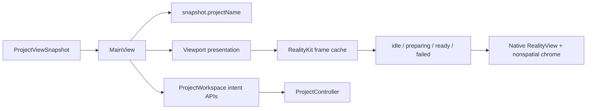
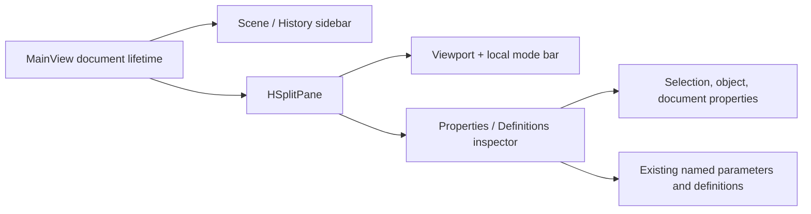

# RupaUI

## Purpose and Scope

`RupaUI` presents immutable `ProjectViewSnapshot` state and submits user intent
to the App-owned `ProjectWorkspace`. It is a child of the
[RupaKit package design](../../DESIGN.md). Its CAD operation draft component is
[Modeling](Modeling/DESIGN.md).

Production prepares snapshot-bound RealityKit frame values asynchronously and
mounts surfaces and world-space overlays in one native `RealityView`. SwiftUI
owns only nonspatial chrome and the screen-space selection marquee. Legacy
identity picking remains until RK-4, and RK-5/RK-IV own its removal and final
integrated acceptance. Source tests and builds remain distinct from signed-App
live acceptance; the latter must be recorded for the integrated application.

## Responsibilities and Boundaries

The module owns workspace presentation, viewport/UI interaction, visible
project-title projection, and observation of the RealityKit frame cache.
It does not own project source, package persistence, file URLs, application
process authority, Agent transport, geometry preparation, or a second mutable
document model.

## Related Designs

| Design | Relationship | Contract Used | Summary | Cautions |
|---|---|---|---|---|
| [RupaKit package](../../DESIGN.md) | parent | module dependency and authority direction | Places UI above the workspace snapshot. | UI must not bypass the workspace. |
| [Rupa App](../../../Rupa/Rupa/Rupa/DESIGN.md) | used by | application file lifecycle and composition | Supplies the App-owned workspace and file activation. | File names are not project-title authority. |
| [RupaKit integration](../RupaKit/DESIGN.md) | depends on | `ProjectWorkspace` and `ProjectViewSnapshot` | Publishes the exact view consumed by `MainView`. | Snapshot coordinates remain immutable evidence. |
| [RupaRendering](../RupaRendering/DESIGN.md) | depends on | Snapshot-matched RealityKit frame state | Supplies a bounded ready frame or typed preparation failure. | UI never builds geometry, creates native resources, or repairs a failed frame. |
| [Modeling](Modeling/DESIGN.md) | child | Local CAD operation drafts and native parameter controls | Converts explicit selection and input into existing commands. | A draft is neither a source document nor an evaluated preview. |

## Architecture

The native workspace chrome is organized as two independent presentation
paths:

## Contracts and Invariants

The object inspector follows the [Core scene placement convention](../RupaCore/DESIGN.md#scene-placement-matrix-convention).
XYZ rotation, translation and scale preserve the remaining TRS components.
Unsupported matrices show an explicit error rather than editable fake values.
No old column-major compatibility controls or layout-detection path remain.

1. `ProjectViewSnapshot.projectName` is the sole navigation/window title input.
2. Empty project names display the bounded fallback `Untitled`; CAD metadata,
   file names, transport state, and Agent responses never replace a nonempty
   snapshot name.
3. `MainView` sends intent to its injected workspace and retains no source or
   package authority.
4. A failed application file activation leaves the prior snapshot and all
   visible UI derived from it unchanged.
5. A new viewport snapshot starts preparation through the existing cache and
   renders only a matching `ready` plan. `preparing` and typed `failed` states
   remain explicit; neither displays stale geometry as current.
6. UI code performs no tessellation, Mesh validation, world transformation, or
   triangle-plan construction. Canvas projects ready positions and draws a
   bounded number of visual-state batches, not one path operation per triangle.
7. Viewport teardown releases the cache, cancels its build task, and discards
   every late completion; no render task or plan is retained by stale UI.
8. The sidebar exposes Scene and Feature History as explicit navigation
   segments. Both segments read the same immutable snapshot; selecting a
   history row routes through the existing scene selection or history preview
   callback and does not mutate source state directly.
9. The inspector is visible by default and always provides Properties and
   Definitions tabs, including when there is no selection. Properties reuses
   the existing selection/document inspectors; Definitions reuses the existing
   named-parameter editor. A tab change never changes selection, WorkspaceState,
   source commands, persistence, or undo history.
10. `MainView` owns one document-lifetime `ViewportDisplayMode` state. The
    identical value is passed to the published and preview `Viewport` values;
    the mode is presentation-only and is not stored in a project snapshot.
11. The compact viewport-local top bar is always present and displays the
    active mode label plus a four-case menu (`Solid`, `Solid + Mesh Boundaries`,
    `Wireframe`, `Normals`). It may also display existing selection and scale
    status, but it does not become a source or evaluation command surface.
    Wireframe and normals describe the source face presentation rather than
    exact B-rep geometry; normals use RGB direction encoding.

The viewport root fills its parent-allocated rectangle in every preparation
state. Native content, input, and chrome share that coordinate space; padding
is inside the allocation, never a competing child width or height.

## Runtime Flows

The application coordinator publishes a new workspace view only after
`ProjectController` accepts a load or transaction. `MainView` derives title and
viewport from that view in the same publication lifetime, then lets the cache
prepare derived render data outside `MainActor`. Only a completion matching the
current snapshot replaces the UI cache state. Title projection uses the
published project name and has no dependency on CAD metadata.

## State, Ownership, and Lifecycle

SwiftUI owns transient camera, interaction, and render-cache observation state.
The existing cache owns one cancellable build task and matching result;
the injected workspace owns the observable view; `ProjectController` owns
source state and publication. The UI does not retain source authority,
security-scoped URLs, or transport resources.

## Failure, Concurrency, and Constraints

UI state and Canvas calls are MainActor-isolated; render-plan construction is
not. Project and render failures remain typed at their owning boundaries and
are not converted into empty successful views. MainActor work is bounded by
admitted plan positions and batches. Title projection performs no CAD, file,
or transport reads.

## Verification and Change Impact

Focused tests must verify title projection, matching
idle/preparing/ready/failed state, stale/teardown completion rejection, and
bounded Canvas batch calls alongside
successful `.rupa` load and failed dirty/invalid activation preserving the same
visible snapshot. A MainActor progress probe and the actual signed-App
multi-body run must verify the window, viewport, interaction, and Agent response
remain live. No change adds or changes save-as behavior.
