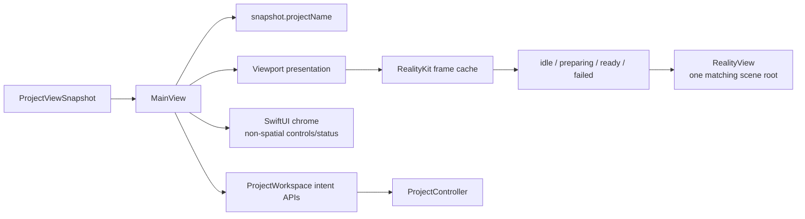
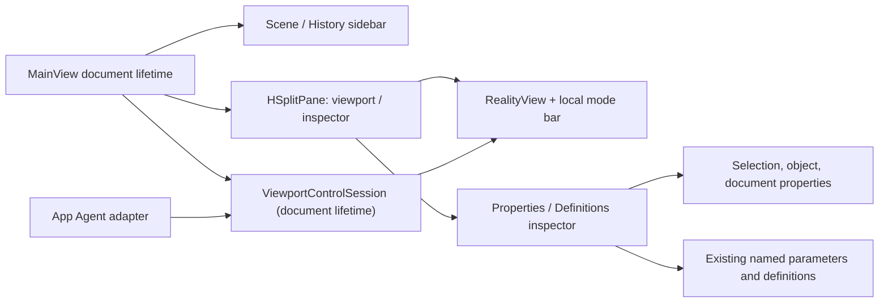
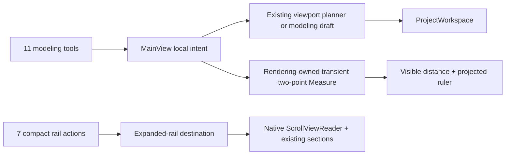

# RupaUI

Object placement callbacks await the existing workspace operation sequencer and
source publication, then return the published `ViewportSourceIdentity` to the
[Rendering handoff owner](../RupaRendering/DESIGN.md#continuous-source-updates).
They throw failures to that owner rather than returning before publication;
source storage, batch validation and Undo remain owned by ProjectWorkspace.

## Purpose and Scope

`RupaUI` presents immutable `ProjectViewSnapshot` state and submits user intent
to the App-owned `ProjectWorkspace`. It is a child of the
[RupaKit package design](../../DESIGN.md). Its CAD operation draft component is
[Modeling](Modeling/DESIGN.md), and its scene hierarchy component is
[Outliner](Outliner/DESIGN.md). Its presentation-only shading controls are
[ViewportShadingPanel](ViewportShadingPanel/DESIGN.md).

Production prepares snapshot-bound RealityKit frame values asynchronously and
mounts surfaces and world-space overlays in one native `RealityView`. SwiftUI
owns only nonspatial chrome and the screen-space selection marquee. Legacy
identity picking remains until RK-4, and RK-5/RK-IV own its removal and final
integrated acceptance. Source tests and builds remain distinct from signed-App
live acceptance; the latter must be recorded for the integrated application.

## Responsibilities and Boundaries

Box face/corner resize intents follow the
[Rendering resize contract](../RupaRendering/DESIGN.md#responsibilities-and-boundaries).
The UI submits source dimensions and the compensating occurrence translation
in one Workspace transaction after validating the retained CAD revisions and
placement baseline. Publication acknowledgement and failure use the existing
viewport handoff; no separate mutable geometry or history is introduced.

Numeric Inspector interaction is owned by [InspectorInput](InspectorInput/DESIGN.md).
MainView captures the existing sequencer completion after synchronous numeric
submission. It coalesces only consecutive unstarted absolute edits from the same
control, retaining document-lifetime guards, error reporting and ordering barriers.

Body transform commits consume the occurrence-scoped batch defined by
[RupaRendering](../RupaRendering/DESIGN.md). Before producing any command, the
UI validates every retained node, local frame and parent world frame against
the current workspace snapshot. It submits all placements in one existing
source transaction, preserving atomic failure and a single Undo entry.
Object placement callbacks are available for CAD and authored Mesh selection;
exact CAD capability remains a requirement only for topology operations.
Rendering owns complete selection admission against the presented occurrences.
Translation, rotation and axis scaling use the same boundary. Cancellation
submits nothing. Verification includes stale ancestors and shared-feature
placements, not only callback receipt.

The module owns workspace presentation, viewport/UI interaction, visible
project-title projection, and observation of the RealityKit frame cache.
It does not own project source, package persistence, file URLs, application
process authority, Agent transport, geometry preparation, or a second mutable
document model.

## Related Designs

| Design | Relationship | Contract Used | Summary | Cautions |
|---|---|---|---|---|
| [RupaKit package](../../DESIGN.md) | parent | module dependency and authority direction | Places UI above the workspace snapshot. | UI must not bypass the workspace. |
| [Rupa App](../../../Rupa/Rupa/Rupa/DESIGN.md) | used by | application file lifecycle and composition | Supplies the App-owned workspace and file activation. | File names are not project-title authority. |
| [RupaKit integration](../RupaKit/DESIGN.md) | depends on | `ProjectWorkspace` and `ProjectViewSnapshot` | Publishes the exact view consumed by `MainView`. | Snapshot coordinates remain immutable evidence. |
| [RupaRendering](../RupaRendering/DESIGN.md) | depends on | Snapshot-matched RealityKit frame state and the native gesture refusal callback | Supplies a bounded ready frame or typed preparation failure, and reports each native gesture refusal it judges reportable. | UI never builds geometry, creates native resources, repairs a failed frame, or re-derives which refusals are reportable. |
| [Modeling](Modeling/DESIGN.md) | child | Local CAD operation drafts and native parameter controls | Converts explicit selection and input into existing commands. | A draft is neither a source document nor an evaluated preview. |
| [Outliner](Outliner/DESIGN.md) | child | Snapshot-derived scene hierarchy and explicit user intents | Presents dense tree navigation, local disclosure/filter state, rename and selection actions. | It never owns or mutates Product source. |
| [ViewportShadingPanel](ViewportShadingPanel/DESIGN.md) | child | Native controls bound to `ViewportShading` | Updates the mounted rendering session through MainView. | No document or material mutation. |

## Architecture



The native workspace chrome is organized as two independent presentation
paths:



The viewport-side controls reuse the existing intent and mutation owners:



## Contracts and Invariants

Box Corner Inspector values are projected from the exact source through
[Core's Corner contract](../RupaCore/DESIGN.md), not stale stored property defaults.
Its slider is bounded by the smallest source dimension and modeling tolerance.
Corner Sides remains a product display property consumed by Core's shared
evaluation-quality resolver; it does not change the CAD radius.

### Viewport-side tool routing

The left palette has twelve explicit routes. Activation may be a nonmutating
mode change; completeness means that the next required input, the resulting
state or command, and the applicable refusal and cancellation path are visible.
The palette does not own source state, perform rendering preparation, or bypass
`ProjectWorkspace`.

| Tool | Input and settings | Observable result | Failure and cancellation |
|---|---|---|---|
| Select | Selection scope and a viewport hit, or a drag on an object-scope transform gizmo | A hit changes the existing interaction selection and does not mutate the source; an object-scope body or sketch transform drag commits one scene-node transform command through Workspace | Unresolved or stale hits report a reason; a refused transform commit is a typed editor error that leaves the document untouched; choosing another tool or leaving object scope withdraws the gizmo route |
| Sketch | Click or drag, effective plane, snap, width and height | Rectangle sketch through the existing viewport planner and Workspace | Nonfinite or degenerate input is nonmutating; Select cancels before submission |
| Polygon | Click or drag plus side, sizing, inclination and optional face-cut settings | Polygon sketch, or the existing face split when a valid face is targeted | Invalid side/face/input reports a reason without mutation; Select cancels before submission |
| Circle | Click for a center, taking the active length or the scale default as radius, or drag from center to edge for a measured radius on the effective plane | Circle sketch through the existing planner and Workspace | Nonfinite coordinates, or a drag radius that is not positive, are typed refusals that mutate nothing; Select cancels before submission |
| Arc | Click or drag plus radius/span and plane settings | Arc sketch through the existing planner | Invalid or degenerate input is nonmutating; Select cancels before submission |
| Spline | Click or drag plus plane, snap and existing curve input | Spline sketch through the existing planner | Invalid or degenerate input is nonmutating; Select cancels before submission |
| Solid | Empty-space click/drag for a box, or a valid sketch target for extrusion | Existing box or profile-extrusion command through Workspace | Unsupported target/input reports a reason; Select cancels before submission |
| Sweep | Current ordered section/guide selection and the clicked path | Existing sweep command through Workspace | Missing or incompatible operands remain a typed visible refusal; Select cancels before submission |
| Surface | Current ordered profiles open the Modeling-owned Loft draft with sheet output enabled | Preview then Apply creates the existing sheet loft; the Circle Sketch route is not presented as Surface | Invalid operands stay in the editable form with a visible error; its native Cancel discards draft and preview |
| Mesh | Authored Mesh element selection, domain and existing Mesh operation fields | Existing Mesh preview/apply transaction and element overlay | Non-Mesh/CAD input explains Make Editable or required input; Cancel discards draft/preview and returns to Select; no Mesh-summary Logs detour substitutes for editing |
| Measure | Two explicit viewport points resolved from current snap, visible geometry, or the effective plane | Rendering-owned hover preview, native spatial dimension line/text and 3D world distance remain visible; source does not mutate | Unresolved depth/nonfinite or degenerate input shows the reason; Escape or another tool clears the transient result |
| Section | Clicked world position and effective construction-plane orientation | Existing construction-plane command preserves the clicked origin and plane normal, selects the created plane, and exposes existing section analysis/clipping | Unresolvable/nonfinite placement is nonmutating; Select cancels before submission |

The prior viewport behavior that treated Measure as a clicked-object
`MeasurementService` summary is superseded. Measure is two-point transient input
owned by [ViewportMeasurement](../RupaRendering/ViewportMeasurement/DESIGN.md).
MainView only selects the mode, forwards its active/status presentation, and
clears it on tool exit or authority replacement. It does not resolve depth,
calculate distance, retain endpoints, or invoke source measurement.

Ordinary object selection separately enables noninteractive projected rulers
for one unambiguous selected occurrence. Those rulers are explicitly labeled
World bounds, avoid the object and existing viewport chrome when a bounded
valid placement exists, and yield input to every tool. Ambiguous multiple
occurrences or an active modeling/Measure/Mesh interaction suppress them
rather than guessing a target or covering current work. This presentation
never implies exact edge length, area, volume, or local dimensions.

`WorkspaceCanvasOverlayHost` is retained only for screen-space SwiftUI chrome
and exclusions. RealityKit owns spatial world geometry. Every published
`ViewportCanvasOverlayExclusion.rect` is finite in the viewport content space
and remains invariant under ancestor or window offsets before `RupaRendering`
consumes it.

Chrome rectangles are layout output, and the host owns both how it reads
them and when they become workspace state. It reads each rectangle from a
layout-completion geometry callback on the chrome that owns it, never from a
preference bound into the host's own body. A bound preference would make the
host both the producer and the reader of one value inside a single update,
leaving the measurement with no owner outside the view that produced it. The
context panel's reserved height is derived
from that panel's measured rectangle rather than measured a second time,
because a second measurement of the same view carries the same number while
adding a second workspace value that changes in the same frame.

The overlay's trailing side carries two chromes, and they share one vertical
budget. The top bar holds the trailing corner, and the band it occupies is
reserved at both ends of the canvas, so the utility rail is offered only the
height between those two bands. A rail declares the height it opens to, and
it reaches that height only while the canvas has room for it, giving height
back as the canvas shrinks. Two consequences follow, and both are contracts.
The rail never covers the top bar: a canvas too short for the declared rail
-- which is what opening the bottom logs pane produces -- yields a shorter
rail rather than a rail laid over the corner. And the rail stays centred on
the canvas at every height, which is where the tool palette on the leading
side is centred too; reserving the band at one end only would move the rail
off that centre line by half the band. Chrome on opposite edges shares no
budget, because nothing puts two of them in one band.

The host holds the rectangles it has been handed in a reference its own body
never reads, and publishes them to the workspace as one value on the
MainActor tick after the layout that measured them, replacing a publication
still pending when a newer value arrives. Held rectangles are layout output
rather than view state: they describe a layout that has already run, and no
view renders from them until they have been published. Keeping them out of
the view graph is an ownership rule, and this design does not claim it
removes any particular SwiftUI runtime issue. That
one value carries every chrome rectangle and the derived height together, so
the workspace state the viewport reads changes once per settled layout
rather than once per chrome. The deferral follows from where the value goes:
MainView stores what the host publishes and passes it straight back into the
`Viewport` occupying the host's content slot, whose fitting insets and
control-context identity derive from it, so the publication is an input to
the same subtree that produced the measurement. Publishing on the next tick
keeps the measuring pass and the write that depends on it in separate
passes. Chrome
that leaves the overlay withdraws its rectangle, because rectangles the host
holds outlive the view that produced them. Neither the rectangles nor the
derived height carries operation meaning and neither is a source input, so a
publication superseded before it runs is dropped rather than recorded as a
failure.

Tool title, help, selected value, input prompt and result status describe these
routes exactly. A one-shot or dialog route need not remain selected after it has
handed off to its existing draft, but it may not imply a canvas mode that cannot
produce its named result. Successful source changes retain the existing single
Workspace transaction and Undo behavior. Cancellation before publication does
not mutate source; an already published command is reversed only through Undo.

The right compact rail has seven navigation actions. Each action expands and
positions the existing rail at the corresponding destination rather than merely
opening the rail at its first row.

| Compact action | Destination | Truthful state |
|---|---|---|
| Canvas Controls | Rail header | Expanded/collapsed only |
| Selection | Select | Current selection scope |
| Snap | Snap | Effective Grid/Object snap state |
| Construction Plane | Plane | Effective mode, active plane and pending origin request |
| Surface Analysis | Analysis | Effective applicable overlay; if no supported target exists, the section states that precondition instead of claiming an active result |
| Saved Views | Views | Current saved-view count and camera-capture availability |
| Scene Diagnostics | Scene | Current issue count and warning state |

The destination is transient MainView presentation state. The expanded rail
uses native `ScrollViewReader` IDs on its existing sections; no navigation model,
coordinator or second rail is introduced. Compact action accessibility
identifiers remain individually addressable and are not replaced by an ancestor
identifier. Expansion, section focus and collapse never change source,
selection, camera, analysis settings or Undo history. Collapse is the cancel
transition for rail navigation.

### Sidebar symbols

`WorkspaceSidebarSymbol` is a stateless native SwiftUI platform adapter in this
module, shared by scene rows, history rows/actions, and definition/asset labels.
It renders SF Symbols at 13 pt regular weight, medium image scale, monochrome,
with an 11 pt glyph override for the Outliner's secondary state controls,
centered in a 20 x 20 pt slot. The caller owns semantic primary/secondary or
selected foreground styling and accessibility meaning. No asset lookup,
custom-drawn substitute, image stretching, scene mutation, or symbol cache is
introduced. Symbol identity belongs to each row's existing presentation owner;
the adapter knows only the supplied SF Symbol name.

The 13 pt glyph and 20 pt slot retain compact native macOS density. Disclosure
chevrons and generated-state badges intentionally remain smaller auxiliary
symbols. Existing row heights, indentation, drag zones, text truncation, and
command availability stay unchanged. This follows the existing Workspace naming
and native-platform adapter layout, not a separate design-system component tree.
`WorkspaceSidebarSymbolTests` verifies native symbol resolution, fixed rendered
dimensions, and nonempty unclipped glyphs in light/dark and selected appearances.
Live App checks own row alignment, disclosure, selection, and action hit targets.

### Workspace behavior

Viewport tool names appear immediately while hovering a left palette or
compact right-rail button. `WorkspaceToolNameHint` is a SwiftUI presentation
adapter: each button owns its local hover flag and publishes its existing
title and bounds anchor; `WorkspaceCanvasOverlayHost` draws one noninteractive
screen-space name label outside the scroll containers, toward the RealityView.
Leaving or removing a button removes its hint. Hover never activates a tool,
changes source state, resizes the palette, or expands its hit region. Button
accessibility labels retain the tool name and accessibility hints retain the
longer operation description; a second delayed system tooltip is not layered
over the visible label. The label reuses compact chrome spacing, caption
typography, primary text and regular material in both appearances. App UI
hover tests own enter/leave, title, placement and stable button bounds; the
existing native palette test owns scroll and hit-region size.

`HSplitPane` owns the viewport/inspector division and user resizing inside
NavigationSplitView's detail column; the native inspector modifier is not
used. The split is mounted for the document's lifetime and the inspector is
added and removed as its trailing child, so the detail column presents one
split rather than alternating between a split and a bare viewport. The split
also owns how it divides its bounds between those columns. It applies the
opening width its caller declares once, when the arranged column count
changes, and on every later layout pass it only clamps the division it has
redistributed into the declared minimum and maximum. A column that is laid out
at a different size than the one its opening width was applied at is therefore
rescaled with the split, and a declared minimum and maximum that differ are
the allowance that rescaling drifts inside. A column whose width must not
follow the window declares one width for all three, so that every layout pass
re-pins it. The width is declared on the pane and never on the pane's content:
a fixed width inside the column only centres the content in whatever column it
was handed, so inspector content still fills its column and names no width of
its own. Every native split must keep its arranged columns within its own
bounds and the host window.

The inspector column's width is declared in one place, `editorDetailPane`, as
a single 320 pt for the opening width, the minimum and the maximum. 320 pt is
the widest the sidebar column is allowed to be, so the inspector reads as a
second column of the window's chrome rather than as a second half of it.
Declaring one width rather than a range is what holds it there: the column
keeps that width while the window is resized, and withdrawing the inspector
and adding it back reopens it at the same width. The divider consequently does
not resize the inspector; it only marks the boundary the canvas reaches. The
declared width measures from the split's trailing edge to the leading edge of
the divider, which is where the split puts the number it is given, so the
column itself measures the declared width less the divider's thickness. This
width and the canvas column's declared minimum may change only together, and
only while their sum still fits inside the window's own minimum width.

The detail column's size is owned by the proposal NavigationSplitView hands
down. No view between that column and the canvas host may measure the size it
has been given and feed that measurement back into its own subtree as a
frame. A measured size is one pass behind the proposal that produced it, so a
frame derived from it can hold a child at a size its parent has already left,
and one subtree is then laid out at two different sizes inside a single pass.
The split therefore takes the proposal directly, the viewport accepts the
remaining width without imposing a competing minimum width, and inspector
content consumes its pane's width with only its existing horizontal padding,
without measuring, storing, or independently fixing the list width. The split fills the detail column regardless of the active
inspector's intrinsic height or the Logs expansion state; individual forms do
not own this guarantee. Logs visibility is user-owned transient presentation
state. Its initial value is collapsed unless an explicit
construction/restoration input selects otherwise; after construction, only the
existing Logs header and toolbar controls may open or close it. Source
commits, diagnostics, tool activation, status reporting, preview results, and
errors append or replace their existing diagnostic values without changing
visibility. Collapsing Logs never clears those values, changes operation
behavior, or suppresses status, and opening it later presents the same stored
diagnostics. This uses the existing binding and controls rather than a second
visibility owner or automatic-reveal policy. NavigationSplitView may overlay
its sidebar; containment checks use each column's frame, not the sum of
potentially overlapping column widths. Content fills the column the split
hands it at the width declared above, and imposes no separate maximum of its
own inside that column. Properties and Definitions
share an 8 pt horizontal inset; existing section and control padding remains
unchanged. The inset follows the compact native spacing tier, while column
widths follow the existing control fit requirements rather than the decorative
spacing scale. Active modeling, history preview, and Mesh tools keep the
inspector presented using the existing presentation condition; the toolbar
changes only the user's visibility preference, never operation state. Native
MainView layout tests cover initial width and vertical window resize without
document mutation. They require the detail split to reach the host's bottom
edge and its panes to occupy the full split height. Signed-App checks
separately own Surface/Mesh tool transitions, Logs expansion, divider and tab
use.

The object inspector follows the [Core scene placement convention](../RupaCore/DESIGN.md#scene-placement-matrix-convention).
Each inspector visibility, lock or material choice submits all selected nodes
in one source command array through MainView's existing transaction boundary.
The choice either commits in full with one Undo entry or leaves source and
history unchanged. The view emits intent once, not once per selected node;
busy controls cannot submit another property mutation. Picker Binding tests
verify the emitted batch and Workspace publication, rollback and Undo/Redo.
Native control activation has no test owner while the App UI runner stays
retired; it is a manual check in the UI test review.
XYZ rotation, translation and scale preserve the remaining components,
including the shear owned by Core's affine placement convention. The inspector
shows retained XY/XZ/YZ shear values rather than hiding all numeric controls.
Unsupported matrices show an explicit error rather than editable fake values.
No old column-major compatibility controls or layout-detection path remain.

Inspector property edits are live: each valid value change submits its intent
to the existing serialized Workspace source boundary without a Preview/Apply
step. Object transform controls retain no private transform draft. MainView
captures target identities, then resolves the edited component against the
latest snapshot inside that boundary so queued edits cannot restore stale
values of other components. One accepted edit affects all targets atomically
and is undoable. Locked or missing targets and invalid transforms fail without
partial publication; failed edits keep the last published values. Modeling
operations that create geometry retain their separate Preview/Apply contract.

Verification must exercise control intents through actual Workspace publication
and presentation transforms, not just affine arithmetic or control existence.

### Object editing authority

```text
Canvas placement / Inspector local TRS / Inspector world Center
    -> WorkspaceTransformMatrix command admission -> Workspace -> localTransform
Canvas dimension / Inspector source Size
    -> setObjectDimension -> Core source resolver -> CAD source
published source -> occurrence presentation -> center measurement (not source size)
```

`WorkspaceTransformMatrix` is the common UI placement command boundary. Canvas
baselines are validated before admission; numeric components are resolved from
the latest serialized document. Both refuse locked/missing nodes and preserve
unmodified affine components. A drag preview remains a non-authoritative
projection of its baseline; cancellation never writes source.

Shape Center is the world-space bounding center of the addressed occurrence,
not the first occurrence of its feature. Editing it translates that occurrence
by the measured world delta using the same parent-frame algebra as the gizmo.
No translation is added a second time. Transform controls explicitly name
their parent-local coordinate system. Shape Size is a source dimension resolved
by Core, independent of placement, scale, rotation, shear and render bounds.
Its edit uses the same `setObjectDimension` command as Canvas dimension input;
it preserves source profile origin/plane, not a UI-only center-pinning rule.
Shared source edits affect every occurrence; placement edits affect only the
addressed node. Unsupported source dimensions are not inferred from pixels.
Missing evaluated occurrences are explicitly unavailable for Center editing;
source properties remain usable. Invalid dimensions surface errors, not values
that could overwrite source. Center reads the published universal viewport's
world bounds and occurrence-to-node mapping; it never rebuilds or evaluates a
legacy scene inside an Inspector update.

`WorkspaceObjectEditingSSOTTests` owns real Workspace publication/Undo and
cross-adapter tests for parent frames, shear, shared features, invalid inputs and
source-size invariance. Existing Rendering gesture tests own preview/cancel and
world-axis measurement. No new authority, cache or preview lifetime is added.

Consecutive object-transform intents with the same document lifetime, ordered
target IDs and component replace only the last unstarted intent in the existing
operation sequencer. There is no debounce timer and no cancellation of an
executing source transaction. A different key or any ordinary operation seals
that slot, preserving component order, selection, save and Undo boundaries.
Each executed value remains an atomic, undoable Workspace transaction; replaced
values never become source authority or history entries. The pending slot is
MainActor-owned and retains one closure regardless of the input burst length.
Tests suspend an executing operation, submit a burst, and verify final-value
delivery, barriers, latest-snapshot rebasing, failures and Undo. This bounds
obsolete queued work; it does not establish a GPU frame-latency guarantee.

1. `ProjectViewSnapshot.projectName` is the sole navigation/window title input.
2. Empty project names display the bounded fallback `Untitled`; CAD metadata,
   file names, transport state, and Agent responses never replace a nonempty
   snapshot name.
3. `MainView` sends intent to its injected workspace and retains no source or
   package authority.
4. A failed application file activation leaves the prior snapshot and all
   visible UI derived from it unchanged.
5. A new viewport snapshot starts preparation through the RealityKit frame
   cache and renders only a matching `ready` scene root. `preparing` and typed
   `failed` states remain explicit; neither displays stale geometry as current.
6. UI code performs no tessellation, Mesh validation, world transformation, or
   native resource construction. RealityKit projects and draws the prepared
   spatial graph; SwiftUI draws only bounded non-spatial chrome and screen-only
   selection marquee content.
7. Viewport teardown releases the cache, cancels its build task, and discards
   every late completion; no render task or plan is retained by stale UI.
8. The sidebar exposes Outliner and Feature History as explicit navigation
   segments. Both segments read the same immutable snapshot; selecting a row
   routes through existing selection callbacks and does not mutate source state
   directly. The Outliner owns only transient disclosure, search/filter, and
   inline-edit draft state; accepted changes cross the existing Workspace
   transaction boundary.
9. The inspector is visible by default and always provides Properties and
   Definitions tabs, including when there is no selection. Properties reuses
   the existing selection/document inspectors; Definitions reuses the existing
   named-parameter editor. A tab change never changes selection, WorkspaceState,
   source commands, persistence, or undo history.
10. `MainView` creates one document-lifetime `ViewportControlSession`. The
    session owns camera, projection, display mode, mount identity, and a
    monotonic revision. The identical session is passed to whichever published
    or preview `Viewport` is active; presentation state is not stored in a
    project snapshot. `onViewportMount(documentLifetimeID, session)` registers
    that session with the App, while `onViewportUnmount(viewportInstanceID)`
    invalidates the active viewport token.
11. The compact viewport-local top bar is always present and displays fit
    actions (`Fit Visible Objects`, `Fit Selected Objects`) and a four-case
    display menu (`Solid`, `Solid + Mesh Edges`, `Wireframe`, `Normals`). It may
    also display existing selection and scale status, but it does not become a
    source or evaluation command surface.
    Wireframe and normals describe the source face presentation rather than
    exact B-rep geometry; normals use RGB direction encoding.
12. The viewport measures the size actually allocated by the native split pane.
    Divider drag limits belong to the split container; its child must not impose
    a wider minimum frame that makes camera fitting target an obscured region.
    The viewport root fills that complete allocated rectangle in every
    preparation state, and native content, input, and chrome share its coordinate
    space; padding belongs inside that rectangle rather than reducing its width
    or height.
13. Outliner moves carry captured document generation into `submitSource`.
    MainView rejects a generation mismatch before planning the single Core move
    command; Workspace independently checks transaction/publication coordinates.
    A replacement document recreates the Outliner and its private drag lifetime.
14. The viewport top bar opens native shading controls beside display mode.
    MainView forwards edits to `.setShading` on the same session used by the
    renderer. It never submits a source transaction for presentation settings.
15. The Rendering-owned central camera strip (`ViewportAxisTriad`) remains at
    the bottom of the RealityView. Its orientation menu (`Isometric`, `X Front`,
    `Y Front`, `Z Front`), two-case lens picker (`Ortho`, `Persp`), and `Reset
    Pan and Zoom` are real controls bound through MainView to the same
    `ViewportControlSession`; no static label may imply an unavailable action.
16. Orientation and lens are independent. Selecting an orientation preserves
    lens; selecting Ortho/Persp preserves orientation, pan, zoom, display mode,
    and shading. Ortho-to-Persp selects the Rendering-owned standard perspective
    field of view, while an already restored perspective lens keeps its exact
    field of view. Reset changes only pan and zoom.
17. Saved views use the existing Core schema without a compatibility model.
    Parallel capture stores orthographic target-plane height. Perspective
    capture stores the exact field of view and camera distance; restore converts
    distance and field of view back to target-plane height and restores the same
    lens. Camera framing must carry projection when reconstructing a camera and
    may not silently fall back to parallel. MainView stores the optional current
    camera frame emitted by Viewport and disables Save Current View and saved-view
    update while it is absent. A failed perspective capture never reuses an old
    frame or persists a parallel default. A typed restore failure remains visible
    and leaves the current session unchanged.
    MainView sends one camera-frame request and treats
    `onCameraFrameRequestResult` as the applied-state receipt; it does not send a
    second lens request or report success before the Rendering session applies
    camera, basis, and lens. The existing ruler update is a separate earlier
    Workspace operation and is not part of camera-session rollback atomicity.
18. A workspace source route carries only source-mutating commands, so
    `submitSource` is not the route for a command that mutates nothing.
    `EditorCommand.validateDocument` is the only such command, and in Core it
    evaluates the current document and republishes its diagnostics; the toolbar
    Validate button therefore asks `ProjectWorkspace` to evaluate the published
    snapshot again rather than staging a transaction that a source transaction
    must reject. The button reports the counts the new publication carries as
    progress even when the document it evaluated has errors, because the errors
    belong to the document and reach the Issues readout through the republished
    snapshot, while the [failure record](#failure-surfacing) means the operation
    itself failed. The retired `AppOperationCoverageUITests` owned that
    contract from the shipped control; no test owns it from the control
    now, and the scenario is recorded as history in
    [the UI test review](../../Tests/UI_TEST_REVIEW.md). The transaction's
    own mutation-only rule stays with
    [RupaProject](../RupaProject/DESIGN.md).

## Runtime Flows

The application coordinator publishes a new workspace view only after
`ProjectController` accepts a load or transaction. `MainView` derives title and
viewport from that view in the same publication lifetime, then lets
`RupaRendering` prepare a matching RealityKit frame outside `MainActor` where
the native API permits. Only a completion matching the current snapshot,
viewport revision, and overlay revision replaces the mounted root. Title
projection uses the published project name and has no dependency on CAD
metadata. The document-lifetime content mounts its session before a viewport
supplies its geometry context. Viewport gestures and Agent commands call the
same throwing session operation; an acknowledgement means the MainActor state
was applied, not that a RealityKit frame has completed display. Replacing the
document creates a new session and invalidates the old viewport instance ID.

## State, Ownership, and Lifecycle

SwiftUI owns transient interaction and render-cache observation state. The
`ViewportControlSession` owns camera, projection, display mode, revision, and
the currently mounted viewport context. The RealityKit frame cache owns one
cancellable build task, newest pending request, and matching result;
the injected workspace owns the observable view; `ProjectController` owns
source state and publication. The UI does not retain source authority,
security-scoped URLs, or transport resources.

## Failure, Concurrency, and Constraints

UI state and RealityView composition are MainActor-isolated; frame descriptor
and bounded resource preparation is not where the native API permits. Project
and render failures remain typed at their owning boundaries and are not
converted into empty successful views. MainActor work is bounded by admitted
resources and spatial entities. Title projection performs no CAD, file, or
transport reads.

### Failure surfacing

Every failure a workspace control refuses on is appended to
`WorkspaceFailureLog` before any view shows it. The log is a process-wide,
MainActor-isolated, ordered, bounded, non-deduplicating record. Each entry
carries a timestamp, the operation that failed, the reflected error type, the
reflected error value, and the message the control displays. Because typed
errors in this repository describe themselves through `message` alone, the
reflected value is what preserves the `code` and the concrete error type that
`localizedDescription` drops. Each entry is mirrored to
`Logger(subsystem: "RupaUI", category: "WorkspaceFailureLog")`, so a manual
session can be reconstructed from the unified log after the window is gone.

The red inline text, the Outliner alert, and `modelingPreview.errorMessage`
are transient views of the most recent record, not the record itself. A new
run, a Cancel, or a selection change clears the view and never clears the
log. The log is the authority for what failed; a surface is the authority
only for what is visible right now.

Refusals that carry no `Error` value, where a guard discards a user gesture,
are recorded through the same API with a message naming the unmet
precondition. Two guards stay silent by contract: a viewport hit whose
`snapshotID` is older than the mounted frame is frame readiness rather than a
refusal, and re-entrancy or token-mismatch guards describe no user operation.
`WorkspaceObjectTransform.componentsError` and `Modeling.refusal` are also not
appended, because each is a function of the current selection or draft
evaluated while the view is being built, not an event, and appending would
mutate state during a view update. A control whose refusal the view can
evaluate that way is disabled with the reason beside it, so the refusal is
read before the press instead of recorded after it, and the record keeps its
meaning: something ran and failed.

`EditorDiagnostic` keeps its existing meaning, a fact about the document or
its evaluation, and is not extended to carry UI failures. It crosses the
Agent wire through `AgentSemanticDiagnostic` and
`AgentProjectViewCoordinates`, so its shape is a protocol rather than a UI
detail. `EditorDiagnostic.stableMerged` also deduplicates by severity, code,
and message, which would hide a failure that repeats. The two lists stay
separate and the Logs pane presents recorded failures above diagnostics.

Native viewport gestures are refused inside `RupaRendering`, which owns what
counts as reportable there. `Viewport` reports each such refusal through the
refusal callback this module binds, and the callback records the `Error` the
same way every other workspace failure is recorded, so a drag that ends in a
refusal leaves an entry rather than only an os_log line. The record names
`Viewport.nativeGesture` as the operation, because the binding closure is not
the control the user pressed and its declaration name would say nothing about
which channel fired. The frame-readiness exclusion stays where the decision
lives: `RupaRendering` filters a transient query before the callback, so this
module never re-derives that rule, and a gesture the user supersedes by
releasing a route is a cancellation rather than a refusal and is not reported.

## Verification and Change Impact

### Non-interfering local verification

Routine local verification uses `scripts/test-ui-contracts.sh`. Its explicit
selection exercises production drafts, bindings, transactions, hidden native
layout, hit routing and RealityKit/Metal behavior. Test windows may exist but
must never be ordered, made key or activate the application. Synthetic events
are delivered only inside the test-owned view hierarchy, never to the system.
The foreground `RupaUITests` target is retired and its sources are deleted,
not silently skipped. Its scenarios are owned by the automated/manual coverage
map in the UI test review. Evidence below that a retired scenario once produced
is history, not a runnable route.
Adding a test requires inspecting its transitive helpers for desktop effects.
Zero executed tests, missing requested tests, skips and failures are not success.

Visual layout, hit testing and native activation remain separate evidence,
obtained through narrowly scoped direct agent inspection. Hidden host tests
prove only the in-process hierarchy, not OS focus, menus or save panels.
Historical App UI evidence below is not
current-snapshot acceptance and is not an instruction to run screen automation.
No test may hide other applications to satisfy a screen precondition.

Review findings and the coverage boundary are recorded in
[the UI test review](../../Tests/UI_TEST_REVIEW.md).

Direct agent UI inspection checks a shipped
control whose refusal the view can evaluate and reads back three facts together: the control is disabled, the
reason is displayed beside it, and the Logs pane count has not moved. That is
the behavioral proof that a refusal the panel can see is read before the press
and never becomes an entry.

No shipped control is left that refuses deterministically once it is pressed,
because a control that can see its own refusal now disables itself, so there
is no focused test that can read a record back out of the pane. The recorded
half is evidenced instead by the shipped-chrome failure sweep, which drives
every published control against a document that has geometry and reads
whatever the workspace recorded out of the pane, and by
`WorkspaceFailureLogTests`, which owns the log's ordering, bound, reflected
value and non-deduplication.

Native gesture routing also has mounted-window fixtures in
`ViewportNativeObjectAffordancePressTests`; these are included in routine
non-interfering checks after their hosts were migrated to never-ordered windows.
The replacement script proves mutation, transaction behavior and the selected
hidden native input paths. Visible error delivery remains direct inspection.

That sweep has run. `AppProjectRoundTripUITests` drove create, select, face
edit, save, and reload against the shipped chrome with recording on, and read
the scene rail before each launch ended: "0 failures, 0 errors, 0 warnings, 1
info" after the save and "None" after the reload. It exercised no gesture
refusal. The one canvas drag that run carried started on a body face marker,
which is not a transform-gizmo station, so the press took the
selection-rectangle path and never reached the affordance route the funnel
serves; that leg is not part of the committed test. The channel is therefore
unexercised by the sweep, and its wiring still rests on source review and the
package build.

Exercising it from shipped chrome would need two things that do not exist
today. A gizmo station would have to publish where the frame drew it, the way
`RupaRendering` publishes the construction-plane handles, because a press
aimed anywhere else routes elsewhere. And the gesture would have to be one the
frame refuses for a permanent reason: a drag that succeeds commits and reports
nothing, so reaching the funnel means provoking a refusal rather than
performing a move. Both are conditions a later exercise would have to arrange,
not work this design schedules.

Focused tests must verify title projection, matching
idle/preparing/ready/failed state, stale/teardown completion rejection, and
bounded RealityKit frame publication alongside
successful `.rupa` load and failed dirty/invalid activation preserving the same
visible snapshot. Outliner component tests additionally verify ancestor-
preserving filters, disclosure state, selection-aware context actions, rename
commit/cancel, generated-output refusal presentation, and forwarding Frame to
the mounted viewport session. A MainActor progress probe and the actual signed-App
multi-body run must verify the window, viewport, interaction, and Agent response
remain live. No change adds or changes save-as behavior.
Live framing verification includes the initial narrow split with the inspector
visible, proves ordinary source/tool/error/status routes leave Logs collapsed and
the Canvas height unchanged while retaining their diagnostic values, then uses
the existing header/toolbar control to open and close Logs and preserve a usable
mounted camera.
Central-control tests invoke each orientation and lens callback, verify the
session snapshot and revision, prove reset preserves lens/orientation, and cover
accessible labels and disabled state while no viewport is mounted. Saved-view
tests round-trip both lens modes, including a non-default valid perspective field
of view and distance. Signed-App acceptance observes a visible perspective size
difference across depth and reads the same effective lens through the viewport
API; static text and callback-only tests are insufficient.
Saved-view UI tests also prove an absent current frame disables create/update,
restore failure is visible and non-mutating, and no fallback frame reaches a
workspace command.
`WorkspaceUtilityRailDestinationTests` audits the shipped sources so every
compact rail action has both a button and the matching expanded-section
`ScrollViewReader` identifier. `ScrollViewProxy.scrollTo` is silent when no
view carries the identifier, so a destination with a button and no anchor would
expand the rail at its first row and still look like a working action.

Chrome publication timing has no in-process fixture. `MainView` and
`WorkspaceCanvasOverlayHost` hold the state privately, and a same-frame
re-entry is not visible in any value either view exposes: the rectangles that
reach `RupaRendering` are identical whether they arrived once or twice. That
signal lives outside the process. A launch and quit of the built app must
produce no `com.apple.SwiftUI:Invalid Configuration` runtime issue naming a
chrome geometry value or the viewport control-context identity, read from the
process log for that window, and the same window must carry RealityKit engine
entries showing the launch reached a mounted viewport rather than failing
before the chrome was laid out.

A launch cannot show that anything was measured, because a host that
publishes nothing also raises nothing. Delivery is proved in process instead:
mounted in an `NSWindow` with a visible context panel, the host publishes four
canvas-local rectangles and a reserved height equal to the context panel's own
measured height. Neither check is sound without the other.

### UI operation ownership

The workspace exposes thirty-four operations: twelve canvas tools, seven
utility rail destinations, ten Model drafts, and five Mesh drafts. Each row
names the control a user clicks and the test that owns that control's
contract, and records what the evidence for that operation actually covers. A
package test owns the command a control produces. Nothing owns the fact that
the shipped control reaches it: the App UI runner is retired, so that half of
every row is currently unowned.

| Family | Operations | Control identifier | Owning test | Evidence |
|---|---|---|---|---|
| Canvas tool | `sketch`, `polygon`, `circle`, `arc`, `spline`, `solid`, `sweep`, `section` | `CanvasTool.<case>` | `WorkspaceCanvasCommandPlannerTests` | lower-layer verified |
| Canvas tool | `surface` | `CanvasTool.surface` | `WorkspaceCanvasCommandPlannerTests` for the canvas refusal, `ModelingOperationDraftTests` for the sheet loft it defers to | lower-layer verified, nothing committed from the canvas |
| Canvas tool | `select` | `CanvasTool.select` | `WorkspaceCanvasCommandPlannerTests` for the absent canvas command, `ViewportBodyTransformInputTests` and `ViewportSelectionDragFrameReadinessTests` for the gizmo drag | lower-layer verified |
| Canvas tool | `measure` | `CanvasTool.measure` | `ViewportMeasurementTests`, `WorkspaceMeasurementPresentationGateTests` | lower-layer verified |
| Canvas tool | `mesh` | `CanvasTool.mesh` | `WorkspaceCanvasCommandPlannerTests` for the absent canvas command, `MeshOperationDraftTests` and `ModelingAndMeshOperationCoverageTests` for the element route | lower-layer verified |
| Rail destination | `controls`, `selection`, `snap`, `views`, `plane`, `analysis`, `scene` | `WorkspaceUtilityRail.<case>` | `WorkspaceUtilityRailDestinationTests` | source-audit verified, by contract |
| Rail section body | Saved views | `WorkspaceSavedView.*` | the `workspaceSavedViewBuilder*` tests in `RupaUIPackageTests` | lower-layer verified |
| Rail section body | Snap toggles | `WorkspaceSnap.*` | none | unverified |
| Rail section body | Active plane name | `WorkspacePlane.activeName` | none | unverified, read-only |
| Rail section body | Surface analysis overlay and sample density | `WorkspaceSurfaceAnalysis.<option>`, `WorkspaceSurfaceAnalysis.density.<density>` | none | unverified |
| Rail section body | Analysis and Scene readouts | `WorkspaceAnalysis.<row>`, `WorkspaceScene.<row>` | none | unverified, read-only |
| Model draft | box, cylinder, sphere, extrude, revolve, sweep, loft, boolean, fillet, chamfer | `Modeling.begin.<title>` | `ModelingOperationDraftTests`, `ModelingAndMeshOperationCoverageTests` | lower-layer verified |
| Mesh draft | translate, position, extrude, delete, addFace | `Modeling.mesh` panel | `MeshOperationDraftTests`, `ModelingAndMeshOperationCoverageTests` | lower-layer verified |

Three statuses classify the rows. Lower-layer verified means a package test
owns what the operation produces and nothing drives the shipped control that
reaches it. Source-audit verified means a package test reads the shipped
sources for a claim no runtime test can observe. Unverified means no test of
either kind reaches the operation. No row can claim GUI evidence while the App
UI runner stays retired; the scenarios that once carried it are recorded in
[the UI test review](../../Tests/UI_TEST_REVIEW.md). No row is broken in the
sense of an observed failure, and structure alone does not
license the stronger claim that nothing is broken, so every row carries an
evidence state rather than a verdict.

The canvas tool rows rest on a compositional argument rather than on per-tool
GUI evidence. `WorkspaceToolPalette` builds every button from one
`ForEach(ModelingTool.allCases)` with a single `activate` closure.
`activateTool` carries one per-tool branch, `.surface`, and sends every other
tool to `setActiveTool`. `handleViewportPick` routes every tool other than
`select` and `mesh` through one `submitSource` into
`WorkspaceCanvasCommandPlanner.clickCommand(tool:)`, which branches on all
twelve cases with no default. `WorkspaceCanvasCommandPlannerTests` owns each
per-tool branch, so every tool is proven at the command it produces and all of
them share one route. Nothing proves that the palette button reaches that
route; that is the half the retired App UI runner used to close. `measure` is
the exception, because `clickCommand` returns nil for it; its route runs
through `measurementToolActive` into the viewport
and back out as `WorkspaceMeasure.distance`. A measurement click needs a point
the viewport can anchor, and clicking empty space with no construction plane is
refused with "Choose a construction plane before measuring empty space.", so a
test places both points at the midpoints of face markers on a body it just
created. `ViewportMeasurementTests` owns the two-point session and the
refusals, and `WorkspaceMeasurementPresentationGateTests` owns the
presentation gate.

The Model drafts rest on a compositional argument of the same shape. The
toolbar `Menu` at `WorkspaceCommand.model` builds its ten items from one
`ForEach(ModelingOperationDraft.Kind.allCases)` with a single
`beginModelingOperation` closure, and that closure is uniform: it cancels an
open draft, forces `selectedTool` to `.select`, and stores a
`ModelingOperationDraft` whose only per-kind input is the kind. Every draft
therefore opens the same `ModelingOperationView` at `Modeling.operation` and
commits over the same `Modeling.preview` and `Modeling.apply` pair.
`ModelingOperationDraftTests` and `ModelingAndMeshOperationCoverageTests` own
each per-kind command, so every kind is proven at the command it produces and
all of them share one presentation route. Nothing reads the shipped menu, so
nothing proves that the ten `Modeling.begin.*` items still publish that route.
`CanvasTool.surface` lands on the same bridge, because
`beginSurfaceModelingOperation` stores a `modelingDraft` that the same view
presents and the same `Modeling.apply` commits.

The Mesh drafts reach the GUI without a launch fixture. Selecting one CAD body
enables "Make Selected CAD Editable as Mesh..." in the same Model menu, macOS
presents that `confirmationDialog` as a sheet whose confirming button is
`action-button-1`, and confirming it replaces the selected body with an
authored mesh source. "Edit Mesh Elements" in the same menu sets
`selectedTool` to `.mesh`, which makes `meshElementPickHandler` non-nil, and a
canvas click then resolves a mesh element through the presentation plan cache
before any CAD selection runs. The resolved element opens `Modeling.mesh`.
`MeshOperationView` publishes one identifier for the panel and none per
`Picker` case, and it needs none: inside `Modeling.mesh` the operation
`Picker` resolves as the panel's single `PopUpButton` and the domain `Picker`
as its three `RadioButton`s, so a test names them by role and label. Adding
per-case identifiers would name controls the accessibility tree already
distinguishes.

A rail section reached through `WorkspaceUtilityRail.expand` proves the section
renders and its controls work; it does not prove the compact destination button
scrolls to it. `WorkspaceUtilityRailDestinationTests` owns that second claim by
auditing the shipped sources, because `ScrollViewProxy.scrollTo` fails silently.
All seven anchors sit unconditionally in `expandedWorkspaceUtilityRail`, so the
anchor exists whenever the rail is expanded. The compact rail's `.analysis`
and `.scene` buttons are hittable without going through `.expand`, and
expanding the rail from either one renders every section body into a single
`ScrollView`, so one expansion publishes both the Analysis controls and the
Scene readouts. `WorkspaceUtilityRail.collapse` is published but is not
hittable, so a test reads both sections in one expansion rather than
collapsing between them.

The Analysis and Scene sections publish one control group and six read-only
rows. `WorkspaceSurfaceAnalysis.<option>` and
`WorkspaceSurfaceAnalysis.density.<density>` are `.plain` buttons with `Image`
labels that already report as hittable, so they take no `.contentShape`. The
six rows name their value `Text` through the `workspaceValueRow` identifier
path as `WorkspaceAnalysis.target`, `.overlay`, `.samples` and
`WorkspaceScene.bodies`, `.nodes`, `.issues`, which is what lets a test read
the overlay summary and the sample density change when a control is clicked.

The App `RupaUITests` runner is retired, so no row above carries GUI evidence,
and `scripts/test-ui-contracts.sh` is the supported verification entry point.
The three facts below are measured properties of the shipped chrome rather than
of any runner, so they stay true while no runner exists and any runner written
against them inherits them.

`CanvasViewport` resolves as a `Group`, so `otherElements["CanvasViewport"]`
matches nothing and a lookup must use `descendants(matching: .any)`.

A body face or edge marker reports where that sub-shape projects and takes no
pointer input, which `RupaRendering` owns as the marker contract. A test that
selects a sub-shape therefore clicks the canvas at the midpoint of the
marker's frame rather than clicking the marker, so the click runs the same
`ViewportInputSurface` route a pointer over the sub-shape runs.

macOS decides which accessibility attributes survive from the role it gives an
element, and the role follows the view the modifiers land on. A `Text` keeps
`StaticText` and publishes its string as the element's value, dropping the
accessibility label. An `HStack` collapsed with
`.accessibilityElement(children: .ignore)` becomes `Other`, which publishes
the label and drops the accessibility value. A row whose value a test reads
therefore names the value `Text` rather than the row, which is what
`workspaceValueRow` does when a caller passes an identifier.
`WorkspacePlane.activeName` is the one row that takes that path. A `CheckBox`
publishes its value as a number, not as a string.

A rail section body is reachable only after the rail is expanded, because the
compact rail publishes the destination buttons and none of the section rows.
The inspector is open when the workspace launches and
`WorkspaceCommand.inspector` toggles it, so a test that needs the inspector
checks for the content it wants before deciding to click.

Four route invariants have no owner while the App UI runner stays retired. The
Model menu publishes all ten drafts and one of them commits a feature. The
Analysis controls change the overlay and density readouts in the same
expansion that publishes the Scene readouts. The measure tool reports a
distance between two points on a body. The CAD-to-mesh route opens
`Modeling.mesh` with an element selected and commits one mesh operation. Each
is stated so that it can be built from the shipped chrome, so claiming it needs
no launch fixture.
