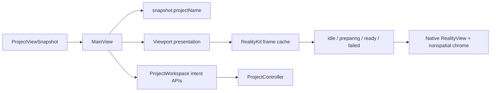
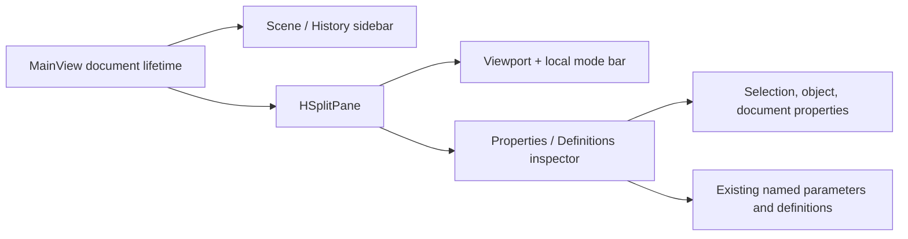

# RupaUI

## Purpose and Scope

`RupaUI` presents immutable `ProjectViewSnapshot` state and submits user intent
to the App-owned `ProjectWorkspace`. It is a child of the
[RupaKit package design](../../DESIGN.md). Its CAD operation draft component is
[Modeling](Modeling/DESIGN.md).

Production prepares snapshot-bound RealityKit frame values asynchronously and
mounts surfaces and world-space overlays in one native `RealityView`. SwiftUI
owns only nonspatial chrome and the screen-space selection marquee. Legacy
identity picking remains until RK-4, and RK-5/RK-IV own its removal and final
integrated acceptance. Source tests and builds remain distinct from signed-App
live acceptance; the latter must be recorded for the integrated application.

## Responsibilities and Boundaries

Body transform commits consume the occurrence-scoped batch defined by
[RupaRendering](../RupaRendering/DESIGN.md). Before producing any command, the
UI validates every retained node, local frame and parent world frame against
the current workspace snapshot. It submits all placements in one existing
source transaction, preserving atomic failure and a single Undo entry.
Translation, rotation and axis scaling use the same boundary. Cancellation
submits nothing. Verification includes stale ancestors and shared-feature
placements, not only callback receipt.

The module owns workspace presentation, viewport/UI interaction, visible
project-title projection, and observation of the RealityKit frame cache.
It does not own project source, package persistence, file URLs, application
process authority, Agent transport, geometry preparation, or a second mutable
document model.

## Related Designs

| Design | Relationship | Contract Used | Summary | Cautions |
|---|---|---|---|---|
| [RupaKit package](../../DESIGN.md) | parent | module dependency and authority direction | Places UI above the workspace snapshot. | UI must not bypass the workspace. |
| [Rupa App](../../../Rupa/Rupa/Rupa/DESIGN.md) | used by | application file lifecycle and composition | Supplies the App-owned workspace and file activation. | File names are not project-title authority. |
| [RupaKit integration](../RupaKit/DESIGN.md) | depends on | `ProjectWorkspace` and `ProjectViewSnapshot` | Publishes the exact view consumed by `MainView`. | Snapshot coordinates remain immutable evidence. |
| [RupaRendering](../RupaRendering/DESIGN.md) | depends on | Snapshot-matched RealityKit frame state and the native gesture refusal callback | Supplies a bounded ready frame or typed preparation failure, and reports each native gesture refusal it judges reportable. | UI never builds geometry, creates native resources, repairs a failed frame, or re-derives which refusals are reportable. |
| [Modeling](Modeling/DESIGN.md) | child | Local CAD operation drafts and native parameter controls | Converts explicit selection and input into existing commands. | A draft is neither a source document nor an evaluated preview. |

## Architecture

The native workspace chrome is organized as two independent presentation
paths:

## Contracts and Invariants

The object inspector follows the [Core scene placement convention](../RupaCore/DESIGN.md#scene-placement-matrix-convention).
Each inspector visibility, lock or material choice submits all selected nodes
in one source command array through MainView's existing transaction boundary.
The choice either commits in full with one Undo entry or leaves source and
history unchanged. The view emits intent once, not once per selected node;
busy controls cannot submit another property mutation. Picker Binding tests
verify the emitted batch and Workspace publication, rollback and Undo/Redo;
App UI tests own native control activation.
XYZ rotation, translation and scale preserve the remaining TRS components.
Unsupported matrices show an explicit error rather than editable fake values.
No old column-major compatibility controls or layout-detection path remain.

1. `ProjectViewSnapshot.projectName` is the sole navigation/window title input.
2. Empty project names display the bounded fallback `Untitled`; CAD metadata,
   file names, transport state, and Agent responses never replace a nonempty
   snapshot name.
3. `MainView` sends intent to its injected workspace and retains no source or
   package authority.
4. A failed application file activation leaves the prior snapshot and all
   visible UI derived from it unchanged.
5. A new viewport snapshot starts preparation through the existing cache and
   renders only a matching `ready` plan. `preparing` and typed `failed` states
   remain explicit; neither displays stale geometry as current.
6. UI code performs no tessellation, Mesh validation, world transformation, or
   triangle-plan construction. Canvas projects ready positions and draws a
   bounded number of visual-state batches, not one path operation per triangle.
7. Viewport teardown releases the cache, cancels its build task, and discards
   every late completion; no render task or plan is retained by stale UI.
8. The sidebar exposes Scene and Feature History as explicit navigation
   segments. Both segments read the same immutable snapshot; selecting a
   history row routes through the existing scene selection or history preview
   callback and does not mutate source state directly.
9. The inspector is visible by default and always provides Properties and
   Definitions tabs, including when there is no selection. Properties reuses
   the existing selection/document inspectors; Definitions reuses the existing
   named-parameter editor. A tab change never changes selection, WorkspaceState,
   source commands, persistence, or undo history.
10. `MainView` owns one document-lifetime `ViewportDisplayMode` state. The
    identical value is passed to the published and preview `Viewport` values;
    the mode is presentation-only and is not stored in a project snapshot.
11. The compact viewport-local top bar is always present and displays the
    active mode label plus a four-case menu (`Solid`, `Solid + Mesh Boundaries`,
    `Wireframe`, `Normals`). It may also display existing selection and scale
    status, but it does not become a source or evaluation command surface.
    Wireframe and normals describe the source face presentation rather than
    exact B-rep geometry; normals use RGB direction encoding.
12. A workspace source route carries only source-mutating commands, so
    `submitSource` is not the route for a command that mutates nothing.
    `EditorCommand.validateDocument` is the only such command, and in Core it
    evaluates the current document and republishes its diagnostics; the toolbar
    Validate button therefore asks `ProjectWorkspace` to evaluate the published
    snapshot again rather than staging a transaction that a source transaction
    must reject. The button reports the counts the new publication carries as
    progress even when the document it evaluated has errors, because the errors
    belong to the document and reach the Issues readout through the republished
    snapshot, while the [failure record](#failure-surfacing) means the operation
    itself failed. `AppOperationCoverageUITests` owns that contract from the
    shipped control. The transaction's own mutation-only rule stays with
    [RupaProject](../RupaProject/DESIGN.md).

The viewport root fills its parent-allocated rectangle in every preparation
state. Native content, input, and chrome share that coordinate space; padding
is inside the allocation, never a competing child width or height.

`HSplitPane` owns the viewport/inspector division and user resizing inside
NavigationSplitView's detail column; the native inspector modifier is not
used. The split is mounted for the document's lifetime and the inspector is
added and removed as its trailing child, so the detail column presents one
split rather than alternating between a split and a bare viewport. The split
also owns how it divides its bounds between those columns. It applies the
opening width its caller declares once, when the arranged column count
changes, and on every later layout pass it only clamps the division it has
redistributed into the declared minimum and maximum. A column laid out at a
size other than the one its opening width was applied at is therefore rescaled
with the split, and a declared minimum and maximum that differ are the
allowance that rescaling drifts inside. A column whose width must not follow
the window declares one width for all three, so that every layout pass re-pins
it. The width is declared on the pane and never on the pane's content: a fixed
width inside the column only centres the content in whatever column it was
handed, so inspector content still fills its column and names no width of its
own. Every native split must keep its arranged columns within its own bounds
and the host window.

The inspector column's width is declared in one place, `editorDetailPane`, as
a single 320 pt for the opening width, the minimum and the maximum. 320 pt is
the widest the sidebar column is allowed to be, so the inspector reads as a
second column of the window's chrome rather than as a second half of it.
Declaring one width rather than a range is what holds it there: the column
keeps that width while the window is resized, and withdrawing the inspector
and adding it back reopens it at the same width. The divider consequently does
not resize the inspector; it only marks the boundary the canvas reaches. The
declared width measures from the split's trailing edge to the leading edge of
the divider, which is where the split puts the number it is given, so the
column itself measures the declared width less the divider's thickness. This
width and the canvas column's declared minimum may change only together, and
only while their sum still fits inside the window's own minimum width.

The detail column's size is owned by the proposal NavigationSplitView hands
down. No view between that column and the canvas host may measure the size it
has been given and feed that measurement back into its own subtree as a
frame. A measured size is one pass behind the proposal that produced it, so a
frame derived from it can hold a child at a size its parent has already left,
and one subtree is then laid out at two different sizes inside a single pass.
The split therefore takes the proposal directly, the viewport accepts the
remaining width without imposing a competing minimum width, and inspector
content consumes its pane's width with only its existing horizontal padding,
without measuring, storing, or independently fixing that width.

## Runtime Flows

The application coordinator publishes a new workspace view only after
`ProjectController` accepts a load or transaction. `MainView` derives title and
viewport from that view in the same publication lifetime, then lets the cache
prepare derived render data outside `MainActor`. Only a completion matching the
current snapshot replaces the UI cache state. Title projection uses the
published project name and has no dependency on CAD metadata.

## State, Ownership, and Lifecycle

SwiftUI owns transient camera, interaction, and render-cache observation state.
The existing cache owns one cancellable build task and matching result;
the injected workspace owns the observable view; `ProjectController` owns
source state and publication. The UI does not retain source authority,
security-scoped URLs, or transport resources.

`WorkspaceCanvasOverlayHost` owns the screen-space chrome the canvas draws
over the viewport, and the rectangles that chrome occupies are layout output
rather than view state. The host owns both how it reads them and when they
become workspace state. It reads each rectangle from a layout-completion
geometry callback on the chrome that owns it, never from a preference bound
into the host's own body. A bound preference would make the host both the
producer and the reader of one value inside a single update, leaving the
measurement with no owner outside the view that produced it. The context
panel's reserved height is derived from that panel's measured rectangle
rather than measured a second time, because a second measurement of the same
view carries the same number while adding a second workspace value that
changes in the same frame.

The overlay's trailing side carries two chromes, and they share one vertical
budget. The top bar holds the trailing corner, and the band it occupies is
reserved at both ends of the canvas, so the utility rail is offered only the
height between those two bands. A rail declares the height it opens to, and
it reaches that height only while the canvas has room for it, giving height
back as the canvas shrinks. Two consequences follow, and both are contracts.
The rail never covers the top bar: a canvas too short for the declared rail
-- which is what opening the bottom logs pane produces -- yields a shorter
rail rather than a rail laid over the corner. And the rail stays centred on
the canvas at every height, which is where the tool palette on the leading
side is centred too; reserving the band at one end only would move the rail
off that centre line by half the band. Chrome on opposite edges shares no
budget, because nothing puts two of them in one band.

The host holds the rectangles it has been handed in a reference its own body
never reads, and publishes them to the workspace as one value on the
MainActor tick after the layout that measured them, replacing a publication
still pending when a newer value arrives. No view renders from a held
rectangle until it has been published. Keeping them out of the view graph is
an ownership rule, and this design does not claim it removes any particular
SwiftUI runtime issue. That one value carries every chrome rectangle and the
derived height together, so the workspace state the viewport reads changes
once per settled layout rather than once per chrome. The deferral follows
from where the value goes: `MainView` stores what the host publishes and
passes it straight back into the `Viewport` occupying the host's content
slot, whose fitting insets and control-context identity derive from it, so
the publication is an input to the same subtree that produced the
measurement. Publishing on the next tick keeps the measuring pass and the
write that depends on it in separate passes. Chrome that leaves the overlay
withdraws its rectangle, because rectangles the host holds outlive the view
that produced them. Neither the rectangles nor the derived height carries
operation meaning and neither is a source input, so a publication superseded
before it runs is dropped rather than recorded as a failure.

## Failure, Concurrency, and Constraints

UI state and Canvas calls are MainActor-isolated; render-plan construction is
not. Project and render failures remain typed at their owning boundaries and
are not converted into empty successful views. MainActor work is bounded by
admitted plan positions and batches. Title projection performs no CAD, file,
or transport reads.

### Failure surfacing

Every failure a workspace control refuses on is appended to
`WorkspaceFailureLog` before any view shows it. The log is a process-wide,
MainActor-isolated, ordered, bounded, non-deduplicating record. Each entry
carries a timestamp, the operation that failed, the reflected error type, the
reflected error value, and the message the control displays. Because typed
errors in this repository describe themselves through `message` alone, the
reflected value is what preserves the `code` and the concrete error type that
`localizedDescription` drops. Each entry is mirrored to
`Logger(subsystem: "RupaUI", category: "WorkspaceFailureLog")`, so a manual
session can be reconstructed from the unified log after the window is gone.

The red inline text, the Outliner alert, and `modelingPreview.errorMessage`
are transient views of the most recent record, not the record itself. A new
run, a Cancel, or a selection change clears the view and never clears the
log. The log is the authority for what failed; a surface is the authority
only for what is visible right now.

Refusals that carry no `Error` value, where a guard discards a user gesture,
are recorded through the same API with a message naming the unmet
precondition. Two guards stay silent by contract: a viewport hit whose
`snapshotID` is older than the mounted frame is frame readiness rather than a
refusal, and re-entrancy or token-mismatch guards describe no user operation.
`WorkspaceObjectTransform.componentsError` and `Modeling.refusal` are also not
appended, because each is a function of the current selection or draft
evaluated while the view is being built, not an event, and appending would
mutate state during a view update. A control whose refusal the view can
evaluate that way is disabled with the reason beside it, so the refusal is
read before the press instead of recorded after it, and the record keeps its
meaning: something ran and failed.

`EditorDiagnostic` keeps its existing meaning, a fact about the document or
its evaluation, and is not extended to carry UI failures. It crosses the
Agent wire through `AgentSemanticDiagnostic` and
`AgentProjectViewCoordinates`, so its shape is a protocol rather than a UI
detail. `EditorDiagnostic.stableMerged` also deduplicates by severity, code,
and message, which would hide a failure that repeats. The two lists stay
separate and the Logs pane presents recorded failures above diagnostics.

Native viewport gestures are refused inside `RupaRendering`, which owns what
counts as reportable there. `Viewport` reports each such refusal through the
refusal callback this module binds, and the callback records the `Error` the
same way every other workspace failure is recorded, so a drag that ends in a
refusal leaves an entry rather than only an os_log line. The record names
`Viewport.nativeGesture` as the operation, because the binding closure is not
the control the user pressed and its declaration name would say nothing about
which channel fired. The frame-readiness exclusion stays where the decision
lives: `RupaRendering` filters a transient query before the callback, so this
module never re-derives that rule, and a gesture the user supersedes by
releasing a route is a cancellation rather than a refusal and is not reported.

## Verification and Change Impact

A focused App UI test must drive a shipped control whose refusal the view can
evaluate and read back three facts together: the control is disabled, the
reason is displayed beside it, and the Logs pane count has not moved. That is
the behavioral proof that a refusal the panel can see is read before the press
and never becomes an entry.

No shipped control is left that refuses deterministically once it is pressed,
because a control that can see its own refusal now disables itself, so there
is no focused test that can read a record back out of the pane. The recorded
half is evidenced instead by `WorkspaceFailureLogTests`, which owns the log's
ordering, bound, reflected value, non-deduplication and clearing, and by
`AppProjectRoundTripUITests`, which reads the pane at every stage of a create,
select, edit, save and reload run and fails with whatever it found there.

The native gesture channel has no cheaper proof than that. Its report is
private to `Viewport`, no fixture in either module constructs that view, and
`RupaRendering` already owns the classification test that decides which
failures reach the funnel, so the behavioral evidence that a refused gesture
becomes a record is the shipped-chrome sweep reading the Logs pane after a
real drag.

That sweep has run. `AppProjectRoundTripUITests` drove create, select, face
edit, save, and reload against the shipped chrome with recording on, and read
the scene rail before each launch ended: "0 failures, 0 errors, 0 warnings, 1
info" after the save and "None" after the reload. It exercised no gesture
refusal. The one canvas drag that run carried started on a body face marker,
which is not a transform-gizmo station, so the press took the
selection-rectangle path and never reached the affordance route the funnel
serves; that leg is not part of the committed test. The channel is therefore
unexercised by the sweep, and its wiring still rests on source review and the
package build.

Exercising it from shipped chrome would need two things that do not exist
today. A gizmo station would have to publish where the frame drew it, the way
`RupaRendering` publishes the construction-plane handles, because a press
aimed anywhere else routes elsewhere. And the gesture would have to be one the
frame refuses for a permanent reason: a drag that succeeds commits and reports
nothing, so reaching the funnel means provoking a refusal rather than
performing a move. Both are conditions a later exercise would have to arrange,
not work this design schedules.

Chrome publication timing has no in-process fixture. `MainView` and
`WorkspaceCanvasOverlayHost` hold the state privately, and a same-frame
re-entry is not visible in any value either view exposes: the rectangles that
reach `RupaRendering` are identical whether they arrived once or twice. That
signal lives outside the process. A launch and quit of the built app must
produce no `com.apple.SwiftUI:Invalid Configuration` runtime issue naming a
chrome geometry value or the viewport control-context identity, read from the
process log for that window, and the same window must carry RealityKit engine
entries showing the launch reached a mounted viewport rather than failing
before the chrome was laid out.

A launch cannot show that anything was measured, because a host that
publishes nothing also raises nothing. Delivery is proved in process instead:
mounted in an `NSWindow` with a visible context panel, the host publishes four
canvas-local rectangles and a reserved height equal to the context panel's own
measured height. Neither check is sound without the other.

The split's own behavior is proved by mounting it the way the detail column
builds it and driving it through the transition that adds and removes the
inspector and through a change of the size it lays out at. The assertions that
discriminate are the declared width and the edges: the inspector arrives as a
column of the declared width less the divider, flush with the split's trailing
edge and separated from the canvas by no more than the divider, a change of
the split's own size leaves that width alone, withdrawing the inspector
returns the whole split to the canvas, and re-adding it reopens the same
column.

Focused tests must verify title projection, matching
idle/preparing/ready/failed state, stale/teardown completion rejection, and
bounded Canvas batch calls alongside
successful `.rupa` load and failed dirty/invalid activation preserving the same
visible snapshot. A MainActor progress probe and the actual signed-App
multi-body run must verify the window, viewport, interaction, and Agent response
remain live. No change adds or changes save-as behavior.
