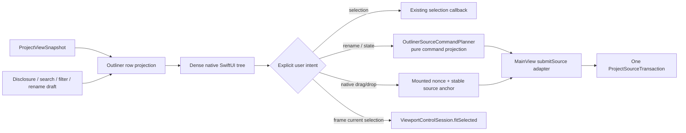
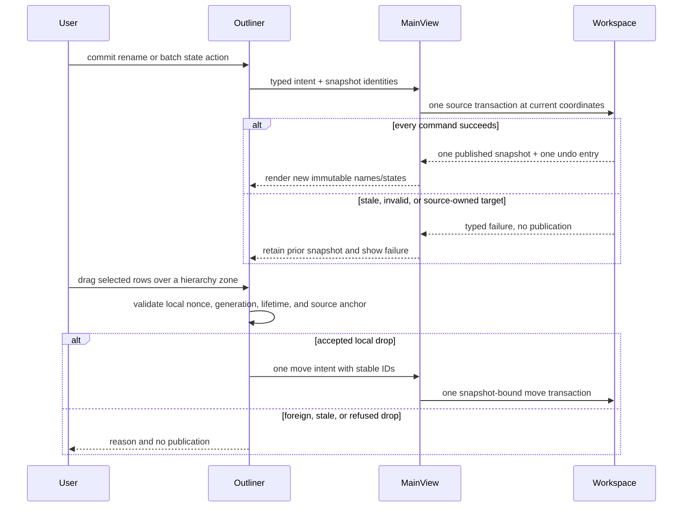

# RupaUI Outliner

## Purpose and Scope

`Outliner` is the native SwiftUI component that presents the immutable Product
scene hierarchy as a dense, Blender-inspired tree. It is a child of the
[RupaUI design](../DESIGN.md). Children: none.

The component covers scene navigation, disclosure, contextual filtering,
inline object-name editing, selection-aware visibility/lock actions, isolate,
show all, and forwarding Frame to the existing viewport control session.

## Responsibilities and Boundaries

The component owns row projection and transient UI state: expanded scene-node
IDs, search text, state filter, rename draft, focus, hover, and context-menu
presentation. `OutlinerSourceCommandPlanner` is a pure, stateless projection from
immutable Product metadata plus one validated Outliner intent to an ordered
`EditorCommand` list. The component emits that intent to `MainView`.

It does not own `DesignDocument`, object-name authority, source mutation,
transaction staging, undo, viewport camera state, geometry, feature-history
names, component-definition names, assets, or persistence.
`OutlinerSourceCommandPlanner` is neither a command executor nor an authority or
transaction engine: `MainView` still submits its result through the existing
snapshot-bound Workspace path. The component does not add duplicate, delete,
reparent, collection, or generic command-engine behavior. Native reparent
drag/drop is the one explicit exception: it emits a Core-owned move intent but
does not execute or stage that command locally.

## Related Designs

| Design | Relationship | Contract Used | Summary | Cautions |
|---|---|---|---|---|
| [RupaUI](../DESIGN.md) | parent | Snapshot presentation and Workspace intent boundary | Hosts the Outliner in the existing sidebar. | MainView remains the composition and command-routing owner. |
| [RupaCore](../../RupaCore/DESIGN.md) | depends on | Product hierarchy, object naming, visibility/lock and pattern ownership | Defines which source identity may accept each action. | UI availability is advisory; Core must revalidate every command. |
| [RupaKit integration](../../RupaKit/DESIGN.md) | used by | Immutable `ProjectViewSnapshot` and isolated source transaction | Publishes accepted source changes and one undo entry. | The component never creates a parallel document or transaction owner. |
| [RupaRendering](../../RupaRendering/DESIGN.md) | coordinates with | `ViewportControlSession.fitSelected` | Frames the current visible scene selection. | An applied camera state is not proof of a completed Metal frame. |

## Architecture

`OutlinerDropDelegate` is the native SwiftUI adapter for row and root drop
targets. It converts the transient `DropInfo.location` into a source-level
`OutlinerDropDestination` and owns no scene state. The mounted `Outliner`
keeps the captured drag session and target highlight in local `@State`; the
delegate only forwards provider tokens and resolved destinations back to that
owner.

## Contracts and Invariants

### Icon presentation

Visibility and lock controls use 11 pt glyphs inside the existing 20 pt hit
slots. MainView owns the set of rows with pending state transactions; Outliner
shows an hourglass and disables both state buttons until success or failure.
Committed metadata remains the only source of visibility and lock icons.
Failure clears pending state and uses the existing visible error reporting;
no optimistic source state or duplicate overlapping transaction is introduced.

Rows and their state controls use the parent-owned
[sidebar symbol contract](../DESIGN.md#sidebar-symbols). `OutlinerRow.systemImage`
is a pure presentation of the existing row kind: Body uses `cube`, Authored Mesh
uses `cube.transparent`, Sketch uses `pencil.and.outline`, Construction uses
`ruler`, Feature uses `gearshape`, and an unreferenced scene group uses `folder`.
Pattern roots (`square.grid.3x3`) and component instances (`square.stack.3d.up`)
take precedence over the ordinary kind icon. A row's name never selects its icon.
Visibility and lock symbols retain their current source-state meanings, labels,
and mutation gates. Leaf rows reserve disclosure alignment without showing an
inactive dot or announcing a nonexistent disclosure action. The existing small
disclosure and generated badge remain auxiliary to the main kind icon.
Outliner projection tests verify this mapping and unchanged row identity/state.

### Interaction

1. Rows retain the Product root/child order and stable `SceneNodeID`. A new
   document lifetime starts with only its scene roots expanded so object names
   are immediately visible; child groups remain user-controlled. Expansion
   is local to the document lifetime and metadata refreshes preserve the
   user's stored expansion set without auto-expanding new descendants. It
   never changes selection or source.
2. Name search is normalized and case-insensitive. A matching descendant keeps
   every ancestor needed for context. During an active search/filter, those
   ancestor paths render expanded without overwriting the user's stored
   expansion set.
3. The state filter has explicit all, visible, hidden, locked, and unlocked
   cases. It filters the row's source state and applies the same ancestor-
   preserving rule as name search; it never treats absence from a filtered view
   as deletion or deselection.
4. F2 and Rename are available only for one editable selected row. Return emits
   one normalized rename intent, Escape cancels without a command, and a typed
   failure leaves the published snapshot unchanged and the failure visible.
   Ordinary nodes, component instances, retained construction planes, and
   pattern roots route to their Core naming owners. A generic construction node
   without a `constructionPlaneID` remains an ordinary node. Generated pattern
   outputs, component definitions, and assets are read-only.
5. A context click on a selected row acts on the complete selection; a context
   click on an unselected row first makes it the sole selection. Show, Hide,
   Lock, and Unlock deduplicate targets and emit one ordered command list.
   `MainView` submits that list as one source transaction, so success is one undo
   entry and any stale, missing, invalid, or source-owned target causes no partial
   mutation.
6. Generated pattern outputs cannot accept individual visibility, lock, rename,
   or exact isolate actions. The owning pattern root remains actionable; the UI
   explains the refusal rather than silently widening the target to all outputs.
   Show All changes only independently controllable scene nodes, including
   pattern roots, and skips source-owned generated descendants.
7. Isolate makes the independently controllable selected rows visible and other
   independently controllable scene branches hidden in one source transaction.
   If the selection cannot be represented exactly because it contains a
   generated output, the action is unavailable with an explicit reason.
8. `MainView` supplies `canFrameSelection` from the existing mounted viewport
   session's `canFitSelected` state. Frame is enabled only when that value is
   true and the context row already belongs to the current selection. The
   Outliner emits the ID-free `frameCurrentSelection` intent, and `MainView`
   invokes the existing `fitSelected` operation against the session's current
   visible selection. It never respecifies scene-node IDs or chains an
   asynchronous selection change and fit in one callback; context-clicking an
   unselected row must settle selection before a later Frame action. Frame does
   not mutate the workspace ruler, Product source, undo history, persistence,
   or projection mode.
9. Component instances appear at their scene-tree positions rather than in a
   duplicate editable instance list. Component definitions and assets may remain
   read-only reference groups below the tree.
10. Native drag/drop is scoped to one mounted Outliner. A drag stores the
    current selection, `DocumentGeneration`, and an in-memory per-drag nonce;
    the `NSItemProvider` contains only that nonce. The enclosing document
    lifetime already recreates the mounted Outliner, so no second lifetime
    token is serialized or compared here. A drop is accepted only when its
    nonce resolves to the live local drag, generation still matches, and the
    source/target are independently movable. Upper/lower row zones resolve to
    source sibling IDs and the middle zone resolves to the row as a parent;
    filtered or rendered row indices are never used. A root footer resolves to
    `parentID == nil`.
11. Row drop targets show a thin insertion marker for sibling moves and a
    bounded parent highlight for middle-zone reparenting. The root footer is
    an explicit `Move to Scene Root` target and resolves to a nil parent.
    Highlight state is cleared when the target exits, the source generation or
    metadata changes, the drop completes, an AppKit drag session ends without
    a move, or the Outliner unmounts. A completed move keeps its nonce until
    the provider completion publishes or rejects the move intent.
12. An accepted drop emits one `.move` intent carrying captured IDs,
    `parentID`, `beforeSiblingID`, and expected generation. `MainView` performs
    the final snapshot-generation check and submits one existing source
    transaction containing Core's `moveSceneNodes` command. Foreign, stale,
    cancelled, cyclic, locked, generated, read-only, or invalid drops clear
    the local drag and report a reason without publishing source state.

## Runtime Flows

## State, Ownership, and Lifecycle

SwiftUI owns disclosure, filter, focus, edit-draft, and transient mounted drag
state for one document lifetime. `ProjectViewSnapshot` owns the immutable values displayed by rows;
`ProjectWorkspace` owns mutation and publication; Core owns Product names and
generated-output rules; `ViewportControlSession` owns camera state.

## Failure, Concurrency, and Constraints

Row projection and drop-target resolution are bounded by the already-published
scene-node count and perform
no CAD evaluation, Mesh validation, geometry traversal, file I/O, or detached
source mutation. Search/filter uses one hierarchy pass per input change and does
not recursively rescan descendants for every row. Each projection builds its
row lookup and independently mutable ID set once; row lookup and complete
selection admission do not repeatedly scan `allRows`. All UI state is
MainActor-isolated. Missing/stale IDs and unavailable viewport sessions remain
explicit failures or disabled actions, never successful no-ops. The drag token
is cleared on source-generation/metadata change, drop completion, and unmount;
no global drag registry or external data import is used.

## Verification and Change Impact

Pure component tests in `OutlinerTests.swift` verify stable hierarchy/order,
disclosure, ancestor-preserving search and each state filter, single/multi-
selection context rules, rename Return/Escape/failure, generated-output
availability, supplied Frame availability, selected-context admission, and the
ID-free `frameCurrentSelection` intent. The same file verifies exact owner routing,
complete target admission, deterministic deduplication/order, isolate/show-all
command sets, and explicit missing/invalid/generated-output refusal from
immutable metadata; it does not substitute for Workspace transaction tests.
The same file verifies nonce/generation admission, upper/lower/middle/root
drop-target mapping, filtered-anchor independence, and move-intent shape.
Core/Workspace tests verify naming-owner synchronization, uniqueness, identity
preservation, pattern refusal, atomic grouped state mutation, rollback, stale
coordinates, normalized same-name no-op without generation/evaluation/history,
same-name mirror repair, construction-plane routing, and one-step undo/redo.
Workspace integration coverage is owned by
[ProjectOutlinerTransactionTests.swift](../../../Tests/RupaKitTests/ProjectOutlinerTransactionTests.swift).
Signed-App verification must exercise the actual sidebar, keyboard focus,
menus, selection, tree expansion, failure feedback, undo, and fitted viewport
without writing the user's project.
