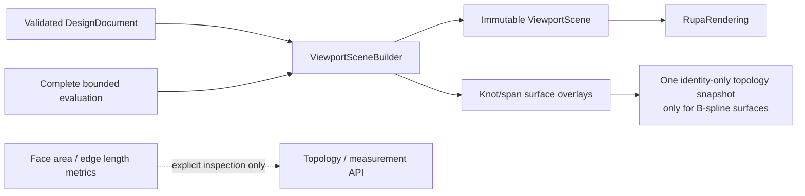
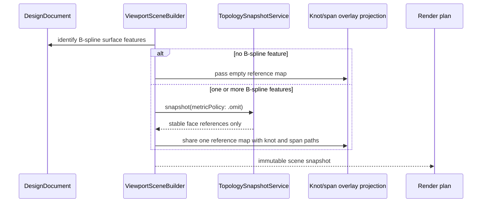

# RupaViewportScene

## Purpose and Scope

`RupaViewportScene` owns the immutable scene values and the synchronous
`ViewportSceneBuilder` projection used by the Rupa viewport. It is a child of
the [RupaKit package design](../../DESIGN.md) and has no child component
designs.

The module projects an already validated `DesignDocument` and its complete,
resource-admitted evaluation into viewport items, bounds, transforms, and
optional surface overlays. It does not own CAD or Mesh source authority,
project publication, package I/O, render-plan triangulation, presentation
fidelity, or render-task lifecycle.

## Responsibilities and Boundaries

The module owns:

- immutable viewport scene values and identity-bearing scene items;
- source/evaluation-aware scene construction and overlay projection;
- stable B-spline patch-face references used by knot and span overlays;
- bounded, synchronous scene projection without retessellation or render-plan
  preparation.

The module consumes validated Core source and evaluation contracts. It delegates
Mesh triangulation to `RupaGeometry` through the downstream render plan and
does not calculate face-area or edge-length metrics merely to identify an
overlay face. Measurement and inspection APIs own metric requests.

## Related Designs

| Design | Relationship | Contract Used | Summary | Cautions |
|---|---|---|---|---|
| [package design](../../DESIGN.md) | parent | Package dependency direction | Places scene projection between project evaluation and rendering. | This module is not a source or project authority. |
| [RupaCore design](../RupaCore/DESIGN.md) | depends on | Validated `DesignDocument`, Product metadata, and source identity | Supplies CAD source and retained scene navigation. | Scene references remain navigation/presentation values. |
| [RupaEvaluation design](../RupaEvaluation/DESIGN.md) | depends on | Complete purpose-selected bounded evaluation | Supplies immutable admitted presentation results. | Scene projection cannot widen limits or select a different fidelity. |
| [RupaRendering design](../RupaRendering/DESIGN.md) | used by | Immutable `ViewportScene` and snapshot identity | Consumes scene items for render-plan construction. | Rendering must not make overlay lookup a metric path. |
| [RupaGeometry design](../RupaGeometry/DESIGN.md) | coordinates with | Bounded source-order Mesh traversal | Owns render-time geometry triangulation. | Do not duplicate its topology or buffer-index logic here. |
| [RupaViewportScene tests](../../Tests/RupaViewportSceneTests) | verification owner | Scene projection and overlay behavior | Proves exact overlay references and build responsiveness. | Type existence is not runtime evidence. |

## Architecture

The builder resolves all B-spline patch-face references once per build before
constructing knot and span displays. The reference lookup is identity-only:
it needs stable face references and generated roles, not optional topology
metrics. The resulting map is passed to both overlay projections, so both
directions share the same immutable lookup result.

## Contracts and Invariants

1. A document with no `.bSplineSurface` feature performs zero
   `TopologySnapshotService` calls for surface knot/span overlay lookup.
2. A document with one or more `.bSplineSurface` features performs at most one
   lookup snapshot for both knot and span overlays. That snapshot is requested
   with the active object registry, current evaluation context, current
   generation, and `metricPolicy: .omit`.
3. Overlay lookup never requests face-area or edge-length metrics. Stable
   patch-face references, generated roles, and resulting geometry displays are
   unchanged by omitting those optional metrics.
4. References are filtered to actual B-spline feature IDs. A face from another
   feature cannot be assigned to a B-spline overlay.
5. A lookup or overlay evaluation failure is omitted by this builder according
   to the existing optional-overlay policy. The builder does not change source
   or evaluation authority and does not fabricate a successful overlay value.
6. Scene construction remains synchronous and bounded by the caller's existing
   request deadline. No unbounded topology metric evaluation is introduced on
   the viewport path.
7. `ViewportSceneBuilder` is a value type with no retained mutable cache. Source
   and evaluation ownership remain with their existing owners.
8. The scene is a single immutable projection of the published source and
   evaluation coordinates. It contains no LOD decision, render-preparation
   task, cache state, or second copy of project authority.
9. A scene item may reference only a Mesh admitted by the owning evaluation.
   Scene projection cannot truncate, silently omit required geometry, or
   retessellate an over-budget source.

## Runtime Flows

The builder then resolves evaluated body snapshots and normal scene items using
the existing generation/evaluation inputs. The downstream renderer consumes the
finished immutable scene and owns cancellable render-plan preparation.

## State, Ownership, and Lifecycle

`ViewportSceneBuilder` owns only invocation-local value maps. The returned
`ViewportScene` owns immutable scene values for its lifetime. The topology
snapshot used for overlay reference lookup is invocation-local and is not
persisted or retained as a second project source. Evaluation and source
lifetimes are governed by `RupaCore` and `RupaEvaluation`.

## Failure, Concurrency, and Constraints

The builder has no asynchronous state and does not perform I/O. It must use the
caller-provided object registry and evaluation coordinates so custom registries
and current snapshots resolve consistently. Overlay references are omitted by
this builder according to the existing optional-overlay policy; source and
evaluation authority remains unchanged.

Identity-only overlay lookup is required to avoid turning a torus or other
high-edge-count body into a synchronous face-area or edge-length measurement
operation. Evaluation resource limits remain owned by `RupaEvaluation`; render
preparation limits and cancellation remain owned by `RupaRendering`. A required
scene item is never dropped to make projection appear successful.

## Verification and Change Impact

| Invariant | Evidence |
|---|---|
| Zero calls without B-spline features | Focused scene-build regression with a torus/revolve document and bounded completion. |
| One shared identity-only lookup with B-spline features | Knot/span overlay tests compare exact stable references and use metric-free snapshot behavior. |
| No optional topology metrics | Core metric-policy test plus scene-build regression prove face-area and edge-length evaluators are not entered. |
| Geometry and stable references remain unchanged | Existing B-spline knot/span exact tests and scene snapshot identity checks remain green. |
| Bounded input authority | Boundary tests prove only evaluation-admitted Mesh enters the scene and that projection never retessellates, truncates, or selects fidelity. |
| Agent responsiveness | Focused test timing and the restored signed-App `sessions`/`attach`/viewport read path provide runtime evidence. |

Changes to source/evaluation identity or overlay reference contracts require
rechecking the Core, Evaluation, Rendering, and package designs. Changes to
scene-build work budgets require rechecking the Agent integration acceptance
evidence.
