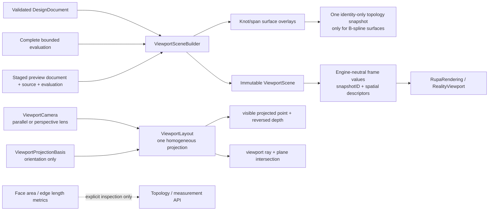
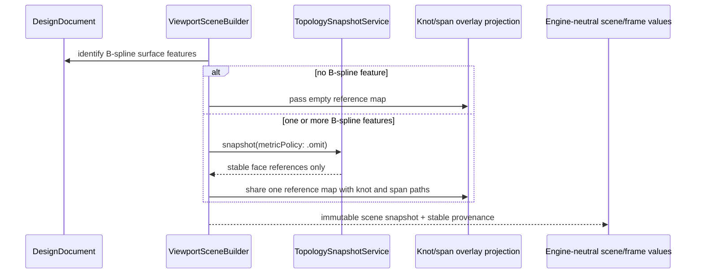

# RupaViewportScene

## Purpose and Scope

`RupaViewportScene` owns the immutable scene values and the synchronous
`ViewportSceneBuilder` projection used by the Rupa viewport. It is a child of
the [RupaKit package design](../../DESIGN.md) and has no child component
designs.

The module projects an already validated `DesignDocument` and its complete,
resource-admitted evaluation into engine-neutral viewport items, bounds,
transforms, and spatial overlay descriptors. The same projection accepts
either a published state or an explicitly supplied source-preview candidate.
It does not own CAD or Mesh source authority, project publication, package I/O,
RealityKit entities/resources/materials, presentation fidelity, or render-task
lifecycle.

RUPA-RK status: the downstream viewport is currently a migration hybrid.
`RealityViewportView` owns the RealityKit surface and native camera, while
SwiftUI `Canvas` still presents spatial overlays and legacy identity rendering
still supplies part of picking. This module remains engine-neutral and does not
claim ownership of that native integration; the complete downstream scene is
target behavior until RK-2 through RK-5 and RK-IV complete.

## Responsibilities and Boundaries

The module owns:

- immutable viewport scene values and identity-bearing scene items;
- source/evaluation-aware scene construction and overlay projection;
- stable B-spline patch-face references used by knot and span overlays;
- camera lens values, homogeneous world-to-clip projection, visible-point
  projection, and viewport-ray/plane unprojection;
- bounded, synchronous scene projection without retessellation or RealityKit
  resource/entity preparation.

`UniversalViewportScene.snapshotID` is the source/evaluation identity carried
into the rendering boundary. `RupaViewportScene` remains independent of
RealityKit and never creates an `Entity`, `MeshResource`, `Material`, collision
shape, camera component, or SwiftUI view. The downstream frame descriptor adds
the mounted viewport revision and overlay revision; those values are not
inferred from array contents. The RealityKit host may publish a frame only when
all three identities match the scene/resource graph it presents.

The module consumes validated Core source and evaluation contracts. It delegates
Mesh triangulation to `RupaGeometry` through the downstream render plan and
does not calculate face-area or edge-length metrics merely to identify an
overlay face. Measurement and inspection APIs own metric requests.

## Related Designs

| Design | Relationship | Contract Used | Summary | Cautions |
|---|---|---|---|---|
| [package design](../../DESIGN.md) | parent | Package dependency direction | Places scene projection between project evaluation and rendering. | This module is not a source or project authority. |
| [RupaCore design](../RupaCore/DESIGN.md) | depends on | Validated `DesignDocument`, Product metadata, source identity, and display tessellation resolution | Supplies CAD source, retained scene navigation, and the resolution a declared subdivision count draws a sketch curve at. | Scene references remain navigation/presentation values. Sketch display resolution is resolved here but owned there. |
| [RupaEvaluation design](../RupaEvaluation/DESIGN.md) | depends on | Complete purpose-selected bounded evaluation | Supplies immutable admitted presentation results. | Scene projection cannot widen limits or select a different fidelity. |
| [RupaRendering design](../RupaRendering/DESIGN.md) | used by | Immutable scene, `snapshotID`, camera semantics, and overlay values | Converts scene values into one matching RealityKit resource/entity frame. | Rendering must not make overlay lookup a metric path or turn RealityKit IDs into CAD authority. |
| [RupaGeometry design](../RupaGeometry/DESIGN.md) | coordinates with | Bounded source-order Mesh traversal | Owns render-time geometry triangulation. | Do not duplicate its topology or buffer-index logic here. |
| [Swift-CAD package](../../../swift-CAD/DESIGN.md) | depends on | Exact CAD document, topology reference, and evaluated value types | Supplies the CAD value types this module reads directly through its declared `SwiftCAD` dependency. | Scene projection never tessellates, evaluates, or selects kernel limits. |
| [RupaViewportScene tests](../../Tests/RupaViewportSceneTests) | verification owner | Scene projection and overlay behavior | Proves exact overlay references and build responsiveness. | Type existence is not runtime evidence. |

## Architecture

The builder resolves all B-spline patch-face references once per build before
constructing knot and span displays. The reference lookup is identity-only:
it needs stable face references and generated roles, not optional topology
metrics. The resulting map is passed to both overlay projections, so both
directions share the same immutable lookup result.

## Contracts and Invariants

### World-space navigation focus

`ViewportCamera.focus` is the optional world-space navigation target. An absent
focus requests initial framing from the layout bounds; the mounted camera owner
resolves and retains it before navigation. `ViewportLayout.renderOrigin` remains
the numerical coordinate origin, never the authority for an explicit focus.
Projection rows, CPU projection, depth, and view rays use the same camera focus.
The full viewport center looks at that focus when the screen offset is zero.
Chrome fitting insets are placement constraints, not camera state: changing
selection bars, badges or overlay panels must not change the resolved camera's
world-to-screen mapping, rays, visible height or perspective eye distance.
Only explicit fit requests translate the camera to place geometry inside the
current unobscured fitting rectangle. Input and annotation exclusion still use
the current chrome rectangles.

`ViewportCamera.referenceScale` is the retained points-per-meter scale at unit
zoom. Nil requests initial framing; the mounted owner resolves it once along
with focus. Subsequent geometry bounds affect precision and clipping, not
navigation scale. Explicit fit/reset/saved-frame requests may establish a new
reference. A finite positive reference is required. Model translation, resize,
removal and replacement must preserve projected stationary world points in
both lens modes; fit and anchored zoom remain effective.

Existing screen-offset camera inputs remain representable, but the mounted
camera owner converts navigation offsets to a world-space focus on the current
view plane and clears the offset. This is camera translation, not geometry or
construction-plane mutation. Non-finite focus or an unresolvable view-plane
intersection cannot be published as a successful navigation result.

Offset-focus projection/ray round trips and the Rendering target's mounted
RealityKit project/composed-ray/native-raycast tests prove that changing the navigation target
does not change mesh origins or make CPU and presented projection disagree. The Rendering design owns
the state transitions; this module owns their projection math.

`ViewportLayout.FittingInsets.fittingRect(in:)` is the shared viewport fitting
rectangle for layout and camera fit. Rendering uses this public geometry value
instead of duplicating chrome inset normalization. Camera-fit tests verify that
projected geometry stays within the same rectangle used by the actual native
RealityKit camera layout.

`ViewportProjectionBasis` owns a finite rigid camera orientation, not an
arbitrary two-dimensional projection. Its screen-horizontal and screen-vertical
directions form an orthonormal right-handed frame with the view normal. The
axis-front presets are true CAD axis views: the two displayed-plane axes retain
unit pixel scale and the depth axis has no artificial `0.18` screen component.
An orientation transition follows the shortest quaternion rotation between its
exact rigid endpoints; component-wise interpolation that creates skew or scale
is not a valid camera basis. Built-in basis constructors guarantee this
contract. An externally supplied non-finite, degenerate, non-orthogonal, or
non-unit frame is refused at the throwing camera-state boundary and cannot be
silently normalized or published.

`ViewportCamera` owns the independent `ViewportCameraProjection`: `.parallel`
or `.perspective(fieldOfViewRadians:)`, with `.parallel` as the default. A
perspective field of view must be finite and strictly between zero and pi.
`ViewportCameraProjection.standardPerspective` is the single lower-owned UI/API
default; callers and design documents do not repeat its operational field-of-
view value. Changing lens mode preserves the rigid basis, pan, zoom, focus, and
target-plane pixel scale; it does not change source, selection, display mode, or
shading.

`ViewportLayout` is the engine-neutral fallback math owner for off-scene
projection descriptors and exact CPU tolerance calculations. The live
RealityKit path uses the mounted native camera component and
`RealityViewCameraContent.project(_:)` as presentation authority. Its view ray
is composed by the
[RealityViewport mounted-camera query contract](../RupaRendering/RealityViewport/DESIGN.md#contracts-and-invariants)
from native project samples and the same camera transform; raw mounted
`ray(through:)`, `unproject`, and `hitTest` are not a second authority.
`ViewportLayout` must agree with this contract and may not create a second live
camera. Both lens modes use a symmetric native lens. The layout supplies the
full-viewport vertical span required to derive RealityKit's built-in vertical
field of view; RealityKit's orthographic scale is the corresponding vertical
half-extent. An explicit fit to a center displaced from the viewport center uses
a finite camera right/up-plane translation, normalized by the navigation owner
into its world-space focus; it is never encoded as lens skew, an off-center
projection term, root translation, or geometry mutation.
This translation preserves target-plane placement and pixel scale. Perspective
objects away from the target plane follow native pinhole parallax;
compatibility with the former all-depth constant screen shift is not an
invariant.

When a native query is unavailable for a bounded CPU-only operation, the layout
produces one Double-precision homogeneous projection relative to the retained
render origin using the same rigid frame, symmetric lens, and camera-plane
translation. Perspective uses an infinite far plane and reversed depth: the
clear value is zero, a greater value is nearer, and the near boundary is
`w >= 1.0e-6`. Its eye distance is
`viewportSize.height / (2 * targetPlanePixelsPerMeter *
tan(requestedVerticalFOV / 2))`. The FOV describes the full viewport independently
of transient chrome, so the target plane
has no size jump when the lens is toggled. Parallel projection
preserves target-plane screen placement and also reports greater depth as
nearer. Float conversion for native RealityKit
resources occurs only after finite/range validation and local-origin conversion.

The old total `ViewportLayout.project -> CGPoint` assumption is not valid for a
perspective camera. Runtime consumers migrate to an optional visible projection:
a point strictly below the near boundary returns no screen point. Point overlays
omit that point; line and polygon owners clip crossing primitives against the
layout's near plane before projecting their retained portion. No consumer may
mirror a behind-eye point, clamp a homogeneous denominator, substitute NaN, or
silently reuse the parallel formula. A viewport point uses RealityViewport's
native-project-derived ray when mounted; off-scene layout resolution uses the
same world-ray contract. Grid and spatial overlay descriptors intersect that
ray with the requested plane and return `nil` when the ray is parallel to that
plane or the intersection is non-finite. They contain world geometry and
provenance, never a Canvas `Path` or raster texture.

Scene placement follows the [Core matrix contract](../RupaCore/DESIGN.md#scene-placement-matrix-convention).
The shared transform utility is the only legacy overlay point/vector/composition
implementation. Builder and layout call it instead of retaining separate
column-major formulas. Presentation geometry and CAD selection overlays must
agree on the same row-major source values.

1. A document with no `.bSplineSurface` feature performs zero
   `TopologySnapshotService` calls for surface knot/span overlay lookup.
2. A document with one or more `.bSplineSurface` features performs at most one
   lookup snapshot for both knot and span overlays. That snapshot is requested
   with the active object registry, current evaluation context, current
   generation, and `metricPolicy: .omit`.
3. Overlay lookup never requests face-area or edge-length metrics. Stable
   patch-face references, generated roles, and resulting geometry displays are
   unchanged by omitting those optional metrics.
4. References are filtered to actual B-spline feature IDs. A face from another
   feature cannot be assigned to a B-spline overlay.
5. A lookup or overlay evaluation failure is omitted by this builder according
   to the existing optional-overlay policy. The builder does not change source
   or evaluation authority and does not fabricate a successful overlay value.
6. Scene construction remains synchronous and bounded by the caller's existing
   request deadline. No unbounded topology metric evaluation is introduced on
   the viewport path.
7. `ViewportSceneBuilder` is a value type with no retained mutable cache. Source
   and evaluation ownership remain with their existing owners.
8. The scene is a single immutable projection of the source and evaluation
   values supplied for one invocation. For a source preview those values are
   the canonical staged candidate only; the scene contains no publication
   coordinate, `ProjectViewSnapshot`, LOD decision, render-preparation task,
   cache state, or second copy of project authority.
9. A scene item may reference only a Mesh admitted by the owning evaluation.
   Scene projection cannot truncate, silently omit required geometry, or
   retessellate an over-budget source.
10. Each build selects one explicit evaluation policy. Under `.suppliedOnly`
    the builder projects only the evaluation the caller supplied and never
    evaluates a document itself; under `.evaluateOnDemand` it may evaluate on
    the caller's thread when the caller supplied no matching evaluation. A
    caller that owns evaluation lifetime outside `MainActor` selects
    `.suppliedOnly`, so kernel evaluation can never re-enter that caller's
    thread through scene construction. `.evaluateOnDemand` remains the default
    for callers that hold no evaluation authority.
11. Native RealityKit projection, the mounted composed native collision query,
    and any bounded CPU fallback consume the same camera focus, basis, lens, near-plane, and
    local-origin semantics. A primitive crossing the perspective near plane is
    clipped to the same retained polygon before CPU tolerance testing; no
    fallback may mirror behind-camera geometry or create a second live camera.
12. Grid generation and spatial overlay descriptors use the mounted RealityKit
    project-derived camera query when available. Off-scene construction uses the same layout
    projection and ray/plane contract and does not retain the former affine
    direction/determinant implementation.

### CAD sub-shape identity on a body scene item

A body scene item carries two independent things: the geometry the viewport
draws for it, and the prepared CAD names its sub-shapes can be selected by. The
second is owned here and is not derived from the first.

`BodyDisplaySnapshotService` names a snapshot for every body feature the
evaluation produced, and that snapshot carries the kernel mesh together with
`Topology.meshFaceRuns`, which maps each contiguous run of emitted triangles to
the `SelectionComponentID.generatedTopology` of the face that generated it.
Those component IDs are the kernel's own stable sub-shape names. Whenever a
snapshot exists for a feature, the body item built from that feature carries the
snapshot's mesh and `ViewportBodyTopology(snapshot.topology)`. The two are
written together or neither is written, because a run list indexes triangles of
that mesh and is meaningless without it.

This holds for the branches that draw the body as a profile-derived box as well
as for the branches that draw the evaluated mesh. An extrude and a straight
prism sweep display a box built from the sketch profile and the resolved depth,
because that box is what an interactive depth or face drag can move before the
kernel has re-evaluated. Choosing that display geometry does not make the box
the body's identity: the feature still has an evaluated snapshot, and reading
only `bodyID` and `subshapeID` from it while dropping the mesh and the face runs
would deliver the most common CAD body to the viewport with no CAD sub-shape
name at all, leaving the mounted frame's own triangles nothing to resolve to.

The projected `body.face.*`, `body.edge.*`, and corner component IDs are the
legacy pick index's names for sub-objects it derives from a bounding box. They
remain owned by that resolver and are never written into a scene item. A
consumer that must reach a `BodyFace` from a selection resolves a generated
topology component through `GeneratedTopologySelectionResolver`, which is the
single owner of that direction, so direct editing reaches the same face under
either name.

A face that evaluation gave no stable sub-shape identity contributes no run,
and its triangles resolve to no component. That is a truthful absence of a CAD
name, not a body without prepared topology.

### Sketch curve display resolution

A sketch scene item's circle and arc primitives carry the number of segments the
frame divides them into. Which count a sketch declares, which of its counts
apply, and what is drawn where it declares none are owned by the
[display tessellation resolution contract](../RupaCore/DESIGN.md#display-tessellation-resolution).
This module resolves that contract for a sketch feature and writes the resulting
count onto each primitive it builds.

The count travels on the primitive rather than beside it. The frame draws a
sketch primitive and the native pointer query measures against the points that
same drawing produced, so a resolution handed to one of them separately could be
handed to the other differently and leave a pointer measured against a curve
nobody drew. A count the primitive carries cannot diverge that way, because both
read the value out of the primitive they were already given.

Every rebuild of a primitive carries the count through unchanged: a scene-tree
transform and a drag override both replace the geometry a primitive describes,
not the resolution it is drawn at. A drag that widens an arc's span therefore
keeps the count the last built scene resolved, and the next build resolves the
count the wider span earns. Recomputing it mid-drag is not available here in any
case, since an override is applied without the document or the object registry
the declaration is read from.

A sketch feature with no scene-node object, or whose object declares no count for
an arc the sketch holds, is built at the frame's own undeclared resolution. That
is a sketch whose schema names nothing to draw it by, not a resolution this
module failed to find.

## Runtime Flows

The builder then resolves evaluated body snapshots and normal scene items using
the existing generation/evaluation inputs. `RupaRendering/RealityViewport`
consumes the finished immutable scene and owns cancellable RealityKit resource
and entity preparation. A preview scene is discarded by its caller when the
preview is cancelled, stale, or replaced; the builder never retains it.

## State, Ownership, and Lifecycle

`ViewportSceneBuilder` owns only invocation-local value maps. The returned
`ViewportScene` owns immutable scene values for its lifetime. The topology
snapshot used for overlay reference lookup is invocation-local and is not
persisted or retained as a second project source. Evaluation and source
lifetimes are governed by `RupaCore` and `RupaEvaluation`.

## Failure, Concurrency, and Constraints

The builder has no asynchronous state and does not perform I/O. It must use the
caller-provided object registry and evaluation coordinates so custom registries
and current snapshots resolve consistently. Overlay references are omitted by
this builder according to the existing optional-overlay policy; source and
evaluation authority remains unchanged.

Identity-only overlay lookup is required to avoid turning a torus or other
high-edge-count body into a synchronous face-area or edge-length measurement
operation. Evaluation resource limits remain owned by `RupaEvaluation`; render
preparation limits and cancellation remain owned by `RupaRendering`. A required
scene item is never dropped to make projection appear successful.

Invalid field of view, non-finite or unrepresentable projection coefficients,
points outside the perspective near half-space, and ray/plane degeneracy are
explicit projection failures. They never become mirrored geometry, default
parallel projection, or a fabricated canvas point.

## Verification and Change Impact

| Invariant | Evidence |
|---|---|
| Zero calls without B-spline features | Focused scene-build regression with a torus/revolve document and bounded completion. |
| One shared identity-only lookup with B-spline features | Knot/span overlay tests compare exact stable references and use metric-free snapshot behavior. |
| No optional topology metrics | Core metric-policy test plus scene-build regression prove face-area and edge-length evaluators are not entered. |
| Geometry and stable references remain unchanged | Existing B-spline knot/span exact tests and scene snapshot identity checks remain green. |
| Bounded input authority | Boundary tests prove only evaluation-admitted Mesh enters the scene and that projection never retessellates, truncates, or selects fidelity. A source-preview test proves the candidate document/source/evaluation produce the same scene geometry and visibility without a project snapshot. |
| Explicit evaluation policy | A `.suppliedOnly` build with no matching supplied evaluation performs zero evaluations; the same input under `.evaluateOnDemand` evaluates, proving the policy is observable rather than declarative. |
| Rigid camera orientation | True axis-front endpoint tests prove zero projected depth-axis component and unit displayed-plane scale; quaternion-transition tests prove exact endpoints, shortest continuous rotation, orthonormality throughout, and typed refusal of invalid externally supplied frames. |
| Parallel/perspective projection | Exact target-plane continuity and off-center fitting placement, native perspective parallax, optional behind-near projection, finite coefficient, off-scene point/ray/plane round trips, and Rendering-owned mounted native-project/composed-ray round trips. No test requires the removed all-depth lens-shift behavior. |
| Shared clipping and depth | Near-crossing triangle/segment fixtures prove retained clipping and CPU screen/depth results; RealityKit GPU projection/depth parity is owned by RupaRendering. |
| Grid projection | Parallel and perspective grid fixtures use the RealityViewport native-project-derived ray contract when mounted and the layout ray/plane contract off-scene, rejecting a parallel intersection without a second live camera. |
| Frame identity | Rendering tests prove `snapshotID`, viewport revision, and overlay revision cannot be mixed in one displayed or hit-testable scene. |
| CAD sub-shape identity on every evaluated body | A scene built from a document whose body is an extrude carries the evaluated snapshot's mesh and a non-empty `meshFaceRuns` whose component IDs are generated-topology names, and a triangle index inside a run resolves to that face; a feature with no evaluated snapshot carries neither mesh nor topology, proving the two are written together. |
| Declared sketch display resolution | A scene built from a circle sketch whose object declares a side-segment count carries that count on the built primitive, a slot declaring a full-turn count carries the half-turn share of it on each cap arc, and a sketch declaring no count for an arc it holds carries the undeclared resolution's counts. |
| Agent responsiveness | Focused test timing and the restored signed-App `sessions`/`attach`/viewport read path provide runtime evidence. |

Changes to source/evaluation identity or overlay reference contracts require
rechecking the Core, Evaluation, Rendering, and package designs. Changes to
scene-build work budgets require rechecking the Agent integration acceptance
evidence.
