# Codex complex-geometry drawing feedback

## Outcome

Codex created a parametric wave lantern composed of 57 independently evaluable solids:

- 2 circular end plates
- 1 central structural core
- 12 inner columns
- 18 middle wave columns
- 24 outer wave columns

The final model measures 76 mm × 76 mm × 94 mm and contains 1,432,752 exported triangles.

```mermaid
flowchart LR
    A["Initial helical loft"] --> B["Loft diagnostics"]
    B --> C["Fabricable ruled loft"]
    C --> D["Evaluation contract defect"]
    D --> E["57-solid wave lantern"]
    E --> F["Materialized mesh evaluation"]
    F --> G["STL export and independent readback"]
    G --> H["Live viewport profiling"]
    H --> I["Preview/exact fidelity boundary"]
    I --> J["Idle and interaction verification"]
    J --> K["GPU-only 3D rendering and picking"]
    K --> L["Native input / Metal ownership boundary"]
    L --> M["Scroll-path and failure-contract verification"]
```

## Iteration record

| Iteration | Observed problem | Change | Verification |
|---|---|---|---|
| 1. Smooth helical loft | Manual seam indices produced a mixed-direction section stack. Automatic seam selection passed dry-run, but the loft did not produce a usable mesh in the active evaluation subset. | Suppressed the smooth loft and tried a ruled, fabrication-oriented loft. | Source topology existed, but `eval` and `mesh` still returned no materialized body. The failure was not treated as success. |
| 2. Reliable primitive composition | The loft workflow was too dependent on unsupported or incomplete downstream evaluation behavior. Creating many features through repeated file-mode commands was also slow. | Reframed the design as a complex composition of 57 cylinders and discs with sinusoidal column heights. | Validation passed; measurement found 57 solids and 105,355.822912 mm³; topology found 57 bodies, 342 faces, 684 edges, and 456 vertices. |
| 3. Forward-contract compilation | The integrated Swift-CAD branch introduced `Curve3D.certifiedIntersection`, making three Rupa switches non-exhaustive. | Added explicit behavior to surface-length analysis, topology summaries, and pattern-path sampling. The pattern fallback remains marked as incomplete with a typed failure contract. | `swift build --product rupa` completed successfully. |
| 4. Evaluation and export | `modelingDefault` requested deferred artifacts even though its public contract and existing regression test require meshes. As a result, valid BRep geometry was reported as zero evaluated and zero meshed bodies. | Restored the default evaluation policy to materialized artifacts. The performance benchmark keeps its explicit deferred policy. | `eval` reports 57 bodies; `mesh` reports 57 bodies, 1,433,322 vertices, and 1,432,752 triangles; STL export produced a 71,637,684-byte file. |
| 5. Independent visual check | The Mac was locked, so direct Rupa GUI inspection could not proceed. | Read the exported STL independently and reconstructed a solid preview from all 57 verified mesh bounds. | STL header reports 1,432,752 triangles; independent bounds are 76 mm × 76 mm × 94 mm; the preview shows the end plates, core, and wave-height column layers. |
| 6. First viewport optimization attempt | The renderer projected every triangle on the CPU, issued a separate fill and stroke for every triangle, and used an always-running animation timeline. | Batched triangle subpaths per body, paused the timeline outside projection transitions, and added an interactive tessellation policy to the evaluation scheduler. | This was not sufficient. The running app still contained 1,432,752 display triangles because the document-open path had not created a current evaluation. Reporting success at this point was incorrect. |
| 7. Runtime data-flow correction | `ApplicationRoot.openDocument` created an `EditorSession` without evaluating it. `ViewportSceneBuilder` then silently built display snapshots with `CADPipeline.modelingDefault`, materializing the exact export mesh inside the rendering layer. This bypassed the scheduler and made the preview policy ineffective. | Evaluate the opened session immediately with the interactive scheduler and make the scene-builder fallback explicitly use `CADPipeline.interactivePreviewDefault`. Keep `CADPipeline.modelingDefault` as the exact modeling/export path. | The live session now contains 14,592 triangles across 57 bodies, while file-mode exact evaluation still produces 1,432,752 triangles and identical 76 × 76 × 94 mm bounds. The open app idles at 0.0% CPU; a real canvas pan returned in 164 ms. |
| 8. GPU-only 3D path | Even after reducing preview geometry, visible body meshes were still projected and converted into SwiftUI `Path` objects on the CPU. Identity picking also expanded a body mesh into CPU-projected triangle commands. The earlier change reduced workload but did not fix rendering ownership. | Replace body drawing with an `MTKView` renderer. Upload each mesh once, cache `MTLBuffer` objects by mesh storage identity, update only camera/model uniforms during navigation, and perform transform, projection, clipping, back-face culling, depth testing, fill, wireframe, and identity rasterization on the GPU. Remove the CPU mesh-triangle projection and cache path. | The app build passed, and GPU identity tests showed one mesh draw item with zero CPU-projected body triangles. This still did not solve scroll because input/state ownership had not been replaced. |
| 9. GPU-only was not enough | Wheel events still mutated SwiftUI-facing camera presentation and crossed parent callbacks. Per-face and per-edge transparent Buttons produced a topology-sized responder/accessibility tree. The renderer was GPU-backed, but its orchestration remained CPU- and SwiftUI-bound. | Introduce a non-observable `ViewportNavigationCoordinator`, remove per-face/per-edge SwiftUI Buttons, move the infinite grid to a procedural Metal shader, and add object-level offscreen culling before draw encoding. | A sampled corrected scroll stack contains `InputView.scrollWheel → Viewport.panCanvas → ViewportNavigationCoordinator.setCamera → ViewportMetalRenderer.update(layout:)` and excludes `MainView.body`, workspace bounds, scene creation, identity work, and GPU waits. |
| 10. Separate native wrappers remained an unstable boundary | Input and `MTKView` were still separate representables, navigation completion could publish too often, and hover rebuilt identity plans on the main actor before an asynchronous GPU wait. | Make one AppKit container own both input and `MTKView`; debounce navigation completion to 140 ms idle; coalesce hover; build an immutable identity plan only at low-frequency presentation updates; execute point sampling in a worker actor; read one 4-byte pixel. | 10,000 camera updates produced zero Observation changes. A 100-event wheel burst produced 100 native callbacks, zero immediate presentation syncs, and one idle sync. Hover readback is 4 bytes instead of 307,200 bytes at 320×240. |
| 11. Hidden fallback violated GPU ownership | Click and rectangle selection silently switched to projected CPU hit testing when Metal was unavailable, over budget, or returned an invalid buffer. | Replace the fallback with a typed `ViewportIdentityHitResolver.ResolutionError`; callers log the failure and stop the interaction. | A focused test forces Metal unavailability and verifies the exact typed error plus `failedAfterRendererUnavailable`; no CPU result is returned. The final app scheme builds, and all six native-navigation contract tests pass. |

## Usability feedback

| Area | What was difficult | Recommended improvement | Status |
|---|---|---|---|
| Loft capability discovery | A loft could pass source validation while still producing no usable preview mesh. | Add an operation postcondition that distinguishes source topology, evaluated BRep, and materialized mesh. Surface this in dry-run output. | Partially mitigated by verifying all three layers. |
| Loft seam control | Manual seam indices fail as a complete list, but the CLI does not visualize which adjacent sections reverse direction. | Return per-section seam orientation and highlight the first conflicting pair. | Open. |
| Batch modeling | Repeated file-mode mutations reload and save the document, making a 57-solid construction take about one minute. | Provide an atomic batch transaction with one load, one evaluation, and one save. | Open. |
| Evaluation defaults | A performance-oriented deferred policy silently leaked into UI, CLI summary, and export paths. | Keep deferred evaluation opt-in and preserve materialized artifacts as the modeling default contract. | Fixed and verified. |
| Fidelity ownership | The scene builder was allowed to evaluate missing geometry using the exact modeling default. This hid an expensive cross-layer fallback inside rendering and bypassed live-session scheduling. | Give live preview and exact output explicit pipeline constructors, evaluate during document open, and make every rendering fallback choose preview fidelity explicitly. | Fixed and verified on the running app. |
| Tessellation size | Each simple cylinder generated about 25,000 triangles, producing a 68 MB STL for a visually modest model. | Keep exact tessellation for output, but use a bounded interactive preview policy for display and report estimated output triangle count before export. | Display side fixed; pre-export estimate remains open. |
| 3D rendering ownership | Immediate-mode Canvas drawing still made the CPU project every mesh vertex and construct body paths. Batching reduced calls but preserved the wrong architecture. | Make Metal the only body-mesh and body-picking renderer. CPU work is limited to command encoding, buffer lifetime, scene metadata, and uniforms; it must not transform, project, clip, cull, depth-test, or rasterize 3D triangles. | Fixed in the production viewport and identity-picking paths. The old CPU section clipper is deprecated and has no production caller; it remains only as an analysis fixture pending GPU-readback differential tests. |
| Navigation ownership | Replacing only the renderer left high-frequency camera propagation inside SwiftUI. | Treat input, camera, layout, and Metal redraw as one native subsystem; publish to SwiftUI only at a semantic settle boundary. | Fixed. Wheel callbacks do not publish Observation changes, and one idle completion represents an entire burst. |
| Native surface composition | Two representables made responder ordering and update ownership hard to reason about. | Let one `NSViewRepresentable` return one container holding both the `MTKView` and its input view. | Fixed. Input teardown cancels pending tasks and clears handlers; the Metal connection uses a token to avoid disconnecting a replacement. |
| Hover responsiveness | Moving the GPU wait off-main was insufficient while the identity plan was still rebuilt on MainActor for every pointer event. | Prebuild a presentation-scoped immutable plan, coalesce pointer events, suppress hover during scroll, and sample through the worker actor. | Fixed and covered by coalescing and 4-byte readback tests. |
| Picking failure semantics | GPU errors were silently converted to CPU-projected hits, hiding capability and budget failures. | Return a typed failure and let the caller decide whether to retry or stop. | Fixed; forced device-unavailable test returns the typed error and no CPU hit. |
| Test discoverability | `RupaCoreTests` is not present in the workspace test schemes, and the first filtered command executed zero tests without failing the build. | Register the core test target and fail CI when the selected-test count is zero. | Open. |
| Debug test stack | Other heavy Rupa CLI tests can still overflow the approximately 544 KB Swift Testing worker stack in `DesignGraph.validateOperationContract`. | Split the operation validation switch into small operation-family validators with bounded stack frames. | Open, but the new focused live-preview regression test passes independently. |
| Zoom automation | The available UI driver cannot inject a modifier-held wheel event or magnification gesture. | Add an accessibility zoom action or deterministic input-injection test surface. | Partially mitigated: the final app's Visible field was changed from 1 m to 120 mm, exercising the same camera-scale uniform update and GPU redraw path. Native gesture latency still needs an instrumented input test. |

## Verification matrix

| Layer | Expected | Actual | Result |
|---|---:|---:|---|
| Source validation diagnostics | 0 errors | 0 errors | Pass |
| Solid measurement count | 57 | 57 | Pass |
| Topology body count | 57 | 57 | Pass |
| Evaluation body count after fix | 57 | 57 | Pass |
| Mesh body count after fix | 57 | 57 | Pass |
| STL triangle count | Greater than 0 | 1,432,752 | Pass |
| STL bounds | 76 × 76 × 94 mm | 76 × 76 × 94 mm | Pass |
| Live preview body count | 57 | 57 | Pass |
| Live preview triangle count | Much lower than exact output | 14,592 (98.98% reduction) | Pass |
| Exact output after preview fix | 1,432,752 triangles and unchanged bounds | 1,432,752 triangles; 76 × 76 × 94 mm | Pass |
| Idle CPU with document open | No continuous rendering load | 0.0% sampled | Pass |
| Final GPU build idle CPU | No continuous body rasterization on CPU | 0.1–0.3% across five samples | Pass |
| Real canvas pan dispatch | Interactive | 164 ms | Pass |
| Focused `xcodebuild test` | 1 test, 0 failures | 1 test passed, 0 failures | Pass |
| GPU identity output | Body mesh remains GPU-native; readable ID is produced | 1 mesh draw item, 0 CPU body polygons, non-background ID | Pass |
| Final app GPU viewport | 57 bodies visible after scale change, no renderer error | Visible at 120 mm range, no failure overlay | Pass |
| Native zoom gesture latency | Interactive | Driver cannot emit required gesture | Not directly measured |
| Camera update isolation | 10,000 updates without SwiftUI Observation | 10,000 updates, 0 Observation changes | Pass |
| Wheel burst publication | No per-delta presentation sync | 100 native callbacks, 0 immediate syncs, 1 idle sync | Pass |
| Offscreen object culling | Reject object outside viewport before encoding | Focused resolver test rejects distant bounds | Pass |
| Hover burst coalescing | Resolve only latest pointer | 100 scheduled values resolve only value 99 | Pass |
| Hover identity readback | One pixel | 4 bytes (`UInt32`) | Pass |
| GPU failure contract | No projected CPU fallback | Exact typed device-unavailable error | Pass |
| Native navigation focused suite | All changed-path tests pass | 6 passed, 0 failed | Pass |
| Full package parallel suite | Runner remains stable | Independent Swift Testing runner crash after 132–137 passes, also with new suite excluded | Blocked by test runner |

## Remaining uncertainty

The final geometry, exact export, live-session preview mesh, Metal body renderer, GPU identity renderer, and native navigation contract are verified through their actual implementation paths. Direct UI gesture timing is intentionally not claimed: the implementation was completed and verified at the code boundary before any further screen operation, and the available driver cannot emit the required native gesture deterministically. The CPU still performs Metal command encoding, buffer lifetime, constant-time layout math, scene metadata, and 2D edit/chrome annotation work; it performs no production body-triangle transformation, projection, clipping, depth testing, or rasterization. The full parallel package runner crash remains a separate verification-infrastructure issue.
