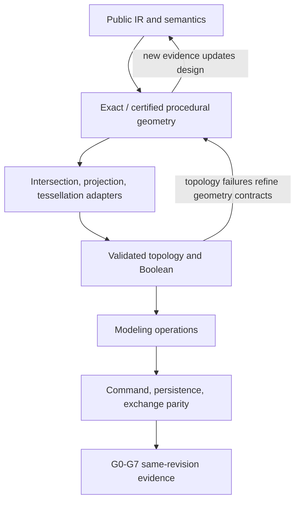
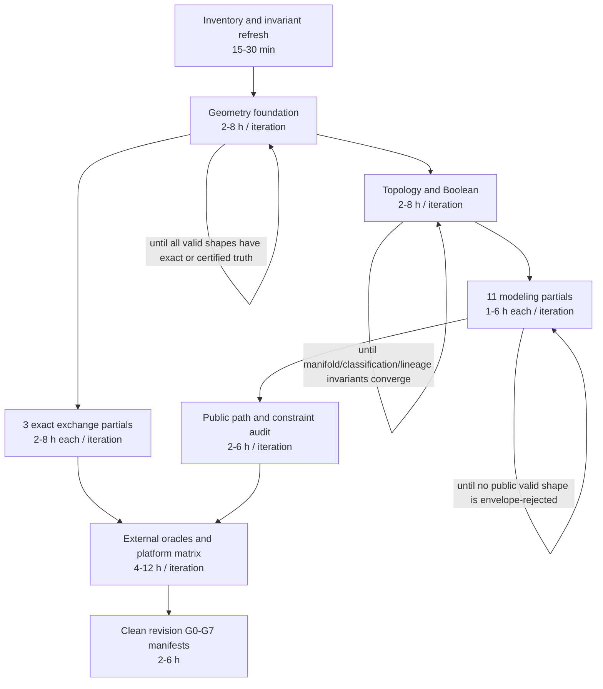

# Analysis Strategy

## Task structure

The analysis combines an architecture diagnosis with an implementation program. The decision question is binary: whether every public contract is implemented over its full finite valid domain and whether all eight gates pass on one clean tested revision. Local feature tests and development envelopes remain diagnostic evidence only.

## Key layers and categories

| Layer | Categories |
|---|---|
| Context | Product goal, exactness policy, package graph, public pre-v1 contract |
| Situation | Capability counts, gate counts, public routes, current implementations, tests and history |
| Operation | Agent command path, evaluator path, geometry/topology path, persistence/exchange path, verification path |
| Problem | Unsupported shape envelopes, duplicated policy gates, uncertified approximations, missing evidence |
| Issue | Geometry vocabulary gaps, responsibility leakage, incomplete algorithms, incomplete external validation |
| Solution | Certified procedural geometry foundation, package-owned laws/adapters, capability completion sequence, evidence automation |
| Outcome | Full-domain behavior, 67/67 or updated N/N support, 8/8 same-revision gates, reproducible agent-driven CAD |

## Decomposition strategy

Use a dependency-first system decomposition rather than operation-by-operation patching:

Each iteration records a prior hypothesis, a new observation, the confidence update, and the next highest-information check. Source declarations alone are never treated as behavioral evidence.

## Framework application

- Root-cause tree: distinguish public semantic gaps, representational gaps, algorithm gaps, topology gaps, and verification gaps.
- Dependency inversion audit: identify which package owns meaning, geometry, topology, orchestration, and adapters.
- End-to-end contract matrix: map each public input through evaluator, geometry truth, B-rep, lineage, persistence, builder/agent parity, and exchange.
- Bayesian investigation: prioritize observations that can invalidate an architectural hypothesis, especially actual dispatch paths and removed historical implementations.
- Binary acceptance model: keep local implementation activity separate from capability and gate completion.

## Evidence-report design

The final report must make five patterns visually auditable:

1. Capability status by domain before and after the work.
2. G0-G7 status and evidence completeness on the tested revision.
3. Package responsibility and dependency direction.
4. Public-contract-to-runtime-to-test/external-oracle coverage.
5. Remaining risk and unresolved uncertainty, if any.

## Chartable data requirements

- Capability counts by domain and status.
- Public route counts and one-to-one primary Capability ID mapping.
- Unsupported-envelope occurrences by operation, error code, and concrete execution branch.
- Test and external-oracle outcomes with revision, command, duration, and artifact hashes.
- Package imports and owned type counts for responsibility-boundary checks.
- Benchmark and allocation/copy measurements for performance-sensitive paths.

## Dependency plan and timing model

Times are estimates per converged iteration, not deadlines.

The critical path is geometry foundation → topology/Boolean → modeling completion → same-revision external verification. Repetition converges only when the full public-domain matrices have no unsupported shape envelope and all required behavioral evidence succeeds.

## Revision history

- 2026-08-21: Initial strategy created after confirming 67 capabilities, 14 partial entries, 75 public routes, 515 fixture bindings, and 0/8 formal gates.

